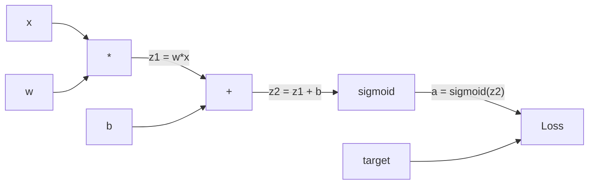
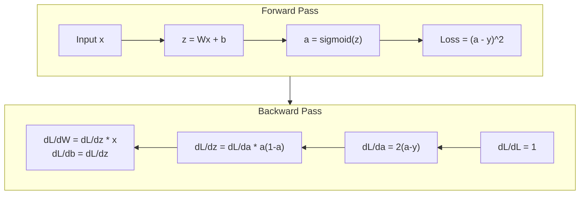
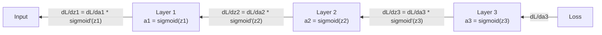

# Propagação de volta do zero para a propagação de volta do zero

> A backpropagation é o algoritmo que torna possível a aprendizagem. Sem ela, as redes neurais são apenas caros geradores de números aleatórios.

> A contra-direção da disseminação é tornar a aprendizagem possível. Sem ela, a rede neuronal é apenas um caro gerador de números aleatórios.

> **【中文解读】**A transmissão é um algoritmo central para que a rede neural possa "aprender". Sem ela, a rede neural é apenas uma combinação de números aleatórios. Sua essência é a de calcular os parâmetros de todos os parâmetros com a lei de cadeia de forma eficaz.

**Type:** Build
**Languages:** Python
**Prerequisites:** Lesson 03.02 (Multi-Layer Networks)
**Time:** ~120 minutes

## Objetivos de aprendizagem

- Implementar um motor de autogrado baseado em valores que construa um gráfico computacional e calcula gradientes através de triagem topológica
  实现 motor de cálculo baseado em valor, construir gráficos de cálculo e passar por um nível de cálculo de ordem
- Derivar o passe para trás para adição, multiplicação e sigmoide usando a regra da cadeia
  Usado o método de corrente de indução de adição de águas, multiplicadores e sigmoides
- Treinar uma rede de várias camadas em XOR e classificação de círculo usando apenas o seu motor de propagação de volta do zero
   Apenas com você treinando a partir de zero construção de motores de transmissão contra-direção em XOR e redonda divisão
- Identificar o problema de gradiente desaparecendo em redes sigmoides profundas e explicar por que os gradientes encolhem exponencialmente
  Identificação de profundidade sigmoide  problema de desaparecimento de gradientes na rede, explicação de por que a gradiência se reduz

> **【中文解读】**Objectivo do capítulo: construir um motor automático semelhante ao PyTorch autograd, usando a lei de cadeia para induzir a adição de águas, multiplicando as águas, treinando a XOR e a forma de uma classe de tarefas, compreendendo a questão da diminuição da gradiência.

## O problema é o problema da introdução

A sua rede tem uma única camada oculta com 768 entradas e 3072 saídas. Isso é 2.359.296 pesos. Ele fez uma previsão errada. Quais pesos causaram o erro? Testar cada peso individualmente significa 2.3 milhões de passes para frente. A propagação para trás calcula todos os 2,3 milhões de gradientes em uma única passagem para trás. Isso não é uma otimização. Essa é a diferença entre treinável e impossível.

> Sua rede tem 768 entradas  3072 saídas escondidas. É 2.359.296 pesos. Ele fez previsões erradas. Qual o peso que levou ao erro?

A abordagem ingênua: pegue um peso, empurra-o por uma pequena quantidade, volte a passar para a frente, mede se a perda subiu ou caiu. Isso dá-lhe o gradiente para esse peso. Agora faça-o para cada peso na rede. Multiplica por milhares de passos de treinamento e milhões de pontos de dados. Você precisaria de tempo geológico para treinar qualquer coisa útil.

> Método simples: pegue um peso, reduzir, voltar a funcionar, a perda de peso é subir ou baixar. Assim você obtém essa escala de peso. Agora, para cada peso na rede, faz-se isso. Multiplica milhares de passos de treinamento e milhões de pontos de dados.

A propagação para trás resolve isto. Uma passagem para frente, uma passagem para trás, todos os gradientes computados. O truque é a regra da cadeia do cálculo, aplicada sistematicamente a um gráfico computacional. Este é o algoritmo que tornou o aprendizado profundo prático. Sem ele, ainda estaríamos presos em problemas de brinquedo.

> O método de distribuição é um método de cálculo, aplicado sistematicamente para o cálculo. É um algoritmo para tornar o aprendizado profundo prático.

> **【中文解读】**Uma rede com 2.350 mil pesos, se a cada um de nós tentar calcular a gradiência, requer 2.350 mil vezes para avançar em direção à difusão. A propagada de contradição requer apenas uma vez para avançar + uma vez para avançar em direção à contradição para calcular todas as gradiências. Não é otimizar, mas sim a diferença entre "impossível" e "treinável". O princípio central é a lei de cadeia de elementos de cálculo, sistematicamente aplicada ao cálculo.

## O conceito central.

### A Regra da Cadeia, Aplicada às Redes.

Você viu a regra da cadeia na fase 01, lição 05. Resumo rápido: se y = f(g(x)), então dy/dx = f'(g(x)) * g'(x. Você multiplica derivadas ao longo da cadeia.

> Você em primeira fase 05 课见过链式法则──快速回顾: se y = f(g(x)),则 dy/dx = f'(g(x)) * g'(x)── Você em linha de cadeia 将导数相乘──

Em uma rede neural, a "cadeia" é a sequência de operações da entrada à perda. Cada camada aplica pesos, adiciona viés, passa por uma ativação. A função de perda compara a saída final ao alvo. A backpropagation rastreia essa cadeia para trás, calculaindo como cada operação contribuiu para o erro.

> Na rede neuronal, a "cadeia" é a sequência de operações que vai da entrada à perda. Em cada camada de aplicação, o peso, a adição de partilha, a função de ativação são comparadas com a função de perda.

> **【中文解读】**链式法则: Se y = f(g(x)),则 dy/dx = f'(g(x)) * g'(x) ・・・ em rede de neurônios, " cadeia " é uma série de operações de entrada a perda。

> **【拓展：PyTorch autograd 的核心】**PyTorch `loss.backward()`É a lei de execução automática de cadeias. É registrada no plano de cálculo do tempo anterior, e depois, no tempo retrógrado, no plano de transmissão.

### Graficos computacionais.

Cada passagem para a frente constrói um gráfico. Cada nó é uma operação (multiplicar, adicionar, sigmoide). Cada borda carrega um valor para a frente e um gradiente para trás.

> Cada vez que o movimento avança, ele constrói um quadro. Cada ponto é uma operação. Cada lado avança, ele transmite um valor, e o lado posterior transmite um gradiente.



Passagem para a frente: os valores fluem de esquerda para direita. x e w produzem z1 = w*x. Adicionar b para obter z2. Sigmoid dá a ativação a. Compare a a meta y usando a função de perda.

> Antes de divulgar: valor de esquerda para direita. x 和 w 产生 z1 = w*x。加 b 得到 z2。Sigmoid 给出激活 a。用损失函数将 a 与目标 y 进行比较。

Passagem para trás: os gradientes fluem de direita para esquerda. Comece com dL/da (como as perdas mudam com a ativação). Multiplica por da/dz2 (derivada sigmoide). Isso dá dL/dz2. Divida em dL/db (que é igual a dL/dz2, já que z2 = z1 + b) e dL/dz1.

> Contraste direccionado: gradiente de direita para esquerda.

Cada nó no gráfico tem um trabalho durante a passagem para trás: tomar o gradiente que vem de cima, multiplicar pela sua derivada local e passar para baixo.

> 图中每个节点在反向传播中只有一个任务:接收上传传的梯度,乘以自己的局部导数,传递下去──

> **【中文解读】**Cada ponto do gráfico de cálculo (número de vezes, aumento de vezes, sigmoide) tem de fazer uma coisa: receber a escala de cima, multiplicar o seu próprio número de direções locais, transmitir para baixo.

### Para frente contra para trás.



O passante dianteiro armazena todos os valores intermediários: z, a, as entradas para cada camada. O passante traseiro precisa desses valores armazenados para calcular gradientes. Este é o trade-off de memória-computação no coração do backprop. Você troca memória (ativações de armazenamento) por velocidade (um passante em vez de milhões).

> O valor médio de todos os estoques de informação é: z、a、 de cada nível de entrada. O valor médio de todos os estoques de informação é o valor médio de todos os estoques de informação.

> **【中文解读】**Antes de divulgar o valor médio do armazenamento, o valor médio do armazenamento é de um total de milhões de vezes.

### Fluxo gradual através de uma rede.

Para uma rede de três camadas, cadeia de gradientes através de cada camada:

> Para 3 níveis de rede, gradiente através de cada nível de ligação:



Em cada camada, o gradiente é multiplicado pela derivada sigmoide. A derivada sigmoide é um * (1 - a), que maximiza em 0,25 (quando a = 0,5).

> Em cada nível, a gradiência é multiplicada por um número de sigmoides. A gradiência é * (1 - a), o valor máximo é 0,25 ((quando a = 0,5 时) ").

### Os Gradientes desaparecem.

Este é o problema do gradiente desaparecendo. Sigmoide esmagam sua saída entre 0 e 1. Sua derivada é sempre menor que 0.25.

> É o problema da diminuição da gradiência. O sigmoide vai produzir compressão entre 0 e 1. O seu número de direções é sempre menor que 0,25 e a gradiência vai diminuir para zero.

```
sigmoid(z):     Output range [0, 1]              # 输出范围 [0, 1]
sigmoid'(z):    Max value 0.25 (at z = 0)        # 导数最大值 0.25（在 z = 0 时）

After 5 layers:   gradient * 0.25^5 = 0.001x original       # 5 层后梯度缩到 0.001 倍
After 10 layers:  gradient * 0.25^10 = 0.000001x original    # 10 层后梯度几乎为零
```

É por isso que as redes sigmoides profundas são quase impossíveis de treinar. A solução - ReLU e suas variantes - é o assunto da lição 04. Por enquanto, entenda que o backprop funciona perfeitamente.

> É por isso que a profundidade sigmoide  rede é quase impossível de treinar. Solução  RELU  e suas variações  é o tema da quarta aula.

> **【中文解读】**梯度消失: o número máximo de sigmoides é de 0,25, cada passagem de um nível de gradiente é multiplicado pelo máximo de 0,25──5 níveis, e depois apenas 0,001,10 níveis, e depois apenas um milhão de níveis.

> **【拓展：Transformer 中的梯度流】**Transformador Usado Resto Diferente Conexão Residual) resolver o problema de desaparecimento:`output = x + sublayer(x)` Esta gradiência pode saltar através das camadas de transmissão direta, fazendo com que os 96 camadas de GPT-3 também possam treinar.

### Derivar Gradientes para uma rede de 2 camadas 推导二层网络的梯度

Matemática concreta para uma rede com entrada x, camada oculta com sigmoide, camada de saída com sigmoide e perda de MSE.

> 具体推导一个具有输入 x、sigmoid 隐藏层、sigmoid 输出层和MSE 损失的网络──

Passagem para a frente:
```
z1 = W1 * x + b1          # 隐藏层线性变换
a1 = sigmoid(z1)           # 隐藏层激活
z2 = W2 * a1 + b2          # 输出层线性变换
a2 = sigmoid(z2)           # 输出层激活
L = (a2 - y)^2             # MSE 损失
```

Passagem para trás (aplicando a regra da cadeia passo a passo):
```
dL/da2 = 2(a2 - y)                              # 损失对输出的梯度
da2/dz2 = a2 * (1 - a2)                         # sigmoid 导数
dL/dz2 = dL/da2 * da2/dz2 = 2(a2 - y) * a2 * (1 - a2)  # 链式法则

dL/dW2 = dL/dz2 * a1                            # 输出层权重梯度
dL/db2 = dL/dz2                                  # 输出层偏置梯度

dL/da1 = dL/dz2 * W2                             # 梯度传播到隐藏层
da1/dz1 = a1 * (1 - a1)                          # sigmoid 导数
dL/dz1 = dL/da1 * da1/dz1                        # 链式法则

dL/dW1 = dL/dz1 * x                              # 隐藏层权重梯度
dL/db1 = dL/dz1                                   # 隐藏层偏置梯度
```

Cada gradiente é um produto de derivadas locais rastreadas pela perda.

> Cada gradiente é a multiplicação do número local de perdas retrógradas.

> **【中文解读】**                                                                                                                                                                                                                                                              

## Construí-lo.
```figure
backprop-vanishing
```

## Construí-lo

### Passo 1: O Nodo de Valor                                                                                                                                                                                                                                                                                                                                                                                                                                                                                                                     

Cada número em nosso cálculo torna-se um Valor. Ele armazena os seus dados, o seu gradiente e como foi criado (assim sabe como calcular gradientes para trás).

> Cada número em nossa computação se torna um valor. Ele armazena dados, gradientes e como é criado.

```python
class Value:
    def __init__(self, data, children=(), op=''):
        self.data = data                          # 这个节点的数值
        self.grad = 0.0                           # 损失对这个值的梯度（初始为 0）
        self._backward = lambda: None             # 反向传播函数（初始为空操作）
        self._children = set(children)            # 产生这个值的子节点（用于拓扑排序）
        self._op = op                             # 产生这个值的操作（用于调试可视化）
```

Não há ainda gradiente (0, 0).`_children`rastrear quais valores produziram este, para que possamos topologicamente ordenar o gráfico mais tarde.

> Não há nenhuma gradiência (0.0)`_children`Com o qual Valor  gerou este valor, para que possamos mais tarde fazer uma grande sequência 

### Passo 2: Operações com Funções Retrocidentes

Cada operação cria um novo valor e define como os gradientes fluem para trás através dele.

> Cada operação cria um novo valor e define a escala de como ele se move contra-direita.

```python
def __add__(self, other):
    other = other if isinstance(other, Value) else Value(other)
    out = Value(self.data + other.data, (self, other), '+')

    def _backward():
        self.grad += out.grad        # 加法的梯度：d(a+b)/da = 1，直接传递
        other.grad += out.grad       # d(a+b)/db = 1，直接传递

    out._backward = _backward
    return out

def __mul__(self, other):
    other = other if isinstance(other, Value) else Value(other)
    out = Value(self.data * other.data, (self, other), '*')

    def _backward():
        self.grad += other.data * out.grad   # 乘法的梯度：d(a*b)/da = b
        other.grad += self.data * out.grad   # d(a*b)/db = a

    out._backward = _backward
    return out
```

Para adição: d(a+b)/da = 1, d(a+b)/db = 1. Então ambas as entradas obtêm o gradiente da saída diretamente.

> 加法:d(a+b)/da = 1,d(a+b)/db = 1── portanto, dois entrada são directamente obtidas em uma escala de saída──

Para multiplicação: d(a*b)/da = b, d(a*b)/db = a. Cada entrada obtém o valor do outro vezes o gradiente de saída.

> 乘法:d(a*b)/da = b,d(a*b)/db = a。 cada entrada obtém outro de valor乘以输出梯度。

O `+=`O valor pode ser usado em múltiplas operações.

> `+=`É o principal. Um valor pode ser usado em várias operações.

> **【中文解读】**A escala do método de adição é de 1, a escala do método de adição é de 1, a escala do método de adição é de 1, a escala do método de adição é de 1, a escala do método de adição é de 1, a escala do método de adição é de 1, a escala do método de adição é de 1, a escala do método de adição é de 1, a escala do método de adição é de 1, a escala do método de adição é de 1, a escala do método de adição é de 1, a escala do método de adição é de 1, a escala do método de adição é de 1, a escala do método de adição é de 1, a escala do método de adição é de 1, a escala do método de adição é de 2, a escala do método de adição é de 2, a escala do método de adição é de 2, a escala do método de adição é de 3, a escala do método de adição é de adição é de 2, a escala do método de adição é de adição é de 3, e a escala do método de adição é de adição é de adição é de 3, a adição é de adição é de adição é de 3, a adição é de adição é de adição é de adição é de adição é de adição é de adição é de adição.`+=`Não é?`=`, uma vez que um valor pode ser usado por várias operações, a gradiência precisa ser agregada de todos os caminhos.

### Passo 3: Sigmoide e Perda

```python
import math

def sigmoid(self):
    x = self.data
    x = max(-500, min(500, x))    # 裁剪防止溢出
    s = 1.0 / (1.0 + math.exp(-x))  # 前向：计算 sigmoid
    out = Value(s, (self,), 'sigmoid')

    def _backward():
        self.grad += (s * (1 - s)) * out.grad  # 反向：sigmoid 导数 = σ(x) * (1 - σ(x))

    out._backward = _backward
    return out
```

Derivada sigmoide: sigmoide(x) * (1 - sigmoide(x)). Nós calculamos sigmoide(x) = s durante a passagem para a frente. Reutilizar.

> Sigmoid 导数:sigmoid(x) * (1 - sigmoid(x))。 nós estamos em pré-direcção de divulgação já calculado sigmoid(x) = s──replyuse it, não precisa de extra trabalho──

```python
def mse_loss(predicted, target):
    diff = predicted + Value(-target)  # predicted - target
    return diff * diff                  # (predicted - target)^2
```

MSE para uma única saída: (previsto - meta) ^ 2. Expresso subtração como adição com um valor negado.

> 单输出 MSE:(previsto - meta) ^2。 我们将减法表示为加上取反的值──

### Passo 4: Passagem para trás.

A classificação topológica garante que processemos os nós na ordem certa - o gradiente de um nó é completamente acumulado antes de se propagarmos através dele.

> A ordem de um ponto é de que o seu gradiente esteja completamente acumulado antes de se espalhar.

```python
def backward(self):
    topo = []                         # 拓扑排序结果
    visited = set()

    def build_topo(v):
        if v not in visited:
            visited.add(v)
            for child in v._children:    # 先访问所有子节点
                build_topo(child)
            topo.append(v)               # 子节点都访问完后，再把自己加入列表

    build_topo(self)
    self.grad = 1.0                     # 损失对自己的梯度 = 1（dL/dL = 1）
    for v in reversed(topo):            # 逆序遍历（从输出到输入）
        v._backward()                   # 每个节点执行自己的反向传播函数
```

Comece na perda (gradiente = 1.0, já que dL/dL = 1).`_backward`empurra gradientes para os seus filhos.

> Desde o início da perda, a gradiência = 1.0, pois dL/dL = 1)──o reverso do ciclo de cálculo de cada ponto.`_backward`Vai dar a gradiência para os seus sub-nótulos.

> **【中文解读】**拓排序保证: após a gradiência de um ponto ser completamente acumulada, apenas os seus sub-nótulos se espalham.`loss.backward()`A lógica central é:

### Passo 5: camada e rede camadas e rede

```python
import random

class Neuron:
    def __init__(self, n_inputs):
        scale = (2.0 / n_inputs) ** 0.5   # He 初始化缩放因子，防止 sigmoid 饱和
        self.weights = [Value(random.uniform(-scale, scale)) for _ in range(n_inputs)]
        self.bias = Value(0.0)

    def __call__(self, x):
        act = sum((wi * xi for wi, xi in zip(self.weights, x)), self.bias)  # 加权求和 + 偏置
        return act.sigmoid()  # sigmoid 激活

    def parameters(self):
        return self.weights + [self.bias]   # 返回所有可训练参数


class Layer:
    def __init__(self, n_inputs, n_outputs):
        self.neurons = [Neuron(n_inputs) for _ in range(n_outputs)]

    def __call__(self, x):
        out = [n(x) for n in self.neurons]
        return out[0] if len(out) == 1 else out  # 单神经元时直接返回值

    def parameters(self):
        params = []
        for n in self.neurons:
            params.extend(n.parameters())
        return params


class Network:
    def __init__(self, sizes):
        self.layers = []
        for i in range(len(sizes) - 1):
            self.layers.append(Layer(sizes[i], sizes[i + 1]))  # 按尺寸列表构建层

    def __call__(self, x):
        for layer in self.layers:
            x = layer(x)                    # 逐层前向传播
            if not isinstance(x, list):
                x = [x]
        return x[0] if len(x) == 1 else x

    def parameters(self):
        params = []
        for layer in self.layers:
            params.extend(layer.parameters())
        return params

    def zero_grad(self):
        for p in self.parameters():
            p.grad = 0.0    # 清零所有梯度（每次反向传播前必须调用）
```

Um Neurônio toma entradas, calcula a soma ponderada + viés e aplica sigmoide. Escalas de inicialização de peso por sqrt(2/n_input) para evitar a saturação sigmoide em redes mais profundas. Uma camada é uma lista de neurônios. Uma rede é uma lista de camadas.`parameters()`O método recolhe todos os valores apropriados para que possamos atualizá-los.

> Neurônios  recepção de entrada, cálculo加权和加偏置, então aplicar sigmoid──权重初始化按平方(2/n_inputs) 缩放以防止更深层网络中 sigmoid 和──Layer 是 Neuron 的列表──Network 是 Layer 的列表──`parameters()`方法收集所有可学习的值 以便更新──

> **【中文解读】**Neurônio = 1 neurônio (a) (a) (a) (a) (a) (a) (a) (a) (a) (a) (a) (a) (a) (a) (a) (a) (a) (a) (a) (a) (a) (a) (a) (a) (a) (a) (a) (a) (a) (a) (a) (a) (a) (a) (a) (a) (a) (a) (a) (a) (a) (a) (a) (a) (a) (a) (a) (a) (a) (a) (a) (a) (a) (a) (a) (a) (a) (a) (a) (a) (a) (a) (a) (a) (a) (a) (a) (a) (a) (a) (a) (a) (a) (a) (a) (a) (a) (a) (a) (a) (a) (a) (a) (a) (a) (a) (a) (a) (a) (a) (a) (a) (a) (a) (a) (a)) (a) (a) (a) (a) (a) (a)) (a) (a)) (a) (a) (a) (a) (a)) (a) (a) (a) (b) (a))) (b) (a) (b) (a) (c)) (c)) (c) (a) (c) (c))) (c) (a) (c) (c) (c)`parameters()` reunir todos os elementos de treinamento,`zero_grad()`清零梯度 ()  ()  ()  ()  ()  ()  ()  ()  ()  ()  ()  ()  ()  ()  ()  ()  ()  ()  ()  ()  ()  ()  ()  ()  ()  ()  ()  ()  ()  ()  ()  ()  ()  ()  ()  ()  ()  ()  ()  ()  ()  ()  ()  ()  ()  ()  ()  () )`model.parameters()`和 `optimizer.zero_grad()`O que é que é?

### Passo 6: Treinar no XOR Treinar no XOR

```python
random.seed(42)
net = Network([2, 4, 1])  # 2 输入 → 4 隐藏神经元 → 1 输出

xor_data = [
    ([0.0, 0.0], 0.0),
    ([0.0, 1.0], 1.0),
    ([1.0, 0.0], 1.0),
    ([1.0, 1.0], 0.0),
]

learning_rate = 1.0

for epoch in range(1000):
    total_loss = Value(0.0)
    for inputs, target in xor_data:
        x = [Value(i) for i in inputs]
        pred = net(x)                          # 前向传播
        loss = mse_loss(pred, target)          # 计算损失
        total_loss = total_loss + loss         # 累积损失

    net.zero_grad()           # 清零梯度
    total_loss.backward()     # 反向传播：计算所有参数的梯度

    for p in net.parameters():
        p.data -= learning_rate * p.grad      # 梯度下降更新权重

    if epoch % 100 == 0:
        print(f"Epoch {epoch:4d} | Loss: {total_loss.data:.6f}")

print("\nXOR Results:")
for inputs, target in xor_data:
    x = [Value(i) for i in inputs]
    pred = net(x)
    print(f"  {inputs} -> {pred.data:.4f} (expected {target})")
```

Observe a diminuição da perda, desde previsões aleatórias até correções de saídas XOR, impulsionadas inteiramente por gradientes de computação de propagação de volta e empurrando pesos na direção certa.

> Observar a perda de peso diminuir. De previsão de tempo a saída de XOR correta, o peso será movido na direção correta.

> **【中文解读】** Training cycle:                                                                                                                                                                                                                                                             

### Passo 7: Classificação de círculos.

Na lição 02, você ajudou pesos à mão para classificação de círculos. Agora deixe a rede aprender.

> Na segunda aula, você ajudou manualmente o peso das classes redondas. Agora deixe a rede aprender.

```python
random.seed(7)

def generate_circle_data(n=100):
    data = []
    for _ in range(n):
        x1 = random.uniform(-1.5, 1.5)
        x2 = random.uniform(-1.5, 1.5)
        label = 1.0 if x1 * x1 + x2 * x2 < 1.0 else 0.0   # 距原点 < 1 则为"内部"
        data.append(([x1, x2], label))
    return data

circle_data = generate_circle_data(80)

circle_net = Network([2, 8, 1])  # 2-8-1 网络
learning_rate = 0.5

for epoch in range(2000):
    random.shuffle(circle_data)       # 打乱数据顺序
    total_loss_val = 0.0
    for inputs, target in circle_data:
        x = [Value(i) for i in inputs]
        pred = circle_net(x)
        loss = mse_loss(pred, target)
        circle_net.zero_grad()         # 清零梯度
        loss.backward()                # 反向传播
        for p in circle_net.parameters():
            p.data -= learning_rate * p.grad  # 更新权重
        total_loss_val += loss.data

    if epoch % 200 == 0:
        correct = 0
        for inputs, target in circle_data:
            x = [Value(i) for i in inputs]
            pred = circle_net(x)
            predicted_class = 1.0 if pred.data > 0.5 else 0.0
            if predicted_class == target:
                correct += 1
        accuracy = correct / len(circle_data) * 100
        print(f"Epoch {epoch:4d} | Loss: {total_loss_val:.4f} | Accuracy: {accuracy:.1f}%")
```

Usamos SGD online aqui - atualizar pesos após cada amostra em vez de acumular o lote completo. Isso quebra a simetria mais rápido e evita a saturação sigmoide no cenário de perda completa.

> O uso online do SGD em cada amostra atualiza o peso, em vez de acumular toda a série. Isso pode romper mais rapidamente a comparação e evitar a aparição de sigmoides 和── em toda a superfície da perda.

Não há ajuste manual. A rede descobre a fronteira circular de decisão por conta própria. É o poder da propagação de volta: você define a arquitetura, a função de perda e os dados. O algoritmo calcula os pesos.

> Não é necessário modificar o peso manual. O sistema próprio da rede pode desenhar o limite de decisão circular. É o poder da disseminação contrária.

> **【中文解读】**Aqui, em vez de atualizar em massa, é usado o SGD (sampula-a-sampula) e não o update.

## Use-o em prática.

PyTorch faz tudo acima em algumas linhas. A ideia central é idêntica - autograd construi um gráfico computacional durante o passo para a frente e o rastreia para trás para calcular gradientes.

> O PyTorch usa várias linhas de código para completar todas as funções acima.

```python
import torch
import torch.nn as nn

model = nn.Sequential(
    nn.Linear(2, 4),       # 对应我们的 Layer(2, 4)
    nn.Sigmoid(),           # 对应 sigmoid 激活
    nn.Linear(4, 1),       # 对应我们的 Layer(4, 1)
    nn.Sigmoid(),
)
optimizer = torch.optim.SGD(model.parameters(), lr=1.0)  # 对应我们的手动梯度下降
criterion = nn.MSELoss()  # 对应我们的 mse_loss

X = torch.tensor([[0,0],[0,1],[1,0],[1,1]], dtype=torch.float32)
y = torch.tensor([[0],[1],[1],[0]], dtype=torch.float32)

for epoch in range(1000):
    pred = model(X)                  # 前向传播
    loss = criterion(pred, y)        # 计算损失
    optimizer.zero_grad()            # 清零梯度（对应 net.zero_grad()）
    loss.backward()                  # 反向传播（对应 total_loss.backward()）
    optimizer.step()                 # 更新权重（对应 p.data -= lr * p.grad）

print("PyTorch XOR Results:")
with torch.no_grad():                # 推理模式，不计算梯度
    for i in range(4):
        pred = model(X[i])
        print(f"  {X[i].tolist()} -> {pred.item():.4f} (expected {y[i].item()})")
```

`loss.backward()`É o teu .`total_loss.backward()`- Não .`optimizer.step()`É o seu manual.`p.data -= lr * p.grad`- Não .`optimizer.zero_grad()`É o teu .`net.zero_grad()`O PyTorch lida com a aceleração da GPU, precisão mista, controle de gradientes e centenas de tipos de camadas. Mas o passão para trás é a mesma regra de cadeia aplicada ao mesmo gráfico computacional.

> `loss.backward()`É o teu.`total_loss.backward()`- Não.`optimizer.step()`É a tua mão.`p.data -= lr * p.grad`- Não.`optimizer.zero_grad()`É o teu.`net.zero_grad()` Simulantes algoritmos, implementação industrial  PyTorch  processamento de GPU aceleração  precisão misturada  ponto de verificação de gradiente e cem tipos de camadas  Mas a reversação é que a mesma lei de cadeia será aplicada para o mesmo cálculo 

O treino faz a passagem para a frente, depois a passagem para trás, depois atualiza os pesos. A inferência só corre a passagem para a frente. Sem gradientes, sem atualizações. Esta distinção é importante porque a inferência é o que acontece na produção. Quando chamamos uma API como Claude ou GPT, estamos a fazer inferências. A nossa resposta vai para a frente através da rede e os tokens saem do outro lado. Não há mudanças de peso. Entender o backprop é importante porque formava todo o peso naquela rede.

>  train运行前向传播,然后反向传播,然后更新权重──推理只运行前向传播──没有梯度,没有更新── esta diferença é importante, pois o teor é algo que acontece no ambiente de produção── quando você convoca Claude ou GPT etc API, você opera é o teor seu argumento  seu argumento  palavra                                                                                                                                                                                                                        

> **【中文解读】**PyTorch `loss.backward()`= Nós escrevemos com a mão`backward()`- Não .`optimizer.step()`= Nós escrevemos com a mão`p.data -= lr * p.grad` treinamento quando fazer avanço + reverso + update,  recomendação quando fazer avanço.  Quando você convoca a API GPT/Claude,  é o que faz a sua dica: 

## Envia-o .

Esta lição produz:
- `outputs/prompt-gradient-debugger.md`-- um prompt reutilizável para diagnosticar problemas de gradiente (desaparecimento, explosão, NaN) em qualquer rede neural

> 本课产出:`outputs/prompt-gradient-debugger.md`- um diagnóstico repetível qualquer problema de nível central da rede neuronal (saparência, explosão, NaN)

## Exercícios.

1. Adicionar um`__sub__`O método para a classe de Valor (a - b = a + (-1 * b)).`__neg__`Verificar que os gradientes são corretos comparando com o cálculo manual para uma expressão simples como (a - b) ^ 2.
   > **练习 1：**给 Value 类加减法和取负操作──用手动计算验证 (a - b) ^ 2 的梯度是否正确──

2. Adicionar um`relu`O método para Valor (output max ((0, x), derivado é 1 se x > 0, então 0). Substitua sigmoide com relú nas camadas ocultas e treine novamente no XOR. Compare velocidade de convergência. Você deve ver treinamento mais rápido - esta prévia lição 04.
   > **练习 2：**给值 添加 ReLU 方法──用 ReLU 替换隐藏层的sigmoid,训练 XOR 并对比收速度──ReLU 应该更快──这是下一课的预览──

3. Implementar um `__pow__`método sobre Valor para potências inteiras.`mse_loss`com um adequado`(predicted - target) ** 2`Verifique se os gradientes correspondem à implementação original.
   > **练习 3：**给 Value 添加运算方法, use it rewrite MSE 损失――验证梯度与原始实现一致――

4. Adicionar cortes de gradiente ao loop de treinamento: após a chamada `backward()`O que é que você tem de fazer é fazer uma comparação entre curvas de perda com e sem corte. Esta é a sua primeira defesa contra gradientes explosivos.
   > **练习 4：**Em um ciclo de treinamento, adicione a gradiência de corte (corte a [-1, 1]) ⋅ treinamento de 4+ níveis de sigmoide                                                                                                                                                                                                                                                                                                                                                                                                                                                                                           

5. Construir uma visualização: após o treinamento em XOR, imprimir o gradiente de cada parâmetro da rede. Identificar qual camada tem os gradientes mais pequenos. Isso demonstra o problema de gradiente desaparecendo sobre o que você leu na seção Concept.
   > **练习 5：**                                                                                                                                                                                                                                                              

## Termos-chave .

| Term | What people say | What it actually means |
|------|----------------|----------------------|
| Backpropagation | "The network learns" | An algorithm that computes dL/dw for every weight by applying the chain rule backward through the computational graph |
| Computational graph | "The network structure" | A directed acyclic graph where nodes are operations and edges carry values (forward) and gradients (backward) |
| Chain rule | "Multiply the derivatives" | If y = f(g(x)), then dy/dx = f'(g(x)) * g'(x) -- the mathematical foundation of backpropagation |
| Gradient | "The direction of steepest ascent" | The partial derivative of the loss with respect to a parameter -- tells you how to change that parameter to reduce the loss |
| Vanishing gradient | "Deep networks don't learn" | Gradients shrink exponentially as they propagate through layers with saturating activations like sigmoid |
| Forward pass | "Running the network" | Computing the output from inputs by sequentially applying each layer's operations and storing intermediate values |
| Backward pass | "Computing gradients" | Traversing the computational graph in reverse, accumulating gradients at each node using the chain rule |
| Learning rate | "How fast it learns" | A scalar that controls the step size when updating weights: w_new = w_old - lr * gradient |
| Topological sort | "The right order" | An ordering of graph nodes where each node appears after all nodes it depends on -- ensures gradients are fully accumulated before propagation |
| Autograd | "Automatic differentiation" | A system that builds computational graphs during forward computation and automatically computes gradients -- what PyTorch's engine does |

| 术语 | 通俗说法 | 实际含义 |
|------|---------|---------|
| 反向传播 (Backpropagation) | "网络在学习" | 用链式法则沿计算图反向计算每个权重的 dL/dw 的算法 |
| 计算图 (Computational graph) | "网络结构" | 有向无环图，节点是操作，边传递值（前向）和梯度（反向） |
| 链式法则 (Chain rule) | "把导数乘起来" | y = f(g(x)) → dy/dx = f'(g(x)) * g'(x)——反向传播的数学基础 |
| 梯度 (Gradient) | "最陡上升方向" | 损失对参数的偏导数——告诉你怎么改参数能降低损失 |
| 梯度消失 (Vanishing gradient) | "深层网络学不动" | 梯度经过饱和激活函数（如 sigmoid）逐层指数级缩小 |
| 前向传播 (Forward pass) | "跑网络" | 从输入逐层计算输出，存储中间值 |
| 反向传播过程 (Backward pass) | "算梯度" | 逆序遍历计算图，用链式法则逐节点累加梯度 |
| 学习率 (Learning rate) | "学多快" | 控制权重更新步长的标量：w_new = w_old - lr * gradient |
| 拓扑排序 (Topological sort) | "正确的顺序" | 保证每个节点的梯度完全累加后再往下传播的节点排列 |
| 自动微分 (Autograd) | "自动求导" | 前向时构建计算图，自动计算梯度的系统——PyTorch 引擎的核心 |

## Mais leitura 延伸阅读

- Rumelhart, Hinton & Williams, "Aprender representações por erros de propagação de volta" (1986) - o artigo que fez da propagação de volta o treinamento de rede de várias camadas
  Rumelhart、Hinton 和 Williams,通过反向传播误差学习表示(1986)让反向传播成为主流并解锁多层网络训练的论文
- 3Blue1Brown, série "Networks Neural" (https://www.youtube.com/playlist?list=PLZHQObOWTQDNU6R1_67000Dx_ZCJB-3pi) -- a melhor explicação visual da propagação de volta e do fluxo de gradientes através das redes
  3Blue1Brown,  Neural Networks série  Sobre a melhor interpretação visível do contra-direcionamento e da gradiência no fluxo na rede
