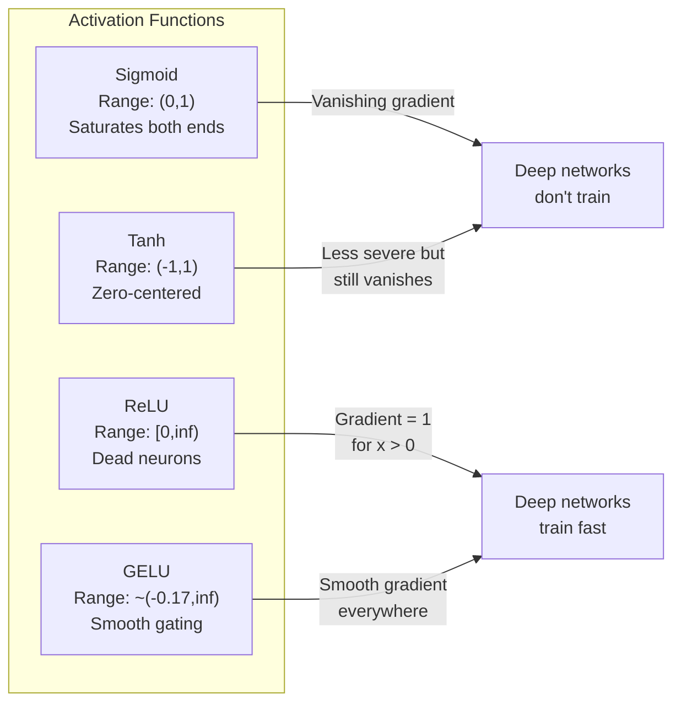
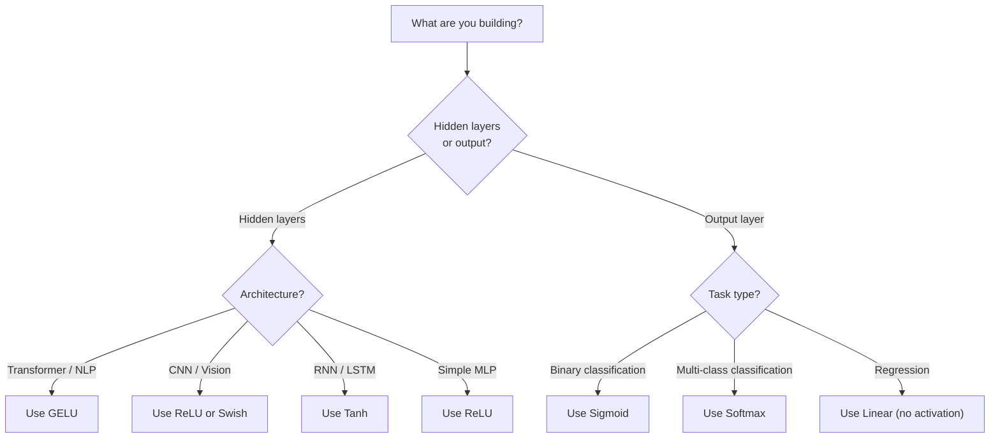

# Funções de ativação

> Sem a não linearidade, a rede de 100 camadas é um multiplicador de matriz sofisticado.

> **【中文解读】**没有非线性激活函数,100 层网络等于矩阵乘法──因为 duas liner变换的复合还是线性的:W2(W1x+b1) +b2 = (W2W1)x + (W2b1+b2)──激活函数打破这种线性叠加,让每个层都能为网络增加真正表达能力──

**Type:** Build
**Languages:** Python
**Prerequisites:** Lesson 03.03 (Backpropagation)
**Time:** ~75 minutes

## Objetivos de aprendizagem

- Implementar sigmoide, tanh, ReLU, Leaky ReLU, GELU, Swish e softmax com os seus derivados a partir do zero
- Diagnóstico do problema de gradiente desaparecendo através da medição de magnitudes de ativação através de 10+ camadas com diferentes ativações
- Detectar neurônios mortos numa rede ReLU e explicar por que GELU evita este modo de falha
- Selecione a função de ativação correta para uma determinada arquitetura (transformador, CNN, RNN, camada de saída)

> **【中文解读】**Objectivo deste capítulo: realizar 7 tipos de funções ativas e seus indicadores, através de experiências diagnósticas de disparidade, testes de neurônios de morte em ReLU, aprendizagem para diferentes estruturas selecionar funções ativas adequadas.

## O problema é o problema da introdução

Estape duas transformações lineares: y = W2 ((W1x + b1) + b2. Expandir: y = W2W1x + W2b1 + b2. Isso é apenas y = Ax + c - uma única transformação linear. Não importa quantas camadas lineares você estape, o resultado desmorona para uma matriz multiplicar. Sua rede de 100 camadas tem o mesmo poder de representação que uma única camada.

> 堆叠两层线性变换:y = W2(W1x + b1) + b2。展开后:y = W2W1x + W2b1 + b2。 isto não é mais do que y = Ax + c um único linear cambio。 não importa quantas camadas lineares você compõe, os resultados vão se acumular em uma única矩阵乘法。 sua rede de 100 camadas tem a mesma capacidade de expressãoƒƒƒƒƒƒƒƒƒƒƒƒƒƒƒƒƒƒƒƒƒƒƒƒƒƒƒƒƒƒƒƒƒƒƒƒƒƒƒƒƒƒƒƒƒƒƒƒƒƒƒƒƒƒƒƒƒƒƒƒƒƒƒƒƒƒƒƒƒƒƒƒƒƒƒƒƒƒƒƒƒƒƒƒƒƒƒƒƒƒƒƒƒƒƒƒƒƒƒƒƒƒƒƒƒƒƒƒƒƒƒƒƒƒƒƒƒƒƒƒƒƒƒƒƒƒƒƒƒƒƒƒƒƒƒƒƒƒƒƒƒƒƒƒƒƒƒƒƒƒƒƒƒƒƒƒƒƒƒƒƒƒƒƒƒƒƒƒƒƒƒƒƒƒƒƒƒƒƒƒƒƒƒƒƒƒƒƒƒƒƒƒƒƒƒƒƒƒƒƒƒƒƒƒƒƒƒƒƒƒƒƒƒƒƒƒƒƒƒƒƒƒƒƒƒƒƒƒƒƒƒƒƒƒƒƒƒƒƒƒƒƒƒƒƒƒƒƒƒƒƒƒƒƒƒƒƒƒƒƒƒƒƒƒƒƒƒƒƒƒƒƒƒƒƒƒƒƒƒƒƒƒƒƒƒƒƒƒƒƒƒƒƒƒƒƒƒƒƒƒƒƒƒƒƒƒƒƒƒƒƒƒƒƒƒƒƒƒƒƒƒƒƒƒƒƒƒƒƒƒƒƒƒƒƒƒƒƒƒƒƒƒƒƒƒƒƒƒƒƒƒƒƒƒƒƒƒƒƒƒƒƒƒƒƒƒƒƒƒƒƒƒƒƒƒƒƒƒƒƒƒƒƒƒƒƒƒƒƒƒƒƒƒƒƒƒƒƒƒƒƒƒƒƒƒƒƒ

Isto não é uma curiosidade teórica. Significa que uma rede linear profunda literalmente não pode aprender XOR, não pode classificar um conjunto de dados em espiral, não pode reconhecer um rosto. Sem funções de ativação, a profundidade é uma ilusão.

> Isto não é curiosidade teórica. Isto significa que a rede linear profunda não pode realmente aprender XOR, não pode dividir conjuntos de dados de espiral, não pode reconhecer rostos humanos.

As funções de ativação quebram a linearidade. Eles distorcem a saída de cada camada através de uma função não linear, dando à rede a capacidade de dobrar os limites de decisão, aproximar funções arbitrárias e realmente aprender. Mas escolha a ativação errada e os seus gradientes desaparecem para zero (sigmoide em redes profundas), explodem para infinito (ativações ilimitadas sem inicialização cuidadosa), ou os seus neurônios morrem permanentemente (ReLU com grandes preconceitos negativos). A escolha da função de ativação determina diretamente se a sua rede aprende.

> Funções ativadas quebraram a linhação. Eles são transformados em funções não-lineares, que torcem cada nível de saída, que lhe dão a capacidade de aprender e aproximar qualquer função.

> **【中文解读】**堆叠两层线性变换 y = W2(W1x+b1) +b2 展开后就是一个线性变换 y = Ax+c。不管叠加多少层,结果都等价于矩阵乘法深度是假的。 激活函数打破线性,让网络能曲决策边界、逼近任意函数── 选择错误激活函数会导致梯度消失(sigmoid)、元梯度爆炸或神经死亡(ReLU)。

## O conceito central.

### Porque é que a não-linearidade é necessária?

A multiplicação de matriz é compostavel. Multiplicar um vetor pela matriz A, então a matriz B é idêntico a multiplicar por AB. Isso significa que apilar dez camadas lineares é matematicamente equivalente a uma camada linear com uma grande matriz. Todos esses parâmetros, toda essa profundidade - desperdiçado. Você precisa de algo para quebrar a cadeia. É isso que as funções de ativação fazem.

> O matriço multiplicado é composto por uma mesma massa. O primeiro matriço A multiplicado por massa, o segundo matriço B multiplicado, é igual ao AB multiplicado. Isto significa que a acumulação de dez camadas lineares é matematicamente igual a uma com uma grande matriço. Todos os parâmetros, todas as profundidades são desperdiçados.

Aqui está a prova. Uma camada linear calcula f ((x) = Wx + b.

```
Layer 1: h = W1 * x + b1         # 第一层线性变换
Layer 2: y = W2 * h + b2         # 第二层线性变换
```

Substituto:

```
y = W2 * (W1 * x + b1) + b2      # 代入 h
y = (W2 * W1) * x + (W2 * b1 + b2)  # 展开
y = A * x + c                     # 合并为单一矩阵——深度消失了！
```

Uma camada. Insira uma ativação não linear g (() entre as camadas:

```
h = g(W1 * x + b1)               # 加入非线性激活
y = W2 * h + b2
```

Agora a substituição se rompe. W2 * g(W1 * x + b1) + b2 não pode ser reduzida a uma única transformação linear. A rede pode representar funções não lineares. Cada camada adicional com uma ativação adiciona capacidade de representação.

> Agora, a rede está dividida. W2 * g(W1 * x + b1) + b2 não pode ser simplificada para uma única linha de mudança.

> **【中文解读】**Prova matemática: a combinação de duas linhas de mudança é ainda linear. Mas inserindo a atividade não linear g (() 后,W2 * g ((W1x + b1) + b2 无法合并为单一矩阵每多个带激活的层, a capacidade de expressão da rede aumenta realmente.

### Sigmoide

A função de ativação original para redes neurais.

> Função de ativar inicial da rede nervosa:

```
sigmoid(x) = 1 / (1 + e^(-x))
```

Intervalo de saída: (0, 1). Suave, diferenciável, mapeia qualquer número real a um valor semelhante à probabilidade.

> 输出范围:(0, 1)──平滑、可微,将任何实数映射为类似概率的值──

O derivado:

> Sua direção é:

```
sigmoid'(x) = sigmoid(x) * (1 - sigmoid(x))
```

O valor máximo desta derivada é de 0,25, ocorrendo em x = 0. Na propagação para trás, os gradientes se multiplicam através de camadas. Dez camadas de sigmoide significa que o gradiente é multiplicado pelo máximo 0,25 dez vezes:

> O valor máximo do número de direção é de 0,25, em x = 0 时.

```
0.25^10 = 0.000000953674     # 不到原始信号的百万分之一
```

Menos de um milionésimo do sinal original. Este é o problema do gradiente desaparecendo. Os gradientes nas camadas iniciais tornam-se tão pequenos que os pesos mal atualizam. A rede parece aprender - a perda diminui nas camadas posteriores - mas as primeiras camadas estão congeladas. As redes sigmoides profundas simplesmente não treinam.

> Não chega a um milhão de sinais originais. É o problema da diminuição da gradiência. A gradiência da primeira fase é tão pequena que o peso não se renova. A rede parece estar a aprender.

O problema adicional é que as saídas sigmoides são sempre positivas (0 a 1), o que significa que os gradientes nos pesos são sempre o mesmo sinal.

> 额外问题:sigmoid 输出总是正数(0到 1), o que significa que a gradiência do peso é sempre igual à mesma.

> **【中文解读】**O número máximo de direções do sigmoide é de 0,25,10 e a gradiência posterior só resta um milhão de porções.

> **【拓展：Sigmoid 在现代 AI 中的位置】**Sigmoid 虽然不再用于隐藏层,但在二分类输出层仍然常用──Transformer 中的注意力分数也使用软maxsigmoid的一般化──理解sigmoid 的局限性,是理解为什么RELU/GELU 让深度学习成为可能的关键──

### Tanh

A versão centrada do sigmoide.

> Edição zero do Sigmoid.

```
tanh(x) = (e^x - e^(-x)) / (e^x + e^(-x))
```

Intervalo de saída: (-1, 1). Centrado em zero, o que elimina o problema do zigzag.

> 输出范围:(-1, 1)──零中心化, eliminada 形问题──

O derivado:

> Sua direção é:

```
tanh'(x) = 1 - tanh(x)^2
```

A derivada máxima é de 1,0 em x = 0 - quatro vezes melhor do que o sigmoide. Mas o problema do gradiente desaparecendo ainda existe. Para grandes entradas positivas ou negativas, a derivada se aproxima de zero. Dez camadas ainda esmagam o gradiente, apenas menos agressivamente.

> O máximo de diâmetro é de 1,0 ((x = 0 时)  em comparação com o sigmoide, boa 4 倍── mas o problema da diminuição da diâmetro ainda existe── para grandes entradas positivas ou negativas, o diâmetro de diâmetro tende a ser quase zero──10 层 ainda vai ser pressionado 梯度, apenas não é tão grave──

> **【中文解读】**Tanh é a zero-centro versão do sigmoide, gama de saída (-1, 1), o máximo de valor do sigmoide é de 1,0 (((por exemplo, 4 vezes mais)

> **【拓展：LSTM 中的 Tanh】**O estado oculto e o candidato de memória da LSTM 网络用tanh(把值压缩到 -1到1) ⋅ Embora o transformador já tenha substituído o LSTM, compreender tanh é importante para entender o modelo da série RNN ⋅

### ReLU: O avanço.

Corrigida Unidade Linear. Popularizada para aprendizagem profunda por Nair e Hinton em 2010 (a função em si data do trabalho de Fukushima de 1969), mudou tudo.

> 修正线性单元──, lançado em 2010 por Nair 和 Hinton para deep learning, essa função em si remonta ao trabalho de Fukushima em 1969, mudou tudo.

```
relu(x) = max(0, x)
```

O intervalo de saída: [0, infinito).

```
relu'(x) = 1  if x > 0
           0  if x <= 0
```

Não há gradiente de desaparecimento para entradas positivas. O gradiente é exatamente 1, passado diretamente através. É por isso que redes profundas tornaram-se treinaveis - ReLU preserva magnitude de gradiente em todas as camadas.

> Está a entrar sem desaparecimento de gradiente. O gradiente é 1, transmite-se diretamente. É por isso que a rede de profundidade se torna treinável.

Mas há um modo de falha: o problema de neurônios mortos. Se a entrada ponderada de um neurônio é sempre negativa (devido a um grande viés negativo ou uma initialização de peso infeliz), sua saída é sempre zero, seu gradiente é sempre zero e nunca atualiza. É permanentemente morto. Na prática, 10-40% dos neurônios em uma rede ReLU podem morrer durante o treinamento.

> Mas existe um modelo fracassado: problema de neurônios da morte. Se a entrada de carga de um neurônio é sempre negativa (por causa de um grande prejuízo negativo ou inicialização de peso de infelizes), sua saída é sempre zero, o gradiente é sempre zero, nunca é renovado.

> **【中文解读】**A RELU tem um problema de "neurônios de morte": se a entrada de um neurônio aumentada é sempre negativa, ele sempre sai 0 ̊ a 0 ̊, nunca pode ser recuperado.

> **【拓展：ReLU 在 CNN 中的统治地位】**ResNet、VGG、EfficientNet etc CNN 架构都使用 ReLU (或其变体) ⋅CNN 卷积层+ReLU é um conjunto padrão de características visuais.

### ReLU em fuga

A solução mais simples para neurónios mortos.

> O método mais simples de recuperar o cérebro da morte.

```
leaky_relu(x) = x        if x > 0
                alpha * x if x <= 0
```

Onde o alfa é uma pequena constante, normalmente 0,01. O lado negativo tem uma pequena inclinação em vez de zero, por isso os neurônios mortos ainda recebem um sinal de gradiente e podem recuperar.

> Dentre eles, o alfa é um pequeno número constante, geralmente de 0,01── no lado negativo há uma pequena inclinação em vez de zero, de modo que os nervos da morte ainda podem obter sinais de gradiente e podem recuperar──.

> **【中文解读】**O Leaky ReLU em zonas negativas mantém uma pequena inclinação (0,01), deixando que os nervos mortos ainda possam receber um sinal de gradiente, possivelmente recuperando-se.

### GELU: O padrão moderno

Unidade linear de erro de Gaussian. Introduzida por Hendrycks e Gimpel em 2016. Ativação padrão em BERT, GPT e a maioria dos transformadores modernos.

> 高斯差差线性单元── por Hendrycks 和 Gimpel 于 2016 年提出──BERT、GPT 和大多数现代 Transformer 的默认激活函数──

```
gelu(x) = x * Phi(x)
```

Onde Phi ((x) é a função de distribuição cumulativa da distribuição normal padrão.

```
gelu(x) ~= 0.5 * x * (1 + tanh(sqrt(2/pi) * (x + 0.044715 * x^3)))
```

O GELU é suave em todos os lugares, permite pequenos valores negativos (ao contrário do ReLU que faz clips rígidos para zero) e tem uma interpretação probabilística: pesa cada entrada por quão provável é que seja positiva sob uma distribuição gaussiana.

> GELU 处平滑,允许小的负值(不像 ReLU 硬截断为零),具有概率解释: ele é de acordo com a entrada em distribuição normal para a probabilidade positiva para cada entrada aumentada. Este controle de câmbio é superior ao ReLU na estrutura do Transformer, pois oferece uma melhor gradiência de fluxo e evita completamente a morte de problemas de neurônios.

> **【中文解读】**GELU é a função de ativação padrão de BERT、GPT 和大多数现代 Transformer. É uma função de ativação padrão da Transformer. É uma função de ativação padrão da Transformer.

> **【拓展：GPT/BERT 中的 GELU】**Em FFN do Transformer (em inglês)`Linear → GELU → Linear`PyTorch `nn.GELU()`和 `F.gelu()`É essa função. GPT-2/3/4、BERT、ROBERTA etc.

### Swis / SiLU

Ativação auto-guardada descoberta por Ramachandran et al. em 2017 através de pesquisa automatizada.

```
swish(x) = x * sigmoid(x)
```

O Swish é formalmente x * sigmoid ((x). O Google descobriu-o através de pesquisas automatizadas sobre o espaço de função de ativação -- uma rede neural que projeta partes de redes neurais.

Como o GELU, é liso, não monótono e permite pequenos valores negativos. A diferença é sutil: o Swish usa sigmoid para gating enquanto o GELU usa o CDF gaussiano. Na prática, o desempenho é quase idêntico.

> **【中文解读】**Swish = x * sigmoid(x), através de busca automática encontrar(Use neuro-networkdesign parte da neuro-network) ⋅ e GELU  desempenho quase igual, pequenas diferenças é Swish Use sigmoid 门控、GELU Use高斯 CDF 门控──Swish Use EfficientNet 等视觉模型,GELU 统治语言模型──

### Softmax: Ativação de saída

Não é usado em camadas ocultas. Softmax converte um vetor de pontuações brutas (logits) em uma distribuição de probabilidade.

```
softmax(x_i) = e^(x_i) / sum(e^(x_j) for all j)
```

Cada saída é entre 0 e 1. Todas as saídas somam a 1. Isso torna-a a ativação final padrão para classificação de várias classes. A logit maior obtém a maior probabilidade, mas ao contrário de argmax, softmax é diferenciável e preserva informações sobre confiança relativa.

> **【中文解读】**O Softmax não é usado para camadas ocultas, mas para a saída de camadas. O Softmax transforma o número de partículas originais em distribuição de probabilidade.

> **【拓展：Softmax 在 Transformer 中无处不在】**O mecanismo de autoattenção do transformador com softmax  calcular o peso da atenção:`attention = softmax(Q·K^T / sqrt(d_k))` Cada camada de atenção está em suavidade.

### Comparar formas em relação a formas.



### Qual Ativação Quando Quando Quando Quando usar o que Ativação função



> **【中文解读】**经验法则:Transformer/NLP Used GELU,CNN/视觉 Used ReLU,RNN/LSTM Used tanh──输出层:二分类 Used sigmoid,多分类 Used softmax,归归不用激活──

## Construí-lo.
```figure
softmax-temperature
```

## Construí-lo

### Passo 1: Implementar todas as funções de ativação com derivados

Cada função leva uma única flutuação e retorna uma flutuação.

```python
import math

def sigmoid(x):
    x = max(-500, min(500, x))  # 裁剪防止溢出
    return 1.0 / (1.0 + math.exp(-x))  # σ(x) = 1/(1+e^(-x))

def sigmoid_derivative(x):
    s = sigmoid(x)
    return s * (1 - s)  # sigmoid 导数 = σ(x)(1 - σ(x))，最大值 0.25

def tanh_act(x):
    return math.tanh(x)  # 双曲正切

def tanh_derivative(x):
    t = math.tanh(x)
    return 1 - t * t  # tanh 导数 = 1 - tanh²(x)，最大值 1.0

def relu(x):
    return max(0.0, x)  # 正区间透传，负区间归零

def relu_derivative(x):
    return 1.0 if x > 0 else 0.0  # 正区间梯度=1，负区间梯度=0

def leaky_relu(x, alpha=0.01):
    return x if x > 0 else alpha * x  # 负区间保留小斜率

def leaky_relu_derivative(x, alpha=0.01):
    return 1.0 if x > 0 else alpha  # 负区间梯度=alpha

def gelu(x):
    # GELU 近似公式，用于 GPT/BERT 等 Transformer
    return 0.5 * x * (1 + math.tanh(math.sqrt(2 / math.pi) * (x + 0.044715 * x ** 3)))

def gelu_derivative(x):
    phi = 0.5 * (1 + math.erf(x / math.sqrt(2)))  # 标准正态 CDF
    pdf = math.exp(-0.5 * x * x) / math.sqrt(2 * math.pi)  # 标准正态 PDF
    return phi + x * pdf

def swish(x):
    return x * sigmoid(x)  # Swish = x * σ(x)，用于 EfficientNet

def swish_derivative(x):
    s = sigmoid(x)
    return s + x * s * (1 - s)  # Swish 导数 = σ(x) + x·σ(x)(1-σ(x))

def softmax(xs):
    max_x = max(xs)  # 数值稳定性：减去最大值
    exps = [math.exp(x - max_x) for x in xs]
    total = sum(exps)
    return [e / total for e in exps]  # 所有输出和为 1
```

### Passo 2: Visualize onde os graduantes morrem.

Calcule o gradiente em 100 pontos uniformemente espaçados de -5 a 5. Imprima um histograma de texto que mostra onde o gradiente de cada ativação é próximo de zero.

```python
def gradient_scan(name, derivative_fn, start=-5, end=5, n=100):
    step = (end - start) / n
    near_zero = 0
    healthy = 0
    for i in range(n):
        x = start + i * step
        g = derivative_fn(x)
        if abs(g) < 0.01:       # 梯度接近零的区域
            near_zero += 1
        else:
            healthy += 1
    pct_dead = near_zero / n * 100
    print(f"{name:15s}: {healthy:3d} healthy, {near_zero:3d} near-zero ({pct_dead:.0f}% dead zone)")

gradient_scan("Sigmoid", sigmoid_derivative)
gradient_scan("Tanh", tanh_derivative)
gradient_scan("ReLU", relu_derivative)
gradient_scan("Leaky ReLU", leaky_relu_derivative)
gradient_scan("GELU", gelu_derivative)
gradient_scan("Swish", swish_derivative)
```

### Passo 3: Experimento de Desaparecimento Gradiente

Passar um sinal para a frente através de N camadas usando sigmoide vs ReLU. Medir como a magnitude de ativação muda.

```python
import random

def vanishing_gradient_experiment(activation_fn, name, n_layers=10, n_inputs=5):
    random.seed(42)
    values = [random.gauss(0, 1) for _ in range(n_inputs)]

    print(f"\n{name} through {n_layers} layers:")
    for layer in range(n_layers):
        weights = [random.gauss(0, 1) for _ in range(n_inputs)]
        z = sum(w * v for w, v in zip(weights, values))  # 加权求和
        activated = activation_fn(z)  # 激活
        magnitude = abs(activated)
        bar = "#" * int(magnitude * 20)
        print(f"  Layer {layer+1:2d}: magnitude = {magnitude:.6f} {bar}")  # 观察 magnitude 是否逐层缩小
        values = [activated] * n_inputs

vanishing_gradient_experiment(sigmoid, "Sigmoid")  # sigmoid 的 magnitude 会快速缩小
vanishing_gradient_experiment(relu, "ReLU")        # ReLU 的 magnitude 不会缩小
vanishing_gradient_experiment(gelu, "GELU")        # GELU 介于两者之间
```

### Passo 4: Detector de neurônios mortos.

Crie uma rede ReLU, passe entradas aleatórias através dela, conte quantas neurônios nunca disparam.

```python
def dead_neuron_detector(n_inputs=5, hidden_size=20, n_samples=1000):
    random.seed(0)
    weights = [[random.gauss(0, 1) for _ in range(n_inputs)] for _ in range(hidden_size)]
    biases = [random.gauss(0, 1) for _ in range(hidden_size)]

    fire_counts = [0] * hidden_size  # 记录每个神经元的激活次数

    for _ in range(n_samples):
        inputs = [random.gauss(0, 1) for _ in range(n_inputs)]
        for neuron_idx in range(hidden_size):
            z = sum(w * x for w, x in zip(weights[neuron_idx], inputs)) + biases[neuron_idx]
            if relu(z) > 0:           # ReLU 激活 > 0 算"激活"
                fire_counts[neuron_idx] += 1

    dead = sum(1 for c in fire_counts if c == 0)          # 从未激活 = 死亡
    rarely_fire = sum(1 for c in fire_counts if 0 < c < n_samples * 0.05)  # 极少激活
    healthy = hidden_size - dead - rarely_fire

    print(f"\nDead Neuron Report ({hidden_size} neurons, {n_samples} samples):")
    print(f"  Dead (never fired):     {dead}")
    print(f"  Barely alive (<5%):     {rarely_fire}")
    print(f"  Healthy:                {healthy}")
    print(f"  Dead neuron rate:       {dead/hidden_size*100:.1f}%")

    for i, c in enumerate(fire_counts):
        status = "DEAD" if c == 0 else "WEAK" if c < n_samples * 0.05 else "OK"
        bar = "#" * (c * 40 // n_samples)
        print(f"  Neuron {i:2d}: {c:4d}/{n_samples} fires [{status:4s}] {bar}")

dead_neuron_detector()
```

### Passo 5: Comparação de treinamento - Sigmoid vs ReLU vs GELU  treinamento vs.

Treinar a mesma rede de duas camadas no conjunto de dados do círculo (pontos dentro de um círculo = classe 1, fora = classe 0) com três ativações diferentes.

```python
def make_circle_data(n=200, seed=42):
    random.seed(seed)
    data = []
    for _ in range(n):
        x = random.uniform(-2, 2)
        y = random.uniform(-2, 2)
        label = 1.0 if x * x + y * y < 1.5 else 0.0  # 距原点 < sqrt(1.5) 为"内部"
        data.append(([x, y], label))
    return data


class ActivationNetwork:
    """使用指定激活函数的两层网络，用于对比不同激活函数的训练效果"""
    def __init__(self, activation_fn, activation_deriv, hidden_size=8, lr=0.1):
        random.seed(0)
        self.act = activation_fn       # 激活函数
        self.act_d = activation_deriv  # 激活函数导数
        self.lr = lr
        self.hidden_size = hidden_size

        self.w1 = [[random.gauss(0, 0.5) for _ in range(2)] for _ in range(hidden_size)]  # 隐藏层权重
        self.b1 = [0.0] * hidden_size   # 隐藏层偏置
        self.w2 = [random.gauss(0, 0.5) for _ in range(hidden_size)]  # 输出层权重
        self.b2 = 0.0                    # 输出层偏置

    def forward(self, x):
        self.x = x
        self.z1 = []
        self.h = []
        for i in range(self.hidden_size):
            z = self.w1[i][0] * x[0] + self.w1[i][1] * x[1] + self.b1[i]  # 线性变换
            self.z1.append(z)
            self.h.append(self.act(z))  # 激活（这里对比不同激活函数的效果）

        self.z2 = sum(self.w2[i] * self.h[i] for i in range(self.hidden_size)) + self.b2
        self.out = sigmoid(self.z2)  # 输出层用 sigmoid（二分类标准）
        return self.out

    def backward(self, target):
        error = self.out - target
        d_out = error * self.out * (1 - self.out)  # 输出层梯度

        for i in range(self.hidden_size):
            d_h = d_out * self.w2[i] * self.act_d(self.z1[i])  # 隐藏层梯度
            self.w2[i] -= self.lr * d_out * self.h[i]           # 更新输出层权重
            for j in range(2):
                self.w1[i][j] -= self.lr * d_h * self.x[j]     # 更新隐藏层权重
            self.b1[i] -= self.lr * d_h                          # 更新隐藏层偏置
        self.b2 -= self.lr * d_out                               # 更新输出层偏置

    def train(self, data, epochs=200):
        losses = []
        for epoch in range(epochs):
            total_loss = 0
            correct = 0
            for x, y in data:
                pred = self.forward(x)
                self.backward(y)
                total_loss += (pred - y) ** 2
                if (pred >= 0.5) == (y >= 0.5):
                    correct += 1
            avg_loss = total_loss / len(data)
            accuracy = correct / len(data) * 100
            losses.append(avg_loss)
            if epoch % 50 == 0 or epoch == epochs - 1:
                print(f"    Epoch {epoch:3d}: loss={avg_loss:.4f}, accuracy={accuracy:.1f}%")
        return losses


data = make_circle_data()

configs = [
    ("Sigmoid", sigmoid, sigmoid_derivative),    # 预期：收敛慢，梯度消失
    ("ReLU", relu, relu_derivative),              # 预期：收敛快
    ("GELU", gelu, gelu_derivative),              # 预期：收敛快且平滑
]

results = {}
for name, act_fn, act_d_fn in configs:
    print(f"\n=== Training with {name} ===")
    net = ActivationNetwork(act_fn, act_d_fn, hidden_size=8, lr=0.1)
    losses = net.train(data, epochs=200)
    results[name] = losses

print("\n=== Final Loss Comparison ===")
for name, losses in results.items():
    print(f"  {name:10s}: start={losses[0]:.4f} -> end={losses[-1]:.4f} (improvement: {(1 - losses[-1]/losses[0])*100:.1f}%)")
```

## Use-o em prática.

A PyTorch fornece todas estas formas, tanto funcionais como módulos:

```python
import torch
import torch.nn as nn
import torch.nn.functional as F

x = torch.randn(4, 10)  # 4 个样本，每个 10 维

relu_out = F.relu(x)           # ReLU：对应我们的 relu()
gelu_out = F.gelu(x)           # GELU：对应我们的 gelu()
sigmoid_out = torch.sigmoid(x)  # Sigmoid：对应我们的 sigmoid()
swish_out = F.silu(x)          # Swish/SiLU：对应我们的 swish()

logits = torch.randn(4, 5)     # 4 个样本，5 个类别
probs = F.softmax(logits, dim=1)  # Softmax：对应我们的 softmax()

model = nn.Sequential(
    nn.Linear(10, 64),
    nn.GELU(),          # Transformer 标配：GELU
    nn.Linear(64, 32),
    nn.GELU(),
    nn.Linear(32, 5),   # 输出层：不加激活（logits）
)
```

camadas ocultas em um transformador: GELU. camadas ocultas em uma CNN: ReLU. camada de saída para classificação: softmax. camada de saída para regressão: nenhuma (linear). camada de saída para probabilidades: sigmoid. Isso é tudo. Comece com estes padrões. muda-os apenas quando você tem evidências.

RNNs e LSTMs usam tanh para o estado oculto e sigmoide para os portões, mas se você está construindo de zero hoje, provavelmente não está usando RNNs. Se os neurônios estão morrendo em sua rede ReLU, mude para GELU. Não acesse o Leaky ReLU a menos que você tenha uma razão específica - GELU resolve o problema de neurônios mortos e dá um melhor fluxo de gradiente.

> **【中文解读】**PyTorch  forneceu todas as funções activadas de função e módulo de API.

## Envia-o .

Esta lição produz:
- `outputs/prompt-activation-selector.md`-- um prompt reutilizável que ajuda a escolher a função de ativação certa para qualquer arquitetura

## Exercícios.

1. Implementar o Parametric ReLU (PReLU) onde a inclinação negativa alfa é um parâmetro apropriado.
   > **练习 1：**实现 PRELU(负斜率 alfa 可学习), em forma de dados em círculo

2. Execute o experimento de gradiente de desaparecimento com 50 camadas em vez de 10. Desenhe a magnitude em cada camada para sigmoide, tanh, ReLU e GELU. Em que camada o sinal de cada ativação atinge efetivamente o zero?
   > **练习 2：**A expansão da experiência de diminuição de gradiente para 50 níveis... qual é o sinal da função de ativação que mais cedo regressa a zero?

3. Implementar a ELU (Unidade Linear Exponencial): elu(x) = x se x > 0, alfa * (e^x - 1) se x <= 0. Compare sua taxa de neurônios mortos com a ReLU na mesma rede.
   > **练习 3：** Realizar a ELU, em comparação com a taxa de morte de ELU e RELU na mesma rede.

4. Construa um "monitor de saúde gradiente" que funcione durante o treinamento: em cada época, calcule a magnitude média de gradiente em cada camada.
   > **练习 4：**Construir um "monitor de saúde de gradiente" para calcular a média de gradiente de cada ciclo, de grande ou inferior a 0,001 ou superior a 100 horas.

5. Modifique a comparação de treinamento para usar o conjunto de dados XOR da lição 01 em vez de círculos. Qual a ativação converge mais rapidamente no XOR?
   > **练习 5：**Comparar com XOR dados com dados de forma rotativa. Qual a função de ativação recebeu mais rápido?

## Termos-chave .

| Term | What people say | What it actually means |
|------|----------------|----------------------|
| Activation function | "The nonlinear part" | A function applied to each neuron's output that breaks linearity, enabling the network to learn nonlinear mappings |
| Vanishing gradient | "Gradients disappear in deep networks" | Gradients shrink exponentially through layers when the activation's derivative is less than 1, making early layers untrainable |
| Exploding gradient | "Gradients blow up" | Gradients grow exponentially through layers when the effective multiplier exceeds 1, causing unstable training |
| Dead neuron | "A neuron that stopped learning" | A ReLU neuron whose input is permanently negative, producing zero output and zero gradient |
| Sigmoid | "Squishes values to 0-1" | The logistic function 1/(1+e^-x), historically important but causes vanishing gradients in deep networks |
| ReLU | "Clips negatives to zero" | max(0, x) -- the activation that made deep learning practical by preserving gradient magnitude |
| GELU | "The transformer activation" | Gaussian Error Linear Unit, a smooth activation that weights inputs by their probability of being positive |
| Swish/SiLU | "Self-gated ReLU" | x * sigmoid(x), discovered through automated search, used in EfficientNet |
| Softmax | "Turns scores into probabilities" | Normalizes a vector of logits into a probability distribution where all values are in (0,1) and sum to 1 |
| Leaky ReLU | "ReLU that doesn't die" | max(alpha*x, x) where alpha is small (0.01), preventing dead neurons by allowing small negative gradients |
| Saturation | "The flat part of sigmoid" | Regions where an activation's derivative approaches zero, blocking gradient flow |
| Logit | "The raw score before softmax" | The unnormalized output of the final layer before applying softmax or sigmoid |

| 术语 | 通俗说法 | 实际含义 |
|------|---------|---------|
| 激活函数 (Activation function) | "非线性那部分" | 施加在每个神经元输出上的函数，打破线性，使网络能学习非线性映射 |
| 梯度消失 (Vanishing gradient) | "深层梯度消失" | 导数小于 1 的激活函数导致梯度逐层指数缩小，前面的层无法训练 |
| 梯度爆炸 (Exploding gradient) | "梯度爆炸" | 有效乘数超过 1 时梯度逐层指数增长，训练不稳定 |
| 死亡神经元 (Dead neuron) | "停止学习的神经元" | ReLU 神经元输入永远为负，输出和梯度永远为零 |
| Sigmoid | "压到 0-1" | 逻辑函数 1/(1+e^-x)，历史重要但深层网络中梯度消失 |
| ReLU | "负数变零" | max(0, x)——通过保持梯度幅度让深度学习变得可行的激活函数 |
| GELU | "Transformer 激活" | 高斯误差线性单元，按输入为正的概率加权的平滑激活 |
| Swish/SiLU | "自门控 ReLU" | x * sigmoid(x)，通过自动搜索发现，用于 EfficientNet |
| Softmax | "分数变概率" | 把 logits 归一化为概率分布，所有值在 (0,1) 且和为 1 |
| Leaky ReLU | "不会死的 ReLU" | max(alpha*x, x)，负区间保留小梯度防止神经元死亡 |
| 饱和 (Saturation) | "sigmoid 的平坦区" | 激活函数导数趋近于零的区域，阻断梯度流 |
| Logit | "softmax 前的原始分" | 最终层未归一化的输出 |

## Mais leitura 延伸阅读

- Nair & Hinton, "Unidades Lineares Rectificadas Melhores Máquinas Boltzmann Restritas" (2010) - o artigo que introduziu a ReLU e permitiu o treinamento de redes profundas
- Hendrycks & Gimpel, "Gaussian Error Linear Units (GELUs) " (2016) -- introduziu a função de ativação que se tornou o padrão para transformadores
- Ramachandran et al., "Buscar funções de ativação" (2017) -- usou a pesquisa automatizada para descobrir Swish, mostrando que o projeto de ativação pode ser automatizado
- Glorot & Bengio, "Compreender a dificuldade de treinar redes neurais de feedforward profundas" (2010) -- o artigo que diagnosticou gradientes desaparecendo/explodindo e propôs a inicialização Xavier
- Bem-vindo, Bengio, Courville, "Aprendizagem Profunda" Capítulo 6.3 (https://www.deeplearningbook.org/) -- tratamento rigoroso das unidades ocultas e das funções de activação
