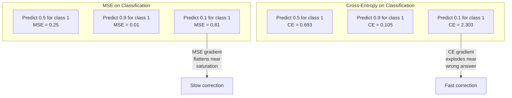
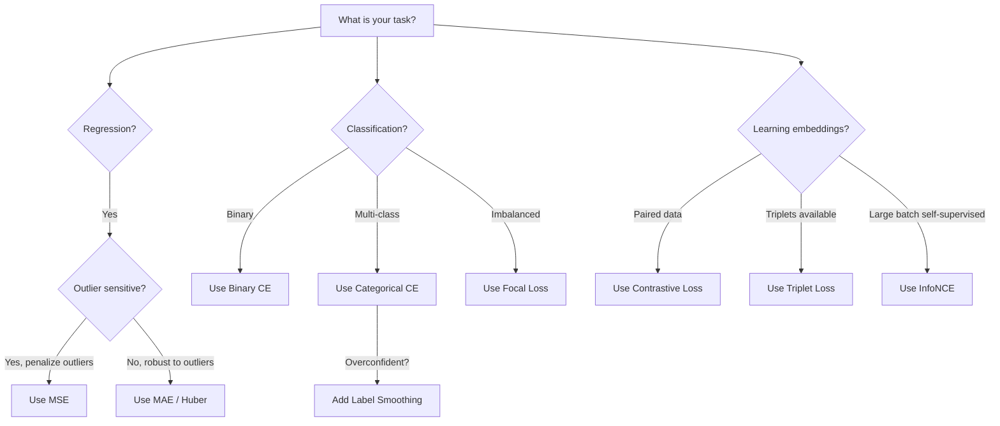

# Perda de funções .

> A sua rede faz uma previsão. A verdade base diz o contrário. O quão errado é? Esse número é a perda. Escolha a função de perda errada e seu modelo otimiza para a coisa errada inteiramente.

> **【中文解读】**A função de perda é o único objetivo de otimização do modelo. Não é a taxa de precisão, não é o F1 分数, é o valor de perda. Selecionar a função de perda é uma forma de encontrar o "mais provável matemática" para satisfazê-la, e não o resultado que você realmente quer. Por exemplo, classificar tarefas com MSE, o modelo prevê todas as amostras para 0,5 ((mínimo perda, mas inútil) ").

**Type:** Build
**Languages:** Python
**Prerequisites:** Lesson 03.04 (Activation Functions)
**Time:** ~75 minutes

## Objetivos de aprendizagem

- Implementar a MSE, a entropia cruzada binária, a entropia cruzada categórica e a perda contrastiva (InfoNCE) a partir do zero com os seus gradientes
- Explique por que o MSE não consegue classificar, demonstrando o modo de falha "previsão 0,5 para tudo"
- Aplicar suavizamento de rótulo para a entropia cruzada e descrever como previne previsões exageradas
- Escolha a função correta de perda para regressão, classificação binária, classificação multi-classe e inserção de tarefas de aprendizagem

> **【中文解读】**Objectivo do capítulo: realizar 5 tipos de função de perda e gradiente, compreender por que as categorias de tarefas não podem ser utilizadas em MSE, aprender etiquetas de planeamento e comparação de perdas, aprender a escolher corretamente a função de perda de tarefas em função da sua função.

## O problema é o problema da introdução

Um modelo que minimiza a MSE num problema de classificação prevê com confiança 0,5 para tudo.

> Um modelo de MSE minimizado em questões de classificação irá confiar em todas as previsões de entrada 0.5;.

A função de perda é a única coisa que o seu modelo realmente otimiza. Não é preciso. Não o resultado da F1. Não seja qual for a métrica que relates ao teu gerente. O optimizador toma o gradiente da função de perda e ajusta pesos para tornar esse número menor. Se a função de perda não captar o que você se importa, o modelo encontrará a maneira matematicamente mais barata de satisfazê-la, e essa maneira quase nunca é o que você queria.

> ∆o-o-o-o-o-o-o-o-o-o-o-o-o-o-o-o-o-o-o-o-o-o-o-o-o-o-o-o-o-o-o-o-o-o-o-o-o-o-o-o-o-o-o-o-o-o-o-o-o-o-o-o-o-o-o-o-o-o-o-o-o-o-o-o-o-o-o-o-o-o-o-o-o-o-o-o-o-o-o-o-o-o-o-o-o-o-o-o-o-o-o-o-o-o-o-o-o-o-o-o-o-o-o-o-o-o-o-o-o-o-o-o-o-o-o-o-o-o-o-o-o-o-o-o-o-o-o-o-o-o-o-o-o-o-o-o-o-o-o-o-o-o-o-o-o-o-o-o-o-o-o-o-o-o-o-o-o-o-o-o-o-o-o-o-o-o-o-o-o-o-o-o-o-o-o-o-o-o-o-o-o-o-o-o-o-o-o-o-o-o-o-o-o-o-o-o-o-o-o-o-o-o-o-o-o-o-o-o-o-o-o-o-o-o-o-o-o-o-o-o-o-o-o-o-o-o-o-o-o-o-o-o-o-o-o-o-o-o-o-o-o-o-o-o-o-o-o-o-o-o-o-o-o-o-

Aqui está um exemplo concreto. Tem uma tarefa de classificação binária. Duas aulas, dividido 50/50. Usas a MSE como perda. O modelo prevê 0,5 por cada entrada. A média de MSE é de 0,25, o que é o mínimo possível sem realmente aprender nada. O modelo tem capacidade discriminatória zero, mas tecnicamente minimizou a sua função de perda. Passe para entropia cruzada e o mesmo modelo é forçado a empurrar as previsões para 0 ou 1, porque -log(0.5) = 0,693 é uma perda terrível, enquanto -log(0.99) = 0,01 recompensa com confiança as previsões corretas. A escolha da função de perda é a diferença entre um modelo que aprende e um modelo que joga a métrica.

> 具体例:二元分类任务,两类各占50%──你使用MSE 作为损失──模型对每个输入都预测0.5──平均MSE为0.25,这是实际上没有学到任何东西的情况下可能的最小值──模型没有任何区分能力,但技术上已经最小化了你的损失函数──换成交叉后,同样的模型被迫推推预测到0或1,因为 -log(0.5) =0.693是个非常差的损失,而 -log(0.99) =0.01会奖励自信的正确预测──损失函数的选择决定模型学习还在系统的空中.

É pior. Na aprendizagem auto-supervisionada, nem sequer temos rótulos. A perda contrastou define o sinal de aprendizagem inteiramente: o que conta como semelhante, o que conta como diferente, e o quão difícil o modelo deve empurrá-los de lado.

>  A situação é pior, em aprendizagem de auto-supervisão, você nem sequer tem etiqueta Contá-lo-perdido define completamente o sinal de aprendizagem: o que é semelhante, o que é diferente, o modelo deve dividir-se em quantidade de força Compreendendo-o-perdido, sua inserção se reduz a um ponto Cada entrada é mapeada para o mesmo veículo Contá-lo-perdido é zero, mas completamente inútil

> **【中文解读】**MSE fazer分类时, modelo descobrir pré-anúncio 0.5 é a estratégia mais segura 损失最小但没有区分能力──交叉则通过 -log (p) 惩罚不自信的预测:-log (0.5) = 0.693 (muito差)vs -log (0.99) = 0.01 (muito bem), forçar o modelo a fazer um julgamento claro── em auto-supervisão do aprendizado, o percurso de perda de comparação define todos os sinais de aprendizado (fazer erros) vai levar a todas as inserções (em inglês) a se acumularem até o mesmo ponto──

## O conceito central.

### Erro médio quadrado (MSE)                                                                                                                                                                                                                                                                                                                                                                                                                                                                                                                    

Calcule a diferença quadrada entre previsão e meta, média em todas as amostras.

> Regression de tarefa de escolha.

```
MSE = (1/n) * sum((y_pred - y_true)^2)
```

Por que quadrar importa: penaliza erros grandes quadraticamente. Um erro de 2 custa 4 vezes mais do que um erro de 1. Um erro de 10 custa 100 vezes. Isso faz com que a MSE seja sensível a valores fora do valor - uma única previsão muito errada domina a perda.

> Por que o quadrado é importante: ele impõe uma segunda punição contra grandes erros. O custo de erro 2 é 4 vezes o custo de erro 1 e o custo de erro 10 é 100 vezes.

Números reais: se o seu modelo prevê os preços das habitações e está fora por $10,000 on most houses but off by $200.000 em uma mansão, a MSE vai tentar agressivamente reparar essa mansão, potencialmente prejudicando o desempenho das outras 99 casas.

> 具体数字: Se seu modelo prévio preço da casa, a maioria das casas diferem $10,000，但一栋豪宅偏差 $200.000,MSE vai intensificar a tentativa de reparar a casa, possivelmente prejudicando a performance de outras 99 casas.

O gradiente de MSE em relação a uma previsão é:

> MSE à gradiência de pré-anúncio:

```
dMSE/dy_pred = (2/n) * (y_pred - y_true)      # 梯度与误差成线性关系
```

Linear no erro. erros maiores obtêm gradientes maiores. Esta é uma característica para regressão (erros grandes precisam de grandes correções) e um bug para classificação (você quer penalizar respostas erradas confiantes de forma exponencial, não linear).

> Com o erro em relação à linhação. O maior erro obtém uma maior gradiência.

> **【中文解读】**MSE é a perda padrão da tarefa de regresso: erro de média quadrada. Em geral, o erro de 10 é 100 vezes mais caro, mas também faz com que seja sensível a valores anormais.

> **【拓展：MSE 在 AI 中的应用】**MSE sempre usado para a regressão das tarefas 房价预测、温度预测) 在图像生成模型 (como Stable Diffusion) 中, MSE também é usado para medir a geração de imagens e as diferenças de imagens das imagens-alvo.`F.mse_loss(pred, target)`- Não.

### Perda de entropia cruzada.

A função de perda para classificação, enraizada na teoria da informação, mede a divergência entre a distribuição de probabilidade prevista e a distribuição verdadeira.

> Função de perda de tarefas de classe. Baseada no teorema da informação, ela mede a diferença entre a distribuição de probabilidade de previsão e a distribuição real.

**Binary Cross-Entropy (BCE) | 二元交叉熵：**

```
BCE = -(y * log(p) + (1 - y) * log(1 - p))
```

Onde y é o rótulo verdadeiro (0 ou 1) e p é a probabilidade prevista.

> Entre eles, y é a probabilidade de previsão.

Por que -log(p) funciona: quando o rótulo verdadeiro é 1 e você prevê p = 0,99, a perda é -log(0,99) = 0,01. Quando você prevê p = 0,01, a perda é -log(0,01) = 4,6. Essa diferença de 460x é por que a entropia cruzada funciona.

> Por que -log(p) Eficaz: quando o real é 1 且你预测 p = 0,99 时, ನಷ್ಟ为 -log(0,99) = 0,01── quando você préviu p = 0,01 时, ನಷ್ಟ为 -log(0,01) = 4,6── essa diferença de 460 倍是交叉有效的原因──它残酷地惩罚自信的错误预测,而对自信的正确预测几乎没有惩罚──

O gradiente conta a mesma história:

```
dBCE/dp = -(y/p) + (1-y)/(1-p)     # 梯度在预测错误时极大
```

Quando y = 1 e p está perto de zero, o gradiente é -1/p que se aproxima do infinito negativo. O modelo recebe um sinal enorme para corrigir seu erro. Quando p está perto de 1, o gradiente é pequeno. Já está correto, nada para corrigir.

> **【中文解读】**交叉是分类任务的标配──核心是 -log(p): pré-estimação correcta e confiante(p=0.99) 时损失只有0.01, pré-estimação errônea和自信(p=0.01) 时损失高达4.6460 倍差距!梯度在预测错误时趋近无穷大,给模型强烈的修改信号──

> **【拓展：交叉熵在 Transformer 中】**GPT's training loss is交叉预测 下一个代币的交叉──每个位置预测词表中的哪个词,用交叉衡量预测和真实的差距──PyTorch: `F.cross_entropy(logits, labels)`- Não.

**Categorical Cross-Entropy | 多类交叉熵：**

Para classificação multi-classe com alvos codificados de um só tipo.

```
CCE = -sum(y_i * log(p_i))          # 只有真实类别贡献损失
```

Só a classe verdadeira contribui para a perda (porque todas as outras y_i são zero). Se houver 10 classes e a classe correta recebe probabilidade de 0,1 (divinhação aleatória), a perda é -log(0.1) = 2.3.

### Por que a MSE falha na classificação ?



Os gradientes MSE se aplanam quando as previsões estão perto de 0 ou 1 (devido à saturação sigmoide). Os gradientes de entropia cruzada compensam isso - o -log cancelou as regiões planas do sigmoide, dando gradientes fortes exatamente onde são mais necessários.

> **【中文解读】**O gradiente do MSE na previsão aproxima-se de 0 ou 1 时变平 (como o sigmoide 和), levando a correção lenta.

### Étiquetas de suavidade

Os rótulos padrão de "uma só-quente" dizem que "este é 100% classe 3 e 0% tudo o resto".

> 標準的一热标签说"这是100% 类别3,其他都是0%"──这是个强声明──标签平滑软化它:

```
smooth_label = (1 - alpha) * one_hot + alpha / num_classes
```

Com alfa = 0,1 e 10 classes: em vez de [0, 0, 1, 0, ...], o alvo se torna [0, 01, 0, 01, 0, 91, 0, 01 ...]. O modelo alvos 0,91 em vez de 1.0.

> alpha = 0,1、10 个类别时: objetivo de [0, 0, 1, 0, ...] 变成 [0,01, 0.01, 0.91, 0.01, ...]。模型目标 de 1.0 变成 0.91──

Por que isso funciona: um modelo que tenta produzir exatamente 1,0 através de um softmax precisa empurrar logits para o infinito. Isso causa confiança excessiva, prejudica a generalização e torna o modelo frágil para a mudança de distribuição.

> Por que é eficaz: para fazer softmax output de 1.0, é necessário colocar a lógica  pushed to infinito grande. Isto leva à excessiva confiança 损害泛化、使模型对分布漂移脆弱──标签平滑把目标上限设为0.9(alpha=0.1),让logit 保持在合理范围──GPT 和大多数现代模型都使用标签平滑或等价机制──

> **【中文解读】**标签平滑把硬标签 [0, 0, 1, 0, ...] 变成软标签 [0.01, 0.01, 0.91, 0.01, ...]──因为要让软max 输出 1.0 需要 logit 趋近无穷大,这会导致过拟合和过度自信──标签平滑把目标上限降至0.9,保持logit 在合理范围──GPT 和大多数现代模型都使用标签平滑──

### Perda contrasta em relação a perda.

Sem rótulos, sem classes, apenas pares de entradas e a questão: são similares ou diferentes?

> Não há etiquetas, não há categorias, só entrada para e para essa questão: são semelhantes ou diferentes?

**SimCLR-style contrastive loss (NT-Xent / InfoNCE):**

Tome uma imagem. Crie duas visões aumentadas dela (corte, rotação, nervosismo de cores). Estes são os "paros positivos" - eles devem ter embutidos similares. Cada outra imagem no lote forma um "par negativo" - eles devem ter embutidos diferentes.

> 取一张图像── criar dois aumentos de vista( corte, rotação, color动)── é "justo contra" eles devem ter embutidas similares── cada outra imagem no lote forma "negativo contra" eles devem ter embutidas diferentes──

```
L = -log(exp(sim(z_i, z_j) / tau) / sum(exp(sim(z_i, z_k) / tau)))
```

Onde sim() é similaridade cosínica, z_i e z_j são o par positivo, a soma é sobre todos os negativos, e tau (temperatura) controla a forma de distribuição.

> **【中文解读】**Comparar perdas não precisa de etiqueta!Tome duas versões de um quadro como "correção" (deverão ser similares), outras imagens como "negativo" (deverão ser diferentes) ◊

> **【拓展：对比学习在 RAG 和嵌入模型中】**O modelo de embedamento de texto do OpenAI é usado em comparação com o treinamento de aprendizagem. Em RAG, o bom e o mau dos pesquisadores depende da qualidade de embedimento, enquanto a qualidade de embedimento depende do design da perda. SimCLR, CLIP, SimCSE são um padrão.

### Perda focal. Perda focal.

Para conjuntos de dados desequilibrados. Entropia cruzada padrão trata todos os exemplos corretamente classificados igualmente. perda focal para baixo-pesos exemplos fáceis:

> Por designar dados desequilibrados. 标准交叉 igual tratamento de todas as classes de amostras certas.  Фокальное नुकसान  Reduzir o peso de simples amostras:

```
FL = -alpha * (1 - p_t)^gamma * log(p_t)
```

Onde p_t é a probabilidade prevista da classe verdadeira e gama controla o foco. com gama = 0, esta é a entropia cruzada padrão. com gama = 2 (a padrão):

> Entre eles p_t é real classe de probabilidade de previsão, gama  controle concentração grau, gama = 0 时退化为标准交叉, gama = 2 时, 默认值):

- Exemplo fácil (p_t = 0,9): peso = (0,1) ^ 2 = 0,01.
  简单样本(p_t = 0,9):权重 = (0,1) ^2 = 0,01──实际被忽略──
- Exemplo duro (p_t = 0,1): peso = (0,9) ^ 2 = 0,81.
  困难样本(p_t = 0,1):权重 = (0,9) ^2 = 0,81──完整梯度信号──

> **【中文解读】**Perda focal é uma forma de perda de peso de 0,01 por cento, quase ignorada, e o peso de 0,81 por cento é um objetivo.

### Árvore de decisão de função de perda árvore de decisão de função de perda



> **【中文解读】**选择经验: regresso com MSE/Huber,二分类 com BCE, talvez com CCE, desequilíbrio com Loss Focal,学嵌入式对比损失──

## Construí-lo.
```figure
cross-entropy-loss
```

## Construí-lo

### Passo 1: MSE e seu gradiente . MSE e sua gradiente .

```python
def mse(predictions, targets):
    n = len(predictions)
    total = 0.0
    for p, t in zip(predictions, targets):
        total += (p - t) ** 2            # 平方误差
    return total / n                      # 取平均

def mse_gradient(predictions, targets):
    n = len(predictions)
    grads = []
    for p, t in zip(predictions, targets):
        grads.append(2.0 * (p - t) / n)  # 梯度 = 2*(pred - true) / n
    return grads
```

### Passo 2: Entropia binária de divisas.

O problema log(0) é real. Se o modelo prevê exatamente 0 para um exemplo positivo, log(0) = infinito negativo.

```python
import math

def binary_cross_entropy(predictions, targets, eps=1e-15):
    n = len(predictions)
    total = 0.0
    for p, t in zip(predictions, targets):
        p_clipped = max(eps, min(1 - eps, p))  # 裁剪防止 log(0)
        total += -(t * math.log(p_clipped) + (1 - t) * math.log(1 - p_clipped))  # -[y*log(p) + (1-y)*log(1-p)]
    return total / n

def bce_gradient(predictions, targets, eps=1e-15):
    grads = []
    for p, t in zip(predictions, targets):
        p_clipped = max(eps, min(1 - eps, p))
        grads.append(-(t / p_clipped) + (1 - t) / (1 - p_clipped))  # 梯度 = -y/p + (1-y)/(1-p)
    return grads
```

### Passo 3: Categorical Cross-Entropy com Softmax

```python
def softmax(logits):
    max_val = max(logits)  # 数值稳定性
    exps = [math.exp(x - max_val) for x in logits]
    total = sum(exps)
    return [e / total for e in exps]

def categorical_cross_entropy(logits, target_index, eps=1e-15):
    probs = softmax(logits)
    p = max(eps, probs[target_index])
    return -math.log(p)  # -log(真实类别的概率)

def cce_gradient(logits, target_index):
    probs = softmax(logits)
    grads = list(probs)              # 复制 softmax 输出
    grads[target_index] -= 1.0      # 真实类别减 1：softmax 输出 - one-hot
    return grads
```

O gradiente de softmax + entropia cruzada simplifica-se muito bem: é apenas (probabilidade prevista - 1) para a classe verdadeira, e (probabilidade prevista) para todas as outras classes. Esta simplificação elegante não é uma coincidência - é por isso que softmax e entropia cruzada são emparejados.

> **【中文解读】**Softmax + 交叉的梯度简化为:预测概率减去一热目标──真实类别是p-1,其他类别是p──这优雅的简化就是为什么 softmax 和交叉总是配对使用──

### Passo 4: Etiqueta de suavizamento.

```python
def label_smoothed_cce(logits, target_index, num_classes, alpha=0.1, eps=1e-15):
    probs = softmax(logits)
    loss = 0.0
    for i in range(num_classes):
        if i == target_index:
            smooth_target = 1.0 - alpha + alpha / num_classes  # 目标类别：0.9（alpha=0.1, 10 类）
        else:
            smooth_target = alpha / num_classes                 # 非目标类别：0.01
        p = max(eps, probs[i])
        loss += -smooth_target * math.log(p)
    return loss
```

### Passo 5: Perda de contraste (InfoNCE simplificado) em relação à perda.

```python
def cosine_similarity(a, b):
    dot = sum(x * y for x, y in zip(a, b))        # 点积
    norm_a = math.sqrt(sum(x * x for x in a))      # 向量 a 的模
    norm_b = math.sqrt(sum(x * x for x in b))      # 向量 b 的模
    if norm_a < 1e-10 or norm_b < 1e-10:
        return 0.0
    return dot / (norm_a * norm_b)                  # 余弦相似度

def contrastive_loss(anchor, positive, negatives, temperature=0.07):
    sim_pos = cosine_similarity(anchor, positive) / temperature     # 正对相似度 / 温度
    sim_negs = [cosine_similarity(anchor, neg) / temperature for neg in negatives]  # 负对相似度

    max_sim = max(sim_pos, max(sim_negs)) if sim_negs else sim_pos  # 数值稳定性
    exp_pos = math.exp(sim_pos - max_sim)
    exp_negs = [math.exp(s - max_sim) for s in sim_negs]
    total_exp = exp_pos + sum(exp_negs)

    return -math.log(max(1e-15, exp_pos / total_exp))  # -log(正对概率)
```

### Passo 6: MSE vs Cross-Entropy em Classificação

Treinar a mesma rede da lição 04 (conjunto de dados de círculo) com ambas as funções de perda.

```python
import random

def sigmoid(x):
    x = max(-500, min(500, x))
    return 1.0 / (1.0 + math.exp(-x))

def make_circle_data(n=200, seed=42):
    random.seed(seed)
    data = []
    for _ in range(n):
        x = random.uniform(-2, 2)
        y = random.uniform(-2, 2)
        label = 1.0 if x * x + y * y < 1.5 else 0.0
        data.append(([x, y], label))
    return data


class LossComparisonNetwork:
    """用不同损失函数训练的网络，对比 MSE 和 BCE 的收敛速度"""
    def __init__(self, loss_type="bce", hidden_size=8, lr=0.1):
        random.seed(0)
        self.loss_type = loss_type  # "mse" 或 "bce"
        self.lr = lr
        self.hidden_size = hidden_size

        self.w1 = [[random.gauss(0, 0.5) for _ in range(2)] for _ in range(hidden_size)]
        self.b1 = [0.0] * hidden_size
        self.w2 = [random.gauss(0, 0.5) for _ in range(hidden_size)]
        self.b2 = 0.0

    def forward(self, x):
        self.x = x
        self.z1 = []
        self.h = []
        for i in range(self.hidden_size):
            z = self.w1[i][0] * x[0] + self.w1[i][1] * x[1] + self.b1[i]
            self.z1.append(z)
            self.h.append(max(0.0, z))  # ReLU 激活

        self.z2 = sum(self.w2[i] * self.h[i] for i in range(self.hidden_size)) + self.b2
        self.out = sigmoid(self.z2)  # 输出层 sigmoid
        return self.out

    def backward(self, target):
        # 根据损失类型选择不同的梯度
        if self.loss_type == "mse":
            d_loss = 2.0 * (self.out - target)  # MSE 梯度：线性
        else:
            eps = 1e-15
            p = max(eps, min(1 - eps, self.out))
            d_loss = -(target / p) + (1 - target) / (1 - p)  # BCE 梯度：在错误预测时极大

        d_sigmoid = self.out * (1 - self.out)
        d_out = d_loss * d_sigmoid

        for i in range(self.hidden_size):
            d_relu = 1.0 if self.z1[i] > 0 else 0.0
            d_h = d_out * self.w2[i] * d_relu
            self.w2[i] -= self.lr * d_out * self.h[i]
            for j in range(2):
                self.w1[i][j] -= self.lr * d_h * self.x[j]
            self.b1[i] -= self.lr * d_h
        self.b2 -= self.lr * d_out

    def compute_loss(self, pred, target):
        if self.loss_type == "mse":
            return (pred - target) ** 2
        else:
            eps = 1e-15
            p = max(eps, min(1 - eps, pred))
            return -(target * math.log(p) + (1 - target) * math.log(1 - p))

    def train(self, data, epochs=200):
        losses = []
        for epoch in range(epochs):
            total_loss = 0.0
            correct = 0
            for x, y in data:
                pred = self.forward(x)
                self.backward(y)
                total_loss += self.compute_loss(pred, y)
                if (pred >= 0.5) == (y >= 0.5):
                    correct += 1
            avg_loss = total_loss / len(data)
            accuracy = correct / len(data) * 100
            losses.append((avg_loss, accuracy))
            if epoch % 50 == 0 or epoch == epochs - 1:
                print(f"    Epoch {epoch:3d}: loss={avg_loss:.4f}, accuracy={accuracy:.1f}%")
        return losses
```

## Use-o em prática.

PyTorch fornece todas as funções de perda padrão com estabilidade numérica incorporada em:

```python
import torch
import torch.nn as nn
import torch.nn.functional as F

predictions = torch.tensor([0.9, 0.1, 0.7], requires_grad=True)
targets = torch.tensor([1.0, 0.0, 1.0])

mse_loss = F.mse_loss(predictions, targets)              # MSE：回归
bce_loss = F.binary_cross_entropy(predictions, targets)   # BCE：二分类

logits = torch.randn(4, 10)                              # 4 个样本，10 类
labels = torch.tensor([3, 7, 1, 9])
ce_loss = F.cross_entropy(logits, labels)                # CCE：多分类（推荐用法）
ce_smooth = F.cross_entropy(logits, labels, label_smoothing=0.1)  # 带标签平滑
```

Utilização`F.cross_entropy`Não .`F.nll_loss`Mas o log-softmax é um log-softmax, que combina log-softmax e log-likelihood negativo em uma operação numérica estável.

Para a aprendizagem contrastiva, a maioria das equipes usa implementações personalizadas ou bibliotecas como `lightly`ou `pytorch-metric-learning`O ciclo central é sempre o mesmo: calcular as semelhanças em pares, criar o softmax sobre os positivos e os negativos, reproduzir.

> **【中文解读】**PyTorch 中直接用 `F.cross_entropy(logits, labels)`It interno combinado log-softmax 和 NLL, número valor mais estável.`lightly`Ou `pytorch-metric-learning`- Não.

## Envia-o .

Esta lição produz:
- `outputs/prompt-loss-function-selector.md`-- um prompt reutilizável para escolher a função correta de perda
- `outputs/prompt-loss-debugger.md`- uma indicação de diagnóstico para quando a curva de perda parece errada

## Exercícios.

1. Implementar perda de Huber (perda L1 suave), que é MSE para pequenos erros e MAE para grandes erros. Treinar uma rede de regressão que prevê y = sin(x) com MSE vs Huber quando 5% dos alvos de treinamento têm som acidental adicionado ruído (outliers). Compare erro final do teste.
   > **练习 1：**实现 Huber 损失(小差差使用MSE,大差使用MAE) ⋅在有5% 异常值的数据上对MSE和Huber⋅

2. Adicionar perda focal ao loop de treinamento de classificação binária. Criar um conjunto de dados desequilibrado (90% classe 0, 10% classe 1). Compare perda focal (gamma=2) com a perda focal (BC) padrão na recordação de classes minoritárias após 200 épocas.
   > **练习 2：**Em 90:10 de desequilíbrio em conjunto de dados em relação BCE e Loss Focal ((gamma=2) de menor taxa de recomposição.

3. Implementar perda de triplate com mineração negativa semi-dura. Gerar dados de incorporação 2D para 5 classes. Para cada âncora, encontrar o negativo mais duro que ainda é mais longe do que o positivo (semi-dura). Compare a convergência com seleção aleatória de triplate.
   > **练习 3：** a redução da taxa de receção de amostras em relação à taxa de receção de amostras em desvio de

4. Execute a comparação MSE vs entropia cruzada, mas acompanhe as magnitudes de gradiente em cada camada durante o treinamento.
   > **练习 4：**追踪 MSE 和交叉 training中各层梯度大小,验证交叉在早期产生更大的梯度

5. Implementar a perda de divergência KL e verificar que minimizar a KL ((true ability predicted) dá os mesmos gradientes que a entropia cruzada quando a distribuição verdadeira é um-hot.
   > **练习 5：**实现 KL 散度损失,验证在一热真实分布时与交叉梯度相同――然后尝试知识蒸中的软目标――

## Termos-chave .

| Term | What people say | What it actually means |
|------|----------------|----------------------|
| Loss function | "How wrong the model is" | A differentiable function mapping predictions and targets to a scalar that the optimizer minimizes |
| MSE | "Average squared error" | Mean of squared differences between predictions and targets; penalizes large errors quadratically |
| Cross-entropy | "The classification loss" | Measures divergence between predicted probability distribution and true distribution using -log(p) |
| Binary cross-entropy | "BCE" | Cross-entropy for two classes: -(y*log(p) + (1-y)*log(1-p)) |
| Label smoothing | "Softening the targets" | Replacing hard 0/1 targets with soft values (e.g., 0.1/0.9) to prevent overconfidence and improve generalization |
| Contrastive loss | "Pull together, push apart" | A loss that learns representations by making similar pairs close and dissimilar pairs far in embedding space |
| InfoNCE | "The CLIP/SimCLR loss" | Normalized temperature-scaled cross-entropy over similarity scores; treats contrastive learning as classification |
| Focal loss | "The imbalanced data fix" | Cross-entropy weighted by (1-p_t)^gamma to down-weight easy examples and focus on hard ones |
| Triplet loss | "Anchor-positive-negative" | Pushes anchor closer to positive than negative by at least a margin in embedding space |
| Temperature | "Sharpness knob" | A scalar divisor on logits/similarities that controls how peaked the resulting distribution is; lower = sharper |

| 术语 | 通俗说法 | 实际含义 |
|------|---------|---------|
| 损失函数 (Loss function) | "模型错多少" | 把预测和目标映射为标量的可导函数，优化器最小化这个值 |
| MSE | "平方误差平均" | 预测与目标的平方差的均值；对大误差二次惩罚 |
| 交叉熵 (Cross-entropy) | "分类损失" | 用 -log(p) 衡量预测分布和真实分布的差异 |
| 二元交叉熵 (BCE) | "二分类损失" | 两类的交叉熵：-(y*log(p) + (1-y)*log(1-p)) |
| 标签平滑 (Label smoothing) | "软化目标" | 把硬标签 0/1 换成软值（如 0.1/0.9），防止过度自信 |
| 对比损失 (Contrastive loss) | "拉近推远" | 让相似样本嵌入接近、不同样本嵌入远离的损失 |
| InfoNCE | "CLIP/SimCLR 损失" | 温度缩放的相似度交叉熵；把对比学习变成分类问题 |
| Focal Loss | "不平衡数据修复" | 交叉熵乘以 (1-p_t)^gamma，降低简单样本权重，聚焦困难样本 |
| 三元组损失 (Triplet loss) | "锚-正-负" | 让锚点离正样本比离负样本近至少一个边距 |
| 温度 (Temperature) | "尖锐度旋钮" | logits/相似度的除数，控制分布尖锐程度；越低越尖锐 |

## Mais leitura 延伸阅读

- Lin et al., "Perdida focal para detecção de objetos densos" (2017) -- introduziu perda focal para o tratamento de desequilíbrio de classe extremo na detecção de objetos (RetinaNet)
- Chen et al., "Um quadro simples para aprendizagem contrastiva de representações visuais" (SimCLR, 2020) -- definido o moderno pipeline de aprendizagem contrastiva com perda NT-Xent
- Szegedy et al., "Rethinking the Inception Architecture" (2016) -- introduziu o suavizamento de rótulos como uma técnica de regularização, agora padrão na maioria dos grandes modelos
- Hinton et al., "Destillação do Conhecimento em uma Rede Neural" (2015) -- destilação do conhecimento usando alvos moles e divergência KL, fundamental para a compressão de modelos
