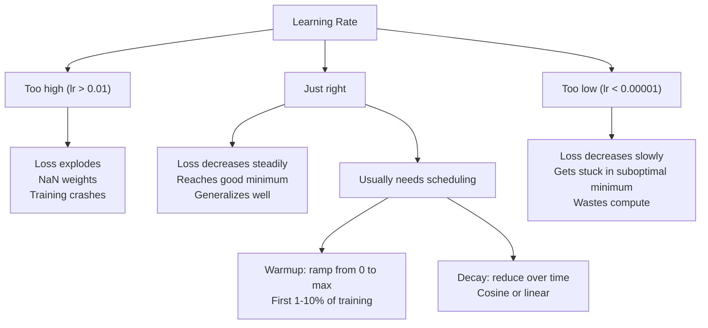
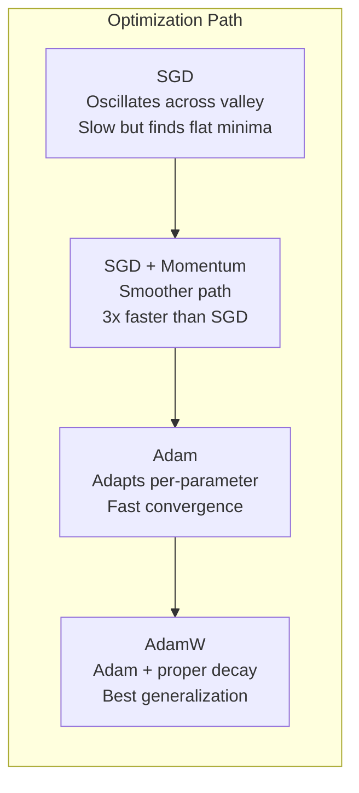
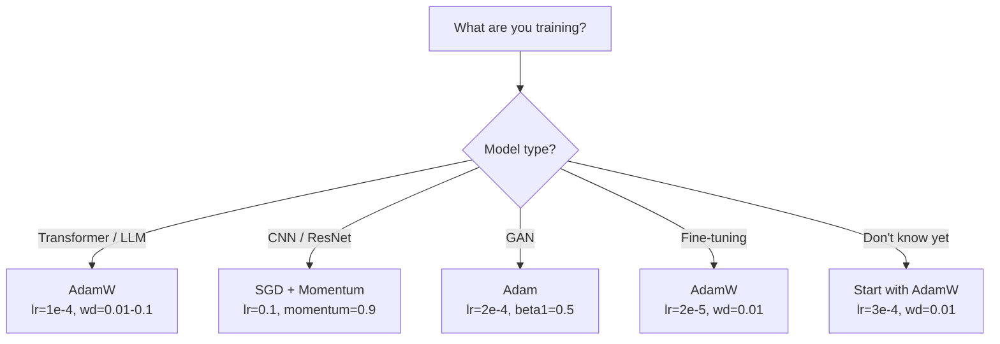

# Otimizadores.

> A descida gradiente diz-lhe em que direcção se mover, não diz nada sobre a distância ou a velocidade.

> **【中文解读】**梯度下降告诉你方向,但不说步幅和速度──SGD 像指南针只知道方向──Adam 像带实时路况的GPS根据历史信息调整策略──本章从零实现 SGD → Momentum → Adam → AdamW,理解每一步优化的直觉──

**Type:** Build
**Languages:** Python
**Prerequisites:** Lesson 03.05 (Loss Functions)
**Time:** ~75 minutes

## Objetivos de aprendizagem

- Implementar SGD, SGD com impulso, Adam e AdamW optimizadores a partir do zero em Python
- Explique como a correção de preconceito de Adão compensa as estimativas de momento initializadas em zero nas primeiras etapas de treinamento
- Demonstrar por que o AdamW produz uma melhor generalização do que o Adam com regularização L2 na mesma tarefa
- Selecione o optimizador adequado e os hiperparâmetros padrão para transformadores, CNNs, GANs e ajustes finos

## O problema é o problema da introdução

Você calculou os gradientes. Você sabe que o peso # 4.721 deve diminuir 0,003 para reduzir a perda. Mas 0,003 em que unidades? Escalado por que? E você deve mover a mesma quantidade no passo 1 como no passo 1,000?

> Você calculou a gradiência. Você sabe que o peso #4,721  deve ser reduzido em 0,003 para reduzir a perda. Mas 0.003 é uma unidade?

A descida do gradiente de vanilla aplica a mesma taxa de aprendizagem a cada parâmetro em cada etapa: gradiente w = w - lr *. Isto cria três problemas que tornam doloroso o treinamento das redes neurais na prática.

> A redução do gradiente inicial em cada etapa para cada parâmetro aplica a mesma taxa de aprendizagem: w = w - lr * gradiente.

Primeiro, oscilação. A paisagem de perdas raramente tem a forma de uma tigela lisa. É mais como um vale longo e estreito. A gradiente aponta através do vale (direção íngreme), não ao longo dele (direção de fundo). A descida gradual rebote para frente e para trás através da dimensão estreita, enquanto faz pequenos progressos ao longo da útil. Viste isto: a perda cai rapidamente depois dos planaltos, não porque o modelo converge mas porque está oscilando.

> Primeiro, os os movimentos de oscilação são muito pequenos, como os movimentos de uma bola plana. É mais parecido com um vale longo e estreito. Os movimentos de oscilação são orientados para o lado esquerdo do vale, em vez de para o lado esquerdo.

Em segundo lugar, uma taxa de aprendizagem para todos os parâmetros é errada. Alguns pesos precisam de grandes atualizações (eles estão no estágio inicial, de falta de ajuste). Outros precisam de pequenas atualizações (eles estão perto de seu valor ideal).

> Em segundo lugar, todos os parâmetros compartilham uma taxa de aprendizagem é errada. Alguns têm grandes necessidades de atualização.

Terceiro, pontos de sela. Em dimensões altas, a paisagem de perdas tem vastas regiões planas onde o gradiente é próximo de zero. SGD de vainilha rasteja através delas à velocidade do gradiente, que é efetivamente zero. O modelo parece preso. Não está preso - está em uma região plana com descida útil do outro lado. Mas SGD não tem nenhum mecanismo para empurrar através.

> Três, pontos. Em altitudes, a perda de curvas na superfície tem uma grande parte da região plana, a gradiência aproximada de zero.

O Adam resolve as três. Mantém duas médias em execução por parâmetro - o gradiente médio (momento, manipula oscilação) e o gradiente quadrado médio (taxa adaptativa, manipula escalas diferentes). Combinado com correção de preconceito para as primeiras etapas, dá-lhe um único optimizador que funciona em 80% dos problemas com hiperparâmetros padrão. Esta lição construiu-o do zero para que você entenda exatamente quando e por que falha nos outros 20%.

> Adam resolveu todos os três problemas. Manterá dois quadros de cada parâmetro, o valor médio da operação (a) e o valor médio da escala (a) e o gradiente médio (a) da adaptação (a) e da escala (a) combinados com as variações de variação dos passos anteriores, fornecerá um único mecanismo de otimização, aplicado a 80% de problemas sob superparâmetros padrão. Esta aula irá construí-lo a partir de zero, permitindo-lhe entender com precisão quando e por que falhou nos outros 20% de problemas.

> **【中文解读】**O SGD inicial tem três problemas: oscilação (violência) (violência) (violência) (violência) (violência) (violência) (violência) (violência) (violência) (violência) (violência) (violência) (violência) (violência) (violência) (violência) (violência) (violência) (violência) (violência) (violência) (violência) (violência) (violência) (violência) (violência) (violência) (violência) (violência) (violência) (violência) (violência) (violência) (violência) (violência) (violência) (violência) (violência) (violência) (violência) (violência) (violência) (violência) (violência) (violência) (violência) (violência) (violência) (violência) (violência) (violência) (violência) (violência) (violência) (violência) (violência) (violência) (vivivivi) (vi) (violência) (vivi) (violência) (vivi) (vivivivi) (vivi) (vivivivi) (vivivivi) (vivivi) (vi) (vivivi) (vivivivi) (vivi) (vi) (vivivivi) (vi) (vivi) (vivivivi)) (vi) (vivi) (vi) (vi) (vi) (vi) (vi) (vi) (vi) (vi) (vi) (vi) (vi) (vi) (vi) (vi) (vi) (vi) (vi)) (vi) (vi) (vi) (vi) (vi) (vi) (vi) (vi) (vi) (vi) (vi) (vi) (vi) (vi) (vi) (vi) (vi) (vi) (vi) (vi)

## O conceito central.

### Descenso de gradiente estocástico (SGD) 随机梯度下降

Otimizador mais simples: calcular o gradiente num mini-batch e dar um passo na direção oposta.

> Otimizador mais simples: calcular a gradiência em pequena quantidade, e depois dar um passo na direção oposta.

```
w = w - lr * gradient    # 最简单的参数更新公式
```

O "estocástico" significa que se usa um subconjunto aleatório (mini-batch) de dados para estimar o gradiente, em vez do conjunto completo de dados. Este ruído é realmente útil - ajuda a escapar a mínimos locais nítidos. Mas o ruído também causa oscilação.

> "Quando" significa que você usa um conjunto random de dados para estimar a gradiência, e não o conjunto inteiro de dados. Este ruído é realmente útil, pois ajuda a escapar do valor mínimo local da ponta.

A taxa de aprendizagem é a única ponta. Muito alta: a perda diverge. Muito baixa: o treinamento leva para sempre. O valor ideal depende da arquitetura, dos dados, do tamanho do lote e da fase atual do treinamento. Para a SGD de baunilha nas redes modernas, os valores típicos variam de 0,01 a 0,1. Mas mesmo dentro de uma única corrida de treinamento, a taxa de aprendizagem ideal muda.

> A taxa de aprendizagem é única. Muito alta: perda de disseminação. Muito baixa: o treinamento é sempre incompleto. O melhor valor depende da estrutura, dados, volume e tamanho da formação na fase atual. Para a SGD original na rede moderna, o valor típico é de 0,01 a 0,1 .

### Impulso.

A analogia de bola-rolando-descer é excessivamente usada, mas precisa. Em vez de pisar apenas o gradiente, você mantém uma velocidade que se acumula em gradientes anteriores.

> A metáfora de um descendo de bola é muito usada, mas é muito precisa.

```
m_t = beta * m_{t-1} + gradient    # 速度 = 衰减 × 历史速度 + 当前梯度
w = w - lr * m_t                    # 沿速度方向更新
```

O beta (normalmente 0,9) controla a quantidade de histórico a ser mantido. Com beta = 0,9, o momento é aproximadamente a média dos últimos 10 gradientes (1 / (1 - 0,9) = 10).

> Beta(normalmente em 0,9) controle reter muito histórico;; quando beta = 0,9 时,动量大约是最近10 个梯度的平均值;;1/ (1 - 0,9) = 10);;

Por que isso corrige a oscilação: gradientes que apontam na mesma direção se acumulam. Gradientes que desviam a direção cancelam. Nesse vale estreito, o componente "cross" vira a marca de cada passo e diminui. O componente "along" permanece consistente e se amplifica. O resultado é uma aceleração suave na direção útil.

> Por que isso pode reorganizar os oscilações: os gradientes acumulam-se em direção a mesma direção. Os gradientes de oscilação de direção se contrapõem entre si.

Números reais: SGD sozinho em um cenário de perda mal condicionado pode levar 10.000 passos. SGD com impulso (beta = 0,9) normalmente leva 3.000-5.000 passos no mesmo problema. A aceleração não é marginal.

> 具体数字: em termos de condições difíceis, um SGD individual pode exigir 10.000 步──带动量beta=0.9) de SGD em um mesmo problema normalmente requer 3.000-5.000 步── aceleração não é insignificante.

> **【拓展：SGD + Momentum 的 resurgence】**Embora Adam é uma escolha padrão, o artigo de 2023 mostra que SGD+Momentum ainda tem vantagens em tarefas específicas.

### RMSProp é uma forma de se espalhar.

O primeiro método de taxa de aprendizagem adaptativa por parâmetro que realmente funcionou. Proposto por Hinton em uma palestra do Coursera (nunca publicado formalmente).

> Primeiro método de aprendizagem de cada parâmetro realmente eficaz.

```
s_t = beta * s_{t-1} + (1 - beta) * gradient^2
w = w - lr * gradient / (sqrt(s_t) + epsilon)
```

Os parâmetros com gradientes consistentemente grandes são divididos por um grande número (taxa de aprendizagem eficaz menor).

> s_t                                                                                                                                                                                                                                                                                                                                                                                                                                                                                                                           

Isto resolve o problema de "uma taxa de aprendizagem para todos os parâmetros". Um peso que já recebeu grandes atualizações provavelmente está perto do seu objetivo - desacelerá-lo. Um peso que recebeu pequenas atualizações pode ser subtraído - acelerá-lo.

> Isso resolveu o problema de "todos os parâmetros compartilham uma taxa de aprendizagem". Um peso já obtido de grande atualização pode chegar perto do objetivo.

O Epsilon (tipicamente 1e-8) impede a divisão por zero quando um parâmetro não foi atualizado.

> Epsilon(normalmente 1e-8) para evitar que os parâmetros não sejam atualizados quando exceto em zero.

### Adam: Momentum + RMSProp . Adam:动量 + auto-adaptação de aprendizagem

Adam combina ambas as ideias, mantendo duas médias móveis exponenciais por parâmetro:

> Adam combinou duas ideias. Ele mantém duas índices de média móvel para cada parâmetro:

```
m_t = beta1 * m_{t-1} + (1 - beta1) * gradient        (first moment: mean)        # 一阶矩：梯度均值
v_t = beta2 * v_{t-1} + (1 - beta2) * gradient^2       (second moment: variance)   # 二阶矩：梯度方差
```

**Bias correction**é o detalhe chave que a maioria das explicações ignoram. No passo 1, m_1 = (1 - beta1) * gradiente. com beta1 = 0,9, que é 0,1 * gradiente - dez vezes muito pequeno. A média móvel ainda não aqueceu.

> **偏差修正**É a maioria das explicações sobre o salto.

```
m_hat = m_t / (1 - beta1^t)
v_hat = v_t / (1 - beta2^t)
```

No passo 1 com beta1 = 0,9: m_hat = m_1 / (1 - 0,9) = m_1 / 0,1 = a gradiente real. No passo 100: (1 - 0,9^100) é aproximadamente 1,0, então a correção desaparece.

> 第 1 步 beta1 = 0,9 时:m_hat = m_1 / (1 - 0,9) = m_1 / 0.1 = 实际梯度──第 100 步:(1 - 0,9^100) 大约等于 1.0,修正消失──偏差修正对前 ~10 步重要,~50 步后无关紧要──

A actualização:

> 更新公式:

```
w = w - lr * m_hat / (sqrt(v_hat) + epsilon)
```

Os padrões padrão de Adam: lr = 0,001, beta1 = 0,9, beta2 = 0,999, epsilon = 1e-8. Estes padrões funcionam para 80% dos problemas. Quando não, mude primeiro lr. Depois beta2.

> Adam 默认值:lr = 0,001,beta1 = 0,9,beta2 = 0,999,epsilon = 1e-8。 estes valores-默认 são aplicáveis a 80% dos problemas──不适用时,先调 lr,再调 beta2──几乎不需要改beta1或epsilon──

> **【拓展：Adam 的局限性】**Embora Adam seja o melhortimizador mais comum, não é perfeito: 1) em alguns problemas convexos recebe  não como SGD; 2) A generalização de Adam tem alguma vez diferença em relação ao SGD; 3) O custo de armazenamento de Adam é de 2-3 vezes o SGD; 2) a necessidade de armazenamento de m e v) ・ AdamW + ScheduleFree de 2024 é uma nova direção de melhoria.

### A perda de peso foi feita corretamente.

A regularização L2 adiciona lambda * w^2 à perda. em SGD de baunilha, isto é equivalente a decadência de peso (subtraindo lambda * w do peso em cada passo). em Adam, esta equivalência rompe.

> L2 Otimizar-se-á lambda * w^2 adiada a perda. Em SGD original, esta é a taxa de perda de peso. Em Adam, esta taxa de perda foi rompida.

A visão de Loshchilov & Hutter: quando adicionamos L2 à perda e depois Adam processa o gradiente, a taxa de aprendizagem adaptativa escala o termo de regularização também. Parâmetros com grande variação de gradiente obtêm menos regularização. Parâmetros com pequena variação obtêm mais. Isto não é o que você quer - você quer regularização uniforme independentemente das estatísticas de gradiente.

> Loshchilov 和 Hutter's insight: quando você adiciona L2 a perda, então Adam 处理梯度时, a taxa de aprendizagem de auto-adaptação também se reduz ao esquema de normalização.

A AdamW corrige isto aplicando a perda de peso diretamente aos pesos, após a atualização do Adam:

```
w = w - lr * m_hat / (sqrt(v_hat) + epsilon) - lr * lambda * w    # Adam 更新 + 解耦权重衰减
```

O termo de declínio de peso (lr * lambda * w) não é escalado pelo fator adaptativo de Adam.

Isto parece um detalhe menor. Não é. O AdamW converge para melhores soluções do que a regularização de Adam + L2 em praticamente todas as tarefas. É o optimizador padrão no PyTorch para treinamento de transformadores, modelos de difusão e a maioria das arquiteturas modernas. BERT, GPT, LLaMA, Diffusão estável - todos treinados com o AdamW.

> **【中文解读】**AdamW 关键改进:权重衰减不经过 Adam的自适应缩放,作用直接于参数──BERT、GPT、Llama、Stable Diffusion 都用 AdamW 训练──默认参数:lr=3e-4, weight_decay=0.01──

> **【拓展：LoRA 微调中的 AdamW】**Usando o LoRA 微调 LLM 时, normalmente usando o AdamW(lr=2e-5~1e-4, peso_decay=0.01)。LoRA apenas treina a baixa ordem de desintegração da matriz A 和 B, o peso de decadência do AdamW ajuda a controlar a amplitude destes novos elementos。

### Taxa de aprendizagem: o hiperparâmetro mais importante



Se ajustar um hiperparâmetro, ajuste a taxa de aprendizagem. Uma mudança 10x na taxa de aprendizagem importa mais do que qualquer decisão arquitetônica que você tome.

> Se você apenas ajustar um superparâmetro, ajustar a taxa de aprendizagem.

- SGD: lr = 0,01 a 0,1
  SGD:lr = 0,01 a 0,1
- Adam/AdamW: lr = 1e-4 a 3e-4
  Adam/AdamW:lr = 1e-4 até 3e-4
- Modelos pré-treinados para ajuste fino: lr = 1e-5 a 5e-5
  微调预训练模型:lr = 1e-5 até 5e-5
- Aquecimento da taxa de aprendizagem: rampa linear durante os primeiros 1-10% das etapas
  Taxa de aquecimento do aprendizado: 1-10% de aumento da temperatura

### Optimizador Comparador versus optimizador



### Quando cada optimizador ganha



> **【拓展：深度学习中优化器的演进】**Desde 2012 SGD+Momentum da AlexNet, até 2014 Adam propôs, novamente até 2017 AdamW nasceu  desenvolvimento de optimizador fazer treinamento de "necessidade de várias semanas de modificação" para "parâmetro padrão em forma de execução"。Llama 3 405B treinamento usando AdamW, pico lr=3e-4, em 16384 blocos H100 GPUs treinado 30,8M GPU 小时──

## Construí-lo e realizei-o.

> **【中文解读】**Abaixo desde zero realizamos quatro tipos de optimizadores: SGD → SGD+Momentum → Adam → AdamW── cada um está na base do anterior para adicionar um mecanismo fundamental── atenção para a correção de preconceito de AdamW e a redução do peso de AdamW é o ponto de conhecimento da entrevista.
```figure
optimizer-trajectory
```

## Construí-lo

### Passo 1: SGD de vainilha.

> SGD: Parâmetros directamente deduzidos de taxa de aprendizagem multiplicada por gradiente.

```python
class SGD:
    def __init__(self, lr=0.01):
        self.lr = lr

    def step(self, params, grads):
        for i in range(len(params)):
            params[i] -= self.lr * grads[i]
```

### Passo 2: SGD com Momentum.

> SGD+Momento: introdução de variação de velocidade, acumulação de gradientes históricos.

```python
class SGDMomentum:
    def __init__(self, lr=0.01, beta=0.9):
        self.lr = lr
        self.beta = beta
        self.velocities = None

    def step(self, params, grads):
        if self.velocities is None:
            self.velocities = [0.0] * len(params)
        for i in range(len(params)):
            self.velocities[i] = self.beta * self.velocities[i] + grads[i]
            params[i] -= self.lr * self.velocities[i]
```

### Passo 3: Adam.

> Adam:维护一阶矩 m (%) 梯度平均值) 和二阶矩 v (%) 梯度方差),加上偏差修正──80% dos problemas com parâmetros em formato em formato em formato em formato em formato em formato em formato em formato em formato em formato em formato em formato em formato em formato em formato em formato em formato em formato em formato em formato em formato em formato em formato em formato em formato em formato em formato em formato em formato em formato em formato em formato em formato em formato em formato em formato em formato em formato em formato em formato em formato em formato de formato em formato em formato em formato em formato em formato em formato de formato em formato em formato em formato em formato em formato em formato de formato em formato em formato em formato em formato de formato em formato em formato em formato de formato em formato em formato em formato de formato em formato em formato em formato de formato em formato em formato em formato em formato de formato em formato em formato em formato em formato de formato em formato em formato em formato de formato em formato em formato em formato de formato em formato em formato em formato de formato em formato em formato em formato de formato em formato em formato de formato em formato em formato em formato de formato em formato em formato em formato de formato em formato em formato em formato em formato de formato em formato em formato em formato de formato em formato em formato de formato em formato em formato em formato de formato em formato em formato em formato de formato em formato em formato de formato em formato em formato em formato de formato em formato de formato em formato em formato de formato em formato em formato de formato de formato em formato em formato de formato em formato em formato em formato de formato.

```python
import math

class Adam:
    def __init__(self, lr=0.001, beta1=0.9, beta2=0.999, epsilon=1e-8):
        self.lr = lr
        self.beta1 = beta1
        self.beta2 = beta2
        self.epsilon = epsilon
        self.m = None
        self.v = None
        self.t = 0

    def step(self, params, grads):
        if self.m is None:
            self.m = [0.0] * len(params)
            self.v = [0.0] * len(params)

        self.t += 1

        for i in range(len(params)):
            self.m[i] = self.beta1 * self.m[i] + (1 - self.beta1) * grads[i]
            self.v[i] = self.beta2 * self.v[i] + (1 - self.beta2) * grads[i] ** 2

            m_hat = self.m[i] / (1 - self.beta1 ** self.t)
            v_hat = self.v[i] / (1 - self.beta2 ** self.t)

            params[i] -= self.lr * m_hat / (math.sqrt(v_hat) + self.epsilon)
```

### Passo 4: AdamW.

> AdamW: Baseado em Adam, a redução de peso do gradiente de um gradiente é reduzida diretamente ao próprio parâmetro, sem passar por uma redução de m e v.

```python
class AdamW:
    def __init__(self, lr=0.001, beta1=0.9, beta2=0.999, epsilon=1e-8, weight_decay=0.01):
        self.lr = lr
        self.beta1 = beta1
        self.beta2 = beta2
        self.epsilon = epsilon
        self.weight_decay = weight_decay
        self.m = None
        self.v = None
        self.t = 0

    def step(self, params, grads):
        if self.m is None:
            self.m = [0.0] * len(params)
            self.v = [0.0] * len(params)

        self.t += 1

        for i in range(len(params)):
            self.m[i] = self.beta1 * self.m[i] + (1 - self.beta1) * grads[i]
            self.v[i] = self.beta2 * self.v[i] + (1 - self.beta2) * grads[i] ** 2

            m_hat = self.m[i] / (1 - self.beta1 ** self.t)
            v_hat = self.v[i] / (1 - self.beta2 ** self.t)

            params[i] -= self.lr * m_hat / (math.sqrt(v_hat) + self.epsilon)
            params[i] -= self.lr * self.weight_decay * params[i]
```

### Passo 5: Comparar treinamento.

Treinar a mesma rede de duas camadas no conjunto de dados do círculo da lição 05 com os quatro optimizadores.

> Usando o 5o curso de treinamento de conjunto de dados circulares, comparado com a velocidade de recepção de quatro tipos de optimizadores, a mesma rede de dois níveis.

```python
import random

def sigmoid(x):
    x = max(-500, min(500, x))
    return 1.0 / (1.0 + math.exp(-x))

def make_circle_data(n=200, seed=42):
    random.seed(seed)
    data = []
    for _ in range(n):
        x = random.uniform(-2, 2)
        y = random.uniform(-2, 2)
        label = 1.0 if x * x + y * y < 1.5 else 0.0
        data.append(([x, y], label))
    return data


class OptimizerTestNetwork:
    def __init__(self, optimizer, hidden_size=8):
        random.seed(0)
        self.hidden_size = hidden_size
        self.optimizer = optimizer

        self.w1 = [[random.gauss(0, 0.5) for _ in range(2)] for _ in range(hidden_size)]
        self.b1 = [0.0] * hidden_size
        self.w2 = [random.gauss(0, 0.5) for _ in range(hidden_size)]
        self.b2 = 0.0

    def get_params(self):
        params = []
        for row in self.w1:
            params.extend(row)
        params.extend(self.b1)
        params.extend(self.w2)
        params.append(self.b2)
        return params

    def set_params(self, params):
        idx = 0
        for i in range(self.hidden_size):
            for j in range(2):
                self.w1[i][j] = params[idx]
                idx += 1
        for i in range(self.hidden_size):
            self.b1[i] = params[idx]
            idx += 1
        for i in range(self.hidden_size):
            self.w2[i] = params[idx]
            idx += 1
        self.b2 = params[idx]

    def forward(self, x):
        self.x = x
        self.z1 = []
        self.h = []
        for i in range(self.hidden_size):
            z = self.w1[i][0] * x[0] + self.w1[i][1] * x[1] + self.b1[i]
            self.z1.append(z)
            self.h.append(max(0.0, z))

        self.z2 = sum(self.w2[i] * self.h[i] for i in range(self.hidden_size)) + self.b2
        self.out = sigmoid(self.z2)
        return self.out

    def compute_grads(self, target):
        eps = 1e-15
        p = max(eps, min(1 - eps, self.out))
        d_loss = -(target / p) + (1 - target) / (1 - p)
        d_sigmoid = self.out * (1 - self.out)
        d_out = d_loss * d_sigmoid

        grads = [0.0] * (self.hidden_size * 2 + self.hidden_size + self.hidden_size + 1)
        idx = 0
        for i in range(self.hidden_size):
            d_relu = 1.0 if self.z1[i] > 0 else 0.0
            d_h = d_out * self.w2[i] * d_relu
            grads[idx] = d_h * self.x[0]
            grads[idx + 1] = d_h * self.x[1]
            idx += 2

        for i in range(self.hidden_size):
            d_relu = 1.0 if self.z1[i] > 0 else 0.0
            grads[idx] = d_out * self.w2[i] * d_relu
            idx += 1

        for i in range(self.hidden_size):
            grads[idx] = d_out * self.h[i]
            idx += 1

        grads[idx] = d_out
        return grads

    def train(self, data, epochs=300):
        losses = []
        for epoch in range(epochs):
            total_loss = 0.0
            correct = 0
            for x, y in data:
                pred = self.forward(x)
                grads = self.compute_grads(y)
                params = self.get_params()
                self.optimizer.step(params, grads)
                self.set_params(params)

                eps = 1e-15
                p = max(eps, min(1 - eps, pred))
                total_loss += -(y * math.log(p) + (1 - y) * math.log(1 - p))
                if (pred >= 0.5) == (y >= 0.5):
                    correct += 1
            avg_loss = total_loss / len(data)
            accuracy = correct / len(data) * 100
            losses.append((avg_loss, accuracy))
            if epoch % 75 == 0 or epoch == epochs - 1:
                print(f"    Epoch {epoch:3d}: loss={avg_loss:.4f}, accuracy={accuracy:.1f}%")
        return losses
```

> **【拓展：GPT 训练中的优化器选择】**GPT 系列 全部使用 Adam 优化器(GPT-4 推测也使用 AdamW) 』训练时一个常见技巧: embebedar 层和输出层 层使用不同的学习率──在 PyTorch 中通过参数组 实现:`optimizer = AdamW([{'params': base_params}, {'params': head_params, 'lr': lr*0.1}])`- Não.

## Use-o com o framework implementado.

> **【中文解读】**PyTorch 中的训练循环模式:zero_grad → forward → loss → backward → clip → step → schedule──这个顺序不能搞错──CNN 用 SGD+Momentum(lr=0.1),Transformer 用 AdamW(lr=1e-4)──

Os otimizadores PyTorch tratam grupos de parâmetros, corte de gradientes e agendamento de taxa de aprendizagem:

```python
import torch
import torch.optim as optim

model = torch.nn.Sequential(
    torch.nn.Linear(784, 256),
    torch.nn.ReLU(),
    torch.nn.Linear(256, 10),
)

optimizer = optim.AdamW(model.parameters(), lr=3e-4, weight_decay=0.01)

scheduler = optim.lr_scheduler.CosineAnnealingLR(optimizer, T_max=100)

for epoch in range(100):
    optimizer.zero_grad()
    output = model(torch.randn(32, 784))
    loss = torch.nn.functional.cross_entropy(output, torch.randint(0, 10, (32,)))
    loss.backward()
    torch.nn.utils.clip_grad_norm_(model.parameters(), max_norm=1.0)
    optimizer.step()
    scheduler.step()
```

O padrão é sempre: zero_grad, para frente, perda, para trás, (clip), passo, (orágio). Memorize essa ordem.

Para os CNNs, muitos praticantes ainda preferem SGD + impulso (lr=0,1, impulso=0,9, peso_descaso=1e-4) com um cronograma de passo ou cosino. SGD encontra mínimos mais planos, que geralmente se generalizam melhor. Para transformadores e LLM, AdamW com aquecimento + decadência cosina é o padrão universal. Não lute contra o consenso sem uma razão medida.

## Envia-o . Produto .

Esta lição produz:
- `outputs/prompt-optimizer-selector.md`-- um impulso de decisão para escolher otimizador certo e taxa de aprendizagem para qualquer arquitetura

## Exercícios.

1. Implementar o momento de Nesterov, onde você calcula o gradiente na posição "lookahead" (w - lr * beta * v) em vez da posição atual. Compare a convergência com o momento padrão no conjunto de dados do círculo.
   > **练习 1：**实现 Nesterov 动量 (→ "precedente")), em relação à velocidade de recepção do movimento padrão.

2. Implementar um cronograma de aquecimento de aprendizagem: rampa linear de 0 a max_lr durante os primeiros 10% das etapas de treinamento, em seguida, decadência cosina para 0. Treinar com Adam + aquecimento vs. Adam sem aquecimento. Medir quantas épocas é necessário para atingir 90% de precisão no conjunto de dados do círculo.
   > **练习 2：** atingir o aquecimento + declínio do cosino  a redução da taxa de aquecimento, em relação ao aquecimento   atingir 90%                                                                                                                                                                                                                                                                                                                                                                                                                                                                                           

3. A taxa de aprendizagem eficaz para cada parâmetro durante o treinamento de Adam. A taxa efetiva é lr * m_hat / (sqrt(v_hat) + eps).
   > **练习 3：** acompanhar o Adam  treino  taxa de aprendizagem eficaz de cada parâmetro, observar as diferenças de velocidade de atualização de diferentes parâmetros 

4. Implemente o corte de gradiente (clipe por norma global). Defina a norma de gradiente máximo para 1.0. Treine com e sem corte usando uma alta taxa de aprendizagem (lr=0,01 para Adam). Conte quantas corridas divergem (perda vai para NaN) com e sem corte de mais de 10 sementes aleatórias.
   > **练习 4：** Realizar a taxa de corte, estatística/sem corte de tempo de alta taxa de aprendizagem

5. Compare Adam vs. AdamW em uma rede com grandes pesos. Iniciar todos os pesos para valores aleatórios em [-5, 5] (muito maior do que o normal). Treinar por 200 épocas com peso_decay = 0,1.
   > **练习 5：**Em grande peso inicial em relação a Adam e AdamW, observe a diferença de efeito de diminuição do peso em relação a AdamW.

## Termos-chave .

| Term | What people say | What it actually means |
|------|----------------|----------------------|
| Learning rate | "Step size" | The scalar multiplier on the gradient update; the single most impactful hyperparameter in training |
| SGD | "Basic gradient descent" | Stochastic gradient descent: update weights by subtracting lr * gradient, computed on a mini-batch |
| Momentum | "Rolling ball analogy" | Exponential moving average of past gradients; dampens oscillation and accelerates consistent directions |
| RMSProp | "Adaptive learning rate" | Divides each parameter's gradient by the running RMS of its recent gradients; equalizes learning rates |
| Adam | "The default optimizer" | Combines momentum (first moment) and RMSProp (second moment) with bias correction for the initial steps |
| AdamW | "Adam done right" | Adam with decoupled weight decay; applies regularization directly to weights rather than through the gradient |
| Bias correction | "Warmup for running averages" | Dividing by (1 - beta^t) to compensate for the zero-initialization of Adam's moment estimates |
| Weight decay | "Shrink the weights" | Subtracting a fraction of the weight value at each step; a regularizer that penalizes large weights |
| Learning rate schedule | "Changing lr over time" | A function that adjusts the learning rate during training; warmup + cosine decay is the modern default |
| Gradient clipping | "Capping the gradient norm" | Scaling down the gradient vector when its norm exceeds a threshold; prevents exploding gradient updates |

| 术语 | 通俗说法 | 实际含义 |
|------|---------|---------|
| 学习率 (Learning rate) | "步长" | 梯度更新的标量乘数；训练中影响最大的超参数 |
| SGD | "基础梯度下降" | 随机梯度下降：用小批量梯度更新 w -= lr * grad |
| 动量 (Momentum) | "滚球的类比" | 历史梯度的指数移动平均；抑制振荡、加速一致方向 |
| RMSProp | "自适应学习率" | 除以梯度平方的移动平均根；均衡各参数学习速度 |
| Adam | "默认优化器" | 动量 + RMSProp + 偏差修正的统一优化器 |
| AdamW | "正确的 Adam" | Adam + 解耦权重衰减；直接对参数施加正则化 |
| 偏差修正 (Bias correction) | "运行平均的热身" | 除以 (1-beta^t) 补偿 Adam 矩估计的零初始化偏差 |
| 权重衰减 (Weight decay) | "缩小权重" | 每步减去权重的一小部分；惩罚大权重的正则化手段 |
| 学习率调度 (LR schedule) | "随时间改变 lr" | 训练中调整学习率的函数；warmup + cosine decay 是现代标配 |
| 梯度裁剪 (Gradient clipping) | "限制梯度范数" | 梯度范数超限时缩小梯度；防止梯度爆炸 |

## Mais leitura 延伸阅读

- Kingma & Ba, "Adam: Um Método para a Optimização Stocástica" (2014) -- o original papel Adam com análise de convergência e a derivação de correção de viés
- Loshchilov & Hutter, "Regularização Decadência de Peso Desacoplada" (2017) -- provou que a regularização de L2 e a perda de peso não são equivalentes em Adam, e propôs AdamW
- Smith, "Taxas de aprendizagem cíclicas para treinamento de redes neurais" (2017) -- introduziu o teste de faixa LR e os horários cíclicos que removem a necessidade de ajustar uma taxa de aprendizagem fixa
- Ruder, "Uma visão geral dos algoritmos de otimização de descida gradual" (2016) - a melhor pesquisa única de todas as variantes do optimizador, com comparações e intuições claras
