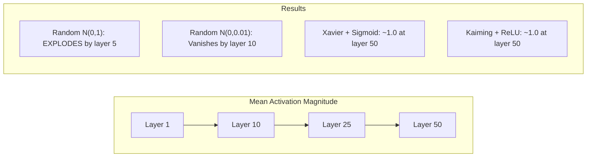
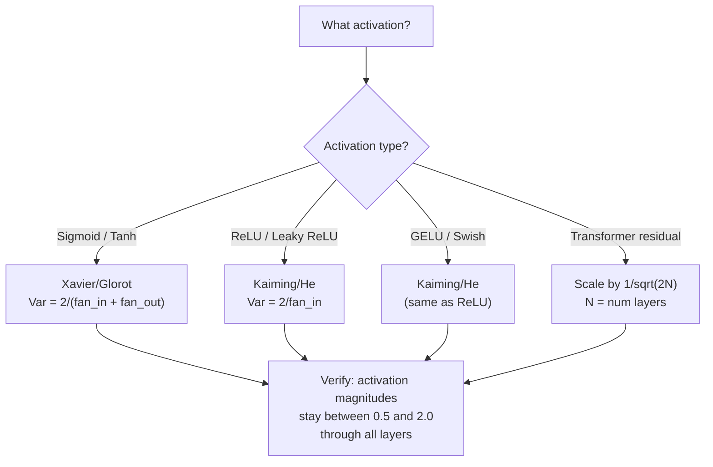

# Peso Inicialização e treinamento Estabilidade .

> Iniciar errado e o treinamento nunca começa. Iniciar direito e 50 camadas treinar tão bem como 3.

> **【中文解读】**Iniciação errada, treinamento nunca começará 50 层网络的信号要么归归零要么爆炸──初始化对了,50 层训练和3 层一样平滑──Xavier 初始化(sigmoid/tanh) 和 Kaiming 初始化(ReLU/GELU) são as bases do aprendizado moderno de profundidade──

**Type:** Build
**Languages:** Python
**Prerequisites:** Lesson 03.04 (Activation Functions), Lesson 03.07 (Regularization)
**Time:** ~90 minutes

## Objetivos de aprendizagem

- Implementar estratégias de inicialização zero, aleatório, Xavier/Glorot e Kaiming/He e medir seu efeito sobre as magnitudes de ativação através de 50 camadas
- Derive por que Xavier init usa Var(w) = 2/(fan_in + fan_out) e Kaiming usa Var(w) = 2/fan_in
- Demonstrar o problema de simetria com inicialização zero e explicar por que a escala aleatória sozinha é insuficiente
- Compare a estratégia de inicialização correta com a função de ativação: Xavier para sigmoid/tanh, Kaiming para ReLU/GELU

> **【中文解读】**O problema central do livro é: como escolher o peso inicial, fazer o sinal desaparecer ou explodir em 50 níveis de rede?

## O problema é o problema da introdução

Inicializem todos os pesos para zero. Nada aprende. Cada neurona calcula a mesma função, recebe o mesmo gradiente e atualiza-se de forma idêntica. Após 10.000 épocas, a sua camada oculta de 512 neuronas ainda é 512 cópias do mesmo neurona. Você pagou por 512 parâmetros e obteve 1.

> Para começar, você deve ter o mesmo nível de informação, e você deve ter o mesmo nível de informação.

Inicializá-los muito grandes. Ativações explodem através da rede. Na camada 10, os valores atingem 1e15. Na camada 20, eles desabsorvem para o infinito.

> Iniciação muito grande. Valor ativo em rede explode. Até o 10o nível, valor alcança 1e15. Até o 20o nível, eles se derramam para infinito.

Inicia-los aleatoriamente a partir de uma distribuição normal padrão. Funciona para 3 camadas. Em 50 camadas, o sinal desabre para zero ou detona para o infinito dependendo de se a escala aleatória foi um pouco pequena ou um pouco grande demais. O limite entre "trabalho" e "rompo" é fino como uma navalha.

> A partir do padrão normal, a distribuição é de 3 níveis, pode ser trabalhado em 50 níveis, o sinal se acumulará para zero ou explodirá para infinito, dependendo da medida de qualquer tipo de "válida" ou "malfeita".

A inicialização do peso é a decisão mais subestimada na aprendizagem profunda. A arquitetura recebe papéis. Os optimistas recebem postagens de blog. A inicialização recebe uma nota de rodapé. Mas se errarem e nada mais importa - a sua rede está morta antes que o treinamento comece.

> O poder de inicialização é a decisão mais menos avaliada do aprendizado profundo. A estrutura pode desenvolver artigos. Otimizador pode escrever blogs. O poder de inicialização só pode ser dado por um único erro.

> **【中文解读】**O iniciamento é a decisão mais pouco avaliada do aprendizado profundo. O iniciamento zero leva à comparação de todas as coisas do neurociência, e a diferença de forma ocasional pode levar a desaparecimento ou explosão de 50 níveis de sinais da rede. Xavier e Kaiming resolveram o problema através de uma orientação matemática.

> **【拓展：GPT-2 的残差缩放技巧】**GPT-2 introduziu um aumento de divisão de 1/sqrt(2N) de residuos em relação a cada nível (N é um número de níveis) ⋅ cada divisão de ligação x = x + subcamada (x) ⋅ 126, em três níveis, aumenta o número de divisões de divisões de 126, em 126 níveis ⋅ 126, em uma escala de 126, em uma escala de 126, em uma escala de 126, em uma escala de 126, em uma escala de 126, em uma escala de 126, em uma escala de 126, em uma escala de 126, em uma escala de 126, em uma escala de 126, em uma escala de 126, em uma escala de 126, em uma escala de 126, em uma escala de 126, em uma escala de 126, em uma escala de 126, em um nível de 126, em um nível de 126, em um nível de 126, em um nível de 126, em um nível de 126, em um nível de 126, em um nível de 126, em um nível de 126, em um nível de 126, em um nível de 126, em um nível de 126, em um nível de 126, em um nível de 126, em um nível de 126, em um nível de 126, em um nível de 126, em um nível de 3.

## O conceito central.

### O problema da simetria.

Cada neurônio numa camada tem a mesma estrutura: multiplicar as entradas por pesos, adicionar preconceito, aplicar ativação. Se todos os pesos começam no mesmo valor (zero é o caso extremo), cada neurônio calcula a mesma saída. Durante a propagação de volta, cada neurônio recebe o mesmo gradiente. Durante a etapa de atualização, cada neurônio muda pela mesma quantidade.

> Cada neurônio de uma camada tem a mesma estrutura: entrada multiplicada pelo peso, adição de parcelação, aplicação de função de ativação. Se a propriedade tiver o mesmo peso a partir do mesmo valor, cada neurônio calcula a mesma saída.

A rede tem centenas de parâmetros, mas todos se movem em sequência. Isto é chamado simetria, e a inicialização aleatória é a forma de quebrar a força bruta. Cada neurônio começa em um ponto diferente no espaço de peso, então cada um aprende uma característica diferente.

> Você está preso. A rede tem centenas de parâmetros, mas todos se movem em simultâneo. Isto é chamado de relatividade, e a inicialização do momento é uma forma violenta de quebrar o seu. Cada neurônio começa a partir de diferentes pontos do espaço pesado, por isso cada um aprende características diferentes.

Mas "aleatório" não é suficiente. A *escala* da aleatória determina se a rede está em funcionamento.

> Mas "as vezes" ainda não são suficientes. A medida das vezes é que a rede decide se pode treinar.

### Propagação de variância através de camadas

Considere uma única camada com entradas fan_in:

> 考虑一个有风扇_in 个输入的单层:

```
z = w1*x1 + w2*x2 + ... + w_n*x_n
```

Se cada peso wi for extraído de uma distribuição com variância Var(w) e cada entrada xi tem variância Var(x), a variância de saída é:

> Se cada peso de peso de uma divisão de divisão de Var (w) for distribuído, cada entrada de xi de divisão de divisão de Var (x), a divisão de divisão de divisão de divisão de divisão é:

```
Var(z) = fan_in * Var(w) * Var(x)
```

Se Var(w) = 1 e fan_in = 512, a variância de saída é 512x a variância de entrada. Depois de 10 camadas: 512^10 = 1.2e27.

> Se Var(w) = 1 且 fan_in = 512,输出差是输入差的 512 倍──10 层后:512^10 = 1.2e27──tudo sinal já explodiu──

Se Var ((w) = 0,001, a variância de saída diminui em 0,001 * 512 = 0,512 por camada. Após 10 camadas: 0,512^10 = 0,00013.

> Se Var(w) = 0,001, output outputs diferença por camada diminução 0,001 * 512 = 0,512──10 层后:0.512^10 = 0,00013──tudo sinal já desapareceu──

O objetivo: escolher Var(w) para que Var(z) = Var(x). A magnitude do sinal permanece constante em todas as camadas.

> 目標:选择 Var(w) 使 Var(z) = Var(x)。 sinal幅度逐层保持恒定──

> **【中文解读】**方差传播的数学:Var(z) = fan_in * Var(w) * Var(x)。 Se fan_in=512 且 Var(w) = 1,输出方差是输入的 512 倍──10 层后:512^10 = 1.2e27,信号爆炸──Xavier 和 Kaiming 的目标都是让 Var(z) = Var(x),使信号幅度逐层保持恒定──

### Xavier/Glorot Inicialização

Glorot e Bengio (2010) derivaram a solução para a ativação sigmoide e tanh.

> Glorot 和 Bengio (2010)                                                                                                                                                                                                                                                                                                                                                                                                                                                                                                                       

```
Var(w) = 2 / (fan_in + fan_out)
```

Na prática, os pesos são extraídos de:

> 实践中,权重从以下分布抽取:

```
w ~ Uniform(-limit, limit)  where limit = sqrt(6 / (fan_in + fan_out))
```

ou

```
w ~ Normal(0, sqrt(2 / (fan_in + fan_out)))
```

Isso funciona porque sigmoide e tanh são aproximadamente lineares perto de zero, onde as ativações iniciadas corretamente vivem.

> Isso é eficaz, porque o sigmoide e o tanh em torno de zero são quase lineares, enquanto o valor de atividade do início real é bem vivo em torno de zero.

### Kaiming / Ele Inicialização

ReLU mata metade das saídas (todo o negativo torna-se zero). O fan_in efetivo é reduzido à metade porque em média metade das entradas são zero. Xavier init não conta por isso - subestima a variância necessária.

> A ReLU vai reduzir metade da saída em zero, pois a média da entrada em zero foi reduzida em metade.

He et al. (2015) ajustaram a fórmula:

> He 等人 (2015) 调整了公式:

```
Var(w) = 2 / fan_in
```

Os pesos são extraídos de:

> 权重从以下分布抽取:

```
w ~ Normal(0, sqrt(2 / fan_in))
```

O fator de 2 compensa a re-realização de metade das ativações. Sem ele, o sinal encolhe em ~ 0,5x por camada. Com 50 camadas: 0,5^50 = 8,8e-16.

> 因子 2 补偿了 ReLU 将一半激活值置零――没有它,信号每层缩小约0.5倍――50层后:0.5^50 = 8.8e-16――Kaiming初始化防止这种情况――

> **【拓展：PyTorch 的默认初始化】**PyTorch 的 nn.Linear 默认使用 Kaiming Uniform 初始化(`nn.init.kaiming_uniform_`,mode='fan_in'), acompanhamento de LeakyReLU's negative_slope=sqrt(5)`nn.Linear(784, 256)`时,PyTorch 已经帮助你选择好初始化――但自定义架构(Transformer、混合专家模型) precisa de ajuste manual――

### Transformador Inicialização

O GPT-2 introduziu um padrão diferente. As conexões residuais adicionam a saída de cada subcamada à sua entrada:

> O GPT-2 introduziu um modelo diferente.

```
x = x + sublayer(x)
```

Cada adição aumenta a variância. Com N camadas residuais, a variância cresce proporcionalmente a N. GPT-2 escala os pesos das camadas residuais por 1/sqrt(2N), onde N é o número de camadas. Isso mantém a magnitude de sinal acumulada estável.

> Cada vez que a adição é feita, aumenta a diferença de camadas. Há N 个残差层时, 方差按 N 成比例增长――GPT-2 reduzirá o peso da diferença em 1/sqrt(2N), sendo N o número de camadas.

O Llama 3 (405B parâmetros, 126 camadas) usa um esquema similar. sem essa escala, o fluxo residual cresceria ilimitadamente através de 126 camadas de atenção e blocos de feedforward.

> Llama 3 ((4050 亿参数,126 层) utiliza um esquema semelhante. Não há tal redução, o residual fluxo passa por 126 层注意力和前块无限增长.

> **【拓展：混合专家模型（MoE）的初始化挑战】**Mixtral 8x7B 和 GPT-4 等模型 use MoE 架构, cada token apenas activa parte especialista. Iniciação quando precisa garantir: o peso inicial do routers não pode fazer todos os tokens ser escolhidos pelo mesmo especialista.

```mermaid
flowchart TD
    subgraph "Zero Init"
        Z1["Layer 1<br/>All weights = 0"] --> Z2["Layer 2<br/>All neurons identical"]
        Z2 --> Z3["Layer 3<br/>Still identical"]
        Z3 --> ZR["Result: 1 effective neuron<br/>regardless of width"]
    end

    subgraph "Xavier Init"
        X1["Layer 1<br/>Var = 2/(fan_in+fan_out)"] --> X2["Layer 2<br/>Signal stable"]
        X2 --> X3["Layer 50<br/>Signal stable"]
        X3 --> XR["Result: Trains with<br/>sigmoid/tanh"]
    end

    subgraph "Kaiming Init"
        K1["Layer 1<br/>Var = 2/fan_in"] --> K2["Layer 2<br/>Signal stable"]
        K2 --> K3["Layer 50<br/>Signal stable"]
        K3 --> KR["Result: Trains with<br/>ReLU/GELU"]
    end
```



### Magnitude de ativação através de 50 camadas.



### Escolher o Início Correto



## Construí-lo e realizei-o.
```figure
weight-init-variance
```

## Construí-lo

> **【中文解读】**实验设计:让信号通过50 层网络,测量每层的激活幅度──零初始化 → 所有神经元相同;随机 N(0,1) → 爆炸;随机 N(0,0.01) → 消失;Xavier+tanh / Kaiming+ReLU → 稳定──

### Passo 1: Estratégias de inicialização.

Quatro maneiras de iniciar uma matriz de peso. Cada uma retorna uma lista de listas (uma matriz 2D) com colunas fan_in e linhas fan_out.

> 4 formas de inicialização de peso de uma linha de rotas.

```python
import math
import random


def zero_init(fan_in, fan_out):
    return [[0.0 for _ in range(fan_in)] for _ in range(fan_out)]


def random_init(fan_in, fan_out, scale=1.0):
    return [[random.gauss(0, scale) for _ in range(fan_in)] for _ in range(fan_out)]


def xavier_init(fan_in, fan_out):
    std = math.sqrt(2.0 / (fan_in + fan_out))
    return [[random.gauss(0, std) for _ in range(fan_in)] for _ in range(fan_out)]


def kaiming_init(fan_in, fan_out):
    std = math.sqrt(2.0 / fan_in)
    return [[random.gauss(0, std) for _ in range(fan_in)] for _ in range(fan_out)]
```

### Passo 2: Funções de ativação.

Precisamos do sigmoid, do tanh e do ReLU para testar cada estratégia init com a sua ativação pretendida.

> Precisamos de sigmoid, tanh e ReLU para testar cada estratégia de inicialização com a combinação de funções de ativação de resposta.

```python
def sigmoid(x):
    x = max(-500, min(500, x))
    return 1.0 / (1.0 + math.exp(-x))


def tanh_act(x):
    return math.tanh(x)


def relu(x):
    return max(0.0, x)
```

### Passo 3: Passo para frente através de 50 camadas.

Passe dados aleatórios através de uma rede profunda e mede a magnitude média de ativação em cada camada.

> A medida que os dados forem transferidos para a rede de profundidade, medir a amplitude média de atividade de cada nível.

```python
def forward_deep(init_fn, activation_fn, n_layers=50, width=64, n_samples=100):
    random.seed(42)
    layer_magnitudes = []

    inputs = [[random.gauss(0, 1) for _ in range(width)] for _ in range(n_samples)]

    for layer_idx in range(n_layers):
        weights = init_fn(width, width)
        biases = [0.0] * width

        new_inputs = []
        for sample in inputs:
            output = []
            for neuron_idx in range(width):
                z = sum(weights[neuron_idx][j] * sample[j] for j in range(width)) + biases[neuron_idx]
                output.append(activation_fn(z))
            new_inputs.append(output)
        inputs = new_inputs

        magnitudes = []
        for sample in inputs:
            magnitudes.append(sum(abs(v) for v in sample) / width)
        mean_mag = sum(magnitudes) / len(magnitudes)
        layer_magnitudes.append(mean_mag)

    return layer_magnitudes
```

### Passo 4: A experiência.

Execute todas as combinações: zero init, random N(0,1), random N(0,0.01), Xavier com sigmoide, Xavier com tanh, Kaiming com ReLU. Imprima a magnitude em camadas-chave.

> 运行所有组合:零初始化、随机 N(0,1)、随机 N(0,0.01)、Xavier + sigmoid、Xavier + tanh、Kaiming + ReLU。打印关键层的幅度──

```python
def run_experiment():
    configs = [
        ("Zero init + Sigmoid", lambda fi, fo: zero_init(fi, fo), sigmoid),
        ("Random N(0,1) + ReLU", lambda fi, fo: random_init(fi, fo, 1.0), relu),
        ("Random N(0,0.01) + ReLU", lambda fi, fo: random_init(fi, fo, 0.01), relu),
        ("Xavier + Sigmoid", xavier_init, sigmoid),
        ("Xavier + Tanh", xavier_init, tanh_act),
        ("Kaiming + ReLU", kaiming_init, relu),
    ]

    print(f"{'Strategy':<30} {'L1':>10} {'L5':>10} {'L10':>10} {'L25':>10} {'L50':>10}")
    print("-" * 80)

    for name, init_fn, act_fn in configs:
        mags = forward_deep(init_fn, act_fn)
        row = f"{name:<30}"
        for idx in [0, 4, 9, 24, 49]:
            val = mags[idx]
            if val > 1e6:
                row += f" {'EXPLODED':>10}"
            elif val < 1e-6:
                row += f" {'VANISHED':>10}"
            else:
                row += f" {val:>10.4f}"
        print(row)
```

### Passo 5: Demonstração de Simetria.

Mostre que o zero init produz neurônios idênticos.

> Demonstrar que o zero iniciação produz neurônios completamente iguais.

```python
def symmetry_demo():
    random.seed(42)
    weights = zero_init(2, 4)
    biases = [0.0] * 4

    inputs = [0.5, -0.3]
    outputs = []
    for neuron_idx in range(4):
        z = sum(weights[neuron_idx][j] * inputs[j] for j in range(2)) + biases[neuron_idx]
        outputs.append(sigmoid(z))

    print("\nSymmetry Demo (4 neurons, zero init):")
    for i, out in enumerate(outputs):
        print(f"  Neuron {i}: output = {out:.6f}")
    all_same = all(abs(outputs[i] - outputs[0]) < 1e-10 for i in range(len(outputs)))
    print(f"  All identical: {all_same}")
    print(f"  Effective parameters: 1 (not {len(weights) * len(weights[0])})")
```

### Passo 6: Relatório de Magnitude Layer-by-Layer.

Imprima um gráfico visual de barras de magnitudes de ativação através de 50 camadas.

> Impressão de 50 camadas de forma visual de amplitude activação.

```python
def magnitude_report(name, magnitudes):
    print(f"\n{name}:")
    for i, mag in enumerate(magnitudes):
        if i % 5 == 0 or i == len(magnitudes) - 1:
            if mag > 1e6:
                bar = "X" * 50 + " EXPLODED"
            elif mag < 1e-6:
                bar = "." + " VANISHED"
            else:
                bar_len = min(50, max(1, int(mag * 10)))
                bar = "#" * bar_len
            print(f"  Layer {i+1:3d}: {bar} ({mag:.6f})")
```

## Use-o com o framework implementado.

> **【中文解读】**PyTorch interno `nn.init.xavier_uniform_`- Não.`nn.init.kaiming_normal_`É linear 默认 Kaiming Uniform,所以简单网络"开箱即用"── mas arquitetura autodeterminada precisa de manualmente调用 estas funções──

A PyTorch fornece estas funções embutidas:

> PyTorch vai fornecer estes como funções embutidas:

```python
import torch
import torch.nn as nn

layer = nn.Linear(512, 256)

nn.init.xavier_uniform_(layer.weight)
nn.init.xavier_normal_(layer.weight)

nn.init.kaiming_uniform_(layer.weight, nonlinearity='relu')
nn.init.kaiming_normal_(layer.weight, nonlinearity='relu')

nn.init.zeros_(layer.bias)
```

Quando ligares .`nn.Linear(512, 256)`Por isso a maioria das redes simples "apenas funciona" - PyTorch já fez a escolha certa. Mas quando você constrói arquiteturas personalizadas ou vai mais fundo do que 20 camadas, você precisa entender o que está acontecendo e potencialmente anular o padrão.

> Quando você está a usar`nn.Linear(512, 256)`时,PyTorch 默认使用Kaiming 均初始化──这就是为什么大多数简单网络"开箱即用"PyTorch 已经帮助你做出正确选择──但是当你构建自定义架构或超过20层时,你需要理解正在发生什么并可能覆盖默认值──

Para transformadores, os modelos HuggingFace geralmente lidam com a inicialização em seus `_init_weights`O GPT-2 escala projeções residuais por 1/sqrt ((N). Se você está construindo um transformador a partir do zero, você precisa adicionar isso você mesmo.

> Para o Transformer, o HuggingFace, o modelo é normalmente`_init_weights`方法中处理初始化── GPT-2 实现将残差投影缩缩为1/sqrt(N)── se você for construir um transformador a partir de zero, você precisa adicionar isso por si mesmo──

## Envia-o . Produto .

Esta lição produz:
- `outputs/prompt-init-strategy.md`-- um prompt que diagnostica problemas de inicialização de peso e recomenda a estratégia certa

> 本课产出:`outputs/prompt-init-strategy.md`- um diagnóstico de problemas de inicialização e recomendações de estratégias correctas

## Exercícios.

1. Adicione a inicialização LeCun (Var = 1/fan_in, projetada para a ativação SELU).

   1. 添加 LeCun 初始化(Var = 1/fan_in,为 SELU 激活设计) ・・・用 LeCun 初始化 + tanh 跑 50 层实验,和Xavier + tanh 对比──

2. Implementar a escalação residual GPT-2: multiplicar a saída de cada camada por 1/sqrt ((2 * N) antes de adicionar ao fluxo residual.

   2.  realçar GPT-2 residual aceleração:把每层输出乘以1/sqrt(2*N) 再加到残差流──跑 50 层有缩放和无缩放,测量残差幅度增长速度──

3. Crie uma função de "check de saúde init" que tome as dimensões de camadas de uma rede e o tipo de ativação, recomende a inicialização correta e avisa se o init atual causará problemas.

   3. Crear função "Initialize Health Check": recebimento de nível de rede dimensão e tipo de ativação, recomendação de inicialização correta, aviso de que o inicialização atual irá causar problemas.

4. Exercite o experimento com fan_in = 16 vs fan_in = 1024. Xavier e Kaiming se adaptam ao fan_in, mas o init aleatório não. Mostre como a diferença entre "trabalha" e "pausa" se amplia com camadas maiores.

   4. Use fan_in = 16 和 fan_in = 1024 跑实验──Xavier 和 Kaiming 自适应 fan_in, mas随机初始化不会──展示"能用"和"崩"之间的差异如何随层增大而扩大──

5. Implementar inicialização ortogonal (generar uma matriz aleatória, calcular seu SVD, usar a matriz ortogonal U). Compare com Kaiming para redes ReLU em 50 camadas.

   5. 实现正交初始化(生成随机矩阵,计算 SVD,用正交矩阵 U) ・在 50 层 ReLU 网络上和 Kaiming 对比──

## Termos-chave .

| Term | What people say | What it actually means |
|------|----------------|----------------------|
| Weight initialization | "Set starting weights randomly" | The strategy for choosing initial weight values that determines whether a network can train at all |
| Symmetry breaking | "Make neurons different" | Using random initialization to ensure neurons learn distinct features instead of computing identical functions |
| Fan-in | "Number of inputs to a neuron" | The number of incoming connections, which determines how input variance accumulates in the weighted sum |
| Fan-out | "Number of outputs from a neuron" | The number of outgoing connections, relevant for maintaining gradient variance during backpropagation |
| Xavier/Glorot init | "The sigmoid initialization" | Var(w) = 2/(fan_in + fan_out), designed to preserve variance through sigmoid and tanh activations |
| Kaiming/He init | "The ReLU initialization" | Var(w) = 2/fan_in, accounts for ReLU zeroing half the activations |
| Variance propagation | "How signals grow or shrink through layers" | The mathematical analysis of how activation variance changes layer by layer based on weight scale |
| Residual scaling | "GPT-2's init trick" | Scaling residual connection weights by 1/sqrt(2N) to prevent variance growth through N transformer layers |
| Dead network | "Nothing trains" | A network where poor initialization causes all gradients to be zero or all activations to saturate |
| Exploding activations | "Values go to infinity" | When weight variance is too high, causing activation magnitudes to grow exponentially through layers |

| 术语 | 俗称 | 实际含义 |
|------|------|---------|
| Weight initialization / 权重初始化 | "随机设置初始权重" | 选择初始权重值的策略，决定网络能否训练 |
| Symmetry breaking / 对称性破除 | "让神经元不同" | 用随机初始化确保神经元学到不同特征，而不是计算相同函数 |
| Fan-in / 输入连接数 | "神经元的输入数" | 入连接数，决定加权和里输入方差如何累积 |
| Fan-out / 输出连接数 | "神经元的输出数" | 出连接数，与反向传播时保持梯度方差相关 |
| Xavier/Glorot init / Xavier 初始化 | "sigmoid 初始化" | Var(w) = 2/(fan_in + fan_out)，旨在通过 sigmoid/tanh 保持方差 |
| Kaiming/He init / Kaiming 初始化 | "ReLU 初始化" | Var(w) = 2/fan_in，补偿 ReLU 把一半激活置零 |
| Variance propagation / 方差传播 | "信号在层间如何放大或缩小" | 关于激活方差如何基于权重尺度逐层变化的数学分析 |
| Residual scaling / 残差缩放 | "GPT-2 的初始化技巧" | 把残差连接权重缩放 1/sqrt(2N)，防止 N 个 Transformer 层后方差增长 |
| Dead network / 死亡网络 | "什么都不训练" | 初始化不当导致所有梯度为零或所有激活饱和的网络 |
| Exploding activations / 激活爆炸 | "值到无穷" | 权重方差太高，激活幅度在层间指数增长 |

## Mais leitura 延伸阅读

- Glorot & Bengio, "Compreender a dificuldade de treinar redes neurais de feedforward profundas" (2010) -- o documento original de inicialização Xavier com análise de variância
  Glorot & Bengio, compreender treinamento profundidade  dificuldades de rede neural (2010)  original Xavier 初始化论文,包含方差分析
- He et al., "Diving Deep into Rectifiers" (2015) -- introduziu a inicialização de Kaiming para redes ReLU
  He 等人,深入研究修正器(2015)为 ReLU 网络引入 Kaiming 初始化
- Radford et al., "Modelos de Língua são Aprendizes Multitareais Não Supervisionados" (2019) -- Papel GPT-2 com inicialização de escala residual
  Radford 等人,语言模型是无监督多任务学习器(2019) GPT-2 论文,包含残差缩放初始化
- Mishkin & Matas, "All You Need is a Good Init" (2016) - Inicialização de unidade-variância de camada-seqüencial, uma alternativa empírica às fórmulas analíticas
  Mishkin & Matas,You only need a good initiation(2016)层序单位差初始化,解析公式的经验替代方案
