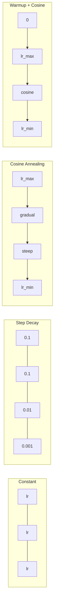
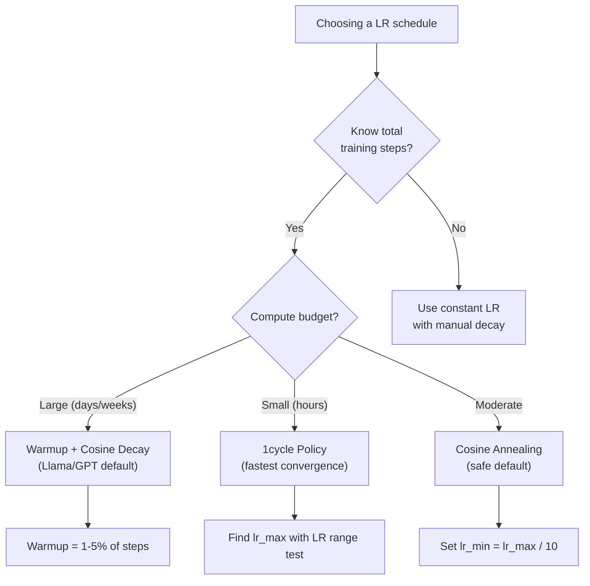
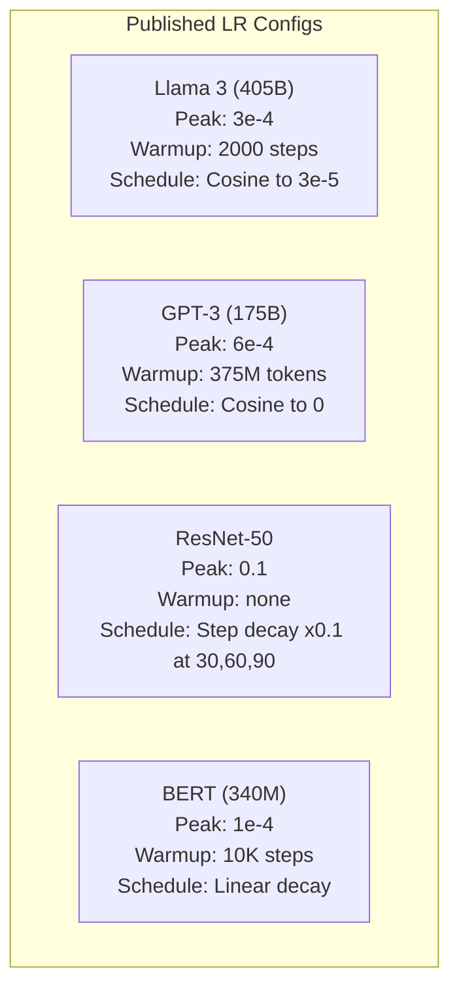

# A taxa de aprendizagem e o aquecimento

> A taxa de aprendizagem é o único hiperparâmetro mais importante. Não a arquitetura, não o tamanho do conjunto de dados, não a função de ativação, a taxa de aprendizagem.

> **【中文解读】**A taxa de aprendizagem é o superparâmetro mais importante, não é a estrutura, não a quantidade de dados, é a taxa de aprendizagem.

**Type:** Build
**Languages:** Python
**Prerequisites:** Lesson 03.06 (Optimizers), Lesson 03.08 (Weight Initialization)
**Time:** ~90 minutes

## Objetivos de aprendizagem

- Implementar a partir do zero os horários constantes, de degradação gradual, de anelação cosina, de aquecimento + cosina e de taxa de aprendizagem de 1 ciclo
- Demonstrar os três modos de falha da selecção da taxa de aprendizagem: divergência (demasiada), atraso (demasiada baixa) e oscilação (sem decadência)
- Explique por que o aquecimento é necessário para os optimistas baseados em Adão e como estabiliza o treinamento precoce
- Comparar a velocidade de convergência entre os cinco horários da mesma tarefa e selecionar a adequada para um determinado orçamento de formação

> **【中文解读】**Este capítulo realiza cinco tipos de aprendizagem:恒定、阶梯衰减、余弦退火、warmup+余弦、1 cycle 策略。

## O problema é o problema da introdução

Defina a taxa de aprendizagem em 0.1. O treinamento diverge - a perda salta para o infinito em 3 passos. Defina-o em 0.0001. O treinamento rasteja - após 100 épocas, o modelo mal se moveu do aleatório. Defina-o em 0.01. O treinamento funciona por 50 épocas, então a perda oscila em torno de um mínimo que nunca pode alcançar porque os passos são grandes demais.

> A taxa de aprendizagem é de 0,1 ⋅ treinamento em 3 etapas, salto para infinito ⋅ treinamento em 0,0001 ⋅ treinamento em lenta escalada ⋅ 100 ⋅ época ⋅ tempo ⋅ tempo ⋅ tempo ⋅ tempo ⋅ tempo ⋅ tempo ⋅ tempo ⋅ tempo ⋅ tempo ⋅ tempo ⋅ tempo ⋅ tempo ⋅ tempo ⋅ tempo ⋅ tempo ⋅ tempo ⋅ tempo ⋅ tempo ⋅ tempo ⋅ tempo ⋅ tempo ⋅ tempo ⋅ tempo ⋅ tempo ⋅ tempo ⋅ tempo ⋅ tempo ⋅ tempo ⋅ tempo ⋅ tempo ⋅ tempo ⋅ tempo ⋅ tempo ⋅ tempo ⋅ tempo ⋅ tempo ⋅ tempo ⋅ tempo ⋅ tempo ⋅ tempo ⋅ tempo ⋅ tempo ⋅ tempo ⋅ tempo ⋅ tempo ⋅ tempo ⋅ tempo ⋅ tempo ⋅ tempo ⋅ tempo ⋅ tempo ⋅ tempo ⋅ tempo ⋅ tempo ⋅ tempo ⋅ tempo ⋅ tempo ⋅ tempo ⋅ tempo ⋅ tempo ⋅ tempo ⋅ tempo ⋅ tempo ⋅ tempo ⋅ tempo ⋅ tempo ⋅ tempo ⋅ ⋅ ⋅ ⋅ ⋅ ⋅ ⋅ ⋅ ⋅ ⋅ ⋅ ⋅ ⋅ ⋅ ⋅ ⋅ ⋅ ⋅ ⋅ ⋅ ⋅ ⋅ ⋅ ⋅ ⋅ ⋅ ⋅ ⋅ ⋅ ⋅ ⋅ ⋅ ⋅ ⋅ ⋅ ⋅ ⋅ ⋅ ⋅ ⋅ ⋅ ⋅ ⋅ ⋅    ⋅                                                                                                                                                                           

A taxa de aprendizagem ideal não é constante. Ele muda durante o treinamento. No início, você quer grandes passos para cobrir o terreno rapidamente. No final do treinamento, você quer pequenos passos para se estabelecer em um mínimo nítido. A diferença entre um modelo 90% preciso e um modelo 95% preciso é muitas vezes apenas o cronograma.

> A taxa de aprendizagem máxima não é constante. Varia durante o processo de treinamento. No início, você quer um grande passo, rapidamente cobrindo o espaço.

Todos os principais modelos publicados nos últimos três anos usam um cronograma de taxa de aprendizagem. Llama 3 usou pico lr = 3e-4 com 2000 passos de aquecimento e decadência cosínica para 3e-5. GPT-3 usou lr = 6e-4 com aquecimento de mais de 375 milhões de tokens.

> 过去三年发表的每个主要模型都使用学习率调度──Llama 3 使用峰值 lr=3e-4,2000 步升和余弦衰减到3e-5──GPT-3 使用 lr=6e-4,warmup 覆盖3.75 亿代币──这些不是随意的选择──它们是花费数百万美元进行大量超参数搜索的结果──

Quando você aprende um modelo pré-treinado, o horário certo é diferente do treinamento a partir do zero. Quando aumenta o tamanho do lote, o período de aquecimento precisa mudar. Quando o treinamento se rompe no passo 10.000, você precisa saber se é um problema de horário ou algo mais.

> Você precisa entender o esquema de regularização, porque o valor padrão não se aplica ao seu problema. Quando você reduzir o modelo de treinamento prévio, a regularização correta é diferente da da formação inicial. Quando você aumenta a quantidade de grandes quantidades de horas, o período de aquecimento precisa mudar.

> **【中文解读】**A taxa de aprendizagem é muito alta → treinings spreads(loss till infinity); muito baixa → trainings extremely slow; adequada mas não diminuindo → 振荡 in the vicinity of minimum value。 Todos os modelos principais têm programas de regulação de taxas de aprendizagem de alta precisão, estes programas são encontrados através de pesquisas de superparâmetros de nível de milhões de dólares。

> **【拓展：大模型的学习率配置】**Llama 3 405B: pico lr=3e-4, aquecimento=2000 步, decadência cosínica até 3e-5, 训练 1.8T token。GPT-3 175B: pico lr=6e-4, aquecimento=375M token。BERT-base: pico lr=1e-4, aquecimento=10K 步, decadência linear。规律:模型越大,学习率通常越小;预训比微调的学习率高 10-100 倍。

## O conceito central.

### Taxa de aprendizagem constante .

A abordagem mais simples é escolher um número, usar-o para cada passo.

> O método mais simples é escolher um número, usar-o a cada passo.

```
lr(t) = lr_0
```

Raramente óptimo. É muito alto para o final do treinamento (oscillação em torno do mínimo) ou muito baixo para o início (computação desperdiçada em passos pequenos). Funciona bem para pequenos modelos e depuração. Uma escolha terrível para qualquer coisa que treina por mais de uma hora.

> 很少是最优的──要么对训练末期来说太高 ((在极小值附近振荡),要么对训练初步来说太低 ((微小步长浪费计算) ⋅ é adequado para pequenos modelos e调试── é uma má escolha para tarefas de treinamento de mais de uma hora──

### Desintegração de escadas

A abordagem da velha escola da era ResNet: reduzir a taxa de aprendizagem em um fator (geralmente 10x) em épocas fixas.

> ResNet 时代的老派方法──在固定的时代将学习率降低一个因子 (normalmente é 10 倍)──

```
lr(t) = lr_0 * gamma^(floor(epoch / step_size))
```

Onde gama = 0,1 e passo_dimensião = 30 significa: lr cai 10x a cada 30 épocas. ResNet-50 usou isto -- lr = 0,1, cai 10x a épocas 30, 60 e 90.

> gama = 0,1 且 step_size = 30 Significa: cada 30 时代 学习率降低 10 倍──ResNet-50 utilizó este lr=0,1, em épocas 30、60 和 90 cada vez menor 10 倍──

O problema: os pontos de decomposição ótimos dependem do conjunto de dados e da arquitetura. Passe para um problema diferente e você precisa reajustar quando cair. As transições são abruptas - a perda pode aumentar quando a taxa muda repentinamente.

> 问题:最优衰减点取决于数据集和架构――换一个问题就需要重新调整何时降低――过渡是突然的学习率突然变化时损失可能升――

### Cósina Annealing.

Desintegração suave da taxa máxima de aprendizagem para o mínimo, seguindo uma curva cosínica:

> Da maior taxa de aprendizagem à menor taxa de aprendizagem de planeamento de declínio, siga a linha do余弦曲線:

```
lr(t) = lr_min + 0.5 * (lr_max - lr_min) * (1 + cos(pi * t / T))
```

Onde t é o passo atual e T é o número total de passos.

> Entre eles, t é o número de passos atuais, T é o número de passos.

Em t=0, o termo cosínico é 1, então lr = lr_max. Em t=T, o termo cosínico é -1, então lr = lr_min. A decadência é suave no início, acelera no meio, e torna-se suave novamente perto do fim.

> t=0 时,余弦项为1,所以 lr = lr_max──t=T 时,余弦项为 -1,所以 lr = lr_min──衰减开始平缓,中间加速,末期又变平缓──

Esta é a padrão para a maioria das corridas de treinamento modernas. Não há hiperparâmetros para sintonizar além de lr_max e lr_min. A forma cosínica corresponde à observação empírica de que a maioria da aprendizagem acontece no meio do treinamento - você quer tamanhos razoáveis de passos durante esse período crítico.

> É a escolha padrão da maioria dos treinamentos modernos. Além de lr_max 和 lr_min, o formato do restro é conforme com a experiência observada. A maior parte do aprendizado ocorre no período de treinamento.

### Por que começar pequeno? Por que começar com uma taxa de aprendizagem pequena?

Adam e outros optimizadores adaptativos mantêm estimativas em execução da média de gradiente e variação. No passo 0, essas estimativas são iniciadas para zero. As primeiras atualizações de gradiente são baseadas em estatísticas de lixo. Se a sua taxa de aprendizagem é grande durante esse período, o modelo toma passos enormes e mal direcionados.

> Adam 和其他自适应优化器维护梯度平均值和方差的运行估计――在第0步, estas estimativas foram iniciadas em zero――前几次梯度更新基于垃圾统计――如果在这个期间学习率很高,模型会采取巨大的方向错误的步骤――

O Warmup corrige isso. Comece com uma pequena taxa de aprendizagem (muitas vezes lr_max / warmup_steps ou até zero) e linearmente eleve-se para lr_max durante os primeiros N passos. Quando você alcança a taxa de aprendizagem completa, as estatísticas de Adam se estabilizaram.

> O aquecimento resolveu o problema. Começou com uma taxa de aprendizagem muito pequena (normalmente é o lr_max / aquecimento_pasos até mesmo zero), depois, no primeiro N 步线性上升到 lr_max── quando você alcançou a taxa de aprendizagem completa, a estatística de Adam já está estabilizada.

```
lr(t) = lr_max * (t / warmup_steps)     for t < warmup_steps
```

O aquecimento típico: 1-5% do total de etapas de treinamento. Llama 3 treinado para ~ 1,8 trilhão de tokens e aquecido para 2000 etapas. GPT-3 aquecido para mais de 375 milhões de tokens.

> **【拓展：Warmup 的数学解释】**Em primeiro passo, o m_1 = 0,1* gradiente, além de (1-0.9) = 0,1 recebe uma estimativa de gradiente correta. Mas em primeiro passo, a estimativa de diferença v_t ainda não está estável.

### O aquecimento linear + declínio do cosso . O aquecimento linear + o declínio do restro.

A padrão moderna, eleva-se linearmente, depois decompõe com o cosino:

```
if t < warmup_steps:
    lr(t) = lr_max * (t / warmup_steps)
else:
    progress = (t - warmup_steps) / (total_steps - warmup_steps)
    lr(t) = lr_min + 0.5 * (lr_max - lr_min) * (1 + cos(pi * progress))
```

É o que Llama, GPT, PaLM e a maioria dos transformadores modernos usam. O aquecimento evita a instabilidade precoce.

> É o método utilizado pela maioria dos transformadores modernos para evitar o precoce decaimento de fios.

### Política de um ciclo .

Descoberta de Leslie Smith (2018): aumentar a taxa de aprendizagem de um valor baixo para um valor alto no primeiro semestre do treinamento, e depois reduzir novamente no segundo semestre.

> Descoberta de Leslie Smith (2018): na primeira metade do treino a taxa de aprendizagem aumentará de baixo para alto, na segunda metade voltará a diminuir.

A teoria: uma alta taxa de aprendizagem atua como regularização adicionando ruído à trajetória de otimização. O modelo explora mais do cenário de perda durante a fase de ramp-up, encontrando melhores bacias.

> 理論: alta taxa de aprendizagem através de dar um melhor caminho para aumentar o ruído até o efeito de normalização.

```
Phase 1 (0 to T/2):    lr ramps from lr_max/25 to lr_max
Phase 2 (T/2 to T):    lr ramps from lr_max to lr_max/10000
```

O 1cycle é frequentemente mais rápido do que o cosino de anelação para um orçamento fixo de computação.

> 1 ciclo em um orçamento de cálculo fixo geralmente é mais rápido do que o treinamento de restringimento de cordas.

> **【拓展：微调时的学习率策略】**微调预训练模型(如BERT、Llama) 当时,学习率通常比预训小 10-100 倍。LoRA 微调 Llama:lr=2e-5~1e-4,warmup=总步数的3%,cosine decay。关键技巧:对不同层使用不同学习率底层(接近输入) 用更小的 lr(因为通用特征已经学好了),顶层(接近输出) 用更大的 lr因为需要适应新任务)。PyTorch 通过参数组实现──

### - O que é isso?



### Diagrama de fluxo de decisão



### Números reais de modelos publicados                                                                                                                                                                                                                                                                                                                                                                                                                                                                                                                      



## Construí-lo e realizei-o.
```figure
lr-schedule
```

## Construí-lo

> **【中文解读】**A seguir, vamos implementar cinco estratégias de regulação a partir de zero, e depois usar o mesmo círculo de dados para comparar os resultados.

### Passo 1: Agendamento de Funções.

Cada função toma o passo atual e retorna a taxa de aprendizagem nesse passo.

> Cada função recebe o número de passos atuais, retornar a taxa de aprendizagem desse passo.

```python
import math


def constant_schedule(step, lr=0.01, **kwargs):
    return lr


def step_decay_schedule(step, lr=0.1, step_size=100, gamma=0.1, **kwargs):
    return lr * (gamma ** (step // step_size))


def cosine_schedule(step, lr=0.01, total_steps=1000, lr_min=1e-5, **kwargs):
    if step >= total_steps:
        return lr_min
    return lr_min + 0.5 * (lr - lr_min) * (1 + math.cos(math.pi * step / total_steps))


def warmup_cosine_schedule(step, lr=0.01, total_steps=1000, warmup_steps=100, lr_min=1e-5, **kwargs):
    if total_steps <= warmup_steps:
        return lr * (step / max(warmup_steps, 1))
    if step < warmup_steps:
        return lr * step / warmup_steps
    progress = (step - warmup_steps) / (total_steps - warmup_steps)
    return lr_min + 0.5 * (lr - lr_min) * (1 + math.cos(math.pi * progress))


def one_cycle_schedule(step, lr=0.01, total_steps=1000, **kwargs):
    mid = max(total_steps // 2, 1)
    if step < mid:
        return (lr / 25) + (lr - lr / 25) * step / mid
    else:
        progress = (step - mid) / max(total_steps - mid, 1)
        return lr * (1 - progress) + (lr / 10000) * progress
```

### Passo 2: Visualize todas as agendas. Passo 2: Visualize todas as configurações.

Imprima um gráfico baseado em texto que mostre como cada programa evolui ao longo da formação.

> Imprimir gráficos de texto, mostrando cada tipo de mudança no processo de treinamento.

```python
def visualize_schedule(name, schedule_fn, total_steps=500, **kwargs):
    steps = list(range(0, total_steps, total_steps // 20))
    if total_steps - 1 not in steps:
        steps.append(total_steps - 1)

    lrs = [schedule_fn(s, total_steps=total_steps, **kwargs) for s in steps]
    max_lr = max(lrs) if max(lrs) > 0 else 1.0

    print(f"\n{name}:")
    for s, lr_val in zip(steps, lrs):
        bar_len = int(lr_val / max_lr * 40)
        bar = "#" * bar_len
        print(f"  Step {s:4d}: lr={lr_val:.6f} {bar}")
```

### Passo 3: Rede de treinamento.

Uma rede simples de duas camadas no conjunto de dados do círculo, igual às lições anteriores, mas agora variamos o horário.

> Em um conjunto de dados redondos, a rede simples de dois níveis, é a mesma que a aula anterior, mas agora nós mudamos o esquema de regulação.

```python
import random


def sigmoid(x):
    x = max(-500, min(500, x))
    return 1.0 / (1.0 + math.exp(-x))


def relu(x):
    return max(0.0, x)


def relu_deriv(x):
    return 1.0 if x > 0 else 0.0


def make_circle_data(n=200, seed=42):
    random.seed(seed)
    data = []
    for _ in range(n):
        x = random.uniform(-2, 2)
        y = random.uniform(-2, 2)
        label = 1.0 if x * x + y * y < 1.5 else 0.0
        data.append(([x, y], label))
    return data


def train_with_schedule(schedule_fn, schedule_name, data, epochs=300, base_lr=0.05, **kwargs):
    random.seed(0)
    hidden_size = 8
    total_steps = epochs * len(data)

    std = math.sqrt(2.0 / 2)
    w1 = [[random.gauss(0, std) for _ in range(2)] for _ in range(hidden_size)]
    b1 = [0.0] * hidden_size
    w2 = [random.gauss(0, std) for _ in range(hidden_size)]
    b2 = 0.0

    step = 0
    epoch_losses = []

    for epoch in range(epochs):
        total_loss = 0
        correct = 0

        for x, target in data:
            lr = schedule_fn(step, lr=base_lr, total_steps=total_steps, **kwargs)

            z1 = []
            h = []
            for i in range(hidden_size):
                z = w1[i][0] * x[0] + w1[i][1] * x[1] + b1[i]
                z1.append(z)
                h.append(relu(z))

            z2 = sum(w2[i] * h[i] for i in range(hidden_size)) + b2
            out = sigmoid(z2)

            error = out - target
            d_out = error * out * (1 - out)

            for i in range(hidden_size):
                d_h = d_out * w2[i] * relu_deriv(z1[i])
                w2[i] -= lr * d_out * h[i]
                for j in range(2):
                    w1[i][j] -= lr * d_h * x[j]
                b1[i] -= lr * d_h
            b2 -= lr * d_out

            total_loss += (out - target) ** 2
            if (out >= 0.5) == (target >= 0.5):
                correct += 1
            step += 1

        avg_loss = total_loss / len(data)
        accuracy = correct / len(data) * 100
        epoch_losses.append(avg_loss)

    return epoch_losses
```

### Passo 4: Compare todas as agendas.

Treinar a mesma rede com cada cronograma e comparar o comportamento final de perda e convergência.

> Usar cada tipo de treinamento de regulação para uma rede, comparar perdas e receitas finais.

```python
def compare_schedules(data):
    configs = [
        ("Constant", constant_schedule, {}),
        ("Step Decay", step_decay_schedule, {"step_size": 15000, "gamma": 0.1}),
        ("Cosine", cosine_schedule, {"lr_min": 1e-5}),
        ("Warmup+Cosine", warmup_cosine_schedule, {"warmup_steps": 3000, "lr_min": 1e-5}),
        ("1cycle", one_cycle_schedule, {}),
    ]

    print(f"\n{'Schedule':<20} {'Start Loss':>12} {'Mid Loss':>12} {'End Loss':>12} {'Best Loss':>12}")
    print("-" * 70)

    for name, schedule_fn, extra_kwargs in configs:
        losses = train_with_schedule(schedule_fn, name, data, epochs=300, base_lr=0.05, **extra_kwargs)
        mid_idx = len(losses) // 2
        best = min(losses)
        print(f"{name:<20} {losses[0]:>12.6f} {losses[mid_idx]:>12.6f} {losses[-1]:>12.6f} {best:>12.6f}")
```

### Passo 5: LR muito alto vs muito baixo.

Demonstre os três modos de falha: muito alto (divergência), muito baixo (deslocamento) e direito.

> 展示三种失败模式: 太高(发散) 太低(爬行) 刚好。

```python
def lr_sensitivity(data):
    learning_rates = [1.0, 0.1, 0.01, 0.001, 0.0001]

    print("\nLR Sensitivity (constant schedule, 100 epochs):")
    print(f"  {'LR':>10} {'Start Loss':>12} {'End Loss':>12} {'Status':>15}")
    print("  " + "-" * 52)

    for lr in learning_rates:
        losses = train_with_schedule(constant_schedule, f"lr={lr}", data, epochs=100, base_lr=lr)
        start = losses[0]
        end = losses[-1]

        if end > start or math.isnan(end) or end > 1.0:
            status = "DIVERGED"
        elif end > start * 0.9:
            status = "BARELY MOVED"
        elif end < 0.15:
            status = "CONVERGED"
        else:
            status = "LEARNING"

        end_str = f"{end:.6f}" if not math.isnan(end) else "NaN"
        print(f"  {lr:>10.4f} {start:>12.6f} {end_str:>12} {status:>15}")
```

## Use-o com o framework implementado.

> **【中文解读】**PyTorch  fornece 15+ tipos de reguladores. O mais comum é o uso de cosinasAnnealingLR 和 HuggingFace para obter cosinas com aquecimento.

A PyTorch fornece agendadores em `torch.optim.lr_scheduler`- Não .

```python
import torch
import torch.optim as optim
from torch.optim.lr_scheduler import CosineAnnealingLR, OneCycleLR, StepLR

model = nn.Sequential(nn.Linear(10, 64), nn.ReLU(), nn.Linear(64, 1))
optimizer = optim.Adam(model.parameters(), lr=3e-4)

scheduler = CosineAnnealingLR(optimizer, T_max=1000, eta_min=1e-5)

for step in range(1000):
    loss = train_step(model, optimizer)
    scheduler.step()
```

Para aquecimento + cosin, use um agendador lambda ou o `get_cosine_schedule_with_warmup`de HuggingFace:

> Para aquecimento + 余弦, usar lambda 调度器 ou HuggingFace `get_cosine_schedule_with_warmup`- Não .

```python
from transformers import get_cosine_schedule_with_warmup

scheduler = get_cosine_schedule_with_warmup(
    optimizer,
    num_warmup_steps=2000,
    num_training_steps=100000,
)
```

A função HuggingFace é o que a maioria dos scripts de ajuste fino Llama e GPT usa. Quando em dúvida, use aquecimento + cosino com aquecimento = 3-5% do total de passos. Funciona para quase tudo.

> A função do HuggingFace é a maioria dos Llama e GPT 微调脚本使用的──不确定时,使用暖化 +余弦,暖化为总步数的 3-5%──它几乎适用于所有场景──

## Envia-o . Produto .

Esta lição produz:
- `outputs/prompt-lr-schedule-advisor.md`-- um aviso que recomenda o horário de aprendizagem e os hiperparâmetros adequados para a sua formação

> 本课产出:`outputs/prompt-lr-schedule-advisor.md`- um sugestão de correção de taxa de aprendizagem e de superparâmetros

## Exercícios.

1. Implementar decadência exponencial: lr(t) = lr_0 * gamma^t onde gamma = 0,999.

   1. 实现指数衰减:lr(t) = lr_0 * gamma^t, gamma = 0,999──在圆形数据集上和余弦退火对比──

2. Implementar o teste de faixa de taxa de aprendizagem (Leslie Smith): treinar por algumas centenas de passos aumentando exponencialmente a LR de 1e-7 para 1.

   2. 实现学习率范围测试(Leslie Smith): treinar alguns centésimos de passos, ao mesmo tempo aumentar o LR de 1e-7 índice para 1── desenhar perda vs LR 曲线──最优最大 LR 是损失 开始上升前的值──

3. Treinar com aquecimento + cosino, mas variar o comprimento do aquecimento: 0%, 1%, 5%, 10%, 20% dos passos totais.

   3. Use aquecimento + treinamento de restroços, mas variação de aquecimento 长度:总步数的0%、1%、5%、10%、20%── encontrar o melhor ponto do treinamento mais estável──

4. Implementar o cozinheamento de reinicialização com reinicialização quente (SGDR): restabelecer a taxa de aprendizagem para lr_max a cada passo T e decadência novamente.

   4. 实现带热重启的余弦退火(SGDR): por cada passo, a taxa de aprendizagem é reposta para lr_max, e não se decrece novamente.

5. Construir um "chirurgião de horário" que monitore a perda de treinamento e muda automaticamente do aquecimento para cosino quando a perda se estabiliza, e reduz a irritação se a perda se prolongar por muito tempo.

   5. 构建调度医生:监控训练损失,损失 稳定时自动从加热转到余弦,损失 停滞太久时降低 lr。

## Termos-chave .

| Term | What people say | What it actually means |
|------|----------------|----------------------|
| Learning rate | "How fast the model learns" | The scalar that multiplies the gradient to determine the parameter update size |
| Schedule | "Change the LR over time" | A function that maps training step to learning rate, designed to optimize convergence |
| Warmup | "Start with a small LR" | Linearly ramping the LR from near-zero to the target value over the first N steps to stabilize optimizer statistics |
| Cosine annealing | "Smooth LR decay" | Decreasing the LR following a cosine curve from lr_max to lr_min over training |
| Step decay | "Drop LR at milestones" | Multiplying the LR by a factor (usually 0.1) at fixed epoch intervals |
| 1cycle policy | "Up then down" | Leslie Smith's method of ramping LR up then down in a single cycle for faster convergence |
| LR range test | "Find the best learning rate" | Training briefly while increasing LR to find the value where loss starts diverging |
| Cosine with warm restarts | "Reset and repeat" | Periodically resetting the LR to lr_max and decaying again (SGDR) |
| Eta min | "The floor for the LR" | The minimum learning rate that the schedule decays to |
| Peak learning rate | "The maximum LR" | The highest LR reached during training, typically after warmup |

| 术语 | 俗称 | 实际含义 |
|------|------|---------|
| Learning rate / 学习率 | "模型学得多快" | 乘以梯度决定参数更新大小的标量 |
| Schedule / 调度 | "随时间变 LR" | 把训练步数映射到学习率的函数，旨在优化收敛 |
| Warmup / 预热 | "从小 LR 开始" | 在前 N 步把 LR 从近零线性升到目标值，稳定优化器统计 |
| Cosine annealing / 余弦退火 | "平滑 LR 衰减" | 训练中按余弦曲线从 lr_max 降到 lr_min |
| Step decay / 阶梯衰减 | "里程碑式降 LR" | 在固定 epoch 间隔把 LR 乘以一个因子（通常 0.1） |
| 1cycle policy / 1cycle 策略 | "先升后降" | Leslie Smith 的方法：单周期内先升 LR 后降，加速收敛 |
| LR range test / LR 范围测试 | "找最佳学习率" | 短训练中增加 LR，找到 loss 开始发散的点 |
| Cosine with warm restarts / 带热重启的余弦 | "重置并重复" | 周期性把 LR 重置为 lr_max 再次衰减（SGDR） |
| Eta min / 最小学习率 | "LR 的下限" | 调度衰减到的最小学习率 |
| Peak learning rate / 峰值学习率 | "最大 LR" | 训练期间达到的最高 LR，通常在 warmup 之后 |

## Mais leitura 延伸阅读

- Loshchilov & Hutter, "SGDR: Descenso Gradiente Stocástico com Restarto Quente" (2017) -- introduziu o cozinho de anel e o reinicio quente
  Loshchilov & Hutter,SGDR:带热重启的随机梯度下降(2017)引入余弦退火和热重启
- Smith, "Super-Convergência: Treinamento muito rápido de redes neurais usando grandes taxas de aprendizagem" (2018) -- o documento de política de 1 ciclo
  Smith,超收: usar Universidade 习率快速训练神经网络(2018)1cycle 策略论文
- Touvron et al., "Llama 2: Open Foundation and Fine-Tuned Chat Models" (2023) -- documenta o calendário de aquecimento + cosino usado em escala
  Touvron  et al., Llama 2: Open Basis y Micro调聊天模型(2023)  registrou uso em grande escala de aquecimento + 余弦调度
- Goyal et al., "Exato, Minibatch SGD: Training ImageNet em 1 hora" (2017) -- regra de escalação linear e aquecimento para treinamento de grandes lotes
  Goyal 等人, 精确大批量 SGD:1 小时训练 ImageNet(2017) 线性缩放规则和大批量训练的热升
