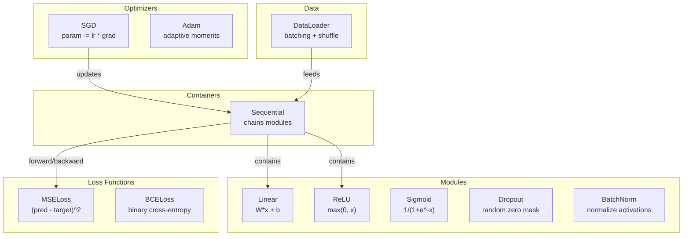
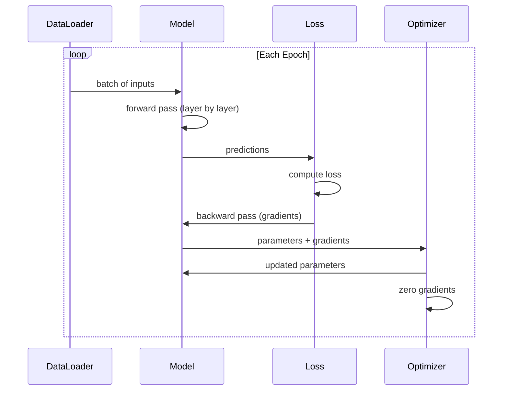
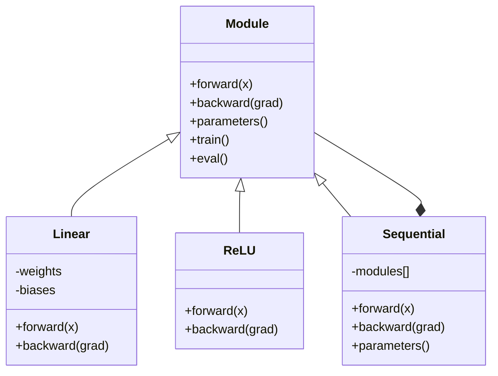

# Construir o seu próprio Mini Framework , construir o seu próprio mini framework .

> Construíste neurônios, camadas, redes, backprops, ativações, funções de perda, optimizadores, regularização, inicialização e cronogramas LR, tudo como peças separadas. Agora, enfiá-los juntos em uma estrutura. Não PyTorch. Não TensorFlow.

> **【中文解读】**Para compreender o quadro completo, a Python desenvolveu um conceito de conjunto de todos os cursos: motor de micro-participação automática, vários tipos de tipos de optimizadores, regularização, ciclo de treinamento.

**Type:** Build
**Languages:** Python
**Prerequisites:** All of Phase 03 (Lessons 01-09)
**Time:** ~120 minutes

## Objetivos de aprendizagem

- Construir um quadro completo de aprendizado profundo (~ 500 linhas) com Module, Linear, ReLU, Sigmoid, Dropout, BatchNorm, Sequential, funções de perda, otimizadores e DataLoader
- Explique a abstração do módulo (para frente, para trás, parâmetros) e por que é necessário alternar o modo trens/eventos
- Enviar todos os componentes em um loop de treinamento de trabalho que treina uma rede de 4 camadas em classificação de círculo
- Mapa de cada componente de sua estrutura para o seu equivalente PyTorch (nn.Module, nn.Sequential, optim.Adam, DataLoader)

> **【中文解读】**Este capítulo é o capítulo 03 da Fase 03 de integração. Depois de concluído, você realmente entenderá o que acontece atrás de cada linha de código.

## O problema é o problema da introdução

Tens dez lições de blocos de construção espalhadas por arquivos separados.`Value`Uma aula aqui, um loop de treinamento ali, inicialização de peso em outro arquivo, horários de taxa de aprendizagem em outro. Para treinar uma rede, você copia-põe de cinco lições diferentes e as conecta de mãos.

> Tens dez blocos de construção espalhados em diferentes documentos.`Value`类, lá há um ciclo de treinamento, outro dos documentos é o peso inicial, outro é a regulação da taxa de aprendizagem.

É isso que os frameworks resolvem.`nn.Module`- Não .`nn.Sequential`- Não .`optim.Adam`- Não .`DataLoader`TensorFlow dá-lhe um padrão de ciclo de treinamento que os liga.`keras.Layer`- Não .`keras.Sequential`- Não .`keras.optimizers.Adam`Não são mágicas, são padrões organizacionais que permitem definir, treinar e avaliar redes sem reinventar a canalização a cada vez.

> É o que o Python tem para resolver.`nn.Module`- Não.`nn.Sequential`- Não.`optim.Adam`- Não.`DataLoader`E os ligará ao seu ciclo de treinamento.`keras.Layer`- Não.`keras.Sequential`- Não.`keras.optimizers.Adam` Não são magia são um modelo de organização, permitindo que você defina, treine e avalia a rede, sem precisar reinventar todos os tubos

Você vai construir a mesma coisa em ~500 linhas de Python. Sem numpy. Sem dependências externas. Uma estrutura que pode definir qualquer rede de feedforward, treiná-lo com SGD ou Adam, batch os dados, aplicar desistência e batch normalização, usar qualquer ativação, e agendar a taxa de aprendizagem.

> Você vai usar cerca de 500 行 Python para construir o mesmo coisa. Não há necessidade de numpy. Não há dependência externa. Um pode definir qualquer rede anterior.

Quando terminar, vai entender exatamente o que acontece quando escrever.`model = nn.Sequential(...)`Em PyTorch, compreenderá porquê.`model.train()`E ...`model.eval()`Não é que existam.`optimizer.zero_grad()`Você vai entender tudo, porque você construiu tudo.

> Depois de terminado, você vai entender completamente em PyTorch escrever`model = nn.Sequential(...)`Quando é que aconteceu, percebes porquê?`model.train()`和 `model.eval()`- Não, não.`optimizer.zero_grad()`É uma forma única de fazer isto. Você vai entender tudo, porque você mesmo construiu tudo.

> **【中文解读】**框架的核心价值:把散落的组件统一到一个接口下――Módulo é a base de tudoLinear、ReLU、Dropout、BatchNorm 都是Modulo──Sequencial é o módulo 一堆 模块 串起还是一个模块── isto é totalmente em conformidade com o design do PyTorch──

> **【拓展：PyTorch 框架的设计哲学】**O design central do PyTorch é apenas de 5 conceitos: Tensor (DATA) ̊n.Module (Módulo) ̊ Autograd (Automatic) ̊Optimização (Optimização) ̊Optimização (Optimização) ̊Optimização (Optimização) ̊ DataLoader (Optimização) ̊ DataLoader (Carga de Dados) ̊n) ̊n.

## O conceito central.

### O módulo de abstração Modulo de abstração

Cada camada da PyTorch herda de`nn.Module`Um módulo tem três responsabilidades:

> PyTorch 中 每一层都继承自`nn.Module`◊ Um módulo tem três responsabilidades:

1. **forward()**-- calcular a saída das entradas dadas
   **forward()**-- 给定输入计算输出
2. **parameters()**- devolver todos os pesos treinables
   **parameters()**-- 返回所有可训练权重
3. **backward()**-- gradientes de computação (tratados por autograd em PyTorch, explícito no nosso)
   **backward()**-- 计算梯度(PyTorch 中由自动化 处理, nosso framework needs manifest implementation)

Uma camada linear é um módulo. Uma ativação ReLU é um módulo. Uma camada de abandono é um módulo. Uma camada de normalização de lote é um módulo. Todos eles têm a mesma interface.

> Layer linear é um módulo. ReLU 激活 é um módulo. Layer depot é um módulo. BatchNorm Layer é um módulo.

### Container Sequencial Container Sequencial Container

`nn.Sequential`Modulos. Passagem para frente: dados de entrada através do módulo 1, depois do módulo 2, depois do módulo 3. Passagem para trás: inverter a cadeia. O recipiente em si é um módulo - tem padrões (((), ((() e ((()) para trás). Este é o padrão composto: uma sequência de módulos é em si um módulo.

> `nn.Sequential`将 Module 串联起来──前向传播:数据流过 Module 1、然后 Module 2、然后 Module 3──反向传播:反向遍历链──容器本身也是一个Module它有前 (前) ‧参数() 和后 (后)  (后)  (后)  (后) )  (前)  (前)  (前)  (前)  (前) )  (前)  (前)  (前)  (前) )  (前)  (前)  (前) )  (前)  (前) )  (前)  (前) )  (前)  (前) )  (前) )  (前) )  (前) )  (前) )  (前) )  (前) )  (前) )  (前) )  (前) )  (前) )  (前) )  (前) ) )  (前) )  (前) )  (前) ) )  (前) )  () )  () )  () )  () )  () ) )  () ) )  () )  ()  () ) )  () )  () )  () ) )  () )  () )  () )  () ) )  ()

> **【拓展：真实框架的额外功能】**Seu framework mini cover o conceito central do PyTorch, mas o verdadeiro framework ainda é: 1) autograd automático (auto-minus) não precisa de manual de escrita para trás; 2) GPU 支持 (CUDA 内存管理和内存调度); 3) 分布式训练 (DDP、FSDP、DeepSpeed); 4) 混合精度训练 (AMP); 4) 模型序列化 (state_dict + save/load) ⋅PyTorch's code library exceede 100 000 条, mas o core abstraction ainda é o que você está realizando.

### Formação vs Modo de Avaliação

A normalização de lote utiliza estatísticas de lote durante o treino, mas as médias de execução durante a avaliação.`train()`E ...`eval()`Cada módulo tem um módulo de`training`- Não.

> Descolagem no treino, por vezes, em neurônios, mas em avaliação, tudo passa.`train()`和 `eval()`Cada módulo tem um.`training`- Não.

### Otimizador .

O optimizador atualiza os parâmetros usando os seus gradientes.`param -= lr * grad`Otimizador não sabe sobre a arquitetura da rede - ele só vê uma lista plana de parâmetros e seus gradientes.

> 优化器用梯度更新参数──SGD:`param -= lr * grad`Adam:维护动量和方差估算后再更新──优化器不知道网络架构它只看一个平面的参数列表和它们的梯度──

### DataLoader , carregador de dados .

O batch é importante por duas razões: primeiro, não é possível inserir todo o conjunto de dados na memória para grandes problemas. segundo, a descida do gradiente de mini-batch fornece ruído que ajuda a escapar aos mínimos locais. O DataLoader divide os dados em lotes e opcionalmente mistura entre épocas.

> O volume de dados é muito importante por duas razões. Primeiro, o conjunto de dados do grande problema não está em memória.

> **【拓展：DataLoader 在大模型训练中的演进】**O DataLoader da PyTorch é um único modelo. O Big Model Training precisa de um DataLoader distribuído. O DataLoader: 1) WebDataset utiliza um fluxo de dados de TB; 2) Meta's SPDL (Streaming Parallel Data Loader)  Support from S3/GCS 直接流式加载; 3) HuggingFace datasets 库使用存储存映射文件处理超大数据集──Llama 3's training Database 约15T token,不可能全部加载到内存──

### Arquitetura de enquadramento



### O ciclo de treinamento.



### - O que é isso ?



## Construí-lo e realizei-o.

> **【中文解读】**Abaixo, em ordem, cada componente do framework de construção:Módulo 基类 → Layer → Função de ativação → Dropout → BatchNorm → Sequencial 容器 → 损失函数 → 优化器 → DataLoader → 完整训练循环── cada passo em relação a uma classe central do PyTorch──
```figure
gradient-clipping
```

## Construí-lo

### Passo 1: Módulo Base Class.

A interface abstrata que cada camada implementa.

> Cada camada de realização de um abstracto de interface.

```python
class Module:
    def __init__(self):
        self.training = True

    def forward(self, x):
        raise NotImplementedError

    def backward(self, grad):
        raise NotImplementedError

    def parameters(self):
        return []

    def train(self):
        self.training = True

    def eval(self):
        self.training = False
```

### Passo 2: camada linear.

O bloco de construção fundamental. Armazenar pesos e preconceitos, calcular Wx + b para a frente e gradientes de peso / entrada para trás.

> 基本构建块──存储权重和偏置,前向计算 Wx + b,反向计算权重/输入梯度──

> Layer linear é PyTorch`nn.Linear`                                                                                                                                                                                                                                                              `sum(W[i][j] * x[j]) + b[i]` Contrastorização de uma corrente de circulação`grad[i] * input[j]`, o nível de entrada é `grad[i] * W[i][j]`△ nota fan_in 维度初始化用 Kaiming(`std = sqrt(2/fan_in)`),适配 ReLU。

```python
import math
import random


class Linear(Module):
    def __init__(self, fan_in, fan_out):
        super().__init__()
        std = math.sqrt(2.0 / fan_in)
        self.weights = [[random.gauss(0, std) for _ in range(fan_in)] for _ in range(fan_out)]
        self.biases = [0.0] * fan_out
        self.weight_grads = [[0.0] * fan_in for _ in range(fan_out)]
        self.bias_grads = [0.0] * fan_out
        self.fan_in = fan_in
        self.fan_out = fan_out
        self.input = None

    def forward(self, x):
        self.input = x
        output = []
        for i in range(self.fan_out):
            val = self.biases[i]
            for j in range(self.fan_in):
                val += self.weights[i][j] * x[j]
            output.append(val)
        return output

    def backward(self, grad):
        input_grad = [0.0] * self.fan_in
        for i in range(self.fan_out):
            self.bias_grads[i] += grad[i]
            for j in range(self.fan_in):
                self.weight_grads[i][j] += grad[i] * self.input[j]
                input_grad[j] += grad[i] * self.weights[i][j]
        return input_grad

    def parameters(self):
        params = []
        for i in range(self.fan_out):
            for j in range(self.fan_in):
                params.append((self.weights, i, j, self.weight_grads))
            params.append((self.biases, i, None, self.bias_grads))
        return params
```

### Passo 3: módulos de ativação.

ReLU, Sigmoid e Tanh como módulos, cada um armazenando o que precisa para o passe para trás.

> ReLU、Sigmoid 和 Tanh 作为模块──每个缓存反向传播所需信息──

```python
class ReLU(Module):
    def __init__(self):
        super().__init__()
        self.mask = None

    def forward(self, x):
        self.mask = [1.0 if v > 0 else 0.0 for v in x]
        return [max(0.0, v) for v in x]

    def backward(self, grad):
        return [g * m for g, m in zip(grad, self.mask)]


class Sigmoid(Module):
    def __init__(self):
        super().__init__()
        self.output = None

    def forward(self, x):
        self.output = []
        for v in x:
            v = max(-500, min(500, v))
            self.output.append(1.0 / (1.0 + math.exp(-v)))
        return self.output

    def backward(self, grad):
        return [g * o * (1 - o) for g, o in zip(grad, self.output)]


class Tanh(Module):
    def __init__(self):
        super().__init__()
        self.output = None

    def forward(self, x):
        self.output = [math.tanh(v) for v in x]
        return self.output

    def backward(self, grad):
        return [g * (1 - o * o) for g, o in zip(grad, self.output)]
```

### Passo 4: Modulo de Desistência.

Reduza os elementos restantes por 1/(1-p) para que os valores esperados permaneçam os mesmos.

> 訓練時随机将元素置零──按 1/(1-p) 缩放剩余元素,使期望值不变──评估时不做任何操作──

```python
class Dropout(Module):
    def __init__(self, p=0.5):
        super().__init__()
        self.p = p
        self.mask = None

    def forward(self, x):
        if not self.training:
            return x
        self.mask = [0.0 if random.random() < self.p else 1.0 / (1 - self.p) for _ in x]
        return [v * m for v, m in zip(x, self.mask)]

    def backward(self, grad):
        if self.mask is None:
            return grad
        return [g * m for g, m in zip(grad, self.mask)]
```

### Passo 5: Modulo BatchNorm.

Normaliza as ativações para zero média e variação unitária por característica em todo o lote. Manter estatísticas em execução para o modo eval.

> O valor de ativação será reorganizado em valores mínimos e divisões unitárias de lote transversal.

```python
class BatchNorm(Module):
    def __init__(self, size, momentum=0.1, eps=1e-5):
        super().__init__()
        self.size = size
        self.gamma = [1.0] * size
        self.beta = [0.0] * size
        self.gamma_grads = [0.0] * size
        self.beta_grads = [0.0] * size
        self.running_mean = [0.0] * size
        self.running_var = [1.0] * size
        self.momentum = momentum
        self.eps = eps
        self.x_norm = None
        self.std_inv = None
        self.batch_input = None

    def forward_batch(self, batch):
        batch_size = len(batch)
        output_batch = []

        if self.training:
            mean = [0.0] * self.size
            for sample in batch:
                for j in range(self.size):
                    mean[j] += sample[j]
            mean = [m / batch_size for m in mean]

            var = [0.0] * self.size
            for sample in batch:
                for j in range(self.size):
                    var[j] += (sample[j] - mean[j]) ** 2
            var = [v / batch_size for v in var]

            self.std_inv = [1.0 / math.sqrt(v + self.eps) for v in var]

            self.x_norm = []
            self.batch_input = batch
            for sample in batch:
                normed = [(sample[j] - mean[j]) * self.std_inv[j] for j in range(self.size)]
                self.x_norm.append(normed)
                output = [self.gamma[j] * normed[j] + self.beta[j] for j in range(self.size)]
                output_batch.append(output)

            for j in range(self.size):
                self.running_mean[j] = (1 - self.momentum) * self.running_mean[j] + self.momentum * mean[j]
                self.running_var[j] = (1 - self.momentum) * self.running_var[j] + self.momentum * var[j]
        else:
            std_inv = [1.0 / math.sqrt(v + self.eps) for v in self.running_var]
            for sample in batch:
                normed = [(sample[j] - self.running_mean[j]) * std_inv[j] for j in range(self.size)]
                output = [self.gamma[j] * normed[j] + self.beta[j] for j in range(self.size)]
                output_batch.append(output)

        return output_batch

    def forward(self, x):
        result = self.forward_batch([x])
        return result[0]

    def backward(self, grad):
        if self.x_norm is None:
            return grad
        for j in range(self.size):
            self.gamma_grads[j] += self.x_norm[0][j] * grad[j]
            self.beta_grads[j] += grad[j]
        return [grad[j] * self.gamma[j] * self.std_inv[j] for j in range(self.size)]

    def parameters(self):
        params = []
        for j in range(self.size):
            params.append((self.gamma, j, None, self.gamma_grads))
            params.append((self.beta, j, None, self.beta_grads))
        return params
```

### Passo 6: Container Sequencial.

Módulos de cadeia, para frente, de esquerda para direita, para trás, de direita para esquerda.

> 串联模块──前向从左到右,反向从右到左──

> O módulo de configuração seqüencial é um módulo, mas o seu interior é um módulo.`train()`和 `eval()`递归调用每个子模块──`parameters()`É o PyTorch.`nn.Sequential`O que é o "Centro da Realização"?

```python
class Sequential(Module):
    def __init__(self, *modules):
        super().__init__()
        self.modules = list(modules)

    def forward(self, x):
        for module in self.modules:
            x = module.forward(x)
        return x

    def backward(self, grad):
        for module in reversed(self.modules):
            grad = module.backward(grad)
        return grad

    def parameters(self):
        params = []
        for module in self.modules:
            params.extend(module.parameters())
        return params

    def train(self):
        self.training = True
        for module in self.modules:
            module.train()

    def eval(self):
        self.training = False
        for module in self.modules:
            module.eval()
```

### Passo 7: Perda de funções.

MSE e Binary Cross-Entropy. Cada um retorna o valor de perda e fornece um retrocesso que retorna o gradiente.

> MSE 和二元交叉── cada retornar perda de valor,并提供回归梯度的后退() 方法──

> A função de perda é o ponto de partida do ciclo de treinamento  contra-direção de propagação a partir do gradiente da função de perda.`2 * (pred - target) / n`A escala do BCE é `(-target/p + (1-target)/(1-p)) / n`注意 BCE 中要使用eps 剪剪防止 log ((0) 

```python
class MSELoss:
    def __call__(self, predicted, target):
        self.predicted = predicted
        self.target = target
        n = len(predicted)
        self.loss = sum((p - t) ** 2 for p, t in zip(predicted, target)) / n
        return self.loss

    def backward(self):
        n = len(self.predicted)
        return [2 * (p - t) / n for p, t in zip(self.predicted, self.target)]


class BCELoss:
    def __call__(self, predicted, target):
        self.predicted = predicted
        self.target = target
        eps = 1e-7
        n = len(predicted)
        self.loss = 0
        for p, t in zip(predicted, target):
            p = max(eps, min(1 - eps, p))
            self.loss += -(t * math.log(p) + (1 - t) * math.log(1 - p))
        self.loss /= n
        return self.loss

    def backward(self):
        eps = 1e-7
        n = len(self.predicted)
        grads = []
        for p, t in zip(self.predicted, self.target):
            p = max(eps, min(1 - eps, p))
            grads.append((-t / p + (1 - t) / (1 - p)) / n)
        return grads
```

### Passo 8: SGD e Adam Optimizers.

Ambos tomam uma lista de parâmetros e atualizam os pesos usando gradientes.

> 两者都接收参数列表,使用梯度更新权重──

> SGD 简单:参数 -= 学习率 × 梯度。Adam 维护一阶矩 m 和二阶矩 v,加上偏差修正(前几步梯度估算有偏差), efeito na maioria das tarefas é melhor que SGD。AdamW 在 Adam 基础上加解权重衰减──参数列表中的每个元素是 (容器, i, j, 梯度容器) 四组,j=None元表示偏置(一维)。

```python
class SGD:
    def __init__(self, parameters, lr=0.01):
        self.params = parameters
        self.lr = lr

    def step(self):
        for container, i, j, grad_container in self.params:
            if j is not None:
                container[i][j] -= self.lr * grad_container[i][j]
            else:
                container[i] -= self.lr * grad_container[i]

    def zero_grad(self):
        for container, i, j, grad_container in self.params:
            if j is not None:
                grad_container[i][j] = 0.0
            else:
                grad_container[i] = 0.0


class Adam:
    def __init__(self, parameters, lr=0.001, beta1=0.9, beta2=0.999, eps=1e-8):
        self.params = parameters
        self.lr = lr
        self.beta1 = beta1
        self.beta2 = beta2
        self.eps = eps
        self.t = 0
        self.m = [0.0] * len(parameters)
        self.v = [0.0] * len(parameters)

    def step(self):
        self.t += 1
        for idx, (container, i, j, grad_container) in enumerate(self.params):
            if j is not None:
                g = grad_container[i][j]
            else:
                g = grad_container[i]

            self.m[idx] = self.beta1 * self.m[idx] + (1 - self.beta1) * g
            self.v[idx] = self.beta2 * self.v[idx] + (1 - self.beta2) * g * g

            m_hat = self.m[idx] / (1 - self.beta1 ** self.t)
            v_hat = self.v[idx] / (1 - self.beta2 ** self.t)

            update = self.lr * m_hat / (math.sqrt(v_hat) + self.eps)

            if j is not None:
                container[i][j] -= update
            else:
                container[i] -= update

    def zero_grad(self):
        for container, i, j, grad_container in self.params:
            if j is not None:
                grad_container[i][j] = 0.0
            else:
                grad_container[i] = 0.0
```

### Passo 9: DataLoader.

Divide os dados em lotes, opcionalmente mistura cada época.

> A partir de agora, os dados serão divididos em lotes, escolhidos para cada época.

```python
class DataLoader:
    def __init__(self, data, batch_size=32, shuffle=True):
        self.data = data
        self.batch_size = batch_size
        self.shuffle = shuffle

    def __iter__(self):
        indices = list(range(len(self.data)))
        if self.shuffle:
            random.shuffle(indices)
        for start in range(0, len(indices), self.batch_size):
            batch_indices = indices[start:start + self.batch_size]
            batch = [self.data[i] for i in batch_indices]
            inputs = [item[0] for item in batch]
            targets = [item[1] for item in batch]
            yield inputs, targets

    def __len__(self):
        return (len(self.data) + self.batch_size - 1) // self.batch_size
```

### Passo 10: Treinar uma rede de 4 camadas em Classificação de círculos.

Defina um modelo, escolha uma perda, escolha um optimizador, executa o ciclo de treinamento.

> Para definir o modelo, escolher a função de perda, escolher otimizador, executar o ciclo de treinamento.

> 訓練循環的標準模式: cada época 遍历所有批次中:(1) zero_grad 清零梯度;(2) avançar 前向计算预测;(3) 计算损失;(4) recuar 反向传播梯度;(5) optimizer.step() 更新参数──圆形分类任务:点是 (x, y),标签是 x2+y2<1.5 → 1,否则 0。

```python
def make_circle_data(n=500, seed=42):
    random.seed(seed)
    data = []
    for _ in range(n):
        x = random.uniform(-2, 2)
        y = random.uniform(-2, 2)
        label = 1.0 if x * x + y * y < 1.5 else 0.0
        data.append(([x, y], [label]))
    return data


def train():
    random.seed(42)

    model = Sequential(
        Linear(2, 16),
        ReLU(),
        Linear(16, 16),
        ReLU(),
        Linear(16, 8),
        ReLU(),
        Linear(8, 1),
        Sigmoid(),
    )

    criterion = BCELoss()
    optimizer = Adam(model.parameters(), lr=0.01)

    data = make_circle_data(500)
    split = int(len(data) * 0.8)
    train_data = data[:split]
    test_data = data[split:]

    loader = DataLoader(train_data, batch_size=16, shuffle=True)

    model.train()

    for epoch in range(100):
        total_loss = 0
        total_correct = 0
        total_samples = 0

        for batch_inputs, batch_targets in loader:
            batch_loss = 0
            for x, t in zip(batch_inputs, batch_targets):
                pred = model.forward(x)
                loss = criterion(pred, t)
                batch_loss += loss

                optimizer.zero_grad()
                grad = criterion.backward()
                model.backward(grad)
                optimizer.step()

                predicted_class = 1.0 if pred[0] >= 0.5 else 0.0
                if predicted_class == t[0]:
                    total_correct += 1
                total_samples += 1

            total_loss += batch_loss

        avg_loss = total_loss / total_samples
        accuracy = total_correct / total_samples * 100

        if epoch % 10 == 0 or epoch == 99:
            print(f"Epoch {epoch:3d} | Loss: {avg_loss:.6f} | Train Accuracy: {accuracy:.1f}%")

    model.eval()
    correct = 0
    for x, t in test_data:
        pred = model.forward(x)
        predicted_class = 1.0 if pred[0] >= 0.5 else 0.0
        if predicted_class == t[0]:
            correct += 1
    test_accuracy = correct / len(test_data) * 100
    print(f"\nTest Accuracy: {test_accuracy:.1f}% ({correct}/{len(test_data)})")

    return model, test_accuracy
```

## Use-o com o framework implementado.

> **【中文解读】**A estrutura do Python abaixo está totalmente em conformidade com o código do Python: Sequencial, Linear, ReLU, Sigmoid, BCELoss, Adam, zero_grad, retrocédito, passo, trem, eval. A única diferença é que o Python usa um autogrado de escala automática, mas você precisa escrever com a mão para trás.

Aqui está o equivalente PyTorch do que você acabou de construir:

> Abaixo estão os preços de PyTorch e outras implementações do framework que você acabou de construir:

> PyTorch `nn.Sequential`- Não.`nn.Linear`- Não.`nn.ReLU`- Não.`nn.Sigmoid`- Não.`nn.BCELoss`- Não.`torch.optim.Adam`A maior diferença com o seu framework mini é que o PyTorch usa um gradiente automático automático de cálculo automático (ou seja, você não precisa escrever com a mão para trás), e suporta GPU e com precisão misturada.

```python
import torch
import torch.nn as nn
from torch.utils.data import DataLoader, TensorDataset

model = nn.Sequential(
    nn.Linear(2, 16),
    nn.ReLU(),
    nn.Linear(16, 16),
    nn.ReLU(),
    nn.Linear(16, 8),
    nn.ReLU(),
    nn.Linear(8, 1),
    nn.Sigmoid(),
)

criterion = nn.BCELoss()
optimizer = torch.optim.Adam(model.parameters(), lr=0.01)

for epoch in range(100):
    model.train()
    for inputs, targets in dataloader:
        optimizer.zero_grad()
        predictions = model(inputs)
        loss = criterion(predictions, targets)
        loss.backward()
        optimizer.step()

    model.eval()
    with torch.no_grad():
        test_predictions = model(test_inputs)
```

A estrutura é idêntica.`Sequential`- Não .`Linear`- Não .`ReLU`- Não .`Sigmoid`- Não .`BCELoss`- Não .`Adam`- Não .`zero_grad`- Não .`backward`- Não .`step`- Não .`train`- Não .`eval`Cada conceito mapeia um a um. A diferença é que PyTorch lida com autogrado automaticamente (não precisa implementar para trás) em cada módulo), corre em GPU, e foi otimizado há anos.

> A estrutura é totalmente igual.`Sequential`- Não.`Linear`- Não.`ReLU`- Não.`Sigmoid`- Não.`BCELoss`- Não.`Adam`- Não.`zero_grad`- Não.`backward`- Não.`step`- Não.`train`- Não.`eval` Cada conceito de um em um  Diferença está em PyTorch Automatic Processing autograding (não precisa ser implementado para trás em cada módulo) ), em GPU, em operação, e passou por muitos anos de otimização.

Quando você vê o código PyTorch, você sabe exatamente o que está acontecendo em cada linha.

> Agora, quando vês o código PyTorch, sabes o que aconteceu em cada linha.

## Envia-o . Produto .

Esta lição produz:
- `outputs/prompt-framework-architect.md`-- um prompt para projetar arquiteturas de redes neurais usando abstrações de framework

> 本课产出:`outputs/prompt-framework-architect.md`- um uso de framework abstract design

> Essa dica palavra irá guiar o LLM de acordo com as características da tarefa ((( input dimension, output type, data quantity) Recomendação adequada de estrutura de rede quantos níveis, por nível, quantos neurônios, com que ativação, se adicionou ou não o Dropout/BatchNorm, com que perda e optimizador¬¬¬¬¬¬¬¬¬¬¬¬¬¬¬¬¬¬¬¬¬¬¬¬¬¬¬¬¬¬¬¬¬¬¬¬¬¬¬¬¬¬¬¬¬¬¬¬¬¬¬¬¬¬¬¬¬¬¬¬¬¬¬¬¬¬¬¬¬¬¬¬¬¬¬¬¬¬¬¬¬¬¬¬¬¬¬¬¬¬¬¬¬¬¬¬¬¬¬¬¬¬¬¬¬¬¬¬¬¬¬¬¬¬¬¬¬¬¬¬¬¬¬¬¬¬¬¬¬¬¬¬¬¬¬¬¬¬¬¬¬¬¬¬¬¬¬¬¬¬¬¬¬¬¬¬¬¬¬¬¬¬¬¬¬¬¬¬¬¬¬¬¬¬¬¬¬¬¬¬¬¬¬¬¬¬¬¬¬¬¬¬¬¬¬¬¬¬¬¬¬¬¬¬¬¬¬¬¬¬¬¬¬¬¬¬¬¬¬¬¬¬¬¬¬¬¬¬¬¬¬¬¬¬¬¬¬¬¬¬¬¬¬¬¬¬¬¬¬¬¬¬¬¬¬¬¬¬¬¬¬¬¬¬¬¬¬¬¬¬¬¬¬¬¬¬¬¬¬¬¬¬¬¬¬¬¬¬¬¬¬¬¬¬¬¬¬¬¬¬¬¬¬¬¬¬¬¬¬¬¬¬¬¬¬¬¬¬¬¬¬¬¬¬¬¬¬¬¬¬¬¬¬¬¬¬¬¬¬¬¬¬¬¬¬¬¬¬¬¬¬¬¬¬¬¬¬¬¬¬¬¬¬¬¬¬¬¬¬¬¬¬¬¬¬¬¬¬¬¬¬¬¬¬¬¬¬¬¬¬¬¬¬¬¬¬¬¬¬¬¬¬¬¬¬¬¬¬¬¬¬¬¬¬¬¬¬¬¬¬¬¬¬¬¬¬¬¬¬

## Exercícios.

1. Adicionar um`SoftmaxCrossEntropyLoss`Softmax as previsões, calcular a perda de entropia cruzada e lidar com a passagem para trás combinada.

   1. 添加 `SoftmaxCrossEntropyLoss`类用于多类――对预测做软max,计算交叉损失,处理组合反向传播――在 3类螺旋数据集上测试――

2. Implementar a programação da taxa de aprendizagem no optimizador: adicionar um `set_lr()`O método e o fio no cronograma cosínico da lição 09. Treinar o classificador de círculo com aquecimento + cosínio e comparar com LR constante.

   2. Em optimizador implementar a taxa de aprendizagem: adicionar `set_lr()`方法,接入第9 课的余弦调度──用热升+余弦训练圆形分类器,与恒定 LR对比──

3. Adicionar um`save()`E ...`load()`O método Sequential serializa todos os pesos para um arquivo JSON e os carrega de volta. Verifique se um modelo carregado produz as mesmas previsões que o original.

   3. 给 序列加 `save()`和 `load()`方法,把所有权重序列化到JSON文件并加载回来──验证加载模型产生和原模型相同的预测──

4. Implementar decadência de peso (regularização L2) no optimizador Adam.`weight_decay`Para a formação, a redução de peso é igual a zero.

   4. Em Adam 优化器实现权重衰减 (L2) 正则化 (L2) 添加`weight_decay`参数, cada passo, a carga é reduzida a zero.

5. Substitua o ciclo de treinamento por amostra com um mini-batch adequado de acumulação de gradientes: acumula gradientes em todas as amostras em um lote, em seguida, divida por tamanho do lote e faça um passo de otimização.

   5. Utilize o certo mini-batch 梯度累积替换每样本训练循环: em um lote acumula todos os padrões de gradiente, então, subdivide-se em lote grande, fazer um passo de otimização.

## Termos-chave .

| Term | What people say | What it actually means |
|------|----------------|----------------------|
| Module | "A layer" | The base abstraction in a framework -- anything with forward(), backward(), and parameters() |
| Sequential | "Stack layers in order" | A container that chains modules, applying them in sequence for forward and reverse for backward |
| Forward pass | "Run the network" | Computing the output by passing input through each module in order |
| Backward pass | "Compute gradients" | Propagating the loss gradient through each module in reverse to compute parameter gradients |
| Parameters | "The trainable weights" | All values in the network that the optimizer can update -- weights and biases |
| Optimizer | "The thing that updates weights" | An algorithm that uses gradients to update parameters, implementing SGD, Adam, or other rules |
| DataLoader | "The thing that feeds data" | An iterator that splits a dataset into batches, optionally shuffling between epochs |
| Training mode | "model.train()" | A flag that enables stochastic behavior like dropout and batch normalization with batch stats |
| Evaluation mode | "model.eval()" | A flag that disables dropout and uses running statistics for batch normalization |
| Zero grad | "Clear the gradients" | Resetting all parameter gradients to zero before computing the next batch's gradients |

| 术语 | 俗称 | 实际含义 |
|------|------|---------|
| Module / 模块 | "一层" | 框架中的基础抽象——任何有 forward()、backward()、parameters() 的对象 |
| Sequential / 顺序容器 | "按顺序叠层" | 一个把模块串联起来的容器，前向按顺序、反向按逆序 |
| Forward pass / 前向传播 | "跑网络" | 把输入依次通过每个模块计算输出 |
| Backward pass / 反向传播 | "算梯度" | 把损失梯度反向通过每个模块计算参数梯度 |
| Parameters / 参数 | "可训练权重" | 网络中优化器能更新的所有值——权重和偏置 |
| Optimizer / 优化器 | "更新权重的东西" | 用梯度更新参数的算法，实现 SGD、Adam 或其他规则 |
| DataLoader / 数据加载器 | "喂数据的东西" | 把数据集切成批次的迭代器，可选地在 epoch 间打乱 |
| Training mode / 训练模式 | "model.train()" | 启用 Dropout、BN 用 batch 统计等随机行为的标志 |
| Evaluation mode / 评估模式 | "model.eval()" | 关闭 Dropout、BN 用运行统计量的标志 |
| Zero grad / 清零梯度 | "清掉梯度" | 在计算下一批梯度前把所有参数梯度重置为零 |

## Mais leitura 延伸阅读

- Paszke et al., "PyTorch: Um estilo imperativo, High-Performance Deep Learning Library" (2019) -- o artigo descrevendo as decisões de design da PyTorch
  Paszke 等人,PyTorch: um estilo de comando de alto desempenho profundidade de aprendizagem (2019)descrição de PyTorch  desenho de decisões
- Chollet, "Deep Learning with Python, Second Edition" (2021) -- Capítulo 3 abrange as partes internas de Keras com a mesma abstração de módulo/camada
  Chollet,Python Deep Learning Segunda edição (2021) 3o capítulo Usando o mesmo módulo/camada de abstração
- Johnson, "Tiny-DNN" (https://github.com/tiny-dnn/tiny-dnn) -- um framework de aprendizagem profunda C++ apenas em cabeçalhos para compreender os elementos internos do framework
  Johnson,Tiny-DNN  um documento puro C++ Framework de aprendizagem profunda, para entender o mecanismo interno do framework
