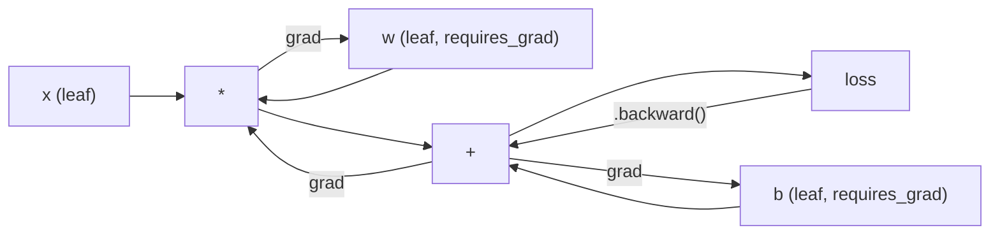
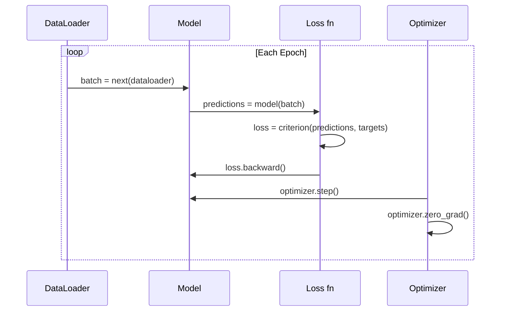

# Introdução ao PyTorch

> Construíste o motor a partir de pistões e grãos de revestimento.

> **【中文解读】**Você desde zero construiu todos os componentes da rede de neurônios.

**Type:** Build
**Languages:** Python
**Prerequisites:** Lesson 03.10 (Build Your Own Mini Framework)
**Time:** ~75 minutes

## Objetivos de aprendizagem

- Construir e treinar redes neurais usando o nn.Module, nn.Sequential e autograd da PyTorch
- Use tensores PyTorch, aceleração GPU e o ciclo de treinamento padrão (zero_grad, para frente, perda, para trás, passo)
- Converte os seus componentes de mini-quadro desde zero para seus equivalentes PyTorch
- Profila e compare a velocidade de treinamento entre o seu framework Python puro e PyTorch na mesma tarefa

> **【中文解读】**本章 从迷你框架过渡到 PyTorch──核心对应关系:Module → nn.Module、手写倒退() → autograd、Python 循环 → GPU 并行──你已经在第10 课时理解底层原理,现在学习工业级实现──

## O problema é o problema da introdução

Você tem uma mini estrutura de trabalho. camadas lineares, ReLU, desistência, padrão de lote, Adam, um DataLoader, um loop de treinamento. Ele treina uma rede de 4 camadas sobre um problema de classificação de círculo em Python puro.

> Você tem um framework miniativo disponível.

É também 500 vezes mais lento do que PyTorch no mesmo problema.

> Mas é mais lento 500 vezes que o PyTorch no mesmo problema.

A sua mini-estrutura processa uma amostra de cada vez com loops Python em ninhos. PyTorch envia as mesmas operações para kernels C++ / CUDA otimizados que executam na GPU. Em uma única NVIDIA A100, PyTorch treina um ResNet-50 (25,6M parâmetros) na ImageNet (1.28M imagens) em cerca de 6 horas. Sua estrutura levaria cerca de 3.000 horas para a mesma tarefa - se não ficasse sem memória primeiro.

> Seu framework miniatura usa o Python  ciclo de processamento individual de emplacamentos. O Python Torch vai distribuir a mesma operação para otimizar a operação no GPU para o CPU.

A velocidade não é a única lacuna. A sua estrutura não tem suporte a GPU. Não há diferenciação automática - você escreveu à mão para trás para cada módulo. Não há serialização. Não há treinamento distribuído. Não há precisão mista. Não há maneira de depurar o fluxo de gradiente sem instruções de impressão.

> 速度不是唯一差距──你的框架没有 GPU 支持──没有自动微分你为每块块手写回来了()──没有序列化──没有分布式训练──没有混合精度──没有不用打印语句就能调试梯度流的方法──

PyTorch preenche cada uma dessas lacunas. E faz isso mantendo exatamente o mesmo modelo mental que você já construiu: módulo, para frente(), parâmetros(), para trás(), optimizador. passo(). Os conceitos transferem um para um. A sintaxe é quase idêntica. A diferença é que PyTorch envolve uma década de engenharia de sistemas atrás da mesma interface que você projetou a partir do zero.

> PyTorch  preencheu todas essas lacunas. Mas mantém o mesmo modelo de mente que você já construiu: módulo, avanço, parâmetros, retrospectiva, optimização, passo, conceito, quase igual. A diferença é que PyTorch está em conjunto com o mesmo interface que você construiu desde o zero.

> **【中文解读】**Seu framework é mais lento do que o PyTorch 500 vezes mais lento, porque Python usa um ciclo de processamento individual, enquanto o PyTorch usa C++/CUDA, em processo de processamento interno.

> **【拓展：PyTorch 为什么赢了 TensorFlow】**Em 2017, quando a PyTorch foi lançada, o TensorFlow ocupou 80% da participação de mercado. Mas a execução de PyTorch foi realizada imediatamente.

## O conceito central.

## O conceito central.

### Porque é que a PyTorch ganhou?

Em 2015, o TensorFlow exigiu que você definiu um gráfico de computação estática antes de executar qualquer coisa. Você construiu o gráfico, compilado, e depois alimentou dados através dele. Debug significava olhar para visualizações de gráficos. Alterar a arquitetura significava reconstruir o gráfico a partir do zero.

> Em 2015, o TensorFlow  requer que você defina o gráfico de cálculo estático antes de executar qualquer coisa. Você construiu o gráfico, compilou-o, então, através dele, introduziu dados.

PyTorch foi lançado em 2017 com uma filosofia diferente: execução ansiosa. Você escreve Python.`y = model(x)`realmente calcula y agora, não "aditar um nó a um gráfico que irá calcular y mais tarde". Isso significa que as ferramentas padrão de depuração Python funcionaram.

> PyTorch em 2017 lançou, adotando diferentes filosofias:即时执行──你写 Python──它立即运行──`y = model(x)`Agora é calculado y, em vez de "Adicionar um pouco mais tarde calcular y de um ponto para um quadro"― isto significa padrão Python 调试工具可用──print() 可用──pdb可用──forward pass 中的 if/else可用──

Em 2020, o mercado já tinha falado. A participação da PyTorch em trabalhos de pesquisa ML passou de 7% (2017) para mais de 75% (2022). Meta, Google DeepMind, OpenAI, Anthropic e Hugging Face todos usam PyTorch como sua estrutura principal. TensorFlow 2.x adotou execução ansiosa em resposta - admissão tácita de que o design da PyTorch era correto.

> Até 2020, o mercado deu a resposta. A participação do PyTorch em trabalhos de estudo em ML aumentou de 7% em 2017 para mais de 75% em 2022.

A lição: um framework que é 10% mais lento mas 50% mais rápido para depurar ganha sempre.

> O desenvolvimento de experiências vai acumular-se. Um ritmo lento de 10% mas um ritmo lento de 50% de cada vez vai ganhar.

### Tensores de tensão

Um tensor é uma matriz multidimensional com três propriedades críticas: forma, dtype e dispositivo.

> A quantidade de dados é um conjunto de três atributos principais: forma, tipo de dados e dispositivo.

```python
import torch

x = torch.zeros(3, 4)           # shape: (3, 4), dtype: float32, device: cpu
x = torch.randn(2, 3, 224, 224) # batch of 2 RGB images, 224x224
x = torch.tensor([1, 2, 3])     # from a Python list
```

**Shape**É a dimensionalidade. Um escalar é a forma (), um vetor é (n), uma matriz é (m, n), um lote de imagens é (batch, canais, altura, largura).

> **Shape**É a forma do sinal é (), é o (n), é o (m, n), é o (m, n), é um conjunto de imagens (batch, canais, altura, largura)

**Dtype**Controla a precisão e a memória.

> **Dtype**Controle de precisão e memória.

| dtype | Bits | Range | Use case |
|-------|------|-------|----------|
| float32 | 32 | ~7 decimal digits | Default training |
| float16 | 16 | ~3.3 decimal digits | Mixed precision |
| bfloat16 | 16 | Same range as float32, less precision | LLM training |
| int8 | 8 | -128 to 127 | Quantized inference |

**Device**determina onde ocorre o cálculo.

> **Device**Decidir o que acontecerá.

```python
device = torch.device("cuda" if torch.cuda.is_available() else "cpu")
x = torch.randn(3, 4, device=device)
x = x.to("cuda")
x = x.cpu()
```

Cada operação requer todos os tensores no mesmo dispositivo.`RuntimeError: Expected all tensors to be on the same device`Corrigir-o mudando tudo para o mesmo dispositivo antes do cálculo.

> Cada operação exige todas as quantidades no mesmo dispositivo. Este é o primeiro grande erro de PyTorch que um iniciante encontra.`RuntimeError: Expected all tensors to be on the same device`                                                                                                                                                                                                                                                              

**Reshaping**é constante-tempo - muda os metadados, não os dados.

> **重塑**É uma operação de tempo constante que muda os dados, não os altera.

```python
x = torch.randn(2, 3, 4)
x.view(2, 12)      # reshape to (2, 12) -- must be contiguous
x.reshape(6, 4)    # reshape to (6, 4) -- works always
x.permute(2, 0, 1) # reorder dimensions
x.unsqueeze(0)     # add dimension: (1, 2, 3, 4)
x.squeeze()        # remove size-1 dimensions
```

### Autograd , por via automática .

A sua mini-estrutura requeria que você implementasse para trás (() para cada módulo. PyTorch não. Ele registra cada operação em tensores em um gráfico acíclico direcionado (o gráfico computacional) e, em seguida, atravessa esse gráfico ao contrário para calcular gradientes automaticamente.

> Seu framework de miniatura exige que você realize para cada módulo para trás. (PyTorch não precisa.



A principal diferença da sua estrutura: PyTorch usa auto-difusão baseada em fita.`.backward()`Repete a fita ao contrário.

> Com a sua estrutura, a principal diferença é que o PyTorch usa micro-partições automáticas baseadas em magnéticos. Durante a sua expansão, cada operação é adicionada a uma "máquina de comunicação" (magnetic tape).`.backward()`Reverso de re-re-emissão de magnéticos:

```python
x = torch.randn(3, requires_grad=True)
y = x ** 2 + 3 * x
z = y.sum()
z.backward()
print(x.grad)  # dz/dx = 2x + 3
```

Três regras de autogrado:

> Autograd 的三条规则:

1. Só tensores de folhas com `requires_grad=True`gradientes acumulados
   Tradução do português:`requires_grad=True`A quantidade de línguas que se acumula
2. Os gradientes se acumulam por padrão -- chamada `optimizer.zero_grad()`antes de cada passagem para trás
   Tradução do inglês: 梯度默认累积每次反向传播前调用`optimizer.zero_grad()`
3. `torch.no_grad()`Desativar o seguimento de gradientes (uso durante a avaliação)
   Tradução:`torch.no_grad()`禁用梯度追踪 (em inglês)

> **【拓展：混合精度训练如何加速】**A 100/H100 de float16 吞吐量是 float32 de 2-4 倍──PyTorch de `torch.amp.autocast`Automáticamente se tornou a rectangular multiplicada e volúdio transformado em float16, mantendo simultaneamente suavemax e perda em float32── acompanhar GradScaler  prevenir float16 梯度下溢── Llama 3                                                                                                                                                                                                                                                                                                                                                                                                                                                                    

### Não. Modulo.

`nn.Module`A versão do PyTorch adiciona registro automático de parâmetros, descoberta de módulos recorrentes, gerenciamento de dispositivos e serialização de ditado de estado.

> `nn.Module`É a base de cada componente de rede neuronal no PyTorch. Você já construiu este abstracto na 10a aula. A versão do PyTorch aumentou o registro automático de parâmetros, a regressão de módulos de descoberta, gerenciamento de dispositivos e a sequenciação de ditos de estado.

```python
import torch.nn as nn

class MLP(nn.Module):
    def __init__(self, input_dim, hidden_dim, output_dim):
        super().__init__()
        self.layer1 = nn.Linear(input_dim, hidden_dim)
        self.relu = nn.ReLU()
        self.layer2 = nn.Linear(hidden_dim, output_dim)

    def forward(self, x):
        x = self.layer1(x)
        x = self.relu(x)
        x = self.layer2(x)
        return x
```

Quando atribuir um`nn.Module`ou `nn.Parameter`como um atributo em `__init__`A PyTorch registra-o automaticamente.`model.parameters()`É por isso que nunca é necessário coletar pesos manualmente como fez no mini framework.

> Quando estás em`__init__`- Não .`nn.Module`Ou `nn.Parameter`Quando a atribuição é atribuída, a PyTorch automaticamente a registra.`model.parameters()` Retorno para recolher os parâmetros de cada registro É por isso que você nunca precisa de poder de recolha manual como no mini framework

Elementos fundamentais:

> 关键构建块:

| Module | What it does | Parameters |
|--------|-------------|------------|
| nn.Linear(in, out) | Wx + b | in*out + out |
| nn.Conv2d(in_ch, out_ch, k) | 2D convolution | in_ch*out_ch*k*k + out_ch |
| nn.BatchNorm1d(features) | Normalize activations | 2 * features |
| nn.Dropout(p) | Random zeroing | 0 |
| nn.ReLU() | max(0, x) | 0 |
| nn.GELU() | Gaussian error linear | 0 |
| nn.Embedding(vocab, dim) | Lookup table | vocab * dim |
| nn.LayerNorm(dim) | Per-sample normalization | 2 * dim |

### Perda de funções e optimizadores .

A PyTorch envia versões prontas para produção de tudo o que construíste.

> PyTorch forneceu uma versão de produção de todos os recursos que você construiu.

**Loss functions**(de `torch.nn`):

> **损失函数**(Via de`torch.nn`):

| Loss | Task | Input |
|------|------|-------|
| nn.MSELoss() | Regression | Any shape |
| nn.CrossEntropyLoss() | Multi-class classification | Logits (not softmax) |
| nn.BCEWithLogitsLoss() | Binary classification | Logits (not sigmoid) |
| nn.L1Loss() | Regression (robust) | Any shape |
| nn.CTCLoss() | Sequence alignment | Log probabilities |

Nota: `CrossEntropyLoss`combinações `LogSoftmax`+ `NLLLoss`O que é um erro comum que produz gradientes errados silenciosamente.

> Nota:`CrossEntropyLoss`内部组合了                                                                                                                                                                                                                                                                                                                                                                                                                                                                                                                         `LogSoftmax`+ `NLLLoss` Introdução a logits originais, não extradição softmax 输出── é um erro comum, irá generar um erro de gradiente──

**Optimizers**(de `torch.optim`):

> **优化器**(Via de`torch.optim`):

| Optimizer | When to use | Typical LR |
|-----------|-------------|-----------|
| SGD(params, lr, momentum) | CNNs, well-tuned pipelines | 0.01--0.1 |
| Adam(params, lr) | Default starting point | 1e-3 |
| AdamW(params, lr, weight_decay) | Transformers, fine-tuning | 1e-4--1e-3 |
| LBFGS(params) | Small-scale, second-order | 1.0 |

### O ciclo de treinamento.

Cada ciclo de treinamento PyTorch segue o mesmo padrão de 5 passos.

> Cada ciclo de treinamento da PyTorch segue o mesmo padrão de cinco passos. Já está na 10a aula.



O padrão canônico:

> 标准模式:

```python
for epoch in range(num_epochs):
    model.train()
    for inputs, targets in train_loader:
        inputs, targets = inputs.to(device), targets.to(device)
        optimizer.zero_grad()
        outputs = model(inputs)
        loss = criterion(outputs, targets)
        loss.backward()
        optimizer.step()
```

Cinco linhas dentro do loop de lote, cinco linhas que treinaram GPT-4, Diffusão estável e LLaMA. A arquitetura muda. Os dados mudam.

> 批量循环内五行代码―― treino GPT-4、Stable Diffusion 和 LLaMA 的五行代码── arquitetura irá mudar──数据 irá mudar──这五行不变──

### Dataset e DataLoader

O PyTorch's `Dataset`é uma classe abstrata com dois métodos: `__len__`E ...`__getitem__`- Não .`DataLoader`Envolve-o com batching, mistura e carregamento de dados de vários processos.

> PyTorch `Dataset`É um tipo de abstração, há dois métodos:`__len__`和 `__getitem__`- Não.`DataLoader`Com processamento em lote, arranjo e vários processos,

```python
from torch.utils.data import Dataset, DataLoader

class MNISTDataset(Dataset):
    def __init__(self, images, labels):
        self.images = images
        self.labels = labels

    def __len__(self):
        return len(self.labels)

    def __getitem__(self, idx):
        return self.images[idx], self.labels[idx]

loader = DataLoader(dataset, batch_size=64, shuffle=True, num_workers=4)
```

`num_workers=4`A GPU é capaz de fazer o treinamento de dados em paralelo, enquanto a carga de trabalho em disco (imagem grande, áudio) pode duplicar a velocidade de treinamento.

> `num_workers=4` produzir 4 processos e carregar dados, ao mesmo tempo que a GPU em batches de treinamento em curso.

### Treinamento de GPUs Treinamento de GPUs

Mover um modelo para GPU:

> Vai transferir o modelo para a GPU:

```python
device = torch.device("cuda" if torch.cuda.is_available() else "cpu")
model = model.to(device)
```

Isso move recursivamente todos os parâmetros e buffer para a GPU.

> Este regresso irá mover cada parâmetro e área de cache para a GPU.

```python
inputs, targets = inputs.to(device), targets.to(device)
```

**Mixed precision**reduz a metade do uso de memória e duplica a capacidade de transmissão das GPUs modernas (A100, H100, RTX 4090) executando para frente/para trás no float16 mantendo os pesos principais no float32:

> **混合精度**通過在 float16 中运行前向/反向传播,同时保持主权重在 float32 中,在现代 GPU(A100、H100、RTX 4090) 上将内存使用减半,吞吐量翻倍:

```python
from torch.amp import autocast, GradScaler

scaler = GradScaler()
for inputs, targets in loader:
    with autocast(device_type="cuda"):
        outputs = model(inputs)
        loss = criterion(outputs, targets)
    scaler.scale(loss).backward()
    scaler.step(optimizer)
    scaler.update()
    optimizer.zero_grad()
```

### Comparação: Mini Framework vs PyTorch vs JAX

| Feature | Mini Framework (L10) | PyTorch | JAX |
|---------|---------------------|---------|-----|
| Autodiff | Manual backward() | Tape-based autograd | Functional transforms |
| Execution | Eager (Python loops) | Eager (C++ kernels) | Traced + JIT compiled |
| GPU support | No | Yes (CUDA, ROCm, MPS) | Yes (CUDA, TPU) |
| Speed (MNIST MLP) | ~300s/epoch | ~0.5s/epoch | ~0.3s/epoch |
| Module system | Custom Module class | nn.Module | Stateless functions (Flax/Equinox) |
| Debugging | print() | print(), pdb, breakpoint() | Harder (JIT tracing breaks print) |
| Ecosystem | None | Hugging Face, Lightning, timm | Flax, Optax, Orbax |
| Learning curve | You built it | Moderate | Steep (functional paradigm) |
| Production use | Toy problems | Meta, OpenAI, Anthropic, HF | Google DeepMind, Midjourney |

## Construí-lo e realizei-o.

> **【中文解读】**│ │ │ │ │ │ │ │ │ │ │ │ │ │ │ │ │ │ │ │ │ │ │ │ │ │ │ │ │ │ │ │ │ │ │ │ │ │ │ │ │ │ │ │ │ │ │ │ │ │ │ │ │ │ │ │ │ │ │ │ │ │ │ │ │ │ │ │ │ │ │ │ │ │ │ │ │ │ │ │ │ │ │ │ │ │ │ │ │ │ │ │ │ │ │ │ │ │ │ │ │ │ │ │ │ │ │ │ │ │ │ │ │ │ │ │ │ │ │ │ │ │ │ │ │ │ │ │ │ │ │ │ │ │ │ │ │ │ │ │ │ │ │ │ │ │ │ │ │ │ │ │ │ │ │ │ │ │ │ │ │ │ │ │ │ │ │ │ │ │ │ │ │ │ │ │ │ │ │ │ │ │ │ │ │ │ │ │ │ │ │ │ │ │ │ │ │ │ │ │ │ │ │ │ │ │ │ │ │ │ │ │ │ │ │ │ │ │ │ │ │ │ │ │ │ │ │ │ │ │ │ │ │ │ │ │ │ │ │ │ │ │ │ │ │ │ │ │ │ │ │ │ │ │ │
```figure
dropout-mask
```

## Construí-lo

Um MLP de 3 camadas treinado no MNIST usando apenas primitivos PyTorch.`torchvision.datasets`Nós baixamos e analisamos os dados brutos.

> Utilize Pure PyTorch Original Language Training 3 Layer MLP fazer MNIST 分类──無高封装──無 `torchvision.datasets`◊ Nós mesmos baixamos e analisamos os dados originais

### Passo 1: Carregar MNIST a partir de arquivos brutos .

O MNIST envia como 4 arquivos gzipados: imagens de treinamento (60.000 x 28 x 28), rótulos de treinamento, imagens de teste (10.000 x 28 x 28), rótulos de teste.

> MNIST 以 4 个 gzip 文件提供:训练图像(60.000 x 28 x 28) ✓训练标签、测试图像(10.000 x 28 x 28) ✓测试标签──我们下载它们并解析二进制格式──

```python
import torch
import torch.nn as nn
import struct
import gzip
import urllib.request
import os

def download_mnist(path="./mnist_data"):
    base_url = "https://storage.googleapis.com/cvdf-datasets/mnist/"
    files = [
        "train-images-idx3-ubyte.gz",
        "train-labels-idx1-ubyte.gz",
        "t10k-images-idx3-ubyte.gz",
        "t10k-labels-idx1-ubyte.gz",
    ]
    os.makedirs(path, exist_ok=True)
    for f in files:
        filepath = os.path.join(path, f)
        if not os.path.exists(filepath):
            urllib.request.urlretrieve(base_url + f, filepath)

def load_images(filepath):
    with gzip.open(filepath, "rb") as f:
        magic, num, rows, cols = struct.unpack(">IIII", f.read(16))
        data = f.read()
        images = torch.frombuffer(bytearray(data), dtype=torch.uint8)
        images = images.reshape(num, rows * cols).float() / 255.0
    return images

def load_labels(filepath):
    with gzip.open(filepath, "rb") as f:
        magic, num = struct.unpack(">II", f.read(8))
        data = f.read()
        labels = torch.frombuffer(bytearray(data), dtype=torch.uint8).long()
    return labels
```

### Passo 2: Definir o Modelo.

Uma MLP de 3 camadas: 784 -> 256 -> 128 -> 10. Ativações ReLU. Desistência para regularização. Não há norma de lote para mantê-lo simples.

> Uma 3 Layer MLP:784 -> 256 -> 128 -> 10。ReLU 激活──Dropout 正则化──为简单起见不用BatchNorm──

```python
class MNISTModel(nn.Module):
    def __init__(self):
        super().__init__()
        self.net = nn.Sequential(
            nn.Linear(784, 256),
            nn.ReLU(),
            nn.Dropout(0.2),
            nn.Linear(256, 128),
            nn.ReLU(),
            nn.Dropout(0.2),
            nn.Linear(128, 10),
        )

    def forward(self, x):
        return self.net(x)
```

A camada de saída produz 10 logits brutos (um por dígito).`CrossEntropyLoss`- Ele lida com isso internamente.

> 输出层产生 10 个原始logits(每个数字一个) ――不需要软max`CrossEntropyLoss`内部处理──

Contagem de parâmetros: 784 * 256 + 256 + 256 * 128 + 128 + 128 * 10 + 10 = 235.146. Pequeno segundo os padrões modernos. GPT-2 pequeno tem 124M. Isso treina em segundos.

> 参数:784*256 + 256 + 256*128 + 128 + 128*10 + 10 = 235.146。 segundo padrão moderno muito pequeno。 GPT-2 pequeno Há 124M。 esse em poucos segundos já pode treinar completo。

### Passo 3: Ciclo de treinamento.

O padrão canônico de avanço-perda-passo-retorno.

> 標準的前進損失後進步模式 ‧

```python
def train_one_epoch(model, loader, criterion, optimizer, device):
    model.train()
    total_loss = 0
    correct = 0
    total = 0
    for images, labels in loader:
        images, labels = images.to(device), labels.to(device)
        optimizer.zero_grad()
        outputs = model(images)
        loss = criterion(outputs, labels)
        loss.backward()
        optimizer.step()
        total_loss += loss.item() * images.size(0)
        _, predicted = outputs.max(1)
        correct += predicted.eq(labels).sum().item()
        total += labels.size(0)
    return total_loss / total, correct / total


def evaluate(model, loader, criterion, device):
    model.eval()
    total_loss = 0
    correct = 0
    total = 0
    with torch.no_grad():
        for images, labels in loader:
            images, labels = images.to(device), labels.to(device)
            outputs = model(images)
            loss = criterion(outputs, labels)
            total_loss += loss.item() * images.size(0)
            _, predicted = outputs.max(1)
            correct += predicted.eq(labels).sum().item()
            total += labels.size(0)
    return total_loss / total, correct / total
```

Nota `torch.no_grad()`O PyTorch cria um gráfico computacional que nunca usas.

> Atenção avaliação `torch.no_grad()`Não há, o PyTorch irá construir um gráfico de cálculo que você nunca usará.

### Passo 4: Arranjar tudo juntos.

```python
def main():
    device = torch.device("cuda" if torch.cuda.is_available() else "cpu")

    download_mnist()
    train_images = load_images("./mnist_data/train-images-idx3-ubyte.gz")
    train_labels = load_labels("./mnist_data/train-labels-idx1-ubyte.gz")
    test_images = load_images("./mnist_data/t10k-images-idx3-ubyte.gz")
    test_labels = load_labels("./mnist_data/t10k-labels-idx1-ubyte.gz")

    train_dataset = torch.utils.data.TensorDataset(train_images, train_labels)
    test_dataset = torch.utils.data.TensorDataset(test_images, test_labels)
    train_loader = torch.utils.data.DataLoader(
        train_dataset, batch_size=64, shuffle=True
    )
    test_loader = torch.utils.data.DataLoader(
        test_dataset, batch_size=256, shuffle=False
    )

    model = MNISTModel().to(device)
    criterion = nn.CrossEntropyLoss()
    optimizer = torch.optim.Adam(model.parameters(), lr=1e-3)

    num_params = sum(p.numel() for p in model.parameters())
    print(f"Device: {device}")
    print(f"Parameters: {num_params:,}")
    print(f"Train samples: {len(train_dataset):,}")
    print(f"Test samples: {len(test_dataset):,}")
    print()

    for epoch in range(10):
        train_loss, train_acc = train_one_epoch(
            model, train_loader, criterion, optimizer, device
        )
        test_loss, test_acc = evaluate(
            model, test_loader, criterion, device
        )
        print(
            f"Epoch {epoch+1:2d} | "
            f"Train Loss: {train_loss:.4f} | Train Acc: {train_acc:.4f} | "
            f"Test Loss: {test_loss:.4f} | Test Acc: {test_acc:.4f}"
        )

    torch.save(model.state_dict(), "mnist_mlp.pt")
    print(f"\nModel saved to mnist_mlp.pt")
    print(f"Final test accuracy: {test_acc:.4f}")
```

Output esperado após 10 épocas: ~ 97,8% de precisão de teste. Tempo de treinamento na CPU: ~ 30 segundos. Na GPU: ~ 5 segundos. Em sua mini-quadro com a mesma arquitetura: ~ 45 minutos.

> 10 个时代 后预期输出:~97.8% 测试准确率──CPU 训练时间:~30 秒──GPU:~5 秒──用迷你框架相同架构:~45 分钟──

> **【拓展：从 MNIST 到大模型】**MNIST MLP 只有235K 参数──现代模型的规模:GPT-2 small 124M、BERT-base 110M、Llama 3 8B──参数增长 ~1000x,但训练循环的五步模式完全不变──区别在:数据并行(多 GPU)、模型并行(单 GPU 放不下)、梯度检查点(节省显存)、混合精度(加速计算)──这些都是 PyTorch 生态系统的一部分──

## Use-o com o framework implementado.

> **【中文解读】**迷你框架和 PyTorch的接口几乎一致──关键区别:PyTorch Use Autograd 自动微分(不需要手写倒后((、支持 GPU(model.to("cuda")) 、支持混合精度训练──保存模型用 state_dict() 可移植的参数典),不要直接酸模型对象──

### Rapido comparativo: Mini Framework vs PyTorch

| Mini Framework (Lesson 10) | PyTorch |
|---------------------------|---------|
| `model = Sequential(Linear(784, 256), ReLU(), ...)` | `model = nn.Sequential(nn.Linear(784, 256), nn.ReLU(), ...)` |
| `pred = model.forward(x)` | `pred = model(x)` |
| `optimizer.zero_grad()` | `optimizer.zero_grad()` |
| `grad = criterion.backward()` then `model.backward(grad)` | `loss.backward()` |
| `optimizer.step()` | `optimizer.step()` |
| No GPU | `model.to("cuda")` |
| Manual backward for every module | Autograd handles everything |

A interface é quase idêntica, a diferença é que tudo está debaixo do capô.

> A interface é quase a mesma. A diferença está no fundo.

### Salvar e Carregar Modelos  Salvar e Carregar Modelos

```python
torch.save(model.state_dict(), "model.pt")

model = MNISTModel()
model.load_state_dict(torch.load("model.pt", weights_only=True))
model.eval()
```

Salva sempre .`state_dict()`(o dicionário de parâmetros), não o objeto modelo. Salvar o objeto modelo usa picle, que rompe quando você refactor código.

> 始终保存 `state_dict()`(参数字典), em vez de modelos对象──保存模型对象使用,重构代码时会破坏──Estado dit é可移植的──

### A taxa de aprendizagem A taxa de aprendizagem

```python
scheduler = torch.optim.lr_scheduler.CosineAnnealingLR(
    optimizer, T_max=10
)
for epoch in range(10):
    train_one_epoch(model, train_loader, criterion, optimizer, device)
    scheduler.step()
```

A PyTorch envia 15+ agendadores: StepLR, ExponentialLR, CosineAnnealingLR, OneCycleLR, ReduceLROnPlateau. Todos conectados à mesma interface de otimização.

> PyTorch  fornece 15+ tipos de módulos:StepLR、ExponencialLR、CosineAnnealingLR、OneCycleLR、ReduceLROnPlateau──todos inseridos no mesmo interface de melhoramento──

## Envia-o . Produto .

Esta lição produz dois artefatos:

> Este curso é elaborado em dois documentos:

- `outputs/prompt-pytorch-debugger.md`-- um aviso para diagnosticar falhas comuns no treinamento PyTorch
  Tradução:`outputs/prompt-pytorch-debugger.md`- 诊断常见 PyTorch 训练故障的提示词
- `outputs/skill-pytorch-patterns.md`-- uma referência de habilidades para os padrões de formação PyTorch
  Tradução:`outputs/skill-pytorch-patterns.md`- PyTorch  training mode de habilidades referência

## Exercícios.

1. **Add batch normalization.**Insira`nn.BatchNorm1d`A norma de lote deve atingir 98%+ em menos épocas.

2. **Implement a learning rate finder.**Treinar por uma época com uma taxa de aprendizagem exponencialmente aumentando (de 1e-7 a 1,0). perda de parcela versus LR. A LR ideal é pouco antes da perda começar a subir. Use isso para escolher uma melhor LR para o modelo MNIST.

3. **Port to GPU with mixed precision.**Adicionar`torch.amp.autocast`E ...`GradScaler`Para a velocidade de execução, a velocidade de execução deve ser de aproximadamente 2x.

4. **Build a custom Dataset.**Descarregar Fashion-MNIST (o mesmo formato que o MNIST mas com artigos de vestuário).`FashionMNISTDataset(Dataset)`classe com `__getitem__`E ...`__len__`Treinar a mesma MLP e comparar a precisão.

5. **Replace Adam with SGD + momentum.**Trem com `SGD(params, lr=0.01, momentum=0.9)`Comparar curvas de convergência.`CosineAnnealingLR`E ver se a SGD vai alcançar o Adam na época 10.

## Termos-chave .

| Term | What people say | What it actually means |
|------|----------------|----------------------|
| Tensor | "A multi-dimensional array" | A typed, device-aware array with automatic differentiation support baked into every operation |
| Autograd | "Automatic backprop" | A tape-based system that records operations during forward pass, then replays them in reverse to compute exact gradients |
| nn.Module | "A layer" | The base class for any differentiable computation block -- registers parameters, supports nesting, handles train/eval modes |
| state_dict | "The model weights" | An OrderedDict mapping parameter names to tensors -- the portable, serializable representation of a trained model |
| .backward() | "Compute gradients" | Traverse the computational graph in reverse, computing and accumulating gradients for every leaf tensor with requires_grad=True |
| .to(device) | "Move to GPU" | Recursively transfer all parameters and buffers to the specified device (CPU, CUDA, MPS) |
| DataLoader | "The data pipeline" | An iterator that batches, shuffles, and optionally parallelizes data loading from a Dataset |
| Mixed precision | "Use float16" | Train with float16 forward/backward for speed while keeping float32 master weights for numerical stability |
| Eager execution | "Run it now" | Operations execute immediately when called, not deferred to a later compilation step -- the core design choice that differentiates PyTorch from TF 1.x |
| zero_grad | "Reset gradients" | Set all parameter gradients to zero before the next backward pass, since PyTorch accumulates gradients by default |

## Mais leitura 延伸阅读

- Paszke et al., "PyTorch: Um estilo imperativo, High-Performance Deep Learning Library" (2019) -- o artigo original explicando as compensações de design da PyTorch
  Paszke 等人,PyTorch: um estilo de comando de alto desempenho profundidade de aprendizagem (2019) Explicar PyTorch design权衡的原始论文
- Tutoriais de PyTorch: "Aprender PyTorch com exemplos" (https://pytorch.org/tutorials/beginner/pytorch_with_examples.html) -- o caminho oficial dos tensores para o módulo nn
  PyTorch Ensino: Usando exemplos aprender PyTorch de张量 até nn.Module
- Guia de sintonização de desempenho PyTorch (https://pytorch.org/tutorials/recipes/recipes/tuning_guide.html) -- precisão mista, trabalhadores do DataLoader, memória fixa e outras otimizações de produção
  PyTorch  performance adjustment  mixed precision  DataLoader  work process  fixed内存 e outros processos de produção
- Horace He, "Fazer o Aprendizagem Profunda Ir Brrrr" (https://horace.io/brrr_intro.html) -- por que o treinamento da GPU é rápido, com estratégias de otimização específicas do PyTorch
  Horace He, 让深度学习飞速运行为什么 GPU 训练快,以及 PyTorch 特定优化策略
