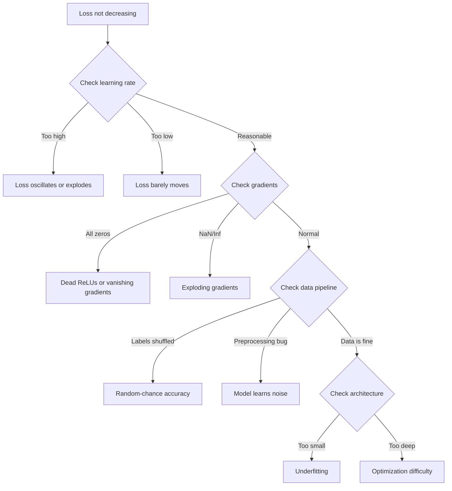
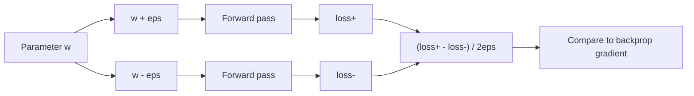
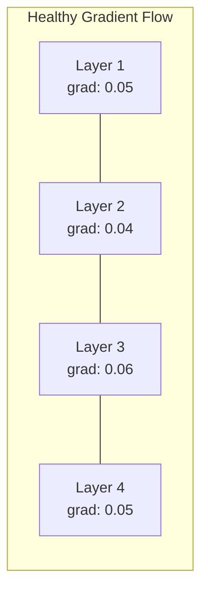
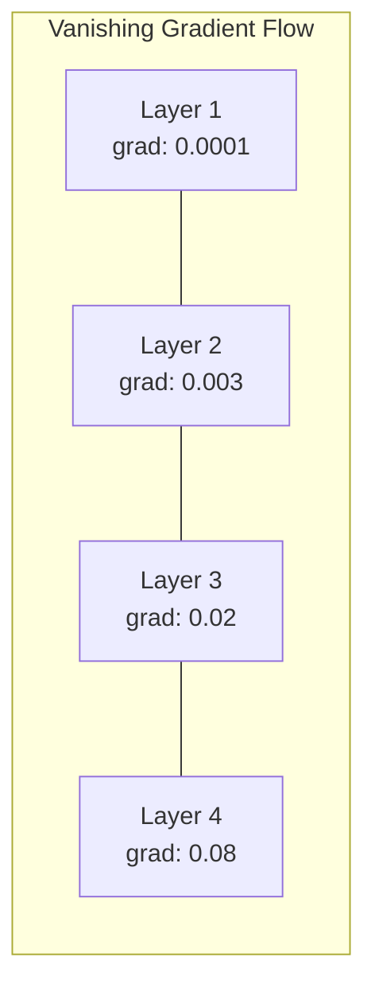
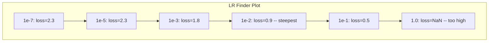

# Desembaraçamento de redes neurais

> A sua rede foi compilada. Ele foi executado. Produzido um número. O número está errado e nada caiu. Bem-vindo ao tipo mais difícil de depuração - o tipo onde não há mensagem de erro.

> **【中文解读】**网络编译了、运行了、输出了数字但数字是错误的,没有报错信息――这是最难调试:没有错信息――本章系统介绍深度学习的调试方法论:过拟合单批 → 检查梯度 → 追踪数值稳定性 → 诊断学习率问题――

**Type:** Practice
**Type:** Build
**Languages:** Python, PyTorch
**Prerequisites:** Phase 03 Lessons 01-10 (especially backpropagation, loss functions, optimizers)
**Time:** ~90 minutes

## Objetivos de aprendizagem

- Diagnóstico de falhas comuns de rede neural (perda de NaN, curva de perda plana, sobreajuste, oscilação) utilizando estratégias de depuração sistemática
- Aplique a técnica "overfit one batch" para verificar que a arquitetura do modelo e o ciclo de treinamento são corretos
- Inspeccionar as magnitudes de gradiente, distribuições de ativação e normas de peso para identificar problemas de gradiente que desaparecem/explodem
- Construa uma lista de verificação de depuração que cobre o pipeline de dados, arquitetura de modelo, função de perda, otimizador e problemas de taxa de aprendizagem

> **【中文解读】**本章系统化地教你调试神经网络──核心方法论:过拟合单批量(验证代码正确性)→ 梯度检查(验证反向传播)→ 激活统计(发现死 ReLU)→ 学习率搜索(找到合适的 lr)──60-70% 的 ML 调试时间花在"静默错误"上程序不报错但结果不对──

## O problema é o problema da introdução

O software tradicional cai quando está quebrado. Um punteiro zero lança uma exceção. Um desajuste de tipo falha no tempo de compilação. Um erro off-by-one produz uma saída claramente errada.

> O software tradicional é um problema, mas não é o mesmo. O tipo de software não é adequado para a composição.

As redes neurais não lhe dão esse luxo.

> A rede não lhe dá esse luxo.

Uma rede neural quebrada corre até a conclusão, imprime um valor de perda e faz previsões. A perda pode diminuir. As previsões podem parecer plausíveis. Mas o modelo está silenciosamente errado: aprender atalhos, memorizar ruído ou convergir para um mínimo local inútil. Pesquisadores do Google estimaram que 60-70% do tempo de depuração do ML é gasto em bugs "silenciosos" que não produzem erros, mas degradam a qualidade do modelo.

> Uma rede neural com problemas pode funcionar até a conclusão, imprimir perdas, emitir previsões.

A diferença entre um modelo de trabalho e um modelo quebrado é muitas vezes uma única linha deslocada: uma falta `zero_grad()`, uma dimensão transposta, uma taxa de aprendizagem de 10x. A canônica "Receita para Treinar Redes Neurais" (2019) abre com isto: "Os erros mais comuns da rede neural são bugs que não caem".

> A diferença entre modelos usáveis e modelos danificados é apenas uma linha de código de colocação errada: falta.`zero_grad()`、维度转置错误、学习率差 10 倍──经典的"训练神经网络的方法" () 开头写道:"Os erros mais comuns de rede neural não caem em erro.

Esta lição ensina-te a encontrar esses insetos.

> Este curso ensina-te a encontrar esses bugs.

> **【中文解读】**O software tradicional tem um sinal de erro claro ([[o) 异常]], [[编译错误]] ([[o]] erro de composição]])  O local mais difícil de se regular no sistema nervoso é o "quieto de erro" ([[o]] erro de execução normal do programa  perda também está em declínio, mas o modelo 地学错误了── os três cachos mais comuns: esqueça zero_grad()  dimensão de transferência  taxa de aprendizagem diferem 10 vezes──

> **【拓展：大模型训练中的调试】**訓練 Llama 3 405B 这样型模型(16384块 H100,30.8M GPU 小时),一次训练失败的成本高达数百万美元──Meta's practice is:(1) 先在小模型(8B) 上验证所有代码;(2) 使用过适的一批测试完整管线;(3) 在 64块 GPU 上跑"冒烟测试";(4) 逐步扩展到完整规模──每个阶段都有自动化监控检查 NaN、损失尖、死神经细胞──

## O conceito central.

### A mentalidade de desembaraço.

Esqueça o depuração de impressão e prato. A depuração de rede neural requer uma abordagem sistemática porque o loop de feedback é lento (minutos a horas por treinamento) e os sintomas são ambíguos (perda ruim pode significar 20 coisas diferentes).

> 忘记印刷和修练――神经网络调试需要系统化方法,因为反循环很慢 (cada treinamento é lento de alguns minutos a alguns horas), e os sintomas se amolecem (差的损失可能意味着20 diferentes problemas)

A regra de ouro:**start simple, add complexity one piece at a time, and verify each piece independently.**

> 黄金法则:**从简单开始，一次只加一个复杂度，独立验证每个组件。**

> **【中文解读】**调试神经网络的黄金法则: Começa com a situação mais simples, cada vez apenas adicione um componente, verifique independentemente cada componente. Não comece a correr o treinamento completo antes de garantir que o modelo possa se adaptar em um único lote até a perda.



### Sintoma 1: Perda não diminuição

A formação continua, as épocas passam e a perda permanece plana ou oscila muito.

> É o que mais se sabe. O ciclo de treinamento está a correr, uma época depois de outra, mas a perda está inmóvel ou em tremores.

**Wrong learning rate.**Muito alto: a perda oscila ou salta para NaN. Muito baixo: a perda diminui tão lentamente que parece plana. Para Adam, comece em 1e-3. Para SGD, comece em 1e-1 ou 1e-2.

> **学习率错误。**太高:loss 振荡或跳到NaN──太低:loss 下降得太慢,看起来像不动──Adam 从1e-3 开始──SGD 从1e-1 或1e-2 开始──在下结论说有其他问题之前,先尝试3个学习率(相差 10 倍,如1e-2、1e-3、1e-4)──

**Dead ReLUs.**Se um neurônio ReLU receber uma entrada negativa grande, ele produz 0 e seu gradiente é 0.

> **死亡 ReLU。**Se o Neuro ReLU receber uma grande entrada negativa, ele sai 0, gradiente é 0, nunca mais será ativado. Se morrer, o Neuro suficiente, a rede começará a aprender não chega a nada.

**Vanishing gradients.**Em redes profundas com ativações sigmoides ou tanh, os gradientes encolhem-se exponencialmente à medida que se propagam para trás. Quando atingem a primeira camada, são ~0. As primeiras camadas param de aprender.

> **梯度消失。**Em redes de nível profundo activadas com sigmoides ou tanh, a gradiência contra-direção da disseminação é reduzida.

**Exploding gradients.**O problema oposto - gradientes crescem exponencialmente. comum em RNNs e redes muito profundas. perda salta para NaN. Fixa: corte de gradiente (`torch.nn.utils.clip_grad_norm_`), reduzir a taxa de aprendizagem ou adicionar a normalização.

> **梯度爆炸。**Em vez disso, a taxa de crescimento de índices de gradientes é muito alta.`torch.nn.utils.clip_grad_norm_`• • redução da taxa de aprendizagem

### Sintoma 2: Perda diminuindo mas modelo é ruim.

A perda diminui, a precisão de treinamento atinge 99%, mas a precisão de teste é de 55%, ou o modelo produz resultados absurdos em dados reais.

> Perda em baixa. A taxa de precisão de treinamento atinge 99%. Mas a taxa de precisão de teste é de apenas 55%.

**Overfitting.**O modelo memorizou dados de treinamento em vez de padrões de aprendizagem. A diferença entre treinamento e perda de validação aumenta ao longo do tempo.

> **过拟合。**模型在背诵训练数据而不是学习规律── training loss和验证 loss 之间的差距随时间扩大──修复:更多数据、Dropout、权重衰减、早停、数据增强──

**Data leakage.**Os dados de teste foram filtrados para o treinamento. A precisão é suspeitamente alta. Causas comuns: mistura antes de dividir, pré-processamento com estatísticas do conjunto completo de dados, amostras duplicadas em divisões.

> **数据泄漏。**测试数据混入了训练――准确率高可可疑――常见原因:划分前先打乱、 fazer pré-processamento、 através de um conjunto de dados, fazendo uma análise de dados, fazendo uma análise de dados, fazendo uma análise de dados, fazendo uma análise de dados, fazendo uma análise de dados, fazendo uma análise de dados, fazendo uma análise de dados, fazendo uma análise de dados, fazendo uma análise de dados, fazendo uma análise de dados, fazendo uma análise de dados, fazendo uma análise de dados, fazendo uma análise de dados, fazendo uma análise de dados, fazendo uma análise de dados, fazendo uma análise de dados, fazendo uma análise de dados, fazendo uma análise de dados, fazendo uma análise de dados, fazendo uma análise de dados, fazendo uma análise de dados, fazendo uma análise de dados, fazendo uma análise de dados, fazendo uma análise de dados, fazendo uma análise de dados, fazendo uma análise de dados, fazendo uma análise de dados, fazendo uma análise de dados, fazendo uma análise de dados, fazendo uma análise de dados, fazendo uma análise de dados, fazendo uma análise de dados, fazendo uma análise de dados, fazendo uma análise de dados, fazendo uma análise de dados, fazendo uma análise de dados, fazendo uma análise de dados, e fazendo uma análise de dados, fazendo uma análise de dados, e fazendo uma análise de dados, de dados, fazendo uma análise de dados, de dados, ou de dados, ou de dados, ou de dados, ou de dados, ou de dados, ou de dados, ou de dados, ou de dados, ou de dados, ou de dados, ou de dados, ou de um ou de dados, ou de um ou de um ou de um ou de um ou de um ou de um ou de um ou de um ou de um ou de um ou de um ou de um ou de um ou de um ou de um ou de um ou de um ou de outro, ou de um ou de um ou de outro, ou de outro, ou de um ou de um ou de um ou de outro, ou de um ou de outro, ou de um ou de um ou de outro, ou de um ou de outro, ou de um ou de um ou de outro, ou de um ou de

**Label errors.**5-10% dos rótulos na maioria dos conjuntos de dados reais são errados (Northcutt et al., 2021 -- "Erros de rótulo pervasivos em conjuntos de teste"). O modelo aprende o ruído. Correção: use aprendizado confiante para encontrar e corrigir exemplos errados, ou use truncation de perda para ignorar amostras de alta perda.

> **标签错误。**Mas a maioria dos dados verdadeiros é de 5-10% de um erro.

### Sintoma 3: Perda de NaN ou Inf em perda

O valor da perda torna-se `nan`ou `inf`O treino está morto.

> Valor de perda transformado`nan`Ou `inf`Treinamento morto.

**Learning rate too high.**As atualizações graduais ultrapassam o ponto de os pesos explodirem.

> **学习率太高。**梯度更新过冲到权重爆炸──修复: redução 10 倍──

**log(0) or log(negative).**Computação de perda de entropia cruzada `log(p)`Se o seu modelo produz exatamente 0 ou uma probabilidade negativa, o log explode.`[eps, 1-eps]`onde`eps=1e-7`- Não .

> **log(0) 或 log(负数)。**交叉损失计算                                                                                                                                                                                                                                                                                                                                                                                                                                                                                                                       `log(p)`Se o modelo sair de 0 ou probabilidade negativa, log 会爆炸──修复:把预测值制到`[eps, 1-eps]`, entre os `eps=1e-7`- Não.

**Division by zero.**A normalização de lote se divide por desvio padrão. Um lote com valores constantes tem std=0. Fix: adicione epsilon ao denominador (PyTorch faz isso por padrão, mas implementações personalizadas podem não).

> **除以零。**批归一化要除以标准差──一个常数值的批的 std=0──修复:分母加 epsilon(PyTorch 默认这样做,但自定义实现可能没有)──

**Numerical overflow.**Grandes ativações alimentadas em `exp()`A solução é subtrair o máximo antes de exponenciar (o truque log-sum-exp).

> **数值溢出。**Grande valor de atividade`exp()`O resultado é o resultado da análise de dados.

### Técnica 1: Verificação Gradiente. Técnica 1: Verificação de Nível.

Compare os seus gradientes analíticos (de backprop) com os gradientes numéricos (de diferenças finitas).

> Colocar sua escala de resolução (( proveniente de contra-direção de propagação) e a escala de valores (( proveniente de diferença limitada) para fazer uma comparação.

Gradiente numérico para o parâmetro `w`- Não .

> 参数 `w`de um número de valores:

```
grad_numerical = (loss(w + eps) - loss(w - eps)) / (2 * eps)
```

Metrica de acordo (diferência relativa):

> Uma homogeneidade de dimensão (relativamente à diferença):

```
rel_diff = |grad_analytical - grad_numerical| / max(|grad_analytical|, |grad_numerical|, 1e-8)
```

Se`rel_diff < 1e-5`- Não, não.`rel_diff > 1e-3`- É quase certo que é um inseto.

> Se `rel_diff < 1e-5`- Não, não.`rel_diff > 1e-3`Há quase certamente um bug.



### Técnica 2: Estatísticas de Ativação Técnica 2: Ativação de Estatísticas

Monitorar a média e o desvio padrão das ativações após cada camada durante o treinamento.

>                                                                                                                                                                                                                                                               

| Health indicator | Mean | Std | Diagnosis |
|-----------------|------|-----|-----------|
| Healthy | ~0 | ~1 | Network is learning normally |
| Saturated | >>0 or <<0 | ~0 | Activations stuck at extreme values |
| Dead | 0 | 0 | Neurons are dead (all zeros) |
| Exploding | >>10 | >>10 | Activations growing without bound |

| 健康指标 | 均值 | 标准差 | 诊断 |
|---------|------|--------|------|
| 健康 | ~0 | ~1 | 网络正常学习中 |
| 饱和 | >>0 或 <<0 | ~0 | 激活卡在极端值 |
| 死亡 | 0 | 0 | 神经元死了（全零） |
| 爆炸 | >>10 | >>10 | 激活无界增长 |

### Técnica 3: Visualização de fluxo gradual.

Grafe a magnitude média de gradiente para cada camada. Em uma rede saudável, as magnitude de gradiente devem ser aproximadamente semelhantes em todas as camadas. Se as camadas iniciais têm gradientes 1000 vezes menores que as camadas posteriores, você tem gradientes desaparecendo.

>  desenhar a amplitude média de cada camada  Em redes saudáveis, a amplitude de cada camada deve ser aproximadamente similar Se a amplitude da camada anterior for 1000 vezes menor que a posterior, você terá um problema de diminuição da amplitude





### Técnica 4: O Overfit-One-Batch Test.

A técnica de depuração mais importante no aprendizado profundo.

> A maior importância da aprendizagem profunda é a técnica de um único teste.

Tome um pequeno lote (8-32 amostras). Treine sobre ele para mais de 100 iterações. A perda deve ir para quase zero e a precisão de treinamento deve atingir 100%.

> 取一个小批量 ((8-32个样本) ⋅ 在上面训练100+ 次代――损失应降到接近零,训练准确率应达到100%──如果不是,你的模型或训练循环有根本的错不要进入完整训练──

Este ensaio detecta:
- Funções de perda quebradas
- Passagens para trás quebradas
- Arquitetura muito pequena para representar os dados
- Otimizador não ligado aos parâmetros do modelo
- Dados e rótulos desalinhados

> Este teste pode capturar: função de perda de deterioramento, função de desvio de deterioramento, estrutura muito pequena não pode mostrar dados, otimizador não está conectado a parâmetros do modelo, dados e etiquetas não correspondem.

Isto leva 30 segundos para correr e economiza horas de depuração de treinamento completo.

> Isto só leva 30 segundos para funcionar, pode economizar algumas horas de treinamento completo.

> **【拓展：Andrej Karpathy 的调试建议】**Karpathy em "Receita para treinamento de redes neurais" deu a recomendação: 1) não gerar desempenho, garantir a perda 计算正确; 2) em um pequeno conjunto de dados fixo; 3) verificar a escalada com um número de valores; 4) controlar o peso e a escalada de um número de modelos; 5) prever um pequeno modelo, reampliar-se.

### Técnica 5: Técnica de aprendizagem Rate Finder 技术 5: aprendizagem Rate Search Engine

Leslie Smith (2017) propôs varrer a taxa de aprendizagem de muito pequena (1e-7) para muito grande (10) durante uma época enquanto registra a perda.

> Leslie Smith(2017) propôs em uma época interna把学习率从极小(1e-7)扫到极大(10), ao mesmo tempo registando perda──绘画损失与学习率曲线──最优学习率大约是损失──开始下降最快处的学习率的1/10──



Melhor LR neste exemplo: ~1e-3 (uma ordem de magnitude antes do ponto mais íngreme).

> O melhor índice de aprendizagem neste caso é: ~1e-3(

### Bugs PyTorch comuns .

Estes são os bugs que desperdiçam as horas mais coletivas na comunidade PyTorch:

> Estes são os bugs mais perdidos no PyTorch:

> **【拓展：大模型训练中的 loss spike】**Em treinamento de modelos de super-massas, como GPT-4、Llama 3), ocorre uma perda súbita de pico loss de saltar de um valor normal para um rápido retorno.

| Bug | Symptom | Fix |
|-----|---------|-----|
| Forgetting `optimizer.zero_grad()` | Gradients accumulate across batches, loss oscillates | Add `optimizer.zero_grad()` before `loss.backward()` |
| Forgetting `model.eval()` at test time | Dropout and batch norm behave differently, test accuracy varies between runs | Add `model.eval()` and `torch.no_grad()` |
| Wrong tensor shapes | Silent broadcasting produces wrong results, no error | Print shapes after every operation during debugging |
| CPU/GPU mismatch | `RuntimeError: expected CUDA tensor` | Use `.to(device)` on model AND data |
| Not detaching tensors | Computation graph grows forever, OOM | Use `.detach()` or `with torch.no_grad()` |
| In-place operations breaking autograd | `RuntimeError: modified by in-place operation` | Replace `x += 1` with `x = x + 1` |
| Data not normalized | Loss stuck at random-chance level | Normalize inputs to mean=0, std=1 |
| Labels as wrong dtype | Cross-entropy expects `Long`, got `Float` | Cast labels: `labels.long()` |

| Bug | 症状 | 修复 |
|-----|------|------|
| 忘记 `optimizer.zero_grad()` | 梯度跨 batch 累积，loss 振荡 | 在 `loss.backward()` 前加 `optimizer.zero_grad()` |
| 测试时忘记 `model.eval()` | Dropout 和 BN 行为不同，测试准确率波动 | 加 `model.eval()` 和 `torch.no_grad()` |
| 张量形状错误 | 静默广播产生错误结果，无报错 | 调试时每个操作后打印形状 |
| CPU/GPU 不匹配 | `RuntimeError: expected CUDA tensor` | 模型和数据都用 `.to(device)` |
| 没有分离张量 | 计算图永远增长，OOM | 用 `.detach()` 或 `with torch.no_grad()` |
| 原地操作破坏 autograd | `RuntimeError: modified by in-place operation` | 把 `x += 1` 改成 `x = x + 1` |
| 数据未归一化 | Loss 卡在随机猜测水平 | 把输入归一化到 mean=0, std=1 |
| 标签 dtype 错误 | 交叉熵要 `Long`，得到了 `Float` | 转换标签：`labels.long()` |

### A Mesa de Desembaraço do Mestre

| Symptom | Likely cause | First thing to try |
|---------|-------------|-------------------|
| Loss stuck at -log(1/num_classes) | Model predicting uniform distribution | Check data pipeline, verify labels match inputs |
| Loss NaN after a few steps | Learning rate too high | Reduce LR by 10x |
| Loss NaN immediately | log(0) or division by zero | Add epsilon to log/division operations |
| Loss oscillating wildly | LR too high or batch size too small | Reduce LR, increase batch size |
| Loss decreasing then plateaus | LR too high for fine-tuning phase | Add LR schedule (cosine or step decay) |
| Training acc high, test acc low | Overfitting | Add dropout, weight decay, more data |
| Training acc = test acc = chance | Model not learning anything | Run overfit-one-batch test |
| Training acc = test acc but both low | Underfitting | Bigger model, more layers, more features |
| Gradients all zero | Dead ReLUs or detached computation graph | Switch to LeakyReLU, check `.requires_grad` |
| Out of memory during training | Batch too large or graph not freed | Reduce batch size, use `torch.no_grad()` for eval |

| 症状 | 可能原因 | 首选尝试 |
|------|---------|---------|
| Loss 卡在 -log(1/num_classes) | 模型预测均匀分布 | 检查数据管线，验证标签与输入匹配 |
| 几步后 Loss 变 NaN | 学习率太高 | 学习率降低 10 倍 |
| Loss 立即变 NaN | log(0) 或除以零 | 给 log/除法操作加 epsilon |
| Loss 剧烈振荡 | LR 太高或 batch 太小 | 降低 LR，增大 batch |
| Loss 下降后停滞 | 微调阶段 LR 太高 | 加 LR 调度（cosine 或阶梯衰减） |
| 训练 acc 高，测试 acc 低 | 过拟合 | 加 Dropout、权重衰减、更多数据 |
| 训练 acc = 测试 acc = 随机水平 | 模型没学到东西 | 跑过拟合单 batch 测试 |
| 训练 acc = 测试 acc 都低 | 欠拟合 | 更大模型、更多层、更多特征 |
| 梯度全零 | Dead ReLU 或计算图被 detach | 换 LeakyReLU，检查 `.requires_grad` |
| 训练时 OOM | Batch 太大或计算图未释放 | 减小 batch，eval 时用 `torch.no_grad()` |

## Construí-lo e realizei-o.

> **【中文解读】**Construir um NetworkDebugger  Diagnostic Tool: Use PyTorch's forward hook 和 backward hook Automatic record of each layer of activ statistics and gradient statistics── então intencionalmente fabricar três tipos de erros:
```figure
learning-curves
```

## Construí-lo

Um conjunto de ferramentas de diagnóstico que monitora as ativas, gradientes e curvas de perda.

> Um painel de ferramentas de diagnóstico de curvatura de um monitoramento de valor ativo, gradiente e perda. Você destruirá uma rede, e depois diagnosticará cada problema com um painel de ferramentas.

### Passo 1: A Classe de Debugger de Rede.

Conecta-se a um modelo PyTorch para registrar estatísticas de ativação e gradiente por camada.

> 给PyTorch 模型挂上子,记录每层的激活和梯度统计――

> RedeDebugger usando gancho para frente e gancho para trás do PyTorch Automatic Monitoring per nível.`print_report()`输出综合诊断报告――

```python
import torch
import torch.nn as nn
import math


class NetworkDebugger:
    def __init__(self, model):
        self.model = model
        self.activation_stats = {}
        self.gradient_stats = {}
        self.loss_history = []
        self.lr_losses = []
        self.hooks = []
        self._register_hooks()

    def _register_hooks(self):
        for name, module in self.model.named_modules():
            if isinstance(module, (nn.Linear, nn.Conv2d, nn.ReLU, nn.LeakyReLU)):
                hook = module.register_forward_hook(self._make_activation_hook(name))
                self.hooks.append(hook)
                hook = module.register_full_backward_hook(self._make_gradient_hook(name))
                self.hooks.append(hook)

    def _make_activation_hook(self, name):
        def hook(module, input, output):
            with torch.no_grad():
                out = output.detach().float()
                self.activation_stats[name] = {
                    "mean": out.mean().item(),
                    "std": out.std().item(),
                    "fraction_zero": (out == 0).float().mean().item(),
                    "min": out.min().item(),
                    "max": out.max().item(),
                }
        return hook

    def _make_gradient_hook(self, name):
        def hook(module, grad_input, grad_output):
            if grad_output[0] is not None:
                with torch.no_grad():
                    grad = grad_output[0].detach().float()
                    self.gradient_stats[name] = {
                        "mean": grad.mean().item(),
                        "std": grad.std().item(),
                        "abs_mean": grad.abs().mean().item(),
                        "max": grad.abs().max().item(),
                    }
        return hook

    def record_loss(self, loss_value):
        self.loss_history.append(loss_value)

    def check_loss_health(self):
        if len(self.loss_history) < 2:
            return "NOT_ENOUGH_DATA"
        recent = self.loss_history[-10:]
        if any(math.isnan(v) or math.isinf(v) for v in recent):
            return "NAN_OR_INF"
        if len(self.loss_history) >= 20:
            first_half = sum(self.loss_history[:10]) / 10
            second_half = sum(self.loss_history[-10:]) / 10
            if second_half >= first_half * 0.99:
                return "NOT_DECREASING"
        if len(recent) >= 5:
            diffs = [recent[i+1] - recent[i] for i in range(len(recent)-1)]
            if max(diffs) - min(diffs) > 2 * abs(sum(diffs) / len(diffs)):
                return "OSCILLATING"
        return "HEALTHY"

    def check_activations(self):
        issues = []
        for name, stats in self.activation_stats.items():
            if stats["fraction_zero"] > 0.5:
                issues.append(f"DEAD_NEURONS: {name} has {stats['fraction_zero']:.0%} zero activations")
            if abs(stats["mean"]) > 10:
                issues.append(f"EXPLODING_ACTIVATIONS: {name} mean={stats['mean']:.2f}")
            if stats["std"] < 1e-6:
                issues.append(f"COLLAPSED_ACTIVATIONS: {name} std={stats['std']:.2e}")
        return issues if issues else ["HEALTHY"]

    def check_gradients(self):
        issues = []
        grad_magnitudes = []
        for name, stats in self.gradient_stats.items():
            grad_magnitudes.append((name, stats["abs_mean"]))
            if stats["abs_mean"] < 1e-7:
                issues.append(f"VANISHING_GRADIENT: {name} abs_mean={stats['abs_mean']:.2e}")
            if stats["abs_mean"] > 100:
                issues.append(f"EXPLODING_GRADIENT: {name} abs_mean={stats['abs_mean']:.2e}")
        if len(grad_magnitudes) >= 2:
            first_mag = grad_magnitudes[0][1]
            last_mag = grad_magnitudes[-1][1]
            if last_mag > 0 and first_mag / last_mag > 100:
                issues.append(f"GRADIENT_RATIO: first/last = {first_mag/last_mag:.0f}x (vanishing)")
        return issues if issues else ["HEALTHY"]

    def print_report(self):
        print("\n=== NETWORK DEBUGGER REPORT ===")
        print(f"\nLoss health: {self.check_loss_health()}")
        if self.loss_history:
            print(f"  Last 5 losses: {[f'{v:.4f}' for v in self.loss_history[-5:]]}")
        print("\nActivation diagnostics:")
        for item in self.check_activations():
            print(f"  {item}")
        print("\nGradient diagnostics:")
        for item in self.check_gradients():
            print(f"  {item}")
        print("\nPer-layer activation stats:")
        for name, stats in self.activation_stats.items():
            print(f"  {name}: mean={stats['mean']:.4f} std={stats['std']:.4f} zero={stats['fraction_zero']:.1%}")
        print("\nPer-layer gradient stats:")
        for name, stats in self.gradient_stats.items():
            print(f"  {name}: abs_mean={stats['abs_mean']:.2e} max={stats['max']:.2e}")

    def remove_hooks(self):
        for hook in self.hooks:
            hook.remove()
        self.hooks.clear()
```

### Passo 2: O teste de Overfit-One-Batch.

> Esta função em um único lote de 200 passos, perda de verificação pode diminuir para quase zero, a taxa de precisão pode atingir 100%.

```python
def overfit_one_batch(model, x_batch, y_batch, criterion, lr=0.01, steps=200):
    optimizer = torch.optim.Adam(model.parameters(), lr=lr)
    model.train()
    print("\n=== OVERFIT ONE BATCH TEST ===")
    print(f"Batch size: {x_batch.shape[0]}, Steps: {steps}")

    for step in range(steps):
        optimizer.zero_grad()
        output = model(x_batch)
        loss = criterion(output, y_batch)
        loss.backward()
        optimizer.step()

        if step % 50 == 0 or step == steps - 1:
            with torch.no_grad():
                preds = (output > 0).float() if output.shape[-1] == 1 else output.argmax(dim=1)
                targets = y_batch if y_batch.dim() == 1 else y_batch.squeeze()
                acc = (preds.squeeze() == targets).float().mean().item()
            print(f"  Step {step:3d} | Loss: {loss.item():.6f} | Accuracy: {acc:.1%}")

    final_loss = loss.item()
    if final_loss > 0.1:
        print(f"\n  FAIL: Loss did not converge ({final_loss:.4f}). Model or training loop is broken.")
        return False
    print(f"\n  PASS: Loss converged to {final_loss:.6f}")
    return True
```

### Passo 3: Finder de taxa de aprendizagem.

> Esta função de "Loss Downs Fastest Point Before a Quantitative Level" recomenda o índice de aprendizagem de "Loss Downs Fastest Point Before a Quantitative Level".

```python
def find_learning_rate(model, x_data, y_data, criterion, start_lr=1e-7, end_lr=10, steps=100):
    import copy
    original_state = copy.deepcopy(model.state_dict())
    optimizer = torch.optim.SGD(model.parameters(), lr=start_lr)
    lr_mult = (end_lr / start_lr) ** (1 / steps)

    model.train()
    results = []
    best_loss = float("inf")
    current_lr = start_lr

    print("\n=== LEARNING RATE FINDER ===")

    for step in range(steps):
        optimizer.zero_grad()
        output = model(x_data)
        loss = criterion(output, y_data)

        if math.isnan(loss.item()) or loss.item() > best_loss * 10:
            break

        best_loss = min(best_loss, loss.item())
        results.append((current_lr, loss.item()))

        loss.backward()
        optimizer.step()

        current_lr *= lr_mult
        for param_group in optimizer.param_groups:
            param_group["lr"] = current_lr

    model.load_state_dict(original_state)

    if len(results) < 10:
        print("  Could not complete LR sweep -- loss diverged too quickly")
        return results

    min_loss_idx = min(range(len(results)), key=lambda i: results[i][1])
    suggested_lr = results[max(0, min_loss_idx - 10)][0]

    print(f"  Swept {len(results)} steps from {start_lr:.0e} to {results[-1][0]:.0e}")
    print(f"  Minimum loss {results[min_loss_idx][1]:.4f} at lr={results[min_loss_idx][0]:.2e}")
    print(f"  Suggested learning rate: {suggested_lr:.2e}")

    return results
```

### Passo 4: Gradiente Checker.

> Técnico de gradiência: a gradiência de resolução calculada para cada parâmetro, comparada com a gradiência de distribuição em sentido contrário e a gradiência de valor de diferença limitada obtida.`rel_diff < 1e-5`Expressar verdade,`> 1e-3` quase certamente há erro.

```python
def _flat_to_multi_index(flat_idx, shape):
    multi_idx = []
    remaining = flat_idx
    for dim in reversed(shape):
        multi_idx.insert(0, remaining % dim)
        remaining //= dim
    return tuple(multi_idx)


def gradient_check(model, x, y, criterion, eps=1e-4):
    model.train()
    x_double = x.double()
    y_double = y.double()
    model_double = model.double()

    print("\n=== GRADIENT CHECK ===")
    overall_max_diff = 0
    checked = 0

    for name, param in model_double.named_parameters():
        if not param.requires_grad:
            continue

        layer_max_diff = 0

        model_double.zero_grad()
        output = model_double(x_double)
        loss = criterion(output, y_double)
        loss.backward()
        analytical_grad = param.grad.clone()

        num_checks = min(5, param.numel())
        for i in range(num_checks):
            idx = _flat_to_multi_index(i, param.shape)
            original = param.data[idx].item()

            param.data[idx] = original + eps
            with torch.no_grad():
                loss_plus = criterion(model_double(x_double), y_double).item()

            param.data[idx] = original - eps
            with torch.no_grad():
                loss_minus = criterion(model_double(x_double), y_double).item()

            param.data[idx] = original

            numerical = (loss_plus - loss_minus) / (2 * eps)
            analytical = analytical_grad[idx].item()

            denom = max(abs(numerical), abs(analytical), 1e-8)
            rel_diff = abs(numerical - analytical) / denom

            layer_max_diff = max(layer_max_diff, rel_diff)
            checked += 1

        overall_max_diff = max(overall_max_diff, layer_max_diff)
        status = "OK" if layer_max_diff < 1e-5 else "MISMATCH"
        print(f"  {name}: max_rel_diff={layer_max_diff:.2e} [{status}]")

    model.float()

    print(f"\n  Checked {checked} parameters")
    if overall_max_diff < 1e-5:
        print("  PASS: Gradients match (rel_diff < 1e-5)")
    elif overall_max_diff < 1e-3:
        print("  WARN: Small differences (1e-5 < rel_diff < 1e-3)")
    else:
        print("  FAIL: Gradient mismatch detected (rel_diff > 1e-3)")
    return overall_max_diff
```

### Passo 5: Rede deliberadamente quebrada.

Agora, aplique o conjunto de ferramentas para redes quebradas e diagnostique cada uma delas.

> Agora, a ferramenta é aplicada em redes destruídas, diagnóstico individual, três erros de fabricação intencional: 1) taxa de aprendizagem muito alta, 2) perda de observação, 2) erro inicial que leva à morte da ReLU, 1) peso total, 2) proporção de neurônios de observação, 3) esquecimento de zero graus, 3) acumulação de gradientes.

```python
def demo_broken_networks():
    torch.manual_seed(42)
    x = torch.randn(64, 10)
    y = (x[:, 0] > 0).long()

    print("\n" + "=" * 60)
    print("BUG 1: Learning rate too high (lr=10)")
    print("=" * 60)
    model1 = nn.Sequential(nn.Linear(10, 32), nn.ReLU(), nn.Linear(32, 2))
    debugger1 = NetworkDebugger(model1)
    optimizer1 = torch.optim.SGD(model1.parameters(), lr=10.0)
    criterion = nn.CrossEntropyLoss()
    for step in range(20):
        optimizer1.zero_grad()
        out = model1(x)
        loss = criterion(out, y)
        debugger1.record_loss(loss.item())
        loss.backward()
        optimizer1.step()
    debugger1.print_report()
    debugger1.remove_hooks()

    print("\n" + "=" * 60)
    print("BUG 2: Dead ReLUs from bad initialization")
    print("=" * 60)
    model2 = nn.Sequential(nn.Linear(10, 32), nn.ReLU(), nn.Linear(32, 32), nn.ReLU(), nn.Linear(32, 2))
    with torch.no_grad():
        for m in model2.modules():
            if isinstance(m, nn.Linear):
                m.weight.fill_(-1.0)
                m.bias.fill_(-5.0)
    debugger2 = NetworkDebugger(model2)
    optimizer2 = torch.optim.Adam(model2.parameters(), lr=1e-3)
    for step in range(50):
        optimizer2.zero_grad()
        out = model2(x)
        loss = criterion(out, y)
        debugger2.record_loss(loss.item())
        loss.backward()
        optimizer2.step()
    debugger2.print_report()
    debugger2.remove_hooks()

    print("\n" + "=" * 60)
    print("BUG 3: Missing zero_grad (gradients accumulate)")
    print("=" * 60)
    model3 = nn.Sequential(nn.Linear(10, 32), nn.ReLU(), nn.Linear(32, 2))
    debugger3 = NetworkDebugger(model3)
    optimizer3 = torch.optim.SGD(model3.parameters(), lr=0.01)
    for step in range(50):
        out = model3(x)
        loss = criterion(out, y)
        debugger3.record_loss(loss.item())
        loss.backward()
        optimizer3.step()
    debugger3.print_report()
    debugger3.remove_hooks()

    print("\n" + "=" * 60)
    print("HEALTHY NETWORK: Correct setup for comparison")
    print("=" * 60)
    model_good = nn.Sequential(nn.Linear(10, 32), nn.ReLU(), nn.Linear(32, 2))
    debugger_good = NetworkDebugger(model_good)
    optimizer_good = torch.optim.Adam(model_good.parameters(), lr=1e-3)
    for step in range(50):
        optimizer_good.zero_grad()
        out = model_good(x)
        loss = criterion(out, y)
        debugger_good.record_loss(loss.item())
        loss.backward()
        optimizer_good.step()
    debugger_good.print_report()
    debugger_good.remove_hooks()

    print("\n" + "=" * 60)
    print("OVERFIT-ONE-BATCH TEST (healthy model)")
    print("=" * 60)
    model_test = nn.Sequential(nn.Linear(10, 32), nn.ReLU(), nn.Linear(32, 2))
    overfit_one_batch(model_test, x[:8], y[:8], criterion)

    print("\n" + "=" * 60)
    print("LEARNING RATE FINDER")
    print("=" * 60)
    model_lr = nn.Sequential(nn.Linear(10, 32), nn.ReLU(), nn.Linear(32, 2))
    find_learning_rate(model_lr, x, y, criterion)

    print("\n" + "=" * 60)
    print("GRADIENT CHECK")
    print("=" * 60)
    model_grad = nn.Sequential(nn.Linear(10, 8), nn.ReLU(), nn.Linear(8, 2))
    gradient_check(model_grad, x[:4], y[:4], criterion)
```

## Use-o com o framework implementado.

> **【中文解读】**PyTorch 内置调试工具:`torch.autograd.detect_anomaly()`捕获 NaN/Inf`model.named_parameters()`遍历参数和梯度──生产环境用重量和偏差 (wandb) 或 TensorBoard 实时监控损失、梯度直方图、权重分布──关键是问题发生时能快速定位是哪一层出问题──

### PyTorch Inbuilt Tools

> PyTorch 内置工具:`detect_anomaly()`Em contraste à circulação, a NaN/Inf não foi impressa em posição errada.`named_parameters()` através de todos os parâmetros e suas gradientes,                                                                                                                                                                                                                                                        

```python
import torch
import torch.nn as nn

model = nn.Sequential(
    nn.Linear(768, 256),
    nn.ReLU(),
    nn.Linear(256, 10),
)

with torch.autograd.detect_anomaly():
    output = model(input_tensor)
    loss = criterion(output, target)
    loss.backward()

for name, param in model.named_parameters():
    if param.grad is not None:
        print(f"{name}: grad_mean={param.grad.abs().mean():.2e}")
```

### Pesos e Preconceitos Integração Pesos e Preconceitos  集集集

> W&B integração: cada época  registro perda                                                                                                                                                                                                                                                                                                                                                                                                                                                                                                                  

```python
import wandb

wandb.init(project="debug-training")

for epoch in range(100):
    loss = train_one_epoch()
    wandb.log({
        "loss": loss,
        "lr": optimizer.param_groups[0]["lr"],
        "grad_norm": torch.nn.utils.clip_grad_norm_(model.parameters(), float("inf")),
    })

    for name, param in model.named_parameters():
        if param.grad is not None:
            wandb.log({f"grad/{name}": wandb.Histogram(param.grad.cpu().numpy())})
```

### TensorBoard . TensorBoard visualização .

> TensorBoard 可視化:`add_scalar`记录标量(perda、acuração、taxa de aprendizagem),`add_histogram` registar a distribuição do peso e da gradiência `tensorboard --logdir=runs/`Início local de instrumentos, real time查看 treinamento curva e variação de parâmetros distribuição

```python
from torch.utils.tensorboard import SummaryWriter

writer = SummaryWriter("runs/debug_experiment")

for epoch in range(100):
    loss = train_one_epoch()
    writer.add_scalar("Loss/train", loss, epoch)

    for name, param in model.named_parameters():
        writer.add_histogram(f"weights/{name}", param, epoch)
        if param.grad is not None:
            writer.add_histogram(f"gradients/{name}", param.grad, epoch)
```

### A lista de desintoxicação (antes do treinamento completo)

1. Faça o teste de um lote, se falhar, pare.
2. Imprimir resumo do modelo - verificar o número de parâmetros é razoável.
3. Execute uma única passagem para a frente com dados aleatórios - verifique a forma de saída.
4. Treinar por 5 épocas - verificar a diminuição das perdas.
5. Verifique as estatísticas de ativação. Não há camadas mortas, não há explosões.
6. Verifique o fluxo de gradiente. Não desaparece, não explode.
7. Verifique o pipeline de dados - imprima 5 amostras aleatórias com rótulos.

> 调试清单(完整训练前):
> 1. 跑过拟合单批 测试──失败就停止──
> 2. 打印模型摘要 验证参数合理──
> 3. Usando dados correndo uma vez para a frente para a frente para a frente para a frente para a frente para a frente para a frente para a frente para a frente para a frente para a frente para a frente para a frente para a frente para a frente para a frente para a frente para a frente para a frente para a frente para a frente para a frente para a frente para a frente para a frente para a frente para a frente para a frente para a frente para a frente para a frente para a frente para a frente para a frente para a frente para a frente para a frente para a frente para a frente para a frente para a frente.
> 4. Treinamento 5 个时代 验证损失 在下降──
> 5. Não há explosão.
> 6. Não desapareceu, não explodiu.
> 7. 验证数据管线印 5 个标签随机样本的

## Envia-o . Produto .

Esta lição produz:
- `outputs/prompt-nn-debugger.md`-- um aviso para diagnosticar falhas de treinamento de rede neural
- `outputs/skill-debug-checklist.md`-- uma lista de verificação de árvores de decisão para problemas de formação de depuração

Padrões de implantação-chave para depuração:
- Adicionar ganchos de monitorização aos scripts de formação de produção
- Ativação de log e estatísticas de gradiente para W&B ou TensorBoard a cada N passos
- Implementar alertas automáticas para perda de NaN, neurônios mortos (> 80% zero) ou explosão de gradiente
- Sempre executar o teste de overfit-one-batch quando mudar de arquitetura ou de canalizações de dados

> 本课产出:
> - `outputs/prompt-nn-debugger.md` diagnóstico de treinamento de rede nervosa fracassado
> - `outputs/skill-debug-checklist.md`调试训练 questões de decisão tree清单
>
> 调试的关键部署模式:
> - 给生产训练脚本加监控子
> - Cada passo é ativado e registado em W&B ou TensorBoard
> - 实现自动告警:NaN perda 死亡神经元(>80% 零) 梯度爆炸
> - 改架构或数据管线时永远先跑过拟合单批 测试

## Exercícios.

1. **Add an exploding gradient detector.**Modificar o `NetworkDebugger`Para detectar quando os gradientes ultrapassam um limiar e sugerir automaticamente um valor de corte de gradiente.

   **添加梯度爆炸检测器。**修改 `NetworkDebugger`, quando a escala de teste excede o valor, recomenda automaticamente a escala de corte de valor.

2. **Build a dead neuron resurrector.**Escreva uma função que identifica neurônios ReLU mortos (sempre emitindo 0) e reinicializa seus pesos entrantes com a inicialização Kaiming. Mostre que isso recupera uma rede onde > 70% dos neurônios estão mortos.

   **构建死亡神经元复活器。**写一个函数识别死亡 ReLU 神经元(始终输出 0), usando Kaiming 初始化重新启动它们的输入权重――展示它能让一个 >70% 神经元死亡的网络恢复――

3. **Implement the learning rate finder with plotting.**Extensão`find_learning_rate`para salvar os resultados como um CSV e escrever um script separado que leia o CSV e exibe a curva LR vs perda usando matplotlib. Identifique o LR ideal para ResNet-18 no CIFAR-10.

   **实现带绘图的学习率搜索器。**扩展 `find_learning_rate`, Save the results for CSV, write an independent script read CSV using matplotlib draw LR vs loss 曲线── encontrar o melhor LR no CIFAR-10 acima do ResNet-18──

4. **Create a data pipeline validator.**Escreva uma função que verifique: amostras duplicadas em divisões de trem/teste, desequilíbrio de distribuição de rótulos (> relação 10:1), normalização de entrada (média próxima de 0, std próxima de 1), e valores NaN/Inf nos dados.

   **创建数据管线验证器。**写一个函数检查:训练/测试划分间的重复样本、标签分布不平衡(>10:1 比例) 输入归结(平均值接近 0,std 接近 1)、 NaN/Inf 值在数据中──在故意损坏的数据集上运行──

5. **Debug a real failure.**Tome o mini-quadro da lição 10, introduzir um bug sutil (por exemplo, transpor a matriz de peso para trás) e usar a verificação de gradiente para localizar exatamente qual parâmetro tem gradientes incorretos.

   **调试一个真实失败。**取第十 课的迷你框架, introdução de um bug oculto (como a reversação de propagandas em um campo de gravidade), usando a escala de verificação para determinar qual é o parâmetro da escala de não-relações.

## Termos-chave .

| Term | What people say | What it actually means |
|------|----------------|----------------------|
| Silent bug | "It runs but gives bad results" | A bug that produces no error but degrades model quality -- the dominant failure mode in ML |
| Dead ReLU | "The neurons died" | A ReLU neuron whose input is always negative, so it outputs 0 and receives 0 gradient permanently |
| Vanishing gradients | "Early layers stop learning" | Gradients shrink exponentially through layers, making weights in early layers effectively frozen |
| Exploding gradients | "Loss went to NaN" | Gradients grow exponentially through layers, causing weight updates so large they overflow |
| Gradient checking | "Verify backprop is correct" | Comparing analytical gradients from backprop to numerical gradients from finite differences |
| Overfit-one-batch | "The most important debug test" | Training on a single small batch to verify the model CAN learn -- if it cannot, something is fundamentally broken |
| LR finder | "Sweep to find the right learning rate" | Exponentially increasing the learning rate over one epoch and picking the rate just before loss diverges |
| Data leakage | "Test data leaked into training" | When information from the test set contaminates training, producing artificially high accuracy |
| Activation statistics | "Monitor layer health" | Tracking mean, std, and zero-fraction of each layer's output to detect dead, saturated, or exploding neurons |
| Gradient clipping | "Cap the gradient magnitude" | Scaling gradients down when their norm exceeds a threshold, preventing exploding gradient updates |

| 术语 | 俗称 | 实际含义 |
|------|------|---------|
| Silent bug / 静默 bug | "能跑但结果差" | 不产生错误但降低模型质量的 bug——ML 中主要的失败模式 |
| Dead ReLU / 死亡 ReLU | "神经元死了" | 输入始终为负的 ReLU 神经元，永远输出 0、梯度为 0 |
| Vanishing gradients / 梯度消失 | "前面层停止学习" | 梯度穿过层时指数缩小，使前面层的权重实际上被冻结 |
| Exploding gradients / 梯度爆炸 | "Loss 变 NaN" | 梯度穿过层时指数增长，权重更新过大而溢出 |
| Gradient checking / 梯度检查 | "验证反向传播正确" | 把反向传播的解析梯度和有限差分的数值梯度做比较 |
| Overfit-one-batch / 过拟合单 batch | "最重要的调试测试" | 在单个小 batch 上训练，验证模型能学习——如果不能，就是根本性错误 |
| LR finder / 学习率搜索器 | "扫一遍找合适学习率" | 一个 epoch 内指数级增加学习率，挑发散前一刻的学习率 |
| Data leakage / 数据泄漏 | "测试数据泄漏到训练" | 测试集信息污染了训练，产生虚假的高准确率 |
| Activation statistics / 激活统计 | "监控层健康" | 追踪每层输出的均值、标准差、零比例，检测死亡、饱和或爆炸神经元 |
| Gradient clipping / 梯度裁剪 | "限制梯度幅度" | 当梯度范数超过阈值时按比例缩小，防止梯度爆炸更新 |

## Mais leitura 延伸阅读

- Smith, "Taxas de aprendizagem cíclicas para treinamento de redes neurais" (2017) - o artigo que introduz o teste de intervalo de aprendizagem (LR finder)
- Northcutt et al., "Erros de etiqueta generalizados em conjuntos de teste desestabilizam os padrões de aprendizagem de máquina" (2021) -- demonstra que 3-6% dos rótulos na ImageNet, CIFAR-10, e outros principais padrões de referência são errados
- Zhang et al., "Compreender Deep Learning Requere Re-Rethinking Generalization" (2017) -- o artigo mostrando que redes neurais podem memorizar rótulos aleatórios, é por isso que o teste de overfit-one-batch funciona
- Documentação da PyTorch sobre `torch.autograd.detect_anomaly`E ...`torch.autograd.set_detect_anomaly`para detecção de NaN/Inf embutida

> 延伸阅读:
> - Smith,Tratais de aprendizagem cíclicas para treinamento de redes neurais(2017) proposar taxas de aprendizagem gama测试(LR finder)
> - Northcutt 等人,Erros de etiqueta generalizados em conjuntos de teste desestabilizar benchmarks de aprendizagem de máquina(2021)prova ImageNet、CIFAR-10等主要基准的标签 3-6% 是错的
> - Zhang 等人,Compreender Deep Learning Requer Repenso Generalização(2017)provação de que a rede nervosa pode se lembrar de qualquer marca, é por isso que o teste é eficaz
> - PyTorch 文档关于 `torch.autograd.detect_anomaly`和 `torch.autograd.set_detect_anomaly`Utilizado em NaN/Inf 检测
