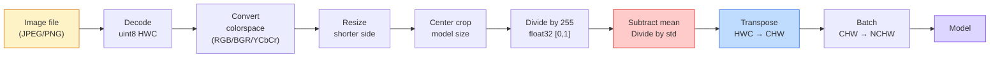
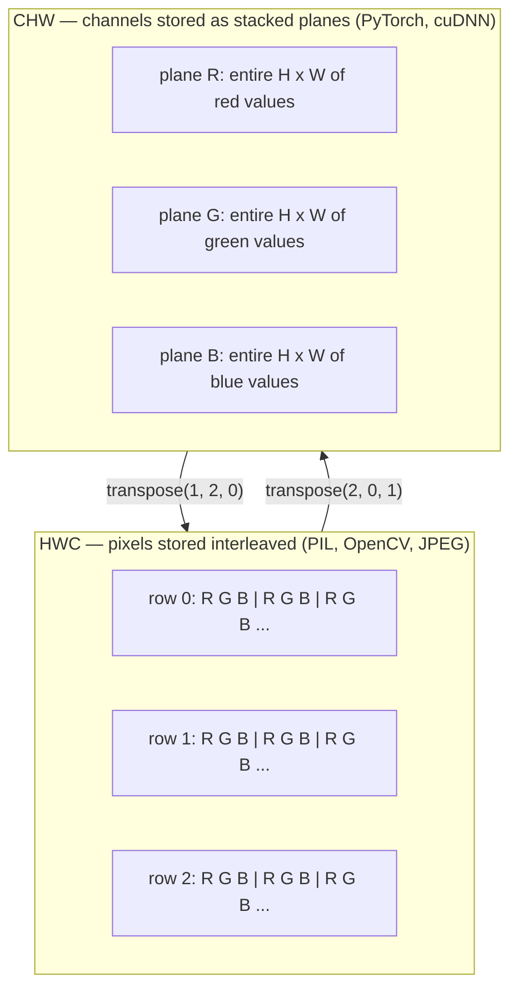

# Fundamentos de imagem  Pixels, canais, espaços de cores  Base de imagem  imagem, caminho e espaço de cores

> Uma imagem é um tensor de amostras de luz.

> **【中文解读】**O modelo de imagem é um conjunto de quantidades de fotos de imagem de luz. Seja o modelo de fotografia de celular, de auto-condução ou de GPT-4V, todos os modelos de imagem são originários deste fato básico.

**Type:** Build | **类型:** 动手
**Languages:** Python | **语言:** Python
**Prerequisites:** Phase 1 Lesson 12 (Tensor Operations), Phase 3 Lesson 11 (Intro to PyTorch) | **前置知识:** Phase 1 Lesson 12（张量运算）、Phase 3 Lesson 11（PyTorch 入门）
**Time:** ~45 minutes | **时间:** ~45 分钟

## Objetivos de aprendizagem

- Explique como uma cena contínua é discreta em pixels e por que as decisões de amostragem/quantização definem o teto em cada modelo a jusante
  Tradução do chinês: explicar como os cenários continuados são dispersos em imagens, e por que a tomada de decisões/quantificação determina os limites superiores de todos os modelos de baixa escala
- Leia, corte e inspecione imagens como matrizes NumPy e mude fluentemente entre layouts HWC e CHW
  Chinese: 中文翻译:读取、切片、检查图像的NumPy 数组表示,并自如切换在HWC和CHW布局之间
- Converte entre RGB, escala de cinza, HSV e YCbCr e justifique por que cada espaço de cores existe
  Tradução em chinês: entre RGB、灰度、HSV e YCbCr, e explica a razão para a existência de cada tipo de espaço de cores
- Aplicar pré-processamento a nível de píxeles (normalizar, padronizar, redimensionar, primeiro canalizado) exatamente como os modelos de visão PyTorch pré-treinados esperam
  Tradução do inglês para tradução do inglês: 精确按照预训练 PyTorch 视觉模型的期望做像素级预处理(归一化、标准化、缩放、通道前置)

## O problema é o problema da introdução

Cada artigo que ler, cada peso pré-treinado que baixar, cada API de visão que chamar assume uma codificação específica da entrada.`uint8`imagem onde o modelo quer `float32`E ainda vai correr  e silenciosamente produzir lixo. Alimenta BGR para uma rede treinada em RGB e precisão desabar em dez pontos. Entregue um modelo de canais - última entrada quando espera canais - primeiro e a primeira camada conv trata a altura como um canal de recursos. Nada disso lança um erro. Isso só arruina suas métricas e você passa uma semana à procura de um bug que vive na forma como carregou o arquivo.

> Cada artigo que você vai ler, cada teste de peso, cada API de vídeo que você vai baixar, todos eles assumem um código de entrada específico.`uint8`Imagens transmitidas à necessidade`float32`O modelo ainda funciona, mas em silêncio produz resultados de lixo. Colocar o BGR em uma rede treinada no RGB, taxa de precisão de queda de dez pontos por cento. Colocar o canal na entrada final e transmitir o canal de espera.

> **【中文解读】**É o "bug de ocultação" mais comum no engenharia de visão de computador. O modelo não pode ser informado de erro, mas o resultado é totalmente errado. Por exemplo, o BGR (OpenCV) como RGB (PyTorch) pode ser usado para o modelo, o índice de precisão pode cair 10 pontos por cento.

Uma convolução não é complicada uma vez que você sabe o que está deslizando. A parte difícil é que "uma imagem" significa coisas diferentes para uma câmera, um decodificador JPEG, PIL, OpenCV, torchvision e um núcleo CUDA. Cada pilha tem sua própria ordem de eixo, intervalo de byte e convenção de canal. Um engenheiro de visão que não pode manter esses navios retos quebrados pipelines.

> Uma vez que você sabe o que o volume está a fazer, não é complexo. A parte difícil está na "imagem" de uma máquina de câmbio, JPEG, decodificador, PIL, OpenCV, torchvision e CUDA, que significa coisas diferentes. Cada técnica tem sua própria ordem de eixos, alcance de caracteres e padrões de passagem. Um engenheiro de visão que não consegue resolver isso só fornece uma linha de fluxo defeituosa.

Esta lição fixa a base para que o resto da fase possa construir sobre ela. No final você saberá o que é um pixel, por que há três números por pixel em vez de um, o que "normalizar com estatísticas da ImageNet" realmente faz, e como se mover entre os dois ou três layouts que cada outra lição nesta fase assumirá.

> Esta é a base real para que o resto do curso da fase possa ser construído sobre isso. Depois de concluído, você saberá o que é um imagem, por que cada imagem tem três números em vez de um, o que foi feito "com a integração estatística da ImageNet" e como trocar entre as duas e três configurações que são presumidas no resto do curso.

> **【拓展：数据标注与质量】** Visual task's effect highly depends on label data quality──Label Studio、CVAT is the mainstream marking tool──In industrial scenarios, proactive learning(Active Learning) pode reduzir o custo de marcação: modelo contra um pedido de amostra não definido marcação artificial, identidade de amostra auto-marcação──

## O conceito central.

### O oleoduto completo de pré-processamento em um olhar.

Cada sistema de visão de produção é a mesma sequência de transformações reversíveis.

> Cada sistema de produção de nível visual é o mesmo reversível de mudança de sequência.



As duas caixas vermelhas e azuis são onde 80% das falhas silenciosas vivem: falta de padronização e layout errado.

> Os dois quadrados vermelhos e azuis são 80% do silêncio que falha: falta de padronização e erro de estruturação.

> **【中文解读】**80% dos erros de ocultação concentram-se em dois aspectos: 1) não se faz padronização, 2) a data layout está erroneamente organizada, 2) o projeto real é o mais confiável.

### Um pixel é uma amostra, não um quadrado.

Um sensor de câmera conta os fótons que pousam em uma grade de pequenos detectores. Cada detector integra luz por uma fração de segundo e emite uma tensão proporcional ao número de fótons que o atingem. O sensor então discretece essa tensão em um número inteiro. Um detector torna-se um píxel.

> O sensor de informação é um dispositivo de informação que é capaz de fazer a informação sobre a quantidade de luz em um pequeno sensor.

```
Continuous scene                 Sensor grid                     Digital image
(infinite detail)                (H x W detectors)               (H x W integers)

    ~~~~~                        +--+--+--+--+--+                 210 198 180 155 120
   - Não, não, não.
  - - - - - - - - - - - - - - - - - - - - - - - - - - - - - - - - - - - - - - - - - - - - - - - - - - - - - - - - - - - - - - - - - - - - - - - - - - - - - - - - - - - - - - - - - - - - - - - - - - - - - - - - - - - - - - - - - - - - - - - - - - - - - - - - - - - - - - - - - - - - - - - - - - - - - - - - - - - - - - - - - - - - - - - - - - - - - - - - - - - - - - - - - - - - - - - - - - - - - - - - - - - - - - - - - - - - - - - - - - - - - - - - - - - - - - - - - - - - - - - - - - - - - - - - - - - - - - - - - - - - - - - - - - - - - - - - - - - - - - - - - - - - - - - - - - - - - - - - - - - - - - - - - - - - - - - - - - - - - - - - - - - - - - - - - - - - - - - - - - - - - - - - - - - - - - - - - - - - - - - - - - - - - - - - - - - - - - - - - - - - - - - - - - - - - - - - - - - - - - - - - - - - - - - - - - - - - - - - - - - - - - - - - - - - - - - - - - - - - - - - - - - - - - - - - - - - - - - - - - - - - - - - - - - - - - - - - - - - - - - - - - - - - - - - - - - - - - - - - - - - - - - - - - - - - -
   ~~~~~                         |  |  |  |  |  |                 195 185 170 148 112
                                 +--+--+--+--+--+                 188 180 165 145 108
```

Nesta etapa, acontecem duas escolhas e fixam o teto em tudo o que está abaixo do rio:

- **Spatial sampling**O que acontece é que o sistema de detecção de dados é um sistema de detecção de dados que determina quantas unidades de detecção por grau da cena.
  O espaço também é um espaço de grande quantidade de dados.
- **Intensity quantization**O que é um sistema de visualização de tensão de 8 bits é um sistema de visualização de 256 níveis, que é padrão para a visualização.
  O poder de determinação da tensão é dividido em 8 bits, dando 256 classes, é um padrão de demonstração.

Um pixel não é um quadrado colorido com área. É uma única medida. Quando você redimensionar ou girar, você está reanalisar essa grade de medição.

> A imagem não é um quadrado de cores com área. É uma medida. Quando você se encolhe ou gira, você está pesquisando a rede de medida.

> **【中文解读】**O imagem não é um pequeno bloco quadrado, mas um ponto de amostra de um sensor num determinado espaço. Quando a imagem se enfraquece ou gira, o conceito é especialmente importante em imagens médicas (como CT, MRI) e HDR.

### Porque três canais?

Um detector conta fótons em todo o espectro visível  que é escala de cinza. Para obter cor, o sensor cobre a grade com um mosaico de filtros vermelhos, verdes e azuis. Depois de demosaicado, cada localização espacial tem três enteros: a resposta do detector vermelho-filtrado, verde-filtrado e azul-filtrado perto. Esses três enteros são o triplo RGB de um píxel.

> Para obter cor, os sensores usam o vermelho, verde, azul, e depois de cada espaço, cada posição tem três números inteiros: o vermelho, verde e azul.

```
One pixel in memory:

    (R, G, B) = (210, 140, 30)   <- reddish-orange

An H x W RGB image:

    shape (H, W, 3)     stored as   H rows of W pixels of 3 values
                                    each in [0, 255] for uint8
```

Os três não são mágicos. As câmeras de profundidade adicionam um canal Z. Os satélites adicionam bandas infravermelhas e ultravioletas. Os scans médicos geralmente têm um canal (ray X, CT) ou muitos (hiperspectro). O número de canais é o último eixo; as camadas de conveção aprendem a misturar-se através dele.

> Não é magia. A profundidade da fotografia aumenta Z.

> **【拓展：多通道图像】**As imagens de satélite de distância geralmente têm ondas extra de luz vermelha, ultravioleta, etc. (dois espectros/alto espectro); CT médica  apenas um canal; imagens de profundidade (como Kinect, iPhone LiDAR) aumentam a profundidade do canal D. Estas imagens de vários canais têm ampla aplicação em monitoramento agrícola, diagnóstico médico e condução automática.

### Duas convenções de layout: HWC e CHW.

O mesmo tensor, duas ordens, cada biblioteca escolhe uma.

> Com uma quantidade, duas categorias.

```
HWC (height, width, channels)           CHW (channels, height, width)

   W ->                                    H ->
  +-----+-----+-----+                     +-----+-----+
H |R G B|R G B|R G B|                   C |R R R R R R|
| +-----+-----+-----+                   | +-----+-----+
v |R G B|R G B|R G B|                   v |G G G G G G|
  +-----+-----+-----+                     +-----+-----+
                                          |B B B B B B|
                                          +-----+-----+

   PIL, OpenCV, matplotlib,              PyTorch, most deep learning
   almost every image file on disk       frameworks, cuDNN kernels
```

O CHW existe porque os kernels de convolução deslizam através de H e W. Mantendo o eixo do canal primeiro significa que cada kernel vê um plano 2D contiguo por canal, que vectoriza limpo.

> O CHW 之所以存在,是因为卷积核在H 和 W 上滑动──保持通道轴在最前面意思是每个核看到的是每个通道的一个连续2D平面,可以干净地向量化──磁盘格式保持HWC 是因为那匹配传感器扫描线的输出方式──

> **【中文解读】**HWC(高×宽×通道) é o formato padrão de PIL、OpenCV 等库, também é o formato de armazenamento de imagens em disco.

A conversão de uma linha você vai digitar mil vezes:

> Você vai fazer um único transmissão de mil vezes:

```
img_chw = img_hwc.transpose(2, 0, 1)      # NumPy
img_chw = img_hwc.permute(2, 0, 1)        # PyTorch tensor
```

Layout de memória, visualizado:

> Inserção de dados:



### Intervalo de byte e dtype.

São três as convenções dominantes:

> Três tipos de posição dominante:

| Convention | dtype | Range | Where you see it |
|------------|-------|-------|------------------|
| Raw | `uint8` | [0, 255] | Files on disk, PIL, OpenCV output |
| Normalized | `float32` | [0.0, 1.0] | After `img.astype('float32') / 255` |
| Standardized | `float32` | roughly [-2, +2] | After subtracting mean and dividing by std |

As redes de convolução foram treinadas em entradas padronizadas.`mean=[0.485, 0.456, 0.406]`- Não .`std=[0.229, 0.224, 0.225]`são a média aritmética e o desvio padrão dos três canais sobre o conjunto completo de treinamento ImageNet, calculado em [0, 1] pixels normalizados.`uint8`O problema é que o sistema de visão aplicada não é capaz de fazer a diferença entre o sistema de visão aplicada e o sistema de visão aplicada.

> 卷积网络 é um processo de estandarização de dados.`mean=[0.485, 0.456, 0.406]`- Não.`std=[0.229, 0.224, 0.225]`É todo o treinamento da ImageNet ŕ três canais de cálculo média e diferença de padrão, em [0, 1] ŕ ŕ ŕ ŕ ŕ ŕ ŕ ŕ ŕ ŕ ŕ ŕ ŕ ŕ ŕ ŕ ŕ ŕ ŕ ŕ ŕ ŕ ŕ ŕ ŕ ŕ ŕ ŕ ŕ ŕ ŕ ŕ ŕ ŕ ŕ ŕ   ŕ                                                                                                                                                                                                                                                                                                                                                                                                                     `uint8` O modelo de espera de padronização de valores é o mais comum de falhas de silêncio em visão aplicada.

> **【中文解读】**三种数据范围:(1) 文件/PIL/OpenCV 的原始输出;(2) float32 [0,1] 归化后;(3) float32 ≈[-2,+2]  ImageNet 标准化后──把 uint8 直接给期望标准化输入的模型,是最常见的"静默失败"──ImageNet 平均值和标准差是整个训练集预测出来的,几乎所有训练模型都使用了这个组数──

### Espaços de cores e por que existem

O RGB é o formato de captura, mas nem sempre é a representação mais útil para um modelo.

> O RGB é um formato de captura, mas não é sempre a representação mais útil para o modelo.

```
 RGB               HSV                       YCbCr / YUV

 R red             H hue (angle 0-360)       Y luminance (brightness)
 G green           S saturation (0-1)        Cb chroma blue-yellow
 B blue            V value/brightness (0-1)  Cr chroma red-green

 Linear to         Separates color from      Separates brightness from
 sensor output     brightness. Useful for    color. JPEG and most video
                   color thresholding, UI    codecs compress the chroma
                   sliders, simple filters   channels harder because the
                                             human eye is less sensitive
                                             to chroma detail than to Y.
```

Para a maioria das redes modernas, alimentamos RGB.

> Para a maioria das modernas CNN, você entra RGB. Você encontra outros espaços de cores nos seguintes cenários:

- **HSV** código de currículo clássico, segmentação baseada em cores, equilíbrio de branco.
  Tradução do inglês: Classical CV 代码、基于颜色的分分、白平衡──
- **YCbCr** leitura de internos JPEG, canalizações de vídeo, modelos de super resolução que operam apenas em Y.
  Tradução do inglês para japonês:读取 JPEG 内部结构、视频流水线、仅在Y通道上操作的超分辨率模型──
- **Grayscale** OCR, modelos de documentos, qualquer caso em que a cor seja variável de incômodo em vez de sinal.
  OCR, o modelo de arquivo, a cor é qualquer cenário de perturbação de variação e não de sinal.

A escala de cinza da RGB é uma soma ponderada, não uma média, porque o olho humano é mais sensível ao verde do que ao vermelho ou ao azul:

> Do RGB 转灰度 é um valor aumentado, não um valor médio, pois o olho humano é mais sensível ao verde do que ao vermelho ou ao azul:

```
Y = 0.299 R + 0.587 G + 0.114 B       (ITU-R BT.601, the classic weights)
```

### Relação de aspecto, redimensionamento e interpolação 宽高比 缩放与插值

Cada modelo tem um tamanho de entrada fixo (224x224 para a maioria dos classificadores ImageNet, 384x384 ou 512x512 para os detectores modernos).

> Cada modelo tem uma entrada fixa de tamanho. A maioria das imagens da imagem é de 224x224, os testadores modernos são de 384x384 ou 512x512.

- **Resize shorter side, then center crop**Preserva a relação de aspecto, descarta uma faixa de pixels de borda.
  Tradução do inglês: 缩放短边然后中心裁剪标准 ImageNet 做法──保持宽高比,丢弃一条边像素──
- **Resize and pad**- Preserva a relação de aspecto e cada pixel, adiciona barras pretas.
  Tradução em chinês:缩放并填充保持宽高比和每个像素,添加黑边──检测和OCR的标准做法──
- **Resize directly to target**É barato, distorce a geometria, perfeito para muitas tarefas de classificação.
  Tradução do inglês para tradução do inglês: direct shrinking to target size拉伸图像──成本低,扭曲几何形形,但对许多分类任务足──

O método de interpolação determina como os pixels intermediários são calculados quando a nova grade não se alinha com a antiga:

> 插值方法 decide how to calculate middle pixels when new net格 and old net格 are not in line with the old net格

```
Nearest neighbour     fastest, blocky, only choice for masks/labels
Bilinear              fast, smooth, default for most image resizing
Bicubic               slower, sharper on upscaling
Lanczos               slowest, best quality, used for final display
```

Regra geral: bilinear para treinamento, bicubic ou lanczos para ativos que você vai olhar, mais próximo para qualquer coisa que contém ID de classe inteira.

> 體驗法则: treinar com duas linhas, demonstrar com duas ou três vezes ou lanczos, contendo um número inteiro de ID de classe com o vizinho mais próximo.

> **【中文解读】**缩放时的插值方法选择:近邻 (近邻) 速度最快但会产生, apenas para ocultar/标签图;双线性 (双线性) 又快又平滑,是训练时的默认选择;双三次 (双立)  (双立) 慢但放大时更清;Lanczos 最慢但质量最好──经验法则:训练用双线,展示用双立/lanczos,标签用近距离──

> **【拓展：工业部署中的视觉系统】**No implementar industrial real, o modelo visual precisa considerar a possibilidade de atrasos, modelos de tamanho, dispositivos de margem, etc. TensorRT, ONNX Runtime, OpenVINO são ferramentas de aceleração de cálculo de uso comum.
```figure
conv-output-size
```

## Construí-lo.

### Passo 1: Construa um tensor de imagem e inspecione sua forma.

Comece com uma imagem sintética determinista para que o primeiro laboratório seja executado offline com apenas NumPy. A decodificação de arquivos é um limite separado: uma vez que um decodificador JPEG ou PNG retorna bytes RGB, cada operação tensorial abaixo é a mesma.

> A partir de uma imagem de síntese de determinação, deixe a primeira experiência apenas NumPy para ser capaz de operar offline.

```python
import numpy as np

def synthetic_rgb(h=128, w=192, seed=0):
    rng = np.random.default_rng(seed)
    yy, xx = np.meshgrid(np.linspace(0, 1, h), np.linspace(0, 1, w), indexing="ij")
    r = (np.sin(xx * 6) * 0.5 + 0.5) * 255
    g = yy * 255
    b = (1 - yy) * xx * 255
    rgb = np.stack([r, g, b], axis=-1) + rng.normal(0, 6, (h, w, 3))
    return np.clip(rgb, 0, 255).astype(np.uint8)

arr = synthetic_rgb()

print(f"type:   {type(arr).__name__}")
print(f"dtype:  {arr.dtype}")
print(f"shape:  {arr.shape}     # (H, W, C)")
print(f"min:    {arr.min()}")
print(f"max:    {arr.max()}")
print(f"pixel at (0, 0): {arr[0, 0]}")
```

Produção esperada: `shape: (H, W, 3)`- Não .`dtype: uint8`, alcance`[0, 255]`É a representação canónica decodificada, quer os bytes vêm de uma câmera, um decodificador de imagem ou um gerador sintético.

> 预期输出:`shape: (H, W, 3)`- Não.`dtype: uint8`Escala`[0, 255]` É o que diz a norma de decodificação, quer o caracteres venham da máquina, quer do decodificador de imagem ou do gerador de composição

### Passo 2: Dividir os canais e reordenar o layout.

Retire R, G, B separadamente, e depois converta-os de HWC para CHW para PyTorch.

> 分別提取 R、G、B, então transformar HWC 转换为 CHW 以供 PyTorch 使用──

```python
R = arr[:, :, 0]
G = arr[:, :, 1]
B = arr[:, :, 2]
print(f"R shape: {R.shape}, mean: {R.mean():.1f}")
print(f"G shape: {G.shape}, mean: {G.mean():.1f}")
print(f"B shape: {B.shape}, mean: {B.mean():.1f}")

arr_chw = arr.transpose(2, 0, 1)
print(f"\nHWC shape: {arr.shape}")
print(f"CHW shape: {arr_chw.shape}")
```

Três planos em escala de cinza, um por canal. CHW apenas reordena os eixos; nenhuma cópia de dados é estritamente necessária quando o layout da memória o permite.

> Três planos de graça, por meio de um. O CHW é apenas um reordem de dados; quando o arquivo interno é permitido, não é exigido copiar dados.

### Passo 3: Conversões em escala cinzenta e HSV .

Escala de cinza ponderada, depois manual RGB-HSV.

> Aumente o poder de procura e a graça, e depois realize RGB 转 HSV.

```python
def rgb_to_grayscale(rgb):
    weights = np.array([0.299, 0.587, 0.114], dtype=np.float32)
    return (rgb.astype(np.float32) @ weights).astype(np.uint8)

def rgb_to_hsv(rgb):
    rgb_f = rgb.astype(np.float32) / 255.0
    r, g, b = rgb_f[..., 0], rgb_f[..., 1], rgb_f[..., 2]
    cmax = np.max(rgb_f, axis=-1)
    cmin = np.min(rgb_f, axis=-1)
    delta = cmax - cmin

    h = np.zeros_like(cmax)
    mask = delta > 0
    argmax = np.argmax(rgb_f, axis=-1)
    rmax = mask & (argmax == 0)
    gmax = mask & (argmax == 1)
    bmax = mask & (argmax == 2)
    h[rmax] = ((g[rmax] - b[rmax]) / delta[rmax]) % 6
    h[gmax] = ((b[gmax] - r[gmax]) / delta[gmax]) + 2
    h[bmax] = ((r[bmax] - g[bmax]) / delta[bmax]) + 4
    h = h * 60.0

    s = np.divide(delta, cmax, out=np.zeros_like(delta), where=cmax > 0)
    v = cmax
    return np.stack([h, s, v], axis=-1)

gray = rgb_to_grayscale(arr)
hsv = rgb_to_hsv(arr)
print(f"gray shape: {gray.shape}, range: [{gray.min()}, {gray.max()}]")
print(f"hsv   shape: {hsv.shape}")
print(f"hue range: [{hsv[..., 0].min():.1f}, {hsv[..., 0].max():.1f}] degrees")
print(f"sat range: [{hsv[..., 1].min():.2f}, {hsv[..., 1].max():.2f}]")
print(f"val range: [{hsv[..., 2].min():.2f}, {hsv[..., 2].max():.2f}]")
```

Hue aparece em graus, saturação e valor em [0, 1].`hsv_full`Convenção.

> Coloridade em quantidade de saída, 和度和明度在 [0, 1] 范围内── isto é comparado com o OpenCV `hsv_full`约定一致.

### Passo 4: Normalize, padronize e inverte.

Vai de bytes brutos para o tensor exato que um modelo pré-treinado da ImageNet espera, e depois volta.

> Desde o início do tempo até o início do tempo, a imagem é de um modo muito diferente.

```python
mean = np.array([0.485, 0.456, 0.406], dtype=np.float32)
std = np.array([0.229, 0.224, 0.225], dtype=np.float32)

def preprocess_imagenet(rgb_uint8):
    x = rgb_uint8.astype(np.float32) / 255.0
    x = (x - mean) / std
    x = x.transpose(2, 0, 1)
    return x

def deprocess_imagenet(chw_float32):
    x = chw_float32.transpose(1, 2, 0)
    x = x * std + mean
    x = np.clip(x * 255.0, 0, 255).astype(np.uint8)
    return x

x = preprocess_imagenet(arr)
print(f"preprocessed shape: {x.shape}     # (C, H, W)")
print(f"preprocessed dtype: {x.dtype}")
print(f"preprocessed mean per channel:  {x.mean(axis=(1, 2)).round(3)}")
print(f"preprocessed std  per channel:  {x.std(axis=(1, 2)).round(3)}")

roundtrip = deprocess_imagenet(x)
max_diff = np.abs(roundtrip.astype(int) - arr.astype(int)).max()
print(f"roundtrip max pixel diff: {max_diff}    # should be 0 or 1")
```

A média por canal deve ser próxima a zero, std próxima a um.`transforms.Normalize`A chamada está a fazer-se debaixo do capô.

> O valor médio de cada passagem deve ser próximo de zero, o padrão de diferença próximo de um.`transforms.Normalize`- Não. - Não.

### Passo 5: Redimensionar a partir do zero.

As rodadas vizinhas mais próximas cada coordenada de saída para um pixel fonte. Interpolação bilinear encontra os quatro pixel circundantes e mistura-os por distância. Ambas as implementações abaixo usam coordenadas alinhadas com o ponto final para que os primeiros e últimos pixel fonte permaneçam fixos.

> Recentemente, cada vizinho de saída coloca quatro quadros em uma imagem-fonte. O valor de inserção binária encontra quatro imagens ao redor e em função da distância.

```python
def resize_coordinates(source_length, target_length):
    if target_length == 1:
        return np.zeros(1, dtype=np.float32)
    return np.linspace(0, source_length - 1, target_length, dtype=np.float32)

def nearest_resize(image, target_height, target_width):
    y = np.rint(resize_coordinates(image.shape[0], target_height)).astype(int)
    x = np.rint(resize_coordinates(image.shape[1], target_width)).astype(int)
    return image[y[:, None], x[None, :]]

def bilinear_resize(image, target_height, target_width):
    y = resize_coordinates(image.shape[0], target_height)
    x = resize_coordinates(image.shape[1], target_width)
    y0 = np.floor(y).astype(int)
    x0 = np.floor(x).astype(int)
    y1 = np.minimum(y0 + 1, image.shape[0] - 1)
    x1 = np.minimum(x0 + 1, image.shape[1] - 1)
    wy = (y - y0)[:, None, None]
    wx = (x - x0)[None, :, None]

    source = image.astype(np.float32)
    top = source[y0[:, None], x0[None, :]] * (1 - wx)
    top += source[y0[:, None], x1[None, :]] * wx
    bottom = source[y1[:, None], x0[None, :]] * (1 - wx)
    bottom += source[y1[:, None], x1[None, :]] * wx
    result = top * (1 - wy) + bottom * wy
    return np.clip(np.rint(result), 0, 255).astype(image.dtype)

target_height = arr.shape[0] * 3
target_width = arr.shape[1] * 3
nearest = nearest_resize(arr, target_height, target_width)
bilinear = bilinear_resize(arr, target_height, target_width)

def local_roughness(x):
    gy = np.diff(x.astype(float), axis=0)
    gx = np.diff(x.astype(float), axis=1)
    return float(np.abs(gy).mean() + np.abs(gx).mean())

for name, out in [("nearest", nearest), ("bilinear", bilinear)]:
    print(f"{name:>8}  shape={out.shape}  roughness={local_roughness(out):6.2f}")
```

O pixel mais próximo tem o maior resultado em rugosidade, porque mantém bordas duras. Bilinear é mais liso porque cada novo pixel mistura duas posições em cada eixo. O companheiro executável estende a mesma ideia separável para quatro vizinhos por eixo com um núcleo cúbico Catmull-Rom, e então imprime todos os três resultados sem uma biblioteca de imagens.

> O recém-vivido da área de grosseira é mais elevado, pois mantém a margem dura. A bi-linearidade é mais plana, pois cada imagem nova mistura duas posições em cada eixo. O código de suporte operacional expande o mesmo caminho de separação para cada eixo.

> **【中文解读】**Novo edição 5 步从"调 PIL 的尺寸"改为"从零实现近邻与双线性"这是Build It 精神的归归:先用纯NumPy理解插值的坐标映射(`np.linspace`端点对齐 + 索引集),再去看库的封装──配套的`code/main.py`Também realizou Catmull-Rom 双三次核, usando o mesmo conjunto de poder de separação de peso de impressão mais próximo/bilinear/bicubo 三种结果对比──

## Use-o em prática.

PyTorch realiza as mesmas operações em tensores batchados e conscientes do dispositivo. O código abaixo redimensionou o lado mais curto, tomou uma colheita central, padronizou cada canal e produziu o tensor NCHW que um modelo pré-treinado espera.

> PyTorch em massa ∞ em quantidade de dispositivos de percepção executar a mesma operação ∞ em baixo código reduzido em curto limite ∞ em corte de centro ∞ em padronização de cada canal, e produzir ∞ em quantidade de NCHW esperado no modelo de treinamento previo ∞

```python
import torch
import torch.nn.functional as F

image_hwc = torch.from_numpy(synthetic_rgb(256, 320))
batch = image_hwc.permute(2, 0, 1).unsqueeze(0).float() / 255.0

height, width = batch.shape[-2:]
scale = 256 / min(height, width)
resized_height = round(height * scale)
resized_width = round(width * scale)
batch = F.interpolate(
    batch,
    size=(resized_height, resized_width),
    mode="bilinear",
    align_corners=False,
    antialias=True,
)

top = (resized_height - 224) // 2
left = (resized_width - 224) // 2
batch = batch[:, :, top:top + 224, left:left + 224]

mean = torch.tensor([0.485, 0.456, 0.406]).view(1, 3, 1, 1)
std = torch.tensor([0.229, 0.224, 0.225]).view(1, 3, 1, 1)
batch = (batch - mean) / std

print(f"tensor dtype: {batch.dtype}")
print(f"batched shape: {tuple(batch.shape)}")
print(f"per-channel mean: {batch.mean(dim=(0, 2, 3)).tolist()}")
print(f"per-channel std:  {batch.std(dim=(0, 2, 3)).tolist()}")
```

Quatro passos, nesta ordem exata: converter bytes para flutuar e trocar HWC para NCHW, redimensionar o lado mais curto para 256, tomar uma colheita central de 224x224, depois subtrair a média ImageNet e dividir por seu desvio padrão.

> Quatro passos, em ordem precisa: transformar o字节 em浮点并将HWC 换成NCHW, reduzir o短边缩至256, cortar o centro de 224x224, e depois subtrair o ImageNet 平均值并除其标准差──颠倒这个顺序会静默改变模型接收的内容──

> **【中文解读】**Nova edição "Uz Frameworke Implement" de`torchvision.transforms`- Não .`torch`+ `torch.nn.functional`Permute→unpress 换布局、`F.interpolate`缩放短边(注意 `antialias=True`Com`align_corners=False`Estes dois níveis de produção (defórmadas) 张量切片做中心剪剪,广播减平均值除标准差── isso deixa você ver`transforms.Compose`                                                                                                                                                                                                                                                              

## Envia-o . Entrega e produção .

Esta lição produz:

> 本课产出:

- `outputs/prompt-vision-preprocessing-audit.md` um aviso que transforma qualquer cartão modelo ou cartão de conjunto de dados numa lista de verificação das invariantes exatas de pré-processamento que uma equipa deve respeitar.
  Tradução:`outputs/prompt-vision-preprocessing-audit.md` Um modelo arbitrário ou conjunto de dados de cartão de transformação em equipe deve cumprir o pre-processamento invariable lista de sugestões.
- `outputs/skill-image-tensor-inspector.md` uma habilidade que, dada qualquer tensor ou matriz em forma de imagem, relata o dtype, layout, range e se parece bruto, normalizado ou padronizado.
  Tradução:`outputs/skill-image-tensor-inspector.md` Uma habilidade: determinar a quantidade ou a matriz de qualquer imagem, relatar o seu rango de valor, bem como parecer primordial ou estandarizado.

## Exercícios.

> **【中文解读】**Practicação de temas de fácil/médio/difícil  3o dificuldade de passagem  Recomendação de completar pelo menos Praça de nível médio Classe difícil  Adaptação a pesquisa profunda ou preparação para o encontro 

1. **(Easy)**Criar um RGB 2x2 `uint8`Converte HWC para CHW e volta, imprima as duas formas e prova que a viagem de ida e volta preserva todos os valores.
   Chinese: Crear um contendo quatro cores diferentes 2x2 RGB `uint8`Num grupo. Em HWC e CHW, entre os valores de volta e volta, imprimir duas formas, e provar que os valores de volta e volta mantêm-se em cada valor.
2. **(Medium)**Escreva .`standardize(img, mean, std)`e o seu inverso que juntos passam um `roundtrip_max_diff <= 1`As suas funções devem funcionar em uma única imagem na HWC e em um lote na NCHW com a mesma chamada.
   Tradução: 编写`standardize(img, mean, std)` e sua função oposta, requisito em qualquer uint8  imagem sobre o `roundtrip_max_diff <= 1`测试,且同调用既支持单张图(HWC) também支持批量(NCHW)。
3. **(Hard)**Pegue um tensor de 3 canais e execute-o através de um conv 1x1 que aprende uma mistura ponderada de RGB em um único canal em escala de cinza. Inicialize os pesos para `[0.299, 0.587, 0.114]`, congelar-los, e verificar a saída coincide com o seu manual `rgb_to_grayscale`Que outras transformações clássicas de espaço de cores podem ser escritas como 1x1 convulsões?
   Tradução do inglês: Get a Three-way ImageNet  標準化张量,送入一個把 RGB 加权混合成单通道灰度的 1x1卷积──把权重初始化为`[0.299, 0.587, 0.114]`Não é necessário que o produto seja utilizado para a produção de produtos.`rgb_to_grayscale`Diferença em flows de pontos de erro em pensamento: quais outras mudanças clássicas de espaço de cores podem ser escritas em 1x1 volumes?

## Termos-chave .

| Term | What people say | What it actually means |
|------|----------------|----------------------|
| Pixel | "A coloured square" | One sample of light intensity at one grid location — three numbers for colour, one for grayscale |
| Channel | "The colour" | One of the parallel spatial grids stacked into an image tensor; last axis in HWC, first in CHW |
| HWC / CHW | "The shape" | Axis orderings for an image tensor; disk and PIL use HWC, PyTorch and cuDNN use CHW |
| Normalize | "Scale the image" | Divide by 255 so pixels live in [0, 1] — necessary but not sufficient |
| Standardize | "Zero-center" | Subtract mean and divide by std per channel so the input distribution matches what the model was trained on |
| Grayscale conversion | "Average the channels" | A weighted sum with coefficients 0.299/0.587/0.114 that matches human luminance perception |
| Interpolation | "How resize picks pixels" | The rule that decides output values when the new grid does not align with the old one — nearest for labels, bilinear for training, bicubic for display |
| Aspect ratio | "Width over height" | The ratio that distinguishes "resize and pad" from "resize and stretch" |

> 术语对照:Pixel=像素、Channel=通道、Normalize=归一化、Standardize=标准化、Grayscale conversion=灰度转换、Interpolation=插值、Aspect ratio=宽高比──完整中文释义见 zh.md 的术语表──

## Mais leitura 延伸阅读

- [Charles Poynton — A Guided Tour of Color Space](https://poynton.ca/PDFs/Guided_tour.pdf) o tratamento técnico mais claro de por que existem tantos espaços de cores e quando cada um deles importa
  Tradução do inglês:Charles Poynton色彩空间导览解释为什么有如此多的色彩空间、各自何时重要最清晰技术论述──
- [PyTorch Vision Transforms Docs](https://pytorch.org/vision/stable/transforms.html) o conjunto completo de transformações que você realmente compor em produção
  Tradução do original:PyTorch Vision Transforms 文档生产环境中你真正要组合的完整变换流水线──
- [How JPEG Works (Colt McAnlis)](https://www.youtube.com/watch?v=F1kYBnY6mwg) uma visão acentuada da submuestragem de croma, DCT, e por que o JPEG codifica YCbCr em vez de RGB
  O JPEG é como trabalhar em um processo de desenvolvimento de dados e de dados.
- [ImageNet Preprocessing Conventions (torchvision models)](https://pytorch.org/vision/stable/models.html) a fonte da verdade para `mean=[0.485, 0.456, 0.406]`E porque é que todos os modelos no zoológico esperam isso?
  中文翻译:torchvision 模型的 ImageNet 预处理约定`mean=[0.485, 0.456, 0.406]`A fonte de autoridade, e por que todo o modelo o usa.
