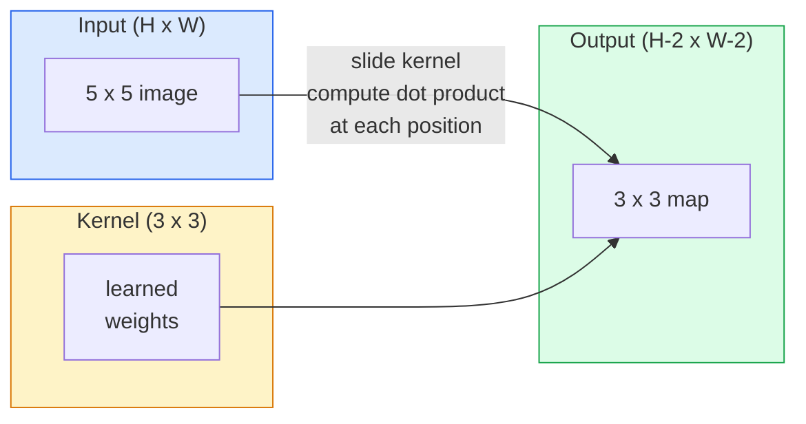
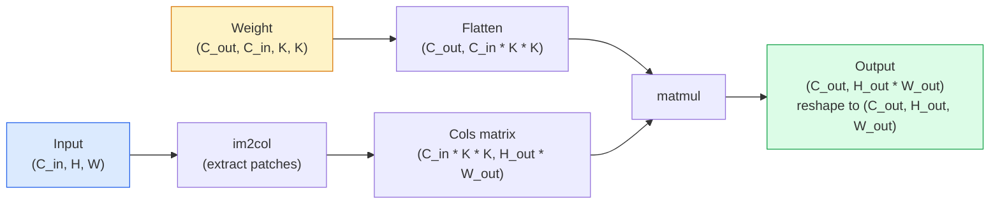

# Convolções do zero para realizar o envolvimento.

> Uma convolução é uma pequena camada densa que desliza através de uma imagem, compartilhando os mesmos pesos em todos os locais.

> **【中文解读】**O rollover é uma "máquina de ligação completa de pequenos e pequenos movimentos" com o mesmo grupo de peso em cada posição da imagem. Isso nos dá duas características fundamentais: plano de transferência e variação.

**Type:** Build | **类型:** 动手
**Languages:** Python | **语言:** Python
**Prerequisites:** Phase 3 (Deep Learning Core), Phase 4 Lesson 01 (Image Fundamentals) | **前置知识:** Phase 3（深度学习核心），Phase 4 Lesson 01（图像基础）
**Time:** ~75 minutes | **时间:** ~75 分钟

## Objetivos de aprendizagem

- Implementar a convolução 2D a partir do zero usando apenas o NumPy, incluindo a versão de ciclo aninhado e uma vectorização `im2col`versão
   Utilize NumPy                                                                                                                                                                                                                                                            
- Calcule o tamanho espacial de saída para qualquer combinação de tamanho de entrada, tamanho do kernel, enchimento e passo, e justifique o `(H - K + 2P) / S + 1`fórmula
   calcular qualquer entrada de grandeza 核大小 填充和步幅组合下输出尺寸, compreender fórmula `(H - K + 2P) / S + 1`
- Núcleos de design manual (edge, blur, sharpen, Sobel) e explicar por que cada um produz o padrão de ativações que faz
  Hand动设计核(边缘检测、模糊、化、Sobel), explicar por que cada tipo de núcleo produz um modo de ativar a resposta
- As convulsões de pilhas em um extrator de características e a ligação da profundidade da pilha ao tamanho do campo receptivo
  Compreender a profundidade da composição e a relação entre o tamanho e o sentimento

> **【中文解读】**O objetivo do aprendizado é listar as capacidades centrais que devem ser adquiridas após a conclusão do curso.


## O problema é o problema da introdução

Uma camada totalmente conectada em uma imagem RGB de 224x224 precisaria de 224 * 224 * 3 = 150.528 pesos de entrada por neurônio. Uma única camada oculta com 1.000 unidades já é de 150 milhões de parâmetros antes de aprender qualquer coisa útil. Pior ainda, essa camada não tem ideia de que um cão na parte superior esquerda e um cão na parte inferior direita são o mesmo padrão. Trata cada posição de pixel como independente, o que é exatamente errado para imagens: traduzir um gato por três pixels não deve forçar a rede a reaprender o conceito.

> Em 224x224 RGB imagens, todas as ligações em cada camada neuronal precisam de 224 * 224 * 3 = 150,528 de peso de entrada. Uma camada oculta de apenas 1.000 unidades já tem 1.5 bilhões de parâmetros antes de você aprender qualquer coisa útil. Pior ainda, essa camada não sabe que os cães no canto esquerdo e no canto inferior direito são o mesmo modelo.

> **【中文解读】**O processo de processamento de imagens de camadas completas tem dois problemas fatais: 1) Explosão de parâmetros  224x224  Cada neurônio da imagem precisa de 150.000 pesos; 2) Não há mudança de plano  Gato do canto superior esquerdo e Gato do canto inferior direito são considerados como modelos completamente diferentes 卷积通过参数共享 

As duas propriedades que um modelo de imagem precisa são **translation equivariance**(a saída muda quando a entrada muda) e **parameter sharing**As camadas densas não dão nada, a convolução dá-lhe ambos de graça.

> As duas características necessárias para um modelo de imagem são:**平移等变性**(entrada em movimento, saída também em movimento) e**参数共享**(O mesmo recurso de teste em todas as posições)

A convolução não foi inventada para aprendizagem profunda. É a mesma operação que alimenta a compressão JPEG, a borbulha de Gaussian na Photoshop, a detecção de borda na visão industrial e todos os filtros de áudio já enviados. A razão pela qual a CNNs dominou a ImageNet de 2012 a 2020 é que a convolução é o prévio correto para dados onde valores próximos estão relacionados e o mesmo padrão pode aparecer em qualquer lugar.

> O roll-out não foi inventado para aprendizagem profunda. É a unidade de JPEG compressão, Photoshop, High-Impability, Industrial Visual Edge Detection e a mesma operação de todos os aparelhos de onda. O CNN, que governou a ImageNet de 2012 a 2020, foi causado pelo roll-out relacionado com o valor próximo e pelo mesmo padrão que pode aparecer em qualquer lugar.

> **【拓展：CNN 的工业应用】**卷积并非深度学习发明的──JPEG 压缩、Photoshop 模糊、工业视觉边缘检测、音频波器都使用卷积── Em campo de IA, a CNN 驱动了自动驾驶中的目标检测(YOLO)、医学影像分析、人脸识别(FaceNet) e outras aplicações centrales──

## O conceito central.

### Um núcleo, deslizando. Um núcleo, deslizando.

Uma convolução 2D toma uma pequena matriz de peso chamada kernel (ou filtro), desliza-a através da entrada e em cada localização calcula a soma de produtos com elementos. Essa soma se torna um píxel de saída.

> 2D 卷积取一个称为核或波器的小权重矩阵,在输入上滑它,在每个位置计算每个元素乘积之和──这个和成为一个输出像素──



Um exemplo concreto 3x3 em uma entrada 5x5 (sem enchimento, passo 1):

> Em 5x5 输入上的具体 3x3示例(无填充,步幅 1):

```
Input X (5 x 5):                Kernel W (3 x 3):

  1  2  0  1  2                   1  0 -1
  0  1  3  1  0                   2  0 -2
  2  1  0  2  1                   1  0 -1
  1  0  2  1  3
  2  1  1  0  1

The kernel slides across every valid 3 x 3 window. Output Y is 3 x 3:

 Y[0,0] = sum( W * X[0:3, 0:3] )
 Y[0,1] = sum( W * X[0:3, 1:4] )
 Y[0,2] = sum( W * X[0:3, 2:5] )
 Y[1,0] = sum( W * X[1:4, 0:3] )
 ... and so on
```

Essa fórmula é a única.**shared weights, locality, sliding window**O resto é contabilidade.

> Então, eu sei.**共享权重、局部性、滑动窗口**就是全部思想──其他都是簿记──

> **【中文解读】**卷积的全部思想缩为三点:共享权重(同一组参数在所有位置复用) 局部性(每次只看一个小窗口) 滑动窗口(次次遍历所有位置) ⋅ Output Y de cada elemento é o núcleo e entrada de janelas de pontos积──

### Formulha de tamanho de saída.

Dado o tamanho espacial da entrada `H`, tamanho do núcleo `K`, empilhadeira`P`, passo `S`- Não .

```
H_out = floor( (H - K + 2P) / S ) + 1
```

Lembrem-se disso, vão calcular dezenas de vezes por arquitetura.

> Lembra-te desta fórmula.

> **【中文解读】**输出尺寸公式 `H_out = floor((H - K + 2P) / S) + 1`É o cálculo mais comum de qualquer construção da CNN. "O mesmo enchimento" indica que H_out = H(quando S=1 时), neste momento P = (K-1) /2, e é por isso que 3x3 核最流行它是最小的奇数核,有明确的中心点──

| Scenario | H | K | P | S | H_out | 中文说明 |
|----------|---|---|---|---|-------|--------|
| Valid conv, no padding | 32 | 3 | 0 | 1 | 30 | 无填充，尺寸缩小 |
| Same conv (preserves size) | 32 | 3 | 1 | 1 | 32 | 同填充，保持尺寸 |
| Downsample by 2 | 32 | 3 | 1 | 2 | 16 | 步幅2，下采样 |
| Pool 2x2 | 32 | 2 | 0 | 2 | 16 | 池化层 |
| Large receptive field | 32 | 7 | 3 | 2 | 16 | 大感受野 |

"O mesmo enchimento" significa escolher P para que H_out == H quando S == 1. Para K ímpar, que é P = (K - 1) / 2. É por isso que os núcleos 3x3 dominam  eles são o menor núcleo ímpar que ainda tem um centro.

### - A empurrar .

Sem um enchimento, cada convolução encolhe o mapa de características. A pilha 20 deles e sua imagem 224x224 torna-se 184x184, o que desperdiça o cálculo na fronteira e complica as conexões residuais que precisam de formas correspondentes.

>  sem preenchimento, cada volume reduzirá a sua característica                                                                                                                                                                                                                                                       

```
Zero padding (P = 1) on a 5 x 5 input:

  0  0  0  0  0  0  0
  0  1  2  0  1  2  0
  0  0  1  3  1  0  0
  0  2  1  0  2  1  0       Now the kernel can centre on pixel
  0  1  0  2  1  3  0       (0, 0) and still have three rows and
  0  2  1  1  0  1  0       three columns of values to multiply.
  0  0  0  0  0  0  0
```

Modos que encontram na prática: `zero`(mais comum), `reflect`(especular a borda, evitar fronteiras duras em modelos geracionais), `replicate`(Copia a borda), `circular`(enrolamento, utilizado em problemas toroidais).

> 实践中遇到的模式:`zero`(mais frequentemente)`reflect`(镜像边缘, evitar gerar um modelo de margem dura)`replicate`(Replicar em "Jardim")`circular`(Around, para questões de ambiente)

### Passo, passo.

O passo é o tamanho do passo do deslizamento. `stride=1`é o padrão. `stride=2`A rede de televisão digital (CNN) é uma rede de televisão que reduz a metade das dimensões espaciais e é a maneira clássica de desmontar dentro de uma CNN sem uma camada de pool separada.

> O passo é o passo do movimento.`stride=1`É um valor de referência.`stride=2`Para reduzir a dimensão do espaço, a CNN não usa uma camada de acumulação individual para realizar uma abordagem clássica em cada arquitetura moderna.

```
Stride 1 on a 5 x 5 input, 3 x 3 kernel:

  starts: (0,0) (0,1) (0,2)        -> output row 0
          (1,0) (1,1) (1,2)        -> output row 1
          (2,0) (2,1) (2,2)        -> output row 2

  Output: 3 x 3

Stride 2 on the same input:

  starts: (0,0) (0,2)              -> output row 0
          (2,0) (2,2)              -> output row 1

  Output: 2 x 2
```

### Múltiples canais de entrada.

As imagens reais têm três canais. Uma convolução 3x3 em uma entrada RGB é na verdade um volume 3x3x3: uma fatia 3x3 por canal de entrada. Em cada posição espacial, você multiplica e soma em todas as três fatas e adiciona um viés.

> Imagens verdadeiras têm três passagens. O volume de 3x3  RGB  entrada é na verdade um volume de 3x3x3: cada entrada é uma 3x3                                                                                                                                                                                                                                                                                                                                                                                                                                                                                        

```
Input:   (C_in,  H,  W)        3 x 5 x 5
Kernel:  (C_in,  K,  K)        3 x 3 x 3 (one kernel)
Output:  (1,     H', W')       2D map

For a layer that produces C_out output channels, you stack C_out kernels:

Weight:  (C_out, C_in, K, K)   e.g. 64 x 3 x 3 x 3
Output:  (C_out, H', W')       64 x 3 x 3

Parameter count: C_out * C_in * K * K + C_out   (the + C_out is biases)
```

Essa última linha é a que você calculará ao planejar um modelo.`64 * 3 * 3 * 3 + 64 = 1,792`Parâmetros.

> A última linha é a que você deve calcular quando planejar o modelo.`64 * 3 * 3 * 3 + 64 = 1,792`É muito conveniente.

> **【中文解读】**Num número de passagens de entrada, o número de passagens de saída é de 1.792 passagens de entrada, muito menos do que a totalidade da ligação.

### O truque do Im2Col.

Os circuitos aninhados são fáceis de ler, mas lentos. As GPUs querem grandes multiplicadores de matriz. O truque: aplanar cada janela de campo de recepção da entrada em uma coluna de uma grande matriz, aplanar o núcleo em uma linha, e toda a convolução se torna uma única matmul.

> 嵌套循环易读但慢──GPU 需要大矩阵乘法──: vai ser introduzido cada sentido de um campo em uma linha de grande矩阵, vai ser nuclear em uma linha, todo o volume será transformado em uma única矩阵乘法──



Cada implementação de conv de produção é uma variante deste, além de truques de caché-tiling (conv direto, Winograd, FFT conv para grandes kernels).

> Cada produção de nível de envolvimento realiza-se em uma variante deste, adicionando o cache de blocos de técnicas de [[directo envolvimento]], Winograd、FFT 卷积大核]] (encontrando o im2col, entendendo o núcleo)).

> **【拓展：GPU 加速卷积】**Qualquer um dos principais componentes de um sistema de aprendizagem em profundidade é um sistema de aprendizagem em profundidade.

### Campo de recepção.

Uma única conve 3x3 olha para 9 pixels de entrada. Apilação de dois conves 3x3 e um neurônio na segunda camada olha para 5x5 pixels de entrada.

> 单个3x3 卷积看 9 输入像素――堆叠两个3x3 卷积,第二层神经元看 5x5 输入像素――三个3x3 卷积给出7x7――一般而言:

```
RF after L stacked K x K convs (stride 1) = 1 + L * (K - 1)

With strides:   RF grows multiplicatively with stride along each layer.
```

A razão inteira pela qual "3x3 até o fim" funciona (VGG, ResNet, ConvNeXt) é que duas convas 3x3 vêem a mesma área de entrada que uma conva 5x5 mas com menos parâmetros e uma não linearidade extra entre eles.

> "Toda a utilização de 3x3" (VGG、ResNet、ConvNeXt) foi obtida por duas áreas de entrada de 3x3 卷积见的输入区域与一个5x5 卷积相同, mas os parâmetros são menores, no meio há ainda mais uma camada de não-linearidade。

> **【中文解读】**堆叠 L 层 K×K 卷积(步幅为1) 的感受野 = 1 + L × (K-1) ・・・ é a razão de VGG、ResNet 等网络 "full use 3x3": dois 3x3 卷积 的感受野等于一个5x5, mas os参数 são menores, no meio há ainda mais uma camada de atividade não linear。
```figure
convolution-kernel
```

## Construí-lo

## Construí-lo.

### Passo 1: Encha uma matriz.

Comece com o mais pequeno primitivo: uma função que se encaixa com zeros em torno de uma matriz H x W.

> Desde o mínimo de original: um em H x W números de um grupo em volta de um preenchimento de zero funções.

```python
import numpy as np

def pad2d(x, p):
    if p == 0:
        return x
    h, w = x.shape[-2:]
    out = np.zeros(x.shape[:-2] + (h + 2 * p, w + 2 * p), dtype=x.dtype)
    out[..., p:p + h, p:p + w] = x
    return out

x = np.arange(9).reshape(3, 3)
print(x)
print()
print(pad2d(x, 1))
```

O truque dos eixos de seguimento .`x.shape[:-2]`significa que a mesma função funciona em `(H, W)`- Não .`(C, H, W)`, ou `(N, C, H, W)`sem modificações.

> 尾轴技巧 `x.shape[:-2]`Significa que a mesma função não precisa ser modificada.`(H, W)`- Não.`(C, H, W)`Ou `(N, C, H, W)`- Não.

### Passo 2: Convolução 2D com loops aninhados .

A implementação de referência é lenta, mas inequívoca.`torch.nn.functional.conv2d`- Em princípio, não.

>                                                                                                                                                                                                                                                               `torch.nn.functional.conv2d`O que fazer.

```python
def conv2d_naive(x, w, b=None, stride=1, padding=0):
    c_in, h, w_in = x.shape       # 输入：通道数、高、宽
    c_out, c_in_w, kh, kw = w.shape  # 权重：输出通道、输入通道、核高、核宽
    assert c_in == c_in_w          # 输入通道数必须匹配

    x_pad = pad2d(x, padding)     # 填充输入
    h_out = (h + 2 * padding - kh) // stride + 1  # 输出高度
    w_out = (w_in + 2 * padding - kw) // stride + 1  # 输出宽度

    out = np.zeros((c_out, h_out, w_out), dtype=np.float32)
    for oc in range(c_out):               # 遍历每个输出通道
        for i in range(h_out):            # 遍历输出高度
            for j in range(w_out):        # 遍历输出宽度
                hs = i * stride           # 输入中的起始行
                ws = j * stride           # 输入中的起始列
                patch = x_pad[:, hs:hs + kh, ws:ws + kw]  # 提取感受野窗口
                out[oc, i, j] = np.sum(patch * w[oc])      # 点积求和
        if b is not None:
            out[oc] += b[oc]              # 加偏置
    return out
```

Quatro loops aninhados (canais de saída, fila, coluna, mais a soma implícita sobre C_in, kh, kw). Esta é a verdade de base que você vai verificar cada implementação mais rápida contra.

> O ciclo de quatro camadas em que você vai verificar o valor real de cada implementação mais rápida.

### Passo 3: Verifique com um núcleo desenhado à mão.

Construir um núcleo vertical Sobel, aplicá-lo a uma imagem sintética de passos, e assistir a borda vertical se iluminar.

> Construir um núcleo sobel vertical, aplicá-lo para imagens de escada sintética, observar o seu lado vertical.

```python
def synthetic_step_image():
    img = np.zeros((1, 16, 16), dtype=np.float32)
    img[:, :, 8:] = 1.0
    return img

sobel_x = np.array([
    [[-1, 0, 1],
     [-2, 0, 2],
     [-1, 0, 1]]
], dtype=np.float32)[None]

x = synthetic_step_image()
y = conv2d_naive(x, sobel_x, padding=1)
print(y[0].round(1))
```

Espere grandes valores positivos na coluna 7 (aumento de brilho de esquerda para direita) e zeros em todos os outros lugares.

> 预期第7 列有大正值 (((左到右亮度增加),其他地方为零──那一次打印就是数学是否正确的完整性检查──

### Passo 4: Im2col  Im2col  Método de exposição

Converte cada janela do tamanho do núcleo na entrada em uma coluna de uma matriz.`C_in=3, K=3`, cada coluna é de 27 números.

> Transformará cada janela de tamanho de núcleo em uma coluna de matrizes.`C_in=3, K=3`, cada linha é de 27 números.

```python
def im2col(x, kh, kw, stride=1, padding=0):
    c_in, h, w = x.shape
    x_pad = pad2d(x, padding)
    h_out = (h + 2 * padding - kh) // stride + 1
    w_out = (w + 2 * padding - kw) // stride + 1

    cols = np.zeros((c_in * kh * kw, h_out * w_out), dtype=x.dtype)
    col = 0
    for i in range(h_out):
        for j in range(w_out):
            hs = i * stride
            ws = j * stride
            patch = x_pad[:, hs:hs + kh, ws:ws + kw]
            cols[:, col] = patch.reshape(-1)
            col += 1
    return cols, h_out, w_out
```

Ainda é um ciclo Python, mas agora o trabalho pesado será um único matmul vectorizado.

> Ainda é um ciclo Python, mas agora o trabalho pesado será uma quadratização de matrizes volumetrizadas.

### Passo 5: Convoque rápido através de im2col + matmul .

Substitua o ciclo quadruplo por uma multiplicação de matriz.

> Usar uma vez o método de reatribuição para substituir quatro ciclos.

```python
def conv2d_im2col(x, w, b=None, stride=1, padding=0):
    c_out, c_in, kh, kw = w.shape
    cols, h_out, w_out = im2col(x, kh, kw, stride, padding)
    w_flat = w.reshape(c_out, -1)
    out = w_flat @ cols
    if b is not None:
        out += b[:, None]
    return out.reshape(c_out, h_out, w_out)
```

Verificação da correcção: executar ambas as implementações e comparar.

> Verificação de exactidão: operação de dois realizados e comparação.

```python
rng = np.random.default_rng(0)
x = rng.normal(0, 1, (3, 16, 16)).astype(np.float32)
w = rng.normal(0, 1, (8, 3, 3, 3)).astype(np.float32)
b = rng.normal(0, 1, (8,)).astype(np.float32)

y_naive = conv2d_naive(x, w, b, padding=1)
y_im2col = conv2d_im2col(x, w, b, padding=1)

print(f"max abs diff: {np.max(np.abs(y_naive - y_im2col)):.2e}")
```

`max abs diff`Devia estar por perto .`1e-5`A diferença é a ordem de acumulação de pontos flutuantes, não um bug.

> `max abs diff`- Não .`1e-5`O diferencial é causado por um fluxo de ordem, não por um bug.

### Passo 6: Um banco de núcleos desenhados à mão

Cinco filtros que mostram o que uma única camada de convecção pode expressar antes de qualquer treinamento.

> Cinco vagas mostraram o que um único nível de volume pode exibir antes de qualquer treinamento.

```python
KERNELS = {
    "identity": np.array([[0, 0, 0], [0, 1, 0], [0, 0, 0]], dtype=np.float32),
    "blur_3x3": np.ones((3, 3), dtype=np.float32) / 9.0,
    "sharpen": np.array([[0, -1, 0], [-1, 5, -1], [0, -1, 0]], dtype=np.float32),
    "sobel_x": np.array([[-1, 0, 1], [-2, 0, 2], [-1, 0, 1]], dtype=np.float32),
    "sobel_y": np.array([[-1, -2, -1], [0, 0, 0], [1, 2, 1]], dtype=np.float32),
}

def apply_kernel(img2d, kernel):
    x = img2d[None].astype(np.float32)
    w = kernel[None, None]
    return conv2d_im2col(x, w, padding=1)[0]
```

Aplicado a qualquer imagem em escala cinzenta, suavizando-se, afiando-se, acende as bordas, Sobel-x ilumina as bordas verticais, Sobel-y ilumina as bordas horizontais. Estes são exatamente os padrões que a primeira camada de conveção treinada em AlexNet e VGG acabou aprendendo  porque um bom modelo de imagem precisa de detectores de bordas e manchas, não importa qual seja a tarefa que vem depois.

> Aplicado a qualquer imagem de grau,模糊柔化、化使边缘清晰、Sobel-x 点亮垂直边缘、Sobel-y 点亮水平边缘── estes são os modelos que o AlexNet e o VGG* primeiro* treinamento finalmente aprenderam 

> **【拓展：经典卷积核与 CNN 学习】**As características aprendidas na primeira camada de AlexNet, VGG, etc. são quase sempre de bordas e color spot testers.

## Use-o em prática.

O PyTorch's `nn.Conv2d`O sistema de configuração de forma semântica é idêntico.

> PyTorch `nn.Conv2d`Utilizando micro-partições automáticas, CUDA 内核和 cuDNN 优化封装了相同操作──形状语义完全相同──

```python
import torch
import torch.nn as nn

conv = nn.Conv2d(in_channels=3, out_channels=64, kernel_size=3, stride=1, padding=1)
print(conv)
print(f"weight shape: {tuple(conv.weight.shape)}   # (C_out, C_in, K, K)")
print(f"bias shape:   {tuple(conv.bias.shape)}")
print(f"param count:  {sum(p.numel() for p in conv.parameters())}")

x = torch.randn(8, 3, 224, 224)
y = conv(x)
print(f"\ninput  shape: {tuple(x.shape)}")
print(f"output shape: {tuple(y.shape)}")
```

Troca de dinheiro`padding=1`Para`padding=0`E a saída cai para 222x222. Swap `stride=1`Para`stride=2`E ele cai para 112x112. A mesma fórmula que você memorizou acima.

> - Não .`padding=1`- Não .`padding=0`, saída baixa para 222x222 `stride=1`- Não .`stride=2`, desce para 112x112... e é o mesmo que o que você lembra acima.


> **【拓展：工业部署中的视觉系统】**No implementar industrial real, o modelo visual precisa considerar a possibilidade de atrasos, modelos de tamanho, dispositivos de margem, etc. TensorRT, ONNX Runtime, OpenVINO são ferramentas de aceleração de cálculo de uso comum.

## Envia-o . Entrega e produção .

Esta lição produz:

> 本课产出:

- `outputs/prompt-cnn-architect.md` um prompt que, dado o tamanho da entrada, orçamento de parâmetros e campo receptor alvo, desenha uma pilha de `Conv2d`camadas com o K/S/P direito em cada passo.
  Chinese Language Translation: given determined input size、paramende budget and objective sensitiv field, design per step with correct K/S/P `Conv2d`层堆的提示词──
- `outputs/skill-conv-shape-calculator.md` uma habilidade que percorre uma camada de especificação de rede por camada e retorna a forma de saída, campo receptivo e contagem de parâmetros para cada bloco.
  Tradução em chinês: capa de cada bloco de dados e de dados.

## Exercícios.

> **【中文解读】**Practicação de temas de fácil/médio/difícil  3o dificuldade de passagem  Recomendação de completar pelo menos Praça de nível médio Classe difícil  Adaptação a pesquisa profunda ou preparação para o encontro 


1. **(Easy | 简单)**Dado um input de escala de cinza de 128x128 e uma pilha de `[Conv3x3(s=1,p=1), Conv3x3(s=2,p=1), Conv3x3(s=1,p=1), Conv3x3(s=2,p=1)]`, calcular o tamanho espacial de saída e o campo receptivo em cada camada à mão. Verificar com uma PyTorch `nn.Sequential`de convases de manuais.
   Manual calculação de quatro níveis de volume de saída e de sensação, usando PyTorch 验证──

2. **(Medium | 中等)**Extensão`conv2d_naive`E ...`conv2d_im2col`Para aceitar um`groups`Mostra isso.`groups=C_in=C_out`Reproduz uma convulsão de profundidade e que o seu número de parâmetros é `C * K * K`Em vez de`C * C * K * K`- Não .
   扩展卷积函数支持组 参数,验证深度卷积的参数从C×C×K×K 降至C×K×K。

3. **(Hard | 困难)**Implementar o passagem para trás de `conv2d_im2col`com a mão: dada a gradiência da saída, calcular a gradiência de `x`E ...`w`Verificar contra`torch.autograd.grad`O truque: o gradiente do im2col é`col2im`, e tem que acumular janelas sobrepostas.
   Manual de implementação de im2col 卷积的反向传播, usando torch.autograd.grad 验证──关键:im2col 的梯度是 col2im,需要累加重叠窗口──

## Termos-chave .

| Term | What people say | What it actually means | 中文释义 |
|------|----------------|----------------------|---------|
| Convolution | "Sliding a filter" | A learnable dot product applied at every spatial location with shared weights; mathematically a cross-correlation, but everyone calls it convolution | 卷积：在所有空间位置用共享权重做可学习的点积 |
| Kernel / filter | "The feature detector" | A small weight tensor of shape (C_in, K, K) whose dot product with a window of input produces one output pixel | 核/滤波器：小型权重张量，与输入窗口做点积产生一个输出像素 |
| Stride | "How far you jump" | The step size between consecutive kernel placements; stride 2 halves each spatial dimension | 步幅：核每次滑动的步长，步幅2将空间维度减半 |
| Padding | "Zeros on the edges" | Extra values added around the input so the kernel can centre on border pixels; `same` padding keeps output size equal to input size | 填充：在输入边缘补零，使核能对齐边界像素 |
| Receptive field | "How much the neuron sees" | The patch of original input that a given output activation depends on, growing with depth and stride | 感受野：一个输出激活值所依赖的原始输入区域 |
| im2col | "The GEMM trick" | Rearranging every receptive window into columns so convolution becomes one big matrix multiply — the core of every fast conv kernel | im2col：将感受野窗口重排为列，使卷积变成矩阵乘法 |
| Depthwise conv | "One kernel per channel" | A conv with `groups == C_in`, computing each output channel from only its matching input channel; the backbone of MobileNet and ConvNeXt | 深度卷积：每通道独立卷积，MobileNet/ConvNeXt 的核心组件 |
| Translation equivariance | "Shift in, shift out" | Property that shifting the input by k pixels shifts the output by k pixels; comes for free with shared weights | 平移等变性：输入平移k像素，输出也平移k像素 |


> **【拓展：数据标注与质量】** Visual task's effect highly depends on label data quality──Label Studio、CVAT is the mainstream marking tool──In industrial scenarios, proactive learning(Active Learning) pode reduzir o custo de marcação: modelo contra um pedido de amostra não definido marcação artificial, identidade de amostra auto-marcação──

## Mais leitura 延伸阅读

> **【中文解读】**延伸阅读 fornece recursos de alta qualidade para a aprendizagem profunda.


- [A guide to convolution arithmetic for deep learning (Dumoulin & Visin, 2016)](https://arxiv.org/abs/1603.07285) os diagramas definitivos de acoplamento/estampamento/dilatação que cada curso copia silenciosamente
- [CS231n: Convolutional Neural Networks for Visual Recognition](https://cs231n.github.io/convolutional-networks/) as notas canônicas das palestras, incluindo a explicação original
- [The Annotated ConvNet (fast.ai)](https://nbviewer.org/github/fastai/fastbook/blob/master/13_convolutions.ipynb) um notebook que passa de uma convolução manual para um classificador de dígitos treinado
- [Receptive Field Arithmetic for CNNs (Dang Ha The Hien)](https://distill.pub/2019/computing-receptive-fields/) o explicador interativo de qualidade de papel dos cálculos de campos receptivos
