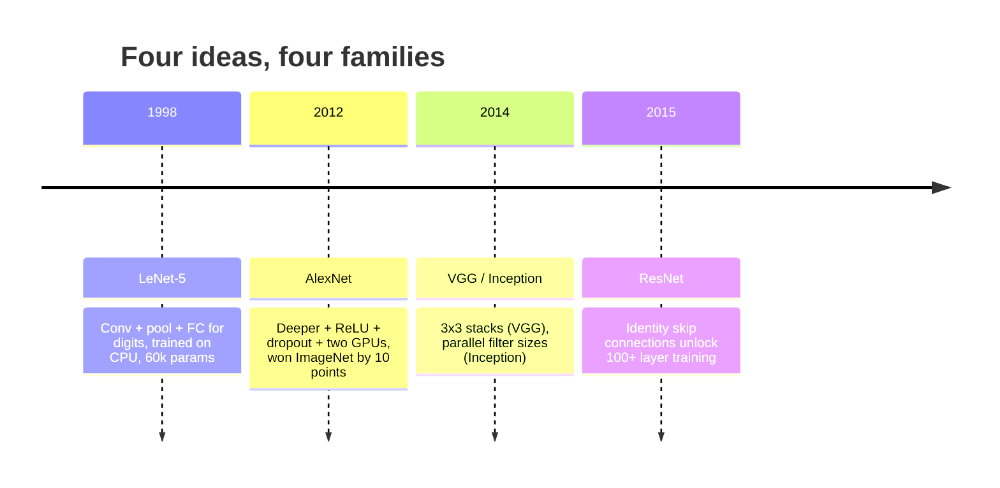
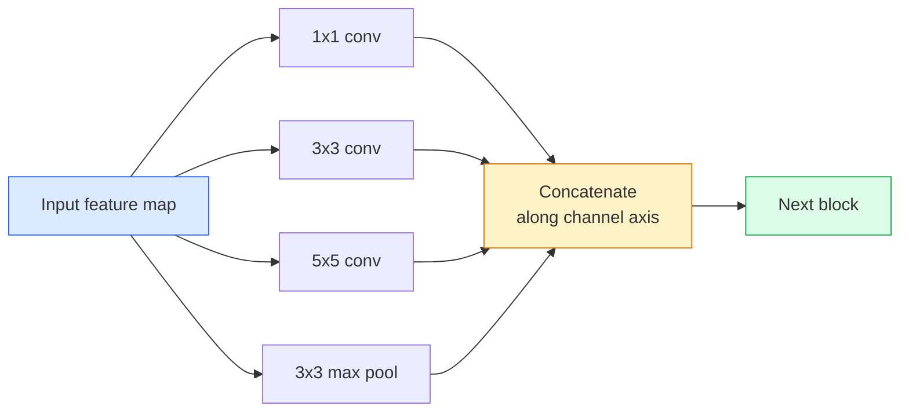
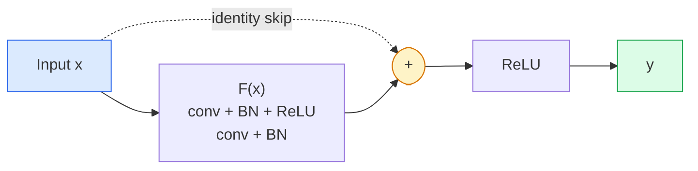

# CNNs  LeNet para ResNet  CNN arquitetura evoluir  De LeNet para ResNet

> Cada grande canal de comunicação da CNN dos últimos trinta anos é a mesma receita de nãolinearidade, com uma nova ideia ligada.

> **【中文解读】**过去三十年所有重要的CNN 都是同一个模板 () 卷积-激活-下采样) 加上一个新想法.

**Type:** Learn + Build | **类型:** 学习 + 动手
**Languages:** Python | **语言:** Python
**Prerequisites:** Phase 3 Lesson 11 (PyTorch), Phase 4 Lesson 01 (Image Fundamentals), Phase 4 Lesson 02 (Convolutions from Scratch) | **前置知识:** Phase 3 Lesson 11（PyTorch），Phase 4 Lesson 01（图像基础），Phase 4 Lesson 02（从零实现卷积）
**Time:** ~75 minutes | **时间:** ~75 分钟

## Objetivos de aprendizagem

- Rastrear a linhagem arquitetônica LeNet-5 -> AlexNet -> VGG -> Inception -> ResNet e indicar a única nova ideia cada família contribuiu
- Implementar LeNet-5, um bloco de estilo VGG, e um ResNet BasicBlock em PyTorch, cada um com menos de 40 linhas
- Explique por que as conexões residuais transformam uma rede de 1.000 camadas de inestrutível em um estado de vanguarda
- Leia uma espinha dorsal moderna (ResNet-18, ResNet-50) e prevê a sua forma de saída, campo receptivo e contagem de parâmetros antes de olhar para a fonte

> **【中文解读】**O objetivo do aprendizado é listar as capacidades centrais que devem ser adquiridas após a conclusão do curso.


## O problema é o problema da introdução

Em 2011, o melhor classificador ImageNet marcou cerca de 74% de precisão no top-5. Em 2012, a AlexNet obteve 85%. Em 2015, a ResNet obteve 96%. Não há novos dados. Não há nova geração de GPUs. Os ganhos vieram de ideias de arquitetura. Um engenheiro de visão profissional tem de saber de que papel veio a ideia porque cada espinha dorsal de produção que você envia em 2026 é uma recombinação dessas mesmas peças  e porque as ideias continuam a transferir: convases agrupadas passaram de CNNs para transformadores, conexões residuais passaram de ResNet para cada LLM existente, normalização de lote vive em modelos de difusão.

> Em 2011, o melhor ImageNet classificador top-5  Precisação de 74%                                                                                                                                                                                                                                                                                                                                                                                                                                                                                                            

> **【中文解读】**Entre 2011-2015 anos a taxa de precisão da ImageNet subiu de 74% para 96%, não dependendo de novos dados ou novas GPUs, mas de inovações de arquitetura. Estas inovações ainda estão sendo repetidas:

O MNIST não precisa de uma ResNet. Conhecer a curva de escala de cada família diz-lhe onde sentar-se sobre ela.

> 按顺序学习这些网络还能让你避免一个常见错误: quando LeNet grande rede está em condições de resolver um problema, use o maior modelo disponível. MNIST não precisa de ResNet.

## O conceito central.

### As quatro ideias que mudaram a visão mudaram as quatro ideias da visão do computador



Nada mais na visão clássica importava tanto quanto estes quatro saltos.

> Não há nada mais importante do que esta 4x.

### LeNet-5 (1998)

O reconhecedor de dígitos de Yann LeCun. 60.000 parâmetros. Dois blocos de conv-pool, duas camadas totalmente conectadas, ativas tanh.

> O identificador digital de Yann LeCun, 60.000 parâmetros, dois blocos de volume, duas camadas de ligação, tanh  activ, define cada modelo de sucessão da CNN:

```
input (1, 32, 32)
  conv 5x5 -> (6, 28, 28)
  avg pool 2x2 -> (6, 14, 14)
  conv 5x5 -> (16, 10, 10)
  avg pool 2x2 -> (16, 5, 5)
  flatten -> 400
  dense -> 120
  dense -> 84
  dense -> 10
```

Tudo o que o mundo moderno chama de uma CNN  alternando as convulsões e desmontreando a alimentação de uma pequena cabeça de classificador  é LeNet com mais camadas, canais maiores e melhores ativações.

> O mundo moderno chama-se de CNN, o volume e a substituição de tudo em uma pequena divisão de dados, que tem mais camadas, maiores canais e melhor LeNet ativado.

> **【中文解读】**LeNet-5 define todos os modelos básicos da CNN: envolvimento → 池化 → 卷积 → 池化 → 全连接── apenas 60.000 parâmetros, mas estabeleceu a estrutura básica do sistema de aprendizagem visual─.

### AlexNet (2012) Ponto de partida de aprendizado profundo

Três mudanças que juntos quebraram a ImageNet:

> Três mudanças comuns quebraram a ImageNet:

1. **ReLU**Os gradientes param de desaparecer, o treino acelera por um fator de seis.
2. **Dropout**A regularização torna-se uma camada, não um truque.
3. **Depth and width**Cinco camadas de convecção, três camadas densas, parâmetros 60M, treinados em duas GPUs com o modelo dividido entre elas.

A Figura 2 do artigo ainda mostra a GPU dividida em dois fluxos paralelos. Esse paralelismo foi uma solução de hardware, não uma visão arquitetônica  mas as três ideias acima ainda estão em cada modelo que você usa.

> O gráfico 2 do artigo ainda mostra que a GPU é dividida em dois paralelos. Essa paralelidade é o direito de hardware, não é a estrutura, mas os três pensamentos acima ainda estão em cada modelo que você usa.

> **【拓展：AlexNet 的遗产】**As três inovações introduzidas na AlexNet estão presentes: 1) ReLU  função ativa resolveu o problema da disparidade; 2) Desistência e regularização para evitar excesso de adaptação; 3) profundidade + amplitude de escalada.

### VGG (2014)  3x3 卷积的极致堆积

O VGG perguntou: o que acontece se você usar apenas 3x3 convulsões e você vai fundo?

> VGG 问道: Se você usar apenas 3x3 卷积, e aumentar, o que acontecerá?

```
stack:   conv 3x3 -> conv 3x3 -> pool 2x2
repeat:  16 or 19 conv layers
```

Dois convos 3x3 vêem a mesma área de entrada 5x5 como um convos 5x5 mas com menos parâmetros (2 * 9 * C^2 = 18C^2 vs 25 * C^2) e um ReLU extra entre eles. VGG transformou esta observação em uma arquitetura inteira. A simplicidade  um tipo de bloco, repetido  tornou-o o ponto de referência para tudo o que veio depois.

> 两个3x3卷积见的5x5输入区域与一个5x5卷积相同,但参数较少(2*9*C^2 = 18C^2 vs 25*C^2), em meio há ainda ReLU。VGG adicional que transformará esta observação em uma estrutura completa。简洁性一种块类型,重复使用使它成为后的参考点。

Custo: 138 milhões de parâmetros, lento em treino, caro na inferência.

> 代价:1.38 亿参数, treinamento lento, recomendação caro.

### Iniciação (2014, mesmo ano)

A resposta do Google para "qual tamanho de núcleo devo usar?" foi: todos eles, em paralelo.

> A resposta do Google para "qual é o tamanho do núcleo?" é:



Cada ramo se especializa em 1x1 para mistura de canais, 3x3 para textura local, 5x5 para padrões maiores, agrupando para características invariantes de turno e o concat permite que a camada seguinte escolha qual ramo for útil.

> Cada ramo é especializado em diferentes aspectos. 1x1 é usado para a mistura de passagens, 3x3 é usado para a estrutura local, 5x5 é usado para um modelo maior, acumulação é usada para a planejação de características.

### O problema da degradação.

Em 2015, o VGG-19 funcionou e o VGG-32 não. A profundidade deveria ajudar, mas depois de ~20 camadas, tanto o treinamento quanto a perda de teste piorou. Isso não é sobreajustado. Isso é o optimizador que não consegue encontrar pesos úteis porque os gradientes encolhem multiplicativamente através de cada camada.

> Até 2015, o VGG-19 pode funcionar, mas o VGG-32 não funciona. A profundidade deveria ter sido útil, mas os perdos de treinamento e teste de mais de 20 camadas ficaram piores.

```
Plain deep network:
  y = f_L( f_{L-1}( ... f_1(x) ... ) )

Gradient wrt early layer:
  dL/dW_1 = dL/dy * df_L/df_{L-1} * ... * df_2/df_1 * df_1/dW_1

Each multiplicative term has magnitude roughly (weight magnitude) * (activation gain).
Stack 100 of them with gains < 1 and the gradient is effectively zero.
```

O VGG funcionava em 19 camadas porque a norma de lote (publicada simultaneamente) manteve as ativas bem escaladas.

> O VGG em 19 níveis é um trabalho de redução de volume (a) por manter uma boa redução de volume (a) por volta de 30 níveis (a).

### ResNet (2015)  REST 差连接 深度学习突破

Ele, Zhang, Ren, Sun propuseram uma mudança que corrigisse tudo:

> Ele, Zhang, Ren, Sun, propôs uma mudança para tudo.

```
standard block:   y = F(x)
residual block:   y = F(x) + x
```

O `+ x`significa que a camada pode sempre optar por não fazer nada conduzindo .`F(x)`A rede ResNet de 1.000 camadas é agora tão ruim quanto uma rede de 1 camada, porque cada bloco extra tem uma escotilha de escape trivial. Com essa garantia, o optimizador está disposto a tornar cada bloco * ligeiramente * útil  e ligeiramente útil, empilhado 100 vezes, é de última geração.

> `+ x`Significa que esta camada é sempre possível.`F(x)`Tendência para zero para escolher tudo que não faz. Uma rede de 1000 níveis de ResNet agora é tão diferente do que uma rede de 1 nível, porque cada bloco extra tem uma simples via de fuga.



Duas variantes do bloco aparecem em todos os lugares:

> 两种块变体无处不在:

- **BasicBlock**(ResNet-18, ResNet-34): dois convos 3x3, saltem em torno de ambos.
  Tradução do inglês: Basic Block两个3x3卷积,跨两者的跳
- **Bottleneck**1x1 para baixo, 3x3 para o meio, 1x1 para cima, saltar ao redor do trio.
  Tradução do inglês para tradução do inglês: 瓶块1x1 降维、3x3 中间、1x1 升维,跨三者跳──通道数高时更便宜──

Quando o skip tem que atravessar uma amostra descendente (passo=2), o caminho de identidade é substituído por um 1x1 passo=2 conv para combinar as formas.

> Quando o salto precisa de atravessar o padrão de passagem = 2, o padrão de passagem é substituído por um padrão de passagem = 2 em forma correspondente.

### Porque os resíduos importam além da visão.

A ideia não era realmente sobre classificação de imagem. Era sobre transformar redes profundas de "cross-your-finger e esperança gradientes sobreviver" em uma ferramenta de engenharia confiável e escalavel. Cada transformador que você vai ler sobre a próxima fase tem a mesma conexão skip exatamente em cada bloco. Sem ResNet, não há GPT.

> Esta ideia não é realmente sobre a classificação de imagens. É sobre transformar a rede profunda de "pregação de gradientes para sobreviver" em ferramentas de engenharia confiáveis e expansíveis.

> **【拓展：残差连接与 Transformer】**O restar de ligação não só mudou a visão, mas também fez com que a rede profunda passasse de "pregar a gradiência para sobreviver" para um instrumento de engenharia confiável.`y = F(x) + x`Pode-se dizer que é uma das mais importantes estratégias de aprendizagem profunda.

> **【拓展：工业部署中的视觉系统】**No implementar industrial real, o modelo visual precisa considerar a possibilidade de atrasos, modelos de tamanho, dispositivos de margem, etc. TensorRT, ONNX Runtime, OpenVINO são ferramentas de aceleração de cálculo de uso comum.

```figure
pooling
```

## Construí-lo

## Construí-lo.

### Passo 1: LeNet-5: Realizar LeNet-5

Uma LeNet mínima, fiel, ativas de Tanh, pooling médio, a única concessão à modernidade é que usamos`nn.CrossEntropyLoss`Para baixo do rio, em vez das conexões gaussianas originais.

> Uma minimizada 、 fiel LeNet ∞ ∞ ∞ ∞ ∞ ∞ ∞ ∞ ∞ ∞ ∞ ∞ ∞ ∞ ∞ ∞ ∞ ∞ ∞ ∞ ∞ ∞ ∞ ∞ ∞ ∞ ∞ ∞ ∞ ∞ ∞ ∞ ∞ ∞ ∞ ∞ ∞ ∞ ∞ ∞ ∞ ∞ ∞ ∞ ∞ ∞ ∞ ∞ ∞ ∞ ∞ ∞ ∞ ∞ ∞ ∞ ∞ ∞ ∞ ∞ ∞ ∞ ∞ ∞ ∞ ∞ ∞ ∞ ∞ ∞ ∞ ∞ ∞ ∞ ∞ ∞ ∞ ∞ ∞ ∞ ∞ ∞ ∞ ∞ ∞ ∞ ∞ ∞ ∞ ∞ ∞ ∞ ∞ ∞ ∞ ∞ ∞ ∞ ∞ ∞ ∞ ∞ ∞ ∞ ∞ ∞ ∞ ∞ ∞ ∞ ∞ ∞ ∞ ∞ ∞ ∞ ∞ ∞ ∞ ∞ ∞ ∞ ∞ ∞ ∞ ∞ ∞ ∞ ∞ ∞ ∞ ∞ ∞ ∞ ∞ ∞ ∞ ∞ ∞ ∞ ∞ ∞ ∞ ∞ ∞ ∞ ∞ ∞ ∞ ∞ ∞ ∞ ∞ ∞ ∞ ∞ ∞ ∞ ∞ ∞ ∞ ∞ ∞ ∞ ∞ ∞ ∞ ∞ ∞ ∞ ∞ ∞ ∞ ∞ ∞ ∞ ∞ ∞ ∞ ∞ ∞ ∞ ∞ ∞ ∞ ∞ ∞ ∞ ∞ ∞ ∞ ∞ ∞ ∞ ∞ ∞ ∞ ∞ ∞ ∞ ∞ ∞ ∞ ∞ ∞ ∞ ∞ ∞ ∞ ∞ ∞ ∞ ∞ ∞ ∞ ∞ ∞ ∞ ∞ ∞ ∞ ∞ ∞ ∞ ∞ ∞ ∞ ∞ ∞ ∞ ∞ ∞ ∞ ∞ ∞ ∞ ∞ ∞ ∞ ∞ ∞ ∞ ∞ ∞ ∞ ∞ ∞ ∞ ∞ ∞ `nn.CrossEntropyLoss`Não é o original.

```python
import torch
import torch.nn as nn
import torch.nn.functional as F

class LeNet5(nn.Module):
    def __init__(self, num_classes=10):
        super().__init__()
        self.conv1 = nn.Conv2d(1, 6, kernel_size=5)
        self.conv2 = nn.Conv2d(6, 16, kernel_size=5)
        self.pool = nn.AvgPool2d(2)
        self.fc1 = nn.Linear(16 * 5 * 5, 120)
        self.fc2 = nn.Linear(120, 84)
        self.fc3 = nn.Linear(84, num_classes)

    def forward(self, x):
        x = self.pool(torch.tanh(self.conv1(x)))
        x = self.pool(torch.tanh(self.conv2(x)))
        x = torch.flatten(x, 1)
        x = torch.tanh(self.fc1(x))
        x = torch.tanh(self.fc2(x))
        return self.fc3(x)

net = LeNet5()
x = torch.randn(1, 1, 32, 32)
print(f"output: {net(x).shape}")
print(f"params: {sum(p.numel() for p in net.parameters()):,}")
```

Produção esperada: `output: torch.Size([1, 10])`- Não .`params: 61,706`É o classificador de dígitos que deu origem à visão moderna.

> 预期输出:`output: torch.Size([1, 10])`- Não.`params: 61,706` É o início da moderna visão completa digital 

### Passo 2: Um bloco VGG implementar blocos VGG

Um bloco reutilizável: dois convos 3x3, ReLU, batch norm, max pool.

> Um bloco reutilizablo: dois 3x3 卷积、ReLU、批量归归一化、最大池化──

```python
class VGGBlock(nn.Module):
    def __init__(self, in_c, out_c):
        super().__init__()
        self.conv1 = nn.Conv2d(in_c, out_c, kernel_size=3, padding=1)
        self.bn1 = nn.BatchNorm2d(out_c)
        self.conv2 = nn.Conv2d(out_c, out_c, kernel_size=3, padding=1)
        self.bn2 = nn.BatchNorm2d(out_c)
        self.pool = nn.MaxPool2d(2)

    def forward(self, x):
        x = F.relu(self.bn1(self.conv1(x)))
        x = F.relu(self.bn2(self.conv2(x)))
        return self.pool(x)

class MiniVGG(nn.Module):
    def __init__(self, num_classes=10):
        super().__init__()
        self.stack = nn.Sequential(
            VGGBlock(3, 32),
            VGGBlock(32, 64),
            VGGBlock(64, 128),
        )
        self.head = nn.Sequential(
            nn.AdaptiveAvgPool2d(1),
            nn.Flatten(),
            nn.Linear(128, num_classes),
        )

    def forward(self, x):
        return self.head(self.stack(x))

net = MiniVGG()
x = torch.randn(1, 3, 32, 32)
print(f"output: {net(x).shape}")
print(f"params: {sum(p.numel() for p in net.parameters()):,}")
```

Três blocos VGG com entrada CIFAR, uma piscina adaptativa, uma camada linear. ~290k parâmetros.

> CIFAR 尺寸输入上三 VGG 块、自适应池化、一线性层──约29万参数──对 CIFAR-10 有余──

### Passo 3: Um ResNet BasicBlock implementar ResNet  básico bloco

O bloco de construção central da ResNet-18 e ResNet-34.

> Blocos de construção do núcleo de ResNet-18 e ResNet-34

```python
class BasicBlock(nn.Module):
    def __init__(self, in_c, out_c, stride=1):
        super().__init__()
        self.conv1 = nn.Conv2d(in_c, out_c, kernel_size=3, stride=stride, padding=1, bias=False)
        self.bn1 = nn.BatchNorm2d(out_c)
        self.conv2 = nn.Conv2d(out_c, out_c, kernel_size=3, stride=1, padding=1, bias=False)
        self.bn2 = nn.BatchNorm2d(out_c)
        if stride != 1 or in_c != out_c:
            self.shortcut = nn.Sequential(
                nn.Conv2d(in_c, out_c, kernel_size=1, stride=stride, bias=False),
                nn.BatchNorm2d(out_c),
            )
        else:
            self.shortcut = nn.Identity()

    def forward(self, x):
        out = F.relu(self.bn1(self.conv1(x)))
        out = self.bn2(self.conv2(out))
        out = out + self.shortcut(x)
        return F.relu(out)
```

`bias=False`Em camadas conv é uma convenção de norma de lote  o parâmetro beta do BN já lida com o viés, por isso, levar viés conv também é um desperdício.`shortcut`Só precisa de um conv real quando o número de passos ou canais muda; caso contrário, é uma identidade sem operação.

> 卷积层上 `bias=False`O beta-parâmetro do bloco de regeneração de massa já foi processado, portanto, a reserva de volume de regeneração é um desperdício.`shortcut`Só é necessário um volume real quando a variação de tamanho ou número de passagens; caso contrário, é um constante inoperável.

### Passo 4: Construa uma pequena ResNet.

Apile quatro grupos de BasicBlocks para obter uma ResNet funcional para entradas do tamanho CIFAR.

> 堆叠四组 BasicBlock 以获得适用于 CIFAR 尺寸输入工作ResNet。

```python
class TinyResNet(nn.Module):
    def __init__(self, num_classes=10):
        super().__init__()
        self.stem = nn.Sequential(
            nn.Conv2d(3, 32, kernel_size=3, stride=1, padding=1, bias=False),
            nn.BatchNorm2d(32),
            nn.ReLU(inplace=True),
        )
        self.layer1 = self._make_group(32, 32, num_blocks=2, stride=1)
        self.layer2 = self._make_group(32, 64, num_blocks=2, stride=2)
        self.layer3 = self._make_group(64, 128, num_blocks=2, stride=2)
        self.layer4 = self._make_group(128, 256, num_blocks=2, stride=2)
        self.head = nn.Sequential(
            nn.AdaptiveAvgPool2d(1),
            nn.Flatten(),
            nn.Linear(256, num_classes),
        )

    def _make_group(self, in_c, out_c, num_blocks, stride):
        blocks = [BasicBlock(in_c, out_c, stride=stride)]
        for _ in range(num_blocks - 1):
            blocks.append(BasicBlock(out_c, out_c, stride=1))
        return nn.Sequential(*blocks)

    def forward(self, x):
        x = self.stem(x)
        x = self.layer1(x)
        x = self.layer2(x)
        x = self.layer3(x)
        x = self.layer4(x)
        return self.head(x)

net = TinyResNet()
x = torch.randn(1, 3, 32, 32)
print(f"output: {net(x).shape}")
print(f"params: {sum(p.numel() for p in net.parameters()):,}")
```

Quatro grupos de dois blocos cada. Passo 2 no início dos grupos 2, 3, 4. Contagem de canais duplica em cada amostra inferior. Parâmetros de aproximadamente 2,8M. Essa é a receita padrão que escala limpo até ResNet-152.

> O número de passagens duplicadas por fase de produção é de aproximadamente 280 milhões de parâmetros.

### Passo 5: Compare eficiência parâmetro-a-característica em relação à eficiência parâmetro

Execute a mesma entrada através das três redes e compare as contagens de parâmetros.

> A mesma entrada será feita através de todas as três redes e comparar os números de parâmetros.

```python
def summary(name, net, x):
    y = net(x)
    params = sum(p.numel() for p in net.parameters())
    print(f"{name:12s}  input {tuple(x.shape)} -> output {tuple(y.shape)}  params {params:>10,}")

x = torch.randn(1, 3, 32, 32)
summary("LeNet5",     LeNet5(),       torch.randn(1, 1, 32, 32))
summary("MiniVGG",    MiniVGG(),      x)
summary("TinyResNet", TinyResNet(),   x)
```

Três modelos, três eras, três ordens de magnitude em contagem de parâmetros. Para a precisão do CIFAR-10, você precisa de aproximadamente: LeNet 60%, MiniVGG 89%, TinyResNet 93% após algumas épocas de treinamento.

> Três modelos, três épocas, três classes de números.


## Use-o em prática.

`torchvision.models`A assinatura da chamada é idêntica em todas as famílias, o que é exatamente o ponto da abstracção da espinha dorsal.

> `torchvision.models` dar-lhe uma versão de treinamento prévio de todos os modelos acima.  Adotar assinaturas em cada família é completamente igual, é o que significa o abstrato da rede de ossos.

```python
from torchvision.models import resnet18, ResNet18_Weights, vgg16, VGG16_Weights

r18 = resnet18(weights=ResNet18_Weights.IMAGENET1K_V1)
r18.eval()

print(f"ResNet-18 params: {sum(p.numel() for p in r18.parameters()):,}")
print(r18.layer1[0])
print()

v16 = vgg16(weights=VGG16_Weights.IMAGENET1K_V1)
v16.eval()
print(f"VGG-16   params: {sum(p.numel() for p in v16.parameters()):,}")
```

ResNet-18 tem 11,7 milhões de parâmetros. VGG-16 tem 138 milhões. A precisão similar à ImageNet top-1 (69,8% vs 71,6%). As conexões residuais lhe compram uma vitória de eficiência de parâmetros de 12x. É por isso que as variantes ResNet dominaram de 2016 até ViT chegar em 2021  e ainda dominam as implementações do mundo real onde a computação é a restrição.

> **【中文解读】**ResNet-18(1170 milhões de parâmetros) vs VGG-16(1.38 mil milhões de parâmetros),ImageNet 准确率相近, mas a eficiência dos parâmetros diferia 12 vezes.

Para a aprendizagem de transferência, a receita é sempre a mesma: carga pré-treinada, congelamento da coluna vertebral, substituição da cabeça do classificador.

> Para a migração de aprendizagem, o esquema é sempre o mesmo: carga de peso, ligação de rede, substituição de divisão de equipamentos.

```python
for p in r18.parameters():
    p.requires_grad = False
r18.fc = nn.Linear(r18.fc.in_features, 10)
```

Agora tem um classificador CIFAR de 10 classes que herda as representações que a ImageNet pagou.

> O código é o código de código de código de código de código de código de código de código de código de código de código de código de código de código de código de código de código de código de código de código de código de código de código de código de código de código de código de código de código de código de código de código de código de código de código de código de código de código de código de código de código de código de código de código de código de código de código de código de código de código de código de código de código de código de código de código de código de código de código de código de código de código de código de código de código de código de código de código de código de código de código de código de código de código de código de código de código de código de código de código de código de código de código de código de código de código de código de código de código de código de código de código de código de código de código de código de código de código de código de código de código de código de código de código de código de código de código de código de código de código de código de código de código de código de código de código de código de código de código de código de código de código de código de código de código de código de código de código de código de código de código de código de código de código de código de código de código de código de código de código de código de código de código de código de código de código de código de 10 de código de código de código de código de código de código de código de código de código de código de código de código de código de código de código de código de código de código de código de código de código de código de código de código de código de código de código de código de código de código de código de código de código de código de código de código de código de código de código de código de código de código de código de código de código de código de código de código de código de código de código de código de código de código de código de código de código de código de código de código de código de código de código de código de código de código de código de código de código de código de código de código de código de código de código de código de código de código de código de código de código de código de código de código de código de código de código de código de código de código de código de código de código de código de código de código de código de código de código de código de código de código de código de código de código de


> **【拓展：数据标注与质量】** Visual task's effect highly depends on label data quality──Label Studio、CVAT is the mainstream marking tool──In industrial scenarios, proactive learning(Active Learning) pode reduzir o custo de marcação: modelo contra um pedido de amostra não definido marcação artificial, identidade de amostra auto-marcação──

## Envia-o . Entrega e produção .

Esta lição produz:

> 本课产出:

- `outputs/prompt-backbone-selector.md` um prompt que seleciona a família de CNN certa (LeNet/VGG/ResNet/MobileNet/ConvNeXt) dada tarefa, tamanho do conjunto de dados e orçamento de computação.
  Tradução do inglês para Chinês:给定任务、数据集大小和计算预算,选择正确 CNN 家族的提示词──
- `outputs/skill-residual-block-reviewer.md` uma habilidade que lê um módulo PyTorch e sinaliza erros de ligação de saltos (falta de atalho na alteração de passo, ordem de ativação de atalho, colocação BN em relação à adição).
  Chinese: 读取 PyTorch 模块并标记跳跃连接错误的技能──

## Exercícios.

> **【中文解读】**Practicação de temas de fácil/médio/difícil  3o dificuldade de passagem  Recomendação de completar pelo menos Praça de nível médio Classe difícil  Adaptação a pesquisa profunda ou preparação para o encontro 


1. **(Easy | 简单)**Contar os parâmetros à mão para `TinyResNet`- Comparar com a`sum(p.numel() for p in net.parameters())`Onde vai a maioria do orçamento de parâmetros  convs, BN ou o cabeçalho do classificador?
   Calcule os parâmetros de TinyResNet, encontrando os principais parâmetros.

2. **(Medium | 中等)**Implementar o bloco de garganta de engarrafamento (1x1 -> 3x3 -> 1x1 com saltar) e usá-lo para construir uma rede de estilo ResNet-50 para CIFAR.`TinyResNet`- Não .
   实现 Bottleneck 块, construir ResNet-50 风格网络,对比参数量──

3. **(Hard | 困难)**Remover a ligação skip de `BasicBlock`A rede de "plain" de 34 blocos e a ResNet de 34 blocos são treinadas em CIFAR-10 por 10 épocas cada.
   Para fazer isso, você deve ter um plano de trabalho.

## Termos-chave .

| Term | What people say | What it actually means | 中文释义 |
|------|----------------|----------------------|---------|
| Backbone | "The model" | The stack of convolutional blocks that produces the feature map fed to the task head | 骨干网络：产生特征图的卷积块堆叠 |
| Residual connection | "Skip connection" | `y = F(x) + x`; lets the optimiser learn identity by setting F to zero, which makes arbitrary depth trainable | 残差连接/跳跃连接：让任意深度可训练 |
| BasicBlock | "Two 3x3 convs with a skip" | The ResNet-18/34 building block: conv-BN-ReLU-conv-BN-add-ReLU | 基本块：ResNet-18/34 的构建单元 |
| Bottleneck | "1x1 down, 3x3, 1x1 up" | The ResNet-50/101/152 block; cheap at high channel counts because the 3x3 runs on a reduced width | 瓶颈块：1x1降维-3x3卷积-1x1升维 |
| Degradation problem | "Deeper is worse" | Past ~20 plain conv layers, both training and test error increase; solved by residual connections, not by more data | 退化问题：层数加深后训练和测试误差都增大 |
| Stem | "The first layer" | The initial conv that converts 3-channel input into the base feature width; usually 7x7 stride 2 for ImageNet, 3x3 stride 1 for CIFAR | 茎部：网络的初始卷积层 |
| Head | "The classifier" | The layers after the final backbone block: adaptive pool, flatten, linear(s) | 头部：骨干网络之后的分类器层 |
| Transfer learning | "Pretrained weights" | Loading a backbone trained on ImageNet and fine-tuning only the head on your task | 迁移学习：加载预训练权重，只微调头部 |

## Mais leitura 延伸阅读

> **【中文解读】**延伸阅读 fornece recursos de alta qualidade para a aprendizagem profunda.


- [Deep Residual Learning for Image Recognition (He et al., 2015)](https://arxiv.org/abs/1512.03385) o artigo ResNet; cada figura vale a pena ser estudada
- [Very Deep Convolutional Networks (Simonyan & Zisserman, 2014)](https://arxiv.org/abs/1409.1556)O documento VGG; ainda é a melhor referência para "porque 3x3"
- [ImageNet Classification with Deep CNNs (Krizhevsky et al., 2012)](https://papers.nips.cc/paper_files/paper/2012/hash/c399862d3b9d6b76c8436e924a68c45b-Abstract.html) AlexNet; o jornal que terminou a era da arte artesanal
- [Going Deeper with Convolutions (Szegedy et al., 2014)](https://arxiv.org/abs/1409.4842) Inception v1; a ideia de filtro paralelo que ainda aparece nos transformadores de visão
