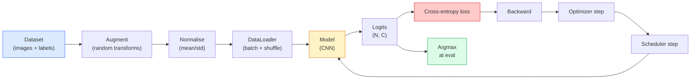

# Classificação de imagens

> Um classificador é uma função de pixels para uma distribuição de probabilidade em classes.

> **【中文解读】**A imagem de um classificador é, em essência, uma função de distribuição de probabilidade de um tipo de imagem. A análise de uma categoria de áreas (distribuição de uma categoria de imagens) é a base de todas as tarefas visuais.

**Type:** Build | **类型:** 动手
**Languages:** Python | **语言:** Python
**Prerequisites:** Phase 2 Lesson 09 (Model Evaluation), Phase 3 Lesson 10 (Mini Framework), Phase 4 Lesson 03 (CNNs) | **前置知识:** Phase 2 Lesson 09（模型评估），Phase 3 Lesson 10（迷你框架），Phase 4 Lesson 03（CNN）
**Time:** ~75 minutes | **时间:** ~75 分钟

## Objetivos de aprendizagem

- Construir um conjunto de classificação de imagens de ponta a ponta no CIFAR-10: conjunto de dados, aumento, modelo, ciclo de formação, avaliação
- Explique o papel de cada componente (datloader, perda, optimizador, agendador, aumento) e prevê como a quebra de qualquer um deles se manifesta na curva de perda
- Implementar mistura, corte e suavização de rótulos a partir do zero e justificar quando cada um vale a pena ser adicionado
- Leia uma matriz de confusão e uma tabela de precisão/recolha por classe para diagnosticar falhas de conjuntos de dados e modelos além da precisão agregada

> **【中文解读】**O objetivo do aprendizado é listar as capacidades centrais que devem ser adquiridas após a conclusão do curso.


## O problema é o problema da introdução

Cada tarefa de visão que é enviada reduz-se à classificação de imagem em algum nível. Detecção classifica regiões. Segmentação classifica pixels. Retorno classifica por semelhança com classe centroides. Obter classificação correta  o ciclo do conjunto de dados, a política de aumento, a perda, a avaliação  é a habilidade que transfere para todas as outras tarefas na fase.

> Cada tarefa visual entregue se resume, em certa medida, a uma categoria de imagem. A categoria de áreas de teste é dividida em categorias de imagem. A classificação é feita em função de um conjunto de dados, aumentando estratégias, perdas e avaliações.

> **【中文解读】**Todas as tarefas visuais da implementação real podem ser, em essência, classificadas em categorias de imagens: o teste de objetivo é "para categorias regionais", o teste de significado é "para categorias de imagens", o teste de imagem é "para categorias de similaridade de acordo com o centro de classificação" e o teste de imagem é o principal elemento da linha de fluxo de imagens.

A maioria dos bugs de classificação não estão no modelo. Eles vivem no pipeline: uma normalização quebrada, um conjunto de treinamento não alterado, um aumento que distorce as etiquetas, uma divisão de validação contaminada por dados de treinamento, uma taxa de aprendizagem que silenciosamente diverge após a época 30. Uma CNN que atingiria 93% no CIFAR-10 com uma configuração correta normalmente marca 70-75% com uma quebrada, e a curva de perda parece plausível o tempo todo.

> A maioria dos bugs de classe não está no modelo. Eles existem na linha de fluxo: erroneous regulation, não perturbado training set, torsion of tags, enhancement, verification of trained data contamination, a taxa de aprendizagem em 30 épocas de silent dissemination. Uma configuração correta pode atingir 93% na CIFAR-10 da CNN, normalmente apenas 70-75% na configuração errada, e a curva de perda parece ser muito razoável.

Esta lição conecta todo o gasoduto à mão para que cada parte seja inspecionável.`torchvision.datasets`Isso pode esconder um inseto.

> Esta aula é feita manualmente para construir toda a linha de fluxo, para que cada parte seja inspecionável.`torchvision.datasets`Tudo o que pode estar escondido.

> **【中文解读】**A maioria dos bugs de classe não está no modelo em si, mas na linha de fluxo: regeneração, erro, treinamento, não perturbação, aumento de destruição de etiquetas, verificação, dados contaminados, taxa de aprendizagem, de expansão. A configuração correta pode chegar a 93% do modelo, a configuração errada pode chegar a 70-75%, e a perda de curva parece estar bem normal.

## O conceito central.

### O canal de classificação



Cada linha neste loop é onde um bug pode viver.`model(x).softmax()`antes que a perda calcule silenciosamente o gradiente errado.

> Cada linha deste ciclo é um bug que pode existir onde.`model(x).softmax()`A cidade está em silêncio, calculada a escala de erro.

> **【中文解读】**流水线中每一行都可能藏有 bug──交叉接收是原始 logits(未经 softmax 的值), se primeiro fizer softmax 再传入损失 函数,梯度计算就完全错了但不会报错── Aumentations aplicam-se apenas às entradas, não às etiquetas  exceto para mistura, que mistura ambas. `optimizer.zero_grad()`O que acontece é que o erro de aprendizagem é muito maior que o que acontece com os erros de aprendizagem.

### Entropia cruzada, logitas e softmax

Um classificador produz `C`números por imagem chamados logits. Aplicando softmax, eles são convertidos em uma distribuição de probabilidade:

> O grupo de imagens é dividido em quatro grupos:`C`个数字, denominados logits. 个数字, denominados logits. 个数字, denominados logits. 个数字, denominados logits. 个数字, denominados logits. 个数字, denominados logits. 个数字, denominados logits. 个数字, denominados logits. 个数字, denominados logits. 个数字, denominados logits. 个数字, denominados logits. 个数字, denominados logits. 个数字, denominados logits. 个数字, denominados logits. 个数字, denominados logits. 个数字, denominados logits. 个数字, denominados logits. 个数字, denominados logits. 个数字, denominados logits. 个数字, denominados logits. 个数字, 个数字, 个数字, 个数, 个数, 个数, 个数, 个数, 个数, 个数, 个数, 个数, 个数, 个数, 个数, 个数, 个数, 个数, 个数, 个数, 个数, 个数, 个数, 个数, 个数, 个数, 个数, 个数, 个, 个, 个, 个, 个, 个, 个, 个, 个, 个, 个, 个, 个, 个, 个, 个, 个, 个, 个, 个, 个, 个, 个, 个, 个, 个, 个, 个, 个, 个, 个, 个, 个, 个, 个, 个, 个, 个, 个, 个, 个, 个, 个, 个, 个, 个, 个, 个, 个, 个, 个, 个, 个, 个, 个, 个, 个, 个, 个, 个, 个, 个, 个, 个, 个, 个, 个, 个, 个, 个, 个, 个, 个

```
softmax(z)_i = exp(z_i) / sum_j exp(z_j)
```

A entropia cruzada mede a probabilidade de registro negativo da classe correta:

> 交叉衡正确类别的负对数概率:

```
CE(z, y) = -log( softmax(z)_y )
        = -z_y + log( sum_j exp(z_j) )
```

A forma à direita é a numéricamente estável (log-sum-exp).`nn.CrossEntropyLoss`A aplicação de softmax por si mesmo é quase sempre um erro.

> A forma do lado direito é o número de valores estáveis (log-sum-exp)`nn.CrossEntropyLoss`Em uma operação, fungiu softmax + NLL, recebendo diretamente logits originais.

> **【中文解读】**PyTorch `nn.CrossEntropyLoss`内部已经融合了软max + 负对数似然,直接传入原始logits 即可──. Se você primeiro mover suavemax novamente para perda, equivale a fazer duas vezes suavemax, gradiente calcular completamente errado──.

### Por que a ampliação funciona

Uma CNN tem preconceito indutivo para a tradução (de compartilhamento de peso), mas não há invariância embutida para culturas, viradas, nervosismo de cores ou oclusão. A única maneira de ensiná-lo essas invariâncias é mostrá-lo pixels que os exercitam.

> A CNN tem uma tendência para o plano de mudança (de acordo com o autor), mas para o corte, o retorno, a cor, a mudança ou a sombra não há nenhuma variação interna. A única maneira de ensinar a ele estas variações é mostrar a sua imagem.

> **【拓展：数据增强与模型泛化】**O aumento de dados é o mais poderoso método de regularização gratuito da IA moderna. Em treinamentos de modelos clássicos como o ResNet、EfficientNet, as boas e más estratégias de aumento afetam diretamente a taxa de precisão de 3-5%.

```
Original crop:  "dog facing left"
Flip:           "dog facing right"       <- same label, different pixels
Rotate(+15):    "dog, slight tilt"
Colour jitter:  "dog in warmer light"
RandomErasing:  "dog with patch missing"
```

A regra: o aumento deve preservar o rótulo. O corte e a rotação em um dígito podem virar "6" para "9"; para esse conjunto de dados você usa intervalos de rotação menores e escolhe aumentos que respeitem as invariâncias específicas de dígitos.

> 規則:增强必須保持標籤不變── para números fazer cobrança e rotação pode transformar "6"  into "9"; para esse conjunto de dados, você usa menor alcance de rotação,并選擇尊重數字特定不變性的增强──

### Mistura e corte

A ampliação normal transforma pixels mas mantém os rótulos um só. **Mixup**E ...**cutmix**quebrar isso interpolar os dois.

> Normalmente aumenta a taxa de mudança, mas mantém a marcação para um único calor.**Mixup**和 **cutmix**Por meio dos dois, a aplicação de um valor é uma das principais consequências.

```
Mixup:
  lambda ~ Beta(a, a)
  x = lambda * x_i + (1 - lambda) * x_j
  y = lambda * y_i + (1 - lambda) * y_j

Cutmix:
  paste a random rectangle of x_j into x_i
  y = area-weighted mix of y_i and y_j
```

Por que ajuda: o modelo deixa de memorizar alvos picantes e aprende a interpolar entre as aulas. A perda de treinamento aumenta, a precisão dos testes aumenta. É a atualização de robustez única mais barata para qualquer classificador.

> Por que é útil: o modelo para parar de memória de um ponto de pico de um objetivo quente, a aprendizagem entre as classes, o aumento da perda de treinamento, a taxa de precisão de teste também aumenta.

> **【拓展：Mixup 在大模型中的应用】**A ideia de mistura se estendeu ao campo da PNL para a inserção de textos para a mistura de valores. Em treinamentos de LLM, como ChatGPT, a técnica de etiquetação e etiquetação de soft é também amplamente utilizada, ajudando o modelo a gerar uma probabilidade de saída mais calificada, reduzindo a autoconfiança excessiva.

### Limeamento de rótulos

Um primo de confusão, em vez de treinar contra o`[0, 0, 1, 0, 0]`, treno contra`[eps/C, eps/C, 1-eps, eps/C, eps/C]`Para um pequeno .`eps`O modelo não produz logites arbitrariamente afiados e melhora a calibração quase sem custo.`nn.CrossEntropyLoss(label_smoothing=0.1)`desde a PyTorch 1.10.

> Mixup of close亲──不使用 `[0, 0, 1, 0, 0]` fazer treinamento, em vez de usar `[eps/C, eps/C, 1-eps, eps/C, eps/C]`, entre os `eps`Como 0.1── impedir o modelo de produzir qualquer logite de ponta, quase zero custos para melhorar a classificação── desde PyTorch 1.10                                                                                                                                                                                                                                                                                                                                                                                                                                                                                             `nn.CrossEntropyLoss(label_smoothing=0.1)`- Não.

### Avaliação além da precisão

A precisão agregada esconde desequilíbrio. Um classificador binário de 90 a 10 que sempre prevê a classe majoritária pontua 90%.

> A taxa de precisão total oculta desequilíbrio. Uma previsão geral é de 90 a 10%.

- **Per-class accuracy** um número por classe; imediatamente aparece categorias com baixo desempenho.
  Tradução do inglês para inglês: Per classe de desempenho é uma taxa de desempenho de cada classe de desempenho.
- **Confusion matrix** Gradeira C x C com linha i col j = contagem de classe verdadeira i prevista como classe j; a diagonal é correta, os fora-diagonais são onde o seu modelo vive.
  Tradução do inglês para inglês:混矩阵C x C 网格,行 i 列 j = 真实类别 i 被预测为类别 j 的计数;对角线是正确的,非对角线是你的模型出错的地方──
- **Top-1 / Top-5** se a classe correta está nas previsões de 1 ou 5 melhores; Top-5 importa para a ImageNet porque classes como "Norwich Terrier" vs "Norfolk Terrier" são genuinamente ambíguas.
  Top-1 / Top-5 正确类别是否在前1或前5 预测中;Top-5对 ImageNet 很重要,因为像"Norwich Terrier" vs "Norfolk Terrier" 这样的类别确实模两可──
- **Calibration (ECE)** uma previsão de confiança de 0,8 consegue ser correta 80% do tempo? redes modernas são sistematicamente excessivamente confiantes; corrigir com escala de temperatura ou suavização de rótulos.
  O sistema de segurança da rede moderna é um sistema de segurança da rede moderna.

> **【拓展：工业部署中的视觉系统】**No implementar industrial real, o modelo visual precisa considerar a possibilidade de atrasos, modelos de tamanho, dispositivos de margem, etc. TensorRT, ONNX Runtime, OpenVINO são ferramentas de aceleração de cálculo de uso comum.


## Construí-lo e realizei-o.

> **【中文解读】**Este é um método de "desde zero" que ajuda a entender o princípio da estrutura, não é um problema que se encontra em uma caixa negra.

```figure
receptive-field
```

## Construí-lo

### Passo 1: Um conjunto de dados sintéticos deterministas

CIFAR-10 vive no disco. Para tornar esta lição reprodutivel e rápida, construímos um conjunto de dados sintéticos que se parece com CIFAR  32x32 imagens RGB com estrutura específica de classe que o modelo deve aprender.

> CIFAR-10  existem no disco. Para tornar esta aula replicável e rápida, construímos um conjunto de dados sintetizados parecido com o CIFAR  com um modelo que deve ser aprendido de uma estrutura específica de 32x32 RGB  imagens .

```python
import numpy as np
import torch
from torch.utils.data import Dataset


def synthetic_cifar(num_per_class=1000, num_classes=10, seed=0):
    rng = np.random.default_rng(seed)
    X = []
    Y = []
    for c in range(num_classes):
        centre = rng.uniform(0, 1, (3,))
        freq = 2 + c
        for _ in range(num_per_class):
            yy, xx = np.meshgrid(np.linspace(0, 1, 32), np.linspace(0, 1, 32), indexing="ij")
            r = np.sin(xx * freq) * 0.5 + centre[0]
            g = np.cos(yy * freq) * 0.5 + centre[1]
            b = (xx + yy) * 0.5 * centre[2]
            img = np.stack([r, g, b], axis=-1)
            img += rng.normal(0, 0.08, img.shape)
            img = np.clip(img, 0, 1)
            X.append(img.astype(np.float32))
            Y.append(c)
    X = np.stack(X)
    Y = np.array(Y)
    idx = rng.permutation(len(X))
    return X[idx], Y[idx]


class ArrayDataset(Dataset):
    def __init__(self, X, Y, transform=None):
        self.X = X
        self.Y = Y
        self.transform = transform

    def __len__(self):
        return len(self.X)

    def __getitem__(self, i):
        img = self.X[i]
        if self.transform is not None:
            img = self.transform(img)
        img = torch.from_numpy(img).permute(2, 0, 1)
        return img, int(self.Y[i])
```

Cada classe recebe sua própria paleta de cores e padrão de frequência, além de ruído gaussiano para forçar o modelo a aprender o sinal em vez de memorizar pixels. Dez classes, mil imagens cada, permutadas.

> Cada categoria tem seu próprio padrão de regulação e frequência, além de alto ruído para obrigar o modelo a aprender sinais e não imagens de memória.

### Passo 2: Normalização e aumento

As duas transformações que todos os canais de visão têm.

> Cada linha de fluxo visual tem duas mudanças.

```python
def standardize(mean, std):
    mean = np.array(mean, dtype=np.float32)
    std = np.array(std, dtype=np.float32)
    def _fn(img):
        return (img - mean) / std
    return _fn


def random_hflip(p=0.5):
    def _fn(img):
        if np.random.random() < p:
            return img[:, ::-1, :].copy()
        return img
    return _fn


def random_crop(pad=4):
    def _fn(img):
        h, w = img.shape[:2]
        padded = np.pad(img, ((pad, pad), (pad, pad), (0, 0)), mode="reflect")
        y = np.random.randint(0, 2 * pad)
        x = np.random.randint(0, 2 * pad)
        return padded[y:y + h, x:x + w, :]
    return _fn


def compose(*fns):
    def _fn(img):
        for fn in fns:
            img = fn(img)
        return img
    return _fn
```

Refletir pad antes da colheita, não pad zero, porque as fronteiras pretas são um sinal que o modelo aprenderia a ignorar de forma inútil.

> 剪裁前使用反射填充而不是零填充, pois o quadro negro é um sinal ignorado de forma inútil.

### Passo 3: Mistura

Mistura duas imagens e duas etiquetas dentro da etapa de treinamento. Implementado como um lote de transformação para que viva ao lado da passagem dianteira em vez de dentro do conjunto de dados.

> Em um treino, mistura duas imagens e dois rótulos. Como uma realização de mudanças em massa, ele fica ao lado da distribuição e não dentro do conjunto de dados.

```python
def mixup_batch(x, y, num_classes, alpha=0.2):
    if alpha <= 0:
        return x, torch.nn.functional.one_hot(y, num_classes).float()
    lam = float(np.random.beta(alpha, alpha))
    idx = torch.randperm(x.size(0), device=x.device)
    x_mixed = lam * x + (1 - lam) * x[idx]
    y_onehot = torch.nn.functional.one_hot(y, num_classes).float()
    y_mixed = lam * y_onehot + (1 - lam) * y_onehot[idx]
    return x_mixed, y_mixed


def soft_cross_entropy(logits, soft_targets):
    log_probs = torch.log_softmax(logits, dim=-1)
    return -(soft_targets * log_probs).sum(dim=-1).mean()
```

`soft_cross_entropy`É a entropia cruzada contra uma distribuição de etiqueta macia.

> `soft_cross_entropy`É o ponto de partida da distribuição de soft tags. Quando o objetivo é um hot, ele se torna um hot normal.

### Passo 4: O ciclo de treinamento

A receita completa: uma passagem dos dados, gradientes uma vez por lote, cronógrafo passo uma vez por época.

> Programa completo: a data é repassada uma vez, cada lote calcula uma escala, cada época é a taxa de aprendizagem de uma vez.

```python
import torch
import torch.nn as nn
from torch.utils.data import DataLoader
from torch.optim import SGD
from torch.optim.lr_scheduler import CosineAnnealingLR

def train_one_epoch(model, loader, optimizer, device, num_classes, use_mixup=True):
    model.train()
    total, correct, loss_sum = 0, 0, 0.0
    for x, y in loader:
        x, y = x.to(device), y.to(device)
        if use_mixup:
            x_m, y_soft = mixup_batch(x, y, num_classes)
            logits = model(x_m)
            loss = soft_cross_entropy(logits, y_soft)
        else:
            logits = model(x)
            loss = nn.functional.cross_entropy(logits, y, label_smoothing=0.1)
        optimizer.zero_grad()
        loss.backward()
        optimizer.step()
        loss_sum += loss.item() * x.size(0)
        total += x.size(0)
        # Training accuracy vs the un-mixed labels `y` is only an approximation
        # when mixup is on (the model saw soft targets, not y). Treat it as a
        # rough progress signal; rely on val accuracy for real performance.
        with torch.no_grad():
            pred = logits.argmax(dim=-1)
            correct += (pred == y).sum().item()
    return loss_sum / total, correct / total


@torch.no_grad()
def evaluate(model, loader, device, num_classes):
    model.eval()
    total, correct = 0, 0
    loss_sum = 0.0
    cm = torch.zeros(num_classes, num_classes, dtype=torch.long)
    for x, y in loader:
        x, y = x.to(device), y.to(device)
        logits = model(x)
        loss = nn.functional.cross_entropy(logits, y)
        pred = logits.argmax(dim=-1)
        for t, p in zip(y.cpu(), pred.cpu()):
            cm[t, p] += 1
        loss_sum += loss.item() * x.size(0)
        total += x.size(0)
        correct += (pred == y).sum().item()
    return loss_sum / total, correct / total, cm
```

Cinco invariantes que você verifica sempre que escrever um ciclo de treinamento:

> Cada ciclo de treinamento de escrita, cinco inconstantes de inspecção:

1. `model.train()`antes da formação, `model.eval()`antes da avaliação  revertem o comportamento de abandono e de batchnorma.
2. `.zero_grad()`Antes de`.backward()`- Não .
3. `.item()`Quando estamos a acumular métricas, então nada mantém o gráfico de cálculo vivo.
4. `@torch.no_grad()`Durante a avaliação, a utilização de um sistema de avaliação de dados permite a economia de memória e de tempo, previne acidentes sutis.
5. Argmax contra logits brutos, não softmax  o mesmo resultado, uma operação menor.

### Passo 5: Coloque-o juntos

Use o `TinyResNet`A partir da lição anterior, treinar por algumas épocas, avaliar.

> Utilize 上一课的`TinyResNet`, treinar várias épocas, avaliar.

```python
from main import synthetic_cifar, ArrayDataset
from main import standardize, random_hflip, random_crop, compose
from main import mixup_batch, soft_cross_entropy
from main import train_one_epoch, evaluate
# TinyResNet comes from the previous lesson (03-cnns-lenet-to-resnet).
# Adjust the import path to wherever you stored the previous lesson's code.
from cnns_lenet_to_resnet import TinyResNet  # example placeholder

X, Y = synthetic_cifar(num_per_class=500)
split = int(0.9 * len(X))
X_train, Y_train = X[:split], Y[:split]
X_val, Y_val = X[split:], Y[split:]

mean = [0.5, 0.5, 0.5]
std = [0.25, 0.25, 0.25]
train_tf = compose(random_hflip(), random_crop(pad=4), standardize(mean, std))
eval_tf = standardize(mean, std)

train_ds = ArrayDataset(X_train, Y_train, transform=train_tf)
val_ds = ArrayDataset(X_val, Y_val, transform=eval_tf)

train_loader = DataLoader(train_ds, batch_size=128, shuffle=True, num_workers=0)
val_loader = DataLoader(val_ds, batch_size=256, shuffle=False, num_workers=0)

device = "cuda" if torch.cuda.is_available() else "cpu"
model = TinyResNet(num_classes=10).to(device)
optimizer = SGD(model.parameters(), lr=0.1, momentum=0.9, weight_decay=5e-4, nesterov=True)
scheduler = CosineAnnealingLR(optimizer, T_max=10)

for epoch in range(10):
    tr_loss, tr_acc = train_one_epoch(model, train_loader, optimizer, device, 10, use_mixup=True)
    va_loss, va_acc, _ = evaluate(model, val_loader, device, 10)
    scheduler.step()
    print(f"epoch {epoch:2d}  lr {scheduler.get_last_lr()[0]:.4f}  "
          f"train {tr_loss:.3f}/{tr_acc:.3f}  val {va_loss:.3f}/{va_acc:.3f}")
```

No conjunto de dados sintético, isso chega a uma precisão de validação quase perfeita dentro de cinco épocas, o que é o ponto: o pipeline é correto, o modelo pode aprender o que é apropriado.

> Em conjunto de dados sintetizados, que em cinco épocas dentro de nós pode alcançar uma taxa de precisão de verificação quase perfeita, é o ponto: fluid line é correto, o modelo pode aprender algo possível.

### Passo 6: Leia a matriz de confusão

A precisão sozinha nunca diz onde o modelo está a falhar.

> A taxa de precisão individual nunca te dirá onde o modelo falha.

```python
def print_confusion(cm, labels=None):
    c = cm.shape[0]
    labels = labels or [str(i) for i in range(c)]
    print(f"{'':>6}" + "".join(f"{l:>5}" for l in labels))
    for i in range(c):
        row = cm[i].tolist()
        print(f"{labels[i]:>6}" + "".join(f"{v:>5}" for v in row))
    print()
    tp = cm.diag().float()
    fp = cm.sum(dim=0).float() - tp
    fn = cm.sum(dim=1).float() - tp
    prec = tp / (tp + fp).clamp_min(1)
    rec = tp / (tp + fn).clamp_min(1)
    f1 = 2 * prec * rec / (prec + rec).clamp_min(1e-9)
    for i in range(c):
        print(f"{labels[i]:>6}  prec {prec[i]:.3f}  rec {rec[i]:.3f}  f1 {f1[i]:.3f}")

_, _, cm = evaluate(model, val_loader, device, 10)
print_confusion(cm)
```

As linhas são classes verdadeiras, as colunas são previsões. Um conjunto de contagens fora de diagonais entre as classes 3 e 5 significa que o modelo confunde essas duas e dá-lhe um ponto de partida para a coleta de dados direcionada ou um aumento específico para a classe.

> O conjunto de linhas de cálculo não-controversas entre as categorias 3 e 5 significa que o modelo mistura essas duas categorias e fornece um ponto de partida para a coleta de dados ou a melhoria específica das categorias.


## Use-o com o framework implementado.

> **【中文解读】**Este capítulo mostra como usar um framework maduro (como PyTorch、HuggingFace etc) rápida aplicação desta tecnologia.


`torchvision`Para o CIFAR-10 real, o conjunto completo é de quatro linhas e um ciclo de treinamento.

> `torchview`Para o verdadeiro CIFAR-10, a linha de fluxo completa é de quatro linhas de código adicionadas a um ciclo de treinamento.

```python
from torchvision.datasets import CIFAR10
from torchvision.transforms import Compose, RandomCrop, RandomHorizontalFlip, ToTensor, Normalize

mean = (0.4914, 0.4822, 0.4465)
std = (0.2470, 0.2435, 0.2616)
train_tf = Compose([
    RandomCrop(32, padding=4, padding_mode="reflect"),
    RandomHorizontalFlip(),
    ToTensor(),
    Normalize(mean, std),
])
eval_tf = Compose([ToTensor(), Normalize(mean, std)])

train_ds = CIFAR10(root="./data", train=True,  download=True, transform=train_tf)
val_ds   = CIFAR10(root="./data", train=False, download=True, transform=eval_tf)
```

Duas coisas a observar: a média/std são **dataset-specific** computado no conjunto de treinamento CIFAR-10, não ImageNet  e o pad de reflexão é a política de colheita padrão da comunidade.

> 两点注意事项: média/标准差 é**数据集特定的** Calculado no CIFAR-10                                                                                                                                                                                                                                                                                                                                                                                                                                                                                                                    


> **【拓展：数据标注与质量】** Visual task's effect highly depends on label data quality──Label Studio、CVAT is the mainstream marking tool──In industrial scenarios, proactive learning(Active Learning) pode reduzir o custo de marcação: modelo contra um pedido de amostra não definido marcação artificial, identidade de amostra auto-marcação──

## Envia-o . Produto .

> **【中文解读】**Este capítulo se concentra em como o modelo será implantado como produto disponível. De modelo original a nível de produção, os sistemas precisam considerar várias dimensões de otimização de desempenho, tratamento de erros, controle, etc.


Esta lição produz:

- `outputs/prompt-classifier-pipeline-auditor.md` um aviso que verifica um roteiro de treinamento para as cinco invariantes acima e revela a primeira violação.
- `outputs/skill-classification-diagnostics.md` uma habilidade que, dada uma matriz de confusão e uma lista de nomes de classes, resume falhas por classe e propõe a solução única mais impactante.

> **【中文解读】**Practicação de temas de fácil/médio/difícil  3o dificuldade de passagem  Recomendação de completar pelo menos Praça de nível médio Classe difícil  Adaptação a pesquisa profunda ou preparação para o encontro 


## Exercícios.

1. **(Easy | 简单)**Explique por que a perda de trens com mistura é maior, mas a precisão de val é similar ou melhor.
   Diferenciar com com / sem mistura  treino 5   época, desenhar treinamento e verificação perda  curva, explicar por que mistura perda de treinamento mais alta mas a verificação taxa de precisão não é diferente.

2. **(Medium | 中等)**Implementar Cutout  zero um quadrado aleatório de 8x8 em cada imagem de treinamento  e executar uma ablação vs nenhum aumento, hflip+crop, hflip+crop+cutout, hflip+crop+mixup.
   实现 Cutout (随机遮 8x8 区域),对无增强,翻转+裁剪,翻转+裁剪+Cutout,翻转+裁剪+Mixup 四种方案做消融实验,报告验证准确率──

3. **(Hard | 困难)**Construir um pipeline CIFAR-100 (100 classes, mesmo tamanho de entrada) e reproduzir um treinamento ResNet-34 executado com uma precisão de 1% da publicada.
   搭建 CIFAR-100 流水线(100 类),复现 ResNet-34 训练结果到与公开准确率相差 1% 以内──进阶:搜索三种学习率和两种权重衰减,记录到CSV,生成混矩阵中最容易混的类别对──

## Termos-chave .

| Term | What people say | What it actually means | 中文释义 |
|------|----------------|----------------------|---------|
| Logits | "Raw outputs" | The pre-softmax vector of C numbers per image; cross-entropy expects these, not softmaxed values | Logits：softmax 之前的原始输出向量，交叉熵直接接收它 |
| Cross-entropy | "The loss" | Negative log-probability of the correct class; combines log-softmax and NLL in one stable op | 交叉熵：正确类别的负对数概率，融合了 log-softmax 和 NLL |
| DataLoader | "The batcher" | Wraps a dataset with shuffling, batching, and (optional) multi-worker loading; gets blamed for half of training bugs | 数据加载器：封装数据集的打乱、分批、多进程加载 |
| Augmentation | "Random transforms" | Any pixel-level transform at training time that preserves the label; teaches invariances the CNN does not have natively | 数据增强：训练时保持标签不变的像素级变换，教会模型 CNN 天生不具备的不变性 |
| Mixup / Cutmix | "Mix two images" | Blend both inputs and labels so the classifier learns smooth interpolations instead of hard boundaries | Mixup/Cutmix：混合两张图像及其标签，让分类器学习平滑插值 |
| Label smoothing | "Softer targets" | Replace one-hot with (1-eps, eps/(C-1), ...); improves calibration and slightly boosts accuracy | 标签平滑：用软标签替代 one-hot，改善概率校准 |
| Top-k accuracy | "Top-5" | The correct class is in the k highest-probability predictions; used on datasets with genuinely ambiguous classes | Top-k 准确率：正确类别在前 k 个预测中即算对 |
| Confusion matrix | "Where errors live" | C x C table where entry (i, j) counts images of true class i predicted as j; diagonal is right, off-diagonal tells you what to fix | 混淆矩阵：C×C 表格，对角线是正确预测，非对角线揭示混淆的类别对 |

> **【中文解读】**延伸阅读 fornece recursos de alta qualidade para a aprendizagem profunda.


## Mais leitura 延伸阅读

- [CS231n: Training Neural Networks](https://cs231n.github.io/neural-networks-3/) ainda a viagem mais clara do pipeline de formação em uma única página
- [Bag of Tricks for Image Classification (He et al., 2019)](https://arxiv.org/abs/1812.01187) cada pequeno truque que juntos adiciona 3-4% à precisão da ResNet na ImageNet
- [mixup: Beyond Empirical Risk Minimization (Zhang et al., 2017)](https://arxiv.org/abs/1710.09412) o papel original de mistura; três páginas de teoria e experimentos convincentes
- [Why temperature scaling matters (Guo et al., 2017)](https://arxiv.org/abs/1706.04599)O papel que provou que as redes modernas são erroneamente calibradas e fixadas com um parâmetro escalar
