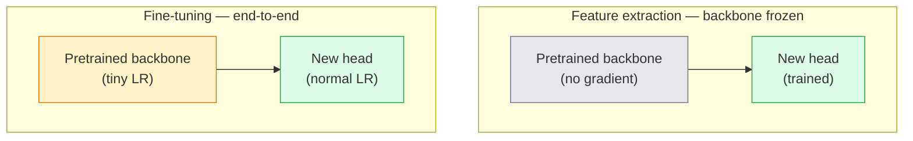

# Transferir aprendizagem e ajuste perfeito

> Outro passou um milhão de horas de GPU a ensinar uma rede como são as bordas, as texturas e as partes de objetos.

> **【中文解读】**别人花了一百万 GPU 小时教会网络识别边缘、纹理和物件部件── você deve primeiro emprestar essas características antes de treinar seu próprio modelo──迁移学习 é a técnica mais prática na engenharia de IA预训骨干 +自定义分类头 = 几行代码就能解决新任务──

> **【拓展：迁移学习在工业界的应用】**Quase todos os sistemas de produção de vídeo usam a migração de aprendizagem: imagem médica, mas a modificação precisa de apenas alguns minutos.

**Type:** Build | **类型:** 动手
**Languages:** Python | **语言:** Python
**Prerequisites:** Phase 4 Lesson 03 (CNNs), Phase 4 Lesson 04 (Image Classification) | **前置知识:** Phase 4 Lesson 03（CNN），Phase 4 Lesson 04（图像分类）
**Time:** ~75 minutes | **时间:** ~75 分钟

## Objetivos de aprendizagem

- Distinguir a extração de recursos do ajuste fino e escolher o certo com base no tamanho do conjunto de dados, distância de domínio e orçamento de computação
- Carregar uma espinha dorsal pré-entrenada, substituir a cabeça do classificador e treinar apenas a cabeça para uma linha de base de trabalho em menos de 20 linhas
- Descongelar progressivamente as camadas com taxas de aprendizagem discriminatórias para que os recursos genéricos iniciais recebam atualizações menores do que as específicas de tarefas tardías
- Diagnóstico das três falhas comuns: derivação de características de LR muito alto em blocos não congelados, colapso das estatísticas BN em conjuntos de dados minúsculos e esquecimento catastrófico

> **【中文解读】**O objetivo do aprendizado é listar as capacidades centrais que devem ser adquiridas após a conclusão do curso.


## O problema é o problema da introdução

O treinamento de um ResNet-50 na ImageNet custa cerca de 2.000 horas de GPU. Poucas equipes têm esse orçamento para cada tarefa que enviam. O que quase todas as equipes realmente enviam é uma espinha dorsal pré-entrenada com uma nova cabeça treinada em algumas centenas ou alguns milhares de imagens específicas de tarefas.

> Em ImageNet, o treinamento ResNet-50 requer cerca de 2000 GPUs. Poucas equipes têm orçamento para cada entrega de tarefas.

> **【中文解读】**A partir do zero, o ResNet-50 precisa de ~2000 GPUs por hora, mas a migração requer apenas alguns minutos.

Isto não é um atalho. O primeiro bloco de convecção de qualquer CNN treinado pela ImageNet aprende bordas e filtros como Gabor. Os próximos blocos aprendem texturas e motivos simples. Os blocos do meio aprendem partes de objetos. Os blocos finais aprendem combinações que começam a parecer-se com as 1.000 categorias da ImageNet. A primeira 90% dessa hierarquia transfere quase inalterada para a imagem médica, inspecção industrial, dados de satélite e todas as outras tarefas de visão  porque a natureza tem um vocabulário limitado de bordas e texturas. Os últimos 10% são o que realmente treinas.

> Não é um atalho. Qualquer um dos primeiros blocos de aprendizagem de bordas e categorias da CNN treinado na ImageNet Gabor 波器. Em seguida, alguns blocos de aprendizagem de bordas e categorias são simples.

A transferência de dados tem três erros à sua espera: destruir recursos pré-treinados com uma taxa de aprendizagem muito alta, deixar o modelo de informação passar de fome congelado demais e deixar que as estatísticas em execução do BatchNorm se afundem em direção a um conjunto de dados minúsculo que o resto da rede nunca aprendeu.

> Há três bugs em sua espera: usar taxas de aprendizagem excessivas para destruir características de treinamento prévio, acabar com demasiadas para causar falta de informações sobre o modelo, fazer com que a estatística de execução do BatchNorm se desloque para uma rede, o resto do conjunto de dados que nunca aprendiu.

> **【中文解读】**迁移学习最常见的三个坑:(1) O índice de aprendizagem muito alto destruiu as características do pre-entrenamento;(2) 结太多层导致模型不合适;(3) BatchNorm's statistics are漂移在小数据集──本课逐步踩坑并给出解决方案──

## O conceito central.

> **【中文解读】**Este capítulo apresenta os conceitos e teorias fundamentais.


### Extração de características versus ajuste fino

Dois regimes, escolhidos por quanto você confia nas características pré-treinadas e quanto dados você tem.

>  2 tipos de soluções, dependendo da sua confiança e da quantidade de dados que você tem



Regras de execução:

> 经验法则:

| Dataset size / 数据量 | Domain distance / 领域距离 | Recipe / 方案 |
|--------------|-----------------|--------|
| < 1k images | close to ImageNet / 接近 ImageNet | Freeze backbone, train head only / 冻结骨干，只训头部 |
| 1k-10k | close / 接近 | Freeze first 2-3 stages, fine-tune the rest / 冻结前2-3阶段，微调其余 |
| 10k-100k | any / 任意 | Fine-tune end-to-end with discriminative LR / 用判别性学习率端到端微调 |
| 100k+ | far / 远 | Fine-tune everything; consider training from scratch if domain is far enough / 全量微调；领域足够远则考虑从头训练 |

"Closer à ImageNet" significa aproximadamente fotos naturais RGB com conteúdo semelhante a objetos.

> "Cerca da ImageNet" significa "RGB" de imagens naturais com conteúdo obtido.

> **【拓展：迁移学习策略选择】**Na prática industrial, a dimensão e a distância dos conjuntos de dados determinaram a estratégia de migração: < 1k de dados e com a imagem de rede  aproximada de um corpo de formação; 10k + de dados sobre a quantidade total de micro-moduos ; imagens médicas ; satélites ; gráficos de satélites ; etc.

### Por que o congelamento funciona ?

A ImageNet apresenta uma CNN que descobre que não se especializam nas 1.000 categorias. Eles são especializados na estatística das imagens naturais: bordas em orientações específicas, texturas, padrões de contraste, formas primitivas. Essas estatísticas são estáveis em quase todos os domínios visuais que um ser humano pode nomear. É por isso que um modelo treinado na ImageNet e avaliado em tiro zero no CIFAR-10 com apenas uma nova cabeça linear (sem ajuste fino da coluna vertebral) atinge uma precisão de 80%+. A cabeça está a aprender quais das características já aprendidas devem ser pesadas para esta tarefa.

> As características da ImageNet aprendidas pela CNN não se dedicam a 1000 categorias. Eles se dedicam às características estatísticas das imagens naturais: margens, texturas, modelos de comparação, formas e bases de imagem em direções específicas. Estas características estatísticas são estáveis em quase todos os campos visuais humanos que podem ser nomeados. É por isso que um modelo treinado na ImageNet, apenas usando um novo teste linear (em rede de base não micro-regular) na CIFAR-10 pode alcançar 80% + de precisão na avaliação de amostras.

### Taxas de aprendizagem discriminatórias

Quando você descongelar, as camadas iniciais devem treinar mais lentamente do que as camadas posteriores.

> Quando você se resolve, a fase inicial deve treinar mais lentamente do que a fase final.

```
Typical recipe:

  stage 0 (stem + first group): lr = base_lr / 100    (mostly fixed)
  stage 1:                       lr = base_lr / 10
  stage 2:                       lr = base_lr / 3
  stage 3 (last backbone group): lr = base_lr
  head:                          lr = base_lr  (or slightly higher)
```

Em PyTorch, esta é apenas uma lista de grupos de parâmetros passados ao optimizador. Um modelo, cinco taxas de aprendizagem, zero código extra.

> No PyTorch, isso é apenas transmitido para o optimizador para o parâmetro de um modelo, cinco taxas de aprendizagem, zero código extra.

### O problema BatchNorm

As camadas BN mantêm`running_mean`E ...`running_var`Os buffers que foram calculados na ImageNet. Se a sua tarefa tem uma distribuição de píxeles diferente  diferentes iluminação, sensor diferente, espaço de cores diferente  esses buffers estão errados. Três opções em ordem de preferência:

> BN 层持有在 ImageNet 上计算的 `running_mean`和 `running_var`缓冲区── Se a sua tarefa tem diferentes distribuições de imagem diferentes luzes diferentes sensores diferentes cores de espaço aqueles缓冲区 é errado

1. **Fine-tune with BN in train mode.**Deixar que a BN actualize as suas estatísticas de execução junto com tudo o mais.
2. **Freeze BN in eval mode.**Mantenha as estatísticas da ImageNet e treine apenas os pesos.
3. **Replace BN with GroupNorm.**Remove o problema da média móvel completamente. usado em espinha dorsal de detecção e segmentação onde o tamanho do lote por GPU é pequeno.

O erro de fazer isso silenciosamente aumenta a precisão em 5-15%.

> 弄错这个会静默地降低 5-15% 的准确率──

### Design da cabeça

A cabeça do classificador é de 1-3 camadas lineares mais um desvio opcional.

> O cabeçalho do dispositivo é de 1 a 3 个线性层加一个可选的 dropout. Cada torchvision 骨干网络都附带一个你替换的默认头部:

```
backbone.fc = nn.Linear(backbone.fc.in_features, num_classes)          # ResNet
backbone.classifier[1] = nn.Linear(..., num_classes)                    # EfficientNet, MobileNet
backbone.heads.head = nn.Linear(..., num_classes)                       # torchvision ViT
```

Para pequenos conjuntos de dados, uma única camada linear é geralmente suficiente. Adicionar uma camada oculta (Linear -> ReLU -> Dropout -> Linear) ajuda quando a distribuição de tarefas está mais longe da distribuição de treinamento da espinha dorsal.

> Para pequenos conjuntos de dados, uma única linha de dados é geralmente suficiente. Quando a diferença entre a distribuição de tarefas e a distribuição de treinamento da rede de troncos é maior, adicionar uma camada oculta (Linear -> ReLU -> Dropout -> Linear) será útil.

### Desintegração de LR por camadas

Uma versão mais suave do LR discriminativo usado em afinamentos modernos (BEiT, DINOv2, ViT-B). Em vez de agrupar camadas em fases, dar a cada camada um LR ligeiramente menor do que o acima:

> 现代微调 (BeiT, DINOv2, ViT-B,微调) é uma versão mais simples da taxa de aprendizagem de diferença usada em diferentes fases.

```
lr_layer_k = base_lr * decay^(L - k)
```

Com decomposição = 0,75 e L = 12 blocos de transformador, os primeiros blocos de trens em`0.75^11 ≈ 0.04x`É mais importante para transformer de tons finos do que para as CNNs, onde as LR agrupadas em estágio são geralmente suficientes.

> Quando decadência = 0,75 e L = 12 blocos de transformador, o primeiro bloco tem a taxa de aprendizagem de cabeça.`0.75^11 ≈ 0.04x`                                                                                                                                                                                                                                                              

### O que avaliar

As corridas de transferência de aprendizagem precisam de dois números que não seguiriam numa corrida de arranhão:

- **Pretrained-only accuracy**A precisão da cabeça com a espinha congelada.
- **Fine-tuned accuracy**O mesmo modelo após o treinamento de ponta a ponta.

Se o ajustado é menos que o pré-treinado, você tem uma taxa de aprendizagem ou um erro BN.

> **【中文解读】**Este é um método de "desde zero" que ajuda a entender o princípio da estrutura, não é um problema que se encontra em uma caixa negra.

> **【拓展：工业部署中的视觉系统】**No implementar industrial real, o modelo visual precisa considerar a possibilidade de atrasos, modelos de tamanho, dispositivos de margem, etc. TensorRT, ONNX Runtime, OpenVINO são ferramentas de aceleração de cálculo de uso comum.


## Construí-lo e realizei-o.
```figure
transfer-learning
```

## Construí-lo

### Passo 1: Carregar uma coluna vertebral pré-treinada e inspecioná-la

```python
import torch
import torch.nn as nn
from torchvision.models import resnet18, ResNet18_Weights

backbone = resnet18(weights=ResNet18_Weights.IMAGENET1K_V1)
print(backbone)
print()
print("classifier head:", backbone.fc)
print("feature dim:", backbone.fc.in_features)
```

`ResNet18`tem quatro fases (`layer1..layer4`) mais um tronco e um`fc`Cada coluna vertebral de classificação de torchvision tem uma estrutura análoga.

### Passo 2: Extração de características  congelar tudo, substituir a cabeça

```python
def make_feature_extractor(num_classes=10):
    model = resnet18(weights=ResNet18_Weights.IMAGENET1K_V1)
    for p in model.parameters():
        p.requires_grad = False
    model.fc = nn.Linear(model.fc.in_features, num_classes)
    return model

model = make_feature_extractor(num_classes=10)
trainable = sum(p.numel() for p in model.parameters() if p.requires_grad)
frozen = sum(p.numel() for p in model.parameters() if not p.requires_grad)
print(f"trainable: {trainable:>10,}")
print(f"frozen:    {frozen:>10,}")
```

Só .`model.fc`A espinha dorsal é um extractor de características congeladas.

### Passo 3: Ajuste discriminatório

Um utilitário que constrói grupos de parâmetros com taxas de aprendizagem específicas de estágio.

```python
def discriminative_param_groups(model, base_lr=1e-3, decay=0.3):
    stages = [
        ["conv1", "bn1"],
        ["layer1"],
        ["layer2"],
        ["layer3"],
        ["layer4"],
        ["fc"],
    ]
    groups = []
    for i, names in enumerate(stages):
        lr = base_lr * (decay ** (len(stages) - 1 - i))
        params = [p for n, p in model.named_parameters()
                  if any(n.startswith(k) for k in names)]
        if params:
            groups.append({"params": params, "lr": lr, "name": "_".join(names)})
    return groups

model = resnet18(weights=ResNet18_Weights.IMAGENET1K_V1)
model.fc = nn.Linear(model.fc.in_features, 10)
for p in model.parameters():
    p.requires_grad = True

groups = discriminative_param_groups(model)
for g in groups:
    print(f"{g['name']:>10s}  lr={g['lr']:.2e}  params={sum(p.numel() for p in g['params']):>8,}")
```

`decay=0.3`significa cada etapa de um comboio a 30% da velocidade do próximo. `fc`- Não .`base_lr`- Não .`layer4`- Não .`0.3 * base_lr`- Não .`conv1`- Não .`0.3^5 * base_lr ≈ 0.00243 * base_lr`Sonoridade extrema, empírica funciona.

### Passo 4: Manutenção de batches

Ajudar a congelar as estatísticas de execução da BN sem congelar os seus pesos.

```python
def freeze_bn_stats(model):
    for m in model.modules():
        if isinstance(m, (nn.BatchNorm1d, nn.BatchNorm2d, nn.BatchNorm3d)):
            m.eval()
            for p in m.parameters():
                p.requires_grad = False
    return model
```

Chama-o depois de ter começado .`model.train()`No início de cada época.`model.train()`O sistema de formação de base de base de base de base de base de base de base de base de base de base de base de base de base de base de base de base de base de base de base de base de base de base de base de base de base de base de base de base de base de base de base de base de base de base de base de base de base de base de base de base de base de base de base de base de base de base de base de base de base de base de base de base de base de base de base de base de base de base de base de base de base de base de base de base de base de base de base de base de base de base de base de base de base de base de base de base de base de base de base de base de base de base de base de base de base de base de base de base de base de base de base de base de base de base de base de base de base de base de base de base de base de base de base de base de base de base de base de base de base de base de base de base de base de base de base de base de base de base de base de base de base de base de base de base de base de base de base de base de base de base de base de base de base de base de base de base de base de base de base de base de base de base de base de base de base de base de base de base de base de base de base de base de base de base de base de base de base de base de base de base de base de base de base de base de base de base de base de base de base de base de base de base de base de base de base de base de base de base de base de base de base de base de base de base de base de base de base de base de base de base de base de base de base de base de base de base de base de base de base de base de base de base de base de base de base de base de base de base de base de base de base de base de base de base de base de base de base de base de base de base de base de base de base de base de base de base de base de base de base de base de base de base de base de base de base de base de base de base de base de base de base de base de base de base de base de base de base de base de base de base de base de base de base

### Passo 5: Um ciclo mínimo de ajuste fino de ponta a ponta

```python
from torch.optim import SGD
from torch.utils.data import DataLoader
from torch.optim.lr_scheduler import CosineAnnealingLR
import torch.nn.functional as F

def fine_tune(model, train_loader, val_loader, device, epochs=5, base_lr=1e-3, freeze_bn=False):
    model = model.to(device)
    groups = discriminative_param_groups(model, base_lr=base_lr)
    optimizer = SGD(groups, momentum=0.9, weight_decay=1e-4, nesterov=True)
    scheduler = CosineAnnealingLR(optimizer, T_max=epochs)

    for epoch in range(epochs):
        model.train()
        if freeze_bn:
            freeze_bn_stats(model)
        tr_loss, tr_correct, tr_total = 0.0, 0, 0
        for x, y in train_loader:
            x, y = x.to(device), y.to(device)
            logits = model(x)
            loss = F.cross_entropy(logits, y, label_smoothing=0.1)
            optimizer.zero_grad()
            loss.backward()
            optimizer.step()
            tr_loss += loss.item() * x.size(0)
            tr_total += x.size(0)
            tr_correct += (logits.argmax(-1) == y).sum().item()
        scheduler.step()

        model.eval()
        va_total, va_correct = 0, 0
        with torch.no_grad():
            for x, y in val_loader:
                x, y = x.to(device), y.to(device)
                pred = model(x).argmax(-1)
                va_total += x.size(0)
                va_correct += (pred == y).sum().item()
        print(f"epoch {epoch}  train {tr_loss/tr_total:.3f}/{tr_correct/tr_total:.3f}  "
              f"val {va_correct/va_total:.3f}")
    return model
```

Cinco épocas com a receita acima do CIFAR-10 são necessárias `ResNet18-IMAGENET1K_V1`A cabeça sozinha se estabilizaria em torno de 86% sem tocar a espinha dorsal.

### Passo 6: Descongelamento progressivo

Um cronograma que descongela uma fase por época do fim ao início.

```python
def progressive_unfreeze_schedule(model):
    stages = ["layer4", "layer3", "layer2", "layer1"]
    yielded = set()

    def start():
        for p in model.parameters():
            p.requires_grad = False
        for p in model.fc.parameters():
            p.requires_grad = True

    def unfreeze(epoch):
        if epoch < len(stages):
            name = stages[epoch]
            yielded.add(name)
            for n, p in model.named_parameters():
                if n.startswith(name):
                    p.requires_grad = True
            return name
        return None

    return start, unfreeze
```

Liga-me .`start()`Uma vez antes da primeira época.`unfreeze(epoch)`Reconstrua o optimizador sempre que o conjunto de parâmetros treinables mudar, caso contrário os parâmetros congelados ainda mantêm momentos em cache que o confundem.


## Use-o com o framework implementado.

> **【中文解读】**Este capítulo mostra como usar um framework maduro (como PyTorch、HuggingFace etc) rápida aplicação desta tecnologia.


Para a maioria das tarefas reais,`torchvision.models`A máquina mais pesada acima importa quando se encontram com os problemas que as bibliotecas padrão não podem resolver.

```python
from torchvision.models import resnet50, ResNet50_Weights

model = resnet50(weights=ResNet50_Weights.IMAGENET1K_V2)
model.fc = nn.Linear(model.fc.in_features, num_classes)
optimizer = torch.optim.AdamW(model.parameters(), lr=1e-4, weight_decay=1e-4)
```

Outras duas deficiências de nível de produção:

- `timm`navios ~ 800 espinhas de visão pré-treinadas com uma API consistente (`timm.create_model("resnet50", pretrained=True, num_classes=10)`Para qualquer melodia fina além do zoológico torchvision, é o padrão.
- Para transformadores, `transformers.AutoModelForImageClassification.from_pretrained(name, num_labels=N)`dá-lhe ViT / BEiT / DeiT com a mesma semântica de carga que os modelos de texto.

> **【中文解读】**Este capítulo se concentra em como o modelo será implantado como produto disponível. De modelo original a nível de produção, os sistemas precisam considerar várias dimensões de otimização de desempenho, tratamento de erros, controle, etc.


> **【拓展：数据标注与质量】** Visual task's effect highly depends on label data quality──Label Studio、CVAT is the mainstream marking tool──In industrial scenarios, proactive learning(Active Learning) pode reduzir o custo de marcação: modelo contra um pedido de amostra não definido marcação artificial, identidade de amostra auto-marcação──

## Envia-o . Produto .

Esta lição produz:

- `outputs/prompt-fine-tune-planner.md` um prompt que escolhe a extração de recursos versus a sintonia progressiva versus finação de ponta a ponta com base no tamanho do conjunto de dados, distância de domínio e orçamento de computação.
- `outputs/skill-freeze-inspector.md` uma habilidade que, dada um modelo PyTorch, informa quais parâmetros são treinables, quais camadas BatchNorm estão em modo eval e se o optimizador está realmente sendo alimentado com os parâmetros treinables.

> **【中文解读】**Practicação de temas de fácil/médio/difícil  3o dificuldade de passagem  Recomendação de completar pelo menos Praça de nível médio Classe difícil  Adaptação a pesquisa profunda ou preparação para o encontro 


## Exercícios.

1. **(Easy | 简单)**Treinar um`ResNet18`A análise de dados de um sistema de transferência de dados de um sistema de transferência de dados de um sistema de transferência de dados de um sistema de transferência de dados de um sistema de transferência de dados de um sistema de transferência de dados de um sistema de transferência de dados de um sistema de transferência de dados de um sistema de transferência de dados de um sistema de transferência de dados de um sistema de transferência de dados de um sistema de transferência de dados de um sistema de transferência de dados de um sistema de transferência de dados de um sistema de transferência de dados de um sistema de transferência de dados de um sistema de transferência de dados de um sistema de transferência de dados de um sistema de transferência de dados de um sistema de transferência de dados de um sistema de transferência de dados de um sistema de transferência de dados de um sistema de transferência de dados de um sistema de transferência de dados de um sistema de transferência de dados de um sistema de transferência de dados de um sistema de transferência de dados de um sistema de transferência de dados de um sistema de transferência de dados de dados de um sistema de transferência de dados de dados de um sistema de dados de dados de dados de um sistema de dados de dados de dados de dados de dados de dados de dados de dados de dados de dados de dados de dados de dados de dados de dados de dados de dados de dados de dados de dados de dados de dados de dados de dados de dados de dados de dados de dados de dados de dados de dados de dados de dados de dados de dados de dados de dados de dados de dados de dados de dados de dados de dados de dados de dados de dados de dados de dados de dados de dados de dados de dados de dados de dados de dados de dados de dados de dados de dados de dados de dados de dados de dados de dados de dados de dados de dados de dados de dados de dados de dados de dados de dados de dados de dados de dados de dados de dados de dados de dados de dados de dados de dados de dados de dados de dados de dados de dados de dados de dados de dados de dados de dados de dados de dados de dados de dados de dados de dados de dados de dados de dados de dados de dados de dados de dados de dados de dados de dados de dados de dados de dados de dados de dados de dados de dados de dados de dados de dados de dados de dados de dados de dados de dados de dados
   Diferença entre as pesquisas de linhação e a formação de ResNet18, em comparação com a taxa de precisão.

2. **(Medium | 中等)**Introduzir um bug de propósito: set `base_lr = 1e-1`A formação de um grupo de homens é uma forma de formação de um grupo de homens que se encontra em um grupo de homens que se encontra em um grupo de homens que se encontra em um grupo de homens que se encontra em um grupo de homens que se encontram em um grupo de homens que se encontram em um grupo de homens que se encontram em um grupo de homens que se encontram em um grupo de homens que se encontram em um grupo de homens que se encontram em um grupo de homens que se encontram em um grupo de homens que se encontram em um grupo de homens que se encontram em um grupo de homens que se encontram em um grupo de mulheres que se encontram em um grupo de homens que se encontram em um grupo de mulheres que se encontram em um grupo de mulheres que se encontram em um grupo de mulheres que se encontram com mulheres.`discriminative_param_groups`Regista a LR em que cada fase começa a divergir.
   Por isso, é preciso que o senhor tenha um plano.`base_lr = 1e-1`Fabricação de bugs, observação de perda de treinamento  Explode, então com a determinação de aprendizagem de recuperação 

3. **(Hard | 困难)**Tomar um conjunto de dados de imagem médica (por exemplo, CheXpert-small, PatchCamelyon ou HAM10000) e comparar três regimes: (a) espinha dorsal congelada + cabeça linear treinada pela ImageNet; (b) end-to-end de sintonia fina treinada pela ImageNet; (c) treinamento de arranhão. Relate precisão e custo de computação para cada um. Em que tamanho de conjunto de dados o treinamento de arranhão se torna competitivo?
   Use medical imagem data set vs. comparar três esquemas: a) 结骨干+线性头; b) 量微调; c) do zero-training;;

## Termos-chave .

| Term | What people say | What it actually means | 中文释义 |
|------|----------------|----------------------|---------|
| Feature extraction | "Freeze and train head" | Backbone parameters frozen, only the new classifier head receives gradient | 特征提取：冻结骨干参数，只训练新的分类头 |
| Fine-tuning | "Retrain end-to-end" | All parameters trainable, usually with much smaller LR than scratch training | 微调：所有参数可训练，学习率远小于从零训练 |
| Discriminative LR | "Smaller LR for early layers" | Optimizer parameter groups where early-stage LR is a fraction of late-stage LR | 判别式学习率：早期层用更小的学习率 |
| Layer-wise LR decay | "Smooth LR gradient" | Per-layer LR multiplied by decay^(L - k); common in transformer fine-tunes | 逐层学习率衰减：每层 LR 乘以衰减系数 |
| Catastrophic forgetting | "The model lost ImageNet" | A too-high LR overwrites pretrained features before the new task signal is learnt | 灾难性遗忘：学习率过高导致预训练特征被覆盖 |
| BN statistics drift | "Running mean is wrong" | BatchNorm running_mean/var computed on a different distribution than the current task, silently hurting accuracy | BN 统计漂移：BatchNorm 的统计量与当前任务分布不匹配 |
| Linear probe | "Frozen backbone + linear head" | Evaluation of pretrained features — accuracy of the best linear classifier on top of the frozen representation | 线性探针：冻结骨干上训练线性分类器，评估预训练特征质量 |
| Catastrophic collapse | "Everything predicts one class" | Happens when fine-tuning with an LR high enough to destroy features before gradients from the head can stabilise | 灾难性崩塌：模型只预测一个类别 |

> **【中文解读】**延伸阅读 fornece recursos de alta qualidade para a aprendizagem profunda.


## Mais leitura 延伸阅读

- [How transferable are features in deep neural networks? (Yosinski et al., 2014)](https://arxiv.org/abs/1411.1792) o papel que quantificou a transferência das características entre as camadas
- [Universal Language Model Fine-tuning (ULMFiT, Howard & Ruder, 2018)](https://arxiv.org/abs/1801.06146) a receita original discriminativa LR / descongelamento progressivo; as ideias transferem-se diretamente para a visão
- [timm documentation](https://huggingface.co/docs/timm) a referência para os espinhos visuais modernos e os defeitos exatos de sintonia fina com os quais foram treinados
- [A Simple Framework for Linear-Probe Evaluation (Kornblith et al., 2019)](https://arxiv.org/abs/1805.08974) por que a precisão da sonda linear é importante e como relatá-la corretamente
