# Detecção de Objetos  YOLO do zero  Objectivo de detecção  Desde zero realizar YOLO

> A detecção é classificação mais regressão, executada em todas as posições de um mapa de características, depois limpa com supressão não máxima.

> **【中文解读】**目標检测 = 分类 + 回归, executar em cada posição do gráfico de características, depois usar o não-极大值抑制 (NMS) para limpar o re-check box.

> **【拓展：YOLO 在自动驾驶中的应用】**O YOLO é o algoritmo de detecção de objetivos em tempo real mais comum em condução automática, capaz de detectar simultaneamente pessoas, veículos, sinais de tráfego, etc. De YOLOv1 a YOLOv8, a velocidade e precisão aumentam continuamente, é um dos frameworks de detecção mais populares da indústria.

**Type:** Build | **类型:** 动手
**Languages:** Python | **语言:** Python
**Prerequisites:** Phase 4 Lesson 03 (CNNs), Phase 4 Lesson 04 (Image Classification), Phase 4 Lesson 05 (Transfer Learning) | **前置知识:** Phase 4 Lesson 03（CNN），Phase 4 Lesson 04（图像分类），Phase 4 Lesson 05（迁移学习）
**Time:** ~75 minutes | **时间:** ~75 分钟

## Objetivos de aprendizagem

- Explique o projeto de grade e âncora que transforma a detecção em um problema de previsão densa e diga o que cada número no tensor de saída significa
- Calcular a intersecção entre as caixas e implementar a supressão não máxima a partir do zero
- Construir uma cabeça de estilo YOLO mínima em cima de uma espinha dorsal pré-entrenada, incluindo a classificação, objetosidade e perdas de regressão de caixa
- Leia uma linha métrica de detecção (precision@0.5, recall, mAP@0.5, mAP@0.5:0.95) e escolha qual botão virar a seguir

> **【中文解读】**O objetivo do aprendizado é listar as capacidades centrais que devem ser adquiridas após a conclusão do curso.


## O problema é o problema da introdução

A classificação diz "esta imagem é um cão". A detecção diz "há um cão em pixels (112, 40, 280, 210), há um gato em (400, 180, 560, 310), e nada mais no quadro". Essa única mudança estrutural  prevendo um número variável de caixas rotuladas em vez de uma etiqueta por imagem  é do que depende todo sistema autônomo, todo produto de vigilância, todo analisador de layout de documentos e cada linha de visão de fábrica.

> O que se pode dizer é que "esta imagem é um cão" e não é que "cada imagem é um rótulo" é que cada sistema de condução automática, cada produto de controle, cada arquivo, o resolvedor e cada linha de produção de imagens de fábrica dependem de qualquer outro tipo de mudança estrutural.

> **【中文解读】**Categoria: "Este quadro é um cão", "Cão está em (112,40,280,210), gato está em (400,180,560,310) ". Esta mudança estrutural é a capacidade central de condução automática, segurança e controle de dados, análise de dados e inspeção de qualidade de fábrica.

A detecção é também onde cada troca de engenharia na visão aparece de uma só vez. Queremos caixas que sejam precisas (cabeça de regressão), queremos a classe certa para cada caixa (cabeça de classificação), queremos que o modelo saiba quando não há nada para detectar (score de objetividade), e queremos exatamente uma previsão por objeto real (suppressão não máxima). Se perder qualquer um destes, o pipeline ou perde objetos, relata caixas alucinadas, ou prevê o mesmo objeto quinze vezes em posições ligeiramente diferentes.

> 检测也是视觉中所有的工程权衡同时出现的地方──你要框准确(回归头),你要每个框的类别正确(分类头),你要模型知道哪里没有什么要检测(目标性分数),你要每个真实物体恰好一个预测(非极大值抑制)──缺少任何一个,流水线要漏检测物体,要报告幻觉框,要把同一物体在微微不同的位置预测十五次──

YOLO (You Only Look Once, Redmon et al. 2016) foi o projeto que fez tudo isso correr em tempo real fazendo-o com uma única passagem para a frente de uma rede de convecção, e as mesmas decisões estruturais ainda são a espinha dorsal dos detectores modernos (YOLOv8, YOLOv9, YOLO-NAS, RT-DETR).

> YOLO(You Only Look Once, Redmon etc 2016) é um projeto de desenvolvimento de uma única estrutura que permite que todas essas operações sejam realizadas em tempo real, e que a mesma estrutura de decisão permaneça como um teste moderno.

> **【中文解读】**检测是视觉中所有工程权衡的交汇点:框要准确 (回归头) 类别要正确 (回归头) 类别要正确 (分类头) 要知道哪里没有物体 (无物体)  检测是视觉中所有工程权衡的交汇点:框要准确 (回归头) 类别要正确 (回归头) 类别要正确 (回归头) 类别要正确 (回归头) 类别要正确 (回归头) 类别要正确 (回归头) 类别) 要知道哪里没有物体 (无物体)  检测)  检测是视觉中所有工程权衡的交汇点:框要准确 (回归头) 类别要正确 (回归头) 类别要正确 (回归头) 类别要正确)  要知道哪里没有物体 (无物体)                                                                                                                                         

## O conceito central.

> **【中文解读】**Este capítulo apresenta os conceitos e teorias fundamentais.


### Detecção como previsão densa

Um classificador produz números C por imagem. Um detector de estilo YOLO produz resultados.`(S x S x (5 + C))`números por imagem, onde S é o tamanho da grade espacial.

> C 个数字――YOLO 风格的检测器每张图像输出 `(S x S x (5 + C))`个数字, em que S é o espaço grande.

```mermaid
flowchart LR
    IMG["Input 416x416 RGB"] --> BB["Backbone<br/>(ResNet, DarkNet, ...)"]
    BB --> FM["Feature map<br/>(C_feat, 13, 13)"]
    FM --> HEAD["Detection head<br/>(1x1 convs)"]
    HEAD --> OUT["Output tensor<br/>(13, 13, B * (5 + C))"]
    OUT --> DEC["Decode<br/>(grid + sigmoid + exp)"]
    DEC --> NMS["Non-max suppression"]
    NMS --> RESULT["Final boxes"]

    style IMG fill:#dbeafe,stroke:#2563eb
    style HEAD fill:#fef3c7,stroke:#d97706
    style NMS fill:#fecaca,stroke:#dc2626
    style RESULT fill:#dcfce7,stroke:#16a34a
```



Cada um dos `S * S`Células de rede prevê `B`Caixas. Para cada caixa:

> Cada um .`S * S`网格单元预测 `B`个框──对于每个框:

- 4 números descrevem a geometria: `tx, ty, tw, th`- Não .
  Tradução do inglês:`tx, ty, tw, th`(centro de movimento e largura de aumento)
- 1 é o resultado da objetividade: "há um objeto centrado nesta célula?"
  Chinese Translation: 1 个数字是目标性分数:" Esse centro de unidades tem algum objeto?"
- Os números C são probabilidades de classe.
  C 个数字是类别概率──

Total por célula: `B * (5 + C)`Para VOC com `S=13, B=2, C=20`, que é 50 números por célula.

> Cada unidade total:`B * (5 + C)` Para os dados de COV,`S=13, B=2, C=20`, isto é, cada unidade 50 números.

### Por que redes e âncoras

A regressão simples predizia`(x, y, w, h)`Para cada objeto como uma coordenada absoluta. Isso é difícil para uma rede conv porque traduzir a imagem não deve traduzir todas as previsões pela mesma quantidade  cada objeto está ancorado espacialmente. A grade responde a isso atribuindo cada caixa de verdade base à célula da grade em que seu centro cai; apenas essa célula é responsável por esse objeto.

> Puramente, voltará a tirar todos os objetos.`(x, y, w, h)`Como um estágio absoluto para prever. Isto é muito difícil para uma rede de volumes, pois as imagens em plano não devem colocar todas as previsões em plano da mesma quantidade. Cada objeto no espaço é independente.

Os ancores resolvem um segundo problema. Uma conveção 3x3 não pode facilmente regressar uma caixa de 500 pixels de largura para fora de uma célula de campo receptor de 16 pixels.`B`O modelo aprende a escolher a âncora certa e a empurrá-la em vez de regredir do nada.

> 框解决了第二个问题──3x3 卷积很难从16 像素感受野的特征单元归归归到500 像素宽的框──因此, nós definimos cada unidade de forma pré-definida `B`个先验框形 (?? 框),并预测对每个框的小偏移量──模型学习选择正确的框并微调,而不是从零回归──

```
Anchor box priors (example for 416x416 input):

  small:   (30,  60)
  medium:  (75,  170)
  large:   (200, 380)

At each grid cell, every anchor emits (tx, ty, tw, th, obj, c_1, ..., c_C).
```

Os detectores modernos geralmente usam FPN com diferentes conjuntos de âncoras por resolução.

> Os testadores modernos usam normalmente FPN (FPN), em diferentes resoluções, diferentes conjuntos de quadros, com pequenas quadros, profundos quadros, com grandes quadros, mais dimensões, mais dimensões, mais dimensões, mais dimensões, mais dimensões e mais dimensões.

### Previsões de decodificação

O cru`tx, ty, tw, th`Não são coordenadas de caixa; são alvos de regressão a transformar antes do desenho:

> Originário`tx, ty, tw, th`Não são quadros; eles são necessários em um plano de mudança de retorno objetivo:

```
centre x  = (sigmoid(tx) + cell_x) * stride
centre y  = (sigmoid(ty) + cell_y) * stride
width     = anchor_w * exp(tw)
height    = anchor_h * exp(th)
```

`sigmoid`mantém os deslocamentos centrais dentro da célula. `exp`permite que a escala de largura livre da âncora sem um sinal de virar. `stride`Esta etapa de decodificação é a mesma em todas as versões do YOLO desde v2.

> `sigmoid`O desvio do centro será limitado a unidades.`exp`让宽度可以从框自由缩放而无需符号翻转.`stride`将网格坐标缩放回像素──这个解码步骤从YOLOv2 开始在所有YOLO 版本中都相同──

### IU

Metrica de semelhança universal de detecção entre duas caixas:

> 检测中两个框之间的通用相似度度度:

```
IoU(A, B) = area(A intersect B) / area(A union B)
```

IoU = 1 significa idêntico; IoU = 0 significa que não há sobreposição. IoU entre a previsão e a caixa de verdade base é o que decide se uma previsão conta como um verdadeiro positivo (tipicamente IoU > = 0,5).

> IoU = 1 mostra completamente igual; IoU = 0 mostra completamente não sobreposto.

### Repressão não máxima

Uma rede de convecção treinada em âncoras adjacentes muitas vezes prevê caixas sobrepostas para o mesmo objeto.

> A rede de volumes treinada em quadros próximos geralmente prevê vários quadros sobrepostos no mesmo objeto. O NMS mantém a previsão de máxima confiança, e elimina com essa previsão qualquer outra previsão que ultrapasse o valor de IoU.

```
NMS(boxes, scores, iou_threshold):
    sort boxes by score descending
    keep = []
    while boxes not empty:
        pick the top-scoring box, add to keep
        remove every box with IoU > iou_threshold to the picked box
    return keep
```

Limite de detecção de objetos: 0,45 para detecção de objetos.`soft-NMS`- Não .`DIoU-NMS`, ou aprender a supressão diretamente (RT-DETR), mas o propósito estrutural é o mesmo.

> 典型值:目标检测用 0.45──最近检测器用 `soft-NMS`- Não.`DIoU-NMS`替代标准 NMS,或直接学习抑制策略 (RT-DETR), mas o objetivo estrutural é o mesmo.

### A perda

A perda de YOLO é três perdas adicionadas com pesos:

> YOLO                                                                                                                                                                                                                                                                                                                                                                                                                                                                                                                            

```
L = lambda_coord * L_box(pred, target, where obj=1)
  + lambda_obj   * L_obj(pred, 1,     where obj=1)
  + lambda_noobj * L_obj(pred, 0,     where obj=0)
  + lambda_cls   * L_cls(pred, target, where obj=1)
```

As células sem objetos contribuem apenas para a perda de objetosidade (ensinar o modelo a ficar em silêncio). `lambda_noobj`É geralmente pequeno (~0,5) porque a grande maioria das células está vazia e, de outra forma, dominaria a perda total.

>  só unidades de objetos que contêm contribuem para a regressão ao quadro e para a classificação de perdas`lambda_noobj`Normalmente muito pequeno (cerca de 0,5), porque a maioria das unidades é vazia, caso contrário, irá dominar a perda total.

As variantes modernas trocam a perda de caixa MSE por CIoU / DIoU (que otimiza a IoU diretamente), usam a perda focal para desequilíbrio de classe e equilibrar objetividade com perda focal de qualidade.

> 现代变体用 CIoU/DIoU(直接优化 IoU) substituição MSE 框损失,用焦失处理类别不平衡,用质量焦失平衡目标性──三组件结构不变──

### Metricas de detecção

A precisão não se transfere para a detecção.

> 准确率 não é aplicável ao teste.

- **Precision@IoU=0.5** das previsões contadas como positivas, quantas são realmente corretas.
  Tradução:**Precision@IoU=0.5** Em previsões de que é verdade, há muitas que são verdadeiras.
- **Recall@IoU=0.5**- dos objetos reais, quantos encontrámos.
  Tradução:**Recall@IoU=0.5**Entre todos os objetos reais, encontrámos o que era.
- **AP@0.5** Área da curva de recomposição de precisão no limiar de UIO 0,5; um número por classe.
  Tradução:**AP@0.5** IoU 值 0.5 下的精确率-召回率曲线面积;每个类别一个数――
- **mAP@0.5:0.95** média de AP sobre os limiares de IUI 0,5, 0,55, ..., 0,95.
  Tradução:**mAP@0.5:0.95** AP em IoU valor 0,5、0.55、...、0.95                                                                                                                                                                                                                                                      

Relatar os quatro. Um detector que é forte em mAP@0.5 mas fraco em mAP@0.5:0.95 está localizando grosseiramente mas não fortemente; fixa com melhor perda de regressão de caixa. Um detector com alta precisão e baixa recuperação é muito conservador; reduzir o limiar de confiança ou aumentar o peso de objetividade.

> 報告全部四指標── um em mAP@0.5 上强但在 mAP@0.5:0.95 上弱的检测器定位粗略但不精确; use a melhor框回归损失来修复── um testeiro de alta precisão baixa recuperação muito conservador; reduzir a confiança值或增加目标性权重──

> **【拓展：工业部署中的视觉系统】**No implementar industrial real, o modelo visual precisa considerar a possibilidade de atrasos, modelos de tamanho, dispositivos de margem, etc. TensorRT, ONNX Runtime, OpenVINO são ferramentas de aceleração de cálculo de uso comum.

> **【拓展：数据标注与质量】** Visual task's effect highly depends on label data quality──Label Studio、CVAT is the mainstream marking tool──In industrial scenarios, proactive learning(Active Learning) pode reduzir o custo de marcação: modelo contra um pedido de amostra não definido marcação artificial, identidade de amostra auto-marcação──


## Construí-lo e realizei-o.

> **【中文解读】**Este é um método de "desde zero" que ajuda a entender o princípio da estrutura, não é um problema que se encontra em uma caixa negra.

```figure
object-detection-nms
```

## Construí-lo

### Passo 1:

O cavalo de trabalho de toda a aula.`(x1, y1, x2, y2)`formato.

> O principal instrumento deste curso é o tratamento dos dois grupos.`(x1, y1, x2, y2)`格式的框──

```python
import numpy as np

def box_iou(boxes_a, boxes_b):
    ax1, ay1, ax2, ay2 = boxes_a[:, 0], boxes_a[:, 1], boxes_a[:, 2], boxes_a[:, 3]
    bx1, by1, bx2, by2 = boxes_b[:, 0], boxes_b[:, 1], boxes_b[:, 2], boxes_b[:, 3]

    inter_x1 = np.maximum(ax1[:, None], bx1[None, :])
    inter_y1 = np.maximum(ay1[:, None], by1[None, :])
    inter_x2 = np.minimum(ax2[:, None], bx2[None, :])
    inter_y2 = np.minimum(ay2[:, None], by2[None, :])

    inter_w = np.clip(inter_x2 - inter_x1, 0, None)
    inter_h = np.clip(inter_y2 - inter_y1, 0, None)
    inter = inter_w * inter_h

    area_a = (ax2 - ax1) * (ay2 - ay1)
    area_b = (bx2 - bx1) * (by2 - by1)
    union = area_a[:, None] + area_b[None, :] - inter
    return inter / np.clip(union, 1e-8, None)
```

Retorna um `(N_a, N_b)`Matrix de IUs em par. Use-o contra uma única caixa de verdade de base, fazendo uma das matrizes de forma `(1, 4)`- Não .

>  Retorno `(N_a, N_b)`De forma a que a massa de um dos dois eixos seja definida como um`(1, 4)`形形即可对单个真实框使用──

### Passo 2: Repressão não máxima

```python
def nms(boxes, scores, iou_threshold=0.45):
    order = np.argsort(-scores)
    keep = []
    while len(order) > 0:
        i = order[0]
        keep.append(i)
        if len(order) == 1:
            break
        rest = order[1:]
        ious = box_iou(boxes[[i]], boxes[rest])[0]
        order = rest[ious <= iou_threshold]
    return np.array(keep, dtype=np.int64)
```

Determinista.`O(N log N)`O que é que é o comportamento de um homem?`torchvision.ops.nms`sobre insumos idênticos.

> 确定性的,排序复杂度 `O(N log N)`, em igual entrada`torchvision.ops.nms`De comportamento consistente.

### Passo 3: codificação e decodificação de caixa

Converte entre as coordenadas de píxeles e o `(tx, ty, tw, th)`As metas que a rede realmente regressar.

```python
def encode(box_xyxy, cell_x, cell_y, stride, anchor_wh):
    x1, y1, x2, y2 = box_xyxy
    cx = 0.5 * (x1 + x2)
    cy = 0.5 * (y1 + y2)
    w = x2 - x1
    h = y2 - y1
    tx = cx / stride - cell_x
    ty = cy / stride - cell_y
    tw = np.log(w / anchor_wh[0] + 1e-8)
    th = np.log(h / anchor_wh[1] + 1e-8)
    return np.array([tx, ty, tw, th])


def decode(tx_ty_tw_th, cell_x, cell_y, stride, anchor_wh):
    tx, ty, tw, th = tx_ty_tw_th
    cx = (sigmoid(tx) + cell_x) * stride
    cy = (sigmoid(ty) + cell_y) * stride
    w = anchor_wh[0] * np.exp(tw)
    h = anchor_wh[1] * np.exp(th)
    return np.array([cx - w / 2, cy - h / 2, cx + w / 2, cy + h / 2])


def sigmoid(x):
    return 1.0 / (1.0 + np.exp(-x))
```

Teste: codificar uma caixa e depois decodificar  você deve voltar a algo muito próximo do original (até o sigmoide inverso não ser perfeitamente invertível quando `tx`não está na faixa pós- sigmoide).

### Passo 4: Uma cabeça YOLO mínima

Um conv 1x1 num mapa de características, remodelação para `(B, S, S, num_anchors, 5 + C)`- Não .

```python
import torch
import torch.nn as nn

class YOLOHead(nn.Module):
    def __init__(self, in_c, num_anchors, num_classes):
        super().__init__()
        self.num_anchors = num_anchors
        self.num_classes = num_classes
        self.conv = nn.Conv2d(in_c, num_anchors * (5 + num_classes), kernel_size=1)

    def forward(self, x):
        n, _, h, w = x.shape
        y = self.conv(x)
        y = y.view(n, self.num_anchors, 5 + self.num_classes, h, w)
        y = y.permute(0, 3, 4, 1, 2).contiguous()
        return y
```

Forma de saída: `(N, H, W, num_anchors, 5 + C)`A última dimensão é válida .`[tx, ty, tw, th, obj, cls_0, ..., cls_{C-1}]`- Não .

### Passo 5: Associação de Verdades Fundamentais

Para cada caixa de verdade, decide qual.`(cell, anchor)`É responsável.

```python
def assign_targets(boxes_xyxy, classes, anchors, stride, grid_size, num_classes):
    num_anchors = len(anchors)
    target = np.zeros((grid_size, grid_size, num_anchors, 5 + num_classes), dtype=np.float32)
    has_obj = np.zeros((grid_size, grid_size, num_anchors), dtype=bool)

    for box, cls in zip(boxes_xyxy, classes):
        x1, y1, x2, y2 = box
        cx, cy = 0.5 * (x1 + x2), 0.5 * (y1 + y2)
        gx, gy = int(cx / stride), int(cy / stride)
        bw, bh = x2 - x1, y2 - y1

        ious = np.array([
            (min(bw, aw) * min(bh, ah)) / (bw * bh + aw * ah - min(bw, aw) * min(bh, ah))
            for aw, ah in anchors
        ])
        best = int(np.argmax(ious))
        aw, ah = anchors[best]

        target[gy, gx, best, 0] = cx / stride - gx
        target[gy, gx, best, 1] = cy / stride - gy
        target[gy, gx, best, 2] = np.log(bw / aw + 1e-8)
        target[gy, gx, best, 3] = np.log(bh / ah + 1e-8)
        target[gy, gx, best, 4] = 1.0
        target[gy, gx, best, 5 + cls] = 1.0
        has_obj[gy, gx, best] = True
    return target, has_obj
```

A seleção de âncora é "melhor forma IoU com a verdade do solo"  um proxy barato que corresponde à atribuição YOLOv2/v3. v5 e posteriores usam estratégias mais sofisticadas (matching alinhado com tarefas, k dinâmico) que refinam a mesma ideia.

### Passo 6: As três perdas

```python
def yolo_loss(pred, target, has_obj, lambda_coord=5.0, lambda_obj=1.0, lambda_noobj=0.5, lambda_cls=1.0):
    has_obj_t = torch.from_numpy(has_obj).bool()
    target_t = torch.from_numpy(target).float()

    # box-regression loss: only on cells with objects
    box_pred = pred[..., :4][has_obj_t]
    box_true = target_t[..., :4][has_obj_t]
    loss_box = torch.nn.functional.mse_loss(box_pred, box_true, reduction="sum")

    # objectness loss
    obj_pred = pred[..., 4]
    obj_true = target_t[..., 4]
    loss_obj_pos = torch.nn.functional.binary_cross_entropy_with_logits(
        obj_pred[has_obj_t], obj_true[has_obj_t], reduction="sum")
    loss_obj_neg = torch.nn.functional.binary_cross_entropy_with_logits(
        obj_pred[~has_obj_t], obj_true[~has_obj_t], reduction="sum")

    # classification loss on cells with objects
    cls_pred = pred[..., 5:][has_obj_t]
    cls_true = target_t[..., 5:][has_obj_t]
    loss_cls = torch.nn.functional.binary_cross_entropy_with_logits(
        cls_pred, cls_true, reduction="sum")

    total = (lambda_coord * loss_box
             + lambda_obj * loss_obj_pos
             + lambda_noobj * loss_obj_neg
             + lambda_cls * loss_cls)
    return total, {"box": loss_box.item(), "obj_pos": loss_obj_pos.item(),
                   "obj_neg": loss_obj_neg.item(), "cls": loss_cls.item()}
```

Cinco hiperparâmetros que cada tutorial do YOLO codifica ou varre.`lambda_coord=5, lambda_noobj=0.5`O papel original do YOLOv1 e ainda funciona como um padrão razoável.

### Passo 7: Linha de inferência

Decodificar a saída de cabeça bruta, aplicar sigmoid/exp, limiar de objetividade e NMS.

```python
def postprocess(pred_tensor, anchors, stride, img_size, conf_threshold=0.25, iou_threshold=0.45):
    pred = pred_tensor.detach().cpu().numpy()
    grid_h, grid_w = pred.shape[1], pred.shape[2]
    num_anchors = len(anchors)

    boxes, scores, classes = [], [], []
    for gy in range(grid_h):
        for gx in range(grid_w):
            for a in range(num_anchors):
                tx, ty, tw, th, obj, *cls = pred[0, gy, gx, a]
                score = sigmoid(obj) * sigmoid(np.array(cls)).max()
                if score < conf_threshold:
                    continue
                cls_idx = int(np.argmax(cls))
                cx = (sigmoid(tx) + gx) * stride
                cy = (sigmoid(ty) + gy) * stride
                w = anchors[a][0] * np.exp(tw)
                h = anchors[a][1] * np.exp(th)
                boxes.append([cx - w / 2, cy - h / 2, cx + w / 2, cy + h / 2])
                scores.append(float(score))
                classes.append(cls_idx)

    if not boxes:
        return np.zeros((0, 4)), np.zeros((0,)), np.zeros((0,), dtype=int)
    boxes = np.array(boxes)
    scores = np.array(scores)
    classes = np.array(classes)
    keep = nms(boxes, scores, iou_threshold)
    return boxes[keep], scores[keep], classes[keep]
```

> **【中文解读】**Este capítulo mostra como usar um framework maduro (como PyTorch、HuggingFace etc) rápida aplicação desta tecnologia.


É o caminho de avaliação completo: cabeça -> decodificação -> limiar -> NMS.


> **【拓展：视觉模型的持续学习】**Em um ambiente de produção, o modelo visual precisa se adaptar constantemente a novos dados. Isto é especialmente importante na condução automática e no controle de qualidade industrial.

## Use-o com o framework implementado.

`torchvision.models.detection`A construção de um modelo pré-treinado requer três linhas.

```python
import torch
from torchvision.models.detection import fasterrcnn_resnet50_fpn_v2

model = fasterrcnn_resnet50_fpn_v2(weights="DEFAULT")
model.eval()
with torch.no_grad():
    predictions = model([torch.randn(3, 400, 600)])
print(predictions[0].keys())
print(f"boxes:  {predictions[0]['boxes'].shape}")
print(f"scores: {predictions[0]['scores'].shape}")
print(f"labels: {predictions[0]['labels'].shape}")
```

Para canais de inferência em tempo real,`ultralytics`(YOLOv8/v9) é a norma: `from ultralytics import YOLO; model = YOLO('yolov8n.pt'); model(img)`O modelo lida com a decodificação e o NMS internamente e retorna o mesmo `boxes / scores / labels`O triplo que construíste acima.

> **【中文解读】**Este capítulo se concentra em como o modelo será implantado como produto disponível. De modelo original a nível de produção, os sistemas precisam considerar várias dimensões de otimização de desempenho, tratamento de erros, controle, etc.


## Envia-o . Produto .

Esta lição produz:

- `outputs/prompt-detection-metric-reader.md` um aviso que vira um `precision, recall, AP, mAP@0.5:0.95`A linha de diagnóstico é única e o próximo experimento mais útil.
- `outputs/skill-anchor-designer.md` uma habilidade que, dado um conjunto de dados de caixas de verdade fundamental, opera k-media em `(w, h)`e retorna conjuntos de âncoras por nível FPN mais as estatísticas de cobertura que você precisa para escolher o número certo de âncoras.

> **【中文解读】**Practicação de temas de fácil/médio/difícil  3o dificuldade de passagem  Recomendação de completar pelo menos Praça de nível médio Classe difícil  Adaptação a pesquisa profunda ou preparação para o encontro 


## Exercícios.

1. **(Easy | 简单)**Implementação `box_iou`E corrê-lo contra .`torchvision.ops.box_iou`Verifique se a diferença máxima absoluta está abaixo.`1e-6`- Não .
    realização `box_iou`E a realização da torchvision em 1000 em relação ao quadro de correção, verificando o maior erro < 1e-6:.

2. **(Medium | 中等)**Porto `yolo_loss`para uma versão que utiliza `CIoU`O conjunto de dados sintéticos de 100 imagens mostra que o CIoU converge para um mAP@0.5:0.95 final melhor do que o MSE no mesmo número de épocas.
   - Não .`yolo_loss`改为使用CIoU 框损失(替代MSE), em sintetizado conjunto de dados que provam que o CIoU 收到更高的mAP──

3. **(Hard | 困难)**Implementar inferência em várias escalas: alimentar a mesma imagem em três resoluções através do modelo, unir as previsões da caixa e executar um único NMS no final.
   实现多尺度推理: usar três resoluções de separado de inspeção, juntar e fazer um NMS, MAP de medida em comparação com uma única medida 提升──

## Termos-chave .

| Term | What people say | What it actually means | 中文释义 |
|------|----------------|----------------------|---------|
| Anchor | "Box prior" | A pre-defined box shape at each grid cell from which the network predicts deltas instead of absolute coordinates | 锚框：预定义的框形状，网络只预测相对于锚框的偏移量 |
| IoU | "Overlap" | Intersection-over-union of two boxes; the universal similarity measure in detection | IoU：交并比，检测中通用的相似度度量 |
| NMS | "Deduplicate" | Greedy algorithm that keeps highest-score predictions and removes overlapping ones above a threshold | NMS：非极大值抑制，去除重复检测框 |
| Objectness | "Is there something here" | Per-anchor, per-cell scalar predicting whether an object is centred in that cell | 置信度/目标性：预测该位置是否有物体 |
| Grid stride | "Downsample factor" | Pixels per grid cell; a 416-px input with a 13-grid head has stride 32 | 网格步长：每个网格单元对应的像素数 |
| mAP | "Mean average precision" | Average of the area under the precision-recall curve, averaged over classes and (for COCO) IoU thresholds | mAP：平均精度均值，检测的核心评估指标 |
| AP@0.5 | "PASCAL VOC AP" | Average precision with IoU threshold 0.5; the lenient version of the metric | AP@0.5：IoU 阈值 0.5 的平均精度（宽松版） |
| mAP@0.5:0.95 | "COCO AP" | Average over IoU thresholds 0.5..0.95 step 0.05; the strict version and current community standard | mAP@0.5:0.95：多个 IoU 阈值的平均（严格版，COCO 标准） |

> **【中文解读】**延伸阅读 fornece recursos de alta qualidade para a aprendizagem profunda.


## Mais leitura 延伸阅读

- [YOLOv1: You Only Look Once (Redmon et al., 2016)](https://arxiv.org/abs/1506.02640) o papel fundador; cada YOLO desde então é um refinamento desta estrutura
- [YOLOv3 (Redmon & Farhadi, 2018)](https://arxiv.org/abs/1804.02767) o papel que introduziu cabeças de estilo FPN em várias escalas; ainda o diagrama mais claro
- [Ultralytics YOLOv8 docs](https://docs.ultralytics.com) a referência de produção actual; abrange formatos de conjuntos de dados, ampliações, receitas de formação
- [The Illustrated Guide to Object Detection (Jonathan Hui)](https://jonathan-hui.medium.com/object-detection-series-24d03a12f904) melhor passeio em inglês simples pelo zoológico de detectores completos; inestimável para entender como DETR, RetinaNet, FCOS e YOLO se relacionam
