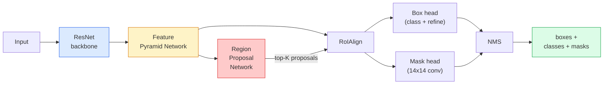

# Segmentação de instâncias  Máscara R-CNN                                                                                                                                                                                                                                                                                                                                                                                                                                                                                                                

> Adicione um pequeno ramo de máscara a um detector R-CNN mais rápido e você tem segmentação de instância.

> **【中文解读】**Em um teste R-CNN mais rápido, se adiciona um subdivisão de esquadrão, obtém-se uma divisão de exemplos. A dificuldade é que o RoIAlign irá fazer uma divisão de casos de diferentes tamanhos para que as áreas candidatas sejam combinadas com uma gráfica de tamanho fixo e mantenham a precisão espacial.

> **【拓展：实例分割的应用】**Mascaras R-CNN  amplamente utilizadas em condução automática 区分不同车辆和行人) 机器人抓取 识别单个物体轮) 视频编辑 精确图)  RoIAlign 技术后来也被用于视觉变换器的适配器中──

**Type:** Build + Learn | **类型:** 动手 + 学习
**Languages:** Python | **语言:** Python
**Prerequisites:** Phase 4 Lesson 06 (YOLO), Phase 4 Lesson 07 (U-Net) | **前置知识:** Phase 4 Lesson 06（YOLO），Phase 4 Lesson 07（U-Net）
**Time:** ~75 minutes | **时间:** ~75 分钟

## Objetivos de aprendizagem

- Rastrear a arquitetura R-CNN de ponta a ponta: espinha dorsal, FPN, RPN, RoIAlign, cabeça de caixa, cabeça de máscara
- Implementar RoIAlign a partir do zero e explicar por que o RoIPool não é mais utilizado
- Use a visão de tocha .`maskrcnn_resnet50_fpn_v2`Modelo pré-treinado para máscaras de instância de qualidade de produção e leitura correta do formato de saída
- Tune-finos Mascar R-CNN em um pequeno conjunto de dados personalizados substituindo a caixa e as cabeças de máscaras e mantendo a coluna vertebral congelada

> **【中文解读】**O objetivo do aprendizado é listar as capacidades centrais que devem ser adquiridas após a conclusão do curso.


## O problema é o problema da introdução

Segmentação semântica dá-lhe uma máscara por classe. Segmentação de instância dá-lhe uma máscara por objeto, mesmo quando dois objetos compartilham uma classe. Contando indivíduos, rastreando através de quadros, e medindo coisas (a caixa de contorno de cada tijolo em uma parede, cada célula em uma imagem do microscópio) todos exigem segmentação de instância.

> 语义分割给你每一类一个掩码――实例分割给你每一个物体一个掩码,即使两个物体属于同一类别――数个体、跨跟踪和测量东西―― cada bloco de uma parede 的边界框、显微镜图像中每个细胞) todos precisam de exemplos divide――

Mask R-CNN (He et al., 2017) resolveu isso reformulaindo a segmentação de instância como detecção-mais-uma-masca. O design foi tão limpo que durante os próximos cinco anos quase todos os documentos de segmentação de instância foram uma variante de Mask R-CNN, e a implementação de torchvision ainda é a padrão de produção para conjuntos de dados pequenos a médios.

> Mascar R-CNN (em 2017) através da redefinição de divisão de exemplos para testar e ocultar para resolver este problema. O design foi tão limpo, que durante os próximos cinco anos quase todos os artigos de divisão de casos foram variantes da Mascar R-CNN, torchvision  realizando ainda é uma escolha padrão de produção de pequenos conjuntos de dados.

O problema difícil da engenharia é a amostragem: como cortar uma região de características de tamanho fixo de uma caixa de propostas cujos cantos não se alinham com os limites dos pixels?

> 困难的工程问题是采样: como você cortar um grande e fixo espaço de características em um quadro de candidaturas de pontos de esquina diferentes da linha de imagem?

## O conceito central.

> **【中文解读】**Este capítulo apresenta os conceitos e teorias fundamentais.


### A arquitetura



Cinco peças para entender:

1. **Backbone** ResNet-50 ou ResNet-101 treinado em ImageNet. Produz uma hierarquia de mapas de recursos em passos 4, 8, 16, 32.
   Tradução do inglês para tradução do inglês: ResNet-50 ou ResNet-101
2. **FPN (Feature Pyramid Network)** ligações laterais de cima para baixo que dão a cada nível C canais de recursos ricos em semântica.
   Tradução do inglês para o inglês: from up and down, for each level provide C 个通道的语义丰富特征──检测时查询与物体大小匹配的 FPN 层级──
3. **RPN (Region Proposal Network)** uma pequena cabeça de convecção que, em cada posição de âncora, prevê "há um objeto aqui?" e "como refinar a caixa?". Produz ~ 1000 propostas por imagem.
   Chinese Translation: 一小的卷积头,在每个点位置预测" Há aqui nenhum objeto?"和"Como corrigir o quadro de limite?"── cada imagem gera cerca de 1000 个候选区──
4. **RoIAlign** amostras de um parche de tamanho fixo (por exemplo, 7x7) de qualquer caixa em qualquer nível de FPN.
   Tradução do inglês para inglês: from any FPN 级别的任意框中采样固定大小(如 7x7) 标签块──双线性采样,无量化──
5. **Heads** cabeça de caixa de duas camadas que refina a caixa e escolhe uma classe, mais uma pequena cabeça de convecção que produz uma `28x28`Mascaras binárias para cada proposta.
   Tradução do inglês para o inglês: two-layer box head for modifying border border box and select class, plus a small roll for each candidate region output `28x28`O segundo valor de cobertura.

### Por que RoIAlign, e não RoIPool

O Fast R-CNN original usou RoIPool, que divide uma caixa de proposta em uma grade, leva o recurso máximo em cada célula e redonda todas as coordenadas em números inteiros.

> O original Fast R-CNN usa RoIPool, que divide o quadro de candidato em rede, pega o maior valor de características de cada elemento, e integra todos os estágios em quadrinhos. Este estágio permite que os gráficos de características e os estágios de entrada possam ser errados até um único gráfico de características.

```
RoIPool:
  box (34.7, 51.3, 98.2, 142.9)
  round -> (34, 51, 98, 142)
  split grid -> round each cell boundary
  misalignment accumulates at every step

RoIAlign:
  box (34.7, 51.3, 98.2, 142.9)
  sample at exact float coordinates using bilinear interpolation
  no rounding anywhere
```

O RoIAlign aumenta a massa AP em 3-4 pontos em COCO gratuitamente.

> RoIAlign em COCO 上免费提升掩码 AP 3-4 个点──每个关心定位精度检测器现在都使用它YOLOv7 seg、RT-DETR、Mask2Former 无一例外──

### A RPN num parágrafo

Em cada posição de um mapa de características, coloque caixas de âncora K de diferentes tamanhos e formas. Previr uma pontuação de objetividade para cada âncora e um deslocamento de regressão para transformar a âncora em uma caixa melhor adequada. Mantenha as caixas superiores por pontuação, aplique NMS em 0,7 IU e entregue os sobreviventes às cabeças. O RPN é treinado com sua própria mini-perda  a mesma estrutura que a perda YOLO da lição 6, apenas com duas classes (objeto / nenhum objeto).

> Em cada posição do gráfico de características coloque K 个 个 个 个 个 个 个 个 个 个 个 个 个 个 个 个 个 个 个 个 个 个 个 个 个 个 个 个 个 个 个 个 个 个 个 个 个 个 个 个 个 个 个 个 个 个 个 个 个 个 个 个 个 个 个 个 个 个 个 个 个 个 个 个 个 个 个 个 个 个 个 个 个 个 个 个 个 个 个 个 个 个 个 个 个 个 个 个 个 个 个 个 个 个 个 个 个 个 个 个 个 个 个 个 个 个 个 个 个 个 个 个 个 个 个 个 个 个 个 个 个 个 个 个 个 个 个 个 个 个 个 个 个 个 个 个 个 个 个 个 个 个 个 个 个 个 个 个 个 个 个 个 个 个 个 个 个 个 个 个 个 个 个 个 个 个 个 个 个 个 个 个 个 个 个 个 个 个 个 个 个 个 个 个 个 个 个 个 个 个 个 个 个 个 个 个 个 个 个 个 个 个 个 个 个 个 个 个 个 个 个 个 个 个 个 个 个 个 个 个 个 个 个 个 个 个 个 个 个 个 个 个 个 个 个 个 个 个 个 个 个 个 个 个 个 个 个 个 个 

### A cabeça da máscara

Para cada proposta (depois do RoIAlign) a cabeça da máscara é uma pequena FCN: quatro convas 3x3, uma deconva 2x, uma conva final 1x1 que produz `num_classes`canais de saída em `28x28`Resolução. Apenas o canal correspondente à classe prevista é mantido; os outros são ignorados.

> 对于每个候选区(RoIAlign 之后),掩码头是一个微小的FCN:四个3x3卷积、一个2x反卷积、一个最终的1x1卷积,在 `28x28`Geração de resolução`num_classes`个输出通道―― apenas reservar as passagens correspondentes às categorias de previsão; as demais passagens são ignoradas―― isto oculta as categorias de previsão e de solução──

Apresenta a máscara de 28x28 para o tamanho original da proposta para produzir a máscara binária final.

> Para obter um esquema de 28x28 ̊, a imagem original da área candidata deve ser de tamanho, para gerar um esquema de valor final.

### Perdas

Mas R-CNN tem quatro perdas adicionadas:

> Mascar R-CNN tem quatro funções de perda adicionadas:

```
L = L_rpn_cls + L_rpn_box + L_box_cls + L_box_reg + L_mask
```

- `L_rpn_cls`- Não .`L_rpn_box` objectividade + regressão de caixa para as propostas de RPN.
  Tradução do inglês para RPN 候选区的目标性和边界框归归损失.
- `L_box_cls` entropia cruzada sobre as classes (C+1) (incluindo o fundo) no classificador da cabeça.
  Tradução do inglês para inglês: 首部分类器上 (C+1) 个类别(含背景) 的交叉损失──
- `L_box_reg` L1 liso no refinamento da caixa da cabeça.
  Tradução do inglês: 头部边界框修正的平滑 L1 损失──
- `L_mask` Entropia binária cruzada por pixel na saída de máscara 28x28.
  Tradução do inglês: 掩码输出上逐像素二元交叉损失

Cada perda tem o seu próprio peso padrão; a implementação da visão de tocha expõe-as como argumentos de construção.

> Cada perda tem seu próprio peso padrão; torchvision  realçar a exposição a ele para a construção de funções parâmetros.

### Formatos de saída

`torchvision.models.detection.maskrcnn_resnet50_fpn_v2`Retorna uma lista de ditos, um por imagem:

```
{
    "boxes":  (N, 4) in (x1, y1, x2, y2) pixel coordinates,
    "labels": (N,) class IDs, 0 = background so indices are 1-based,
    "scores": (N,) confidence scores,
    "masks":  (N, 1, H, W) float masks in [0, 1] — threshold at 0.5 for binary,
}
```

> **【中文解读】**Este é um método de "desde zero" que ajuda a entender o princípio da estrutura, não é um problema que se encontra em uma caixa negra.


A máscara já tem resolução de imagem completa.

> **【拓展：工业部署中的视觉系统】**No implementar industrial real, o modelo visual precisa considerar a possibilidade de atrasos, modelos de tamanho, dispositivos de margem, etc. TensorRT, ONNX Runtime, OpenVINO são ferramentas de aceleração de cálculo de uso comum.

> **【拓展：数据标注与质量】** Visual task's effect highly depends on label data quality──Label Studio、CVAT is the mainstream marking tool──In industrial scenarios, proactive learning(Active Learning) pode reduzir o custo de marcação: modelo contra um pedido de amostra não definido marcação artificial, identidade de amostra auto-marcação──


## Construí-lo e realizei-o.
```figure
cv3-roialign-sampling
```

## Construí-lo

### Passo 1: Alignar a RoIA a partir do zero

Este é o único componente da Mask R-CNN que é mais fácil de entender como código do que como prosa.

> É o único componente da R-CNN mascarada com código mais fácil de entender do que com letras.

```python
import torch
import torch.nn.functional as F

def roi_align_single(feature, box, output_size=7, spatial_scale=1 / 16.0):
    """
    feature: (C, H, W) single-image feature map
    box: (x1, y1, x2, y2) in original image pixel coordinates
    output_size: side of the output grid (7 for box head, 14 for mask head)
    spatial_scale: reciprocal of the feature map stride
    """
    C, H, W = feature.shape
    x1, y1, x2, y2 = [c * spatial_scale - 0.5 for c in box]
    bin_w = (x2 - x1) / output_size
    bin_h = (y2 - y1) / output_size

    grid_y = torch.linspace(y1 + bin_h / 2, y2 - bin_h / 2, output_size)
    grid_x = torch.linspace(x1 + bin_w / 2, x2 - bin_w / 2, output_size)
    yy, xx = torch.meshgrid(grid_y, grid_x, indexing="ij")

    gx = 2 * (xx + 0.5) / W - 1
    gy = 2 * (yy + 0.5) / H - 1
    grid = torch.stack([gx, gy], dim=-1).unsqueeze(0)
    sampled = F.grid_sample(feature.unsqueeze(0), grid, mode="bilinear",
                            align_corners=False)
    return sampled.squeeze(0)
```

Cada número está numa posição bilinearmente amostrada, sem arredondamento, quantização, gradientes baixados.

> Cada valor numérico está localizado em posição binária. Não há quantificação, não há perda de gradiente.

### Passo 2: Comparar com o RoIAlign da torchvision

```python
from torchvision.ops import roi_align

feature = torch.randn(1, 16, 50, 50)
boxes = torch.tensor([[0, 10, 20, 100, 90]], dtype=torch.float32)  # (batch_idx, x1, y1, x2, y2)

ours = roi_align_single(feature[0], boxes[0, 1:].tolist(), output_size=7, spatial_scale=1/4)
theirs = roi_align(feature, boxes, output_size=(7, 7), spatial_scale=1/4, sampling_ratio=1, aligned=True)[0]

print(f"shape ours:   {tuple(ours.shape)}")
print(f"shape theirs: {tuple(theirs.shape)}")
print(f"max|diff|:    {(ours - theirs).abs().max().item():.3e}")
```

Com o`sampling_ratio=1`E ...`aligned=True`, os dois coincidem com dentro .`1e-5`- Não .

> - Não .`sampling_ratio=1`且 `aligned=True`时, diferenças entre os dois `1e-5`É dentro.

### Passo 3: Carregar uma máscara R-CNN pré-treinada

```python
import torch
from torchvision.models.detection import maskrcnn_resnet50_fpn_v2, MaskRCNN_ResNet50_FPN_V2_Weights

model = maskrcnn_resnet50_fpn_v2(weights=MaskRCNN_ResNet50_FPN_V2_Weights.DEFAULT)
model.eval()
print(f"params: {sum(p.numel() for p in model.parameters()):,}")
print(f"classes (including background): {len(model.roi_heads.box_predictor.cls_score.out_features * [0])}")
```

Para a primeira classe (id 0), o modelo detecta tudo o que realmente começa com id 1.

> 46000000参数,91 个类别(COCO)。第一个类别(id 0) 是背景;模型实际检测所有类别从 id 1 开始。

### Passo 4: Execução de inferências

```python
with torch.no_grad():
    x = torch.randn(3, 400, 600)
    predictions = model([x])
p = predictions[0]
print(f"boxes:  {tuple(p['boxes'].shape)}")
print(f"labels: {tuple(p['labels'].shape)}")
print(f"scores: {tuple(p['scores'].shape)}")
print(f"masks:  {tuple(p['masks'].shape)}")
```

O tensor da máscara é forma .`(N, 1, H, W)`Limite de 0,5 para obter uma máscara binária por objeto:

> 掩码张量形为 `(N, 1, H, W)`❖ Obter um subvalor de 0,5 para cada objeto:

```python
binary_masks = (p['masks'] > 0.5).squeeze(1)  # (N, H, W) boolean
```

### Passo 5: Troca as cabeças para uma contagem de classes personalizada

A receita comum de ajuste fino: reutilizar a espinha dorsal, FPN e RPN; substituir as duas cabeças do classificador.

> 常见的微调方案: repetir o uso de redes de base de células, FPN e RPN; substituir dois cabeças de divisão.

```python
from torchvision.models.detection.faster_rcnn import FastRCNNPredictor
from torchvision.models.detection.mask_rcnn import MaskRCNNPredictor

def build_custom_maskrcnn(num_classes):
    model = maskrcnn_resnet50_fpn_v2(weights=MaskRCNN_ResNet50_FPN_V2_Weights.DEFAULT)
    in_features = model.roi_heads.box_predictor.cls_score.in_features
    model.roi_heads.box_predictor = FastRCNNPredictor(in_features, num_classes)
    in_features_mask = model.roi_heads.mask_predictor.conv5_mask.in_channels
    hidden_layer = 256
    model.roi_heads.mask_predictor = MaskRCNNPredictor(in_features_mask, hidden_layer, num_classes)
    return model

custom = build_custom_maskrcnn(num_classes=5)
print(f"custom cls_score.out_features: {custom.roi_heads.box_predictor.cls_score.out_features}")
```

`num_classes`deve incluir a classe de fundo, para que um conjunto de dados com 4 classes de objetos use `num_classes=5`- Não .

> `num_classes` deve conter um contexto de classes, portanto, existem 4 tipos de objetos de dados utilizados `num_classes=5`- Não.

### Passo 6: Congele o que não precisa de treinamento

Em pequenos conjuntos de dados, congelar a espinha dorsal e o FPN. Somente a objetividade RPN + regressão e as duas cabeças aprendem.

> Em pequenos conjuntos de dados, apenas RPN tem objetivos + retorno e os dois principais participantes.

```python
def freeze_backbone_and_fpn(model):
    # torchvision Mask R-CNN packs the FPN inside `model.backbone` (as
    # `model.backbone.fpn`), so iterating `model.backbone.parameters()` covers
    # both the ResNet feature layers and the FPN lateral/output convs.
    for p in model.backbone.parameters():
        p.requires_grad = False
    return model

custom = freeze_backbone_and_fpn(custom)
trainable = sum(p.numel() for p in custom.parameters() if p.requires_grad)
print(f"trainable after freeze: {trainable:,}")
```

> **【中文解读】**Este capítulo mostra como usar um framework maduro (como PyTorch、HuggingFace etc) rápida aplicação desta tecnologia.


Em conjuntos de dados de 500 imagens, esta é a diferença entre convergência e sobreajuste.


> **【拓展：视觉模型的持续学习】**Em um ambiente de produção, o modelo visual precisa se adaptar constantemente a novos dados. Isto é especialmente importante na condução automática e no controle de qualidade industrial.

## Use-o com o framework implementado.

O ciclo de treinamento completo para a Mask R-CNN na torchvision é de 40 linhas e não muda significativamente entre tarefas  swap datasets e go.

```python
def train_step(model, images, targets, optimizer):
    model.train()
    loss_dict = model(images, targets)
    losses = sum(loss for loss in loss_dict.values())
    optimizer.zero_grad()
    losses.backward()
    optimizer.step()
    return {k: v.item() for k, v in loss_dict.items()}
```

O `targets`A lista deve ter dicts por imagem com `boxes`- Não .`labels`, e `masks`(como `(num_instances, H, W)`O modelo retorna um ditado de quatro perdas durante o treinamento e uma lista de previsões durante a avaliação, com teclado em `model.training`- Não .

O `pycocotools`O evaluador produz mAP@IoU=0.5:0.95 tanto para caixas como para máscaras; é necessário ambos os números para saber se a cabeça de caixa ou a cabeça de máscara é o gargalo de engarrafamento.

> **【中文解读】**Este capítulo se concentra em como o modelo será implantado como produto disponível. De modelo original a nível de produção, os sistemas precisam considerar várias dimensões de otimização de desempenho, tratamento de erros, controle, etc.


## Envia-o . Produto .

Esta lição produz:

> **【中文解读】**Practicação de temas de fácil/médio/difícil  3o dificuldade de passagem  Recomendação de completar pelo menos Praça de nível médio Classe difícil  Adaptação a pesquisa profunda ou preparação para o encontro 


- `outputs/prompt-instance-vs-semantic-router.md` um prompt que faz três perguntas e escolhe instância vs semântica vs panóptica, mais o modelo exato para começar.
- `outputs/skill-mask-rcnn-head-swapper.md` uma habilidade que gera as 10 linhas de código para trocar cabeças em qualquer modelo de detecção de torchvision, dada a nova `num_classes`- Não .

## Exercícios.

1. **(Easy)**Verifique o seu RoIAlign contra `torchvision.ops.roi_align`Em 100 caixas aleatórias. Relate a diferença absoluta máxima. Também execute RoIPool (comportamento anterior a 2017) e mostre que diverge por ~1-2 pixels de mapa de características em caixas perto da fronteira.
2. **(Medium)**- A música é perfeita .`maskrcnn_resnet50_fpn_v2`Em um conjunto de dados personalizados de 50 imagens (qualquer duas classes: balões, peixes, poços, logotipos).
3. **(Hard)**Substitua a cabeça de máscara da Mask R-CNN por uma que prevê a 56x56 em vez de 28x28. Messa mAP@IoU = 0,75 antes e depois. Explique por que o ganho (ou falta de um) corresponde ao limite esperado de precisão / câmbio de memória.

> **【中文解读】**No 术语表中的"O que as pessoas dizem" vs "O que realmente significa" 区分日常口语和精确技术含义── em equipe,统一术语定义可以避免大量沟通误解──


## Termos-chave .

| Term | What people say | What it actually means |
|------|----------------|----------------------|
| Mask R-CNN | "Detection plus masks" | Faster R-CNN + a small FCN head that predicts a 28x28 mask per proposal per class |
| FPN | "Feature pyramid" | Top-down + lateral connections that give every stride level C channels of semantic-rich features |
| RPN | "Region proposer" | A small conv head that produces ~1000 object/no-object proposals per image |
| RoIAlign | "No-rounding crop" | Bilinearly samples a fixed-size feature grid from any float-coordinate box |
| RoIPool | "Pre-2017 crop" | Same purpose as RoIAlign but rounds box coordinates; obsolete |
| Mask AP | "Instance mAP" | Average precision computed with mask IoU instead of box IoU; the COCO instance segmentation metric |
| Binary mask head | "Per-class mask" | Predicts one binary mask per class for each proposal; only the predicted class's channel is kept |
| Background class | "Class 0" | The catch-all "no object" class; indices for real classes start at 1 |

> **【中文解读】**延伸阅读 fornece recursos de alta qualidade para a aprendizagem profunda.


## Mais leitura 延伸阅读

- [Mask R-CNN (He et al., 2017)](https://arxiv.org/abs/1703.06870) o artigo; a secção 3 sobre RoIAlign é a leitura crítica
- [FPN: Feature Pyramid Networks (Lin et al., 2017)](https://arxiv.org/abs/1612.03144)O papel FPN; todos os detectores modernos o usam
- [torchvision Mask R-CNN tutorial](https://pytorch.org/tutorials/intermediate/torchvision_tutorial.html) a referência para o ciclo de ajuste fino
- [Detectron2 model zoo](https://github.com/facebookresearch/detectron2/blob/main/MODEL_ZOO.md) Implementações de produção com pesos treinados para quase todas as variantes de detecção e segmentação
