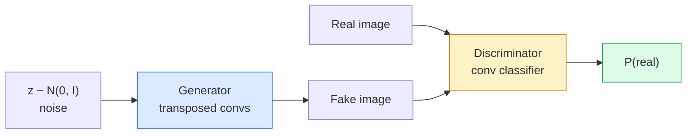
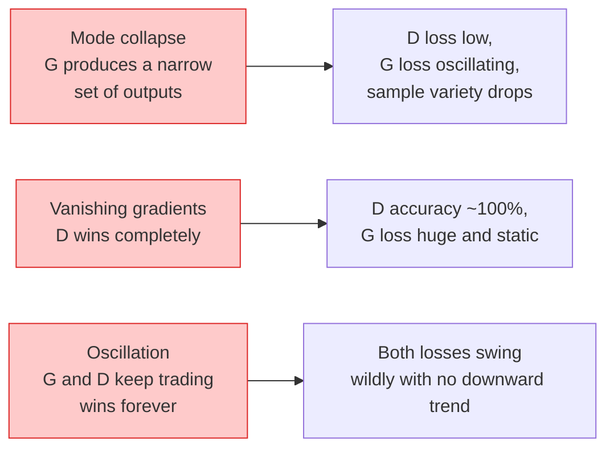

# Geração de imagens GANs Geração de imagens Geração de imagens Geração de imagens Geração de imagens Geração de imagens Geração de imagens Geração de imagens Geração de imagens Geração de imagens Geração de imagens Geração de imagens Geração de imagens Geração de imagens Geração de imagens Geração de imagens Geração de imagens Geração de imagens Geração de imagens Geração de imagens Geração de imagens Geração de imagens Geração de imagens Geração de imagens Geração

> Um GAN é duas redes neurais num jogo fixo, uma empurra, outra critica, que se tornam melhores juntas até que os desenhos enganem o crítico.

> **【中文解读】**GAN(produção contra rede) é um dos dois blocos de rede de neurônios: gerador de imagens, gerador de imagens, gerador de imagens, gerador de imagens, gerador de imagens, gerador de imagens, gerador de imagens, gerador de imagens, gerador de imagens, gerador de imagens, gerador de imagens, gerador de imagens, gerador de imagens, gerador de imagens, gerador de imagens, gerador de imagens, gerador de imagens, gerador de imagens, gerador de imagens, gerador de imagens, gerador de imagens, gerador de imagens, gerador de imagens, gerador de imagens, gerador de imagens, gerador de imagens, gerador de imagens, gerador de imagens, gerador de imagens, gerador de imagens, gerador de imagens, gerador de imagens, gerador de imagens, gerador de imagens, gerador de imagens, gerador de imagens, gerador de imagens, gerador de imagens, gerador de imagens, gerador de imagens, gerador de imagens, gerador de imagens, gerador de imagens, gerador de imagens, gerador de imagens, gerador de imagens, gerador de imagens, gerador de imagens, gerador de imagens, geradores, geradores de imagens, gerentes, gerentes, gerentes, gerentes, gerentes, gerentes, gerentes, gerentes, gerentes, gerentes, gerentes, gerentes, gerentes, gerentes, gerentes, gerentes, gerentes, gerentes, gerentes, gerentes, gerentes, gerentes, gerentes, gerentes, gerentes, gerentes, gerentes, gerentes, gerentes, gerentes, gerentes, gerentes, gerentes, gerentes, gerentes, gerentes, gerentes, gerentes, gerentes, gerentes, gerentes, gerentes, gerentes, gerentes, gerentes, gerentes, gerentes, gerentes, gerentes, gerentes, gerentes, gerentes, gerentes, gerentes, gerentes, gerentes, gerentes, gerentes, gerentes, gerentes, gerentes, gerentes,

> **【拓展：GAN 的遗产】**GAN em StyleGAN(人脸生成) CycleGAN(风格迁移) 超级分辨率GAN (图像超分辨率) 有里程碑式应用──虽然扩散模型在2022年后成为图像生成的主流,GAN's anti-training idea is still being used to raise the quality of other generating models──

**Type:** Build | **类型:** 动手
**Languages:** Python | **语言:** Python
**Prerequisites:** Phase 4 Lesson 03 (CNNs), Phase 3 Lesson 06 (Optimizers), Phase 3 Lesson 07 (Regularization) | **前置知识:** Phase 4 Lesson 03（CNN），Phase 3 Lesson 06（优化器），Phase 3 Lesson 07（正则化）
**Time:** ~75 minutes | **时间:** ~75 分钟

## Objetivos de aprendizagem

- Explique o jogo de minimax entre gerador e discriminador e por que o equilíbrio corresponde a p_modelo = p_data
- Implementar um DCGAN em PyTorch e fazê-lo gerar imagens sintéticas coerentes 32x32 em menos de 60 linhas
- Estabilizar o treinamento GAN com os três truques padrão: perda não saturante, norma espectral, TTUR (regra de atualização em duas escalas)
- Leia curvas de treinamento que distinguem a convergência saudável do colapso de modo, oscilação e discriminador-ganhos-completamente

> **【中文解读】**O objetivo do aprendizado é listar as capacidades centrais que devem ser adquiridas após a conclusão do curso.


## O problema é o problema da introdução

A classificação ensina uma rede a mapear imagens para rótulos. A geração inverte o problema: amostra novas imagens que parecem ter vindo da mesma distribuição. Não há saída "correcta" que você possa diferir contra; há apenas uma distribuição que você deseja imitar.

> A classificação da rede irá mapear imagens para etiquetas.

As funções padrão de perda (MSE, entropia cruzada) não podem medir "se esta amostra vem da distribuição real". Minimizando o erro por pixel produz médias borbulhas, não amostras realistas.

> 標準損失函数 ((MSE、交叉) não pode medir "se este modelo é de distribuição real"― minimizar a taxa de erro de imagem para produzir um valor médio confuso, em vez de um modelo real―突破是学习损失:训练第二网络,其工作是区分真假,并用其判断来推动生成器―

GANs (Goodfellow et al., 2014) definiram essa estrutura. Em 2018, StyleGAN estava produzindo 1024x1024 rostos indistinguíveis das fotografias. Os modelos de difusão desde então assumiu o trono em qualidade e controlagem, mas cada truque que torna a difusão prática  escolhas de normalização, espaços latentes, perdas de características  foi primeiro entendido nas GANs.

> GAN(Goodfellow etc.,2014) definiu essa estrutura. Até 2018, o StyleGAN já conseguia produzir 1024x1024 faces indistinguíveis das fotos. O modelo de expansão ganhou o seu lugar em qualidade e controle, mas fez com que cada técnica prática de expansão fosse integrada na seleção, espaço potencial, perda de características.

## O conceito central.

> **【中文解读】**Este capítulo apresenta os conceitos e teorias fundamentais.


### As duas redes



O **generator**G toma um vetor de ruído `z`E produz uma imagem.**discriminator**D toma uma imagem e produz um único escalar: a probabilidade de que a imagem seja real.

> **生成器**G 接收噪声向量 `z`Não saiu uma imagem.**判别器**D 接收一张图像并输出一个标量:该图像为真实图像的概率──

### O jogo

G quer que D esteja errado, D quer ter razão.

> G espero D 判断错, D espero判断正确――形式化地:

```
min_G max_D  E_x[log D(x)] + E_z[log(1 - D(G(z)))]
```

Leia de direita para esquerda: D maximiza a precisão em real (`log D(real)`) e falsos (`log (1 - D(fake))`G está a minimizar a precisão de D sobre falsificações  quer `D(G(z))`- Para estar drogado.

> De direita para esquerda:D em maximizar para imagens reais`log D(real)`) e imagens falsas`log(1 - D(fake))`G em minimizar D para imagens falsas`D(G(z))`- O máximo possível.

Goodfellow provou que este mínimo possui um equilíbrio global onde `p_G = p_data`, D produz 0,5 em todos os lugares, e a divergência Jensen-Shannon entre distribuições geradas e reais é zero.

> Bom amigo, provou que o grande e o pequeno mundo existe em um ponto de equilíbrio.`p_G = p_data`,D em todas as posições de saída 0,5, gerar distribuição e distribuição real entre distribuição Jensen-Shannon 散度为零.

### Perda não saturante

A forma acima é numericamente instável.`D(G(z))`É quase zero para cada falso, então `log(1 - D(G(z)))`Tem gradientes desaparecendo em relação a G. A solução: a perda de G invertida.

> Forma acima em valores numéricos inestabilizados.`D(G(z))`Para cada falha, está quase zero, portanto.`log(1 - D(G(z)))`À gradiência de G tende a desaparecer.

```
L_D = -E_x[log D(x)] - E_z[log(1 - D(G(z)))]
L_G = -E_z[log D(G(z))]                          # non-saturating
```

Agora , quando ?`D(G(z))`O G é um grande número de trens G, e o seu gradiente é informativo.

> Agora, agora.`D(G(z))`接近零时,G的损失很大,梯度信息充足――每个现代GAN都使用这个变体训练――

### Regras de arquitetura DCGAN

Radford, Metz, Chintala (2015) destilaram anos de experimentos fracassados em cinco regras que tornam o treinamento GAN estável:

> Radford、Metz、Chintala(2015) vai experiência de experiências de muitos anos de fracassos 提炼为五条使GAN 训练稳定的规则:

1. Substitua a aglutinação por convases de passo (ambas redes).
   Tradução do inglês: using step幅卷积替代池化层 (二网络都适用)
2. Utilize a norma de lote em ambos os geradores e discriminadores, exceto a saída de G e a entrada de D.
   Tradução do inglês:  中文翻译:  中文中文中文中文中文中文中文中文中文中文中文中文中文中文中文中文中文中文中文中文中文中文中文中文中文中文中文中文中文中文中文中文中文中文中文中文中文中文中文中文中文中文中文中文中文中文中文中文中文中文中文中文中文中文中文中文中文中文中文中文中文中文中文中文中文中文中文中文中文中文中文中文中文中文中文中文中文中文中文中文中文中文中文中文中文中文中文中文中文中文中文中文中文中文中文中文中文中文中文中文中文中文中文中文中文中文中文中文中文中文中文中文中文中文中文中文中文中文中文中文中文中文中文中文中文中文中文中文中文中文中文中文中文中文中文中文中文中文中文中文中文中文中文中文中文中文中文中文中文中文中文中文中文中文中文中文中文中文中文中文中文中文中文中文中文中文中文中文中文中文中文中文中文中文中文中文中文中文中文中文中文中文中文中文中文中文中文中文中文中文中文中文中文中文中文中文中文中文中文中文中文中文中文中文中文中文中文中文中文中文中文中文中文中文中文中文中文中文中文中文中文中文中文中文中文中文中文中文中文中文中文中文中文中文中文中文中文中文中文中文中文中文中文中文中文中文中文中
3. Remover camadas totalmente conectadas em arquiteturas mais profundas.
   Tradução do inglês:  中文翻译: 在更深的架构中移除全连接层──
4. G utiliza a ReLU em todas as camadas, exceto em saída (tanh para saída em [-1, 1]).
   中文翻译:G 在所有层使用 ReLU,输出层除外(输出层用 tanh 将值域限制在 [-1, 1])。
5. D utiliza LeakyReLU (negativo_inclinação = 0,2) em todas as camadas.
   中文翻译:D 在所有层使用LeakyReLU(负斜率=0.2)。

Cada GAN moderno baseado em conve (StyleGAN, BigGAN, GigaGAN) ainda começa com estas regras e substitui peças uma por vez.

> Cada moderno baseado em volumes GAN (StyleGAN, BigGAN, GigaGAN) ainda surge a partir dessas regras, substituindo cada um dos componentes.

### Modos de falha e suas assinaturas



- **Mode collapse**G encontra uma imagem que engana D e produz apenas isso.
  Modelo 塌G 找到一张能骗过D的图像,然后只生成那张──修复:添加小批量判别、谱归归归归归归归归归归归归归归归归归归归归归归归归归归归归归归归归归归归归归归归归归归归归归归归归归归归归归归归归归归归归归归归归归归归归归归归归归归归归归归归归归归归归归归归归归归归归归归归归归归归归归归归归归归归归归归归归归归归归归归归归归归归归归归归归归归归归归归归归归归归归归归归归归归归归归归归归归归归归归归归归归归归归归归归归归归归归归归归归归归归归归归归归归归归归归归归归归归归归归归归归归归归归归归归归归归归归归归归归归归归归归归归归归归归归归归归归归归归归归归归归归归归归归归归归归归归归归归归归归归归归归归归归归归归归归归归归归归归归归归归归归归归归归归归归归归归归归归归归归归归归归归归归归归归归归归归归归归归归归归归归归归归归归归归归归归归归归归归归归归归归归归归归归归归归归归归归归归归归归归归归归归归归归归归归归归归归归归归归归归归归归归归归归归归归归归归归归归归归归归归归归归归归归归归归归归归归归归归归归归归归归归归归归归归归归归归归归归归归归归归归归归归归归归归归归归归归归归归归归归归归归归归归归归归归归归归归归
- **Discriminator wins**A D fica muito forte, os gradientes do G desaparecem.
  Tradução do inglês para tradução do inglês: 判别器完胜D 变得太强太快, G 的梯度消失──修复:缩小 D、降低 D 学习率或对真实标签进行平滑──
- **Oscillation**A solução é: TTUR (D aprende mais rápido do que G por um fator de 2-4), ou mudar para perda Wasserstein.
  O sistema de transferência de dados é um sistema de transferência de dados de dados de dados de dados de dados de dados de dados de dados de dados de dados de dados de dados de dados de dados de dados de dados de dados de dados de dados de dados de dados de dados de dados de dados de dados de dados de dados de dados de dados de dados de dados de dados de dados de dados de dados de dados de dados de dados de dados de dados de dados de dados de dados de dados de dados de dados de dados de dados de dados de dados de dados de dados de dados de dados de dados de dados de dados de dados de dados de dados de dados de dados de dados de dados de dados de dados de dados de dados de dados de dados de dados de dados de dados de dados de dados de dados de dados de dados de dados de dados de dados de dados de dados de dados de dados de dados de dados de dados de dados de dados de dados de dados de dados de dados de dados de dados de dados de dados de dados de dados de dados de dados de dados de dados de dados de dados de dados de dados de dados de dados de dados de dados de dados de dados de dados de dados de dados de dados de dados de dados de dados de dados de dados de dados de dados de dados de dados de dados de dados de dados de dados de dados de dados de dados de dados de dados de dados de dados de dados de dados de dados de dados de dados de dados de dados de dados de dados de dados de dados de dados de dados de dados de dados de dados de dados de dados de dados de dados de dados de dados de dados de dados de dados de dados de dados de dados de dados de dados de dados de dados de dados de dados de dados de dados de dados de dados de dados de dados de dados de dados de dados de dados de dados de dados de dados de dados de dados de dados de dados de dados de dados de dados de dados de dados de dados de dados de dados de dados de dados de dados de dados de dados de dados de dados de dados de dados de dados de dados de dados de dados de dados de dados de dados de dados de dados de dados de dados de dados de dados de dados de dados de dados de dados de dados de dados de dados de dados de dados de dados de dados de dados de dados de dados de dados de dados de dados de dados de dados de dados de dados de dados de dados de dados de dados de dados de dados de dados de dados de

### Avaliação

Os GANs não têm verdade, então como sabes que estão a funcionar?

> GAN                                                                                                                                                                                                                                                                                                                                                                                                                                                                                                                            

- **Sample inspection**- Basta olhar para 64 amostras no final de cada época.
  No final de cada época, veja 64 exemplos.
- **FID (Fréchet Inception Distance)** distância entre as distribuições de elementos de Inception-v3 dos conjuntos reais e gerados.
  FID (Fréchet Inception Distance) 真实集和生成集在 Inception-v3 特征分布之间的距离──越低越好──社区标准──
- **Inception Score** mais velhos, mais frágeis; preferem a FID.
  O resultado inicial é mais velho, mais fraco, mais rápido e mais rápido.
- **Precision/Recall for generative models** medidas de qualidade (precisão) e cobertura (recall) separadamente.
  Tradução em inglês: 分别衡量质量 (精确率) 和覆盖度 (召回率) 比单独的FID 更有信息量

Para uma pequena execução de dados sintéticos, basta uma inspecção de amostras.

> Para uma pequena experiência de dados sintéticos, a análise de amostras é suficiente.

> **【中文解读】**Este é um método de "desde zero" que ajuda a entender o princípio da estrutura, não é um problema que se encontra em uma caixa negra.

> **【拓展：工业部署中的视觉系统】**No implementar industrial real, o modelo visual precisa considerar a possibilidade de atrasos, modelos de tamanho, dispositivos de margem, etc. TensorRT, ONNX Runtime, OpenVINO são ferramentas de aceleração de cálculo de uso comum.

> **【拓展：数据标注与质量】** Visual task's effect highly depends on label data quality──Label Studio、CVAT is the mainstream marking tool──In industrial scenarios, proactive learning(Active Learning) pode reduzir o custo de marcação: modelo contra um pedido de amostra não definido marcação artificial, identidade de amostra auto-marcação──


## Construí-lo e realizei-o.
```figure
cv-gan-image
```

## Construí-lo

### Passo 1: Gerador

Um pequeno gerador DCGAN que toma ruído de 64 dimensões e produz uma imagem de 32x32.

> Uma pequena máquina de produção de DCGAN, recebe 64 dimensões de ruído e gera 32x32 imagens.

```python
import torch
import torch.nn as nn

class Generator(nn.Module):
    def __init__(self, z_dim=64, img_channels=3, feat=64):
        super().__init__()
        self.net = nn.Sequential(
            nn.ConvTranspose2d(z_dim, feat * 4, kernel_size=4, stride=1, padding=0, bias=False),
            nn.BatchNorm2d(feat * 4),
            nn.ReLU(inplace=True),
            nn.ConvTranspose2d(feat * 4, feat * 2, kernel_size=4, stride=2, padding=1, bias=False),
            nn.BatchNorm2d(feat * 2),
            nn.ReLU(inplace=True),
            nn.ConvTranspose2d(feat * 2, feat, kernel_size=4, stride=2, padding=1, bias=False),
            nn.BatchNorm2d(feat),
            nn.ReLU(inplace=True),
            nn.ConvTranspose2d(feat, img_channels, kernel_size=4, stride=2, padding=1, bias=False),
            nn.Tanh(),
        )

    def forward(self, z):
        return self.net(z.view(z.size(0), -1, 1, 1))
```

Quatro convos transpostos, cada um com `kernel_size=4, stride=2, padding=1`Assim, eles duplicam o tamanho espacial.

> Quatro volumes de transformação, cada uso `kernel_size=4, stride=2, padding=1`Para facilitar o seu funcionamento, o tamanho do espaço será multiplicado.

### Passo 2: Discriminador

O LeakyReLU, convos graduados, termina com uma lógica escalar.

> O que é que se passa com o sistema de controle de dados?

```python
class Discriminator(nn.Module):
    def __init__(self, img_channels=3, feat=64):
        super().__init__()
        self.net = nn.Sequential(
            nn.Conv2d(img_channels, feat, kernel_size=4, stride=2, padding=1),
            nn.LeakyReLU(0.2, inplace=True),
            nn.Conv2d(feat, feat * 2, kernel_size=4, stride=2, padding=1, bias=False),
            nn.BatchNorm2d(feat * 2),
            nn.LeakyReLU(0.2, inplace=True),
            nn.Conv2d(feat * 2, feat * 4, kernel_size=4, stride=2, padding=1, bias=False),
            nn.BatchNorm2d(feat * 4),
            nn.LeakyReLU(0.2, inplace=True),
            nn.Conv2d(feat * 4, 1, kernel_size=4, stride=1, padding=0),
        )

    def forward(self, x):
        return self.net(x).view(-1)
```

A última conveção reduz a`4x4`Mapa de características para `1x1`. A saída é de um único escalar por imagem; aplicar sigmoid apenas durante o cálculo de perdas.

> Última volumes `4x4`Características de redução`1x1`◊ Por imagem, produzir um sinal; apenas em cálculo de perda aplicado sigmoid

### Passo 3: Passo de formação

Alternativa: actualizar D uma vez, depois G uma vez, a cada lote.

> 交替进行: cada lote 先更新 D 一次, 再更新 G 一次。

```python
import torch.nn.functional as F

def train_step(G, D, real, z, opt_g, opt_d, device):
    real = real.to(device)
    bs = real.size(0)

    # D step
    opt_d.zero_grad()
    d_real = D(real)
    d_fake = D(G(z).detach())
    loss_d = (F.binary_cross_entropy_with_logits(d_real, torch.ones_like(d_real))
              + F.binary_cross_entropy_with_logits(d_fake, torch.zeros_like(d_fake)))
    loss_d.backward()
    opt_d.step()

    # G step
    opt_g.zero_grad()
    d_fake = D(G(z))
    loss_g = F.binary_cross_entropy_with_logits(d_fake, torch.ones_like(d_fake))
    loss_g.backward()
    opt_g.step()

    return loss_d.item(), loss_g.item()
```

`G(z).detach()`A fase D é crítica: não queremos que os gradientes fluam para o G durante a sua atualização.

> D 步骤中的 `G(z).detach()`至关重要: nós não queremos que o D volte ao G durante o processo de atualização.

### Passo 4: Localização completa de formas sintéticas

```python
from torch.utils.data import DataLoader, TensorDataset
import numpy as np

def synthetic_images(num=2000, size=32, seed=0):
    rng = np.random.default_rng(seed)
    imgs = np.zeros((num, 3, size, size), dtype=np.float32) - 1.0
    for i in range(num):
        r = rng.uniform(6, 12)
        cx, cy = rng.uniform(r, size - r, size=2)
        yy, xx = np.meshgrid(np.arange(size), np.arange(size), indexing="ij")
        mask = (xx - cx) ** 2 + (yy - cy) ** 2 < r ** 2
        color = rng.uniform(-0.5, 1.0, size=3)
        for c in range(3):
            imgs[i, c][mask] = color[c]
    return torch.from_numpy(imgs)

device = "cuda" if torch.cuda.is_available() else "cpu"
data = synthetic_images()
loader = DataLoader(TensorDataset(data), batch_size=64, shuffle=True)

G = Generator(z_dim=64, img_channels=3, feat=32).to(device)
D = Discriminator(img_channels=3, feat=32).to(device)
opt_g = torch.optim.Adam(G.parameters(), lr=2e-4, betas=(0.5, 0.999))
opt_d = torch.optim.Adam(D.parameters(), lr=2e-4, betas=(0.5, 0.999))

for epoch in range(10):
    for (batch,) in loader:
        z = torch.randn(batch.size(0), 64, device=device)
        ld, lg = train_step(G, D, batch, z, opt_g, opt_d, device)
    print(f"epoch {epoch}  D {ld:.3f}  G {lg:.3f}")
```

`Adam(lr=2e-4, betas=(0.5, 0.999))`O baixo beta1 impede que o tempo de impulso estabilize o jogo adversário demais.

> `Adam(lr=2e-4, betas=(0.5, 0.999))`É a configuração padrão do DCGAN de beta1 inferior para evitar a excesso de estabilidade de motores em relação à resistência.

### Passo 5: Amostração

```python
@torch.no_grad()
def sample(G, n=16, z_dim=64, device="cpu"):
    G.eval()
    z = torch.randn(n, z_dim, device=device)
    imgs = G(z)
    imgs = (imgs + 1) / 2
    return imgs.clamp(0, 1)
```

Sempre passe ao modo de avaliação antes da amostragem. Para DCGAN isso importa porque as estatísticas de execução da norma do lote são usadas em vez das estatísticas do lote.

> 采样前务必切换到 eval 模式―― para DCGAN, isto é importante, pois a reintegração de lote é feita através da estatística de execução e não da estatística do lote actual―

### Passo 6: Normalização espectral

Um substituto drop-in para BN no discriminador que garante a rede é 1-Lipschitz.

> A regeneração de parâmetros é um método de regeneração de parâmetros em um determinado dispositivo, garantindo que a rede é um sistema de 1-Lipschitz.

```python
from torch.nn.utils import spectral_norm

def build_sn_discriminator(img_channels=3, feat=64):
    return nn.Sequential(
        spectral_norm(nn.Conv2d(img_channels, feat, 4, 2, 1)),
        nn.LeakyReLU(0.2, inplace=True),
        spectral_norm(nn.Conv2d(feat, feat * 2, 4, 2, 1)),
        nn.LeakyReLU(0.2, inplace=True),
        spectral_norm(nn.Conv2d(feat * 2, feat * 4, 4, 2, 1)),
        nn.LeakyReLU(0.2, inplace=True),
        spectral_norm(nn.Conv2d(feat * 4, 1, 4, 1, 0)),
    )
```

> **【中文解读】**Este capítulo mostra como usar um framework maduro (como PyTorch、HuggingFace etc) rápida aplicação desta tecnologia.


Troca de dinheiro`Discriminator`Para`build_sn_discriminator()`A norma espectral é a melhor atualização de robustez que pode aplicar.

> - Não .`Discriminator`替换为 `build_sn_discriminator()`O RAT é o mais simples e simples de todos os tipos de RAT.


> **【拓展：视觉模型的持续学习】**Em um ambiente de produção, o modelo visual precisa se adaptar constantemente a novos dados. Isto é especialmente importante na condução automática e no controle de qualidade industrial.

## Use-o com o framework implementado.

Para geração séria, use pesos pré-entrenados ou passe para difusão.

- `torch_fidelity`computa FID / IS no seu gerador sem escrever código de avaliação personalizado.
- `pytorch-gan-zoo`(legacia) e `StudioGAN`Navio testado implementações de DCGAN, WGAN-GP, SN-GAN, StyleGAN e BigGAN.

Em 2026, os GANs ainda são a melhor escolha para: geração de imagens em tempo real (latencia <10 ms), transferência de estilo, tradução de imagem para imagem com controle preciso (Pix2Pix, CycleGAN).

> **【中文解读】**Este capítulo se concentra em como o modelo será implantado como produto disponível. De modelo original a nível de produção, os sistemas precisam considerar várias dimensões de otimização de desempenho, tratamento de erros, controle, etc.


## Envia-o . Produto .

Esta lição produz:

- `outputs/prompt-gan-training-triage.md` um prompt que lê uma descrição da curva de treinamento e escolhe o modo de falha (desintegração do modo, D-win, oscilação) mais a única correcção recomendada.
- `outputs/skill-dcgan-scaffold.md`Uma habilidade que escreve um andaime DCGAN a partir de`z_dim`, alvo`image_size`, e `num_channels`, incluindo o ciclo de treinamento e o salvador de amostras.

> **【中文解读】**Practicação de temas de fácil/médio/difícil  3o dificuldade de passagem  Recomendação de completar pelo menos Praça de nível médio Classe difícil  Adaptação a pesquisa profunda ou preparação para o encontro 


## Exercícios.

1. **(Easy)**Treinar o DCGAN acima no conjunto de dados do círculo sintético e salvar uma grade de 16 amostras no final de cada época.
2. **(Medium)**Substitua a norma de lote do discriminador pela norma espectral. Treine ambas as versões lado a lado. Qual converge mais rápido? Qual tem menor variância entre as três sementes?
3. **(Hard)**Implementar um DCGAN condicional: encher o rótulo da classe em G e D (concertar um-quente ao ruído em G, concatar um canal de inserção da classe em D). Treinar o conjunto de dados sintético "círculos vs quadrados" da lição 7 e mostrar que o condicionamento da classe funciona através da amostragem com rótulos específicos.

> **【中文解读】**No 术语表中的"O que as pessoas dizem" vs "O que realmente significa" 区分日常口语和精确技术含义── em equipe,统一术语定义可以避免大量沟通误解──


## Termos-chave .

| Term | What people say | What it actually means |
|------|----------------|----------------------|
| Generator (G) | "The draws-stuff net" | Maps noise to images; trained to fool the discriminator |
| Discriminator (D) | "The critic" | Binary classifier; trained to distinguish real from generated images |
| Minimax | "The game" | min over G, max over D of an adversarial loss; equilibrium is p_G = p_data |
| Non-saturating loss | "The numerically sane version" | G's loss is -log(D(G(z))) instead of log(1 - D(G(z))) to avoid vanishing gradients early in training |
| Mode collapse | "Generator makes one thing" | G produces only a small subset of the data distribution; fix with SN, minibatch discrimination, or larger batch |
| TTUR | "Two learning rates" | D learns faster than G, typically by a factor of 2-4; stabilises training |
| Spectral norm | "1-Lipschitz layer" | A weight-normalisation that bounds each layer's Lipschitz constant; stops D from becoming arbitrarily steep |
| FID | "Fréchet Inception Distance" | Distance between Inception-v3 feature distributions of real and generated sets; the standard evaluation metric |

> **【中文解读】**延伸阅读 fornece recursos de alta qualidade para a aprendizagem profunda.


## Mais leitura 延伸阅读

- [Generative Adversarial Networks (Goodfellow et al., 2014)](https://arxiv.org/abs/1406.2661)O jornal que começou tudo
- [DCGAN (Radford, Metz, Chintala, 2015)](https://arxiv.org/abs/1511.06434) as regras de arquitetura que tornaram os ANG treinaveis
- [Spectral Normalization for GANs (Miyato et al., 2018)](https://arxiv.org/abs/1802.05957) o truque de estabilização mais útil
- [StyleGAN3 (Karras et al., 2021)](https://arxiv.org/abs/2106.12423)O SOTA GAN; lê-se como um álbum de grandes sucessos de todos os truques da última década
