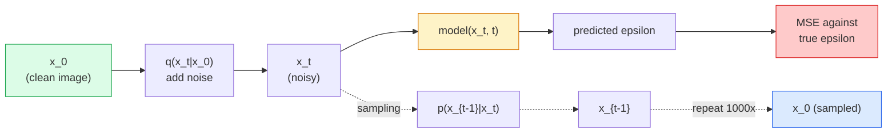

# Geração de imagem  Modelos de difusão  Geração de imagem  Modelo de expansão

> Um modelo de difusão aprende a denotar, treina-o a remover um pequeno pouco de ruído de uma imagem barulhenta, repita isso para trás mil vezes, e você tem um gerador de imagem.

> **【中文解读】**扩散模型学习去噪音: treinamento de rede de eliminação do ruído de uma imagem com um pouco de ruído, reverso repetidas mil vezes, é capaz de gerar imagens a partir de ruído puro.

> **【拓展：扩散模型的革命】**扩散模型在 2022年后取代GAN 成为图像生成的主流──Stable Diffusion 使用潜在空间扩散──Latent Diffusion) reduzir significativamente o custo de cálculo, o DDIM 采样器 será capaz de calcular um número de passos de 1000 passos para 20 passos──扩散模型 também é aplicado em vídeos (video) Sora) 3D 生成、音频生成等领域──

**Type:** Build | **类型:** 动手
**Languages:** Python | **语言:** Python
**Prerequisites:** Phase 4 Lesson 07 (U-Net), Phase 1 Lesson 06 (Probability), Phase 3 Lesson 06 (Optimizers) | **前置知识:** Phase 4 Lesson 07（U-Net），Phase 1 Lesson 06（概率），Phase 3 Lesson 06（优化器）
**Time:** ~75 minutes | **时间:** ~75 分钟

## Objetivos de aprendizagem

- Derivar o processo de som para a frente `x_0 -> x_1 -> ... -> x_T`e explicar por que a forma fechada`q(x_t | x_0)`aplica-se a qualquer t
- Implementar um objetivo de formação de estilo DDPM que regredisse o ruído adicionado em cada etapa e um amostreador que volte do ruído puro para uma imagem
- Construir uma U-Net condicionada ao tempo (pouco pequena para treinar na CPU) que prevê o ruído para qualquer passo do tempo
- Explique a diferença entre a amostragem DDPM e a amostragem DDIM e quando cada uma é adequada (a lição 23 abrange a correspondência de fluxo e o fluxo rectificado em profundidade)

> **【中文解读】**O objetivo do aprendizado é listar as capacidades centrais que devem ser adquiridas após a conclusão do curso.


## O problema é o problema da introdução

Os GANs geram um tiro: ruído, imagem, passagem para frente. São rápidos e difíceis de treinar. Os modelos de difusão geram iterativamente: começam a partir de ruído puro, denotam em pequenos passos, surge imagem. São lentos e fáceis de treinar. Nos últimos cinco anos, esta última propriedade tem dominado: qualquer pequena equipa pode treinar um modelo de difusão e obter amostras razoáveis; o treinamento GAN é um artefacto que se aprende durante anos de corridas falhadas.

> GAN uma vez geração: entrada de ruído, saída de imagens, uma vez para a frente. Eles são rápidos, mas difíceis de treinar. GAN uma geração de modelos de expansão: começa com ruído puro, pequenos passos para ruído, imagens gradualmente aparecem. Eles são lentos, mas fáceis de treinar.

Além da estabilidade de treinamento, a estrutura iterativa da difusão é o que desbloqueia tudo o que a geração moderna de imagens faz: condicionamento de texto, pintura, edição de imagem, super-resolução, estilo controlável. Cada etapa do ciclo de amostragem é um lugar para injetar uma nova restrição. Esse gancho é por isso que a Stable Diffusion, Imagen, DALL-E 3, Midjourney, e todos os modelos de imagem controlables que você usará são baseados em difusão.

> Além de treinar estabilidade, a estrutura da expansão de gerações desbloqueia tudo o que a geração de imagens moderna faz: condicionamento de texto, recuperação de imagens, edição de imagens, ultra-resolução, estilo controlado. Cada passo do ciclo de amostragem é injetado em um novo conjunto de lugares.

Esta lição constrói o DDPM mínimo: ruído para frente, denoção para trás, ciclo de treinamento.

> Esta classe construiu o mínimo DDPM: anterior a aumento de ruído, posterior a eliminação de ruído, ciclo de treinamento, e a sua introdução no sistema de produção, contendo o VAE, o texto, o codificador e o guião sem classes.

## O conceito central.

> **【中文解读】**Este capítulo apresenta os conceitos e teorias fundamentais.


### O processo avançado

Tome uma imagem .`x_0`Adicione uma pequena quantidade de ruído gaussiano para obter .`x_1`Adicione mais uma pequena quantidade para obter .`x_2`Continuem a andar até que ...`x_T`É quase indistinguível do ruído gaussiano puro.

> 取一张图像 `x_0`- Mais um pouco de ruído.`x_1`- Mais um pouco .`x_2`, continuam até`x_T`Com o ruído puro e alto, é quase indistinguível.

```
q(x_t | x_{t-1}) = N(x_t; sqrt(1 - beta_t) * x_{t-1},  beta_t * I)
```

`beta_t`É um cronograma de variância pequeno, tipicamente linear de 0,0001 a 0,02 sobre T=1000 passos.

> `beta_t`É uma pequena diferença de câmbio, geralmente em T=1000 passos, de 0,0001 线性增长到0.02── cada passo é um pequeno encolhimento do sinal e injeta um novo ruído──

### O salto fechado

Adicionar ruído um passo a cada vez é uma cadeia de Markov, mas a matemática se dobra: você pode amostrar `x_t`directamente de`x_0`Em um passo.

> Um passo a passo é um acidente de carro, mas matematicamente pode ser dobrado:`x_0`采样 `x_t`- Não.

```
Define alpha_t = 1 - beta_t
Define alpha_bar_t = prod_{s=1..t} alpha_s

Then:
  q(x_t | x_0) = N(x_t; sqrt(alpha_bar_t) * x_0,  (1 - alpha_bar_t) * I)

Equivalently:
  x_t = sqrt(alpha_bar_t) * x_0 + sqrt(1 - alpha_bar_t) * epsilon
  where epsilon ~ N(0, I)
```

Esta equação única é a razão pela qual a difusão é prática.`t`, amostra `x_t`directamente de`x_0`, e treinar em um passo  sem simulação da cadeia completa de Markov necessária.

> Esta é a única maneira de expandir o modelo.`t`, directamente de`x_0`采样 `x_t`O treinamento não precisa de ser feito sem a necessidade de ser feito um modelo completo de uma cadeia de carros.

### O processo inverso

O processo avançado é fixo.`p(x_{t-1} | x_t)`Os modelos de difusão não prevêem a`x_{t-1}`direto; eles prevêem o ruído `epsilon`adicionado no passo t, e a matemática deriva `x_{t-1}`- Não.

> O processo de direcção é fixo.`p(x_{t-1} | x_t)`É um sistema nervoso que precisa ser aprendido.`x_{t-1}`Eles previram o aumento do ruído .`epsilon`Depois, é uma matemática.`x_{t-1}`- Não.



### A perda de treinamento

Para cada etapa de formação:

> Cada treino:

1. Amostra de uma imagem real .`x_0`- Não .
   Tradução do inglês: 采样一张真实图像`x_0`- Não.
2. Escolha um passo no tempo `t`uniformemente a partir de [1, T].
   中文翻译:从 [1, T] 中均采样一个时间步 `t`- Não.
3. Resumo de amostra`epsilon ~ N(0, I)`- Não .
   Tradução do português: 采样噪声`epsilon ~ N(0, I)`- Não.
4. Computação`x_t = sqrt(alpha_bar_t) * x_0 + sqrt(1 - alpha_bar_t) * epsilon`- Não .
   Tradução: computador`x_t = sqrt(alpha_bar_t) * x_0 + sqrt(1 - alpha_bar_t) * epsilon`- Não.
5. Previsão`epsilon_theta(x_t, t)`com a rede.
   Tradução do inglês:`epsilon_theta(x_t, t)`- Não.
6. Minimizar `|| epsilon - epsilon_theta(x_t, t) ||^2`- Não .
   Tradução do português: minimizar`|| epsilon - epsilon_theta(x_t, t) ||^2`- Não.

A rede neural aprende a prever o ruído em qualquer etapa do tempo. A perda é MSE. Não há jogo adversário, não há colapso, não há oscilação.

> É assim. Não há nenhuma forma de desmoronar, não há qualquer vibração.

### O amostragem (DDPM)

Para gerar: começar a partir de `x_T ~ N(0, I)`e caminhar para trás, um passo a cada vez.

```
for t = T, T-1, ..., 1:
    eps = model(x_t, t)
    x_{t-1} = (1 / sqrt(alpha_t)) * (x_t - (beta_t / sqrt(1 - alpha_bar_t)) * eps) + sqrt(beta_t) * z
    where z ~ N(0, I) if t > 1, else 0
return x_0
```

A chave é que, embora a condicional inversa não seja conhecida em forma fechada em geral, para este processo avançado Gaussian específico é. Os coeficientes feio-parecem ser o que a regra de Bayes dá.

> O que é importante é que, embora em geral a probabilidade de contradição não tenha uma solução fechada, para este processo específico de alta direção há alguma coisa.

### Por que mil passos

O cronograma de ruído para a frente é escolhido para que cada passo adicione apenas ruído suficiente para que o passo inverso seja quase gaussiano. Poucos passos e o passo inverso é longe de gaussiano, a rede não pode modelar bem. Passos demais e amostragem se tornam caros com ganho diminuindo. T = 1000 com um cronograma linear é o padrão DDPM.

> O design da regulação de ruído para frente faz com que cada passo apenas adicione ruído suficiente, de modo a que o passo contrário seja próximo ao alto. O número de passos é muito pequeno, o passo contrário é muito distante do alto, a rede não pode ser bem construída; o número de passos é muito caro e muito rentável.

### DDIM: amostragem 20 vezes mais rápida

O treinamento é o mesmo. As mudanças de amostragem. DDIM (Song et al., 2020) define um processo determinista inverso que salta etapas de tempo sem re treinamento. A amostragem em 50 etapas com DDIM dá uma qualidade de DDPM de quase 1000 etapas. Todo sistema de produção usa DDIM ou uma variante ainda mais rápida (DPM-Solver, ancestral de Euler).

> 訓練方式不變,采样方式改变──DDIM(Song等,2020) define um processo de inversão de determinação, pode saltar através do tempo passo sem necessidade de re-entrenamento──Usar o DDIM 50 步采样能达到接近1000 步 DDPM的质量──cada sistema de produção utiliza DDIM或更快的变体──DPM-Solver、Euler ancestral)──

### Condicionamento de tempo

A rede .`epsilon_theta(x_t, t)`Os modelos de difusão modernos injectam`t`através de embalagens de tempo sinusoidais (a mesma ideia que codificação posicional em transformadores) que são adicionadas a mapas de recursos em todos os níveis da U-Net.

> 网络 `epsilon_theta(x_t, t)`需要知道它在去噪哪个时间步步. 现代扩散模型通过正弦时间嵌入 (Inserir) `t`, em cada nível de U-Net característico gráfico de imagem.

```
t_embedding = sinusoidal(t)
feature_map += MLP(t_embedding)
```

Sem condicionar o tempo, a rede tem que adivinhar o nível de ruído da própria imagem, que funciona mas é muito menos eficiente na amostra.

> Sem condições de tempo, a rede deve adivinhar o nível de ruído da imagem em si, assim, embora possa funcionar, a eficiência de amostra é muito menor.

> **【拓展：工业部署中的视觉系统】**No implementar industrial real, o modelo visual precisa considerar a possibilidade de atrasos, modelos de tamanho, dispositivos de margem, etc. TensorRT, ONNX Runtime, OpenVINO são ferramentas de aceleração de cálculo de uso comum.

> **【拓展：数据标注与质量】** Visual task's effect highly depends on label data quality──Label Studio、CVAT is the mainstream marking tool──In industrial scenarios, proactive learning(Active Learning) pode reduzir o custo de marcação: modelo contra um pedido de amostra não definido marcação artificial, identidade de amostra auto-marcação──


## Construí-lo e realizei-o.

> **【中文解读】**Este é um método de "desde zero" que ajuda a entender o princípio da estrutura, não é um problema que se encontra em uma caixa negra.

```figure
cv-diffusion-image
```

## Construí-lo

### Passo 1: Programa de ruído

```python
import torch

def linear_beta_schedule(T=1000, beta_start=1e-4, beta_end=2e-2):
    return torch.linspace(beta_start, beta_end, T)


def precompute_schedule(betas):
    alphas = 1.0 - betas
    alphas_cumprod = torch.cumprod(alphas, dim=0)
    return {
        "betas": betas,
        "alphas": alphas,
        "alphas_cumprod": alphas_cumprod,
        "sqrt_alphas_cumprod": torch.sqrt(alphas_cumprod),
        "sqrt_one_minus_alphas_cumprod": torch.sqrt(1.0 - alphas_cumprod),
        "sqrt_recip_alphas": torch.sqrt(1.0 / alphas),
    }

schedule = precompute_schedule(linear_beta_schedule(T=1000))
```

Precomputa uma vez, recolha por índice durante o treinamento e a amostragem.

> 预计算一次,训练和采样时通过索引取用──

### Passo 2: Difusão avançada (qu_sampla)

```python
def q_sample(x0, t, noise, schedule):
    sqrt_a = schedule["sqrt_alphas_cumprod"][t].view(-1, 1, 1, 1)
    sqrt_one_minus_a = schedule["sqrt_one_minus_alphas_cumprod"][t].view(-1, 1, 1, 1)
    return sqrt_a * x0 + sqrt_one_minus_a * noise
```

Formulário fechado de uma linha. `t`é um lote de etapas temporais, uma por imagem no lote.

> Uma linha fechada.`t`É um tempo de caminhos, cada imagem é uma.

### Passo 3: Uma pequena rede U-Net com condição de tempo

```python
import torch.nn as nn
import torch.nn.functional as F
import math

def timestep_embedding(t, dim=64):
    half = dim // 2
    freqs = torch.exp(-math.log(10000) * torch.arange(half, device=t.device) / half)
    args = t[:, None].float() * freqs[None]
    emb = torch.cat([args.sin(), args.cos()], dim=-1)
    return emb


class TinyUNet(nn.Module):
    def __init__(self, img_channels=3, base=32, t_dim=64):
        super().__init__()
        self.t_mlp = nn.Sequential(
            nn.Linear(t_dim, base * 4),
            nn.SiLU(),
            nn.Linear(base * 4, base * 4),
        )
        self.t_dim = t_dim
        self.enc1 = nn.Conv2d(img_channels, base, 3, padding=1)
        self.enc2 = nn.Conv2d(base, base * 2, 4, stride=2, padding=1)
        self.mid = nn.Conv2d(base * 2, base * 2, 3, padding=1)
        self.dec1 = nn.ConvTranspose2d(base * 2, base, 4, stride=2, padding=1)
        self.dec2 = nn.Conv2d(base * 2, img_channels, 3, padding=1)
        self.time_proj = nn.Linear(base * 4, base * 2)

    def forward(self, x, t):
        t_emb = timestep_embedding(t, self.t_dim)
        t_emb = self.t_mlp(t_emb)
        t_proj = self.time_proj(t_emb)[:, :, None, None]

        h1 = F.silu(self.enc1(x))
        h2 = F.silu(self.enc2(h1)) + t_proj
        h3 = F.silu(self.mid(h2))
        d1 = F.silu(self.dec1(h3))
        d2 = torch.cat([d1, h1], dim=1)
        return self.dec2(d2)
```

U-Net de dois níveis com condicionamento de tempo injetado no gargalo de engarrafamento.

> 两层 U-Net, em embotel层注入时间条件化── para imagens reais, pode aumentar a profundidade e a largura──

### Passo 4: Localização

```python
def train_step(model, x0, schedule, optimizer, device, T=1000):
    model.train()
    x0 = x0.to(device)
    bs = x0.size(0)
    t = torch.randint(0, T, (bs,), device=device)
    noise = torch.randn_like(x0)
    x_t = q_sample(x0, t, noise, schedule)
    pred = model(x_t, t)
    loss = F.mse_loss(pred, noise)
    optimizer.zero_grad()
    loss.backward()
    optimizer.step()
    return loss.item()
```

Não há jogo GAN, nenhuma perda especializada, uma chamada MSE.

> Não há GAN contra a resistência, não há função de perda especial, só é necessário um MSE.

### Passo 5: Prótese de amostragem (DDPM)

```python
@torch.no_grad()
def sample(model, schedule, shape, T=1000, device="cpu"):
    model.eval()
    x = torch.randn(shape, device=device)
    betas = schedule["betas"].to(device)
    sqrt_one_minus_a = schedule["sqrt_one_minus_alphas_cumprod"].to(device)
    sqrt_recip_alphas = schedule["sqrt_recip_alphas"].to(device)

    for t in reversed(range(T)):
        t_batch = torch.full((shape[0],), t, dtype=torch.long, device=device)
        eps = model(x, t_batch)
        coef = betas[t] / sqrt_one_minus_a[t]
        mean = sqrt_recip_alphas[t] * (x - coef * eps)
        if t > 0:
            x = mean + torch.sqrt(betas[t]) * torch.randn_like(x)
        else:
            x = mean
    return x
```

1000 passes para a frente para produzir um lote de amostras.

> 1000 vezes para transmitir para gerar um lote de amostras.

### Passo 6: amostragem DDIM (determinista, ~ 20 vezes mais rápida)

```python
@torch.no_grad()
def sample_ddim(model, schedule, shape, steps=50, T=1000, device="cpu", eta=0.0):
    model.eval()
    x = torch.randn(shape, device=device)
    alphas_cumprod = schedule["alphas_cumprod"].to(device)

    ts = torch.linspace(T - 1, 0, steps + 1).long()
    for i in range(steps):
        t = ts[i]
        t_prev = ts[i + 1]
        t_batch = torch.full((shape[0],), t, dtype=torch.long, device=device)
        eps = model(x, t_batch)
        a_t = alphas_cumprod[t]
        a_prev = alphas_cumprod[t_prev] if t_prev >= 0 else torch.tensor(1.0, device=device)
        x0_pred = (x - torch.sqrt(1 - a_t) * eps) / torch.sqrt(a_t)
        sigma = eta * torch.sqrt((1 - a_prev) / (1 - a_t) * (1 - a_t / a_prev))
        dir_xt = torch.sqrt(1 - a_prev - sigma ** 2) * eps
        noise = sigma * torch.randn_like(x) if eta > 0 else 0
        x = torch.sqrt(a_prev) * x0_pred + dir_xt + noise
    return x
```

> **【中文解读】**Este capítulo mostra como usar um framework maduro (como PyTorch、HuggingFace etc) rápida aplicação desta tecnologia.


`eta=0`é totalmente determinista (a mesma entrada de ruído produz sempre a mesma saída). `eta=1`recupera a DDPM.

> `eta=0`É totalmente definida. O mesmo ruído entra em contato com o mesmo.`eta=1`则退化为 DDPM。


> **【拓展：视觉模型的持续学习】**Em um ambiente de produção, o modelo visual precisa se adaptar constantemente a novos dados. Isto é especialmente importante na condução automática e no controle de qualidade industrial.

## Use-o com o framework implementado.

Para o trabalho de produção, utiliza-se `diffusers`- Não .

```python
from diffusers import DDPMScheduler, UNet2DModel

unet = UNet2DModel(sample_size=32, in_channels=3, out_channels=3, layers_per_block=2)
scheduler = DDPMScheduler(num_train_timesteps=1000)
```

A biblioteca envia agendadores prontos (DDPM, DDIM, DPM-Solver, Euler, Heun), U-Nets configuráveis, canais para texto-a-imagem e imagem-a-imagem e auxiliares de ajuste fino LoRA.

Para pesquisas,`k-diffusion`(Katherine Crowson) tem as implementações de referência mais fiéis e as melhores variantes de amostragem.

> **【中文解读】**Este capítulo se concentra em como o modelo será implantado como produto disponível. De modelo original a nível de produção, os sistemas precisam considerar várias dimensões de otimização de desempenho, tratamento de erros, controle, etc.


## Envia-o . Produto .

Esta lição produz:

- `outputs/prompt-diffusion-sampler-picker.md` um prompt que seleciona DDPM / DDIM / DPM-Solver / Euler com base no objetivo de qualidade, orçamento de latência e tipo de condicionamento.
- `outputs/skill-noise-schedule-designer.md` uma habilidade que produz um cronograma beta linear, cosino ou sigmoide dado T e nível de corrupção alvo, mais gráficos diagnósticos de relação sinal-ruído ao longo do tempo.

> **【中文解读】**Practicação de temas de fácil/médio/difícil  3o dificuldade de passagem  Recomendação de completar pelo menos Praça de nível médio Classe difícil  Adaptação a pesquisa profunda ou preparação para o encontro 


## Exercícios.

1. **(Easy)**Visualize o processo avançado: tome uma imagem e trace `x_t`- Não .`t in [0, 100, 250, 500, 750, 1000]`Verifica isso .`x_1000`Parece um ruído gaussiano puro.
2. **(Medium)**Treinar o TinyUNet no conjunto de dados de círculos sintéticos durante 20 épocas e amostrar 16 círculos. Comparar a amostragem DDPM (1000 passos) e DDIM (50 passos)  produzem imagens semelhantes a partir da mesma semente de ruído?
3. **(Hard)**Implementar um cronograma de ruído cosinário (Nichol & Dhariwal, 2021): `alpha_bar_t = cos^2((t/T + s) / (1 + s) * pi / 2)`- Treinar o mesmo modelo com cronogramas lineares e cosinosos e mostrar que o cosino dá melhores amostras em baixos números de passos.

> **【中文解读】**No 术语表中的"O que as pessoas dizem" vs "O que realmente significa" 区分日常口语和精确技术含义── em equipe,统一术语定义可以避免大量沟通误解──


## Termos-chave .

| Term | What people say | What it actually means |
|------|----------------|----------------------|
| Forward process | "Add noise over time" | Fixed Markov chain that corrupts an image into Gaussian noise over T steps |
| Reverse process | "Denoise step by step" | Learned distribution that walks back from noise to image |
| Epsilon prediction | "Predict the noise" | The training target: `epsilon_theta(x_t, t)` predicts the noise added at step t |
| Beta schedule | "Noise amounts" | Sequence of T small variances that define how much noise enters per step |
| alpha_bar_t | "Cumulative retain factor" | Product of (1 - beta_s) up to time t; bigger t means less signal left |
| DDPM sampler | "Ancestral, stochastic" | Samples each x_{t-1} from its conditional Gaussian; 1000 steps |
| DDIM sampler | "Deterministic, fast" | Rewrites sampling as a deterministic ODE; 20-100 steps with similar quality |
| Time conditioning | "Tell the model which t" | Sinusoidal embedding of t injected into the U-Net so it knows the noise level |

> **【中文解读】**延伸阅读 fornece recursos de alta qualidade para a aprendizagem profunda.


## Mais leitura 延伸阅读

- [Denoising Diffusion Probabilistic Models (Ho et al., 2020)](https://arxiv.org/abs/2006.11239) o papel que fez a difusão prática e superou os GANs na FID
- [Improved DDPM (Nichol & Dhariwal, 2021)](https://arxiv.org/abs/2102.09672) calendário cosínico e parâmetria v
- [DDIM (Song, Meng, Ermon, 2020)](https://arxiv.org/abs/2010.02502) o amostragem determinista que possibilitou a inferência em tempo real
- [Elucidating the Design Space of Diffusion (Karras et al., 2022)](https://arxiv.org/abs/2206.00364) uma visão unificada de cada escolha de projeto de difusão; melhor referência atual
