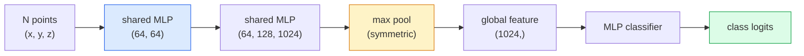

# Visão 3D  Nuvens de ponto e NeRFs  3D  Visión  点云与NeRF

> A visão 3D vem em dois sabores. Nuvens de ponto são a saída bruta do sensor. NeRFs são o campo volumétrico aprendido. Ambos respondem a "o que é onde no espaço".

> **【中文解读】**3D  visão tem duas modalidades: ponto cloud é o sensor (LiDAR 、 profundidade 相机) de saída original; NeRF  neural radiation field) é o campo de volume aprendido. Ambas respondem a "o que está em qualquer posição do espaço". NeRF  através de uma tela de aprendizado de 3D, pode ser representado a partir de qualquer ponto de vista  imagem realista ⋅

> **【拓展：3D 视觉的应用】**O NeRF é usado para realidade virtual/ aumentar a realidade (VR/AR) 、 construção visualizada、 autônoma de condução cenário reconstruçãoƒ 3D Gaussian Splatingƒ 下一课) é um esquema de substituição rápida do NeRF, real time 染质量更高──点云处理是自动驾驶 LiDAR 感知的核心──

**Type:** Learn + Build | **类型:** 学习 + 动手
**Languages:** Python | **语言:** Python
**Prerequisites:** Phase 4 Lesson 03 (CNNs), Phase 1 Lesson 12 (Tensor Operations) | **前置知识:** Phase 4 Lesson 03（CNN），Phase 1 Lesson 12（张量运算）
**Time:** ~45 minutes | **时间:** ~45 分钟

## Objetivos de aprendizagem

- Distinguir representações 3D explícitas (nuvem de pontos, malha, voxel) e implícitas (campo de distância assinado, NeRF) e quando cada uma é usada
- Entender o truque de função simétrica do PointNet que torna uma permutação de rede neural invariante sobre um conjunto desordenado de pontos
- Rastrear um passo NeRF para a frente: fundição de raios, renderização volumétrica, codificação posicional, densidade MLP+ cabeçalho de cor
- Utilização`nerfstudio`ou `instant-ngp`para a reconstrução 3D pré-treinada a partir de um pequeno conjunto de imagens em pó

> **【中文解读】**O objetivo do aprendizado é listar as capacidades centrais que devem ser adquiridas após a conclusão do curso.


## O problema é o problema da introdução

Uma câmera produz uma imagem 2D. Um LIDAR produz um conjunto de pontos 3D sem ordem. Um pipeline de estrutura a partir de movimento produz uma nuvem escassa de pontos-chave 3D. Uma NeRF reconstrui uma cena 3D inteira a partir de um punhado de imagens postadas. Todas estas são "visão" mas nenhuma delas parece o tensor denso que uma CNN quer.

> 相机产生 2D图像──LiDAR 产生一组无序的3D点──运动恢复结构流水线产生稀疏的3D图像──NeRF de vários postos postos imagens reconstruir toda a cena 3D──Estes são "visão", mas não há um que pareça com a CNN 想要的密集张量──

A visão 3D é importante porque quase todas as tarefas de alto valor do robô são executadas em 3D: agarrar, evitar obstáculos, navegação, oclusão de AR, captura de conteúdo 3D. Um engenheiro de visão que só entende imagens 2D é excluído da faixa de campo de mais rápido crescimento (conteúdo AR / VR, robótica, pilhas de condução autônoma, reconstrução 3D baseada em NeRF para imóveis ou construção).

> A visão 3D é importante, pois quase todas as tarefas de alta valor de um aparelho funcionam em 3D: capturar, evitar obstáculos, navegar, capturar conteúdo em 3D. Apenas compreender que os engenheiros de visão de imagens 2D estão bloqueados na parte mais rápida do crescimento deste campo.

As duas representações dominam por razões diferentes. Nuvens de pontos são o que os sensores dão de graça. NeRFs e seus sucessores (3D Gaussian splatting, neural SDFs) são o que você obtém quando você pede a uma rede neural para aprender uma cena.

> 两种表示因不同原因占据主导──点云是传感器免费给你──NeRF 及其后继者(3D 高斯、神经SDF) é quando você deixa a neural network aprender em cena──

## O conceito central.

> **【中文解读】**Este capítulo apresenta os conceitos e teorias fundamentais.


### Nuvens de ponto

Uma nuvem de pontos é um conjunto desordenado de N pontos em R^3, opcionalmente cada um com características (color, intensidade, normal).

> 点云是 R^3 中 N 个点的无序集合, cada ponto pode ter características ([[color]], força, linha de rotação]]).

```
cloud = [
  (x1, y1, z1, r1, g1, b1),
  (x2, y2, z2, r2, g2, b2),
  ...
  (xN, yN, zN, rN, gN, bN),
]
```

Não há rede, não há conectividade, duas propriedades tornam difícil isto para redes neurais:

> Não há rede, não há ligação.

- **Permutation invariance** A saída não deve depender da ordem dos pontos.
  Tradução:**置换不变性** O output não pode depender da ordem dos pontos.
- **Variable N** um único modelo deve lidar com nuvens de diferentes tamanhos.
  Tradução:**可变 N**Um único modelo deve lidar com diferentes pontos de tamanho.

PointNet (Qi et al., 2017) resolveu ambos com uma ideia: aplicar um MLP compartilhado a cada ponto, em seguida, agregar com uma função simétrica (pool máximo). O resultado é um vetor de tamanho fixo que não depende da ordem.

> PointNet ((Qi 等,2017) resolveu dois problemas com uma ideia: para cada aplicativo de partilha de MLP, e depois com a função de concentração (((máxima acumulação) ⋅.

```
f(P) = max_{p in P} MLP(p)
```

Esta é toda a base do PointNet. Variantes mais profundas (PointNet++, Point Transformer) adicionam amostragem hierárquica e agregação local, mas o truque de função simétrica permanece inalterado.

> É o núcleo completo da PointNet. Os variantes mais profundos da "PointNet++"",Point Transformer" aumentaram a tomada de níveis e a aglomeração local, mas as técnicas de função não mudaram.

### A arquitetura PointNet



"MLP compartilhado" significa que o mesmo MLP é executado em todos os pontos de forma independente, implementado como uma conveção de 1x1 sobre a dimensão do ponto para a eficiência.

> "MLP compartilhada" significa que o mesmo MLP é executado de forma independente em cada ponto, para aumentar a eficiência, realizando um volume de 1x1 em cada ponto.

### Campo de Radiância Neural (NeRFs)

NeRFs (Mildenhall et al., 2020) tomaram a pergunta "podemos reconstruir uma cena 3D a partir de fotos N?" e responderam com uma rede neural que é a cena.`(x, y, z, viewing_direction)`- Não .`(density, colour)`Dar uma nova visão é um ciclo de transmissão de raios através desta rede.

> NeRF(Mildenhall etc,2020) respondeu "canê não reconstruir 3D scene de N 张照片?" esta questão usando uma rede neural para expressar a cena em si mesma―网络将`(x, y, z, 观察方向)`映射到 `(密度, 颜色)`染新视角 é fazer um ciclo de lançamento de luz nesta rede

```
NeRF MLP:  (x, y, z, theta, phi) -> (sigma, r, g, b)

To render a pixel (u, v) of a new view:
  1. Cast a ray from the camera through pixel (u, v)
  2. Sample points along the ray at distances t_1, t_2, ..., t_N
  3. Query the MLP at each point
  4. Composite the colours weighted by (1 - exp(-sigma * dt))
  5. The sum is the rendered pixel colour
```

Uma perda compara o pixel renderado com o pixel de verdade no solo nas fotos de treinamento. Backprop através do passo de renderização atualiza o MLP. Não há verdade no solo 3D, nenhuma geometria explícita  a cena é armazenada nos pesos do MLP.

> 损失函数相比染像素与训练照片中的真实像素──通过染步骤的反向传播更新 MLP──没有3D真值,没有显式几何场景存储在MLP 权重中──

### Codificação de posição em NeRF

Uma vavilha de MLP em`(x, y, z)`Não pode representar detalhes de alta frequência porque os MLPs são espectralmente tendenciosos em direção a baixas frequências.

> Normal MLP em`(x, y, z)`上不能表示高频细节,因为 MLP 频谱偏向低频. NeRF 通过在每个坐标送进 MLP 编码为里叶特征向量来修复这个问题:

```
gamma(p) = (sin(2^0 pi p), cos(2^0 pi p), sin(2^1 pi p), cos(2^1 pi p), ...)
```

Até níveis de frequência L=10. Este é o mesmo truque que os transformadores usam para posições, e aparece novamente no condicionamento de tempo de difusão (Lessão 10).

> O máximo L=10 个频率级别── é o mesmo que o Transformer Used on positioning techniques, também aparece novamente no tempo condicionado do modelo de expansão (第 10 课)── sem ele, NeRF parece mờờ──

### Renderamento volumétrico

```
C(r) = sum_i T_i * (1 - exp(-sigma_i * delta_i)) * c_i

T_i  = exp(- sum_{j<i} sigma_j * delta_j)
delta_i = t_{i+1} - t_i
```

`T_i`é a transmissão  quanto luz sobrevive ao ponto i. `(1 - exp(-sigma_i * delta_i))`é a opacidade no ponto i. `c_i`O pixel final é uma soma ponderada ao longo do raio.

> `T_i`É a taxa de transmissão até chegar a um ponto, quando a linha de luz permanece muito.`(1 - exp(-sigma_i * delta_i))`É a primeira questão de transparência.`c_i`É a cor. O final é a luz.

### O que substituiu as NeRF

As NeRFs puras são lentas em treinar (horas) e lentas em render (segundos por imagem).

> 純 NeRF 訓練慢(小時級) 且染慢(每张图像秒级) 』后续发展:

- **Instant-NGP**(2022)  codificação de rede de hash substitui a entrada de posição do MLP; trens em segundos.
  Tradução:**Instant-NGP**(2022) 哈希网格编码替代 MLP 的位置输入;秒级训练──
- **Mip-NeRF 360** manipula cenas ilimitadas e anti-aliasing.
  Tradução:**Mip-NeRF 360** Tratamento de cenários e resistências ──
- **3D Gaussian Splatting**(2023)  substitui o campo volumétrico por milhões de Gaussians 3D; trens em minutos, renderiza em tempo real.
  Tradução:**3D 高斯泼溅**(2023)  Usando milhões de 3D 高斯替代体积场;分钟级训练,实时染──

Quase todos os produtos reais de NeRF em 2026 são realmente 3D Gaussian splatting.

> Em 2026 quase todos os produtos reais de NeRF são na verdade 3D, mas o modelo mental ainda é NeRF.

### Setos de dados e referências

- **ShapeNet** Classificação e segmentação dos modelos CAD 3D como nuvens de pontos.
  Chinese Translation:ShapeNet3D CAD 模型的点云分类和分割──
- **ScanNet**- Escanar em interiores para segmentação.
  Tradução do inglês:ScanNet真实室内扫描,用于分割──
- **KITTI** nuvens de ponto LIDAR para condução autônoma.
  中文翻译:KITTI户外 LiDAR 点云, para utilização em condução automática。
- **NeRF Synthetic**- Não .**Blended MVS** conjuntos de dados de imagens postas para síntese de visualização.
  NeRF Synthetic / Blended MVS带位姿的图像数据集,用于视角合成──
- **Mip-NeRF 360**conjunto de dados  cenas reais ilimitadas.
  Tradução do português:Mip-NeRF 360 数据集无界真实场景──

> **【中文解读】**Este é um método de "desde zero" que ajuda a entender o princípio da estrutura, não é um problema que se encontra em uma caixa negra.

> **【拓展：工业部署中的视觉系统】**No implementar industrial real, o modelo visual precisa considerar a possibilidade de atrasos, modelos de tamanho, dispositivos de margem, etc. TensorRT, ONNX Runtime, OpenVINO são ferramentas de aceleração de cálculo de uso comum.

> **【拓展：数据标注与质量】** Visual task's effect highly depends on label data quality──Label Studio、CVAT is the mainstream marking tool──In industrial scenarios, proactive learning(Active Learning) pode reduzir o custo de marcação: modelo contra um pedido de amostra não definido marcação artificial, identidade de amostra auto-marcação──


## Construí-lo e realizei-o.
```figure
nerf-rays
```

## Construí-lo

### Passo 1: Classificador PointNet

```python
import torch
import torch.nn as nn

class PointNet(nn.Module):
    def __init__(self, num_classes=10):
        super().__init__()
        self.mlp1 = nn.Sequential(
            nn.Conv1d(3, 64, 1),    nn.BatchNorm1d(64),   nn.ReLU(inplace=True),
            nn.Conv1d(64, 64, 1),   nn.BatchNorm1d(64),   nn.ReLU(inplace=True),
        )
        self.mlp2 = nn.Sequential(
            nn.Conv1d(64, 128, 1),  nn.BatchNorm1d(128),  nn.ReLU(inplace=True),
            nn.Conv1d(128, 1024, 1), nn.BatchNorm1d(1024), nn.ReLU(inplace=True),
        )
        self.head = nn.Sequential(
            nn.Linear(1024, 512),   nn.BatchNorm1d(512),  nn.ReLU(inplace=True),
            nn.Dropout(0.3),
            nn.Linear(512, 256),    nn.BatchNorm1d(256),  nn.ReLU(inplace=True),
            nn.Dropout(0.3),
            nn.Linear(256, num_classes),
        )

    def forward(self, x):
        # x: (N, 3, num_points) — transposed for Conv1d
        x = self.mlp1(x)
        x = self.mlp2(x)
        x = torch.max(x, dim=-1)[0]       # (N, 1024)
        return self.head(x)

pts = torch.randn(4, 3, 1024)
net = PointNet(num_classes=10)
print(f"output: {net(pts).shape}")
print(f"params: {sum(p.numel() for p in net.parameters()):,}")
```

Tem parâmetros de 1,6 milhões, corre em 1.024 pontos por nuvem.

> Cerca de 160 milhões de parâmetros.

### Passo 2: codificação de posição

```python
def positional_encoding(x, L=10):
    """
    x: (..., D) -> (..., D * 2 * L)
    """
    freqs = 2.0 ** torch.arange(L, dtype=x.dtype, device=x.device)
    args = x.unsqueeze(-1) * freqs * 3.141592653589793
    sinc = torch.cat([args.sin(), args.cos()], dim=-1)
    return sinc.reshape(*x.shape[:-1], -1)

x = torch.randn(5, 3)
y = positional_encoding(x, L=10)
print(f"input:  {x.shape}")
print(f"encoded: {y.shape}     # (5, 60)")
```

Multiplicação por `2^l * pi`dá frequências progressivamente mais altas.

> - Não .`2^l * pi`产生逐步升高的频率──

### Passo 3: Minúsculo MLP NeRF

```python
class TinyNeRF(nn.Module):
    def __init__(self, L_pos=10, L_dir=4, hidden=128):
        super().__init__()
        self.L_pos = L_pos
        self.L_dir = L_dir
        pos_dim = 3 * 2 * L_pos
        dir_dim = 3 * 2 * L_dir
        self.trunk = nn.Sequential(
            nn.Linear(pos_dim, hidden), nn.ReLU(inplace=True),
            nn.Linear(hidden, hidden),  nn.ReLU(inplace=True),
            nn.Linear(hidden, hidden),  nn.ReLU(inplace=True),
            nn.Linear(hidden, hidden),  nn.ReLU(inplace=True),
        )
        self.sigma = nn.Linear(hidden, 1)
        self.color = nn.Sequential(
            nn.Linear(hidden + dir_dim, hidden // 2), nn.ReLU(inplace=True),
            nn.Linear(hidden // 2, 3), nn.Sigmoid(),
        )

    def forward(self, x, d):
        x_enc = positional_encoding(x, self.L_pos)
        d_enc = positional_encoding(d, self.L_dir)
        h = self.trunk(x_enc)
        sigma = torch.relu(self.sigma(h)).squeeze(-1)
        rgb = self.color(torch.cat([h, d_enc], dim=-1))
        return sigma, rgb

nerf = TinyNeRF()
x = torch.randn(128, 3)
d = torch.randn(128, 3)
s, c = nerf(x, d)
print(f"sigma: {s.shape}   rgb: {c.shape}")
```

Pequeno em comparação com o original NeRF (que tem 2 troncos MLP de profundidade 8).

> Comparado com o NeRF original, há 2 profundidades de 8 MLP (principalmente em quadros de MLP) em comparação com o NeRF original, é muito pequeno.

### Passo 4: Render volumétrico ao longo de um raio

```python
def volumetric_render(sigma, rgb, t_vals):
    """
    sigma: (..., N_samples)
    rgb:   (..., N_samples, 3)
    t_vals: (N_samples,) distances along the ray
    """
    delta = torch.cat([t_vals[1:] - t_vals[:-1], torch.full_like(t_vals[:1], 1e10)])
    alpha = 1.0 - torch.exp(-sigma * delta)
    trans = torch.cumprod(torch.cat([torch.ones_like(alpha[..., :1]), 1.0 - alpha + 1e-10], dim=-1), dim=-1)[..., :-1]
    weights = alpha * trans
    rendered = (weights.unsqueeze(-1) * rgb).sum(dim=-2)
    depth = (weights * t_vals).sum(dim=-1)
    return rendered, depth, weights


N = 64
t_vals = torch.linspace(2.0, 6.0, N)
sigma = torch.rand(N) * 0.5
rgb = torch.rand(N, 3)
rendered, depth, weights = volumetric_render(sigma, rgb, t_vals)
print(f"rendered colour: {rendered.tolist()}")
print(f"depth:           {depth.item():.2f}")
```

> **【中文解读】**Este capítulo mostra como usar um framework maduro (como PyTorch、HuggingFace etc) rápida aplicação desta tecnologia.


Um raio, 64 amostras, compostas a um único pixel RGB e uma profundidade.

> Uma linha de luz, 64 pontos de amostra, juntamente com um valor RGB de imagem e profundidade.


> **【拓展：视觉模型的持续学习】**Em um ambiente de produção, o modelo visual precisa se adaptar constantemente a novos dados. Isto é especialmente importante na condução automática e no controle de qualidade industrial.

## Use-o com o framework implementado.

Para o trabalho real:

- `nerfstudio`(Tancik et al.)  a biblioteca de referência atual para NeRF / Instant-NGP / Gaussian Splatting.
- `pytorch3d`(Meta)  renderização diferenciável, utilitários de nuvem pontual, operações de malha.
- `open3d` Processamento em nuvem de pontos, registo, visualização.

> **【中文解读】**Este capítulo se concentra em como o modelo será implantado como produto disponível. De modelo original a nível de produção, os sistemas precisam considerar várias dimensões de otimização de desempenho, tratamento de erros, controle, etc.


Para implantação, a 3D Gaussian splatting substituiu em grande parte os NeRFs puros porque torna 100 vezes mais rápido.


## Envia-o . Produto .

Esta lição produz:

> **【中文解读】**Practicação de temas de fácil/médio/difícil  3o dificuldade de passagem  Recomendação de completar pelo menos Praça de nível médio Classe difícil  Adaptação a pesquisa profunda ou preparação para o encontro 


- `outputs/prompt-3d-task-router.md` um prompt que se encaminha para a representação 3D certa (nuvem de pontos, malha, voxel, NeRF, espaçamento gaussiano) com base em dados de tarefa e entrada.
- `outputs/skill-point-cloud-loader.md`Uma habilidade que escreve uma PyTorch.`Dataset`para arquivos .ply / .pcd / .xyz com normalização correta, centramento e amostragem de pontos.

## Exercícios.

1. **(Easy)**Mostre que o PointNet é invariavel em permutação: execute a mesma nuvem duas vezes, uma vez com pontos misturados. Verifique que as saídas são idênticas até ao ruído de ponto flutuante.
2. **(Medium)**Implementar uma função de geração de raios mínima que, dada a intrínseca e a pose da câmera, produz origens e direções de raios para cada pixel de uma imagem H x W.
3. **(Hard)**Treinar um TinyNeRF em um conjunto de dados sintético de visualizações renderizadas de um cubo colorido (gerado através de renderização diferenciável ou de um rastreador de raios simples).

> **【中文解读】**No 术语表中的"O que as pessoas dizem" vs "O que realmente significa" 区分日常口语和精确技术含义── em equipe,统一术语定义可以避免大量沟通误解──


## Termos-chave .

| Term | What people say | What it actually means |
|------|----------------|----------------------|
| Point cloud | "3D points from LIDAR" | Unordered set of (x, y, z) + optional features per point |
| PointNet | "First neural net on point clouds" | Shared MLP per point + symmetric (max) pool; permutation-invariant by construction |
| NeRF | "MLP that is the scene" | Network mapping (x, y, z, dir) to (density, colour); rendered by ray casting |
| Positional encoding | "Fourier features" | Encode each coordinate into sin/cos at multiple frequencies to overcome MLP low-frequency bias |
| Volumetric rendering | "Ray integration" | Composite samples along a ray into a single pixel using transmittance and alpha |
| Instant-NGP | "Hash-grid NeRF" | Replaces NeRF's coordinate MLP with a multi-resolution hash grid; 100-1000x faster |
| 3D Gaussian splatting | "Millions of Gaussians" | Scene = collection of 3D Gaussians; renders in real time, trains in minutes |
| SDF | "Signed distance field" | Function returning signed distance to the nearest surface; another implicit representation |

> **【中文解读】**延伸阅读 fornece recursos de alta qualidade para a aprendizagem profunda.


## Mais leitura 延伸阅读

- [PointNet (Qi et al., 2017)](https://arxiv.org/abs/1612.00593) o classificador de permutação-invariante
- [NeRF (Mildenhall et al., 2020)](https://arxiv.org/abs/2003.08934)O artigo que fez da reconstrução 3D a partir de fotos um problema de rede neural
- [Instant-NGP (Müller et al., 2022)](https://arxiv.org/abs/2201.05989)Grades de hash, 1000x de aceleração
- [3D Gaussian Splatting (Kerbl et al., 2023)](https://arxiv.org/abs/2308.04079) a arquitetura que substituiu os NeRF na produção
