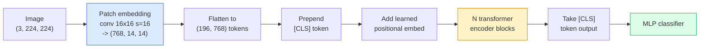

# Transformadores de visão (ViT) 视觉 Transformer

> Cortar a imagem em parches, tratar cada parche como uma palavra, executar um transformador padrão.

> **【中文解读】**Para fazer isso, você deve fazer um "pacho" de imagem, e depois fazer um "pacho" de imagem.

> **【拓展：ViT 与 GPT-4V】**ViT é o visual Capacidade de GPT-4V、Claude、LLaVA e outros modelos de grande formato. Desde 2021, ViT tornou-se a infraestrutura de vídeo de computador, usado para CLIP、SAM、DINO e outros modelos.

**Type:** Build | **类型:** 动手
**Languages:** Python | **语言:** Python
**Prerequisites:** Phase 7 Lesson 02 (Self-Attention), Phase 4 Lesson 04 (Image Classification) | **前置知识:** Phase 7 Lesson 02（自注意力），Phase 4 Lesson 04（图像分类）
**Time:** ~45 minutes | **时间:** ~45 分钟

## Objetivos de aprendizagem

- Implementar o inserimento de patch, o inserimento posicional aprendido, token de classe e blocos de codificação de transformador a partir do zero para construir um ViT mínimo
- Explique por que se pensava que a ViT precisava de dados massivos de pré-treino até que a DeiT e a MAE provassem o contrário.
- Comparar ViT, Swin e ConvNeXt em seus antecedentes arquitetônicos (não, atenção local para janelas, espinha dorsal de conve)
- Ajustar um ViT pré- treinado num conjunto de dados pequeno usando `timm`e a receita padrão de sondagem linear / sintonia

> **【中文解读】**O objetivo do aprendizado é listar as capacidades centrais que devem ser adquiridas após a conclusão do curso.


## O problema é o problema da introdução

Durante uma década, a convolução foi sinônimo de visão por computador. As CNN tinham fortes preconceitos indutivos  localidade, equivalência de tradução  que ninguém pensava que você poderia substituir.

> Durante dez anos, o rollover foi o nome da visão de computador. A CNN tem uma forte regularização de posicionamento local, plano e variação. Ninguém acha que você pode substituir.

A captura foi "em escala". A ViT na ImageNet-1k perdeu para a ResNet. ViT pre-entrenado em ImageNet-21k ou JFT-300M, então ajustado em ImageNet-1k superou. A conclusão foi que os transformadores não tinham antecedentes úteis, mas podiam aprendê-los a partir de dados suficientes. Os trabalhos subsequentes (DeiT, MAE, DINO) mostraram que com as receitas de formação adequadas  aumento forte, pré-treino auto-supervisionado, destilação  ViTs treinam bem também em pequenos dados.

>  é "massal"──ViT em ImageNet-1k em ResNet.  em ImageNet-21k ou JFT-300M em Pre-Training e depois em ImageNet-1k em Upmode ViT  ganhou── conclusão é que Transformer   falta de experiência útil mas pode aprender de dados suficientes para ∼ sucessos de trabalho.

Em 2026, as CNNs puras ainda são competitivas em dispositivos de ponta (ConvNeXt é o mais forte), mas os transformadores dominam tudo o mais: segmentação (Mask2Former, SegFormer), detecção (DETR, RT-DETR), multimodal (CLIP, SigLIP), vídeo (VideoMAE, VJEPA).

> Até 2026, a pura CNN continua a ter uma concorrência em dispositivos de margem, mas o Transformer domina o resto: divisão, teste, teste, teste, teste, teste, teste, teste, teste, teste, teste, teste, teste, teste, teste, teste, teste, teste, teste, teste, teste, teste, teste, teste, teste, teste, teste, teste, teste, teste, teste, teste, teste, teste, teste, teste, teste, teste, teste, teste, teste, teste, teste, teste, teste, teste, teste, teste, teste, teste, teste, teste, teste, teste, teste, teste, teste, teste, teste, teste, teste, teste, teste, teste, teste, teste, teste, teste, teste, teste, teste, teste, teste, teste, teste, teste, teste, teste, teste, teste, teste, teste, teste, teste, teste, teste, teste, teste, teste, teste, teste, teste, teste, teste, teste, teste, teste, teste, teste, teste, teste, teste, teste, teste, teste, teste, teste, teste, teste, teste, teste, teste, teste, teste, teste, teste, teste, teste, teste, teste, teste, teste, teste, teste, teste, teste, teste, teste, teste, teste, teste, teste, teste, teste, teste, teste, teste, teste, teste, teste, teste, teste, teste, teste, teste, teste, teste, teste, teste, teste, teste, teste, teste, teste, teste, teste, teste, teste, teste, teste, teste, teste, teste, teste, teste, teste, teste, teste, teste, teste, teste, teste, teste, teste, teste, teste, teste, teste, teste, teste, teste, teste, teste, teste, teste, teste, teste, teste, teste, teste, teste, teste, teste, teste, teste, teste, teste, teste, teste, teste, teste, teste, teste, teste, teste, teste, teste, teste, teste, teste, teste, e teste, e teste, e teste, e teste, e teste, e teste, e teste, e teste, e teste, e teste, e teste, e teste, e teste, e teste, e foi uma grande, e foi uma grande, e foi uma grande, e foi uma grande,

## O conceito central.

> **【中文解读】**Este capítulo apresenta os conceitos e teorias fundamentais.


### O oleoduto



Sete passos. Patches -> tokens -> atenção -> classificador. Cada variante (DeiT, Swin, ConvNeXt, MAE pré-treino) muda um ou dois dos sete e deixa o resto sozinho.

> 七步──补丁 -> token -> 注意力 -> 分类器──每个变体(DeiT、Swin、ConvNeXt、MAE 预训) apenas altera um dos dois passos dos sete passos, o resto permanece inalterável──

### Embedagem de parche

O primeiro conv é o segredo. tamanho do núcleo 16, passo 16, então uma imagem de 224x224 torna-se uma grade de 14x14 de 16x16 parches, cada projetado para um 768-dim embutidos.

> O primeiro volume é o segredo. O núcleo é grande, 16 passos, 16 passos, 16 passos, 224x224.

```
Input:  (3, 224, 224)
Conv (3 -> 768, k=16, s=16, no padding):
Output: (768, 14, 14)
Flatten spatial: (196, 768)
```

196 patches = 196 tokens. A dimensão de cada token é 768 (ViT-B), 1024 (ViT-L), ou 1280 (ViT-H).

> 196 个补丁 = 196 个 token── cada token 个特征维度为 768(ViT-B)、1024(ViT-L) 或 1280(ViT-H)。

### Token de classe

Um único vetor aprendido prependido à sequência:

> Um veículo de aprendizagem adicionado à sequência anterior:

```
tokens = [CLS; patch_1; patch_2; ...; patch_196]   shape (197, 768)
```

Após os blocos N transformadores, o `[CLS]`O resultado é a representação global da imagem.

> Passou por N 个 Transformer 块后,`[CLS]`O resultado é um gráfico completo.

### Embarcação posicional

Os transformadores não têm noção de posição espacial.

> Transformador 没有内置的空间位置概念── para cada token adicionar um movimento de aprendizado:

```
tokens = tokens + learned_pos_embedding   (also shape (197, 768))
```

A incorporação é um parâmetro do modelo; treinamento baseado em gradientes o adapta à estrutura de imagem 2D. Existem alternativas sinusoidais 2D, mas raramente são usadas na prática.

> Embed é o parâmetro do modelo; treinamento baseado em gradiente o torna adequado à estrutura de imagem 2D. Existe um alternativo de 2D de cordas, mas na prática é muito pouco usado.

### Bloco de codificação do transformador

Auto-atenção multi-head, MLP, conexões residuais, pré-LayerNorm.

> 标准结构──多头自注意力、MLP、残差连接、前置 LayerNorm──

```
x = x + MSA(LN(x))
x = x + MLP(LN(x))

MLP is two-layer with GELU: Linear(d -> 4d) -> GELU -> Linear(4d -> d)
```

O ViT-B/16 empilha 12 desses blocos, cada um com 12 cabeças de atenção, com um total de 86 milhões de parâmetros.

> ViT-B/16                                                                                                                                                                                                                                                                                                                                                                                                                                                                                                                         

### Porquê antes da LN

Os primeiros transformadores utilizados após o período de LN (`x = LN(x + sublayer(x))`O programa de formação de professores de ensino superior (P.L.N.) e de professores de formação superior (P.L.N.)`x = x + sublayer(LN(x))`O sistema de formação de estudantes de ensino superior (LL) é um sistema de formação de estudantes de ensino superior que permite a formação de estudantes de ensino superior.

> 早期 Transformer 使用后置 LN(`x = LN(x + sublayer(x))`), muito difícil em condições de pre-calor de treinar mais de 6-8 层──`x = x + sublayer(LN(x))`O programa de formação em formação em formação em formação em formação em formação em formação em formação em formação em formação em formação em formação em formação em formação em formação em formação em formação em formação em formação em formação em formação em formação em formação em formação em formação em formação em formação em formação em formação em formação em formação em formação em formação em formação em formação em formação em formação em formação em formação em formação em formação em formação em formação em formação em formação em formação em formação em formação em formação em formação em formação em formação em formação em formação em formação em formação em formação em formação em formação em formação em formação em formação em formação em formação em formação em formação em formação em formação em formação em formação em formação em formação em formação em formação em formação em formação em formação em formação em formação em formação em formação em formação em formação em formação em formação em formação em formação em formação em formação em formação em formação em formação em formação em formação em formação em formação em formação em formação em formação em formação em formação em formação em formação em formação em formação em formação em formação em formação em formação em formação em formação em formação em formação em formação em formação em formação em formação em formação em formação em formação em formação em formação em formação em formação em formação em formação em formação em formação em formação em formação em formação em formação em formação em formação em formação em formação em formação em formação em formação em formação em formação em formação em formação em formação em formação em formação em formação em formação em formação em formação em formação em formação em formação em formação em formação em formação em formação em formação em formação em formação em formação em formação em formação em formação em formação em formação em formação em formação em formação em formação em formação em formação em formação em formação em formação em formação em formação em uma formação em formação em uma formação em uma formação em uma formação em uma formação em uma formação em uma formação em uma formação em uma formação em uma formação em uma formação em uma formação em uma formação em uma formação em uma formação em uma formação em uma formação em uma formação em uma formação em uma formação em uma formação em uma formação em uma formação em uma formação em uma formação em uma formação em uma.

### Comércio de tamanho do parche

- 16x16 patches -> 196 tokens, padrão.
  Tradução do inglês: 补丁 -> 196 个代币,标准配置──
- 32x32 patches -> 49 tokens, mais rápido mas com menor resolução.
  Tradução do inglês: 32x32 补丁 -> 49 个代币, mais rápido, mas resolução menor.
- 8x8 patches -> 784 tokens, mais finos mas O ((n^2) atenção custa escamas mal.
  No entanto, o custo de atenção aumentou muito.

Patches maiores = menos tokens = mais rápido, mas menos detalhes espaciais. SwinV2 usa patches 4x4 em janelas hierárquicas.

> Mais grande adição = menor token = mais rápido mas espaço detalhe menor。SwinV2 em janelas de graduação usam 4x4 adição。

### Receita da DeiT para treinar ViT na ImageNet-1k

O ViT original precisava de JFT-300M para vencer as CNNs. DeiT (Touvron et al., 2020) treinou ViT-B para 81,8% no top-1 apenas na ImageNet-1k com quatro mudanças:

> O ViT                                                                                                                                                                                                                                                                                                                                                                                                                                                                                                                           

1. Aumento intenso: Aumento aleatório, Mixup, CutMix, Erasing aleatório.
   中文翻译:强数据增强:RandAugment、Mixup、CutMix、Random Erasing。
2. Profundidade estocástica (arroçar blocos inteiros aleatoriamente durante o treino).
   Tradução do inglês:随机深度 (随机丢弃整个块)
3. Aumentar repetidamente (a mesma imagem amostrada 3 vezes por lote).
   中文翻译:重复增强(同一图像在每个批中采样 3 次) 』
4. Destilação de um professor da CNN (opcional, aumenta a precisão ainda mais).
   Tradução do inglês para tradução livre:

Todas as receitas modernas de treinamento ViT descende da DeiT.

> Cada programa de treinamento moderno ViT são originários da DeiT.

### Swin vs ConvNeXt

- **Swin**(Liu et al., 2021)  atenção baseada em janelas. Cada bloco atende dentro de uma janela local; blocos alternativos deslocam a janela para misturar informações entre janelas. Traz de volta uma localidade semelhante à CNN antes, mantendo o operador de atenção.
  Tradução:**Swin**(Liu 等,2021)  Atenção baseada em janelas. Cada bloco em janelas locais faz atenção dentro de janelas locais.
- **ConvNeXt**(Liu et al., 2022)  redesenhou a CNN que combina as escolhas de arquitetura de Swin (convs profundamente, LayerNorm, GELU, garganta de garrafa invertida). Mostrou que a lacuna não é "atenção vs convolução" mas "receita de treinamento moderna + arquitetura".
  Tradução:**ConvNeXt**(Liu 等,2022)  Re-designado CNN,匹配 Swin's架构选择(深度可分离卷积、LayerNorm、GELU、倒置瓶)  demonstrar a diferença não é "Attenção vs 卷积" mas sim "Modern Training Scheme + 架构"―

Em 2026, a ConvNeXt-V2 e a Swin-V2 são ambas de nível de produção; a escolha certa depende da sua pilha de inferência (a ConvNeXt compila melhor para a borda) e do corpus de pré-treino.

> 2026 anos,ConvNeXt-V2 和 Swin-V2 都是生产级方案;正确选择取决于推理(ConvNeXt 在边缘设备编译更好) 和预训语料──

### Pre-treinamento de MAE

Autoencoder mascarado (He et al., 2022): masquear 75% dos patches aleatoriamente, treinar o encoder para processar apenas os 25% visíveis, treinar um pequeno decodificador para reconstruir os patches mascarados da saída do encoder.

> 掩码自编码器(He等,2022):随机掩盖75% de correções, training编码器只处理可见的25%, training a小解码器从编码器输出重建被掩盖的补丁──预训后丢弃解码器,微调编码器──

O MAE torna o ViT treinável apenas na ImageNet-1k, bate no SOTA e é a receita automática padrão atual.

> MAE utilizou ViT  apenas em ImageNet-1k 上可训练, atingir SOTA, é um programa de treinamento de auto-supervisão de forma preconcebida.

> **【中文解读】**Este é um método de "desde zero" que ajuda a entender o princípio da estrutura, não é um problema que se encontra em uma caixa negra.

> **【拓展：工业部署中的视觉系统】**No implementar industrial real, o modelo visual precisa considerar a possibilidade de atrasos, modelos de tamanho, dispositivos de margem, etc. TensorRT, ONNX Runtime, OpenVINO são ferramentas de aceleração de cálculo de uso comum.

> **【拓展：数据标注与质量】** Visual task's effect highly depends on label data quality──Label Studio、CVAT is the mainstream marking tool──In industrial scenarios, proactive learning(Active Learning) pode reduzir o custo de marcação: modelo contra um pedido de amostra não definido marcação artificial, identidade de amostra auto-marcação──


## Construí-lo e realizei-o.
```figure
batchnorm-inference
```

## Construí-lo

### Passo 1: Embedamento de parche

```python
import torch
import torch.nn as nn

class PatchEmbedding(nn.Module):
    def __init__(self, in_channels=3, patch_size=16, dim=192, image_size=64):
        super().__init__()
        assert image_size % patch_size == 0
        self.proj = nn.Conv2d(in_channels, dim, kernel_size=patch_size, stride=patch_size)
        num_patches = (image_size // patch_size) ** 2
        self.num_patches = num_patches

    def forward(self, x):
        x = self.proj(x)
        return x.flatten(2).transpose(1, 2)
```

Um conv, um aplanado, um transposar.

> Um volume, um plano, um transmissão. É o que é o processo de imagem para token.

### Passo 2: Bloco do transformador

Pre-LN, auto-atenção de várias cabeças, MLP com GELU, conexões residuais.

> Antes de colocar LN、多头自注意力、带 GELU 的 MLP、残差连接──

```python
class Block(nn.Module):
    def __init__(self, dim, num_heads, mlp_ratio=4, dropout=0.0):
        super().__init__()
        self.ln1 = nn.LayerNorm(dim)
        self.attn = nn.MultiheadAttention(dim, num_heads, dropout=dropout, batch_first=True)
        self.ln2 = nn.LayerNorm(dim)
        self.mlp = nn.Sequential(
            nn.Linear(dim, dim * mlp_ratio),
            nn.GELU(),
            nn.Dropout(dropout),
            nn.Linear(dim * mlp_ratio, dim),
            nn.Dropout(dropout),
        )

    def forward(self, x):
        a, _ = self.attn(self.ln1(x), self.ln1(x), self.ln1(x), need_weights=False)
        x = x + a
        x = x + self.mlp(self.ln2(x))
        return x
```

`nn.MultiheadAttention`O sistema de projecção de saída é o responsável pela divisão em cabeças, o produto de ponto em escala e a projecção de saída.`batch_first=True`Então as formas são`(N, seq, dim)`- Não .

> `nn.MultiheadAttention`处理多头拆分、缩放点积和输出投影──`batch_first=True`- O que é isso?`(N, seq, dim)`- Não.

### Passo 3: A ViT

```python
class ViT(nn.Module):
    def __init__(self, image_size=64, patch_size=16, in_channels=3,
                 num_classes=10, dim=192, depth=6, num_heads=3, mlp_ratio=4):
        super().__init__()
        self.patch = PatchEmbedding(in_channels, patch_size, dim, image_size)
        num_patches = self.patch.num_patches
        self.cls_token = nn.Parameter(torch.zeros(1, 1, dim))
        self.pos_embed = nn.Parameter(torch.zeros(1, num_patches + 1, dim))
        self.blocks = nn.ModuleList([
            Block(dim, num_heads, mlp_ratio) for _ in range(depth)
        ])
        self.ln = nn.LayerNorm(dim)
        self.head = nn.Linear(dim, num_classes)
        nn.init.trunc_normal_(self.pos_embed, std=0.02)
        nn.init.trunc_normal_(self.cls_token, std=0.02)

    def forward(self, x):
        x = self.patch(x)
        cls = self.cls_token.expand(x.size(0), -1, -1)
        x = torch.cat([cls, x], dim=1)
        x = x + self.pos_embed
        for blk in self.blocks:
            x = blk(x)
        x = self.ln(x[:, 0])
        return self.head(x)

vit = ViT(image_size=64, patch_size=16, num_classes=10, dim=192, depth=6, num_heads=3)
x = torch.randn(2, 3, 64, 64)
print(f"output: {vit(x).shape}")
print(f"params: {sum(p.numel() for p in vit.parameters()):,}")
```

Parâmetros de cerca de 2,8 M  um pequeno ViT tratável na CPU.`dim=768, depth=12, num_heads=12`- Não .

> Cerca de 280 milhões de parâmetros é um pequeno ViT que pode ser treinado na CPU.`dim=768, depth=12, num_heads=12`- Não.

### Passo 4: Verificação de Saúde de Razão  inferência de imagem única

```python
logits = vit(torch.randn(1, 3, 64, 64))
print(f"logits: {logits}")
print(f"probs:  {logits.softmax(-1)}")
```

> **【中文解读】**Este capítulo mostra como usar um framework maduro (como PyTorch、HuggingFace etc) rápida aplicação desta tecnologia.


Deve ser executado sem erro.

> 应无错运行──概率之和为 1──


> **【拓展：视觉模型的持续学习】**Em um ambiente de produção, o modelo visual precisa se adaptar constantemente a novos dados. Isto é especialmente importante na condução automática e no controle de qualidade industrial.

## Use-o com o framework implementado.

`timm`Envia todas as variantes ViT com pesos pré-entrenados da ImageNet.

```python
import timm

model = timm.create_model("vit_base_patch16_224", pretrained=True, num_classes=10)
```

`timm`É o padrão de produção para transformadores de visão em 2026. Suporta ViT, DeiT, Swin, Swin-V2, ConvNeXt, ConvNeXt-V2, MaxViT, MViT, EfficientFormer e dezenas de outros sob a mesma API.

Para trabalho multimodal (imagem + texto), `transformers`O codificador de imagem em todos eles é uma variante ViT.

> **【中文解读】**Este capítulo se concentra em como o modelo será implantado como produto disponível. De modelo original a nível de produção, os sistemas precisam considerar várias dimensões de otimização de desempenho, tratamento de erros, controle, etc.


## Envia-o . Produto .

Esta lição produz:

- `outputs/prompt-vit-vs-cnn-picker.md` um prompt que escolhe entre um ViT, um ConvNeXt ou um Swin com base no tamanho do conjunto de dados, computação e pilha de inferência.
- `outputs/skill-vit-patch-and-pos-embed-inspector.md` uma habilidade que verifica que a inserção de patch de um ViT e as formas de inserção posicional correspondem ao comprimento esperado da sequência do modelo, capturando os bugs de portação mais comuns.

> **【中文解读】**Practicação de temas de fácil/médio/difícil  3o dificuldade de passagem  Recomendação de completar pelo menos Praça de nível médio Classe difícil  Adaptação a pesquisa profunda ou preparação para o encontro 


## Exercícios.

1. **(Easy)**Imprima as formas de cada tensor intermediário para uma passagem para a frente através do pequeno ViT acima.`(N, 3, 64, 64)`-> parches `(N, 16, 192)`-> com CLS `(N, 17, 192)`-> entrada do classificador `(N, 192)`-> saída `(N, num_classes)`- Não .
2. **(Medium)**- Aponta-a perfeitamente .`timm`ViT-S/16 sobre o conjunto de dados CIFAR sintético da lição 4. Comparar com a ajuste fina do ResNet-18 sobre os mesmos dados.
3. **(Hard)**Implementar o pre-treinamento MAE para o pequeno ViT: mascarar 75% dos parches, treinar o codificador + um pequeno decodificador para reconstruir os parches mascarados. Avalie a precisão da sonda linear nos dados sintéticos antes e depois do pre-treinamento.

> **【中文解读】**No 术语表中的"O que as pessoas dizem" vs "O que realmente significa" 区分日常口语和精确技术含义── em equipe,统一术语定义可以避免大量沟通误解──


## Termos-chave .

| Term | What people say | What it actually means |
|------|----------------|----------------------|
| Patch embedding | "The first conv" | A conv with kernel size = stride = patch size; turns the image into a grid of token embeddings |
| Class token | "[CLS]" | A learned vector prepended to the token sequence; its final output is the global image representation |
| Positional embedding | "Learned pos" | A learned vector added to every token so the transformer knows where each patch came from |
| Pre-LN | "LayerNorm before sublayer" | The stable transformer variant: `x + sublayer(LN(x))` instead of `LN(x + sublayer(x))` |
| Multi-head attention | "Parallel attention" | Standard transformer attention split into num_heads independent subspaces, concatenated afterwards |
| ViT-B/16 | "Base, patch 16" | The canonical size: dim=768, depth=12, heads=12, patch_size=16, image=224; ~86M params |
| DeiT | "Data-efficient ViT" | ViT trained on ImageNet-1k alone with strong augmentation; proved large pretraining datasets are not strictly required |
| MAE | "Masked autoencoder" | Self-supervised pretraining: mask 75% of patches, reconstruct; the dominant ViT pretraining recipe |

> **【中文解读】**延伸阅读 fornece recursos de alta qualidade para a aprendizagem profunda.


## Mais leitura 延伸阅读

- [An Image is Worth 16x16 Words (Dosovitskiy et al., 2020)](https://arxiv.org/abs/2010.11929) o papel ViT
- [DeiT: Data-efficient Image Transformers (Touvron et al., 2020)](https://arxiv.org/abs/2012.12877) como treinar ViT em ImageNet-1k sozinho
- [Masked Autoencoders are Scalable Vision Learners (He et al., 2022)](https://arxiv.org/abs/2111.06377) Pre-treinamento MAE
- [timm documentation](https://huggingface.co/docs/timm) a referência para cada transformador de visão que utilizará na produção
