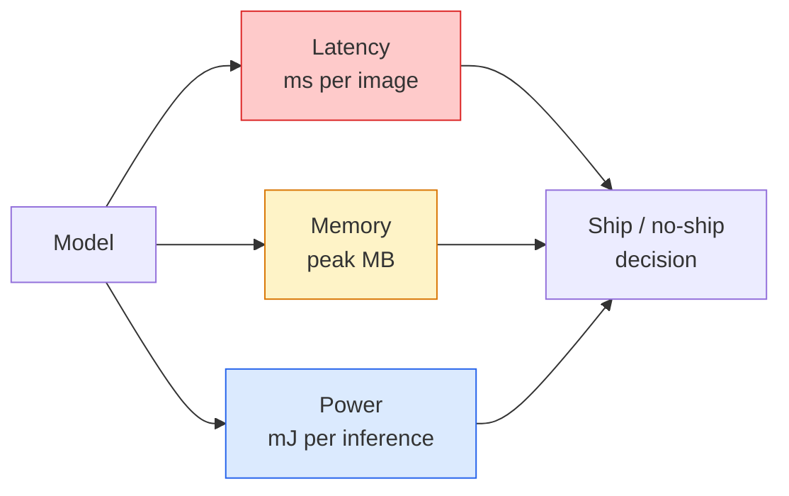

# Visión em tempo real  Deploição de Edge  Real-Time                                                                                                                                                                                                                                                                                                                                                                                                                                                                                                           

> A inferência de borda é a disciplina de obter um modelo de 90 pontos de precisão para executar a 30 fps em um dispositivo com 2 GB de RAM.

> **【中文解读】**边缘推理 é uma técnica de equilíbrio: deixar 90% 准确率 运行30fps em apenas 2GB de armazenamento interno.                                                                                                                                                                                                                                             

> **【拓展：边缘 AI 的应用】**边缘部署在智能手机 (?? 人脸解锁,拍照美化) 无人机 (?? 人机) 实时目标检测) 工业物联网 (?? 缺陷检测) 及自动驾驶 (?? 车载推理) 中至关重要──MobileNet、YOLO-nano、EfficientNet é um modelo de menor escala comum──

**Type:** Learn + Build | **类型:** 学习 + 动手
**Languages:** Python | **语言:** Python
**Prerequisites:** Phase 4 Lesson 04 (Image Classification), Phase 10 Lesson 11 (Quantization) | **前置知识:** Phase 4 Lesson 04（图像分类），Phase 10 Lesson 11（量化）
**Time:** ~75 minutes | **时间:** ~75 分钟

## Objetivos de aprendizagem

- Medir a latência de inferência, a memória máxima e o throughput para qualquer modelo PyTorch, e ler os FLOPs / params / trade-off de latência
- Quantizar um modelo de visão para INT8 utilizando a quantificação pós-treino da PyTorch e verificar a perda de precisão < 1%
- Exportar para ONNX e compilar com ONNX Runtime ou TensorRT; nomear as três falhas de exportação mais comuns e suas correções
- Explique quando escolher MobileNetV3, EfficientNet-Lite, ConvNeXt-Tiny ou MobileViT para uma restrição de borda

> **【中文解读】**O objetivo do aprendizado é listar as capacidades centrais que devem ser adquiridas após a conclusão do curso.


## O problema é o problema da introdução

Um modelo de visão de treinamento é um monstro de ponto flutuante. 100M parâmetros, 10 GFLOPs por passagem avançada, 2 GB de VRAM. Nada disso cabe em um telefone, uma unidade de infotainment de um carro, uma câmera industrial ou um drone. Enviar um sistema de visão significa ajustar as mesmas previsões em um orçamento que é 100 vezes menor.

> O modelo visual no treinamento é um fluxo de monstros.1.000 milhões de parâmetros. Por cada viagem, 10 GFLOPs são distribuídos.

Três botões fazem a maior parte do trabalho: escolha de modelo (uma arquitetura menor com a mesma receita), quantização (INT8 em vez de FP32) e tempo de execução de inferência (ONNX Runtime, TensorRT, Core ML, TFLite).

> Os três rotadores fizeram a maior parte do trabalho: modelo selecionar (small architecture) 量化 (int8 替代FP32) e sutil runtime (onnx runtime), tensorRT, core ML, TFLite) ⋅ usando-os correctamente entre a demonstração que funciona na estação de trabalho e a entrega de produtos em módulos de câmera de 30 dólares ⋅

Esta lição estabelece a disciplina de medição primeiro (você não pode otimizar o que não pode medir), depois anda os três botões.

> Esta aula primeiro estabelece a lei de medida (you cannot optimize what you cannot measure), depois atravessa três ciclos. O objetivo não é aprender a cada lado da corrida, mas saber quais as tuas e como verificar que cada tuas faz o que pensas que faz.

## O conceito central.

> **【中文解读】**Este capítulo apresenta os conceitos e teorias fundamentais.


### Os três orçamentos



- **Latency**A média de apenas p50 oculta o comportamento da cauda que é importante para os sistemas em tempo real.
  Tradução:**延迟**P50 平均值会隐藏对实时系统至关重要的尾部行为──
- **Peak memory**O que importa é que os OOM sejam fatais em alvos embutidos.
  Tradução:**峰值内存**O valor máximo observado no dispositivo não é o valor médio estável.
- **Power / energy**A utilização de CPU/GPU é frequentemente proporcional ao tempo de utilização.
  Tradução:**功耗/能量**A taxa de utilização da CPU/GPU é de aproximadamente 0,00%.

Uma tabela de (modelo, latência, memória, precisão) é a base para a decisão de borda.

> O quadro de 一张 (模型, 延迟, 内存, 精度) é baseada na decisão da implementação de bordes.

### Disciplina de medição

Três regras que todos os perfis de borda devem seguir:

> Cada análise de desempenho de margem deve ser seguida de três regras:

1. **Warm up**O modelo com 5-10 passes de manobra para a frente antes da medição.
   Tradução:**预热** Método de Método de Método de Método de Método de Método de Método de Método de Método de Método de Método de Método de Método de Método de Método de Método de Método de Método de Método de Método de Método de Método de Método de Método de Método de Método de Método de Método de Método de Método de Método de Método de Método de Método de Método de Método de Método de Método de Método de Método de Método de Método de Método de Método de Método de Método de Método de Método de Método de Método de Método de Método de Método de Método de Método de Método de Método de Método de Método de Método de Método de Método de Método de Método de Método de Método de Método de Método de Método de Método de Método de Método de Método de Método de Método de Método de Método de Método de Método de Método de Método de Método de Método de Método de Método de Método de Método de Método de Método de Método de Método de Método de Método de Método de Método de Método de Método de Método de Método de Método de Método de Método de Método de Método de Método de Método de Método de Método de Método de Método de Método de Método de Método de Método de Método de Método de Método de Método de Método de Método
2. **Synchronise**Cargas de trabalho de GPU com `torch.cuda.synchronize()`Sem isso, você mede o despacho do kernel, não a execução do kernel.
   Tradução:**同步** em blocos de cálculo `torch.cuda.synchronize()`Sim步 GPU 工作负载──否则你测量是内核调度,不是内核执行──
3. **Fix input sizes**A latência em 224x224 não é a latência em 512x512.
   Tradução:**固定输入尺寸** utilização de resolução de produção── 224x224  上的延迟不等于 512x512 上的延迟──

### FLOPs como proxy

FLOPs (operações de ponto flutuante por inferência) é um proxy barato, independente do dispositivo para a latência. Útil para comparação de arquitetura, enganoso como um relógio de parede absoluto. Um modelo com 10% mais FLOPs pode ser 2x mais rápido na prática porque usa opções de hardware-friendly (convs profundamente compilar bem, grandes convs 7x7 não).

> FLOPs (FLOPs) são um indicador de atraso de agência de câmbio barato, sem qualquer tipo de equipamento. Aplicam-se para comparação de arquitetura, mas como um modelo de FLOPs de mais de 10% pode ser duplicado, porque usa um hardware-friendly operation.

Regra: utilizar FLOPs para pesquisa de arquitetura, usar latência no dispositivo para decisões de implantação.

> É um exemplo de um sistema de controle de dados de um sistema de controle de dados.

### Quantificação num parágrafo

Substitua os pesos e ativações do FP32 com o INT8. O tamanho do modelo cai 4x, a largura de banda da memória cai 4x, a computação cai 2-4x no hardware que tem kernels do INT8 (todos os modernos SoC móveis, todos os GPUs NVIDIA com Tensor Cores).

> A FP32  peso e ativação substituído para INT8── modelo de tamanho reduzido 4 vezes, de capacidade de armazenamento reduzido 4 vezes, de cálculo em hardware do INT8 interno reduzido 2-4 vezes ((( cada moderno móvel SoC、 cada com Tensor Cores de NVIDIA GPU)── perda de precisão em tarefas visuais geralmente é de 0,1-1% de pontos (( usando treinamento post-static quantização)──

Tipos:

> Tipo:

- **Dynamic** Peso quântico a INT8, ativações calculadas em FP.
  Tradução:**动态** Peso de peso para INT8, valor ativo em FP 计算──简单,加速有限──
- **Static (post-training)** Peso quântico + gama de activação de calibração num pequeno conjunto de calibração.
  Tradução:**静态（训练后）**量化权重 + 在小校准集上校准激活范围──比动态快得多──
- **Quantisation-aware training (QAT)**• simulação de quantização durante o treino para que o modelo aprenda em torno dele.
  Tradução:**量化感知训练（QAT）** treinamento  simulação,                                                                                                                                                                                                                                                           

Para a visão, a quantização estática pós-treino dá 95% dos benefícios com 5% do esforço.

> Para as tarefas visuais, o esforço de quantificação de post-treino estático de 5% obtém 95% de benefícios.

### Triturador e destilação

- **Pruning** remover pesos não importantes (baseados em magnitude) ou canais (estruturados). Funciona bem em modelos sobreparametrizados; menos útil em arquiteturas já compactas.
  Tradução:**剪枝**O deslocamento não é importante em relação ao peso (em função da amplitude) ou da estruturação (em função da estruturação) 
- **Distillation** treinar um pequeno aluno para imitar as logitas de um professor grande. Muitas vezes recupera a maior parte da precisão perdida por encolher o modelo.
  Tradução:**蒸馏** training小模型 (小模型) 学生)模仿大模型 (模仿大模型) 师) 师 (师) 师 (师) 师 (师) 师 (师) 师 (师) 师) 师 (师) 师) 师 (师) 师 (师) 师) 师 (师) 师 (师) 师) 师 (师) 师 (师) 师) 师 (师) 师 (师) 师) 师 (师) 师 (师) 师 (师) 师 (师) 师) 师 (师) 师 (师) 师 (师) 师 (师) 师) 师 (师) 师 (师) 师 (师) 师 (师) 师) 师 (师) 师 (师) 师) 师 (师) 师) 师 (师) 师) 师 (师) 师) 师 (师) 师) 师 (师) 师) 师) 师 (师) 师) 师 (师) 师) 师) 师 (师) 师) 师) 师 (师) 师) 师) 师 (师) 师) 师) 师 (师) 师)

### Os tempos de execução da inferência

- **PyTorch eager** lento, não para implantação, apenas para desenvolvimento.
  Tradução:**PyTorch eager**慢, não para depósito.
- **TorchScript** legado.`torch.compile`e exportação ONNX.
  Tradução:**TorchScript**遗留方案── já foi `torch.compile`E o que é que é?
- **ONNX Runtime**CPU, CUDA, CoreML, TensorRT, OpenVINO todos têm provedores ONNX.
  Tradução:**ONNX Runtime**中性运行时──CPU、CUDA、CoreML、TensorRT、OpenVINO  都有ONNX 供应商──从这里开始──
- **TensorRT** Compilador da NVIDIA. Melhor latência em GPUs NVIDIA (workstation e Jetson). Integra com ONNX Runtime ou standalone.
  Tradução:**TensorRT**NVIDIA's编译器──在NVIDIA GPU(工作站和Jetson) 上延迟最低──
- **Core ML** Tempo de execução da Apple para iOS/macOS. Necessidades `.mlmodel`ou `.mlpackage`- Não .
  Tradução:**Core ML**Apple iOS / macOS 运行时――需要 `.mlmodel`Ou `.mlpackage`- Não.
- **TFLite** O tempo de execução do Google para Android/ARM. Necessidades `.tflite`- Não .
  Tradução:**TFLite**Google Android/ARM 运行时──需要 `.tflite`- Não.
- **OpenVINO** Tempo de execução da Intel para CPU/VPU.`.xml`+ `.bin`- Não .
  Tradução:**OpenVINO**Intel 运行时――需要 `.xml`+ `.bin`- Não.

Na prática: exportar PyTorch -> ONNX -> escolher o tempo de execução para o alvo.

> 实践中:导出 PyTorch -> ONNX -> 选择目标运行时。ONNX 是通用语言。

### Arquitetura de ponta

| Budget | Model | Why |
|--------|-------|-----|
| < 3M params | MobileNetV3-Small | Compiles everywhere, good baseline |
| 3-10M | EfficientNet-Lite-B0 | Best accuracy per param on TFLite |
| 10-20M | ConvNeXt-Tiny | Best accuracy-per-param, CPU-friendly |
| 20-30M | MobileViT-S or EfficientViT | Transformer with ImageNet accuracy |
| 30-80M | Swin-V2-Tiny | If stack supports window attention |

Quantizar todos estes para INT8 a menos que tenha uma razão específica para não o fazer.

> **【中文解读】**Este é um método de "desde zero" que ajuda a entender o princípio da estrutura, não é um problema que se encontra em uma caixa negra.

> **【拓展：工业部署中的视觉系统】**No implementar industrial real, o modelo visual precisa considerar a possibilidade de atrasos, modelos de tamanho, dispositivos de margem, etc. TensorRT, ONNX Runtime, OpenVINO são ferramentas de aceleração de cálculo de uso comum.

> **【拓展：数据标注与质量】** Visual task's effect highly depends on label data quality──Label Studio、CVAT is the mainstream marking tool──In industrial scenarios, proactive learning(Active Learning) pode reduzir o custo de marcação: modelo contra um pedido de amostra não definido marcação artificial, identidade de amostra auto-marcação──


## Construí-lo e realizei-o.
```figure
cnn-param-count
```

## Construí-lo

### Passo 1: Messa a latência corretamente

```python
import time
import torch

def measure_latency(model, input_shape, device="cpu", warmup=10, iters=50):
    model = model.to(device).eval()
    x = torch.randn(input_shape, device=device)
    with torch.no_grad():
        for _ in range(warmup):
            model(x)
        if device == "cuda":
            torch.cuda.synchronize()
        times = []
        for _ in range(iters):
            if device == "cuda":
                torch.cuda.synchronize()
            t0 = time.perf_counter()
            model(x)
            if device == "cuda":
                torch.cuda.synchronize()
            times.append((time.perf_counter() - t0) * 1000)
    times.sort()
    return {
        "p50_ms": times[len(times) // 2],
        "p95_ms": times[int(len(times) * 0.95)],
        "p99_ms": times[int(len(times) * 0.99)],
        "mean_ms": sum(times) / len(times),
    }
```

aquecer, sincronizar, usar `time.perf_counter()`- Relata percentil, não apenas mau.

> 预热、同步、使用 `time.perf_counter()`                                                                                                                                                                                                                                                              

### Passo 2: Contagem de parâmetros e FLOP

```python
def parameter_count(model):
    return sum(p.numel() for p in model.parameters())

def flops_estimate(model, input_shape):
    """
    Rough FLOP count for a conv/linear-only model. For production use `fvcore` or `ptflops`.
    """
    total = 0
    def conv_hook(m, inp, out):
        nonlocal total
        c_out, c_in, kh, kw = m.weight.shape
        h, w = out.shape[-2:]
        total += 2 * c_in * c_out * kh * kw * h * w
    def linear_hook(m, inp, out):
        nonlocal total
        total += 2 * m.in_features * m.out_features
    hooks = []
    for m in model.modules():
        if isinstance(m, torch.nn.Conv2d):
            hooks.append(m.register_forward_hook(conv_hook))
        elif isinstance(m, torch.nn.Linear):
            hooks.append(m.register_forward_hook(linear_hook))
    model.eval()
    with torch.no_grad():
        model(torch.randn(input_shape))
    for h in hooks:
        h.remove()
    return total
```

Para projectos reais `fvcore.nn.FlopCountAnalysis`ou `ptflops`; eles lidam com cada tipo de módulo corretamente.

>                                                                                                                                                                                                                                                                                                                                                                                                                                                                                                                              `fvcore.nn.FlopCountAnalysis`Ou `ptflops`• podem processar correctamente cada tipo de módulo.

### Passo 3: Quantização estática pós-treino

```python
def quantise_ptq(model, calibration_loader, backend="x86"):
    import torch.ao.quantization as tq
    model = model.eval().cpu()
    model.qconfig = tq.get_default_qconfig(backend)
    tq.prepare(model, inplace=True)
    with torch.no_grad():
        for x, _ in calibration_loader:
            model(x)
    tq.convert(model, inplace=True)
    return model
```

Três etapas: configurar, preparar (insertar observadores), calibrar com dados reais, converter (fusão + quantização).`Conv -> BN -> ReLU`-> `ConvBnReLU`), que `torch.ao.quantization.fuse_modules`- As asas.

> O que é que se passa com o sistema de dados?`Conv -> BN -> ReLU`-> `ConvBnReLU`),`torch.ao.quantization.fuse_modules`Tratar isto.

### Passo 4: Exportação para ONNX

```python
def export_onnx(model, sample_input, path="model.onnx"):
    model = model.eval()
    torch.onnx.export(
        model,
        sample_input,
        path,
        input_names=["input"],
        output_names=["output"],
        dynamic_axes={"input": {0: "batch"}, "output": {0: "batch"}},
        opset_version=17,
    )
    return path
```

`opset_version=17`é o default seguro em 2026. `dynamic_axes`permite executar o modelo ONNX com tamanho de lote arbitrário.

> `opset_version=17`É o valor de segurança de 2026`dynamic_axes`Permitir o ONNX 模型 em qualquer lote de grande porte.

### Passo 5: Identificar e comparar os regimes

```python
import torch.nn as nn
from torchvision.models import mobilenet_v3_small

def compare_regimes():
    model = mobilenet_v3_small(weights=None, num_classes=10)
    params = parameter_count(model)
    flops = flops_estimate(model, (1, 3, 224, 224))
    lat_fp32 = measure_latency(model, (1, 3, 224, 224), device="cpu")
    print(f"FP32 MobileNetV3-Small: {params:,} params  {flops/1e9:.2f} GFLOPs  "
          f"p50={lat_fp32['p50_ms']:.2f}ms  p95={lat_fp32['p95_ms']:.2f}ms")
```

Executa a mesma função para `resnet50`- Não .`efficientnet_v2_s`, e `convnext_tiny`e tem a tabela de comparação que precisa para uma decisão de implantação.

> Para o`resnet50`- Não.`efficientnet_v2_s`和 `convnext_tiny`Operar a mesma função, você já obteve o índice de comparação necessário para a decisão de implantação.

> **【中文解读】**Este capítulo mostra como usar um framework maduro (como PyTorch、HuggingFace etc) rápida aplicação desta tecnologia.


> **【拓展：视觉模型的持续学习】**Em um ambiente de produção, o modelo visual precisa se adaptar constantemente a novos dados. Isto é especialmente importante na condução automática e no controle de qualidade industrial.

## Use-o com o framework implementado.

As pilhas de produção convergem numa das três vias:

- **Web / serverless**PyTorch -> ONNX -> ONNX Runtime (provedor de CPU ou CUDA).
- **NVIDIA edge (Jetson, GPU server)**PiTorch -> ONNX -> TensorRT. Melhor latência, maior esforço de engenharia.
- **Mobile**A quantização antes da exportação.

> **【中文解读】**Este capítulo se concentra em como o modelo será implantado como produto disponível. De modelo original a nível de produção, os sistemas precisam considerar várias dimensões de otimização de desempenho, tratamento de erros, controle, etc.


Para medição, `torch-tb-profiler`- Não .`nvprof`- Não .`nsys`, e Instrumentos no macOS fornecem rupturas camada por camada. `benchmark_app`(OpenVINO) e `trtexec`(TensorRT) dar números CLI autônomos.


## Envia-o . Produto .

> **【中文解读】**Practicação de temas de fácil/médio/difícil  3o dificuldade de passagem  Recomendação de completar pelo menos Praça de nível médio Classe difícil  Adaptação a pesquisa profunda ou preparação para o encontro 


Esta lição produz:

- `outputs/prompt-edge-deployment-planner.md` um prompt que seleciona a coluna vertebral, a estratégia de quantização e o tempo de execução dado o dispositivo alvo e o SLA de latência.
- `outputs/skill-latency-profiler.md` uma habilidade que escreve um script completo de benchmarking de latência com aquecimento, sincronização, percêntulos e rastreamento de memória.

## Exercícios.

1. **(Easy)**Medir a latência p50 para `resnet18`- Não .`mobilenet_v3_small`- Não .`efficientnet_v2_s`, e `convnext_tiny`Relata a tabela e identifique qual arquitetura tem a melhor precisão por ms.
2. **(Medium)**Aplicar quantificação estática pós- treino para `mobilenet_v3_small`. Relatar perda de latência e precisão FP32 vs INT8 em um subconjunto de CIFAR-10 ou similar.
3. **(Hard)**Exportação `convnext_tiny`Para ONNX, passe-o.`onnxruntime`com o `CPUExecutionProvider`, e comparar a latência com a linha de base PyTorch ansioso. Identificar a primeira camada onde ONNX Runtime é mais rápido e explicar por que.

> **【中文解读】**No 术语表中的"O que as pessoas dizem" vs "O que realmente significa" 区分日常口语和精确技术含义── em equipe,统一术语定义可以避免大量沟通误解──


## Termos-chave .

| Term | What people say | What it actually means |
|------|----------------|----------------------|
| Latency | "How fast" | Time from input to output; p50/p95/p99 percentiles, not mean |
| FLOPs | "Model size" | Floating-point ops per forward pass; rough proxy for compute cost |
| INT8 quantisation | "8-bit" | Replace FP32 weights/activations with 8-bit integers; ~4x smaller, 2-4x faster |
| PTQ | "Post-training quantisation" | Quantise a trained model without retraining; easy, usually enough |
| QAT | "Quantisation-aware training" | Simulate quantisation during training; best accuracy, requires labelled data |
| ONNX | "The neutral format" | Model exchange format supported by every mainstream inference runtime |
| TensorRT | "NVIDIA compiler" | Compiles ONNX into an optimised engine for NVIDIA GPUs |
| Distillation | "Teacher -> student" | Train a small model to mimic a big model's logits; recovers most lost accuracy |

> **【中文解读】**延伸阅读 fornece recursos de alta qualidade para a aprendizagem profunda.


## Mais leitura 延伸阅读

- [EfficientNet (Tan & Le, 2019)](https://arxiv.org/abs/1905.11946) Escalagem composta para arquiteturas eficientes
- [MobileNetV3 (Howard et al., 2019)](https://arxiv.org/abs/1905.02244)Arquitetura móvel com h-swish e squeeze-excite
- [A Practical Guide to TensorRT Optimization (NVIDIA)](https://developer.nvidia.com/blog/accelerating-model-inference-with-tensorrt-tips-and-best-practices-for-pytorch-users/) como obter os números de transmissão no papel
- [ONNX Runtime docs](https://onnxruntime.ai/docs/) quantificação, otimização de gráficos, selecção de fornecedores
