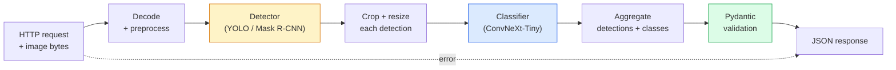

# Construir um Completo Vision Pipeline  Capstone  Construir um Completo Visual                                                                                                                                                                                                                                                                                                                                                                                                                                                                                                         

> Um sistema de visão de produção é uma cadeia de modelos e regras confeccionadas com contratos de dados.

> **【中文解读】**O sistema de produção de nível visual é um conjunto de modelos e regras ligados por um contrato de dados. O curso anterior da estação já abrange os componentes, este projeto de graduação irá montá-los de ponta a ponta, incluindo a carga de dados, o pre-processamento, a raciocínio de modelos, o pós-processamento e a saída de resultados.

**Type:** Build | **类型:** 动手
**Languages:** Python | **语言:** Python
**Prerequisites:** Phase 4 Lessons 01-15 | **前置知识:** Phase 4 Lessons 01-15
**Time:** ~120 minutes | **时间:** ~120 分钟

## Objetivos de aprendizagem

- Projetar um pipeline de visão de produção que detecte objetos, os classifique e emita JSON estruturado  com cada caminho de falha manuseado
- Conectar um detector (Mask R-CNN ou YOLO), um classificador (ConvNeXt-Tiny) e um contrato de dados (Pydantic) num único serviço
- Marcar de referência o pipeline de ponta a ponta e identificar o primeiro gargalo de engarrafamento (geralmente pré-processamento, em seguida, o detector)
- Envie um serviço FastAPI mínimo que aceite um upload de imagem, execute o pipeline e retorna as detecções com classificações

> **【中文解读】**O objetivo do aprendizado é listar as capacidades centrais que devem ser adquiridas após a conclusão do curso.


## O problema é o problema da introdução

Os modelos de visão individuais são úteis; os produtos de visão são cadeias deles. Uma auditoria de prateleira de varejo é um detector mais um classificador de produto mais um pipeline OCR de preço.

> 单个视觉模型有用; 视觉产品是它们的链条;;零售货架审计是检测器加产品分类器加价 OCR 流水线;;自动驾驶是2D检测器加3D检测器加分器加跟踪器加规划器;;医疗预测是分器加区域分类器加临床 UI;;

A ligação dessas cadeias é a parte que separa um protótipo ML de um produto. Cada interface entre modelos é um novo lugar para bugs. Cada transformação de coordenadas, cada normalização, cada tamanho de máscara é um candidato à falha silenciosa. Um pipeline é tão forte quanto sua interface mais fraca.

>                                                                                                                                                                                                                                                               

Esta pedra final estabelece o mínimo viável pipeline: detecção + classificação + saída estruturada + uma camada de servidão. Tudo o resto na fase 4 slots neste esqueleto: troca Mask R-CNN para YOLOv8, adicionar uma cabeça OCR, adicionar um ramo de segmentação, adicionar um rastreador. A arquitetura é estável; as peças são plugáveis.

> Este projeto de formação construiu a linha de água mínima disponível: teste + classificação +  estruturação de saída +  nível de serviço.

## O conceito central.

> **【中文解读】**Este capítulo apresenta os conceitos e teorias fundamentais.


### O oleoduto



As duas fases são caras, as outras cinco são onde os insetos vivem.

> 七阶段── dois estágios modelo são caros; os restantes cinco estágios são bug 藏身之处──

### Contratos de dados com a Pydantic

Cada limite modelo torna-se um objeto tipado, transformando falhas silenciosas em falhas ruidosas.

> Cada modelo se transforma em objeto de tipificação. Isto vai tornar o silêncio falhado em erro evidente.

```
Detection(
    box: tuple[float, float, float, float],   # (x1, y1, x2, y2), absolute pixels
    score: float,                              # [0, 1]
    class_id: int,                             # from detector's label map
    mask: Optional[list[list[int]]],           # RLE-encoded if present
)

PipelineResult(
    image_id: str,
    detections: list[Detection],
    classifications: list[Classification],
    inference_ms: float,
)
```

Quando um detector retorna caixas em `(cx, cy, w, h)`Em vez de`(x1, y1, x2, y2)`A validação do Pydantic falha na fronteira e descobrem imediatamente em vez de depurar uma colheita a jusante que silenciosamente retorna regiões vazias.

> Quando o testeiro voltar `(cx, cy, w, h)`Não é`(x1, y1, x2, y2)`Quando o quadro de formato, a verificação do Pydantic falha na fronteira, você consegue descobrir o problema imediatamente, em vez de tentar cortar o processo e descobrir que ele está silenciosamente voltando para a área em branco.

### Onde vai a latência

Três verdades são verdadeiras em quase todos os canais de visão:

> Quase todos os vídeos são feitos de três fatos:

1. **Preprocessing is often the biggest single block.**Decodificar JPEGs, converter espaços de cores, redimensionar  estes são ligados à CPU e fáceis de esquecer.
   Tradução:**预处理通常是最大的单一开销。**解码 JPEG、转换色空间、缩放 这些都是CPU 密集型,易被忘了──
2. **The detector dominates GPU time.**70-90% do tempo da GPU está no passe de detecção.
   Tradução:**检测器占据 GPU 时间的主导。**70-90% do tempo de GPU gasto em teste e na divulgação.
3. **Postprocessing (NMS, RLE encode/decode) is cheap on GPU, expensive on CPU.**Sempre em perfil com o alvo real.
   Tradução:**后处理（NMS、RLE 编解码）在 GPU 上便宜，在 CPU 上昂贵。**始终在实际目标上分析──

Conhecer a distribuição é o que transforma a otimização numa lista de prioridades.

>  compreender a situação da distribuição para que a otimização se torne uma lista de prioridades.

### Modos de falha

- **Empty detections**- Retorna a lista vazia, não caia.
  Tradução:**空检测结果** Volta para a lista, não se desmorone.
- **Out-of-bounds boxes** Aplique-se ao tamanho da imagem antes de cortar.
  Tradução:**越界框**裁剪前限制到图像尺寸内──
- **Tiny crops** classificação de salto para caixas menores que a entrada mínima do classificador.
  Tradução:**微小裁剪** Salto por cima do menor de entrada do quadro de categorias.
- **Corrupt upload** 400 respostas com um código de erro específico, não 500.
  Tradução:**损坏的上传** Retorno com um erro específico de 400 响应, não 500 
- **Model load failure** falha na inicialização do serviço, não no primeiro pedido.
  Tradução:**模型加载失败** Em serviço iniciação quando falha, e não em primeiro pedido

Uma linha de produção lida com cada um destes sem escrever générico `try/except`Cada falha recebe um código nomeado e uma resposta.

> Classe de produção de fluxo de água para tratamento de cada situação não é necessário esconder o tipo de falha`try/except`Todos os fracassos têm um nome e uma resposta.

### Batchamento

Um serviço de produção atende a vários clientes. Detecções de loteamento e classificações em todas as solicitações multiplicam o rendimento. O trade-off: latência extra de esperar que um lote se preencha. Configuração típica: coletar solicitações por até 20ms, juntar loteamento, processar, distribuir respostas. `torchserve`E ...`triton`Os serviços de pequeno porte com carga previsível lançam o seu próprio micro-batcher.

> Produção de serviços ao mesmo tempo que serviço de vários clientes.`torchserve`和 `triton`O serviço de micro-processamento pode ser realizado por si mesmo.

> **【拓展：工业部署中的视觉系统】**No implementar industrial real, o modelo visual precisa considerar a possibilidade de atrasos, modelos de tamanho, dispositivos de margem, etc. TensorRT, ONNX Runtime, OpenVINO são ferramentas de aceleração de cálculo de uso comum.

> **【拓展：数据标注与质量】** Visual task's effect highly depends on label data quality──Label Studio、CVAT is the mainstream marking tool──In industrial scenarios, proactive learning(Active Learning) pode reduzir o custo de marcação: modelo contra um pedido de amostra não definido marcação artificial, identidade de amostra auto-marcação──

> **【拓展：合成数据与数据增强】**Quando os dados reais são insuficientes, os dados sintéticos (como Blender, Unity, 染) e os dados aumentados (como arquivos de documentação) são duas estratégias eficazes.


## Construí-lo e realizei-o.

> **【中文解读】**Este é um método de "desde zero" que ajuda a entender o princípio da estrutura, não é um problema que se encontra em uma caixa negra.

```figure
v4-vision-pipeline
```

## Construí-lo

### Passo 1: Contratos de dados

```python
from pydantic import BaseModel, Field
from typing import List, Optional, Tuple

class Detection(BaseModel):
    box: Tuple[float, float, float, float]
    score: float = Field(ge=0, le=1)
    class_id: int = Field(ge=0)
    mask_rle: Optional[str] = None


class Classification(BaseModel):
    detection_index: int
    class_id: int
    class_name: str
    score: float = Field(ge=0, le=1)


class PipelineResult(BaseModel):
    image_id: str
    detections: List[Detection]
    classifications: List[Classification]
    inference_ms: float
```

Cinco segundos de código poupam uma hora de depuração em qualquer pipeline séria.

> O código de 5 segundos pode economizar qualquer tipo de fluxo de água.

### Passo 2: Uma classe mínima de Pipeline

```python
import time
import numpy as np
import torch
from PIL import Image

class VisionPipeline:
    def __init__(self, detector, classifier, class_names,
                 device="cpu", min_crop=32):
        self.detector = detector.to(device).eval()
        self.classifier = classifier.to(device).eval()
        self.class_names = class_names
        self.device = device
        self.min_crop = min_crop

    def preprocess(self, image):
        """
        image: PIL.Image or np.ndarray (H, W, 3) uint8
        returns: CHW float tensor on device
        """
        if isinstance(image, Image.Image):
            image = np.asarray(image.convert("RGB"))
        tensor = torch.from_numpy(image).permute(2, 0, 1).float() / 255.0
        return tensor.to(self.device)

    @torch.no_grad()
    def detect(self, image_tensor):
        return self.detector([image_tensor])[0]

    @torch.no_grad()
    def classify(self, crops):
        if len(crops) == 0:
            return []
        batch = torch.stack(crops).to(self.device)
        logits = self.classifier(batch)
        probs = logits.softmax(-1)
        scores, cls = probs.max(-1)
        return list(zip(cls.tolist(), scores.tolist()))

    def run(self, image, image_id="anonymous"):
        t0 = time.perf_counter()
        tensor = self.preprocess(image)
        det = self.detect(tensor)

        crops = []
        detections = []
        valid_indices = []
        for i, (box, score, cls) in enumerate(zip(det["boxes"], det["scores"], det["labels"])):
            x1, y1, x2, y2 = [max(0, int(b)) for b in box.tolist()]
            x2 = min(x2, tensor.shape[-1])
            y2 = min(y2, tensor.shape[-2])
            detections.append(Detection(
                box=(x1, y1, x2, y2),
                score=float(score),
                class_id=int(cls),
            ))
            if (x2 - x1) < self.min_crop or (y2 - y1) < self.min_crop:
                continue
            crop = tensor[:, y1:y2, x1:x2]
            crop = torch.nn.functional.interpolate(
                crop.unsqueeze(0),
                size=(224, 224),
                mode="bilinear",
                align_corners=False,
            )[0]
            crops.append(crop)
            valid_indices.append(i)

        class_preds = self.classify(crops)

        classifications = []
        for valid_idx, (cls_id, cls_score) in zip(valid_indices, class_preds):
            classifications.append(Classification(
                detection_index=valid_idx,
                class_id=int(cls_id),
                class_name=self.class_names[cls_id],
                score=float(cls_score),
            ))

        return PipelineResult(
            image_id=image_id,
            detections=detections,
            classifications=classifications,
            inference_ms=(time.perf_counter() - t0) * 1000,
        )
```

Cada interface é digitada, cada caminho de falha tem uma decisão específica de manipulação.

> Cada interface é tipográfica. Cada caminho de falha tem uma decisão de tratamento clara.

### Passo 3: Conectar um detector e um classificador

```python
from torchvision.models.detection import maskrcnn_resnet50_fpn_v2
from torchvision.models import convnext_tiny

# Use ImageNet-pretrained weights for a realistic pipeline without training
detector = maskrcnn_resnet50_fpn_v2(weights="DEFAULT")
classifier = convnext_tiny(weights="DEFAULT")
class_names = [f"imagenet_class_{i}" for i in range(1000)]

pipe = VisionPipeline(detector, classifier, class_names)

# Smoke test with a synthetic image
test_image = (np.random.rand(400, 600, 3) * 255).astype(np.uint8)
result = pipe.run(test_image, image_id="demo")
print(result.model_dump_json(indent=2)[:500])
```

### Passo 4: Serviço FastAPI

```python
from fastapi import FastAPI, UploadFile, HTTPException
from io import BytesIO

app = FastAPI()
pipe = None  # initialised on startup

@app.on_event("startup")
def load():
    global pipe
    detector = maskrcnn_resnet50_fpn_v2(weights="DEFAULT").eval()
    classifier = convnext_tiny(weights="DEFAULT").eval()
    pipe = VisionPipeline(detector, classifier, class_names=[f"c{i}" for i in range(1000)])

@app.post("/detect")
async def detect_endpoint(file: UploadFile):
    if file.content_type not in {"image/jpeg", "image/png", "image/webp"}:
        raise HTTPException(status_code=400, detail="unsupported image type")
    data = await file.read()
    try:
        img = Image.open(BytesIO(data)).convert("RGB")
    except Exception:
        raise HTTPException(status_code=400, detail="cannot decode image")
    result = pipe.run(img, image_id=file.filename or "upload")
    return result.model_dump()
```

Corra com `uvicorn main:app --host 0.0.0.0 --port 8000`Teste com`curl -F 'file=@dog.jpg' http://localhost:8000/detect`- Não .

> - Não .`uvicorn main:app --host 0.0.0.0 --port 8000`- Não.`curl -F 'file=@dog.jpg' http://localhost:8000/detect`- Não.

### Passo 5: Marque de referência do gasoduto

```python
import time

def benchmark(pipe, num_runs=20, image_size=(400, 600)):
    img = (np.random.rand(*image_size, 3) * 255).astype(np.uint8)
    pipe.run(img)  # warm up

    stages = {"preprocess": [], "detect": [], "classify": [], "total": []}
    for _ in range(num_runs):
        t0 = time.perf_counter()
        tensor = pipe.preprocess(img)
        t1 = time.perf_counter()
        det = pipe.detect(tensor)
        t2 = time.perf_counter()
        crops = []
        for box in det["boxes"]:
            x1, y1, x2, y2 = [max(0, int(b)) for b in box.tolist()]
            x2 = min(x2, tensor.shape[-1])
            y2 = min(y2, tensor.shape[-2])
            if (x2 - x1) >= pipe.min_crop and (y2 - y1) >= pipe.min_crop:
                crop = tensor[:, y1:y2, x1:x2]
                crop = torch.nn.functional.interpolate(
                    crop.unsqueeze(0), size=(224, 224), mode="bilinear", align_corners=False
                )[0]
                crops.append(crop)
        pipe.classify(crops)
        t3 = time.perf_counter()
        stages["preprocess"].append((t1 - t0) * 1000)
        stages["detect"].append((t2 - t1) * 1000)
        stages["classify"].append((t3 - t2) * 1000)
        stages["total"].append((t3 - t0) * 1000)

    for stage, times in stages.items():
        times.sort()
        print(f"{stage:12s}  p50={times[len(times)//2]:7.1f} ms  p95={times[int(len(times)*0.95)]:7.1f} ms")
```

Saída típica na CPU: pré-processo ~ 3 ms, detecção 300-500 ms, classificação 20-40 ms, total 350-550 ms. Na GPU, detecção é 20-40 ms e o pré-processo + classificação começa a importar mais em termos relativos.

> Na GPU, a pesquisa de cerca de 20-40ms, a proporção de pré-processamento e de divisão em relação a outros tipos de processamento é mais importante.

> **【中文解读】**Este capítulo mostra como usar um framework maduro (como PyTorch、HuggingFace etc) rápida aplicação desta tecnologia.


> **【拓展：视觉模型的持续学习】**Em um ambiente de produção, o modelo visual precisa se adaptar constantemente a novos dados. Isto é especialmente importante na condução automática e no controle de qualidade industrial.

## Use-o com o framework implementado.

As modelos de produção convergem para a mesma estrutura, mais:

- **Model versioning** sempre registar o nome do modelo e pesos hash na resposta.
- **Per-request trace IDs** Registrar cada fase de cada pedido para que possa correlacionar respostas lentas com etapas.
- **Fallback path** se o classificador não estiver disponível, retornar as detecções sem classificações, em vez de não cumprir todo o pedido.
- **Safety filters**Os filtros NSFW/PII são executados após a classificação, antes que a resposta saia do serviço.
- **Batch endpoint** a `/detect_batch`aceitação de uma lista de URLs de imagem para processamento em massa.

Para a produção de serviço, `torchserve`- Não .`Triton Inference Server`, e `BentoML`Manter batches, versões, métricas e verificações de saúde fora da caixa.`FastAPI`O produto é perfeito para protótipos e produtos de pequena escala.

> **【中文解读】**Este capítulo se concentra em como o modelo será implantado como produto disponível. De modelo original a nível de produção, os sistemas precisam considerar várias dimensões de otimização de desempenho, tratamento de erros, controle, etc.


## Envia-o . Produto .

Esta lição produz:

- `outputs/prompt-vision-service-shape-reviewer.md` um prompt que revisa o código de um serviço de visão para violações de forma de contrato/resposta e nomeia o primeiro bug de quebra.
- `outputs/skill-pipeline-budget-planner.md` uma habilidade que, dada a latência e o rendimento-alvo, atribui um orçamento de tempo a cada fase do pipeline e indica qual estágio perderá o seu orçamento primeiro.

> **【中文解读】**Practicação de temas de fácil/médio/difícil  3o dificuldade de passagem  Recomendação de completar pelo menos Praça de nível médio Classe difícil  Adaptação a pesquisa profunda ou preparação para o encontro 


## Exercícios.

1. **(Easy)**Execute o pipeline em 10 imagens de qualquer conjunto de dados aberto.
2. **(Medium)**Adicionar um campo de saída de máscara para `Detection`Verifique que o JSON permanece abaixo de 1 MB mesmo para uma imagem de 10 objetos.
3. **(Hard)**Adicionar um micro-batcher na frente do classificador: recolher culturas por até 10 ms, classificá-las todas em uma chamada de GPU, retornar resultados por pedido. Medir o ganho de throughput em 5 solicitações simultâneas por segundo e a latência adicionada.

> **【中文解读】**No 术语表中的"O que as pessoas dizem" vs "O que realmente significa" 区分日常口语和精确技术含义── em equipe,统一术语定义可以避免大量沟通误解──


## Termos-chave .

| Term | What people say | What it actually means |
|------|----------------|----------------------|
| Pipeline | "The system" | An ordered chain of preprocessing, inference, and postprocessing steps with a typed interface between each pair |
| Data contract | "The schema" | Pydantic / dataclass definitions that every stage input and output conforms to; catches integration bugs at the boundary |
| Preprocessing | "Before the model" | Decoding, colour conversion, resizing, normalising; usually the biggest CPU time sink |
| Postprocessing | "After the model" | NMS, mask resize, threshold, RLE encode; cheap on GPU, expensive on CPU |
| Microbatcher | "Collect then forward" | Aggregator that waits a fixed window for multiple requests, runs a single batched forward pass |
| Trace ID | "Request id" | Per-request identifier logged at every stage so slow requests can be traced end-to-end |
| Failure code | "Named error" | Specific error code per failure class instead of generic 500; enables client retry logic |
| Health check | "Readiness probe" | Cheap endpoint that reports whether the service can answer; loadbalancers rely on this |

> **【中文解读】**延伸阅读 fornece recursos de alta qualidade para a aprendizagem profunda.


## Mais leitura 延伸阅读

- [Full Stack Deep Learning — Deploying Models](https://fullstackdeeplearning.com/course/2022/lecture-5-deployment/) a visão geral canónica da implantação de sistemas de produção
- [BentoML docs](https://docs.bentoml.com) Servir quadro com batching, versão e métricas
- [torchserve docs](https://pytorch.org/serve/) Biblioteca oficial de serviço da PyTorch
- [NVIDIA Triton Inference Server](https://developer.nvidia.com/triton-inference-server) serviço de alta produção com apoio em lotes e múltiplos modelos
