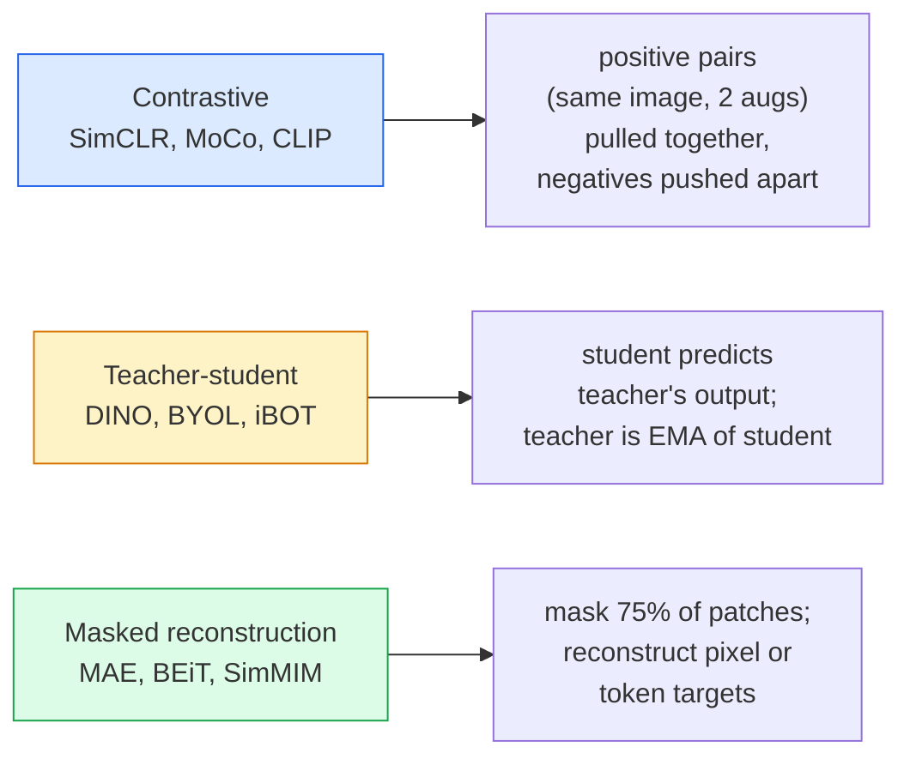

# Visão auto-supervisionada SimCLR, DINO, MAE

> Os rótulos são o gargalo da visão supervisionada. O auto-supervisão pré-treinamento remove-os: aprenda características visuais de 100 milhões de imagens não rotuladas, sintonize-as em 10 mil.

> **【中文解读】**O auto-inspecção pre-treinamento eliminou esta restrição: de 1 bilhão de páginas de imagens sem etiqueta para aprender os traços de imagem, depois de 10 mil páginas de imagens com etiqueta para a sua configuração.

> **【拓展：自监督学习是 GPT 的秘密】**GPT 就是一种自监督模型通过预测下一个词来学习──在视觉领域,MAE 通过预测被遮盖的补丁来学习,DINO 通过自蒸学习语义特征──DINOv2 已成为许多视觉任务的基础模型──

**Type:** Learn + Build | **类型:** 学习 + 动手
**Languages:** Python | **语言:** Python
**Prerequisites:** Phase 4 Lesson 04 (Image Classification), Phase 4 Lesson 14 (ViT) | **前置知识:** Phase 4 Lesson 04（图像分类），Phase 4 Lesson 14（ViT）
**Time:** ~75 minutes | **时间:** ~75 分钟

## Objetivos de aprendizagem

- Rastrear as três principais famílias auto-supervisionadas  contrastiva (SimCLR), professor-estudante (DINO), reconstrução enmascarada (MAE)  e indicar o que cada uma otimiza
- Implementar uma perda do InfoNCE a partir do zero e explicar por que um lote de 512 funciona mas um lote de 32 falha
- Explicar por que a proporção de mascaramento de 75% do MAE não é arbitrária e como é diferente da proporção de 15% do BERT para o texto
- Utilize os pontos de controlo DINOv2 ou MAE ImageNet para a investigação linear e a recuperação de tiros zero

> **【中文解读】**O objetivo do aprendizado é listar as capacidades centrais que devem ser adquiridas após a conclusão do curso.


## O problema é o problema da introdução

A Supervised ImageNet tem 1,3 milhões de imagens rotuladas, que custam cerca de 10 milhões de dólares para anotar. Os conjuntos de dados médicos e industriais são menores e ainda mais caros de rotulado. Cada equipe de visão pergunta: podemos pre-treinar em dados baratos sem rotulagem  quadros do YouTube, rastreamentos na web, imagens de webcam, varreduras por satélite  e depois ajustar em um pequeno conjunto rotulado?

> 监督式 ImageNet tem 1.3 milhões de imagens de marcação, estimativa de custo de marcação de US$ 1 milhão. O conjunto de dados médicos e industriais é menor, o custo de marcação é maior.

A aprendizagem auto-supervisionada é a resposta. Uma ViT moderna auto-supervisionada treinada em LAION ou JFT atinge ou supera a precisão da ImageNet supervisionada quando ajustada. Também transfere melhor para tarefas ao fundo (detecção, segmentação, profundidade) do que a pré-treinamento supervisionado. DINOv2 (Meta, 2023) e MAE (Meta, 2022) são as padrões atuais de produção para recursos de visão transferíveis.

> O desenvolvimento de um sistema de controle de dados e de dados em um sistema de controle de dados e de dados em um sistema de controle de dados e de dados em um sistema de controle de dados e de dados em um sistema de controle de dados e de dados em um sistema de controle de dados e de dados.

A mudança conceitual é que a tarefa de pretexto  a coisa para a qual o modelo é treinado  não tem de ser a tarefa de baixo nível. O que importa é que força o modelo a aprender características úteis. Previr a cor das imagens em escala de cinza, girar as imagens e pedir ao modelo que classifique a rotação, mascarar os parches e reconstruí-los  tudo funcionou. As três abordagens que fazem essa escala são a aprendizagem contrastiva, a destilação professor-estudante e a reconstrução enmascarada.

> Concepttual transformation is preposition task model is trained to do not necessarily is down游 task。 importante é que ele obriga o modelo a aprender características úteis。 prevê a cinza da imagem, a imagem giratória e deixa o modelo dividir-se em rotas, ocultar blocos e reconstruir tudo isso é válido。 três métodos de expansão são contra a aprendizagem、 professor-aluno vapor e ocultar reconstruir。

## O conceito central.

> **【中文解读】**Este capítulo apresenta os conceitos e teorias fundamentais.


### Três famílias



### Aprendizagem contrasta (SimCLR)

Tome uma imagem, aplique duas ampliações aleatórias, obtenha duas visualizações. Alimenta as duas através do mesmo codificador e uma cabeça de projeção. Minimize uma perda que diz "estes dois incorporados devem ser próximos" e "este incorporado deve estar longe dos outros embutidos de imagem no lote".

> 取一张图像,施加两种随机增强,得到两种视图――将两者通过同一编码器加投影头――最小化一个损失函数:"Estes dois embeds devem ser próximos"和" esse embed deve estar longe de todos os outros embeds de imagens do lote"――

```
Loss for positive pair (z_i, z_j) among 2N views per batch:

   L_ij = -log( exp(sim(z_i, z_j) / tau) / sum_k in batch \ {i} exp(sim(z_i, z_k) / tau) )

sim = cosine similarity
tau = temperature (0.1 standard)
```

Esta é a perda do InfoNCE. Requer muitos negativos por positivo, então o tamanho do lote importa. SimCLR precisa de 512-8192.

> É o que a InfoNCE 损失──. Requer que cada modelo válido responda a muitas amostras negativas, por isso a grandeza do lote é fundamental. SimCLR 需要 512-8192.

### Professor-aluno (DINO)

Duas redes com a mesma arquitetura: aluno e professor. O professor é uma média móvel exponencial (EMA) dos pesos do aluno. Ambos veem visões aumentadas da imagem. A saída do aluno é treinada para corresponder aos negativos explícitos do professor.

>  duas redes de mesma estrutura: aluno e professor. índice de peso do professor (em média) é proveniente do peso do aluno. ambas veem imagens de aumento de peso.

```
loss = CE( student_output(view_1),  teacher_output(view_2) )
     + CE( student_output(view_2),  teacher_output(view_1) )

teacher_weights = m * teacher_weights + (1 - m) * student_weights   (m ≈ 0.996)
```

Por que não se desmorona para "previr uma constante": a produção do professor é centrada (subtrair a média por dimensão) e afiada (dividida por pequena temperatura).

> Por que não se desmorona para "previsibilidade constante": o professor de saída de residência (Reduzindo o valor médio por dimensão) e a distribuição (Reduzindo a temperatura)

DINO é o que DINOv2 escala, em 142M de imagens curadas. As características resultantes são a atual SOTA para recuperação visual de tiros zero e previsão densa.

> DINO é a base de DINOv2, expandido em 1.42 bilhões de张精选图像.

### Reconstrução mascarada (MAE)

Mascarar 75% dos patches de uma entrada ViT. Passar apenas os 25% visíveis através do codificador. Um pequeno decodificador recebe a saída do codificador mais tokens de máscara em posições mascaradas, e é treinado para reconstruir os pixels dos patches mascarados.

> 掩蔽VIT 输入的75% 补丁──只会见的25% 通过编码器──一个小解码器接收编码器输出加上掩码位置的掩码代币,训练重建被掩饰补丁的像素──

```
Encoder:  visible 25% of patches -> features
Decoder:  features + mask tokens at masked positions -> reconstructed pixels
Loss:     MSE between reconstructed and original pixels on masked patches only
```

As principais opções de design que fazem funcionar a MAE:

> Para MAE 生效的关键设计选择:

- **75% mask ratio**Força o codificador a aprender características semânticas; reconstruir 25% seria quase trivial (pixéis vizinhos são tão correlacionados que uma CNN poderia pregá-lo).
  Tradução:**75% 掩码率** muito alto.  obrigar o programador a aprender linguagem; reedificar 25%  quase é comum.
- **Asymmetric encoder/decoder**O grande codificador ViT só vê manchas visíveis; um pequeno decodificador (8 camadas, 512-dim) lida com a reconstrução. 3x mais rápido pré-treino do que o ingênuo BEiT.
  Tradução:**非对称编码器/解码器** ViT 编码器只看可见补丁;小型解码器(8 层,512 维) Processar reconstrução。比朴素 BEiT 预训快3 倍。
- **Pixel-space reconstruction target** mais simples do que o alvo tokenizado da BEiT e funciona melhor no ViT.
  Tradução:**像素空间重建目标**                                                                                                                                                                                                                                                              

Depois do treinamento, descartem o decodificador.

> Pre-training depois de desistir de um desenhador.

### Por que 75% e não 15%

O BERT mascara 15% dos tokens, o MAE mascara 75%, a diferença é a densidade de informação.

> BERT mascui 15% de tokens──MAE mascui 75%── diferença está na densidade de informação──

- A linguagem natural tem alta entropia por token. Previr 15% de tokens ainda é difícil porque cada posição mascarada tem muitas conclusões plausíveis.
  Chinese Translation: Natural Language Cada token de muito alto. Prevê-se que 15% de token  ainda é difícil, pois cada posição oculta tem muitas complementos razoáveis.
- Os parches de imagem têm baixa entropia  um bairro desmascarado muitas vezes determina os pixels do parche mascarado quase exatamente. Para fazer previsão é necessário entender semântico, você tem que mascar agressivamente.
  O domínio vizinho dos aditamentos de imagens não ocultado geralmente decide quase completamente sobre os aditamentos ocultados. Para fazer o previsão necessitar de entendimento semítico, é necessário ativar o aditamento.

75% é suficientemente alto para que a simples extrapolação espacial não possa resolver a tarefa; o codificador deve representar o conteúdo da imagem.

> 75% de alta até simples de espaço extrao não pode resolver tarefas; o programador deve mostrar o conteúdo da imagem.

### Avaliação por sonda linear

Após um pré-treino auto-supervisado, a avaliação padrão é uma avaliação de**linear probe**A informação é feita através de um sistema de classificação linear, que é um sistema de classificação linear.

> O nível de avaliação é de:**线性探测**O que é um sistema de informação?

- SimCLR ResNet-50: ~71% (2020)
- DINO ViT-S/16: ~77% (2021)
- MAE ViT-L/16: ~76% (2022)
- DINOv2 ViT-g/14: ~86% (2023)

A sonda linear é uma medida pura da qualidade das características; o ajuste fino geralmente adiciona 2-5 pontos, mas também mistura o efeito de reestruturação da cabeça.

> A pesquisa linear é uma medida pura da qualidade das características; a pesquisa secundária geralmente aumenta 2-5 pontos centíferos, mas também mistura os efeitos do treinamento da cabeça.

> **【拓展：工业部署中的视觉系统】**No implementar industrial real, o modelo visual precisa considerar a possibilidade de atrasos, modelos de tamanho, dispositivos de margem, etc. TensorRT, ONNX Runtime, OpenVINO são ferramentas de aceleração de cálculo de uso comum.

> **【拓展：数据标注与质量】** Visual task's effect highly depends on label data quality──Label Studio、CVAT is the mainstream marking tool──In industrial scenarios, proactive learning(Active Learning) pode reduzir o custo de marcação: modelo contra um pedido de amostra não definido marcação artificial, identidade de amostra auto-marcação──


## Construí-lo e realizei-o.

> **【中文解读】**Este é um método de "desde zero" que ajuda a entender o princípio da estrutura, não é um problema que se encontra em uma caixa negra.

```figure
data-augmentation
```

## Construí-lo

### Passo 1: Pipeline de aumento de duas visões

```python
import torch
import torchvision.transforms as T

two_view_train = lambda: T.Compose([
    T.RandomResizedCrop(96, scale=(0.2, 1.0)),
    T.RandomHorizontalFlip(),
    T.ColorJitter(0.4, 0.4, 0.4, 0.1),
    T.RandomGrayscale(p=0.2),
    T.ToTensor(),
])


class TwoViewDataset(torch.utils.data.Dataset):
    def __init__(self, base):
        self.base = base
        self.aug = two_view_train()

    def __len__(self):
        return len(self.base)

    def __getitem__(self, i):
        img, _ = self.base[i]
        v1 = self.aug(img)
        v2 = self.aug(img)
        return v1, v2
```

Cada um .__getitem__Retorna duas visualizações aumentadas da mesma imagem; não são necessárias etiquetas.

> - Cada vez .`__getitem__` Retorno de duas visões de reforço da mesma imagem; não precisa de etiquetação。

### Passo 2: Perda de InfoNCE

```python
import torch.nn.functional as F

def info_nce(z1, z2, tau=0.1):
    """
    z1, z2: (N, D) L2-normalised embeddings of paired views
    """
    N, D = z1.shape
    z = torch.cat([z1, z2], dim=0)  # (2N, D)
    sim = z @ z.T / tau              # (2N, 2N)

    mask = torch.eye(2 * N, dtype=torch.bool, device=z.device)
    sim = sim.masked_fill(mask, float("-inf"))

    targets = torch.cat([torch.arange(N, 2 * N), torch.arange(0, N)]).to(z.device)
    return F.cross_entropy(sim, targets)
```

L2 - Normalize as inserções antes de ligar. `tau=0.1`é o padrão SimCLR; menor torna a perda mais nítida e requer mais negativos.

> 调用前对嵌做 L2 归一化──`tau=0.1`SimCLR 默认值; quanto menor a perda, mais alta, mais negativo é necessário.

### Passo 3: Verificação da sanidade

```python
z1 = F.normalize(torch.randn(16, 32), dim=-1)
z2 = z1.clone()
loss_same = info_nce(z1, z2, tau=0.1).item()
z2_random = F.normalize(torch.randn(16, 32), dim=-1)
loss_random = info_nce(z1, z2_random, tau=0.1).item()
print(f"InfoNCE with identical pairs:  {loss_same:.3f}")
print(f"InfoNCE with random pairs:     {loss_random:.3f}")
```

Os pares idênticos devem dar uma baixa perda (cerca de 0 para um lote grande e temperatura fria).

> O resultado é que a quantidade de produtos que são utilizados no processo de produção de produtos de origem animal é de aproximadamente 0,5% do total de produtos de origem animal.

### Passo 4: Mascaramento no estilo MAE

```python
def random_mask_indices(num_patches, mask_ratio=0.75, seed=0):
    g = torch.Generator().manual_seed(seed)
    n_keep = int(num_patches * (1 - mask_ratio))
    perm = torch.randperm(num_patches, generator=g)
    visible = perm[:n_keep]
    masked = perm[n_keep:]
    return visible.sort().values, masked.sort().values


num_patches = 196
visible, masked = random_mask_indices(num_patches, mask_ratio=0.75)
print(f"visible: {len(visible)} / {num_patches}")
print(f"masked:  {len(masked)} / {num_patches}")
```

> **【中文解读】**Este capítulo mostra como usar um framework maduro (como PyTorch、HuggingFace etc) rápida aplicação desta tecnologia.


Simples, rápidos e deterministas para uma determinada semente.

> 简单、快速、对特定种子确定性―― MAE 实际实现会批量处理并保留每个样本的掩码――


> **【拓展：视觉模型的持续学习】**Em um ambiente de produção, o modelo visual precisa se adaptar constantemente a novos dados. Isto é especialmente importante na condução automática e no controle de qualidade industrial.

## Use-o com o framework implementado.

DINOv2 é o padrão de produção em 2026:

```python
import torch
from transformers import AutoImageProcessor, AutoModel

processor = AutoImageProcessor.from_pretrained("facebook/dinov2-base")
model = AutoModel.from_pretrained("facebook/dinov2-base")
model.eval()

# Per-image embeddings for zero-shot retrieval
with torch.no_grad():
    inputs = processor(images=[pil_image], return_tensors="pt")
    outputs = model(**inputs)
    embedding = outputs.last_hidden_state[:, 0]  # CLS token
```

A incorporação resultante de 768-dim é a espinha dorsal da recuperação de imagens moderna, correspondência densa e canalizações de transferência de tiros zero.

Para as incorporações de imagem-texto, o SigLIP ou o OpenCLIP é o equivalente; para a sintonização fina de estilo MAE, o `timm`O repo vai a todos os pontos de controlo da MAE.

> **【中文解读】**Este capítulo se concentra em como o modelo será implantado como produto disponível. De modelo original a nível de produção, os sistemas precisam considerar várias dimensões de otimização de desempenho, tratamento de erros, controle, etc.


## Envia-o . Produto .

> **【中文解读】**Practicação de temas de fácil/médio/difícil  3o dificuldade de passagem  Recomendação de completar pelo menos Praça de nível médio Classe difícil  Adaptação a pesquisa profunda ou preparação para o encontro 


Esta lição produz:

- `outputs/prompt-ssl-pretraining-picker.md` um prompt que seleciona SimCLR / MAE / DINOv2 dado o tamanho do conjunto de dados, computação e tarefa a jusante.
- `outputs/skill-linear-probe-runner.md` uma habilidade que escreve a avaliação de sonda linear para qualquer codificador congelado + conjunto de dados rotulado.

## Exercícios.

1. **(Easy)**Verifique se a perda de InfoNCE cai quando você diminui a temperatura para as incorporações bem alinhadas e aumenta quando você diminui a temperatura para as incorporações aleatórias.`tau in [0.05, 0.1, 0.2, 0.5]`- Contra a perda.
2. **(Medium)**Implementar um amortecimento do centro de estilo DINO. Mostre que sem o centramento, o aluno desmorona para um vetor constante dentro de algumas épocas.
3. **(Hard)**Treinar MAE em CIFAR-100 usando a TinyUNet a partir da lição 10 como a espinha dorsal. Relatar a precisão da sonda linear em 10, 50 e 200 épocas. Mostrar que uma sonda linear treinada pela MAE bate uma sonda linear supervisionada desde zero no mesmo subconjunto de 1.000 imagens.

> **【中文解读】**No 术语表中的"O que as pessoas dizem" vs "O que realmente significa" 区分日常口语和精确技术含义── em equipe,统一术语定义可以避免大量沟通误解──


## Termos-chave .

| Term | What people say | What it actually means |
|------|----------------|----------------------|
| Self-supervised | "Label-free" | A pretext task that produces useful representations from unlabelled data |
| Pretext task | "The fake task" | The objective used during SSL (reconstruct patches, match views); discarded after pretraining |
| Linear probe | "Frozen encoder + linear head" | Standard SSL evaluation: train only a linear classifier on top of frozen features |
| InfoNCE | "Contrastive loss" | softmax over cosine similarities; positive pair is the target class, all others are negatives |
| EMA teacher | "Moving-average teacher" | Teacher whose weights are an exponential moving average of the student's; used by BYOL, MoCo, DINO |
| Mask ratio | "% of patches hidden" | Fraction of patches masked during MAE; 75% for vision, 15% for text |
| Representation collapse | "Constant output" | SSL failure where the encoder outputs a constant vector for all inputs; prevented by centring, sharpening, or negatives |
| DINOv2 | "Production SSL backbone" | Meta's 2023 self-supervised ViT; strongest general-purpose image features in 2026 |

> **【中文解读】**延伸阅读 fornece recursos de alta qualidade para a aprendizagem profunda.


## Mais leitura 延伸阅读

- [SimCLR (Chen et al., 2020)](https://arxiv.org/abs/2002.05709) Referência de aprendizagem contrastada
- [DINO (Caron et al., 2021)](https://arxiv.org/abs/2104.14294) professor-aluno com impulso, centramento, afiamento
- [MAE (He et al., 2022)](https://arxiv.org/abs/2111.06377) Autoencoder mascarado Pre- treino para ViT
- [DINOv2 (Oquab et al., 2023)](https://arxiv.org/abs/2304.07193) A escala da ViT auto-supervisionada para as características de produção
