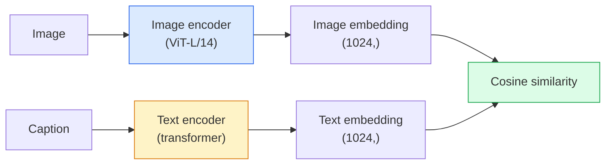

# Visão de vocabulário aberto  CLIP  开放词汇视觉  CLIP

> Treinar um codificador de imagem e um codificador de texto juntos para que os pares de correspondência (imagem, legenda) aterrem no mesmo ponto em um espaço compartilhado.

> **【中文解读】**CLIP Simultaneamente, o treinamento do codificador de imagens e do codificador de texto, faz com que os mesmos pontos de espaço compartilhado sejam identificados. É assim tão simples.

> **【拓展：CLIP 是多模态 AI 的基石】**CLIP é o componente básico do modelo DALL-E ∆ Stable Diffusion (condições de texto) ∆ LVA ∆ GPT-4V etc.

**Type:** Build + Use | **类型:** 动手 + 应用
**Languages:** Python | **语言:** Python
**Prerequisites:** Phase 4 Lesson 14 (ViT), Phase 4 Lesson 17 (Self-Supervised) | **前置知识:** Phase 4 Lesson 14（ViT），Phase 4 Lesson 17（自监督）
**Time:** ~45 minutes | **时间:** ~45 分钟

## Objetivos de aprendizagem

- Explicar a arquitetura de duas torres do CLIP e o objetivo de formação contrastada
- Utilize um CLIP (ou SigLIP) pré-treinado para classificação de tiro zero sem qualquer treinamento específico de tarefa
- Implementar classificação de tiro zero a partir do zero: codificar as instruções de classe, calcular a semelhança cosínica, tomar argmax
- Distinguir os modelos de visão CLIP, SigLIP, OpenCLIP e LLaVA/LLaMA  para o que cada um serve em 2026

> **【中文解读】**O objetivo do aprendizado é listar as capacidades centrais que devem ser adquiridas após a conclusão do curso.


## O problema é o problema da introdução

Os classificadores tradicionais são de vocabulário fechado: um modelo ImageNet de 1000 classes só pode prever 1000 rótulos.

> O modelo de ImageNet só pode prever 1000 tags. Cada nova categoria precisa de dados de marcação e de um novo treinamento.

CLIP (Radford et al., OpenAI 2021) mostrou que o treinamento em 400M (imagem, legenda) pares raspados da web produz um modelo que pode ser classificado em qualquer conjunto de categorias em inferência, descrito puramente em linguagem natural.

> CLIP(Radford etc,OpenAI 2021) mostra que, em 4 mil milhões de imagens, títulos e títulos capturados na rede, o modelo resultante do treinamento superior pode ser dividido em qualquer tipo de conjunto, usando a linguagem natural.

Essa capacidade  transferência de tiros zero  é por isso que todo sistema de visão moderno começa com um ponto de controle da família CLIP. Detecção (Grounding DINO, OWL-ViT), segmentação (CLIPSeg, SAM), recuperação, moderação de conteúdo, VLMs e geração de texto para imagem todos se baseiam em embutidos conjuntos em estilo CLIP.

> Essa capacidade零样本迁移就是为什么每个现代视觉系统都从CLIP家族的检查点开始――检测(Grounding DINO、OWL-ViT) 、分割(CLIPSeg、SAM) 、检索、内容审核、VLM 和文本到图像生成都建立在CLIP 风格的联合嵌入上──

## O conceito central.

> **【中文解读】**Este capítulo apresenta os conceitos e teorias fundamentais.


### Duas torres



Ambos os codificadores terminam com uma projeção linear para a mesma dimensão de incorporação (512 para CLIP-B/32, 1024 para CLIP-L/14).

> Os dois programadores são projetados linearmente até o mesmo embedamento dimensão terminação.

### O objectivo

Dado um lote de pares N (imagem, legenda), construa uma matriz de semelhança NxN. Treine ambos os codificadores para que a diagonal (pares correspondentes) tenha alta semelhança e os fora-diagonais (não correspondentes) tenham baixa semelhança.

> 给定一批 N 个 (图像,标题) 对,构建 NxN 相似度矩阵――训练两个编码器使对角线 (编码器) 对角线 (编码器) 匹配对) 对角线 (图像,标题) 对,构建 NxN 相似度矩阵――训练两个编码器使对角线 (编码器) 对角线 (编码器) 匹配对) 对角线 (编码器) 匹配对) 相似度高,非对角线 (编码器) 不匹配对) 相似度低――

```
sim_matrix = image_embeddings @ text_embeddings.T / tau

loss_i2t = cross_entropy(sim_matrix,       targets=arange(N))
loss_t2i = cross_entropy(sim_matrix.T,     targets=arange(N))
loss = (loss_i2t + loss_t2i) / 2
```

Simétrica porque tanto a recuperação de imagem a texto como de texto a imagem devem funcionar. `tau`(temperatura) é tipicamente aprendida como um parâmetro escalar, iniciado em 0,07.

> O título é porque a pesquisa de imagens para texto e texto para imagens deve ser válida.`tau`(temperatura) normalmente como um padrão de quantidade em matemática, inicialização é de 0,07。

### Siglip: uma perda melhor

SigLIP (Zhai et al., 2023) substituiu o softmax por sigmoide por par:

> SigLIP ((Zhai etc,2023) usou para substituir o sigmoide softmax:

```
loss = mean over pairs of log(1 + exp(-y_ij * sim_ij))
y_ij = +1 if matching, -1 otherwise
```

A perda por par elimina a normalização de nível de lote que a CLIP requer.

>  Perde-para-perda eliminou a reintegração de classes de lote necessária para CLIP.

### Classificação de tiros zero

Dado um CLIP treinado:

> 给定训练好的 CLIP:

1. Para cada classe, compor uma pergunta: "uma foto de uma classe".
   中文翻译:为每个类别构造提示词:"uma foto de um {类别}"。
2. Encode todas as instruções de classe com o codificador de texto -> `T`Forma (C, d).
   中文翻译:用文本编码器编码所有类提示词 -> `T`形状 (C, d)
3. Encode a imagem de teste -> `I`Forma (1, d).
   Tradução do inglês:编码测试图像 -> `I`形状 (1, d) ⋅
4. Similhança = `I @ T.T`Forma (1, C).
   Tradução do português:相似度 = `I @ T.T`形状 (1, C) ⋅
5. Argmax -> classe prevista.
   中文翻译:Argmax -> 预测类别。

As questões de engenharia de ponta. OpenAI publicou 80 modelos de ponta para ImageNet ("uma foto de um {}", "uma foto borbulha de um {}", "um esboço de um {}", ...).

> 提示词工程很重要――OpenAI 为 ImageNet 发布了80个提示模板――将每个类别的所有模板嵌入取平均可以额外提升 1-3% 的 top-1 准确率――

### Se em 2026 forem utilizados modelos CLIP

- **Zero-shot classification** utilização directa.
  Tradução:**零样本分类**直接使用──
- **Image retrieval** codificar todas as imagens uma vez, inserir a consulta na inferência.
  Tradução:**图像检索** Codificar todas as imagens, fazer perguntas.
- **Text-conditioned detection** Aterrando o DINO, OWL-ViT envolve uma torre de texto CLIP em torno de um detector.
  Tradução:**文本条件检测**Grounding DINO、OWL-ViT 在检测器外包装 CLIP 文本塔──
- **Text-conditioned segmentation** CLIPSeg; SAM utiliza entradas de texto-prompt através do CLIP.
  Tradução:**文本条件分割**CLIPSeg;SAM 通過 CLIP 使用文本提示输入──
- **VLMs** LLaVA, Qwen-VL, InternVL incorporam um codificador de visão da família CLIP num LLM.
  Tradução:**VLM**LLaVA、Qwen-VL、InternVL vai ligar o programa de programação de vídeo da CLIP Family para o LLM―
- **Text-to-image gen** Diffusão estável, condição DALL-E 3 em embutidos de texto CLIP.
  Tradução:**文本到图像生成**Difusão estável DALL-E 3  baseado em CLIP 文本嵌入进行条件化

Uma vez que você tem um espaço de inserção compartilhado, cada tarefa de visão + linguagem torna-se um cálculo de distância.

> Uma vez que há um espaço de inserção compartilhado, cada tarefa de vídeo + linguagem se torna uma distância calculada.

> **【中文解读】**Este é um método de "desde zero" que ajuda a entender o princípio da estrutura, não é um problema que se encontra em uma caixa negra.

> **【拓展：工业部署中的视觉系统】**No implementar industrial real, o modelo visual precisa considerar a possibilidade de atrasos, modelos de tamanho, dispositivos de margem, etc. TensorRT, ONNX Runtime, OpenVINO são ferramentas de aceleração de cálculo de uso comum.

> **【拓展：数据标注与质量】** Visual task's effect highly depends on label data quality──Label Studio、CVAT is the mainstream marking tool──In industrial scenarios, proactive learning(Active Learning) pode reduzir o custo de marcação: modelo contra um pedido de amostra não definido marcação artificial, identidade de amostra auto-marcação──


## Construí-lo e realizei-o.
```figure
clip-contrastive
```

## Construí-lo

### Passo 1: Um modelo de duas torres

O CLIP real é o transformador ViT +. Para esta lição as torres são pequenas MLPs sobre recursos pré-extraídos para que o sinal de treinamento seja visível na CPU.

> O verdadeiro CLIP é o ViT + Transformer. A torre da aula é um pequeno MLP em pré-alembrar características, para que possa ser visto no CPU.

```python
import torch
import torch.nn as nn
import torch.nn.functional as F


class TwoTower(nn.Module):
    def __init__(self, img_in=128, txt_in=64, emb=64):
        super().__init__()
        self.image_proj = nn.Sequential(nn.Linear(img_in, 128), nn.ReLU(), nn.Linear(128, emb))
        self.text_proj = nn.Sequential(nn.Linear(txt_in, 128), nn.ReLU(), nn.Linear(128, emb))
        self.logit_scale = nn.Parameter(torch.ones([]) * 2.6592)  # ln(1/0.07)

    def forward(self, img_feats, txt_feats):
        i = F.normalize(self.image_proj(img_feats), dim=-1)
        t = F.normalize(self.text_proj(txt_feats), dim=-1)
        return i, t, self.logit_scale.exp()
```

Duas projeções, saída de dim-compartilhada, temperatura aprendida, a mesma forma que a verdadeira API CLIP.

> 两个投影、共享维度输出、可学习温度──与真正的Clip API 形状相同──

### Passo 2: Perda de contraste

```python
def clip_loss(image_emb, text_emb, logit_scale):
    N = image_emb.size(0)
    sim = logit_scale * image_emb @ text_emb.T
    targets = torch.arange(N, device=sim.device)
    l_i = F.cross_entropy(sim, targets)
    l_t = F.cross_entropy(sim.T, targets)
    return (l_i + l_t) / 2
```

Simétrica. Escala de logit_estilo mais alta = mais nítida, mais confiante, mas risco de instabilidade.

> Para se identificar, mais alto o nível de logite = mais alto o softmax = mais confiante mas há um risco pouco estável.

### Passo 3: Classificador de tiro zero

```python
@torch.no_grad()
def zero_shot_classify(model, image_feats, class_text_feats, class_names):
    """
    image_feats:      (N, img_in)
    class_text_feats: (C, txt_in)   one averaged embedding per class
    """
    i = F.normalize(model.image_proj(image_feats), dim=-1)
    t = F.normalize(model.text_proj(class_text_feats), dim=-1)
    sim = i @ t.T
    pred = sim.argmax(dim=-1)
    return [class_names[p] for p in pred.tolist()]
```

É o procedimento exato de tiro zero usado com um ponto de controlo CLIP de produção.

> Cada passo em linha. É o processo de produção de um ponto de inspeção CLIP.

### Passo 4: Verificação de Saúde Mental

```python
torch.manual_seed(0)
model = TwoTower()

img = torch.randn(8, 128)
txt = torch.randn(8, 64)
i, t, scale = model(img, txt)
loss = clip_loss(i, t, scale)
print(f"batch size: {i.size(0)}   loss: {loss.item():.3f}")
```

A perda deve estar próxima de `log(N) = log(8) = 2.08`Para um modelo iniciado aleatoriamente  o alvo de entropia cruzada simétrica quando ainda não se aprende estrutura.

>  Como o modelo inicial de perda deve aproximar `log(N) = log(8) = 2.08` ainda não aprendido a estrutura时的对称交叉目标──

> **【中文解读】**Este capítulo mostra como usar um framework maduro (como PyTorch、HuggingFace etc) rápida aplicação desta tecnologia.


> **【拓展：视觉模型的持续学习】**Em um ambiente de produção, o modelo visual precisa se adaptar constantemente a novos dados. Isto é especialmente importante na condução automática e no controle de qualidade industrial.

## Use-o com o framework implementado.

O OpenCLIP é o padrão da comunidade em 2026:

```python
import open_clip
import torch
from PIL import Image

model, _, preprocess = open_clip.create_model_and_transforms("ViT-B-32", pretrained="laion2b_s34b_b79k")
tokenizer = open_clip.get_tokenizer("ViT-B-32")

image = preprocess(Image.open("dog.jpg")).unsqueeze(0)
text = tokenizer(["a photo of a dog", "a photo of a cat", "a photo of a car"])

with torch.no_grad():
    image_features = model.encode_image(image)
    text_features = model.encode_text(text)
    image_features = image_features / image_features.norm(dim=-1, keepdim=True)
    text_features = text_features / text_features.norm(dim=-1, keepdim=True)
    probs = (100.0 * image_features @ text_features.T).softmax(dim=-1)

> **【中文解读】** 本节关注如何将模型部署为可用的产品。从原型到生产级系统需要考虑性能优化、错误处理、监控等多个维度。


print(probs)
```

O SigLIP é mais novo, treina melhor em pequenas escalas e é preferido para novos trabalhos: `google/siglip-base-patch16-224`Abraçando ambas as naves.


## Envia-o . Produto .

> **【中文解读】**Practicação de temas de fácil/médio/difícil  3o dificuldade de passagem  Recomendação de completar pelo menos Praça de nível médio Classe difícil  Adaptação a pesquisa profunda ou preparação para o encontro 


Esta lição produz:

- `outputs/prompt-zero-shot-class-picker.md` um prompt que desenha modelos de classe para CLIP de tiro zero com uma lista de classes e um domínio.
- `outputs/skill-image-text-retriever.md` uma habilidade que constrói um índice de inserção de imagem com qualquer ponto de verificação CLIP, suporta consulta por texto e consulta por imagem.

## Exercícios.

1. **(Easy)**Use um OpenCLIP ViT-B/32 pré-treinado e faça classificação de tiro zero no CIFAR-10 com o conjunto de 80 modelos de instrução.
2. **(Medium)**Compare um único modelo ("uma foto de um {}") vs 80 modelos embutidos médios na mesma tarefa CIFAR-10. Quantifique a lacuna e explique por que os modelos ajudam.
3. **(Hard)**Crie um índice de recuperação de imagem de tiros zero: inserir 1.000 imagens com CLIP, criar um índice FAISS, consulta com uma descrição em linguagem natural.

> **【中文解读】**No 术语表中的"O que as pessoas dizem" vs "O que realmente significa" 区分日常口语和精确技术含义── em equipe,统一术语定义可以避免大量沟通误解──


## Termos-chave .

| Term | What people say | What it actually means |
|------|----------------|----------------------|
| Two-tower | "Dual encoder" | Separate image and text encoders ending in a shared-dim projection head |
| Zero-shot | "No task-specific training" | Classify into classes described only by text at inference; no labels touched |
| Temperature / logit_scale | "tau" | Learned scalar that scales the similarity matrix before softmax |
| Prompt template | "A photo of a {}" | Natural-language wrapper around class names; averaging many templates boosts zero-shot accuracy |
| CLIP | "Image+text model" | The 2021 OpenAI model; vocabulary of the field in 2026 |
| SigLIP | "Sigmoid CLIP" | Swaps softmax for per-pair sigmoid; trains better at small batches |
| OpenCLIP | "Open reproduction" | Community-trained CLIP variants on LAION; production default for open-source pipelines |
| VLM | "Vision-language model" | A CLIP-family encoder plus an LLM, trained to answer questions about images |

> **【中文解读】**延伸阅读 fornece recursos de alta qualidade para a aprendizagem profunda.


## Mais leitura 延伸阅读

- [CLIP: Learning Transferable Visual Models from Natural Language Supervision (Radford et al., 2021)](https://arxiv.org/abs/2103.00020)
- [SigLIP: Sigmoid Loss for Language-Image Pre-Training (Zhai et al., 2023)](https://arxiv.org/abs/2303.15343)
- [OpenCLIP](https://github.com/mlfoundations/open_clip) base de código comunitária
- [DINOv2 vs CLIP vs MAE: a features comparison](https://huggingface.co/blog/dinov2) Guia de uso de HF com casos de uso lado a lado
