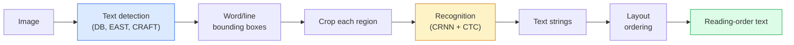

# OCR & Document Understanding OCR & Document Understanding

> O OCR é um pipeline de três etapas  detectar caixas de texto, reconhecer os caracteres, e depois colocá-los.

> **【中文解读】**OCR(Local Identificação de caracteres) é um trecho de fluxo de água:检测文本框 → 识别字符 → 布局分析。 OCR moderno sistema irá reorganizar ou combinar estes três passos.

> **【拓展：文档理解的金融应用】**O OCR e a compreensão de documentos têm amplas aplicações no campo financeiro: banco fluido de informação, processamento automático de emissão de bilhetes, revisão de contratos inteligentes, análise de relatórios financeiros, layoutLM, donut, etc.

**Type:** Learn + Use | **类型:** 学习 + 应用
**Languages:** Python | **语言:** Python
**Prerequisites:** Phase 4 Lesson 06 (Detection), Phase 7 Lesson 02 (Self-Attention) | **前置知识:** Phase 4 Lesson 06（目标检测），Phase 7 Lesson 02（自注意力）
**Time:** ~45 minutes | **时间:** ~45 分钟

## Objetivos de aprendizagem

- Rastrear o fluxo de dados OCR clássico (detect -> recognize -> layout) e as alternativas modernas de ponta a ponta (Donut, Qwen-VL-OCR)
- Implementar a perda de CTC (Classificação Temporal Conectante) para a formação de sequência para sequência de OCR
- Utilização de PaddleOCR ou EasyOCR para análise de documentos de produção sem formação
- Distinguir entre OCR, análise de layout e compreensão de documentos  e escolher a ferramenta certa por tarefa

> **【中文解读】**O objetivo do aprendizado é listar as capacidades centrais que devem ser adquiridas após a conclusão do curso.


## O problema é o problema da introdução

As imagens cheias de texto estão em todos os lugares: recibos, faturas, identidades, livros digitalizados, formulários, placas brancas, sinais, capturas de tela. Extrair dados estruturados deles não apenas os caracteres, mas "esta é a quantidade total" é um dos problemas de visão aplicada de maior valor.

> Imagens de letras estão presentes: receita, emissão de bilhetes, carteiras de identidade, leitura de livros, modelos, placas brancas, sinais, cintas.

O campo divide-se em três camadas de habilidade:

> O domínio é dividido em três níveis de competências:

1. **OCR proper**: transformar pixels em texto.
2. **Layout parsing**: saída de OCR de grupo em regiões (título, corpo, tabela, cabeçalho).
3. **Document understanding**: extrair campos estruturados ("invoice_total = $42.50") do layout.

Cada camada tem abordagens clássicas e modernas, e a lacuna entre "Quero texto de uma imagem" e "Quero o montante total deste recibo" é maior do que a maioria das equipes percebe.

> Cada nível tem métodos clássicos e modernos, a diferença entre "Eu quero obter letras de imagens" e "Eu preciso da quantidade total de receita" é maior do que a maioria das equipes percebeu.

## O conceito central.

> **【中文解读】**Este capítulo apresenta os conceitos e teorias fundamentais.


### O gasoduto clássico



- **Text detection**produz quadrilatares por linha ou por palavra.
  Tradução:**文本检测**O quadril de cada linha ou cada palavra.
- **Recognition**Crops cada região a uma altura fixa, corre um CNN + BiLSTM + CTC para produzir uma sequência de caracteres.
  Tradução:**识别**Cortar cada área para uma altura fixa, operar CNN + BiLSTM + CTC 生成字符序列──
- **Layout**Reconstrui a ordem de leitura (de cima para baixo, de esquerda para direita para o latim; diferente para o árabe, japonês).
  Tradução:**布局**重建阅读顺序(Latin文从上到下、从左到右; Arabic文和日文不同)

### CTC num único parágrafo

O reconhecimento OCR produz uma sequência de comprimento variável a partir de um mapa de características de comprimento fixo. CTC (Graves et al., 2006) permite que você treine isso sem alinhamento de nível de caracteres. O modelo produz uma distribuição sobre (vocaba + branco) em cada etapa de tempo; perda CTC marginaliza sobre todos os alinhamentos que se reduzem ao texto-alvo após a fusão de repetições e removendo espaços vazios.

> OCR Identificação a partir de caracteres de comprimento fixo gráfico gerar sequência de comprimento variavel. CTC(Graves etc., 2006) fazer você não precisa de caracteres de nível de preparação em forma de treinamento. Modelo em cada tempo de saída ([[palataforma + espaço-blanco]]); CTC Loss para todos os conjuntos de reprodução e removimento de espaço-blanco para a margem de forma de preparação do texto-alvo para ser marginalizado.

```
raw output: "h h h _ _ e e l l _ l l o _ _"
after merge repeats and remove blanks: "hello"
```

A CTC é a razão pela qual a CRNN trabalhou em 2015 e ainda treina a maioria dos modelos de produção OCR em 2026.

> O CTC é o CRNN em 2015 e ainda está treinado em 2026 para a maioria das produções de modelos OCR.

### Modelos modernos de ponta a ponta

- **Donut**(Kim et al., 2022)  um codificador ViT + um decodificador de texto; lê uma imagem e emite JSON diretamente.
  Tradução:**Donut**(Kim 等,2022) ViT 编码器 + 文本解码器;读取图像直接输出 JSON──无需文本检测器或布局模块──
- **TrOCR** Decodificador de transformador ViT + para OCR de nível de linha.
  Tradução:**TrOCR**ViT + Transformador 解码器, para uso em OCR de classe
- **Qwen-VL-OCR / InternVL** Modelos completos de linguagem visual, ajustados para as tarefas de OCR; melhor precisão em 2026 em documentos complexos.
  Tradução:**Qwen-VL-OCR / InternVL** Modelo de linguagem visual completo para tarefas de OCR; 2026 ano em documentação complexa máxima precisão:
- **PaddleOCR** O pipeline DB + CRNN clássico num pacote de produção maduro; ainda o cavalo de trabalho de código aberto.
  Tradução:**PaddleOCR**Rainha de produção: Rainha de produção: Rainha de produção: Rainha de produção: Rainha de produção: Rainha de produção: Rainha de produção: Rainha de produção: Rainha de produção: Rainha de produção: Rainha de produção: Rainha de produção: Rainha de produção: Rainha de produção: Rainha de produção: Rainha de produção: Rainha de produção: Rainha de produção: Rainha de produção: Rainha de produção: Rainha de produção: Rainha de produção: Rainha de produção: Rainha de produção: Rainha de produção: Rainha de produção: Rainha de produção: 

Os modelos de ponta a ponta precisam de mais dados e computação, mas ignoram a acumulação de erros de oleodutos em várias etapas.

> O modelo de extremo a extremo precisa de mais dados e cálculos, mas saltou por cima de vários estágios de acumulação de erros de fluxo de água.

### Partilha de layout

Para documentos estruturados, execute um detector de layout (LayoutLMv3, DocLayNet) que rotula cada região: Título, parágrafo, Figura, Tabela, Nota de rodapé.

> 对于结构化文档,运行布局检测器(LayoutLMv3、DocLayNet) marcar cada região: tópico,段落、图、表、脚注。阅读顺序变成"按布局顺序遍历区域,拼接"──

Para os formulários, utilizar **Key-Value extraction**Modelos (Donut para documentos ricos em visão, LayoutLMv3 para digitalização simples).

> 对于表单,使用**键值提取**模型(视觉丰富文档用唐nut,普通扫描用 LayoutLMv3)。

### Metricas de avaliação

- **Character Error Rate (CER)** Distância de referência Levenshtein / comprimento. Mais baixo é melhor. Objetivo de produção: < 2% em exames limpos.
  Tradução:**字符错误率（CER）** 编辑距离 / 参考文本长度──越低越好──生产目标:清晰扫描上 < 2%──
- **Word Error Rate (WER)** a mesma no nível das palavras.
  Tradução:**词错误率（WER）**词级别的同样标标──
- **F1 on structured fields** para tarefas de valor-chave; medidas de`{invoice_total: 42.50}`Parece correto.
  Tradução:**结构化字段 F1**Keyvalue tasks' indicator; medir `{invoice_total: 42.50}`É verdade que aparecem.
- **Edit distance on JSON** para análise de documentos de ponta a ponta; o papel Donut introduziu uma distância de edição normalizada de árvores.
  Tradução:**JSON 编辑距离**端到端文档解析的指标;Donut 论文 introduziu a redução de um arco de edição distância.

> **【中文解读】**Este é um método de "desde zero" que ajuda a entender o princípio da estrutura, não é um problema que se encontra em uma caixa negra.

> **【拓展：工业部署中的视觉系统】**No implementar industrial real, o modelo visual precisa considerar a possibilidade de atrasos, modelos de tamanho, dispositivos de margem, etc. TensorRT, ONNX Runtime, OpenVINO são ferramentas de aceleração de cálculo de uso comum.

> **【拓展：数据标注与质量】** Visual task's effect highly depends on label data quality──Label Studio、CVAT is the mainstream marking tool──In industrial scenarios, proactive learning(Active Learning) pode reduzir o custo de marcação: modelo contra um pedido de amostra não definido marcação artificial, identidade de amostra auto-marcação──


## Construí-lo e realizei-o.
```figure
cv3-ctc-collapse
```

## Construí-lo

### Passo 1: Perda de CTC + decodificador ganancioso

```python
import torch
import torch.nn as nn
import torch.nn.functional as F


def ctc_loss(log_probs, targets, input_lengths, target_lengths, blank=0):
    """
    log_probs:      (T, N, C) log-softmax over vocab including blank at index 0
    targets:        (N, S) int targets (no blanks)
    input_lengths:  (N,) per-sample time steps used
    target_lengths: (N,) per-sample target length
    """
    return F.ctc_loss(log_probs, targets, input_lengths, target_lengths,
                      blank=blank, reduction="mean", zero_infinity=True)


def greedy_ctc_decode(log_probs, blank=0):
    """
    log_probs: (T, N, C) log-softmax
    returns: list of index sequences (blanks removed, repeats merged)
    """
    preds = log_probs.argmax(dim=-1).transpose(0, 1).cpu().tolist()
    out = []
    for seq in preds:
        decoded = []
        prev = None
        for idx in seq:
            if idx != prev and idx != blank:
                decoded.append(idx)
            prev = idx
        out.append(decoded)
    return out
```

`F.ctc_loss`O decodificador ganancioso é mais simples do que uma busca de feixe e geralmente dentro de 1% do CER dele.

> `F.ctc_loss`Em uso de alta eficiência CuDNN                                                                                                                                                                                                                                                          

### Passo 2: Reconhecedor de CRNN pequeno

Minima CNN + BiLSTM para a linha OCR.

> Utilizado para executar o mínimo de OCR de CNN + BiLSTM.

```python
class TinyCRNN(nn.Module):
    def __init__(self, vocab_size=40, hidden=128, feat=32):
        super().__init__()
        self.cnn = nn.Sequential(
            nn.Conv2d(1, feat, 3, 1, 1), nn.BatchNorm2d(feat), nn.ReLU(inplace=True),
            nn.MaxPool2d(2),
            nn.Conv2d(feat, feat * 2, 3, 1, 1), nn.BatchNorm2d(feat * 2), nn.ReLU(inplace=True),
            nn.MaxPool2d(2),
            nn.Conv2d(feat * 2, feat * 4, 3, 1, 1), nn.BatchNorm2d(feat * 4), nn.ReLU(inplace=True),
            nn.MaxPool2d((2, 1)),
            nn.Conv2d(feat * 4, feat * 4, 3, 1, 1), nn.BatchNorm2d(feat * 4), nn.ReLU(inplace=True),
            nn.MaxPool2d((2, 1)),
        )
        self.rnn = nn.LSTM(feat * 4, hidden, bidirectional=True, batch_first=True)
        self.head = nn.Linear(hidden * 2, vocab_size)

    def forward(self, x):
        # x: (N, 1, H, W)
        f = self.cnn(x)                # (N, C, H', W')
        f = f.mean(dim=2).transpose(1, 2)  # (N, W', C)
        h, _ = self.rnn(f)
        return F.log_softmax(self.head(h).transpose(0, 1), dim=-1)  # (W', N, vocab)
```

Entrada de altura fixa (o CNN max-pools altura para 1). Largura é a dimensão de tempo para CTC.

> 固定高度输入(CNN 将高度最大池化到 1);;宽度是CTC 的时间维度;;

### Passo 3: OCR sintético

Gerenciar cordas de dígitos preto a branco para um teste de fumaça de ponta a ponta.

> 生成白底黑字符串的数字字符串, para uso em teste de uso de fumo.

```python
import numpy as np

def synthetic_line(text, height=32, char_width=16):
    W = char_width * len(text)
    img = np.ones((height, W), dtype=np.float32)
    for i, c in enumerate(text):
        x = i * char_width
        shade = 0.0 if c.isalnum() else 0.5
        img[6:height - 6, x + 2:x + char_width - 2] = shade
    return img


def build_batch(strings, vocab):
    H = 32
    W = 16 * max(len(s) for s in strings)
    imgs = np.ones((len(strings), 1, H, W), dtype=np.float32)
    target_lengths = []
    targets = []
    for i, s in enumerate(strings):
        imgs[i, 0, :, :16 * len(s)] = synthetic_line(s)
        ids = [vocab.index(c) for c in s]
        targets.extend(ids)
        target_lengths.append(len(ids))
    return torch.from_numpy(imgs), torch.tensor(targets), torch.tensor(target_lengths)


vocab = ["_"] + list("0123456789abcdefghijklmnopqrstuvwxyz")
imgs, targets, lengths = build_batch(["hello", "world"], vocab)
print(f"images: {imgs.shape}   targets: {targets.shape}   lengths: {lengths.tolist()}")
```

Um conjunto de dados OCR real adiciona fontes, ruído, rotação, borbulho e cor.

> O verdadeiro OCR dados de reunião aumentam o tipo de letra, ruído, rotação, mistura e cor.

### Passo 4: Esboço de formação

```python
model = TinyCRNN(vocab_size=len(vocab))
opt = torch.optim.Adam(model.parameters(), lr=1e-3)

for step in range(200):
    strings = ["abc" + str(step % 10)] * 4 + ["xyz" + str((step + 1) % 10)] * 4
    imgs, targets, target_lens = build_batch(strings, vocab)
    log_probs = model(imgs)  # (W', 8, vocab)
    input_lens = torch.full((8,), log_probs.size(0), dtype=torch.long)
    loss = ctc_loss(log_probs, targets, input_lens, target_lens, blank=0)
    opt.zero_grad(); loss.backward(); opt.step()
```

> **【中文解读】**Este capítulo mostra como usar um framework maduro (como PyTorch、HuggingFace etc) rápida aplicação desta tecnologia.


A perda deve cair de ~3 para ~0,2 em 200 passos com estes dados sintéticos triviais.

> Neste simples conjunto de dados, a perda de 200 passos deve ser reduzida de cerca de 3 a cerca de 0,2


> **【拓展：视觉模型的持续学习】**Em um ambiente de produção, o modelo visual precisa se adaptar constantemente a novos dados. Isto é especialmente importante na condução automática e no controle de qualidade industrial.

## Use-o com o framework implementado.

Três vias de produção:

- **PaddleOCR** maduro, rápido, multilingüe. Uso de uma linha: `paddleocr.PaddleOCR(lang="en").ocr(image_path)`- Não .
- **EasyOCR**Python nativo, multilingue, espinha dorsal PyTorch.
- **Tesseract** clássico; ainda útil para documentos antigos escaneados quando os modelos têm dificuldades.

Para análise de documentos de ponta a ponta, use Donut ou um VLM:

```python
from transformers import DonutProcessor, VisionEncoderDecoderModel

processor = DonutProcessor.from_pretrained("naver-clova-ix/donut-base-finetuned-cord-v2")
model = VisionEncoderDecoderModel.from_pretrained("naver-clova-ix/donut-base-finetuned-cord-v2")
```

> **【中文解读】**Este capítulo se concentra em como o modelo será implantado como produto disponível. De modelo original a nível de produção, os sistemas precisam considerar várias dimensões de otimização de desempenho, tratamento de erros, controle, etc.


Para recibos, faturas e formulários com estrutura repetível, ajuste o Donut. Para documentos arbitrários ou OCR com raciocínio, um VLM como Qwen-VL-OCR é o padrão atual.


## Envia-o . Produto .

> **【中文解读】**Practicação de temas de fácil/médio/difícil  3o dificuldade de passagem  Recomendação de completar pelo menos Praça de nível médio Classe difícil  Adaptação a pesquisa profunda ou preparação para o encontro 


Esta lição produz:

- `outputs/prompt-ocr-stack-picker.md` um prompt que seleciona Tesseract / PaddleOCR / Donut / VLM-OCR dado tipo de documento, idioma e estrutura.
- `outputs/skill-ctc-decoder.md` uma habilidade que escreve codificadores CTC de busca de raio e ganância a partir do zero, incluindo a normalização de comprimento.

## Exercícios.

> **【中文解读】**No 术语表中的"O que as pessoas dizem" vs "O que realmente significa" 区分日常口语和精确技术含义── em equipe,统一术语定义可以避免大量沟通误解──


1. **(Easy)**Treinar o TinyCRNN em cadeias numéricas aleatórias de 5 dígitos durante 500 passos.
2. **(Medium)**Substitua a decodificação gananciosa pela pesquisa de feixe (beam_width=5).
3. **(Hard)**Use o PaddleOCR em um conjunto de 20 recibos, extrair itens de linha e calcular F1 contra a verdade do solo etiquetada à mão para pares {item_name, price}.

## Termos-chave .

| Term | What people say | What it actually means |
|------|----------------|----------------------|
| OCR | "Text from pixels" | Turning image regions into character sequences |
| CTC | "Alignment-free loss" | Loss that trains a sequence model without per-timestep labels; marginalises over alignments |
| CRNN | "Classic OCR model" | Conv feature extractor + BiLSTM + CTC; the 2015 baseline still used in production |
| Donut | "End-to-end OCR" | ViT encoder + text decoder; emits JSON directly from image |
| Layout parsing | "Find regions" | Detect and label Title/Table/Figure/Paragraph regions in a document |
| Reading order | "Text sequence" | Ordering of recognised regions into a sentence; trivial for Latin, non-trivial for mixed layouts |
| CER / WER | "Error rates" | Levenshtein distance / reference length at character or word granularity |
| VLM-OCR | "LLM that reads" | A vision-language model trained or prompted for OCR tasks; current SOTA on complex documents |

> **【中文解读】**延伸阅读 fornece recursos de alta qualidade para a aprendizagem profunda.


## Mais leitura 延伸阅读

- [CRNN (Shi et al., 2015)](https://arxiv.org/abs/1507.05717) a arquitetura original CNN+RNN+CTC
- [CTC (Graves et al., 2006)](https://www.cs.toronto.edu/~graves/icml_2006.pdf) o papel original do CTC; densamente preenchido com as ideias algorítmicas
- [Donut (Kim et al., 2022)](https://arxiv.org/abs/2111.15664) Transformador de compreensão de documentos livre de OCR
- [PaddleOCR](https://github.com/PaddlePaddle/PaddleOCR) a pilha de produção de código aberto de OCR
