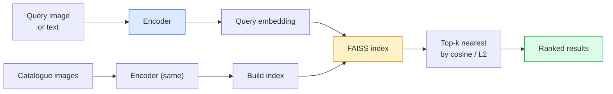

# Retorno de imagem & Aprendizagem métrica

> Um sistema de recuperação classifica os candidatos por distância em um espaço de inserção.

> **【中文解读】**检索系统通过嵌入空间中的距离对候选图像排序――度学习就是塑造这个空间,使距离反映你想要的语义关系相似图像靠近,不相似图像离远――对比损失 (相反损失) 和三元组损失 (三元组损失) 是核心方法――

> **【拓展：检索系统的应用】**É um tipo de aprendizagem de medida, mas também é um tipo de aprendizagem de medida.

**Type:** Build | **类型:** 动手
**Languages:** Python | **语言:** Python
**Prerequisites:** Phase 4 Lesson 14 (ViT), Phase 4 Lesson 18 (CLIP) | **前置知识:** Phase 4 Lesson 14（ViT），Phase 4 Lesson 18（CLIP）
**Time:** ~45 minutes | **时间:** ~45 分钟

## Objetivos de aprendizagem

- Explique as perdas de aprendizagem métrica tripla, contrastativa e baseada em proxy e escolha a correta para um determinado conjunto de dados
- Implementar corretamente a normalização L2 e a semelhança cosínica e verificar a diferença entre a recuperação do "mesmo item" e da "mesmo classe"
- Crie um índice FAISS, consulta-o por texto e por imagem e relate recall@K para um conjunto de consultas mantidas
- Use DINOv2, CLIP e SigLIP como um sistema de inserção de coluna vertebral para saber quando cada um ganha

> **【中文解读】**O objetivo do aprendizado é listar as capacidades centrais que devem ser adquiridas após a conclusão do curso.


## O problema é o problema da introdução

A recuperação está em todos os lugares na visão de produção: detecção duplicada, pesquisa de imagem inversa, pesquisa visual ("encontrar produtos semelhantes"), re-identificação de rosto, re-identificação de pessoa para vigilância, correspondência de nível de instância para o comércio eletrônico. A pergunta do produto é sempre a mesma: "dada esta imagem de consulta, classifique o meu catálogo".

> 检索在生产视觉无处不在:重复检测、反向图像搜索、视觉搜索(" buscar produtos semelhantes") 的人脸重识别、监控人员重识别、电商实例级匹配── produto problema é o mesmo: "dão esta imagem de consulta, para o meu catálogo排序──"

Duas decisões de design moldam todo o sistema. O embedding  que modelo produz os vetores. O índice  como encontrar os vizinhos mais próximos na escala. Ambos são mercadorias em 2026 (DINOv2 para o embedding, FAISS para o índice), o que aumenta a barra: a parte difícil é definir *o que conta como semelhante* para sua aplicação, então moldando o espaço de embedding para que as distâncias coincidam.

> 两个设计决策塑造整个系统――嵌入什么模型产生向量――索引如何大规模找到近邻――两者在2026年都是商品(DINOv2 用于嵌入,FAISS 用于索引), isso melhorou o padrão:困难的部分是为你的应用定义*什么算相似*,然后塑造嵌入空间使距离匹配――

Essa formação é a aprendizagem métrica. É uma disciplina pequena, mas de alta alavancagem.

> Essa forma de formação é a de medida da aprendizagem. É uma pequena, mas alta, disciplina.

## O conceito central.

> **【中文解读】**Este capítulo apresenta os conceitos e teorias fundamentais.


### Recuperação num olhar



### As quatro famílias perdidas

| Loss | Requires | Pros | Cons |
|------|----------|------|------|
| **Contrastive** | (anchor, positive) + negatives | Simple, works with any pair label | Slow to converge without many negatives |
| **Triplet** | (anchor, positive, negative) | Intuitive; direct margin control | Hard-triplet mining is expensive |
| **NT-Xent / InfoNCE** | Pairs + batch-mined negatives | Scales to large batches | Needs big batch or momentum queue |
| **Proxy-based (ProxyNCA)** | Class labels only | Fast, stable, no mining | Can overfit to proxies on small datasets |

Para a maioria dos casos de uso em produção, comece com uma espinha dorsal pré-entrenada e adicione apenas um ajuste de aprendizado métrico se os incorporados fora da plataforma tiverem um desempenho inferior no seu conjunto de testes.

> Para a maioria das cenas de produção, a partir da rede de formação pré-treinada, só quando a incorporação de atuais resultados no seu conjunto de testes não funciona bem é que se pode adicionar a quantidade de aprendizagem.

### Perda de triplet formalmente

```
L = max(0, ||f(a) - f(p)||^2 - ||f(a) - f(n)||^2 + margin)
```

Puxar âncora`a`Próximo a positivo `p`, empurrar para longe do negativo `n`, com um `margin`A estrutura de três imagens generaliza-se a qualquer ordem de semelhança.

> - Não .`a`拉近正样本                                                                                                                                                                                                                                                                                                                                                                                                                                                                                                                        `p`, , , , , , , , , , , , , , , , , , , , , , , , , , , , , , , , , , , , , , , , , , , , , , , , , , , , , , , , , , , , , , , , , , , , , , , , , , , , , , , , , , , , , , , , , , , , , , , , , , , , , , , , , , , , , , , , , , , , , , , , , , , , , , , , , , , , , , , , , , , , , , , , , , , , , , , , , , , , , , , , , , , , , , , , , , , , , , , , , , , , , , , , , , , , , , , , , , , , , , , , , , , , , , , , , , , , , , , , , , , , , , , , , , , , , , , , , , , , , , , , , , , , , , , , , , , , , , , , , , , , , , , , , , , , , , , , , , , , , , , , , , , , , , , , , , , , , , , , , , , , , , , , , , , , , , , , , , , , , , , , , , , , , , , , , , , , , , , , , , , , , , , , , , , , , , , , , , , , , , , , , , , , , , , , , , , , , , , , , , , , , , , , , , , , , , , , , , , , , , , , , , , , , , , , , , , , , , , , , , , ,`n`, usá-lo`margin`确保间隔──三图像结构可推广到任何相似度排序──

As matérias minerais: triplo fácil (`n`Já muito longe .`a`O processo de mineração semihard (`n`mais do que `p`Mas dentro da margem) é a receita do FaceNet de 2016 e ainda domina.

> 挖掘很重要:简单三元组`n`Já está longe .`a`• contribuição zero perda; apenas dificuldade`n`- Não .`p`远但在边缘内) é o programa de 2016 da FaceNet, que ainda é predominante.

### Similhança cosínica vs L2

Duas métricas, duas convenções:

> Dois tipos de medidas, dois tipos de determinação:

- **Cosine**Requer embutições normalizadas L2.
  Tradução:**余弦**O que é um sistema de transferência de dados?
- **L2**Funciona em incorporados brutos ou normalizados, mas geralmente é combinado com L2 normalizado + L2 ao quadrado.
  Tradução:**L2**O que é um sistema de transferência de dados?

Para a maioria das redes modernas, as duas são equivalentes: `||a - b||^2 = 2 - 2 cos(a, b)`Quando ?`||a|| = ||b|| = 1`Escolha a convenção que corresponda ao seu treinamento de incorporação; misturando-as silenciosamente muda o que "mais próximo" significa.

> 对于大多数现代网络,两者等价:当 `||a|| = ||b|| = 1`时,`||a - b||^2 = 2 - 2 cos(a, b)`                                                                                                                                                                                                                                                              

### Recall@K

A métrica padrão de recuperação:

```
recall@K = fraction of queries where at least one correct match is in the top K results
```

Relatório recall@1, @5, @10 lado a lado. Um recall@10 acima de 0,95 com recall@1 abaixo de 0,5 significa que o espaço de inserção tem a estrutura certa, mas a classificação é ruidosa.

> Não há nenhum problema com o recall@1、@5、@10──recall@10  mais do que 0,95 mas recall@1  inferior a 0,5 significa que a estrutura espacial está correta mas o ranking tem ruído tentar fazer uma pequena mudança ou reorganizar os passos─

Para a detecção duplicada, a precisão@K é mais importante porque cada falso positivo é um erro visível ao usuário.

> Para a revisão, a precisão é mais importante, pois cada falso negativo é um erro do usuário.

### FAISS num único parágrafo

A biblioteca de facto para pesquisa de vizinho mais próximo. Três opções de índice:

> Facebook AI 相似度搜索──近隣搜索的事实标准库──三种索引选择:

- `IndexFlatIP`- Não .`IndexFlatL2`Força bruta, exata, sem treino.
  Tradução:`IndexFlatIP`- Não .`IndexFlatL2` Busca violenta, preciso, não necessário treinamento.
- `IndexIVFFlat`- partição em células K, pesquisa apenas as células mais próximas.
  Tradução:`IndexIVFFlat` divide em K 个单元, apenas pesquise as unidades mais recentes.
- `IndexHNSW` baseado em gráficos, mais rápido para muitas consultas, grande tamanho do índice.
  Tradução:`IndexHNSW` Baseado em gráficos, muitas consultas, índices maiores.

Para 100 mil vetores que você provavelmente quer `IndexFlatIP`Para 10 milhões, você quer`IndexIVFFlat`Para 100 milhões+ combinados com quantificação do produto (`IndexIVFPQ`)).

> 100.000 em volume .`IndexFlatIP`O que é que é o que é?`IndexIVFFlat`❖ 1 mil milhões ou mais de unidades de transporte`IndexIVFPQ`)。

### Recuperação a nível de instância versus categoria

Dois problemas muito diferentes com o mesmo nome:

> Dois nomes são iguais, mas muito diferentes.

- **Category-level** "Encontre gatos no meu catálogo". Semelhança condicional de classe; as incorporações CLIP / DINOv2 fora da prateleira funcionam bem.
  Tradução:**类别级**"Encontrar gatos no meu catálogo"──类别条件相似度;现成的 CLIP / DINOv2 嵌入即可──
- **Instance-level** "encontrar *este produto exato* no meu catálogo". Precisa de uma discriminação de graus finos entre objetos visualmente semelhantes da mesma classe; embalagens fora de prateleira de baixo desempenho; ajuste fino com questões de aprendizagem métrica.
  Tradução:**实例级**"Encontrar* este produto específico*"── em meu catálogo.

Pergunte sempre qual é o problema antes de escolher um modelo.

> Antes de escolher um modelo, é preciso saber qual é o problema que você está resolvendo.

> **【中文解读】**Este é um método de "desde zero" que ajuda a entender o princípio da estrutura, não é um problema que se encontra em uma caixa negra.

> **【拓展：工业部署中的视觉系统】**No implementar industrial real, o modelo visual precisa considerar a possibilidade de atrasos, modelos de tamanho, dispositivos de margem, etc. TensorRT, ONNX Runtime, OpenVINO são ferramentas de aceleração de cálculo de uso comum.

> **【拓展：数据标注与质量】** Visual task's effect highly depends on label data quality──Label Studio、CVAT is the mainstream marking tool──In industrial scenarios, proactive learning(Active Learning) pode reduzir o custo de marcação: modelo contra um pedido de amostra não definido marcação artificial, identidade de amostra auto-marcação──


## Construí-lo e realizei-o.
```figure
metric-embedding
```

## Construí-lo

### Passo 1: Perda de triplet

```python
import torch
import torch.nn.functional as F

def triplet_loss(anchor, positive, negative, margin=0.2):
    d_ap = F.pairwise_distance(anchor, positive, p=2)
    d_an = F.pairwise_distance(anchor, negative, p=2)
    return F.relu(d_ap - d_an + margin).mean()
```

Funciona em embutidos normalizados ou crus L2.

> Uma linha de código. Aplica-se a L2 归一化或原始嵌入.

### Passo 2: Mineração semi-dura

Dado um lote de embebedimentos e rótulos, encontrar o negativo semia-duro mais difícil para cada âncora.

> Dê-se um lote de inserções e etiquetas, para cada ponto encontrar o mais difícil de meio-dificuldade 

```python
def semi_hard_negatives(emb, labels, margin=0.2):
    dist = torch.cdist(emb, emb)
    same_class = labels[:, None] == labels[None, :]
    diff_class = ~same_class
    N = emb.size(0)

    positives = dist.clone()
    positives[~same_class] = float("-inf")
    positives.fill_diagonal_(float("-inf"))
    pos_idx = positives.argmax(dim=1)

    semi_hard = dist.clone()
    semi_hard[same_class] = float("inf")
    d_ap = dist[torch.arange(N), pos_idx].unsqueeze(1)
    semi_hard[dist <= d_ap] = float("inf")
    neg_idx = semi_hard.argmin(dim=1)

    fallback_mask = semi_hard[torch.arange(N), neg_idx] == float("inf")
    if fallback_mask.any():
        hardest = dist.clone()
        hardest[same_class] = float("inf")
        neg_idx = torch.where(fallback_mask, hardest.argmin(dim=1), neg_idx)
    return pos_idx, neg_idx
```

Cada âncora obtém o positivo mais duro da classe e um negativo semia-duro que é mais longe do que o positivo, mas dentro da margem.

> Cada um deles obteve pontos de probabilidade de obter o mais difícil de obter e um pouco mais de uma probabilidade de obter, mas em margem, metade do problema negativo.

### Passo 3: Recall@K

```python
def recall_at_k(query_emb, gallery_emb, query_labels, gallery_labels, k=1):
    sim = query_emb @ gallery_emb.T
    _, top_k = sim.topk(k, dim=-1)
    matches = (gallery_labels[top_k] == query_labels[:, None]).any(dim=-1)
    return matches.float().mean().item()
```

Top-k por produto interno em embutidos normalizados L2 é igual a top-k por cosino.

> L2 归结嵌入内积 top-k等于余弦 top-k―― relatório pelo menos uma proporção média de inquéritos de vizinhos verdadeiros―

### Passo 4: Reunião

```python
import torch
import torch.nn as nn
from torch.optim import Adam

class Encoder(nn.Module):
    def __init__(self, in_dim=128, emb_dim=64):
        super().__init__()
        self.net = nn.Sequential(
            nn.Linear(in_dim, 128), nn.ReLU(),
            nn.Linear(128, emb_dim),
        )

    def forward(self, x):
        return F.normalize(self.net(x), dim=-1)

torch.manual_seed(0)
num_classes = 6
protos = F.normalize(torch.randn(num_classes, 128), dim=-1)

def sample_batch(bs=32):
    labels = torch.randint(0, num_classes, (bs,))
    x = protos[labels] + 0.15 * torch.randn(bs, 128)
    return x, labels

enc = Encoder()
opt = Adam(enc.parameters(), lr=3e-3)

for step in range(200):
    x, y = sample_batch(32)
    emb = enc(x)
    pos_idx, neg_idx = semi_hard_negatives(emb, y)
    loss = triplet_loss(emb, emb[pos_idx], emb[neg_idx])
    opt.zero_grad(); loss.backward(); opt.step()
```

> **【中文解读】**Este capítulo mostra como usar um framework maduro (como PyTorch、HuggingFace etc) rápida aplicação desta tecnologia.


Após algumas centenas de passos os aglomerados de incorporação formam um aglomerado por classe.

> Cenas de passos depois, inserir aglomeração forma cada categoria ──


> **【拓展：视觉模型的持续学习】**Em um ambiente de produção, o modelo visual precisa se adaptar constantemente a novos dados. Isto é especialmente importante na condução automática e no controle de qualidade industrial.

## Use-o com o framework implementado.

Estacas de produção em 2026:

- **DINOv2 + FAISS**- Recuperação visual de finalidade geral.
- **CLIP + FAISS** quando as consultas são de texto.
- **Fine-tuned DINOv2 + FAISS** Recuperação a nível de instância, re-ID facial, moda, comércio eletrônico.
- **Milvus / Weaviate / Qdrant** envoltura de DB de vetores gerenciados em torno do FAISS ou do HNSW.

> **【中文解读】**Este capítulo se concentra em como o modelo será implantado como produto disponível. De modelo original a nível de produção, os sistemas precisam considerar várias dimensões de otimização de desempenho, tratamento de erros, controle, etc.


Para a recuperação de instâncias SOTA, a receita é: DINOv2 espinha dorsal, adicionar um cabeçalho de incorporação, ajustar com um triplo ou perda InfoNCE em pares rotulados por instâncias, índice em FAISS.


## Envia-o . Produto .

> **【中文解读】**Practicação de temas de fácil/médio/difícil  3o dificuldade de passagem  Recomendação de completar pelo menos Praça de nível médio Classe difícil  Adaptação a pesquisa profunda ou preparação para o encontro 


Esta lição produz:

- `outputs/prompt-retrieval-loss-picker.md` um prompt que seleciona triplet / InfoNCE / ProxyNCA para um determinado problema de recuperação.
- `outputs/skill-recall-at-k-runner.md` uma habilidade que escreve um arame de avaliação limpo para recall@K com divisões de trem/val/galeria e contrato de dados adequado.

## Exercícios.

1. **(Easy)**Exerça o exemplo de brinquedo acima. Traçar os embebimentos com PCA antes e depois do treinamento para ver os seis aglomerados se formar.
2. **(Medium)**Adicione uma implementação de perda ProxyNCA: um aprendizado "proxy" por classe, entropia cruzada padrão na semelhança cosínica. Compare velocidade de convergência vs perda de triplet nos dados do brinquedo.
3. **(Hard)**Tome 1.000 imagens de validação da ImageNet, embebebe com DINOv2 através do HuggingFace, construa um índice plano FAISS e relate recall@{1, 5, 10} contra as mesmas imagens que as consultas (deveria ser 1.0) e contra uma divisão prolongada com rótulos da ImageNet como verdade baseada.

> **【中文解读】**No 术语表中的"O que as pessoas dizem" vs "O que realmente significa" 区分日常口语和精确技术含义── em equipe,统一术语定义可以避免大量沟通误解──


## Termos-chave .

| Term | What people say | What it actually means |
|------|----------------|----------------------|
| Metric learning | "Shape the space" | Training an encoder so distances in its output space reflect a target similarity |
| Triplet loss | "Pull and push" | L = max(0, d(a, p) - d(a, n) + margin); the canonical metric-learning loss |
| Semi-hard mining | "Useful negatives" | Negatives further from the anchor than the positive but within margin; empirically the most informative |
| Proxy-based loss | "Class prototypes" | One learned proxy per class; cross-entropy over similarity-to-proxies; no pair mining |
| Recall@K | "Top-K hit rate" | Fraction of queries with at least one correct result in the top K |
| Instance retrieval | "Find this exact thing" | Fine-grained matching; off-the-shelf features usually underperform |
| FAISS | "The NN library" | Facebook's nearest-neighbour library; supports exact and approximate indexes |
| HNSW | "Graph index" | Hierarchical navigable small world; fast approximate NN with small memory overhead |

> **【中文解读】**延伸阅读 fornece recursos de alta qualidade para a aprendizagem profunda.


## Mais leitura 延伸阅读

- [FaceNet: A Unified Embedding for Face Recognition (Schroff et al., 2015)](https://arxiv.org/abs/1503.03832) perda de triplato / papel de mineração semi-duro
- [In Defense of the Triplet Loss for Person Re-Identification (Hermans et al., 2017)](https://arxiv.org/abs/1703.07737) Guia prática para a ajuste fino de triplate
- [FAISS documentation](https://github.com/facebookresearch/faiss/wiki) todos os índices, todos os compromissos
- [SMoT: Metric Learning Taxonomy (Kim et al., 2021)](https://arxiv.org/abs/2010.06927) Pesquisa das perdas modernas e suas conexões
