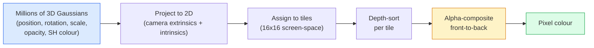

# 3D Gaussian Splatting do zero

> Uma cena é uma nuvem de milhões de Gaussians 3D. Cada um tem uma posição, orientação, escala, opacidade e uma cor que depende da direção de visão.

> **【中文解读】**3D 高(3DGS) para representar cenários em milhões de 3D 高球. Cada alto tem uma posição, direção, contração, opacidade e cor de visão.

> **【拓展：3DGS vs NeRF】**3D Gaussian Splating é uma alternativa real-time para NeRF. O NeRF é lento, mas de alta qualidade.

**Type:** Build | **类型:** 动手
**Languages:** Python | **语言:** Python
**Prerequisites:** Phase 4 Lesson 13 (3D Vision & NeRF), Phase 1 Lesson 12 (Tensor Operations), Phase 4 Lesson 10 (Diffusion basics optional) | **前置知识:** Phase 4 Lesson 13（3D 视觉与 NeRF），Phase 1 Lesson 12（张量运算），Phase 4 Lesson 10（扩散基础，可选）
**Time:** ~90 minutes | **时间:** ~90 分钟

## Objetivos de aprendizagem

- Explicar por que a 3D Gaussian Splatting substituiu a NeRF como padrão de produção para a reconstrução 3D fotorrealista em 2026
- Indicar os seis parâmetros gaussianos (posição, quadriúnulo de rotação, escala, opacidade, cor de harmonica esférica, característica opcional) e quantas flutuações contribuem cada uma
- Implementar um 2D Gaussian splating rasterizer a partir do zero usando `alpha`composição, então mostrar como o caso 3D projetos para o mesmo ciclo
- Utilização`nerfstudio`- Não .`gsplat`, ou `SuperSplat`Reconstruir uma cena de 20 a 50 fotos e exportá-la para o`KHR_gaussian_splatting`Extensão glTF ou o OpenUSD 26.03 `UsdVolParticleField3DGaussianSplat`esquema

> **【中文解读】**O objetivo do aprendizado é listar as capacidades centrais que devem ser adquiridas após a conclusão do curso.


## O problema é o problema da introdução

Um NeRF armazena uma cena como os pesos de um MLP. Cada pixel renderado é centenas de consultas de MLP ao longo de um raio. O treinamento leva horas, o rendering leva segundos, e os pesos não podem ser editados.

> O NeRF vai armazenar cenários como o peso da MLP. Cada imagem de cenário é feita de forma a fazer centenas de consultas de MLP.

A 3D Gaussian Splatting (Kerbl, Kopanas, Leimkühler, Drettakis, SIGGRAPH 2023) substituíram tudo isso. Uma cena é um conjunto explícito de Gaussianos 3D. O renderização é a rasterizagem da GPU a 100+ fps. O treino leva minutos. A edição é direta: traduzir um subconjunto de Gaussianos e você mudou a cadeira. Em 2026, o Grupo Khronos ratificou uma extensão glTF para espaços gaussianos, o OpenUSD 26.03 envia um esquema de espaços gaussianos, Zillow e Apartments.com renderizam imóveis com eles, e a maioria dos novos trabalhos de pesquisa sobre reconstrução 3D são variantes da ideia 3DGS principal.

> 3D 高斯(Kerbl、Kopanas、Leimkühler、Drettakis,SIGGRAPH 2023) substituíram todos estes. O cenário é um conjunto de 3D 高斯 aparente.

O modelo mental é simples, a matemática tem partes móveis suficientes para que a maioria das introduções comece com rasterizamento e salte além das projeções e harmonicas esféricas. Esta lição constrói a coisa inteira  uma versão 2D primeiro, depois a extensão 3D.

> O modelo de mente é muito simples, a matemática tem parte suficiente, a maioria das apresentações começa com a luz e salta sobre a projeção e a função esfera.

## O conceito central.

> **【中文解读】**Este capítulo apresenta os conceitos e teorias fundamentais.


### O que um gaussiano carrega

Um Gaussian 3D é uma mancha paramétrica no espaço com estes atributos:

```
position         mu         (3,)    centre in world coordinates
rotation         q          (4,)    unit quaternion encoding orientation
scale            s          (3,)    log-scales per axis (exponentiated at render time)
opacity          alpha      (1,)    post-sigmoid opacity [0, 1]
SH coefficients  c_lm       (3 * (L+1)^2,)   view-dependent colour
```

A rotação + escala construem uma covariância 3x3: `Sigma = R S S^T R^T`. Essa é a forma do gaussiano em 3D. Harmonicas esféricas permitem que a cor mude com direção de visão  destaques especulares, brilho sutil, brilho visual dependente  sem armazenar texturas por visão. Com SH grau 3 você obtém 16 coeficientes por canal de cor, 48 flutuantes por gaussiano para a cor sozinho.

> 旋转 + 缩放构建 3x3 协方差矩阵:`Sigma = R S S^T R^T` é a forma de Goss em 3D.  é a função de Goss que faz com que a cor mude conforme a direção observada  é alta  é pequena  é pequena  é pequena  é pequena  é pequena  é pequena  é pequena  é pequena  é pequena  é pequena  é pequena  é pequena  é pequena  é pequena  é pequena  é pequena  é pequena  é grande  é grande  é grande  é grande  é grande  é grande  é grande  é grande  é grande  é grande  é grande  é grande  é grande  é grande  é grande  é grande  é grande  é grande  é grande  é grande  é grande  é grande  é grande  é grande  é grande  é grande  é grande  é grande  é grande  é grande  é grande  é grande  é grande  é grande  é grande  é grande  é grande  é grande  é grande  é grande  é grande  é grande  é grande  é grande  é grande  é grande  é grande  é grande  é grande  é grande  é grande  é grande  é grande  é grande  é grande  é grande  é grande  é grande  é grande  é grande  é grande  é grande  é grande  é grande  é grande  é grande  é grande  é grande  é grande  é  é grande  é  é grande  é  é grande  é  é  é  é grande  é  é  é grande  é  é  é  é  grande  grande  é  é  é  é  grande  é  é  grande  é  é  é  grande  é  é  é  grande  é  é  é  é  é  é  é  é  é  é  é  é                            

Uma cena normalmente tem 1-5 milhões de Gaussians. Cada armazenar aproximadamente 60 flutuantes (3 + 4 + 3 + 1 + 48 + misc). Isso é 240 MB para uma cena Gaussiana de cinco milhões de  muito menor do que a nuvem de ponto equivalente com textura por ponto, e uma ordem de magnitude menor do que os pesos MLP de uma NeRF re-renderizado em alta resolução.

> Uma cena típica tem 100-500 milhões de pontos altos. Cada armazenamento tem cerca de 60 pontos altos.

### A racionalização, não a marcha de raios



Cinco passos, todos GPU-friendly, sem consulta MLP por pixel, um único RTX 3080 Ti produz 6 milhões de spots a 147 fps.

> 五步,全部 GPU 友好──无需每像素 MLP 查询──单张 RTX 3080 Ti 以 147 fps 染 600.000──

### O passo de projecção

O Gaussiano 3D em posição mundial .`mu`com covariância 3D `Sigma`projetos para um Gaussian 2D em posição de tela `mu'`com covariância 2D `Sigma'`- Não .

```
mu' = project(mu)
Sigma' = J W Sigma W^T J^T          (2 x 2)

W = viewing transform (rotation + translation of camera)
J = Jacobian of the perspective projection at mu'
```

A pegada do Gaussian 2D é uma elipse cujos eixos são os próprios vetores de `Sigma'`Cada pixel dentro dessa elipse recebe a contribuição de Gaussian, ponderada por`exp(-0.5 * (p - mu')^T Sigma'^-1 (p - mu'))`- Não .

### A regra da composição alfa

Para um pixel, os gaussianos que o cobrem são classificados de frente para frente (ou equivalente frente para trás com fórmula invertida).

```
C_pixel = sum_i alpha_i * T_i * c_i

T_i = prod_{j < i} (1 - alpha_j)       transmittance up to i
alpha_i = opacity_i * exp(-0.5 * d^T Sigma'^-1 d)   local contribution
c_i = eval_SH(SH_i, view_direction)    view-dependent colour
```

Isto é ...**the same equation as NeRF's volumetric render**A identidade é por isso que a qualidade de renderização coincide com a NeRF  ambos estão integrando a mesma equação de campo de radiação.

> É isso.**与 NeRF 的体积渲染方程相同**, baseado apenas em um conjunto de raridade e não em uma amostra de densidade de luz. Esta equação é a razão pela qual a qualidade de enchimento coincide com a NeRF.

### Por que é diferenciável

Cada passo  projeção, atribuição de azulejos, composição alfa, avaliação SH  é diferenciável em relação aos parâmetros de Gaussian. Dada uma imagem de verdade de base, computação de perda de píxeles renderizada, backprop através do rasterizador, atualizar todos `(mu, q, s, alpha, c_lm)`Em mais de 30.000 iterações, os Gaussianos encontram as posições, escalas e cores certas.

> Cada passo é um pequeno passo para a projeção, distribuição de material, análise de dados, análise de dados, análise de dados, análise de dados, análise de dados, análise de dados, análise de dados, análise de dados, análise de dados, análise de dados, análise de dados, análise de dados, análise de dados, análise de dados, análise de dados, análise de dados, análise de dados, análise de dados, análise de dados, análise de dados, análise de dados, análise de dados, análise de dados, análise de dados, análise de dados, análise de dados, análise de dados, análise de dados, análise de dados, análise de dados, análise de dados, análise de dados, análise de dados, análise de dados, análise de dados, análise de dados, análise de dados, análise de dados, análise de dados, análise de dados, análise de dados, análise de dados, análise de dados, análise de dados, análise de dados, análise de dados, análise de dados, de dados, de dados, de dados, de dados, de dados, de dados, de dados, de dados, de dados, de dados, de dados, de dados, de dados, de dados, de dados, de dados, de dados, de dados, de dados, de dados, de dados, de dados, de dados, de dados, de dados, de dados, de dados, de dados, de dados, de dados, de dados, de dados, de dados, de dados, de dados, de dados, de dados, de dados, de dados, de dados, de dados, de dados, de dados, de dados, de dados, de dados, de dados, de dados, de dados, de dados, de dados, de dados, de dados, de dados, de dados, de dados, de dados, de dados, de dados, de dados, de dados, de dados, de dados, de dados, de dados, de dados, de dados, de dados, de dados, de dados, de dados, de dados, de dados, de dados, de dados, de dados, de dados, de dados, de dados, de dados, de dados, de dados, de dados, de dados, de dados, de dados, de dados, de dados, de dados, de dados, de dados, de dados, de dados, de dados, de dados, de dados, de dados, de dados, de dados, de dados, de dados, de dados,`(mu, q, s, alpha, c_lm)`                                                                                                                                                                                                                                                              

### Densificação e poda

Um conjunto fixo de Gaussianos não pode cobrir uma cena complexa.

> O número fixo de altos não pode cobrir os cenários complexos.

- **Clone**um Gaussian em sua posição atual quando sua magnitude de gradiente é alta, mas sua escala é pequena  a reconstrução precisa de mais detalhes aqui.
  Tradução:**克隆** Quando a escala é alta, mas reduzida, a reconstrução de um alto em sua posição atual requer mais detalhes.
- **Split**um gaussiano de grande escala em dois menores quando seu gradiente é alto  um grande gaussiano é muito liso para caber na região.
  Tradução:**分裂** Quando a grande escala é alta, dividir em duas menores  Uma grande escala é incompatível com a região
- **Prune**Gaussians cuja opacidade cai abaixo de um limiar  eles não estão contribuindo.
  Tradução:**修剪** não transparência inferior ao  valor  não contribui, modificação 

A densificação é executada em todas as iterações N. Uma cena normalmente cresce de ~ 100k Gaussians iniciais (sementados a partir de pontos SfM) para 1-5M no final do treinamento.

> 密集化每N 次代运行一次──场景通常从约10万初始高斯 (cerca de 100.000) 种种) 密集化每N 次代运行一次──场景通常从约10万初始高斯 (cerca de 100.000) 种种种) 密集化每N 次代运行一次──场景通常从约10万初始高斯 (cerca de 100.000) 种种种) 密集化每N 次代运行一次──场景通常从约10万初始高斯 (cerca de 100.000) 种种种) 种种种种) 种种种种) 种种种种 (cerca de 100.000-500.000) 种种种) 种种种种种种种种种种种种种种种种种种种种种种种种种种种种种种种种种种种种种种种种种种种种种种种种种种种种种种种种种种种种种种种种种种种种种种种种种种种种种种种种种种种种种种种种种种种种种种种种种种种种种种种种种种种种种种种种种种种种种种种种种种种种种种种种种种种种种种种种种种种种种种种种种种种种种种种种种种种种种种种种种种种种种种种种种种种种种种种种种种种种种种种种种种种种种种种种种种种种种种种种种种种种种种种种种种种种种种种种种种种种种种种种种种种种种种种种种种种种种种种种种种种种种种种种种种种种种种种种种种种种种种种种种种种种种种种种种种种种种种种种种种种种种种种种种种种种种种种种种种种种种种种种种种种种种种种种种种种种种种种种种种种种种种种种种种种种种种种种

### Harmonicas esféricas num único parágrafo

A cor dependente da visão é uma função `c(direction)`A harmonia esférica é a base de Fourier da esfera.`L`E você vai ter`(L+1)^2`Funções básicas por canal. A avaliação da cor para uma nova visão é um produto de pontos entre os coeficientes SH aprendidos e a base avaliada na direção de visualização. Grau 0 = um coeficiente = cor constante. Grau 3 = 16 coeficientes = suficiente para capturar sombras Lambertian, especular e reflexão leve.

### A pilha de produção de 2026

```
1. Capture         smartphone / DJI drone / handheld scanner
2. SfM / MVS       COLMAP or GLOMAP derives camera poses + sparse points
3. Train 3DGS      nerfstudio / gsplat / inria official / PostShot (~10-30 min on RTX 4090)
4. Edit            SuperSplat / SplatForge (clean floaters, segment)
5. Export          .ply -> glTF KHR_gaussian_splatting or .usd (OpenUSD 26.03)
6. View            Cesium / Unreal / Babylon.js / Three.js / Vision Pro
```

### Variantes 4D e geracionais

- **4D Gaussian Splatting** Gaussians são funções do tempo; usado para vídeo volumétrico (Superman 2026, "Helicóptero" de A$AP Rocky).
- **Generative splats**Modelos de texto para plato (Marble by World Labs) que alucinam cenas inteiras.
- **3D Gaussian Unscented Transform** Variante da NVIDIA NuRec para simulação de condução autônoma.

> **【中文解读】**Este é um método de "desde zero" que ajuda a entender o princípio da estrutura, não é um problema que se encontra em uma caixa negra.

> **【拓展：工业部署中的视觉系统】**No implementar industrial real, o modelo visual precisa considerar a possibilidade de atrasos, modelos de tamanho, dispositivos de margem, etc. TensorRT, ONNX Runtime, OpenVINO são ferramentas de aceleração de cálculo de uso comum.

> **【拓展：数据标注与质量】** Visual task's effect highly depends on label data quality──Label Studio、CVAT is the mainstream marking tool──In industrial scenarios, proactive learning(Active Learning) pode reduzir o custo de marcação: modelo contra um pedido de amostra não definido marcação artificial, identidade de amostra auto-marcação──


## Construí-lo e realizei-o.
```figure
cv3-gaussian-splat
```

## Construí-lo

### Passo 1: Gaussian 2D

Primeiro construímos um rasterizador 2D, e o caso 3D reduz-se a ele após a projeção.

```python
import torch
import torch.nn as nn
import torch.nn.functional as F


def eval_2d_gaussian(means, covs, points):
    """
    means:  (G, 2)      centres
    covs:   (G, 2, 2)   covariance matrices
    points: (H, W, 2)   pixel coordinates
    returns: (G, H, W)  density at every pixel for every Gaussian
    """
    G = means.size(0)
    H, W, _ = points.shape
    flat = points.view(-1, 2)
    inv = torch.linalg.inv(covs)
    diff = flat[None, :, :] - means[:, None, :]
    d = torch.einsum("gpi,gij,gpj->gp", diff, inv, diff)
    density = torch.exp(-0.5 * d)
    return density.view(G, H, W)
```

`einsum`faz a forma quadrática `diff^T Sigma^-1 diff`para cada par (Gaussian, pixel).

### Passo 2: rasterizador de espalteamento 2D

A profundidade em 2D não tem sentido, por isso usamos um escalar gaussiano para a ordem.

```python
def rasterise_2d(means, covs, colours, opacities, depths, image_size):
    """
    means:     (G, 2)
    covs:      (G, 2, 2)
    colours:   (G, 3)
    opacities: (G,)     in [0, 1]
    depths:    (G,)     per-Gaussian scalar used for ordering
    image_size: (H, W)
    returns:   (H, W, 3) rendered image
    """
    H, W = image_size
    yy, xx = torch.meshgrid(
        torch.arange(H, dtype=torch.float32, device=means.device),
        torch.arange(W, dtype=torch.float32, device=means.device),
        indexing="ij",
    )
    points = torch.stack([xx, yy], dim=-1)

    densities = eval_2d_gaussian(means, covs, points)
    alphas = opacities[:, None, None] * densities
    alphas = alphas.clamp(0.0, 0.99)

    order = torch.argsort(depths)
    alphas = alphas[order]
    colours_sorted = colours[order]

    T = torch.ones(H, W, device=means.device)
    out = torch.zeros(H, W, 3, device=means.device)
    for i in range(means.size(0)):
        a = alphas[i]
        out += (T * a)[..., None] * colours_sorted[i][None, None, :]
        T = T * (1.0 - a)
    return out
```

Não rápido  uma implementação real usa kernels CUDA baseados em telhas  mas exatamente a matemática certa e totalmente diferenciável.

### Passo 3: Uma cena de espartilhamento 2D treinável

```python
class Splats2D(nn.Module):
    def __init__(self, num_splats=128, image_size=64, seed=0):
        super().__init__()
        g = torch.Generator().manual_seed(seed)
        H, W = image_size, image_size
        self.means = nn.Parameter(torch.rand(num_splats, 2, generator=g) * torch.tensor([W, H]))
        self.log_scale = nn.Parameter(torch.ones(num_splats, 2) * math.log(2.0))
        self.rot = nn.Parameter(torch.zeros(num_splats))  # single angle in 2D
        self.colour_logits = nn.Parameter(torch.randn(num_splats, 3, generator=g) * 0.5)
        self.opacity_logit = nn.Parameter(torch.zeros(num_splats))
        self.depth = nn.Parameter(torch.rand(num_splats, generator=g))

    def covs(self):
        s = torch.exp(self.log_scale)
        c, si = torch.cos(self.rot), torch.sin(self.rot)
        R = torch.stack([
            torch.stack([c, -si], dim=-1),
            torch.stack([si, c], dim=-1),
        ], dim=-2)
        S = torch.diag_embed(s ** 2)
        return R @ S @ R.transpose(-1, -2)

    def forward(self, image_size):
        covs = self.covs()
        colours = torch.sigmoid(self.colour_logits)
        opacities = torch.sigmoid(self.opacity_logit)
        return rasterise_2d(self.means, covs, colours, opacities, self.depth, image_size)
```

`log_scale`- Não .`opacity_logit`, e `colour_logits`são todos os parâmetros sem restrições mapeados através da ativação certa no momento de renderização. Este é o padrão padrão para cada implementação 3DGS.

### Passo 4: Ajustar Gaussians 2D para uma imagem de alvo

```python
import math
import numpy as np

def make_target(size=64):
    yy, xx = np.meshgrid(np.arange(size), np.arange(size), indexing="ij")
    img = np.zeros((size, size, 3), dtype=np.float32)
    # Red circle
    mask = (xx - 20) ** 2 + (yy - 20) ** 2 < 10 ** 2
    img[mask] = [1.0, 0.2, 0.2]
    # Blue square
    mask = (np.abs(xx - 45) < 8) & (np.abs(yy - 40) < 8)
    img[mask] = [0.2, 0.3, 1.0]
    return torch.from_numpy(img)


target = make_target(64)
model = Splats2D(num_splats=64, image_size=64)
opt = torch.optim.Adam(model.parameters(), lr=0.05)

for step in range(200):
    pred = model((64, 64))
    loss = F.mse_loss(pred, target)
    opt.zero_grad(); loss.backward(); opt.step()
    if step % 40 == 0:
        print(f"step {step:3d}  mse {loss.item():.4f}")
```

Mais de 200 passos os 64 Gaussianos se estabelecem nas duas formas.

### Passo 5: De 2D para 3D

A extensão 3D mantém o mesmo ciclo.

1. A rotação por Gaussian é um quaternion em vez de um único ângulo.
2. A covariância é`R S S^T R^T`com`R`construído a partir do quaternion e `S = diag(exp(log_scale))`- Não .
3. Projecção `(mu, Sigma) -> (mu', Sigma')`utiliza a extrínseca da câmera e o Jacobiano da projeção de perspectiva em `mu`- Não .
4. A cor torna-se uma expansão esférica-harmónica; avaliá-la na direção de visão.
5. A classificação de profundidade é de câmera real-espaço z em vez de um escalar aprendido.

Toda a execução da produção (`gsplat`- Não .`inria/gaussian-splatting`- Não .`nerfstudio`) faz exatamente isso na GPU com núcleos CUDA baseados em telhas.

### Passo 6: Avaliação das armônicas esféricas

A base SH até o grau 3 tem 16 termos por canal.

```python
def eval_sh_degree_3(sh_coeffs, dirs):
    """
    sh_coeffs: (..., 16, 3)   last dim is RGB channels
    dirs:      (..., 3)       unit vectors
    returns:   (..., 3)
    """
    C0 = 0.282094791773878
    C1 = 0.488602511902920
    C2 = [1.092548430592079, 1.092548430592079,
          0.315391565252520, 1.092548430592079,
          0.546274215296039]
    x, y, z = dirs[..., 0], dirs[..., 1], dirs[..., 2]
    x2, y2, z2 = x * x, y * y, z * z
    xy, yz, xz = x * y, y * z, x * z

    result = C0 * sh_coeffs[..., 0, :]
    result = result - C1 * y[..., None] * sh_coeffs[..., 1, :]
    result = result + C1 * z[..., None] * sh_coeffs[..., 2, :]
    result = result - C1 * x[..., None] * sh_coeffs[..., 3, :]

    result = result + C2[0] * xy[..., None] * sh_coeffs[..., 4, :]
    result = result + C2[1] * yz[..., None] * sh_coeffs[..., 5, :]
    result = result + C2[2] * (2.0 * z2 - x2 - y2)[..., None] * sh_coeffs[..., 6, :]
    result = result + C2[3] * xz[..., None] * sh_coeffs[..., 7, :]
    result = result + C2[4] * (x2 - y2)[..., None] * sh_coeffs[..., 8, :]

    # degree 3 terms omitted here for brevity; full 16-coefficient version in the code file
    return result
```

> **【中文解读】**Este capítulo mostra como usar um framework maduro (como PyTorch、HuggingFace etc) rápida aplicação desta tecnologia.


Aprendi`sh_coeffs`No tempo de renderização você avalia contra a direção de visão atual e obtém um RGB de 3 vetores.


> **【拓展：视觉模型的持续学习】**Em um ambiente de produção, o modelo visual precisa se adaptar constantemente a novos dados. Isto é especialmente importante na condução automática e no controle de qualidade industrial.

## Use-o com o framework implementado.

Para o trabalho real 3DGS, use `gsplat`(Meta) ou `nerfstudio`- Não .

```bash
pip install nerfstudio gsplat
ns-download-data example
ns-train splatfacto --data path/to/data
```

`splatfacto`O treino de 3DGS do Nerfstudio leva 10 a 30 minutos num RTX 4090 para uma cena típica.

Opções de exportação que importam em 2026:

- `.ply` nuvem gaussiana bruta (portátil, maior arquivo).
- `.splat` Formatos quantizados PlayCanvas / SuperSplat.
- glTF `KHR_gaussian_splatting` Padrão de Khronos, portátil para todos os espectadores (Feb 2026 RC).
- OpenUSD `UsdVolParticleField3DGaussianSplat` USD-nativo, para os gasodutos NVIDIA Omniverse e Vision Pro.

> **【中文解读】**Este capítulo se concentra em como o modelo será implantado como produto disponível. De modelo original a nível de produção, os sistemas precisam considerar várias dimensões de otimização de desempenho, tratamento de erros, controle, etc.


Para cenas 4D / dinâmicas, `4DGS`E ...`Deformable-3DGS`Extenda a mesma máquina com meios e opacidades variáveis em tempo.


## Envia-o . Produto .

> **【中文解读】**Practicação de temas de fácil/médio/difícil  3o dificuldade de passagem  Recomendação de completar pelo menos Praça de nível médio Classe difícil  Adaptação a pesquisa profunda ou preparação para o encontro 


Esta lição produz:

- `outputs/prompt-3dgs-capture-planner.md` um prompt que planeja uma sessão de captura (número de fotos, caminho da câmera, iluminação) para um determinado tipo de cena.
- `outputs/skill-3dgs-export-router.md` uma habilidade que escolha o formato de exportação adequado (`.ply`- Não .`.splat`/ glTF / USD) dado ao telespectador ou motor a jusante.

## Exercícios.

1. **(Easy)**Exerça o treinador de espartilhamento 2D acima numa imagem sintética diferente.`num_splats`em `[16, 64, 256]`e gráfico MSE vs passo para cada um. Identificar o ponto de retorno decrescente.
2. **(Medium)**Extenda o rasterizador 2D para suportar cores RGB por Gaussian que dependem de um " ângulo de visão " escalar através de um harmonico de grau-2.
3. **(Hard)**Clone `nerfstudio`e trem .`splatfacto`Em uma captura de 20 fotos de qualquer cena que você tem (mesca, planta, rosto, sala).`KHR_gaussian_splatting`e abre-o num visualizador (Three.js `GaussianSplats3D`Relata o tempo de treinamento, número de Gaussians e fps.

> **【中文解读】**No 术语表中的"O que as pessoas dizem" vs "O que realmente significa" 区分日常口语和精确技术含义── em equipe,统一术语定义可以避免大量沟通误解──


## Termos-chave .

| Term | What people say | What it actually means |
|------|----------------|----------------------|
| 3DGS | "Gaussian splats" | Explicit scene representation as millions of 3D Gaussians with per-Gaussian position, rotation, scale, opacity, SH colour |
| Covariance | "Shape of the Gaussian" | `Sigma = R S S^T R^T`; orientation and anisotropic scale of one Gaussian |
| Alpha compositing | "Back-to-front blend" | Same equation as NeRF's volumetric render, now over an explicit sparse set |
| Densification | "Clone and split" | Adaptive addition of new Gaussians where reconstruction is under-fit |
| Pruning | "Delete low-opacity" | Remove Gaussians that have collapsed to near-zero opacity during training |
| Spherical harmonics | "View-dependent colour" | Fourier basis on the sphere; stores colour as a function of viewing direction |
| Splatfacto | "nerfstudio's 3DGS" | The easiest path to training 3DGS in 2026 |
| `KHR_gaussian_splatting` | "glTF standard" | Khronos 2026 extension that makes 3DGS portable across viewers and engines |

> **【中文解读】**延伸阅读 fornece recursos de alta qualidade para a aprendizagem profunda.


## Mais leitura 延伸阅读

- [3D Gaussian Splatting for Real-Time Radiance Field Rendering (Kerbl et al., SIGGRAPH 2023)](https://repo-sam.inria.fr/fungraph/3d-gaussian-splatting/) O papel original
- [gsplat (Meta/nerfstudio)](https://github.com/nerfstudio-project/gsplat) rasterizador CUDA de qualidade de produção
- [nerfstudio Splatfacto](https://docs.nerf.studio/nerfology/methods/splat.html) Recepta de formação de referência
- [Khronos KHR_gaussian_splatting extension](https://github.com/KhronosGroup/glTF/blob/main/extensions/2.0/Khronos/KHR_gaussian_splatting/README.md) o formato portátil 2026
- [OpenUSD 26.03 release notes](https://openusd.org/release/)- Não .`UsdVolParticleField3DGaussianSplat`esquema
- [THE FUTURE 3D State of Gaussian Splatting 2026](https://www.thefuture3d.com/blog-0/2026/4/4/state-of-gaussian-splatting-2026) visão geral da indústria
