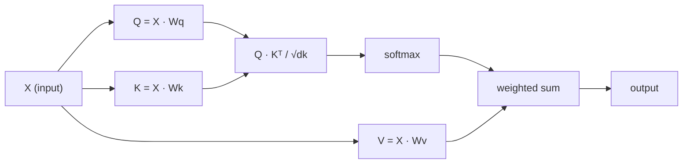

# A auto-atenção desde o zero
# Auto-atenção desde zero

> A atenção é uma tabela de busca onde cada palavra pergunta "quem é importante para mim?" e aprende a resposta.

> O atenção é uma lista de busca, cada palavra está em questão "quem é importante para mim?"

> **【中文解读】**A auto-atenção é o núcleo do transformador: Q*K^T  calcular cada token para a atenção dos outros tokens;; compreender Q/K/V intuitivamente é a base da compreensão GPT/BERT;;

**Type:** Build | **类型:** 动手
**Language:**O Python .**语言:**Python
**Prerequisites:** Phase 3 (Deep Learning Core), Phase 5 Lesson 10 (Sequence-to-Sequence) | **前置知识:** 阶段 3（深度学习基础），阶段 5 第 10 课（序列到序列）
**Time:** ~90 minutes | **时间:** ~90 分钟

## Objetivos de aprendizagem

- Implementar a auto-atenção do produto ponto em escala a partir do zero usando apenas NumPy, incluindo projeções de consulta/chave/valor e a soma ponderada softmax
   Utilize apenas NumPy desde zero para realizar um acréscimo de pontos de concentração, incluindo consulta/chave/valor projeção e softmax +
- Construir uma camada de atenção multi-cabeça que divide cabeças, calcula atenção paralela e concatenar os resultados
  Construir várias camadas de atenção, realizar a separação de atenção, fazer o cálculo e resultados
- Traçar como a matriz de atenção capta relações de token e explicar por que a escalação por sqrt(d_k) impede a saturação de softmax
  追踪注意力矩阵 关系 如何捕获令子 关系,并解释为什么除以平方(d_k) 能防止软max 和
- Aplicar mascaramento causal para converter a atenção bidirecional em atenção autoregressiva (estilo de decodificador)
  应用因果掩码将双向注意力转换为自归归 (de volta em volta em volta em volta em volta em volta em volta em volta em volta em volta em volta em volta em volta em volta em volta em volta em volta em volta em volta em volta em volta em volta em volta em volta em volta em volta em volta em volta em volta em volta em volta em volta em volta em volta em volta em volta em volta em volta em volta em volta em volta em volta em volta em volta em volta em volta em volta em volta em volta em volta em volta em volta em volta em volta em volta em volta em volta em volta em volta em volta em volta em volta em volta em volta em volta em volta em volta em volta em volta em volta em volta em volta em volta em volta em volta em volta em volta em volta em volta em volta em volta em volta em volta em volta em volta em volta em volta em volta em volta em volta em volta em volta em volta em volta em volta em volta em volta em volta em volta em volta em volta em volta em volta em volta em volta em volta em volta em volta em volta em volta em volta em volta em volta em volta em volta em volta em volta em volta em volta em volta em volta em volta em volta em volta em volta em volta em volta em volta em volta em volta em volta em volta em volta em volta em volta em volta em volta em volta em volta em volta em volta em volta em volta em volta em volta em volta em volta em volta em volta em volta em volta em volta em volta em volta em volta em volta em volta em volta em volta em volta em volta em volta em volta em volta em volta em volta em volta em volta em volta em volta em volta em volta em volta em volta em volta em volta em volta em volta em volta em volta em volta em volta em volta em volta em volta em volta em volta em volta em volta em volta em volta em volta em volta em volta em volta em volta em volta em volta em volta em volta em volta em volta em volta em volta em volta em volta em volta em volta em volta em volta em volta em volta em volta em volta em volta em volta em volta em volta em volta em volta em volta em volta em volta em volta em volta em volta em volta em volta em volta em volta em volta em volta em volta em volta em volta em volta em volta em volta em volta em volta em volta em volta em volta em volta em volta em volta

## O problema é o problema da introdução

As sequências de processo RNNs um token por vez. Quando você alcança o token 50, as informações do token 1 já foram comprimidas através de 50 passos de compressão. dependências de longo alcance são esmagadas em um estado oculto de tamanho fixo  um gargalo de engarrafamento que nenhuma quantidade de LSTM gating resolve completamente.

> RNN tokens individuais processamento sequência ⋅ Quando você chega aos 50 tokens ⋅, a informação do 1o token já foi comprimida 50 vezes ⋅ a longa distância depende de ser comprimida em um estado oculto de tamanho fixo ⋅ é um botelho de LSTM 门控无法完全解决──

O artigo de atenção Bahdanau de 2014 mostrou a solução: deixe o decodificador olhar para trás em cada posição do codificador e decidir quais são importantes para o passo atual. Mas ainda estava preso a um RNN. O artigo de 2017 "Attenção é tudo o que você precisa" fez uma pergunta mais nítida: e se a atenção é o único mecanismo?

> O artigo de atenção de Bahdanau de 2014 apresentou um método de modificação: deixe o descifrador rever cada posição do editador, e decida quais são os passos atuais importantes. Mas ainda está inserido no artigo de 2017 "Attenção é tudo o que você precisa".

A auto-atenção permite que cada posição de uma sequência atenda a cada outra posição em um único passo paralelo.

> O seu foco é em cada posição da sequência, em um único passo em linha, e em todas as outras posições. É por isso que o Transformer é rápido, expandível e dominante.

> **【中文解读】**A revolução do RNN é a seguinte: abandonar completamente o ciclo, apenas com um mecanismo de atenção.

## O conceito central.

### A Análogia de Pesquisa de Base de Dados

Pensem na atenção como uma pesquisa de banco de dados suave:

> Para criar um sistema de dados,

```
Traditional database:
  Query: "capital of France"  -->  exact match  -->  "Paris"

Attention:
  Query: "capital of France"  -->  similarity to ALL keys  -->  weighted blend of ALL values
```

Cada token gera três vetores:
- **Query (Q)**"O que estou à procura?"
  **查询 (Query, Q)**"Eu estou a procurar o quê?"
- **Key (K)**"O que contém?"
  **键 (Key, K)**"Eu contendo o quê?"
- **Value (V)**"Que informações forneço se for selecionado?"
  **值 (Value, V)**"Se for escolhido, que informação posso fornecer?"

O produto de pontos entre uma consulta e todas as chaves produz pontuações de atenção. pontuação alta significa "esta chave corresponde à minha consulta".

> 查询与所有键的点积产生注意分数――高分 significa "esta chave corresponde à minha consulta"―― estes pontos são adicionados ao valor――输出是值的加权求和――

> **【中文解读】**O Q é "Eu estou procurando", K é "Eu tenho", V é "Meu conteúdo real" Classe de dados de atenção é a melhor maneira de entender Q/K/V. O processo inteiro é uma operação de "software search"

> **【拓展：注意力机制在真实系统中的应用】**GPT 系列 use因果自注意力(cada token apenas pode ver o token anterior);BERT utiliza双向自注意力(cada token 能看到所有 token);交叉注意力(Cross-Attention)则在T5、Stable Diffusion等模型中连接编码器和编码器──理解 Q/K/V是理解所有这些变体的基础──

### Q, K, V Computação

Cada embedding token é projetado através de três matrizes de peso aprendidas:

> Cada token é inserido através de três matrizes de peso para projetar:

```
Input embeddings (sequence of n tokens, each d-dimensional):

  X = [x1, x2, x3, ..., xn]       shape: (n, d)

Three weight matrices:

  Wq  shape: (d, dk)
  Wk  shape: (d, dk)
  Wv  shape: (d, dv)

Projections:

  Q = X @ Wq    shape: (n, dk)      each token's query
  K = X @ Wk    shape: (n, dk)      each token's key
  V = X @ Wv    shape: (n, dv)      each token's value
```

Visualmente, por um sinal:

> 直观地看, para um token:

```
             Wq
  x_i ------[*]------> q_i    "What am I looking for?"
       |
       |     Wk
       +----[*]------> k_i    "What do I contain?"
       |
       |     Wv
       +----[*]------> v_i    "What do I offer?"
```

### A Matriz de Atenção

Uma vez que você tem Q, K, V para todos os tokens, pontuações de atenção formam uma matriz:

> Uma vez que você tem todos os tokens Q, K, V, a atenção porcentagem forma uma matriz:

```
Scores = Q @ K^T    shape: (n, n)

              k1    k2    k3    k4    k5
        +-----+-----+-----+-----+-----+
   q1   | 2.1 | 0.3 | 0.1 | 0.8 | 0.2 |   <- how much q1 attends to each key
        +-----+-----+-----+-----+-----+
   q2   | 0.4 | 1.9 | 0.7 | 0.1 | 0.3 |
        +-----+-----+-----+-----+-----+
   q3   | 0.2 | 0.6 | 2.3 | 0.5 | 0.1 |
        +-----+-----+-----+-----+-----+
   q4   | 0.9 | 0.1 | 0.4 | 1.7 | 0.6 |
        +-----+-----+-----+-----+-----+
   q5   | 0.1 | 0.3 | 0.2 | 0.5 | 2.0 |
        +-----+-----+-----+-----+-----+

Each row: one token's attention over the entire sequence
```

### Por que é que é que é que é que é que é que é que é que é que é que é que é que é que é que é que é que é que é que é que é que é que é que é que é que é que é que é que é que é que é que é que é que é que é que é que é que é que é que é que é que é que é que é que é que é que é que é que é que é que é que é que é que é que é que é que é que é que é?
Assista a uma consulta por vez varrer as chaves: cada linha marca cada token, softmax transforma os resultados em pesos e o vetor de contexto é a mistura ponderada de valores.

```figure
attention-matrix
```

### Por que Escala?

Os produtos de pontos crescem com a dimensão dk. Se dk = 64, os produtos de pontos podem estar na faixa de dez, empurrando softmax para regiões onde os gradientes desaparecem.

> Se dk = 64, o ponto de acumulação é possível dentro de um período de 10 anos, o ponto de acumulação será submetido à substituição de uma área de diminuição de gradiente.

```
Scaled scores = (Q @ K^T) / sqrt(dk)
```

Isto mantém os valores numa faixa onde softmax produz gradientes úteis.

> Isso permite que o valor permaneça no limite de suavidade máxima.

> **【中文解读】**缩放因子 1/sqrt(dk) é um detalhe fundamental, mas facilmente ignorado.

### Softmax transforma as pontuações em pesos . Softmax vai converter o número de pontos em peso .

Softmax converte as pontuações brutas em uma distribuição de probabilidade em cada linha:

> Softmax vai converter o número original em distribuição de probabilidade por linha:

```
Raw scores for q1:   [2.1, 0.3, 0.1, 0.8, 0.2]
                            |
                         softmax
                            |
Attention weights:   [0.52, 0.09, 0.07, 0.14, 0.08]   (sums to ~1.0)
```

Cada token tem um conjunto de pesos que dizem quanto deve ser atendido a cada outro token.

> Agora cada token tem um grupo de peso, indicando a atenção para cada outro token.

> **【拓展：注意力矩阵的可解释性】**Atenção em torno de uma linha de pensamento é um instrumento importante para a pesquisa de transformação. Por meio do peso da atenção visualizada, pode-se encontrar um modelo aprendido de um modo de linguagem: quais são os símbolos entre eles que estão fortemente relacionados. Por exemplo, o termo "it" geralmente tem uma alta atenção para o seu nome de referência.

### A soma ponderada de valores e o valor de adição

A saída final para cada token é uma soma ponderada de todos os vetores de valor:

> A saída final de cada token é o aumento de todos os valores de vector:

```
output_i = sum( attention_weight[i][j] * v_j  for all j )

For token 1:
  output_1 = 0.52 * v1 + 0.09 * v2 + 0.07 * v3 + 0.14 * v4 + 0.08 * v5
```

### O tubo completo.



Fórmula em uma linha:

> Uma linha de fórmula:

```
Attention(Q, K, V) = softmax( Q @ K^T / sqrt(dk) ) @ V
```

## Construí-lo e realizei-o.
```figure
softmax-attention-scaling
```

## Construí-lo

### Passo 1: Softmax do zero . Passo 1: implementar Softmax do zero .

Softmax converte logits brutos em probabilidades.

> Softmax irá transformar os logits originais em probabilidade.

```python
import numpy as np

def softmax(x):
    shifted = x - np.max(x, axis=-1, keepdims=True)
    exp_x = np.exp(shifted)
    return exp_x / np.sum(exp_x, axis=-1, keepdims=True)

logits = np.array([2.0, 1.0, 0.1])
print(f"logits:  {logits}")
print(f"softmax: {softmax(logits)}")
print(f"sum:     {softmax(logits).sum():.4f}")
```

### Passo 2: Escalada atenção de produto ponto. Passo 2: reduzir a atenção ponto acumulação.

A função central, leva matrizes Q, K, V e retorna a saída de atenção mais a matriz de peso.

> 核心函数──接收 Q、K、V 矩阵, retornar atenção output e peso矩阵──

```python
def scaled_dot_product_attention(Q, K, V):
    dk = Q.shape[-1]
    scores = Q @ K.T / np.sqrt(dk)
    weights = softmax(scores)
    output = weights @ V
    return output, weights
```

### Passo 3: Classe de auto-atenção com projeções aprendidas. Passo 3: Aprenda a projetar.

Um módulo de auto-atenção completo com matrizes de peso Wq, Wk, Wv iniciadas com escalagem semelhante a Xavier.

> Um módulo completo de auto-atenção, contendo Wq、Wk、Wv 权重矩阵, usando Xavier 式缩缩初始化──

```python
class SelfAttention:
    def __init__(self, d_model, dk, dv, seed=42):
        rng = np.random.default_rng(seed)
        scale = np.sqrt(2.0 / (d_model + dk))
        self.Wq = rng.normal(0, scale, (d_model, dk))
        self.Wk = rng.normal(0, scale, (d_model, dk))
        scale_v = np.sqrt(2.0 / (d_model + dv))
        self.Wv = rng.normal(0, scale_v, (d_model, dv))
        self.dk = dk

    def forward(self, X):
        Q = X @ self.Wq
        K = X @ self.Wk
        V = X @ self.Wv
        output, weights = scaled_dot_product_attention(Q, K, V)
        return output, weights
```

### Passo 4: Execute-a numa frase. Passo 4: Execute-a numa frase.

Crie falsos incorporados para uma frase e observe o peso da atenção.

> Para um artigo, criar falsos embutidos, observar o poder de atenção.

```python
sentence = ["The", "cat", "sat", "on", "the", "mat"]
n_tokens = len(sentence)
d_model = 8
dk = 4
dv = 4

rng = np.random.default_rng(42)
X = rng.normal(0, 1, (n_tokens, d_model))

attn = SelfAttention(d_model, dk, dv, seed=42)
output, weights = attn.forward(X)

print("Attention weights (each row: where that token looks):\n")
print(f"{'':>6}", end="")
for token in sentence:
    print(f"{token:>6}", end="")
print()

for i, token in enumerate(sentence):
    print(f"{token:>6}", end="")
    for j in range(n_tokens):
        w = weights[i][j]
        print(f"{w:6.3f}", end="")
    print()
```

### Passo 5: Visualize a atenção com o mapa de calor ASCII  passo 5: Use o ASCII 热力图可视化注意力

Mapear pesos de atenção para os personagens para uma visão rápida.

> O poder de atenção será re-mapeado para caracteres para rápida visualização.

```python
def ascii_heatmap(weights, tokens, chars=" ░▒▓█"):
    n = len(tokens)
    print(f"\n{'':>6}", end="")
    for t in tokens:
        print(f"{t:>6}", end="")
    print()

    for i in range(n):
        print(f"{tokens[i]:>6}", end="")
        for j in range(n):
            level = int(weights[i][j] * (len(chars) - 1) / weights.max())
            level = min(level, len(chars) - 1)
            print(f"{'  ' + chars[level] + '   '}", end="")
        print()

ascii_heatmap(weights, sentence)
```

## Use-o com o framework implementado.

O PyTorch's `nn.MultiheadAttention`Faz exatamente o que construímos, mais divisão multi-head e projeção de saída:

> PyTorch `nn.MultiheadAttention`Realizaram completamente o conteúdo que construímos, além de várias divisões e projeções de saída:

```python
import torch
import torch.nn as nn

d_model = 8
n_heads = 2
seq_len = 6

mha = nn.MultiheadAttention(embed_dim=d_model, num_heads=n_heads, batch_first=True)

X_torch = torch.randn(1, seq_len, d_model)

output, attn_weights = mha(X_torch, X_torch, X_torch)

print(f"Input shape:            {X_torch.shape}")
print(f"Output shape:           {output.shape}")
print(f"Attention weight shape: {attn_weights.shape}")
print(f"\nAttn weights (averaged over heads):")
print(attn_weights[0].detach().numpy().round(3))
```

A diferença chave: a atenção multi-cabeça executa múltiplas funções de atenção em paralelo, cada uma com suas próprias projeções Q, K, V de tamanho dk = d_modelo / n_cabeças, em seguida, concatenar os resultados.

> 关键区别:多头注意力并行运行多头注意力函数, cada um tem seu próprio Q、K、V 投影,大小为 dk = d_model / n_heads, então junta resultados──这让模型能同时关注不同类型的关系──

> **【中文解读】**PyTorch `nn.MultiheadAttention`Envolve toda a lógica que realizamos a partir de zero, além de várias divisões e projeções de saída. O benefício da atenção múltipla é que o modelo se concentre simultaneamente em diferentes tipos de relações.

> **【拓展：多头注意力的生物学类比】**O multi-headed attention pode ser comparado a vários testadores de características do córtex visual. Assim como os diferentes neurônios da região V1 testam diferentes bordes, direções e cores, diferentes heads of attention aprendem a capturar diferentes tipos de tokens 间关系.

## Envia-o . Produto .

Esta lição produz:
- `outputs/prompt-attention-explainer.md` um pedido para explicar a atenção através da analogia de pesquisa de banco de dados

> 本课产生:
> - `outputs/prompt-attention-explainer.md`  através da base de dados buscar tipos de explicação de atenção

## Exercícios.

1. Modificar`scaled_dot_product_attention`Para aceitar uma matriz de máscara opcional que fixa certas posições a infinito negativo antes do softmax (é assim que funciona o mascaramento causal/decodificador)
   修改 `scaled_dot_product_attention`Para aceitar uma matriz de encoberta opcional, em softmax, algumas posições serão definidas como negativas.

2. Implementar atenção multi-head a partir do zero: dividir Q, K, V em `n_heads`pedaços, executar atenção em cada, concatenar, e projetar através de uma matriz de peso final Wo
   Desde zero realizando a atenção múltipla: vai Q、K、V                                                                                                                                                                                                                                                                                                                                                                                                                                                                                                              `n_heads`块,分别运行注意力,拼接,并通过最终权重矩阵 Wo 投影

3. Tome duas frases diferentes do mesmo comprimento, entregue-as através da mesma instância de autoatentação e compare os padrões de atenção.
   Tome duas sentenças diferentes da mesma duração, através do mesmo SelfAttention  exemplo, compare-as com o seu modo de atenção.

## Termos-chave .

| Term | What people say / 人们怎么说 | What it actually means / 实际含义 |
|------|------------------------------|----------------------------------|
| Query (Q) | "The question vector" / "问题向量" | A learned projection of the input that represents what information this token is looking for. 输入的学习投影，表示这个 token 在寻找什么信息。 |
| Key (K) | "The label vector" / "标签向量" | A learned projection that represents what information this token contains, matched against queries. 学习投影，表示这个 token 包含什么信息，与查询匹配。 |
| Value (V) | "The content vector" / "内容向量" | A learned projection carrying the actual information that gets aggregated based on attention scores. 学习投影，携带根据注意力分数聚合的实际信息。 |
| Scaled dot-product attention | "The attention formula" / "注意力公式" | softmax(QK^T / sqrt(dk)) @ V — scaling prevents softmax saturation in high dimensions. softmax(QK^T / sqrt(dk)) @ V — 缩放防止高维时 softmax 饱和。 |
| Self-attention | "The token looks at itself and others" / "token 看自己和其他 token" | Attention where Q, K, V all come from the same sequence, letting every position attend to every other position. Q、K、V 都来自同一序列的注意力，让每个位置关注所有其他位置。 |
| Attention weights | "How much focus" / "多少关注" | A probability distribution over positions, produced by softmax over scaled dot products. 位置上的概率分布，由缩放点积上的 softmax 产生。 |
| Multi-head attention | "Parallel attention" / "并行注意力" | Running multiple attention functions with different projections, then concatenating results for richer representations. 使用不同投影运行多个注意力函数，然后拼接结果以获得更丰富的表示。 |

## Mais leitura 延伸阅读

- [Attention Is All You Need (Vaswani et al., 2017)](https://arxiv.org/abs/1706.03762) papel transformador original
  Vaswani 等人(2017)  原始 Transformer 论文

- [The Illustrated Transformer (Jay Alammar)](https://jalammar.github.io/illustrated-transformer/) melhor passagem visual da arquitetura completa
  Jay Alammar's Visualização Transformer  最佳完整架构可视化讲解

- [The Annotated Transformer (Harvard NLP)](https://nlp.seas.harvard.edu/annotated-transformer/) implementação linha a linha do PyTorch com explicações
  Harvard NLP 注释版 Transformer  逐行 PyTorch 实现与解释

> **【拓展：Flash Attention 与注意力优化】**O sistema de auto-atenção estándar O  N^2) 内存开销是长序列处理的瓶──Flash Attention(2022) através de estratégias de cálculo de blocos e de cálculo pesado, em caso de não mudar resultados matemáticos, a complexidade do sistema de memória será reduzida a O  N)── isto é essencial na aplicação real, como na janela de 128K do GPT-4 上下文窗口等.
