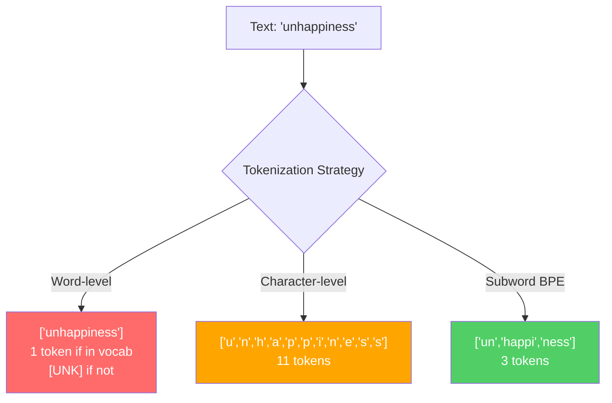
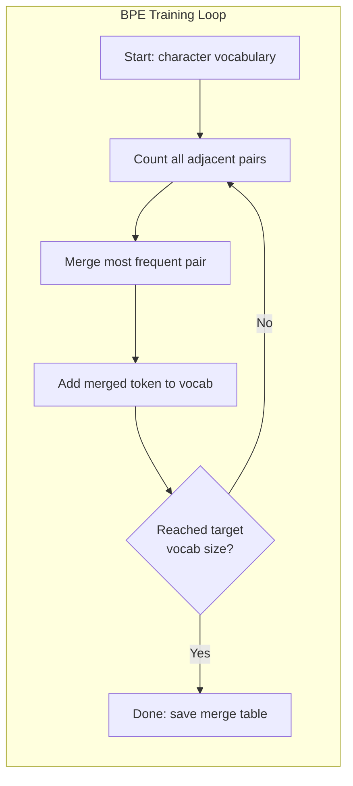
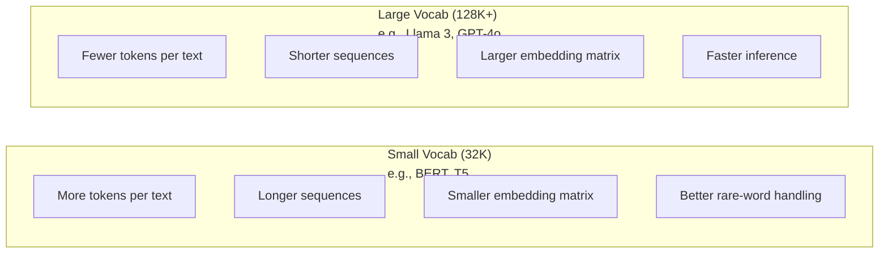

# Tokenizers: BPE, WordPiece, SentencePiece  分词器: BPE, WordPiece, SentencePiece

> O teu LLM não lê inglês, lê números inteiros. O tokenizer decide se esses números inteiros têm significado ou desperdiçam.

> **【中文解读】**LLM 不读英文,它读整数──分词器决定这些整数是有意义还是浪费──子词分词(subword tokenization) entre os níveis de palavras e de caracteres encontra um equilíbrio:

> **【拓展：BPE→GPT系列】**Todos os modelos do OpenAI (((GPT-2、GPT-3、GPT-4) usam BPE 分词器──tiktoken é o grupo de palavras da série GPT ⋅分词质量直接影响上下文窗口利用率" infelizmente" 拆分4 token vs 1 token, equivale a 75% do contagem da janela de cima abaixo".""

**Type:** Build
**Languages:** Python
**Prerequisites:** Phase 05 (NLP Foundations)
**Time:** ~90 minutes

## Objetivos de aprendizagem

- Implementar algoritmos de tokenização BPE, WordPiece e Unigram a partir do zero e comparar suas estratégias de fusão
  Desde zero implementação BPE、WordPiece 和 Unigram 分词算法, comparar as suas estratégias de combinação
- Explicar como o tamanho do vocabulário afeta a eficiência do modelo: muito pequeno cria longas sequências, muito grande resíduo incorpora parâmetros
  解释词表大小如何影响模型效率:太小产生长序列,太大浪费嵌参数
- Analisar artefatos de tokenization em diferentes idiomas e código, identificando onde os tokenizers específicos se desintegram
  Análise das fronteiras entre linguagens e código, encontrar pontos de falha de um determinado linguagem
- Use as bibliotecas de tokens e frases para tokenizar o texto e inspecionar os IDs de tokens resultantes
  Utilize tiktoken 和 sentencepiece 库分词文本并检查生成的代码ID

> **【中文解读】**O objetivo do estudo deste capítulo é a realização de quatro dimensões do separador de palavras: implementação (handwriting) BPE/WordPiece/Unigram 算法) ‧ compreensão (understanding) ‧词表大小的工程权衡) ‧ análise (跨语言分词的边界情况) ‧应用 (tiktoken/sentencepiece 工具库) ‧分词是LLM 管线的第一步,直接影响模型效率和成本──

## O problema é o problema da introdução

O teu Mestrado não lê inglês, não lê qualquer língua, lê números.

> Seu LLM não lê em inglês. Não lê em qualquer língua.

A diferença entre "Hello, world!" e [15496, 11, 995, 0] é o tokenizer. Cada palavra, cada espaço, cada marca de pontuação deve ser convertida em um número inteiro antes que um modelo possa processá-lo. Esta conversão não é neutra.

> "Olá, mundo!" e [15496, 11, 995, 0] entre os ponteiros é um "parágrafo". Cada palavra, cada espaço, cada símbolo deve ser transformado em um número inteiro, o modelo pode processá-lo.

Se enganares, o teu modelo desperdiça capacidade de codificar palavras comuns com vários tokens. "infelizmente" torna-se quatro tokens em vez de um. A sua janela de contexto de 128K acabou de diminuir 75% para texto pesado em palavras de várias sílabas. Se o fizer bem, a mesma janela de contexto tem o dobro do significado. A diferença entre "este modelo lida bem com o código" e "este modelo se engasga no Python" geralmente se resume à forma como o tokenizer foi treinado.

> Fazer o erro, seu modelo vai perder capacidade com vários tokens 编码常见词――" infelizmente" 变成四个代币而不是一个――你128K 的上下文窗口对多音节词密集文本直接缩短了75%――做对对了,同样上下文窗口可以下载两倍的信息――" este modelo processa o código muito bem"和" este modelo é muito bom"

Cada chamada de API que você faz para o GPT-4 ou Claude é avaliada por token. Cada token que seu modelo gera custa computação. Quanto menos tokens são necessários para representar uma saída, mais rápido a inferência de ponta a ponta. A tokenization não é pré-processamento. É arquitetura.

> Você cada vez que utiliza o GPT-4 ou a API de Claude são por token 计费的―― cada token gerado pelo seu modelo são consumidos 计算力―― significa que um token de saída é necessário 越少,端到端推理就越快――分词不是预处理――它是架构――

> **【中文解读】**分词 não é um simples pre-processamento de passos, mas parte da estrutura do modelo. Por cada vez que a API GPT-4 é utilizada, cada token é gerado e consumido.

> **【拓展：API 定价与分词效率】**GPT-4o                                                                                                                                                                                                                                                                                                                                                                                                                                                                                                                          $5/M input tokens、$15/M tokens de saída. O mesmo gerador de palavras GPT-2 pode consumir 500 tokens, o o200k_base de GPT-4o só precisa de cerca de 200 tokens, o custo diferem 2,5 vezes.

> - Não .**【前置】**O primeiro é aprender: 1) Fase 05 (Fundações do NLP)  compreender a quantificação do texto em termos de expressão 词嵌入基础; 2) Python 字典/Counter与贪心算法实现模式; 3) UTF-8 编码、Unicode 码点 (code point) 字节的关系; 4) 概率论基础频率统计与互信息──不熟悉这些会难理解 BPE 的合并据判──

## O conceito central.

### Três abordagens que falharam (e uma que ganhou)

Existem três maneiras óbvias de converter texto em números.

> Há três métodos evidentes para converter o texto em números. Dois deles não funcionam em grandes cenários.

**Word-level tokenization**"O gato sentou" torna-se ["O", "gato", "sat"]". Simples. Mas o que dizer de "tokenization"? Ou "GPT-4o"? Ou uma palavra composta alemã como "Geschwindigkeitsbegrenzung"?`[UNK]`O símbolo é a forma como o modelo diz "Não faço ideia do que isto é". Só o inglês tem mais de um milhão de formas de palavras. Adicione código, URLs, notação científica e 100 outras línguas e você precisa de um vocabulário infinito.

> **词级分词**O gato se sentou e se transformou em um "toque", mas a "tokenização" é uma coisa muito simples.`[UNK]`token模型在说"我完全不知道这是什么"──仅英语就有超过一百万词形──加上代码、URL、科学记记法和100种其他语言,你需要一个无限大的词表──

**Character-level tokenization**"Hello" torna-se ["h", "e", "l", "l", "o"]". O vocabulário é pequeno (algumas centenas de caracteres). Nenhum símbolo desconhecido nunca. Mas as sequências tornam-se extremamente longas. Uma frase que seria de 10 símbolos de nível de palavras torna-se de 50 símbolos de nível de caracteres. O modelo deve aprender que "t", "h", "e" juntos significam "o" - queima capacidade de atenção em algo que um ser humano aprende aos três anos.

> **字符级分词**走向另一个极端──"olá" 变成 ["h", "e", "l", "l", "o"]──词表很小(几百个字符)──永远不会出现未知符号──但序列变得极长──一句子变成了50个字符级符号──模型必须学会 "t",、"h",、"e"组合起来是"把注意力容量浪费在人类三岁就学会的事物上──

**Subword tokenization**As palavras comuns permanecem inteiras: "the" é um símbolo. As palavras raras se descomponem em pedaços significativos: "insatisfação" torna-se ["un", "happy", "ness"]". O vocabulário permanece gerenciável (30K a 128K tokens). As sequências permanecem curtas. Tokens desconhecidos desaparecem essencialmente porque qualquer palavra pode ser construída a partir de pedaços de subpalavras.

> **子词分词**找到了最佳平衡点──常见词保持完整:"the" 是一个代币──罕见词分解为有意义的片段:"unhappy" 变成 ["un", "happy", "ness"]──词表保持在可控范围(30K到128K 个代币)──序列保持简短──未知代币 基本消失,因为 qualquer palavra pode ser construída由子词片段──

> **【中文解读】**词级分词 (字级分词) 词级分词) 词表爆炸英语有百万级词形,加上代码、URL、科学记数法和其他语言,词表会无限增长──字符级分词 (字符级分词) 字符级分词) 字符级分词 (字符级分词) 字符级分词) 字符级分词 (字符级分词) 字符级分词) 字符级分词 (字符级分词) 字符级分词 (字符级分词) 字符级分词) 字符级分词 (字符级分词) 字符级分词) 字符级分词 (字符级分词) 字符级分词 (字符级分词) 字符表小 (字符级分词) 字符级分词) 字符级分词 (字符级分词) 字符级分词) 字符级分词 (字符级分词) 字符级分词) 字符级分词 (字符级分词) 字符级分词) 字符 (字符级) 字符级分词 (字符级) 字符 (字符级) 字符 (字符) 字符 (字符) 字符 (字符) 字符 (字符) 字符 (字符) 字符 (字符) 字符 (字符) 字符 (字符) 字符 (字符) (字符) (字符) (字符) (字符 (字符) (字) (字符) (字) (字符) (字) (字符) (字) (字) (字) (字) (字) (字) (字) (字) (字) (字) (字) (字 (字) (字) (字) (字) (字) (字) (字 (字) (字) (字) (字) (字) (字) (字) (字) (字) (字) (字 (字) (字) (字) (字) (字) (字) (字) (字)

> - Não .**【类比】**分词器像"乐高积木分类工厂":常见词("the") fazer em um bloco de grande积木直接用,罕见词("insatisfaction") separar em "un"+"happy"+"ness" 三块标准小积木拼起来;;词级是只卖整块定制积木(漏货就崩),字符级是只卖单个原点(拼一句话要100个);;BPE é "高频组合自动包包成块",自适应找到成本与表达力的平衡点──

Todos os Mestrados modernos usam tokenização de subpalavras. GPT-2, GPT-4, BERT, Llama 3, Claude - todos eles. A questão é qual algoritmo.

> Cada Mestrado em Direito e Direito (LLM) moderno usa o seu próprio termo.



### BPE: codificação em pares de byte

O BPE é um algoritmo de compressão ganancioso reaproveitado para tokenização.

> BPE é um algoritmo de compressão de cor que é reutilizado para dividir palavras.

Comece com caracteres individuais, conte cada par adjacente no corpo de treinamento, funda o par mais frequente em um novo token, repita até atingir o tamanho do vocabulário alvo.

> De um único caracter começam. O número de caracteres em cada um dos caracteres em conjunto no linguagem é o número de caracteres em conjunto.
```figure
tokenizer-bpe
```

Aqui está o BPE a correr num pequeno corpus com as palavras "menor", "menor" e "mais novo":

```
Corpus (with word frequencies):
  "lower"  x5
  "lowest" x2
  "newest" x6

Step 0 -- Start with characters:
  l o w e r       (x5)
  l o w e s t     (x2)
  n e w e s t     (x6)

Step 1 -- Count adjacent pairs:
  (e,s): 8    (s,t): 8    (l,o): 7    (o,w): 7
  (w,e): 13   (e,r): 5    (n,e): 6    ...

Step 2 -- Merge most frequent pair (w,e) -> "we":
  l o we r        (x5)
  l o we s t      (x2)
  n e we s t      (x6)

Step 3 -- Recount and merge (e,s) -> "es":
  l o we r        (x5)
  l o we s t      (x2)    <- 'es' only forms from 'e'+'s', not 'we'+'s'
  n e we s t      (x6)    <- wait, the 'e' before 'we' and 's' after 'we'

Actually tracking this precisely:
  After "we" merge, remaining pairs:
  (l,o): 7   (o,we): 7   (we,r): 5   (we,s): 8
  (s,t): 8   (n,e): 6    (e,we): 6

Step 3 -- Merge (we,s) -> "wes" or (s,t) -> "st" (tied at 8, pick first):
  Merge (we,s) -> "wes":
  l o we r        (x5)
  l o wes t       (x2)
  n e wes t       (x6)

Step 4 -- Merge (wes,t) -> "west":
  l o we r        (x5)
  l o west        (x2)
  n e west        (x6)

...continue until target vocab size reached.
```

A tabela de fusão é o tokenizer. Para codificar um novo texto, aplicar fusões na ordem que foram aprendidas. O corpo de treinamento determina quais fusões existem, e essa escolha molda permanentemente o que o modelo vê.

> 合并表就是分词器──编码新文本时,按学习顺序应用合并──训练语料决定哪些合并存在,这个选择永久塑造了模型看到的内容──

> **【中文解读】**O ciclo de treinamento central do BPE: a partir de caracteres individuais, a frequência de surgimento de todos os caracteres adjacentes, será a maior frequência de combinação para um novo token, repetindo até atingir o objetivo de expressão.

> **【拓展：BPE 的压缩原理】**O BPE foi originalmente um algoritmo de compressão de dados geral de 1994[6]. Sennrich  et al. introduziram o BPE no campo da PNL em 2016.

> ️ **【易错点】**Handwriting BPE 三个常见 bug:(1) **忘了每次合并后重新计数** directamente num par inicial conta 上循环, levando a 合并 "we" 后还在旧频次选 (e,s), resultado 合并表全是噪音;(2) **合并顺序错乱** codificação  deve ser feita de acordo com o treinamento  aprendizagem                                                                                                                                                                                                                                                                                                                                                                                                                                                                                                          **未做预分词（pre-tokenization）** direto em todo o idioma fazer BPE, aparecerá "e c" (o "gato") em meio a um transgresso, treinando para um transgresso sem sentido.



### BPE de nível de byte (GPT-2, GPT-3, GPT-4)

O BPE padrão opera em caracteres Unicode. O BPE de nível de byte opera em bytes brutos (0-255). Isso lhe dá um vocabulário básico de exatamente 256, lida com qualquer idioma ou codificação e nunca produz um token desconhecido.

> 标准 BPE 操作 Unicode 字符──字节级 BPE 操作原始字节(0-255)。 Isso lhe dá um certo 256 基础词表, capaz de processar qualquer idioma ou código, nunca irá produzir um token desconhecido。

O vocabulário base cobre todos os bytes possíveis. BPE se funde em cima disso. A biblioteca de tiktoken do OpenAI implementa BPE de nível de byte com esses tamanhos de vocabulário:

> GPT-2 introduziu esse método. O sistema de criptomoedas BPE foi criado em 1929.

> **【中文解读】**字节级 BPE(Byte-level BPE) é a chave para a introdução do GPT-2 创新── tradicional BPE 操作 Unicode 字符, enquanto 字节级 BPE 直接操作原始字节(0-255),基础词表恰好 256 个, teoricamente pode processar qualquer idioma ou código, nunca aparecerá token UNK── é por isso que GPT 系列模型能处理代码、emoji、多语言混合文本而不会"卡住"──

> 🤔 **【困惑】**P: Por que a combinação de BPE é tão importante? um bom grupo de palavras pode "modificar"? A: a combinação é um grupo de palavras.**不要修改合并表**, porque ela e o modelo de incorporação 矩阵强绑定改一个代码的 ID,模型会输出乱码――需要改变词表只能重训分词器 +重训模型嵌入――

- GPT-2: 50.257 tokens
- GPT-3.5/GPT-4: ~100,256 tokens (coding cl100k_base)
- GPT-4o: 200 019 tokens (o200k_base encoding)

### O que é o "Piece" (BERT)

O WordPiece parece semelhante ao BPE, mas as escolhas se fundem de forma diferente. Em vez de freqüência bruta, ele maximiza a probabilidade dos dados de treinamento:

> O WordPiece parece ser similar ao BPE, mas escolhe de forma diferente. Não usa a frequência original, mas a forma de maximizar os dados de treinamento:

```
BPE merge criterion:      count(A, B)
WordPiece merge criterion: count(AB) / (count(A) * count(B))
```

O BPE pergunta: "Qual par aparece mais frequentemente?" O WordPiece pergunta: "Qual par aparece juntos mais frequentemente do que você esperaria por acaso?" Esta diferença sutil produz vocabulários diferentes.

> BPE 问:"WordPiece 问:"Which对出现最频繁?"WordPiece 问:"Which对出现的频率超越随机预期?"

O WordPiece também usa um prefixo "##" para subpalavras de continuação:

> WordPiece também usa "##" 前标记续接子词:

```
"unhappiness" -> ["un", "##happi", "##ness"]
"embedding"   -> ["em", "##bed", "##ding"]
```

O prefixo "##" diz que esta peça continua um token anterior. BERT usa WordPiece com um vocabulário de 30.522 tokens. Cada variante BERT - DistilBERT, o tokenizer do RoBERTa é na verdade BPE, mas o BERT em si é WordPiece.

> "##" 前告诉你这个片段续接前一个代币──BERT Utilize WordPiece,词表为 30,522 个代币──每个BERT 变体DistilBERT,RoBERTa分词器实际上是BPE,但BERT本人是 WordPiece──

### SentençaPiece (Llama, T5)

SentencePiece trata a entrada como um fluxo bruto de caracteres Unicode, incluindo espaço branco. Não há etapa de pré-tokenização. Não há regras específicas de idioma sobre os limites de palavras. Isso torna-a genuinamente linguística-agnóstica - funciona em chinês, japonês, tailandês e outras línguas onde espaços não separam palavras.

> SentencePiece será inserido como o original Unicode 字符流, incluindo空格──没有预分词步骤──没有关于词边界的特定语言规则──这使它真正成为语言无关它适用于中文、日文、泰文和其他不以空格分隔词语的语言──

SentencePiece suporta dois algoritmos:

> SentencePiece 支持两种算法:

- **BPE mode**: a mesma lógica de fusão que a BPE padrão, aplicada a sequências de caracteres brutos
  Tradução:**BPE 模式**: Comparado com o padrão BPE, é utilizado para sequência de caracteres originais
- **Unigram mode**O inverso do BPE - prune em vez de merger.
  Tradução:**Unigram 模式**A partir de grandes palavras, a mudança em todo o conjunto parece ter um impacto mínimo em tokens.

Llama 2 usa SentencePiece BPE com um vocabulário de 32.000 tokens. T5 usa SentencePiece Unigram com 32.000 tokens. Nota: Llama 3 mudou para um tokenizador BPE de nível de byte baseado em tiktoken com 128.256 tokens.

> Llama 2 utiliza SentencePiece BPE,词表为 32,000 个代币――T5 使用 SentencePiece Unigram,词表为 32,000 个代币――注意:Llama 3 切换到了基于 tiktoken 的字节级 BPE 分词器,词表为 128,256 个代币――

> **【中文解读】**A única coisa que é diferente de SentencePiece é que ele é introduzido como original Unicode 字符流 (incluindo espaço), não faz qualquer pre分词. Isso faz que ele seja muito bem usado em chinês, japonês, tailandês, etc. Ele suporta dois tipos de algoritmos: BPE 模式 (自底上合并) e Unigram 模式 (自顶向下剪枝) Llama 2 utilizou SentencePiece BPE 字表 (BPE 字表) Llama 3 换成 tiktoken 字节 风格 BPE 字节 BPE 字表 (BPE 字表) Llama 2 换成 Tiktoken 字节 字节 BPE 字表 (BPE 字表) Llama 3 换成 tiktoken 字节 字节 字表 (BPE 字表) Llama 128K 字表 (Llama 3)

> **【拓展：SentencePiece 在开源模型中的地位】**O Google T5(110 bilhões de参数)、Llama 2(7B-70B)、Mistral 7B 等开源模型都使用SentencePiece。 O seu benefício é que o seu linguagem não é ligada Com um só分词器 pode processar mais de 100 idiomas sem precisar de nenhuma linguagem específica pré-processamento regras。O modelo Unigram 模式 também tem uma vantagem única: ele pode produzir vários candidatos à palavra e sua probabilidade, para treinamento de modelos de rou棒──

### Comércio de tamanho do vocabulário

Esta é uma decisão de engenharia real com consequências mensuráveis.

> É uma decisão de engenharia real com resultados mensuráveis.



Números concretos. Para um vocabulário de 128K com embebimentos de 4.096 dimensões, a matriz de embebimento sozinha é de 128.000 x 4.096 = 524 milhões de parâmetros. Para um vocabulário de 32K, é de 131 milhões de parâmetros. Isso é uma diferença de parâmetros de 400M da escolha do tokenizer sozinho.

> 具体数字──对于128K词表和4,096维嵌入,仅嵌矩阵就就有128,000 x 4,096 = 5,24亿参数──对于32K词表,则是1.31亿参数──仅分词器选择就带来了400亿参数的差异──

Mas os vocabulários maiores comprimem o texto de forma mais agressiva. O mesmo parágrafo em inglês que toma 100 tokens com um vocabulário de 32K pode tomar 70 tokens com um vocabulário de 128K. Isso significa 30% menos passes avançados durante a geração. Para um modelo que atende milhões de solicitações, isso é uma redução direta no custo de computação.

> Mas um maior vocabulário é mais ativamente comprimido. O mesmo que 32K vocabulário pode exigir 100 tokens, 128K vocabulário pode exigir apenas 70 tokens. Isso significa uma redução de 30% na produção de tempo de propagação.

A tendência é clara: os tamanhos do vocabulário estão crescendo. GPT-2 usou 50.257. GPT-4 usa ~ 100K. Llama 3 usa 128K. GPT-4o usa 200K.

> 趋势很明确:词表大小在增长──GPT-2 用 50,257──GPT-4 用约100K──Llama 3 用 128K──GPT-4o 用 200K──

| Model | Vocab Size | Tokenizer Type | Avg Tokens per English Word |
|-------|-----------|----------------|---------------------------|
| BERT | 30,522 | WordPiece | ~1.4 |
| GPT-2 | 50,257 | Byte-level BPE | ~1.3 |
| Llama 2 | 32,000 | SentencePiece BPE | ~1.4 |
| GPT-4 | ~100,256 | Byte-level BPE | ~1.2 |
| Llama 3 | 128,256 | Byte-level BPE (tiktoken) | ~1.1 |
| GPT-4o | 200,019 | Byte-level BPE | ~1.0 |

### O Imposto Multilíngue

Tokenizers treinados principalmente em inglês são brutais para outras línguas. O texto coreano no tokenizer do GPT-2 tem uma média de 2-3 tokens por palavra. O chinês pode ser pior. Isso significa que um usuário coreano tem uma janela de contexto que é metade do tamanho de um usuário inglês - pagando o mesmo preço por menor densidade de informações.

> O uso de palavras em inglês é muito difícil. O uso de palavras em inglês é muito difícil.

É por isso que Llama 3 quadruplicou seu vocabulário de 32K para 128K. Mais tokens dedicados a scripts não-inglês significa uma compressão mais justa entre as línguas.

> É por isso que a Llama 3 vai aumentar o vocabulário de 32K para 128K. Para não-inglês, mais tokens são distribuídos, o que significa que os textos translanguagens são mais equitativos.

> **【中文解读】**O Taxo Multilingue é o problema de equidade mais facilmente ignorado no design de palavras-chave. Por exemplo, o GPT-2 divide palavras-chave em japonês, em média, requer 2-3 tokens, o chinês pode ser pior. Isso significa que apenas metade dos usuários de japonês/chinês paga o mesmo preço, mas a densidade de informação é menor.

> **【拓展：多语言分词的实际影响】**No cl100k_base de GPT-3.5 de divisores de palavras, um segmento de 1000 palavras de chinês requer aproximadamente ~ 1500 tokens, enquanto a quantidade de informações em inglês pode ser necessária apenas ~ 500 tokens. Isso significa que a API de usuário chinês é 3 vezes maior do usuário inglês.

## Construí-lo e realizei-o.
```figure
tokenizer-tradeoff
```

## Construí-lo

### Passo 1: Tokenizer de Nível de Caracteres

Comece na base. Um tokenizer de nível de caracteres mapeia cada caracter para o seu ponto de código Unicode. Não é necessário treinamento. Não há tokens desconhecidos. Apenas um mapeamento direto.

> Desde o início, o sistema de caracteres irá mapear cada caracteres até o seu ponto de código Unicode.

```python
class CharTokenizer:
    def encode(self, text):
        return [ord(c) for c in text]

    def decode(self, tokens):
        return "".join(chr(t) for t in tokens)
```

"olá" torna-se [104, 101, 108, 108, 111]. Cada personagem é o seu próprio símbolo.

> "Bem-vindo" transformou-se em [104, 101, 108, 108, 111].

### Passo 2: Tokenizer BPE a partir do zero

A implementação real. Nós treinamos em bytes brutos (como GPT-2), contamos pares, fundimos os mais frequentes e gravamos cada fusão em ordem.

> Realização real. Nós estamos em formação em um tempo de tempo real.

```python
from collections import Counter

class BPETokenizer:
    def __init__(self):
        self.merges = {}
        self.vocab = {}

    def _get_pairs(self, tokens):
        pairs = Counter()
        for i in range(len(tokens) - 1):
            pairs[(tokens[i], tokens[i + 1])] += 1
        return pairs

    def _merge_pair(self, tokens, pair, new_token):
        merged = []
        i = 0
        while i < len(tokens):
            if i < len(tokens) - 1 and tokens[i] == pair[0] and tokens[i + 1] == pair[1]:
                merged.append(new_token)
                i += 2
            else:
                merged.append(tokens[i])
                i += 1
        return merged

    def train(self, text, num_merges):
        tokens = list(text.encode("utf-8"))
        self.vocab = {i: bytes([i]) for i in range(256)}

        for i in range(num_merges):
            pairs = self._get_pairs(tokens)
            if not pairs:
                break
            best_pair = max(pairs, key=pairs.get)
            new_token = 256 + i
            tokens = self._merge_pair(tokens, best_pair, new_token)
            self.merges[best_pair] = new_token
            self.vocab[new_token] = self.vocab[best_pair[0]] + self.vocab[best_pair[1]]

        return self

    def encode(self, text):
        tokens = list(text.encode("utf-8"))
        for pair, new_token in self.merges.items():
            tokens = self._merge_pair(tokens, pair, new_token)
        return tokens

    def decode(self, tokens):
        byte_sequence = b"".join(self.vocab[t] for t in tokens)
        return byte_sequence.decode("utf-8", errors="replace")
```

O ciclo de treinamento é o núcleo do BPE: contar pares, fundir o vencedor, repetir.`num_merges`As rotas, o vocabulário cresce de 256 (byte base) para 256 + num_merges.

> O ciclo de treinamento é o núcleo do BPE: Estatística para freqüência, 合并胜者,重复──每次合并减少总代币 数──经过 `num_merges`轮后,词表 de 256(基础字节) cresce para 256 + num_merges。

A codificação aplica fusões na ordem exata que foram aprendidas. Isso importa. Se a fusão 1 criou "th" e a fusão 5 criou "the", a codificação deve aplicar a fusão 1 primeiro para que "the" possa formar-se a partir de "th" + "e" na fusão 5.

> 编码按学习的确顺序应用合并──这很重要──如果合并 1 创建"th",合并 5 创建"the",编码必须先应用合并 1,这样"the"才能在合并 5 中由"th" + "e"形成──

A decodificação é o inverso: procure cada ID de token no vocabulário, concatenar os bytes, decodificar para UTF-8.

> 解码是逆过程: 在词表中查找每个代币 ID,拼接字节,解码为 UTF-8──

### Passo 3: Encodegue e decode Roundtrip

```python
corpus = (
    "The cat sat on the mat. The cat ate the rat. "
    "The dog sat on the log. The dog ate the frog. "
    "Natural language processing is the study of how computers "
    "understand and generate human language. "
    "Tokenization is the first step in any NLP pipeline."
)

tokenizer = BPETokenizer()
tokenizer.train(corpus, num_merges=40)

test_sentences = [
    "The cat sat on the mat.",
    "Natural language processing",
    "tokenization pipeline",
    "unhappiness",
]

for sentence in test_sentences:
    encoded = tokenizer.encode(sentence)
    decoded = tokenizer.decode(encoded)
    raw_bytes = len(sentence.encode("utf-8"))
    ratio = len(encoded) / raw_bytes
    print(f"'{sentence}'")
    print(f"  Tokens: {len(encoded)} (from {raw_bytes} bytes) -- ratio: {ratio:.2f}")
    print(f"  Roundtrip: {'PASS' if decoded == sentence else 'FAIL'}")
```

A relação de compressão diz-lhe o quão eficaz é o tokenizer. Uma relação de 0,50 significa que o tokenizer comprimido o texto para metade de tantos tokens como bytes brutos. Mais baixo é melhor. No corpo de treinamento, a proporção será boa. Em textos fora de distribuição como "insatisfação" (que não aparece no corpus), a relação será pior - o tokenizer volta à codificação de nível de caracteres para padrões invisíveis.

> 压缩比告诉你分词器的效率──比率 0.50 significa que分词器将文本压缩到原始字节数的一半──越低越好── em语料 de treinamento, a porcentagem será boa── em textos distribuídos como "insatisfação" ((não aparece no语料) , a porcentagem será mais diferente分词器对未见模式返回字符级编码──

### Passo 4: Compare com o tiktoken

```python
import tiktoken

enc = tiktoken.get_encoding("cl100k_base")

texts = [
    "The cat sat on the mat.",
    "unhappiness",
    "Hello, world!",
    "def fibonacci(n): return n if n < 2 else fibonacci(n-1) + fibonacci(n-2)",
    "Geschwindigkeitsbegrenzung",
]

for text in texts:
    our_tokens = tokenizer.encode(text)
    tiktoken_tokens = enc.encode(text)
    tiktoken_pieces = [enc.decode([t]) for t in tiktoken_tokens]
    print(f"'{text}'")
    print(f"  Our BPE:   {len(our_tokens)} tokens")
    print(f"  tiktoken:  {len(tiktoken_tokens)} tokens -> {tiktoken_pieces}")
```

O TikTok usa o mesmo algoritmo exatamente, mas treinado em centenas de gigabytes de texto com 100.000 fusões. O algoritmo é idêntico. A diferença é os dados de treinamento e o número de fusões. O tokenizador treinado em um parágrafo com 40 fusões não pode competir com as fusões de 100K do TikTok em um corpo maciço. Mas o mecanismo é o mesmo.

> Tiktok usa o mesmo algoritmo, mas em 100 GB de texto treinou 100.000 vezes mais de uma combinação. O algoritmo é igual. A diferença é que você treina 40 vezes mais de uma combinação.

### Passo 5: Análise do Vocabulário

```python
def analyze_vocabulary(tokenizer, test_texts):
    total_tokens = 0
    total_chars = 0
    token_usage = Counter()

    for text in test_texts:
        encoded = tokenizer.encode(text)
        total_tokens += len(encoded)
        total_chars += len(text)
        for t in encoded:
            token_usage[t] += 1

    print(f"Vocabulary size: {len(tokenizer.vocab)}")
    print(f"Total tokens across all texts: {total_tokens}")
    print(f"Total characters: {total_chars}")
    print(f"Avg tokens per character: {total_tokens / total_chars:.2f}")

    print(f"\nMost used tokens:")
    for token_id, count in token_usage.most_common(10):
        token_bytes = tokenizer.vocab[token_id]
        display = token_bytes.decode("utf-8", errors="replace")
        print(f"  Token {token_id:4d}: '{display}' (used {count} times)")

    unused = [t for t in tokenizer.vocab if t not in token_usage]
    print(f"\nUnused tokens: {len(unused)} out of {len(tokenizer.vocab)}")
```

Isto revela a distribuição Zipf no seu vocabulário. Alguns tokens dominam (espaços, "o", "e"). A maioria dos tokens são raramente usados. Tokenizers de produção otimizam para essa distribuição - padrões comuns obtêm IDs de token curtos, padrões raros obtêm representações mais longas.

> **【中文解读】**A análise de palavras revelou a lei de distribuição de Zipf: um pequeno número de tokens ocupa a maior parte do uso, como o espaço, o "e" e a maioria dos tokens são muito pouco usados.

> **【拓展：生产环境的词表优化】**O GPT-4o o 200k_base 词表 词表 词表 词表 词表 词表 词表 词表 词表 词表 词表 词表 词表 词表 词表 词表 词表 词表 词表 词表 词表 词表 词表 词表 词表 词表 词表 词表 词表 词表 词表 词表 词表 词表 词表 词表 词表 词表 词表 词表 词表 词表 词表 词表 词表 词表 词表 词表 词表 词表 词表 词表 词表 词表 词表 词表 词表 词表 词表 词表 词表 词表 词表 词表 词表 词表 词表 词表 词表 词表 词表 词表 词表 词表 词表 词表 词表 词表 词表 词表 词表 词表 词表 词表 词表 词表 词表 词表 词表 词表 词表 词表 词表 词表 词表 词表 词表 词表 词表 词表 词表 词表 词表 词表 词表 词表 词表 词表 词表 词表 词表 词表 词表 词表 词表 词表 词表 词表 词表 词表 词表 词表 词表 词表 词表 词表 词表 词表 词表 词表 词表 词表 词表 词表 词表 词表 词表 词表 词表 词表 词表 词表 词表 词表 词表 词表 词表 词表 词表 词表 词表 词表 词表 词表 词表 词表 词表 词表 词表 词表 词表 词表 词表 词表 词表 词表 词

## Use-o com o framework implementado.

O seu arranhão BPE funciona.

> Seu BPE pode funcionar. Agora veja como é que é a ferramenta de produção.

### Tiktoken (OpenAI)

```python
import tiktoken

enc = tiktoken.get_encoding("cl100k_base")

text = "Tokenizers convert text to integers"
tokens = enc.encode(text)
print(f"Tokens: {tokens}")
print(f"Pieces: {[enc.decode([t]) for t in tokens]}")
print(f"Roundtrip: {enc.decode(tokens)}")
```

Tiktoken é escrito em Rust com Python. Encode milhões de tokens por segundo.

> Tiktoken Used Rust 编写并提供 Python 绑定──每秒编码数百万代币──同样BPE 算法,工业级实现──

### Embarcando Tokenizers Face

```python
from tokenizers import Tokenizer
from tokenizers.models import BPE
from tokenizers.trainers import BpeTrainer
from tokenizers.pre_tokenizers import ByteLevel

tokenizer = Tokenizer(BPE())
tokenizer.pre_tokenizer = ByteLevel()

trainer = BpeTrainer(vocab_size=1000, special_tokens=["<pad>", "<eos>", "<unk>"])
tokenizer.train(["corpus.txt"], trainer)

output = tokenizer.encode("The cat sat on the mat.")
print(f"Tokens: {output.tokens}")
print(f"IDs: {output.ids}")
```

A biblioteca de tokenizadores do Hugging Face também é Rust sob o capô. Treina BPE em corpora em escala de gigabytes em segundos.

> Abraçar Tokenizers Facial 库底层也是Rust──它能在几秒内训练BPE在GB级语料上──这是你训练自己的模型时使用的工具──

### Carregando o Tokenizer de Llama

```python
from transformers import AutoTokenizer

tokenizer = AutoTokenizer.from_pretrained("meta-llama/Llama-3.1-8B")

text = "Tokenizers are the unsung heroes of LLMs"
tokens = tokenizer.encode(text)
print(f"Token IDs: {tokens}")
print(f"Tokens: {tokenizer.convert_ids_to_tokens(tokens)}")
print(f"Vocab size: {tokenizer.vocab_size}")

multilingual = ["Hello world", "Hola mundo", "Bonjour le monde"]
for text in multilingual:
    ids = tokenizer.encode(text)
    print(f"'{text}' -> {len(ids)} tokens")
```

O vocabulário de 128K do Llama 3 comprime texto não-inglês significativamente melhor do que o vocabulário de 50K do GPT-2. Você pode verificar isso por si mesmo - codificar a mesma frase em várias línguas e contar os tokens.

> Llama 3 128K 词表缩写非英语文比 GPT-2 50K 词表好得多多多多多多多多多多多多多多多多多多多多多多多多多多多多多多多多多多多多多多多多多多多多多多多多多多多多多多多多多多多多多多多多多多多多多多多多多多多多多多多多多多多多多多多多多多多多多多多多多多多多多多多多多多多多多多多多多多多多多多多多多多多多多多多多多多多多多多多多多多多多多多多多多多多多多多多多多多多多多多多多多多多多多多多多多多多多多多多多多多多多多多多多多多多多多多多多多多多多多多多多多多多多多多多多多多多多多多多多多多多多多多多多多多多多多多多多多多多多多多多多多多多多多多多多多多多多多多多多多多多多多多多多多多多多多多多多多多多多多多多多多多多多多多多多多多多多多多多多多多多多多多多多多多多多多多多多多多多多多多多多多多多多多多多多多多多多多多多多多多多多多多多多多多多多多多多多多多多多多多多多多多多多多多多多多多多多多多多多多多多多多多多多多多多多多多多多多多多多多多多多多多多多多多多多多多多多多多多多多多多多多多多多多多多多多多多多多多多多多多多多多多多多多多多多多多多多多多多多多多多多多多多多多多多多多多多多多多多多多多多多多多多多多

## Envia-o . Produto .

Esta lição produz`outputs/prompt-tokenizer-analyzer.md`-- um prompt reutilizável que analisa a eficiência de tokenização para qualquer combinação de texto e modelo.

> 本课产 出 `outputs/prompt-tokenizer-analyzer.md` Um prompt replicável, analisa a eficiência das palavras de qualquer texto e de um conjunto de modelos.

## Exercícios.

1. Modifique o tokenizer BPE para imprimir o vocabulário em cada etapa de fusão. Observe como "t" + "h" se torna "th", então "th" + "e" se torna "the".
   中文翻译:修改 BPE 分词器,在每次合并步骤打印词表──观察 "t" + "h" 如何变成"th",然后 "th" + "e" 如何变成"the"──追踪常见英文词汇如何被逐步组装──

2. Adicionar tokens especiais (`<pad>`- Não .`<eos>`- Não .`<unk>`) para o tokenizer BPE. atribuir-lhes os ID 0, 1, 2 e mudar todos os outros tokens em conformidade. Implementar uma etapa de pré-tokenização que se divide no espaço branco antes de executar BPE.
   中文翻译:向 BPE 分词器添加特殊符号(`<pad>`- Não.`<eos>`- Não.`<unk>`)── distribuição ID 0、1、2 并相应移动其他代币── realizando um pre分词步骤在运行 BPE 前按空格分拆的预分词步骤──

3. Implementar o critério de fusão do WordPiece (ratio de probabilidade em vez de frequência). Treinar tanto o BPE quanto o WordPiece no mesmo corpo com o mesmo número de fusões. Compare os vocabulários resultantes - qual produz subpalavras mais linguisticamente significativas?
   Tradução do inglês: implementing WordPiece 合并标准(似然比替代频率) ―― em um mesmo linguagem usando o mesmo número de vezes treinamento BPE 和 WordPiece── Comparar palavras geradas  Qual é a subpalavra que produz mais significados lingüísticos?

4. Construir um benchmark de eficiência do tokenizer multilingue. Tome 10 frases em inglês, espanhol, chinês, coreano e árabe. Tokenize cada um com tiktoken (cl100k_base) e medir os tokens médios por caracter. Quantifique o "imposto multilingue" para cada língua.
   Chinese Translation:构建多语言分词效率基准──取英文、西班牙文、中文、韩文和阿拉伯文各 10 个句子──用 tiktoken(cl100k_base)分词并测量每字符平均代号 数──量化每种语言的"多语言税"──

5. Treine seu tokenizer BPE em um corpus maior (desenhar um artigo da Wikipedia). Atinja o número de fusões para alcançar uma relação de compressão dentro de 10% do tiktoken nesse mesmo texto. Isso obriga você a entender a relação entre o tamanho do corpus, a contagem de fusão e a qualidade de compressão.
   Tradução do inglês: BPE 分词器在更大的语料上训练 BPE 分词器 (BPE)  (BPE) 分词器)  (BPE)  (BPE)  (BPE)  (BPE)  (BPE)  (BPE)  (BPE)  (BPE)  (BPE)  (BPE)  (BPE)  (BPE)  (BPE)  (BPE)  (BPE)  (BPE)  (BPE)  (BPE)  (BPE)  (BPE)  (BPE)  (BPE)  (BPE)  (BPE)  (BPE)  (BPE)  (BPE)  (BPE)  (BPE)  (BPE)  (BPE)  (BPE)  (BPE)  (BPE)  (BPE)  (B) (B) (B) (B) (B) (B) (B) (B) (B) (B) (B) (B) (B) (B) (B) (B) (B) (B) (B) (B) (B) (B) (B) (B) (B) (B) (B) (B) (B) (B) (B) (B) (B) (B) (B) (B) (B) (B) (B) (B) (B) (B) (B) (B) (B (B) (B) (B) (B) (B (B) (B) (B (B) (B) (B) (B) (B) (B) (B (B) (B) (B) (B (B) (B) (B (B) (B) (B) (B (B) (B (B) (B) (B) (B) (B) (B) (B) (B (B) (B) (B) (B) (B) (B (B) (B) (B)

## Termos-chave .

| Term | What people say | What it actually means | 中文释义 |
|------|----------------|----------------------|---------|
| Token | "A word" | A unit in the model's vocabulary -- could be a character, subword, word, or multi-word chunk | 词元，模型词表中的基本单元 |
| BPE | "Some compression thing" | Byte Pair Encoding -- iteratively merge the most frequent adjacent pair of tokens until the target vocabulary size is reached | 字节对编码，贪心合并最高频相邻对 |
| WordPiece | "BERT's tokenizer" | Like BPE but merges maximize the likelihood ratio count(AB)/(count(A)*count(B)) instead of raw frequency | 基于似然比的子词分词，BERT 使用 |
| SentencePiece | "A tokenizer library" | A language-agnostic tokenizer that operates on raw Unicode without pre-tokenization, supporting BPE and Unigram algorithms | 语言无关的分词库，支持 BPE/Unigram |
| Vocabulary size | "How many words it knows" | The total number of unique tokens: GPT-2 has 50,257, BERT has 30,522, Llama 3 has 128,256 | 词表大小，直接影响嵌入矩阵参数量 |
| Fertility | "Not a tokenizer term" | Average number of tokens per word -- measures tokenizer efficiency across languages (1.0 is perfect, 3.0 means the model works three times harder) | 生育率，每词平均 token 数，衡量分词效率 |
| Byte-level BPE | "GPT's tokenizer" | BPE operating on raw bytes (0-255) instead of Unicode characters, guaranteeing no unknown tokens for any input | 字节级 BPE，基础词表恰好 256 个字节 |
| Merge table | "The tokenizer file" | Ordered list of pair merges learned during training -- this IS the tokenizer, and order matters | 合并表，训练学到的有序合并规则 |
| Pre-tokenization | "Splitting on spaces" | Rules applied before subword tokenization: whitespace splitting, digit separation, punctuation handling | 预分词，子词分词前的规则化拆分 |
| Compression ratio | "How efficient the tokenizer is" | Tokens produced divided by input bytes -- lower means better compression and faster inference | 压缩比，token 数/输入字节数，越低越好 |

## Mais leitura 延伸阅读

- [Sennrich et al., 2016 -- "Neural Machine Translation of Rare Words with Subword Units"](https://arxiv.org/abs/1508.07909)-- o artigo que introduziu o BPE para a PNL, transformando um algoritmo de compressão de 1994 na base da tokenização moderna
- [Kudo & Richardson, 2018 -- "SentencePiece: A simple and language independent subword tokenizer"](https://arxiv.org/abs/1808.06226)-- Tokenization linguistic-agnostic que tornou práticos os modelos multilingües
- [OpenAI tiktoken repository](https://github.com/openai/tiktoken)-- implementação de BPE de produção em Rust com ligações Python, utilizada por GPT-3.5/4/4o
- [Hugging Face Tokenizers documentation](https://huggingface.co/docs/tokenizers)-- formação de tokenizadores de nível de produção com desempenho Rust
