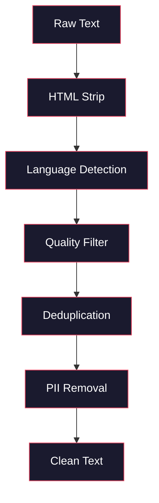
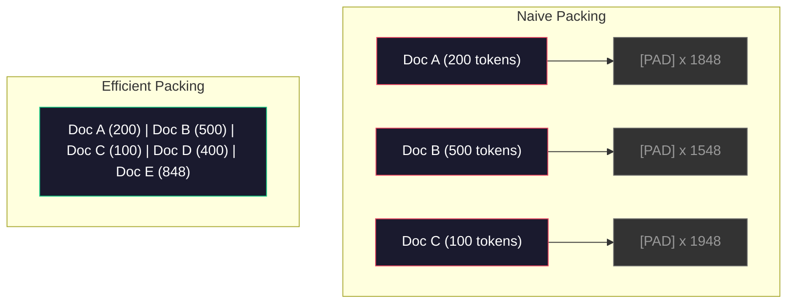

# Pipelines de dados para Pre-Training

> O modelo é um espelho, reflete os dados que lhe fornecer, alimenta-o de lixo, reflete lixo com fluência perfeita.

> **【中文解读】**O modelo é um espelho, que reflete fielmente os dados que lhe são dados.

> **【拓展：数据质量→GPT-4/Claude】**GPT-4 e Claude de alta qualidade de saída provêm de um fluxo de dados de design preciso. Os dados de treinamento prévio de Llama 3 contêm 15T token, através de rigor de peso e qualidade.

**Type:** Build
**Languages:** Python
**Prerequisites:** Phase 10, Lessons 01-02 (Tokenizers, Building a Tokenizer)
**Time:** ~90 minutes

## Objetivos de aprendizagem

- Construir um pipeline de dados de streaming que tokenize, pedaços, misturas e lotes de terabytes de texto sem carregar tudo na memória
  Construir fluxo de dados de tubos, implementar divisão de palavras, divisão de blocos, desordem e processamento em massa em textos de nível TB, sem necessidade de todo carregado na memória
- Implementar filtros de qualidade de dados (desduplicação, detecção de linguagem, filtragem de conteúdo) utilizados em canais reais de pré-formação
  实现真实预训管线中使用的数据质量过器(去重、语言检测、内容过)
- Criar sequências de treinamento de comprimento fixo com máscaras de atenção adequadas e manuseio de limites de documentos
  Criação de um curso de treinamento de duração fixa com um cache de atenção correta e processamento de limites de arquivos
- Perfil de tráfego de tubo para garantir o carregador de dados mantém-se com a velocidade de treinamento da GPU
  Analisar a tração de tubos, garantir a velocidade de carregamento de dados com a velocidade de treinamento da GPU

> **【中文解读】**Este curso concentra-se em um processo de formação de dados que irá determinar a qualidade do LLM. Você vai construir um fluxo de dados que irá ser re-implementado em dados de nível TB. MinH+LSH) √ Qualidade √√ √ √ √ √ √ √ √ √ √ √ √ √ √ √ √ √ √ √ √ √ √ √ √ √ √ √ √ √ √ √ √ √ √ √ √ √ √ √ √ √ √ √ √ √ √ √ √ √ √ √ √ √ √ √ √ √ √ √ √ √ √ √ √ √ √ √ √ √ √ √ √ √ √ √ √ √ √ √ √ √ √ √ √ √ √ √ √ √ √ √ √ √ √ √ √ √ √ √ √ √ √ √ √ √ √ √ √ √ √ √ √ √ √ √ √ √ √ √ √ √ √ √ √ √ √ √ √ √ √ √ √ √ √ √ √ √ √ √ √ √ √ √ √ √ √ √ √ √ √ √ √ √ √ √ √ √ √ √ √ √ √ √ √ √ √ √ √ √ √ √ √ √ √ √ √ √ √ √ √ √ √ √ √ √ √ √ √ √ √ √ √ √ √ √ √ √ √ √ √ √ √ √ √ √ √ √ √ √ √ √ √ √ √ √ √ √ √ √ √ √ √ √ √ √ √ √ √

## O problema é o problema da introdução

Tens um tokenizer, agora precisas de dados.

> Agora precisas de dados.

Não é um conjunto de dados, não é um arquivo CSV. Terabytes de texto - limpos, deduplicados, filtrados para qualidade, tokenizados em sequências de comprimento fixo e servidos em lotes aleatórios suficientemente rápidos para que o seu cluster de 8 GPU nunca espere pelo próximo lote.

> Não é um conjunto de dados, não é um CSV. Número de TBs de textos que passaram por uma limpeza, deposição, qualidade, transmissão, parâmetros para sequências de tamanho fixo, e que, em batatas de cada vez, fornecem serviços, velocidade rápida para o seu grupo de 8 GPU nunca esperará para o próximo conjunto de dados.

A maioria das pessoas pensa que a formação de um LLM é sobre a arquitetura do modelo. Não é. Llama 3 usou 15,6 trilhões de tokens. GPT-3 usou 300 bilhões. DeepSeek-V2 usou 8,1 trilhões. A arquitetura em todos os três é aproximadamente a mesma: blocos de transformador empilhados com camadas de atenção e feedforward. A diferença na qualidade de saída vem em grande parte dos dados.

> A maioria dos usuários considera que o LLM é sobre a estrutura do modelo. Não é o caso. A Llama 3 utilizou 15,6 milhões de tokens. A GPT-3 utilizou 3000 milhões. A DeepSeek-V2 utilizou 8,1 milhões. A estrutura dos três é quase a mesma: blocos de transformadores empilhados, contendo atenção e camadas anteriores. A grande maioria dos resultados são de dados.

O artigo do Chinchilla da DeepMind fez isso precisamente. Para um determinado orçamento de computação, existe uma relação ótima entre os parâmetros do modelo e os tokens de formação. Chinchilla mostrou que a maioria dos modelos em 2022 estavam dramaticamente subtraídos - tinham muitos parâmetros para a quantidade de dados que viavam. Um modelo de parâmetro 70B treinado em 1,4 trilhão de tokens (Chinchilla-óptimo) superou um modelo 280B treinado em 300 bilhões de tokens (Gopher).

> O artigo Chinchilla do DeepMind explica isso com precisão. Em relação a um determinado orçamento de cálculo, há uma melhor proporção entre os parâmetros do modelo e os tokens de treinamento. Chinchilla mostra que a maioria dos modelos de 2022 são muito deficientes em treinamento.

A sua linha de dados determina se o seu modelo aprende a língua ou o ruído.

> A sua linha de dados determina se o seu modelo de aprendizado é linguagem ou ruído.

> **【中文解读】**Chinchilla 论文(DeepMind 2022) prova: em orçamento fixo de cálculo, o modelo parametriz e token de treinamento num número deveria ser igual proporção expandido。 70B modelo de Llama 3 em tokens 15.6T 上训远超Chinchilla 最优比例, mas Meta descobriu que esse modelo de "excesso de treinamento" produzido costumava considerar mais baixo。 A qualidade do tubo de dados determinou se o modelo estava aprendendo linguagem ou ruído。

> **【拓展：数据混合比的工程经验】**Llama 3 Publices dados compartilham: cerca de 50% 网页数据、25% 代码、13% 书籍和论文、8% 数学、4% 多语言网页──GPT-4 训练数据据说包含大量代码(提升推理能力) 和学术文献(提升事实准确性)──比例没有公式可循,完全依赖于实验和评估──

> - Não .**【前置】**学本节前 請先掌握:(1) Fase 10·01 和 02(分词器) 理解令和字节流;(2) Fase 10·01 提到的Chinchilla 规模法理解参数与令数的最佳比例;(3) Python 生成器 / `IterableDataset`- Não .`datasets.stream`流式处理范式;(4) MinHash + LSH 近似去重算法(不熟请先看Llama 3 / RefinedWeb 论文的相关章节)

## O conceito central.

### De onde vêm os dados

Cada grande modelo de linguagem é treinado com base em uma mistura de fontes. A composição exata é um segredo bem guardado para a maioria dos laboratórios, mas sabemos o suficiente para entender as categorias.

> Todos os grandes modelos de linguagem são treinados em fontes de dados misturadas. A maioria dos laboratórios tem um certo segredo de composição, mas sabemos o suficiente para entender as categorias.

| Source | Size | Quality | Used By |
|--------|------|---------|---------|
| Common Crawl | ~250 TB raw | Low (needs heavy filtering) | GPT-3, Llama, most open models |
| Wikipedia | ~20 GB | High | Every major LLM |
| GitHub code | ~1 TB+ | Medium (lots of duplicates, dead code) | StarCoder, CodeLlama, DeepSeek-Coder |
| Books (BookCorpus, Pile) | ~100 GB | High | GPT-2, GPT-3, early models |
| Academic papers (arXiv, S2ORC) | ~100 GB | High for STEM | Llama, Galactica |
| StackOverflow, Reddit | ~100 GB | Medium | Llama, Falcon |
| Curated web (C4, RefinedWeb) | ~5 TB | Medium-High (pre-filtered) | T5, Falcon |

Llama 3 divulgou sua mistura de dados: cerca de 50% de dados da web, 25% de código, 13% de livros e artigos acadêmicos, 8% de dados matemáticos e 4% de dados da web multilíngue.

> Llama 3 divulgou sua parcela de dados: cerca de 50% de dados da página web, 25% de código, 13% de livros e artigos acadêmicos, 8% de dados matemáticos e 4% de dados da página web multilingüe.

A relação importa tanto quanto o tamanho total. Demasiados dados da web e o modelo torna-se um papagaio Reddit. Demasiado pouco código e não pode programar. Demasiado pouco matemática e falha no raciocínio.

> Por exemplo, é igual a tamanho geral. O modelo se torna muito grande, o código se torna muito pequeno, não se programa.

### Limpeza de dados

Os dados da web são sujos.

> Uma típica navegação comum 转储包含:

- Tags HTML e JavaScript
  Tradução do idioma: HTML 标签和 JavaScript
- Cabeças, calçados, menus de navegação
  Chinese: 模板页眉、页脚、导航菜单
- Páginas duplicadas (exactas e quase duplicadas)
  Tradução do inglês: [default]
- Spam gerado por máquina
  Tradução do inglês para Inglês: Machine generated junk content
- Informações de identificação pessoal (PII)
  Tradução do português: pessoal身份信息 (PII)
- Texto de baixa qualidade (listas de palavras-chave, spam de SEO)
  Tradução do inglês: Low质量文本 (→ "Legenda de dados")
- Conteúdo não-textual codificado como texto
  Tradução do inglês:编码为文本的非文本内容

Limpagem não é opcional. É a diferença entre um modelo que gera parágrafos coerentes e um que sai tags HTML misturados com listas de produtos.

> Limpeza não é opcional. É a diferença entre o modelo de gerar segmentos continuos e o modelo de fazer uma lista de produtos.

> - Não .**【类比】**O problema é que o sistema de controle de água é um sistema de controle de água que pode ser usado para controlar a água. O sistema de controle de água é um sistema de controle de água que pode ser usado para controlar a água.



Cada passo elimina uma categoria de ruído:

> Cada passo para eliminar um tipo de ruído:

**HTML stripping:**Remover todas as marcas. Mantenha apenas o conteúdo visível do texto.`trafilatura`ou `readability`extrair o conteúdo do artigo enquanto descartamos navegação, anúncios e placa de caldeira.

> **HTML 剥离：**移除所有标记──只保留可见文本内容── remover todos os marcadores.`trafilatura`Ou `readability`É um dos principais pontos de interesse da indústria.

**Language detection:**Use o modelo de identificação de idioma do fastText (lid.176.bin) para classificar cada documento. Filtre para os idiomas alvo. Um documento classificado como inglês com menos de 0,8 confiança provavelmente não é inglês limpo.

> **语言检测：**Utilize fastText's language identification model (FASTTEXT's language identification model) (lid.176.bin) para cada artigo no arquivo.

**Quality filtering:**É aqui que fica interessante. RefinedWeb (o conjunto de dados por trás do Falcon) usa um filtro baseado em perplexidade: treinar um pequeno modelo de linguagem na Wikipedia, em seguida, marcar cada documento. Alta perplexidade significa que o documento é diferente da Wikipedia - provavelmente spam, listas de palavras-chave ou conteúdo gerado por máquina. Documentos com perplexidade acima de um limiar são removidos.

> **质量过滤：**É uma parte interessante. RefinedWeb (Falcon 背后的数据集) usa filtro baseado em confusão: treinar um pequeno modelo de linguagem na Wikipedia, depois avaliar cada artigo.

**Deduplication:**O único passo de limpeza mais impactante. O Common Crawl contém um enorme número de páginas duplicadas - disclaims legais, avisos de cookie, termos de serviço. O treinamento em duplicados desperdiça o cálculo e pode fazer com que o modelo memorize e regurgite passagens específicas literalmente.

> **去重：**影响最大的清洗步骤──Common Crawl 包含大量重复页面法律声明、cookie 通知、服务条款──在重复数据上训练浪费算力,也可能导致模型逐字记忆和复述特定段落──

**PII removal:**Nomes, endereços de e-mail, números de telefone, números de segurança social. Detecção baseada em Regex para PII estruturada, modelos NER para nomes no contexto.

> **PII 移除：**Nome, endereço de e-mail, número de telefone, número de segurança social, PII estruturada, usando o sistema de verificação, nome em cima do texto, NER modelo,

> **【中文解读】**O tratamento de dados é o mais importante e mais importante do treinamento previo. O tratamento de dados de páginas web é um processo de análise de dados de dados de dados de dados de dados de dados de dados de dados de dados de dados de dados de dados de dados de dados de dados de dados de dados de dados de dados de dados de dados de dados de dados de dados de dados de dados de dados de dados de dados de dados de dados de dados de dados de dados de dados de dados de dados de dados de dados de dados de dados de dados de dados de dados de dados de dados de dados de dados de dados de dados de dados de dados de dados de dados de dados de dados de dados de dados de dados de dados de dados de dados de dados de dados de dados de dados de dados de dados de dados de dados de dados de dados de dados de dados de dados de dados de dados de dados de dados de dados de dados de dados de dados de dados de dados de dados de dados de dados de dados de dados de dados de dados de dados de dados de dados de dados de dados de dados de dados de dados de dados de dados de dados de dados de dados de dados de dados de dados de dados de dados de dados de dados de dados de dados de dados de dados de dados de dados de dados de dados de dados de dados de dados de dados de dados de dados de dados de dados de dados de dados de dados de dados de dados de dados de dados de dados de dados de dados de dados de dados de dados de dados de dados de dados de dados de dados de dados de dados de dados de dados de dados de dados de dados de dados de dados de dados de dados de dados de dados de dados de dados de dados de dados de dados de dados de dados de dados de dados de dados de dados de dados de dados de dados de dados de dados de dados de dados de dados de dados de dados de dados de dados de dados de dados de dados de dados de dados de dados de dados de dados de dados de dados de dados de dados de dados de dados de dados de dados de dados de dados de dados de dados de dados de dados de dados de dados de dados de dados de dados de dados de dados de dados de dados de dados de dados de dados de dados de dados de dados de dados de dados de dados de dados de dados de dados de dados de dados de dados de dados de dados de dados de dados de dados de dados de dados de dados de dados de dados de dados de dados

> **【拓展：去重的工程影响】**O relatório da Llama  equipe, através da re-migração, removeu cerca de 38% dos dados das páginas da web. Mais de um terço das páginas do Common Crawl são repetidas ou quase repetidas. Treinamento em dados repetidos não só desperdiça capacidade de cálculo, mas também leva ao modelo por memória específica, aumentando o risco de vazamento de privacidade.

> ️ **【易错点】**Quatro cavernas comuns:**整库加载进内存**`datasets.load_dataset("common_crawl", split="train")`默认会实例化                                                                                                                                                                                                                                                                                                                                                                                                                                                                                                                       `streaming=True`Ou `IterableDataset`;(2) **去重时把"高密度优质内容"误删**文档 A 包含整篇 Wikipedia(5KB),文档 B 是只引用一句话的博客(500 字),MinHash 误判为高相似度──修复:在围 之前对每篇文档归归一化长度,或对小文档用更保守的值;(3) 文档 B 是只引用一句话的博客(500 字),MinHash 误判为高相似度──修复:在围 之前对每篇文档归一化长度,或对小文档用更保守的值;**打包（pack）跨文档 attention 漏 mask**O que é que é o "FlashAttention" ?`varlen`接口或 block-diagonal attention mask;(4) **配比（mix）在 epoch 间漂移**misturado 时按"文档级"而不是"token 级"采样,结果小文档被过度采样、大文档欠采样──

### Deduplicação com MinHash

A deduplicação exata é fácil: hash cada documento, remover duplicados. Mas duplicados quase são o verdadeiro problema. Duas cópias do mesmo artigo de notícias com anúncios ligeiramente diferentes ao seu redor são duplicados quase. O conteúdo é 95% idêntico, mas eles diferem em byte-for-byte.

> 精确去重很简单: para cada artigo 哈希,移除重复──但近似重复才是真正的问题──但近似重复才是真正的问题──但近似重复才是真正的问题──但近似重复才是真正的问题──但近似重复是不同的,但近似重复是不同的.

O MinHash + Hashing sensível à localidade (LSH) resolve isso de forma eficiente.

> MinHash + 局部敏感哈希(LSH) 高效地 resolveram esse problema.


A ideia:

> 核心思想:

1. **Shingling:**Converter cada documento em um conjunto de n-gramas (por exemplo, 5 gramas de palavras ou caracteres). "a rapidez rufo marrom" com 3 palavras de barbatana torna-se {"a rapidez rufo marrom", "a rapidez rufo marrom"}.
   Tradução:**Shingling：**将每篇文档转换为一组 n-gram 集合(如 5词或 5字符的 n-gram) ・・・"a rapida raposa" 用 3词 shingle 变为 {"a rapida raposa", "rapida raposa"}。

2. **MinHash:**Para cada conjunto de barandas de documento, calcule k valores de hash. Cada valor de hash é o hash mínimo em todos os barandas sob uma função de hash diferente. Isso cria uma "assinatura" de tamanho fixo que se aproxima da semelhança de Jaccard entre dois documentos.
   Tradução:**MinHash：**Para cada arquivo de baranda 集合计算 k 个哈希值──每个哈希值是所有的 baranda 在不同哈希函数下最小哈希──, isto cria uma "firma" de tamanho fixo, quase semelhante a qualquer dos dois arquivos Jaccard similaridade──

3. **LSH:**Grupar documentos em baldes com base em bandas de sua assinatura MinHash. Documentos no mesmo balde são candidatos quase duplicados. Isso evita comparar cada par - você apenas compara candidatos.
   Tradução:**LSH：**De acordo com MinHash  assinatura 条带将文档分组到桶中──文档在同一桶中的文档是候选人近似重复──这避免了两两比较只比较候选人对──

4. **Verify:**Para cada par candidato, calcule a semelhança exata de Jaccard. Retire uma cópia se a semelhança exceder um limiar (normalmente 0,8).
   Tradução:**验证：**Para cada candidato, calcular a similaridade de Jaccard. Se a similaridade exceder o valor, normalmente 0,8, remove uma dupla.

A equipe de Llama relatou ter removido aproximadamente 38% de seus dados da web através da deduplicação.

> O relatório de Llama 团队 foi re-emigrado em cerca de 38% dos dados da página da web. Não é um pequeno número.

### Embalagem de sequência

O seu modelo espera sequências de entrada de comprimento fixo. Os seus documentos são de comprimento variável. Alguns são de 50 tokens.

> Seu modelo espera fixar a sequência de entrada de duração.

Abordagem ingênua: encher cada documento com o comprimento máximo da sequência. Isto desperdiça enormes cálculos em tokens de enchimento que não contribuem para a aprendizagem.

> Método simples: preencher cada documento até a maior sequência de tamanho. Isto desperdiça grande quantidade de energia em contribuição para o zero de preenchimento do token.

Melhor abordagem: empacotar vários documentos em uma única sequência, separados por tokens de fim de sequência. Uma sequência de 2048 tokens pode conter três documentos curtos concatenados com tokens [EOS] entre eles.

> Melhor método:将多篇文档打包到单个序列中, use序列结束符号 分隔──一 2048 token 的序列可能包含三篇短文档,中间使用 [EOS] token 连接──

> 🤔 **【困惑】**P: 既然 a embalagem está contaminada, por que não é que não se usa padding? 多浪费点算力换正确性不是更稳定吗? A: 因为预训算力极高昂Llama 3 训练成本估计10亿美元.`cu_seqlens`O que é um "index" (ou "index") de uma única forma, mas pode eliminar completamente a contaminação.



A máscara de atenção deve ser definida corretamente. Tokens do documento A não devem atender a tokens do documento B dentro da mesma sequência de embalagem. Isso requer uma máscara de atenção de diagonal de bloco.

> Nota: O símbolo do arquivo A não deve ser observado no mesmo arquivo B.

Documentos longos são truncados ou divididos em pedaços nos limites da sequência. O ponto de divisão importa: dividir no meio da frase obriga o modelo a ver pensamentos incompletos.

> 长文档在序列边界处被切断或分分成块──分分点很重要:在句子中分迫使模型看到不完整的思想──一些管线在可能时将分点对齐到段落或句子边界──

> **【中文解读】**序列打包(Sequence Packing) é uma técnica de preenchimento de documentos de longo prazo. O método é simples de preencher documentos de longo prazo com um pad padrão de treinamento.

> **【拓展：Chinchilla 定律与过度训练】**Chinchilla 定律 considera que o modelo paramétricos e de treinamento token números de espera e comparação crescem. Mas o modelo 70B de Llama 3 é de 15T tokens, mas é "superior a melhor" estratégia: o custo de treinamento de muitos projetos é único, mas o custo de serviços de modelos menores é permanentemente reduzido. Este excesso de treinamento se tornou padrão do setor desde 2024.

### A Lei de Escala de Chinchilla

Para um orçamento de cálculo fixo C (medido em FLOPs), o tamanho óptimo do modelo N e do conjunto de dados D são os seguintes:

>  Para um orçamento de cálculo fixo C                                                                                                                                                                                                                                                          

```
N_opt ~ C^0.5
D_opt ~ C^0.5
```

Na prática, isso significa que você deve escalar o tamanho do modelo e o tamanho do conjunto de dados aproximadamente igualmente. Um modelo com 10x mais parâmetros precisa de aproximadamente 10x mais tokens de treinamento para alcançar a mesma perda.

> Na prática, isso significa que você deve ampliar o modelo de tamanho e tamanho dos conjuntos de dados em proporção igual.

| Model | Parameters | Training Tokens | Chinchilla-Optimal? |
|-------|-----------|----------------|-------------------|
| GPT-3 | 175B | 300B | No (undertrained 3-4x) |
| Chinchilla | 70B | 1.4T | Yes (by design) |
| Llama 2 | 70B | 2T | Overtrained (intentionally) |
| Llama 3 | 70B | 15T | Heavily overtrained |

Llama 3 viola deliberadamente a lei Chinchilla. Meta descobriu que o treinamento excessivo em mais dados - muito além da relação computação-ótima - produz melhores modelos para inferência. O custo extra de treinamento é pago uma vez, mas o modelo menor é mais barato para servir para sempre. Isso às vezes é chamado de abordagem de escalação "inferência-ótima", e tornou-se o padrão da indústria desde 2024.

> Llama 3 deliberadamente violar a lei Chinchilla. Meta descobriu que usar mais dados para exagerar o excesso de treinamento pode produzir melhores modelos para o efeito de treinamento.

## Construí-lo e realizei-o.
```figure
l5-data-pipeline
```

## Construí-lo

### Passo 1: Limpeza do texto

Desprimir HTML, normalizar o espaço branco, remover conteúdo não-textual. Usaremos um texto de domínio público (Projeto Gutenberg) como nosso pequeno corpus.

> 剥离 HTML、归一化空白、移除文本内容──我们将使用公共领域文本 (古堡计划) como um pequeno idioma──

```python
import re

def clean_text(text):
    text = re.sub(r"<[^>]+>", "", text)
    text = re.sub(r"http\S+", "", text)
    text = re.sub(r"[^\x20-\x7E\n]", "", text)
    text = re.sub(r"\n{3,}", "\n\n", text)
    text = re.sub(r" {2,}", " ", text)
    return text.strip()

def quality_filter(text, min_words=50, max_ratio_caps=0.3, max_ratio_special=0.1):
    words = text.split()
    if len(words) < min_words:
        return False
    caps_ratio = sum(1 for w in words if w.isupper()) / len(words)
    if caps_ratio > max_ratio_caps:
        return False
    special_chars = sum(1 for c in text if not c.isalnum() and not c.isspace())
    if special_chars / max(len(text), 1) > max_ratio_special:
        return False
    return True
```

O filtro de qualidade capta spam de SEO (Todos os CAPS), ruído gerado por máquina (alta proporção de caracteres especiais) e páginas de estúdio (muito curtas).

> 质量过器捕获 SEO 垃圾(全大写) 机器生成的噪音(高特殊字符比例) 和存根页面(太短) . Apenas estes três controles podem remover uma grande quantidade de lixo da página de crawling .

### Passo 2: Desduplicação de MinHash

Implementar o MinHash do zero. Não é necessária biblioteca externa.`hashlib`- Não .

> Desde o zero de implementação MinHash. Não é necessário.`hashlib`- Não.

```python
import hashlib
from collections import defaultdict

def get_shingles(text, k=5):
    words = text.lower().split()
    if len(words) < k:
        return set()
    return {" ".join(words[i:i+k]) for i in range(len(words) - k + 1)}

def minhash_signature(shingles, num_hashes=128):
    signature = []
    for i in range(num_hashes):
        min_hash = float("inf")
        for shingle in shingles:
            h = int(hashlib.sha256(f"{i}:{shingle}".encode()).hexdigest(), 16)
            min_hash = min(min_hash, h)
        signature.append(min_hash)
    return signature

def lsh_buckets(signature, bands=16):
    rows_per_band = len(signature) // bands
    buckets = []
    for b in range(bands):
        start = b * rows_per_band
        band_data = tuple(signature[start:start + rows_per_band])
        bucket_hash = hashlib.md5(str(band_data).encode()).hexdigest()
        buckets.append((b, bucket_hash))
    return buckets

def deduplicate(documents, threshold=0.8, num_hashes=128, bands=16):
    signatures = []
    shingle_sets = []
    for doc in documents:
        shingles = get_shingles(doc)
        shingle_sets.append(shingles)
        signatures.append(minhash_signature(shingles, num_hashes))

    bucket_map = defaultdict(list)
    for doc_idx, sig in enumerate(signatures):
        for band_id, bucket_hash in lsh_buckets(sig, bands):
            bucket_map[(band_id, bucket_hash)].append(doc_idx)

    duplicate_pairs = set()
    for bucket_docs in bucket_map.values():
        if len(bucket_docs) < 2:
            continue
        for i in range(len(bucket_docs)):
            for j in range(i + 1, len(bucket_docs)):
                duplicate_pairs.add((bucket_docs[i], bucket_docs[j]))

    removed = set()
    for i, j in duplicate_pairs:
        if i in removed or j in removed:
            continue
        s1, s2 = shingle_sets[i], shingle_sets[j]
        if not s1 or not s2:
            continue
        jaccard = len(s1 & s2) / len(s1 | s2)
        if jaccard >= threshold:
            removed.add(j)

    return [doc for idx, doc in enumerate(documents) if idx not in removed], len(removed)
```

O `num_hashes=128`E ...`bands=16`Os parâmetros controlam a compensação de recall de precisão. Mais hashes dão estimativas de semelhança mais precisas. Mais bandas aumentam a recall (capturam mais duplicados) ao custo de mais falsos positivos. Estes valores funcionam bem para texto web típico.

> `num_hashes=128`和 `bands=16`参数控制精度-召回率权衡──更多哈希值给出更准确的相似度估计──更多条带增加召回率──捕获更多重复),代价是更多误报──这些值对典型网页文本效果良好──

### Passo 3: Tokenize e empacotar sequências

Pegue o texto limpo, deduplicado, tokenize-o e enrole em sequências de duração fixa para treinamento.

> 取清洗、去重后的文本,分词,打包为固定长度序列用于训练──

```python
def tokenize_corpus(documents, tokenizer):
    all_tokens = []
    for doc in documents:
        tokens = tokenizer.encode(doc)
        all_tokens.extend(tokens)
        all_tokens.append(tokenizer.eos_id)
    return all_tokens

def pack_sequences(token_ids, seq_length, pad_id=0):
    sequences = []
    attention_masks = []
    for i in range(0, len(token_ids), seq_length):
        seq = token_ids[i:i + seq_length]
        mask = [1] * len(seq)
        if len(seq) < seq_length:
            pad_count = seq_length - len(seq)
            seq = seq + [pad_id] * pad_count
            mask = mask + [0] * pad_count
        sequences.append(seq)
        attention_masks.append(mask)
    return sequences, attention_masks
```

### Passo 4: DataLoader para formação

E dá lotes aleatórios de sequências embaladas.

> O processo de produção de produtos de consumo é o ciclo de produção de produtos de consumo.

```python
import random

class PreTrainingDataLoader:
    def __init__(self, sequences, attention_masks, batch_size, shuffle=True):
        self.sequences = sequences
        self.attention_masks = attention_masks
        self.batch_size = batch_size
        self.shuffle = shuffle

    def __len__(self):
        return (len(self.sequences) + self.batch_size - 1) // self.batch_size

    def __iter__(self):
        indices = list(range(len(self.sequences)))
        if self.shuffle:
            random.shuffle(indices)
        for start in range(0, len(indices), self.batch_size):
            batch_idx = indices[start:start + self.batch_size]
            batch_seqs = [self.sequences[i] for i in batch_idx]
            batch_masks = [self.attention_masks[i] for i in batch_idx]
            yield batch_seqs, batch_masks
```

### Passo 5: Estatísticas de conjuntos de dados

Calcule os números que importam: total de tokens, tokens únicos, relação de compressão, distribuição de comprimento do documento.

> 計算关键指标: 总代码 数、唯一代码 数、压缩比、文档长度分布──

```python
from collections import Counter

def compute_statistics(documents, token_ids, sequences, tokenizer_vocab_size):
    total_chars = sum(len(d) for d in documents)
    total_tokens = len(token_ids)
    unique_tokens = len(set(token_ids))
    compression_ratio = total_chars / total_tokens

    doc_lengths = [len(d.split()) for d in documents]
    avg_doc_length = sum(doc_lengths) / max(len(doc_lengths), 1)
    max_doc_length = max(doc_lengths) if doc_lengths else 0
    min_doc_length = min(doc_lengths) if doc_lengths else 0

    token_counts = Counter(token_ids)
    top_tokens = token_counts.most_common(10)

    non_pad_tokens = sum(sum(1 for t in seq if t != 0) for seq in sequences)
    total_positions = sum(len(seq) for seq in sequences)
    utilization = non_pad_tokens / max(total_positions, 1)

    stats = {
        "total_documents": len(documents),
        "total_characters": total_chars,
        "total_tokens": total_tokens,
        "unique_tokens": unique_tokens,
        "vocab_utilization": unique_tokens / tokenizer_vocab_size,
        "compression_ratio": compression_ratio,
        "avg_doc_length_words": avg_doc_length,
        "max_doc_length_words": max_doc_length,
        "min_doc_length_words": min_doc_length,
        "num_sequences": len(sequences),
        "sequence_utilization": utilization,
        "top_10_tokens": top_tokens,
    }
    return stats
```

A relação de compressão diz-lhe quão eficiente é o tokenizer neste corpus. O texto inglês normalmente comprime para cerca de 3-4 caracteres por token. Se você vê 1,5 caracteres por token, seu tokenizer está se dividindo muito agressivamente. Se você vê 8+, ele aprendeu fusões muito específicas de domínio.

> 压缩比告诉你分词器在此语料上的效率──英文文本通常缩写到每个代币约3-4字符──如果你看每个代币1.5字符,说明分词器分分离过激进──如果你看8+,说明它学到了非常特定领域的合并──

A utilização de sequências diz-lhe quanto das suas sequências embaladas são dados reais versus padding. abaixo de 90% significa que a sua embalagem é ineficiente - você está desperdiçando computação em tokens de padding.

> A taxa de utilização da sequência diz-lhe que a quantidade de sequências de encomendas é real versus de enchimento.

## Use-o com o framework implementado.

### Comparar com os conjuntos de dados HuggingFace

Carregue o mesmo corpus através da biblioteca de conjuntos de dados do HuggingFace e compare a velocidade do pipeline.

> 通过 HuggingFace的数据集 库加载相同语料并比较管线速度──

```python
from datasets import load_dataset
from transformers import AutoTokenizer

ds = load_dataset("wikitext", "wikitext-2-raw-v1", split="train")
tokenizer = AutoTokenizer.from_pretrained("meta-llama/Meta-Llama-3-8B")

import time

start = time.time()
tokenized = ds.map(
    lambda x: tokenizer(x["text"], truncation=True, max_length=2048),
    batched=True,
    num_proc=4,
)
hf_time = time.time() - start
total_tokens = sum(len(t) for t in tokenized["input_ids"])
print(f"HuggingFace: {total_tokens:,} tokens in {hf_time:.2f}s ({total_tokens/hf_time:,.0f} tokens/sec)")
```

O pipeline HuggingFace usa tokenizers de Rust sob o capô e processamento paralelo em 4 núcleos. Seu pipeline Python puro será 10-50 vezes mais lento. Essa lacuna é por que as equipes de produção usam tokenizers compilados. O algoritmo é o mesmo. A linguagem de implementação é a diferença.

> HuggingFace 管线底层使用 Rust 分词器和 4 核并行处理。你的纯字thon 管线会慢10-50倍──这就是为什么生产团队使用编译分词器──算法相同──实现语言是区别──

## Envia-o . Produto .

Esta lição produz um prompt para validar e depurar a qualidade dos dados em canais de formação LLM.`outputs/prompt-data-quality-checker.md`- Não .

> Este curso é utilizado para a verificação e a regulação de Mestrado em Direito Jurídico  Training Pipeline Data Quality prompt──`outputs/prompt-data-quality-checker.md`- Não.

## Exercícios.

1. **Easy:**Adicionar detecção de linguagem ao pipeline de limpeza usando uma simples heurística (análise de conjuntos de caracteres).
2. **Medium:**Implementar a deduplicação exata usando hashes SHA-256 ao lado da deduplicação próxima de MinHash. Compare o número de duplicados capturados por cada método em um corpus raspado na web.
3. **Hard:**Construa um filtro de qualidade baseado em perplexidade. Treine um pequeno modelo de linguagem de bigram no texto da Wikipédia, ponta cada documento por perplexidade e remova o 20% inferior.

## Termos-chave .

| Term | What people say | What it actually means | 中文释义 |
|------|----------------|----------------------|---------|
| Common Crawl | "The internet" | A non-profit that crawls the web monthly -- ~250TB raw, the starting point for most LLM training data | 通用爬虫，LLM 训练数据的起点 |
| MinHash | "Some hashing trick" | A technique to estimate Jaccard similarity between sets using fixed-size signatures -- enables near-duplicate detection at scale | 最小哈希，近似重复检测的核心技术 |
| LSH | "Locality-Sensitive Hashing" | A method to group similar items into the same bucket -- reduces pairwise comparisons from O(n^2) to near-linear | 局部敏感哈希，将 O(n^2) 降为近似线性 |
| Sequence packing | "Concatenating documents" | Fitting multiple documents into fixed-length sequences with proper attention masks -- eliminates padding waste | 序列打包，消除填充浪费 |
| Chinchilla scaling | "Train on more data" | For a fixed compute budget, optimal performance requires scaling model size and training tokens roughly equally | Chinchilla 缩放定律，参数和数据应等比增长 |
| Fertility | "Tokens per word" | Average number of tokens per word -- 1.3 for English in GPT-4, higher for non-Latin scripts | 生育率，每词 token 数 |
| Data mixing | "Choosing training data" | The ratio of code vs text vs math vs multilingual data -- no formula, requires experimentation | 数据混合比，需实验确定 |
| Perplexity filter | "Quality scoring" | Use a small language model to score documents -- high perplexity means the text is unlike clean reference data | 困惑度过滤，低质量文档评分高 |
| Deduplication | "Removing copies" | Eliminating exact and near-duplicate documents -- typically removes 30-40% of raw web data | 去重，通常移除 30-40% 网页数据 |
| Attention mask | "Which tokens to look at" | A binary mask that prevents attention across document boundaries in packed sequences | 注意力掩码，阻止跨文档注意力 |

## Mais leitura 延伸阅读

- [Hoffmann et al., 2022 -- Training Compute-Optimal Large Language Models (Chinchilla)](https://arxiv.org/abs/2203.15556)- o artigo que mudou a nossa forma de pensar sobre a escala de dados
- [Penedo et al., 2023 -- The RefinedWeb Dataset for Falcon LLM](https://arxiv.org/abs/2306.01116)-- como filtrar o Common Crawl para alta qualidade
- [Touvron et al., 2023 -- Llama 2: Open Foundation and Fine-Tuned Chat Models](https://arxiv.org/abs/2307.09288)-- Detalhes do pipeline de dados para Llama 2
- [Lee et al., 2022 -- Deduplicating Training Data Makes Language Models Better](https://arxiv.org/abs/2107.06499)- porque a deduplicação é mais importante do que pensas
- [Broder, 1997 -- On the Resemblance and Containment of Documents](https://ieeexplore.ieee.org/document/666900)- O papel original da MinHash
- [Meta, 2024 -- Llama 3 Technical Report](https://arxiv.org/abs/2407.21783)-- Tokens 15,6T, índices de mistura de dados, filtragem de canalização
