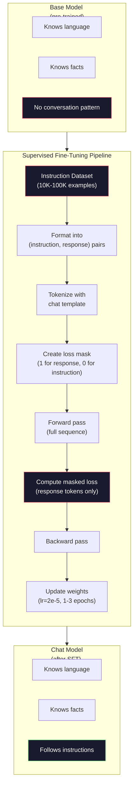

# Ação de instrução (SFT) ✓

> Um modelo base prevê o próximo token. É isso. Não segue instruções, responde perguntas ou recusa pedidos prejudiciais. SFT é a ponte entre um preditor de token e um assistente útil. Todos os modelos com quem já conversaram - Claude, GPT, Llama Chat - passaram por este passo.

> **【中文解读】**O modelo base só prevê o próximo token. Não segue instruções, responde a questões ou rejeita solicitações prejudiciais.

> **【拓展：SFT→ChatGPT】**O programa de treinamento do ChatGPT é o principal passo para transformar o modelo básico em um assistente de diálogo.

> - Não .**【前置】**學本節前 請先掌握:Fase 10·04 ((Pre-Training Mini GPT) 理解预训如何得到基础模型;Fase 11·08 ((LoRA) 理解微调的具体技术(本节是全参微调,LoRA是其轻量版);PyTorch 训练循环基础(loss、optimizer、backward)

**Type:** Build
**Languages:** Python (with numpy)
**Prerequisites:** Phase 10, Lesson 04 (Pre-Training a Mini GPT)
**Time:** ~90 minutes

> - Não .**【类比】**SFT = 给"博学学"上课──预训让会说所有人话(语言能力),但不会对话(你说"你好",它说"今天天气不错"纯统计接龙)──SFT utiliza 10.000 para "问答" demonstração para ensiná-lo "问你好应该答你好"从统计变成会谈──

> ️ **【易错点】**3 个坑: ((1) **指令格式不统一**something样本用 `User:`- Não .`Assistant:`- Não , não .`<|user|>`- Não .`<|assistant|>`, modelo学不会统一格式;务必固定模板(como ChatML) ・・・(2) **拒绝样本不足**100.000 diálogos em apenas 50 条" rejeitar solicitações prejudiciais", modelo não rejeitará; pelo menos 5-10%  rejeitaram um modelo para cobrir vários ataques.** catastrophic forgetting**SFT dados muito estreito (全是客服对话), modelo esqueceu a capacidade de uso geral; mistura 20-30% de dados de uso geral (Alpaca、FLAN)

## Objetivos de aprendizagem

- Implementar ajustes finos supervisionados (SFT) que convertam um modelo de linguagem base em um assistente que segue instruções
  实现监督微调(SFT),将基础语言模型转换为命令跟随助手
- Formatar dados de treinamento usando modelos de bate-papo com funções de sistema, usuário e assistente, e perder a máscara em tokens não assistentes
  Utilize带 system/user/assistente 角色的聊天模板格式化训练数据,并对非助手代币 进行损失掩码
- Explicar por que é necessário a FFT: os modelos de base continuam o texto em vez de responder às perguntas
  Explicação do porquê de ser necessário SFT: modelo base é continuar o texto e não responder a problemas
- Avaliação da qualidade da SFT comparando respostas do modelo base versus modelos ajustados num conjunto de instruções prolongado
   Comparar modelos baseados com modelos de micro-modular em um conjunto de instruções para avaliar a qualidade do SFT

> **【中文解读】**O modelo básico será transformado em instrução seguindo assistente.

## O problema é o problema da introdução

Você treinou um modelo na lição 04. Ele pode prever o próximo token dado uma sequência.

> Você em quarto curso treinou um modelo. Em seguida, ele pode prever o próximo token.

Agora tente isto: alimente-o com "Qual é a capital da França?" Um modelo base não responde a "Paris". Pode produzir: "Qual é a capital da Alemanha? Qual é a capital da Espanha?" porque aprendeu com documentos que contêm listas de perguntas. Ou pode produzir "é uma pergunta que muitas pessoas fazem" porque é uma continuação plausível do próximo token. O modelo não tem conceito de *responder*. Só sabe "continuar".

> Agora tente isto:输入 "Qual é a capital da França?" 基础模型不会回答"Paris. "It will continue模式──它可能生成"What is the capital of Germany? What is the capital of Spain?" 因为它从包含问题列表的文档中学到了这种模式──或者它可能生成"é uma pergunta que muitas pessoas fazem",因为这是一个合理的下一 续写──模型没有"代号答"的概念──它只知道"续写"──

Esta é a diferença entre o GPT-3 (modelo base, lançado em junho de 2020) e o ChatGPT (instrução-ajustada, lançado em novembro de 2022). A mesma arquitetura. A mesma pré-treinamento. A diferença é de 20.000 a 100.000 pares cuidadosamente elaborados (instrução, resposta) que ensinaram o modelo a seguir o padrão de conversação.

> É o que acontece com o GPT-3 (base model, 2020), publicado em 6 de Junho) e o ChatGPT (instrução de modificação, publicado em 11 de novembro de 2022):

O Stanford Alpaca provou que não é preciso de milhões de exemplos. Em março de 2023, eles ajustaram o Llama 7B em apenas 52.000 pares de instrução-resposta gerados pelo GPT-3.5.$600. The result was a chatbot that could follow instructions, answer questions, and hold conversations. Not as good as ChatGPT, but shockingly close for $600 e algumas horas de treinamento.

> Stanford Alpaca  provar que você não precisa de milhões de amostras. Em março de 2023, eles usaram apenas 52.000 条 GPT-3.5 生成的指示-回复对微调的Llama 7B.

O Meta's Llama 2 Chat usou apenas ~ 27.000 exemplos de alta qualidade para sua fase inicial de SFT. A principal ideia: a qualidade importa mais do que a quantidade. 27.000 exemplos escritos por anotadores qualificados superam 1 milhão de exemplos barulhentos raspados da internet.

> Meta's Llama 2 Chat Inicial SFT 阶段 apenas usou cerca de 27.000 条高质量样本──核心洞察: qualidade é mais importante do que quantidade──27.000 条

> **【中文解读】**GPT-3(2020.6) e ChatGPT(2022.11) entre apenas 2 mil a 10 mil artigos de especial construção ([[Instruções,回复) ]] para o Contraste. Stanford Alpaca utilizou 52,000 artigos de GPT-3.5 para criar dados de instruções para Llama 7B, custo apenas $600.

> **【拓展：Llama 2 的 SFT 数据质量标准】**Meta publicou que os dados SFT do Llama 2 Chat foram redigidos por uma equipe de marcas especializadas, cada um deles passando por várias fases de revisão.

## O conceito central.

### O que a FFT realmente faz

O Fine-Tuning Supervisado continua o mesmo ciclo de treinamento desde o pré-treino - passagem avançada, perda de computação, passagem atrasada, pesos de atualização - mas com um tipo diferente de dados. Em vez de texto bruto, você treina em conversas estruturadas:

> 监督微调延续预训练的相同训练循环前向传播、计算损失、反向传播、更新权重但在不同类型的数据上──你用结构化对话代替原始文本进行训练:

```json
{
  "system": "You are a helpful assistant.",
  "user": "What is the capital of France?",
  "assistant": "The capital of France is Paris."
}
```

O modelo já sabe que Paris é a capital da França. Ele aprendeu isso durante o treinamento prévio na Wikipedia, livros didáticos e páginas da web. SFT não ensina o modelo novos fatos. Ele ensina o modelo um novo *comportamento*: quando você vê uma pergunta, produz uma resposta. Quando você vê uma instrução, produz uma conclusão. Quando você vê um pedido prejudicial, produz uma recusa.

> O modelo já sabe que Paris é a capital da França. Ela aprendeu isso durante o treinamento preliminar do Wikipedia, os livros didáticos e as páginas da web.

Pensem assim: o pré-treino dá o conhecimento do modelo.

> É assim que se pensa: pre-training dá conhecimento ao modelo.

> **【中文解读】**A essência do SFT é um ciclo de treinamento de treinamento de treinamento de continuação, mas os dados do texto original se transformam em diálogo estruturado. A técnica chave é a perda de cache: apenas no assistente, a parte de recuperação da calculação perde. Isso significa que o modelo aprende "como responder" e não "como continuar o texto".

### Formas de dados

Três formatos dominam a indústria. Cada um codifica a mesma informação - quem disse o que - com diferentes delimitadores.

> A indústria tem três formas principais. Cada código tem a mesma informação.

**Alpaca Format**(Stanford, março 2023):

```json
{
  "instruction": "Summarize the following article in 3 sentences.",
  "input": "The European Central Bank raised interest rates...",
  "output": "The ECB increased rates by 25 basis points..."
}
```

Simples e amplamente utilizados.`input`O campo é opcional - muitas instruções não precisam de contexto adicional. Stanford lançou 52.000 exemplos neste formato, gerados pelo GPT-3.5 por 600 dólares.

> 简单且广泛使用──`input`字段是可选的许多指令不需要额外上下文──Stanford lançou 52.000 amostras, produzidas pelo GPT-3.5, custo 600 美元── isto deu início ao movimento de instruções de código aberto para a micro-modução──

**ShareGPT Format**(Comunidade, 2023):

```json
{
  "conversations": [
    {"from": "system", "value": "You are a helpful assistant."},
    {"from": "human", "value": "What causes tides?"},
    {"from": "gpt", "value": "Tides are caused by the gravitational pull of the Moon..."},
    {"from": "human", "value": "How often do they occur?"},
    {"from": "gpt", "value": "Most coastal areas experience two high tides and two low tides per day..."}
  ]
}
```

Suporta conversas de várias voltas. O campo "de" usa "humano" e "gpt" por convenção, independentemente do modelo real. Vicuna foi treinado em 70.000 conversas ShareGPT arrancadas a partir de transcrições ChatGPT compartilhadas com os usuários.

> 支持多轮对话──"de" 字段按惯例使用"human"和"gpt",无论实际模型是什么──Vicuna em 70.000 个从用户分享的ChatGPT对话记录中抓取的ShareGPT对话训练──

**ChatML Format**(OpenAI, utilizado por muitos modelos de código aberto):

```
<|im_start|>system
You are a helpful assistant.<|im_end|>
<|im_start|>user
What is the capital of France?<|im_end|>
<|im_start|>assistant
The capital of France is Paris.<|im_end|>
```

Utiliza tokens especiais (`<|im_start|>`- Não .`<|im_end|>`Qwen, Yi e muitos outros modelos usam ChatML.

> Use especial token`<|im_start|>`- Não.`<|im_end|>`O que é o que é o "Chamber" (Chamber) e o "Chamber" (Chamber) (Chamber) (Chamber).

Os três formatos realizam a mesma coisa: dizem ao modelo "este é o padrão, esta é a resposta, aprenda este padrão".

> 三种格式都做同样的事:告诉模型" é instrução, é回复,学习这个模式――"

### Por que funciona

O modelo já conhece a linguagem desde o pré-treino. Ele viu bilhões de exemplos de perguntas seguidas de respostas, instruções seguidas de conclusões e conversas entre pessoas.

> O modelo já aprendeu a linguagem no treinamento preliminar. Ele viu bilhões de perguntas seguidas de respostas, instruções seguidas de conclusões, exemplos de conversas entre pessoas.

O SFT concentra essa capacidade latente. Em vez de o modelo precisar descobrir do contexto se deve responder a uma pergunta ou continuar um documento, o SFT treina explicitamente no padrão de conversação. Após alguns milhares de exemplos, o modelo aprende: quando você vê o marcador de papel assistente, produz uma resposta útil.

> A SFT 集中 essa potencial capacidade. Não é necessário que o modelo responda a um problema ou continue a escrever o documento.

É por isso que 27 000 exemplos são suficientes. Não está ensinando o modelo de inglês. Não está ensinando fatos sobre o mundo. Está ensinando um comportamento simples: responder às instruções. O conhecimento já estava lá.

> É por isso que 27 mil exemplos são suficientes. Você não está ensinando o modelo Inglês. Não está ensinando-o sobre fatos do mundo. Você está ensinando-o um comportamento simples: resposta instrução.

### A perda mascarada

Este é o detalhe técnico mais importante em FTS, e a maioria dos tutoriais o esquece.

> É o mais importante detalhe técnico da SFT, a maioria dos cursos já foi superada.

Durante o treinamento prévio, você calcula a perda em cada token. O modelo aprende a prever cada token seguinte na sequência. Durante o SFT, você calcula a perda apenas nos tokens de *resposta* . Os tokens de instrução estão lá para contexto, mas o modelo não é penalizado por "previsão" incorretamente.

> 预训练时,你对每个代币 计算损失――模型学习预测序列中的每个下一代币――SFT 时,你只对*回复*代币 计算损失――指令代币 提供上下文,但模型不会因"预测"它们不准确而受到惩罚――

Porque? Porque você não quer que o modelo aprenda a * gerar * instruções. Você quer que ele aprenda a * responder a * instruções. Se você calcular a perda nos tokens de instruções, você está treinando o modelo para prever "Qual é a capital da França?" como se fosse ele que faz a pergunta. Isso desperdiça o sinal de gradiente e pode confundir o modelo sobre seu papel.

> Porquê? Porque você não quer que o modelo acadêmico* genere* instrução── você quer que ele * reage* instrução── Se você se refere a um token de instrução  calcular perda, você está no treinamento modelo pré-deceção "Qual é a capital da França?", assim como se estivesse em questão── este é o sinal de onda de onda e pode estar em jogo com o modelo──

Na prática, você cria uma máscara de perda: 1 para tokens de resposta, 0 para tokens de instrução. Multiplica a perda por token por esta máscara antes de calcular a média.

> Na prática, você cria um perdão escondido: return token = 1, instrução token = 0.

```
Tokens:    [SYS] You are helpful [USER] What is the capital? [ASST] Paris is the capital [EOS]
Loss mask:   0    0    0     0      0     0   0  0     0       1     1    1   1     1      1
```

Só os tokens depois .`[ASST]`contribui para a perda. O modelo vê a conversa completa durante o passante avançado (necessita da instrução para produzir a resposta certa), mas apenas atualiza seus pesos com base no quão bem prevê a resposta.

> Só ...`[ASST]`后后的符号 贡献损失──模型在前向传播中看到完整对话它需要命令才能产生正确回复), mas apenas de acordo com a previsão de um bom recesso para atualizar o peso──

### Hiperparametros de treinamento

A FTS usa hiperparâmetros muito diferentes do que o pré-treino. Não estás a treinar do zero, estás a ajustar um modelo que já funciona.

> O uso de SFT é muito diferente do treinamento prévio. Você não está a fazer treinamento previo.

| Parameter | Pre-Training (Llama 2 7B) | SFT (Llama 2 Chat) |
|-----------|---------------------------|---------------------|
| Learning rate | 3e-4 (peak) | 2e-5 |
| Epochs | 1 (single pass over data) | 2 |
| Batch size | 4M tokens | 64 examples |
| Warmup steps | 2,000 | 0-100 |
| Weight decay | 0.1 | 0.0-0.1 |
| Data size | 2T tokens | 27,000 examples |

A taxa de aprendizagem é 15 vezes menor para a SFT. Isso é crítico. Uma alta taxa de aprendizagem durante o ajuste fino destrói o conhecimento pré-treinado. O modelo "esquece" o que aprendeu e supera o pequeno conjunto de dados de ajuste fino.

> A taxa de aprendizagem de SFT é baixa 15 vezes. Isto é muito importante. A taxa de aprendizagem de micro-modularidade pode prejudicar o conhecimento pré-treinado.

> **【中文解读】**损失掩码是SFT中最重要的技术细节――预训时对所有代币 计算损失,SFT时仅对助手的回复代币 计算损失――指令代币 用于提供上下文,但不参与损失计算否则模型会学习"生成指令"而不是"回应指令"――训练超参数也截然不同:SFTs aprendizagem em relação ao treinamento prévio é 15 vezes menor(2e-5 vs 3e-4), evitar desastres de esquecimento―

> **【拓展：SFT 的数据规模与成本】**SFT dados quantidade muito menor do que o pre-treinamento: Llama 2 Chat com 27.000 条、Alpaca com 52.000 条、Vicuna com 70.000 条对话。 custo extremamente baixoAlpaca SFT dados geração custo de apenas $600。 o que importa é a qualidade dos dados muito maior do que a quantidade。 moderno SFT também usa packing 技术将多个短对话拼拼接到同一序列提高 GPU利用率。

Dois épocas significa que o modelo vê cada exemplo de treinamento duas vezes. Mais de 3 épocas em um pequeno conjunto de dados leva à memorização - o modelo começa a reproduzir exemplos de treinamento verbalmente em vez de generalizar.

> 两时代意味着模型看每个训练样本两次―― em pequenos conjuntos de dados mais de 3 épocas 导致记忆化模型开始逐字复现训练样本而不是泛化――

### Esquecimento catastrófico

O ajuste fino pode destruir capacidades gerais. Treinar muito tempo com dados seguindo instruções e o modelo perde sua capacidade de escrever código, fazer matemática ou produzir texto criativo. Torna-se muito bom no formato específico de seus dados de treinamento e terrível em tudo o mais.

> 微调可能破坏通用能力──在命令跟随数据上训练太久,模型会失去编码写能力──做数学或制作创意文本的能力──它变得非常擅长训练数据的特定格式,但在其他方面变得很糟糕──

Três medidas de mitigação:

> Três estratégias de alívio:

1. **Low learning rate.**1e-5 a 5e-5. Atualizações menores significam menos destruição de características pré-treinadas.

2. **Short training.**1 a 3 épocas, parar antes que o modelo se sobreponha.

3. **Mix in pre-training data.**O Llama 2 Chat misturou uma pequena porcentagem (2-5%) de dados brutos pré-treinamento no conjunto de dados SFT. Isso "lembra" o modelo de suas capacidades gerais enquanto aprende o novo comportamento de seguimento de instruções.

### Números reais

A sintonização de um modelo 7B em 10.000 pares de instruções de alta qualidade leva aproximadamente uma hora em uma única GPU NVIDIA A100 de 80 GB. Aqui está a matemática:

> Em um único bloco NVIDIA A100 80GB GPU, você pode usar 10.000 条 high quality instrução para micro-modular 7B  modelo cerca de 1 hora.

- 10 000 exemplos x 512 tokens média = 5,12M tokens
- 2 épocas = 10,24M tokens totais
- A100 de capacidade para ajuste fino do modelo 7B: ~ 3.000 tokens/segundo
- 10.24M / 3.000 = ~ 3.400 segundos = ~ 57 minutos

Para o nosso mini GPT (4 camadas, 128 dims), o treinamento é quase instantâneo.

> Para o nosso mini GPT ((4 níveis,128 维), o treinamento é quase instantâneo.



## Construí-lo e realizei-o.
```figure
loss-masking
```

## Construí-lo

### Passo 1: conjunto de dados de instruções

Criar um conjunto de dados de instruções sintéticas. Em produção, empresas como Scale AI e Anthropic empregam anotadores humanos para escrever estes. Nós os criamos programaticamente para demonstrar o formato.

> Criação de conjuntos de dados de instruções sintéticas  Em produção, empresas de AI e Antropic etc. contratam marcadores artificiais para escrever estes  Nós vamos usar o programa para criar-los para o formato de demonstração

```python
import numpy as np

INSTRUCTION_DATA = [
    {
        "instruction": "What is the capital of France?",
        "response": "The capital of France is Paris."
    },
    {
        "instruction": "Explain gravity in one sentence.",
        "response": "Gravity is the force that attracts objects with mass toward each other."
    },
    {
        "instruction": "Write a haiku about the ocean.",
        "response": "Waves crash on the shore, salt and foam beneath the sun, endless blue expanse."
    },
    {
        "instruction": "What is 15 multiplied by 7?",
        "response": "15 multiplied by 7 is 105."
    },
    {
        "instruction": "Name three programming languages.",
        "response": "Three programming languages are Python, Rust, and TypeScript."
    },
    {
        "instruction": "Summarize photosynthesis.",
        "response": "Photosynthesis converts sunlight, water, and carbon dioxide into glucose and oxygen."
    },
    {
        "instruction": "What year did World War II end?",
        "response": "World War II ended in 1945."
    },
    {
        "instruction": "Define machine learning.",
        "response": "Machine learning is a field where algorithms learn patterns from data to make predictions."
    },
]
```

Oito exemplos são pequenos. Stanford Alpaca usou 52.000, mas a mecânica é idêntica, quer você tenha 8 ou 52.000: tokenize, mascar, perda de cálculo apenas em respostas.

> O Stanford Alpaca usou 52.000 unidades, mas seja você ter 8 ou 52.000, o mecanismo é o mesmo:

### Passo 2: Tokenize com o Modelo de Chat

Converte pares de instrução-resposta em sequências de símbolos com marcadores de papel especiais. Os marcadores dizem ao modelo onde a instrução termina e onde a resposta começa.

> Para que o modelo possa começar a executar o seu processo de execução, o modelo deve ser executado em um modo que permite a execução de um processo de execução.

```python
SPECIAL_TOKENS = {
    "INST_START": 253,
    "INST_END": 254,
    "RESP_START": 255,
}


def tokenize_instruction_pair(instruction, response, vocab_size=256):
    inst_tokens = list(instruction.encode("utf-8"))
    resp_tokens = list(response.encode("utf-8"))

    inst_tokens = [min(t, vocab_size - 4) for t in inst_tokens]
    resp_tokens = [min(t, vocab_size - 4) for t in resp_tokens]

    tokens = (
        [SPECIAL_TOKENS["INST_START"]]
        + inst_tokens
        + [SPECIAL_TOKENS["INST_END"]]
        + [SPECIAL_TOKENS["RESP_START"]]
        + resp_tokens
    )

    return tokens


def create_loss_mask(tokens):
    mask = np.zeros(len(tokens), dtype=np.float32)
    in_response = False

    for i, token in enumerate(tokens):
        if token == SPECIAL_TOKENS["RESP_START"]:
            in_response = True
            continue
        if in_response:
            mask[i] = 1.0

    return mask
```

A máscara de perda é todos os zeros para os tokens de instrução e todos os para os tokens de resposta.`RESP_START`O token em si recebe uma máscara de 0 porque é um delimitador, não parte do conteúdo da resposta.

> 损失掩码对命令令令令令令令令令令令令令令令令令令令令令令令令令令令令令令令令令令令令令令令令令令令令令令令令令令令令令令令令令令令令令令令令令令令令令令令令令令令令令令令令令令令令令令令令令令令令令令令令令令令令令令令令令令令令令令令令令令令令令令令令令令令令令令令令令令令令令令令令令令令令令令令令令令令令令令令令令令令令令令令令令令令令令令令令令令令令令令令令令令令令令令令令令令令令令令令令令令令令令令令令令令令令令令令令令令令令令令令令令令令令令令令令令令令令令令令令令令令令令令令令令令令令令令令令令令令令令令令令令令令令令令令令令令令令令令令令令令令令令令令令令令令令令令令令令令令令令令令令令令令令令令令令令令令令令令令令令令令令令令令令令令令令令令令令令令令令令令令令令令令令令令令令令令令令令令令令令令`RESP_START`O token Besseres Besseres é 0, porque é um separador, não faz parte do conteúdo de re-composição.

### Passo 3: Perda de entropia cruzada mascarada

Entropia cruzada padrão, mas multiplicada pela máscara de perda.

> 标准交叉, mas multiplicada em perda masquerodo, apenas retornar token 贡献梯度,

```python
def masked_cross_entropy_loss(logits, targets, loss_mask):
    batch, seq_len, vocab_size = logits.shape
    logits_flat = logits.reshape(-1, vocab_size)
    targets_flat = targets.reshape(-1)
    mask_flat = loss_mask.reshape(-1)

    max_logits = logits_flat.max(axis=-1, keepdims=True)
    log_softmax = logits_flat - max_logits - np.log(
        np.exp(logits_flat - max_logits).sum(axis=-1, keepdims=True)
    )

    per_token_loss = -log_softmax[np.arange(len(targets_flat)), targets_flat]

    masked_loss = per_token_loss * mask_flat
    num_response_tokens = mask_flat.sum()
    if num_response_tokens == 0:
        return 0.0
    loss = masked_loss.sum() / num_response_tokens

    return loss
```

O denominador é `num_response_tokens`Não , não .`seq_len`Se dividir pelo comprimento total da sequência, instruções mais longas diluem o sinal de gradiente. Dividir pelo conteúdo de tokens de resposta garante o mesmo peso por token de resposta, independentemente do comprimento da instrução.

> - Não .`num_response_tokens`Não é .`seq_len` Se se excede em longitude de série, mais longo instrução será raramente liberada de sinal Se excede em token                                                                                                                                                                                                                                                

### Passo 4: Loop de treinamento SFT

Reutilizar o MiniGPT da lição 04. O ciclo de treinamento parece quase idêntico ao pré-treino, mas com formatamento de instruções e perda mascarada.

> O ciclo de treinamento do MiniGPT da quarta aula parece quase igual ao do treinamento prévio, mas tem instruções de formalização e perda de encoberta.

```python
import sys
import os
sys.path.insert(0, os.path.join(os.path.dirname(__file__), "..", "..", "04-pre-training-mini-gpt", "code"))
from main import MiniGPT, LayerNorm, FeedForward, MultiHeadAttention, TransformerBlock, Embedding


def sft_train(model, dataset, num_epochs=2, lr=2e-5, seq_len=64):
    formatted_data = []
    for example in dataset:
        tokens = tokenize_instruction_pair(example["instruction"], example["response"])
        mask = create_loss_mask(tokens)
        formatted_data.append((tokens, mask))

    print(f"SFT Training: {len(formatted_data)} examples, {num_epochs} epochs, lr={lr}")
    print(f"Total tokens: {sum(len(t) for t, _ in formatted_data):,}")
    print()

    losses = []

    for epoch in range(num_epochs):
        epoch_loss = 0.0
        num_batches = 0

        indices = np.random.permutation(len(formatted_data))

        for idx in indices:
            tokens, mask = formatted_data[idx]

            if len(tokens) < 3:
                continue
            if len(tokens) > seq_len:
                tokens = tokens[:seq_len]
                mask = mask[:seq_len]

            input_ids = np.array(tokens[:-1]).reshape(1, -1)
            target_ids = np.array(tokens[1:]).reshape(1, -1)
            loss_mask = np.array(mask[1:]).reshape(1, -1)

            logits = model.forward(input_ids)
            loss = masked_cross_entropy_loss(logits, target_ids, loss_mask)

            batch_size, s_len, v_size = logits.shape
            probs = np.exp(logits - logits.max(axis=-1, keepdims=True))
            probs = probs / probs.sum(axis=-1, keepdims=True)
            dlogits = probs.copy()
            dlogits[np.arange(batch_size)[:, None], np.arange(s_len), target_ids] -= 1.0

            mask_expanded = loss_mask[:, :, np.newaxis]
            num_resp = loss_mask.sum()
            if num_resp > 0:
                dlogits = dlogits * mask_expanded / num_resp

            for block in model.blocks:
                block.ffn.W1 -= lr * np.random.randn(*block.ffn.W1.shape) * 0.01
                block.ffn.W2 -= lr * np.random.randn(*block.ffn.W2.shape) * 0.01
                block.ffn.b1 -= lr * np.random.randn(*block.ffn.b1.shape) * 0.01
                block.ffn.b2 -= lr * np.random.randn(*block.ffn.b2.shape) * 0.01

            epoch_loss += loss
            num_batches += 1
            losses.append(loss)

        avg_loss = epoch_loss / max(num_batches, 1)
        print(f"Epoch {epoch + 1}/{num_epochs} | Avg Loss: {avg_loss:.4f}")

    return model, losses
```

A taxa de aprendizagem é 2e-5, correspondente ao Llama 2 Chat. Compare isso com o 3e-4 usado no pré-treino - 15 vezes menor. O gradiente é mascarado: tokens de instrução produzem gradiente zero. Somente tokens de resposta empurram os pesos.

> O nível de aprendizagem é de 2 a 5, com Llama 2 Chat 一致──与预训练的 3 a 4 相比小 15倍──梯度被掩码: instrução token 产生零梯度──只有回复 token 推动权重更新──

### Passo 5: Comparar Base vs SFT Modelo

O ponto principal da SFT é a mudança de comportamento. Vamos medir isso verificando como o modelo responde a entradas formatadas por instruções versus continuações de texto bruto.

> O significado total da SFT está em mudar de comportamento. Deixe-nos verificar como o modelo responde a um formato de instrução de entrada versus a continuação do texto original para avaliá-lo.

```python
def generate_response(model, prompt_tokens, max_new_tokens=50, temperature=0.8):
    tokens = list(prompt_tokens)
    seq_len = model.embedding.pos_embed.shape[0]

    for _ in range(max_new_tokens):
        context = np.array(tokens[-seq_len:]).reshape(1, -1)
        logits = model.forward(context)
        next_logits = logits[0, -1, :]

        next_logits = next_logits / max(temperature, 1e-8)
        probs = np.exp(next_logits - next_logits.max())
        probs = probs / probs.sum()
        probs = np.clip(probs, 1e-10, 1.0)
        probs = probs / probs.sum()

        next_token = np.random.choice(len(probs), p=probs)
        tokens.append(int(next_token))

    return tokens


def evaluate_instruction_following(model, instructions):
    print("Evaluating instruction following:")
    print("-" * 50)

    for instruction in instructions:
        tokens = (
            [SPECIAL_TOKENS["INST_START"]]
            + [min(t, 252) for t in list(instruction.encode("utf-8"))]
            + [SPECIAL_TOKENS["INST_END"]]
            + [SPECIAL_TOKENS["RESP_START"]]
        )

        output = generate_response(model, tokens, max_new_tokens=30, temperature=0.6)
        response_start = len(tokens)
        response_tokens = output[response_start:]
        response_bytes = bytes([t for t in response_tokens if t < 128])
        response_text = response_bytes.decode("utf-8", errors="replace")

        print(f"  Q: {instruction}")
        print(f"  A: {response_text[:80]}")
        print()
```

Em um modelo pequeno com 8 exemplos, as respostas não serão significativas. Isso é esperado. O importante é a *estrutura*: o modelo aprende a produzir saída após o marcador de resposta em vez de continuar a gerar mais instruções.

> Em apenas 8 exemplos de modelos de micro-tipo, a resposta não terá sentido. É esperado. É importante que a estrutura seja: a resposta produzirá resultados após a marcação, em vez de continuar a gerar mais instruções.

### Passo 6: Mita a catástrofe do esquecimento

Compare a capacidade de previsão do próximo token do modelo antes e depois da SFT. Se a SFT danificar as capacidades gerais, a perda no texto bruto aumentará.

> Comparar o SFT anterior modelo posterior do seguinte token  capacidade de previsão. Se o SFT prejudicar a capacidade geral, a perda no texto original aumentará.

```python
def measure_forgetting(model, test_text, seq_len=64):
    tokens = np.array(list(test_text.encode("utf-8")[:512]))

    total_loss = 0.0
    num_windows = 0

    for start in range(0, len(tokens) - seq_len - 1, seq_len):
        input_ids = tokens[start:start + seq_len].reshape(1, -1)
        target_ids = tokens[start + 1:start + seq_len + 1].reshape(1, -1)

        logits = model.forward(input_ids)

        batch, s_len, vocab_size = logits.shape
        logits_flat = logits.reshape(-1, vocab_size)
        targets_flat = target_ids.reshape(-1)

        max_logits = logits_flat.max(axis=-1, keepdims=True)
        log_softmax = logits_flat - max_logits - np.log(
            np.exp(logits_flat - max_logits).sum(axis=-1, keepdims=True)
        )

        loss = -log_softmax[np.arange(len(targets_flat)), targets_flat].mean()
        total_loss += loss
        num_windows += 1

    return total_loss / max(num_windows, 1)
```

Em real ajuste fino, você acompanharia esta métrica durante todo o treinamento. Se a perda de texto bruto aumenta em mais de 10-15%, o seu SFT é muito agressivo. Baixe a taxa de aprendizagem ou reduz o número de épocas.

> Em real micro-modulação, você deve acompanhar este indicador durante todo o processo de treinamento. Se a perda de texto original aumentar mais de 10 a 15%, indica que o SFT está muito ativado.

## Use-o com o framework implementado.

### Demo completo do oleoduto SFT

```python
if __name__ == "__main__":
    np.random.seed(42)

    test_text = """The transformer architecture processes sequences through self-attention.
Each layer applies multi-head attention followed by a feedforward network.
Residual connections and layer normalization stabilize deep networks.
The model learns to predict the next token given all previous tokens."""

    print("=" * 70)
    print("INSTRUCTION TUNING (SFT) DEMO")
    print("=" * 70)
    print()

    model = MiniGPT(
        vocab_size=256, embed_dim=128, num_heads=4,
        num_layers=4, max_seq_len=128, ff_dim=512
    )
    print(f"Model: {model.count_parameters():,} parameters")
    print(f"Config: 4 layers, 4 heads, 128 dims (mini GPT from Lesson 04)")
    print()

    print("PRE-SFT: Measuring base model loss on raw text")
    base_loss = measure_forgetting(model, test_text)
    print(f"  Base model loss: {base_loss:.4f}")
    print()

    print("=" * 70)
    print("SFT TRAINING")
    print("=" * 70)

    model, losses = sft_train(
        model, INSTRUCTION_DATA, num_epochs=3, lr=2e-5, seq_len=128
    )

    print()
    print("POST-SFT: Measuring fine-tuned model loss on raw text")
    sft_loss = measure_forgetting(model, test_text)
    print(f"  SFT model loss: {sft_loss:.4f}")
    print(f"  Change: {((sft_loss - base_loss) / base_loss * 100):+.1f}%")
    if abs(sft_loss - base_loss) / base_loss < 0.15:
        print("  Minimal forgetting (< 15% change)")
    else:
        print("  Significant forgetting detected")
    print()

    print("=" * 70)
    print("INSTRUCTION FOLLOWING EVALUATION")
    print("=" * 70)
    print()

    test_instructions = [
        "What is the capital of France?",
        "Name a programming language.",
        "Define gravity.",
    ]
    evaluate_instruction_following(model, test_instructions)

    print("=" * 70)
    print("DATA FORMAT EXAMPLES")
    print("=" * 70)
    print()

    for i, example in enumerate(INSTRUCTION_DATA[:3]):
        tokens = tokenize_instruction_pair(example["instruction"], example["response"])
        mask = create_loss_mask(tokens)
        resp_count = int(mask.sum())
        total_count = len(tokens)
        print(f"  Example {i + 1}: {total_count} tokens, {resp_count} response tokens ({resp_count/total_count:.0%} of sequence)")
        print(f"    Instruction: {example['instruction']}")
        print(f"    Response: {example['response']}")
        print()

    print("=" * 70)
    print("TRAINING LOSS CURVE")
    print("=" * 70)
    print()

    if losses:
        window = max(1, len(losses) // 5)
        for i in range(0, len(losses), window):
            chunk = losses[i:i + window]
            avg = sum(chunk) / len(chunk)
            print(f"  Steps {i:3d}-{i + len(chunk) - 1:3d}: avg loss = {avg:.4f}")
```

## Envia-o . Produto .

Esta lição produz`outputs/prompt-sft-data-curator.md`-- um prompt que ajuda a projetar e curar conjuntos de dados de instruções para SFT. Dado um objetivo de capacidade (geração de código, matemática, conversa), ele produz um plano de coleta de dados com especificações de formato, critérios de qualidade e requisitos de diversidade.

## Exercícios.

1. Adicionar suporte de sistema rápido. Modificar `tokenize_instruction_pair`Crie 5 exemplos com diferentes instruções de sistema ("Você é um poeta", "Você é um professor de matemática") e verifique se o modelo vê diferentes instruções de sistema durante o treinamento.

2. Implementar mistura de dados. Crie uma função que tome um conjunto de dados SFT e um corpus de texto bruto, em seguida, produz lote de treinamento onde 5% dos exemplos são texto bruto (sem mascaragem) e 95% são pares de instruções (mascarados).

3. Construa um marcador de qualidade de dados. Para cada par de instrução-resposta, calcule: (a) comprimento da resposta em tokens, (b) relação instrução-resposta, (c) diversidade de vocabulário (tokens únicos / tokens totais). Filtre exemplos com comprimento da resposta < 10 tokens ou diversidade < 0,3. Mostre como o filtro afeta a perda final.

4. Implementar treinamento de conversação em várias voltas. Extenda a tokenization para lidar com conversas de 3 voltas (usuário-assistente-usuário-assistente-usuário-assistente). A máscara de perda deve cobrir todas as três voltas de assistente. Verifique se a máscara é correta, imprimindo o alinhamento token-mascara para um exemplo.

5. Compare as taxas de aprendizagem. Treine o mesmo modelo três vezes com lr = 1e-4, lr = 2e-5, e lr = 1e-6. traçar as curvas de perda. A corrida 1e-4 deve mostrar uma queda inicial rápida, mas uma perda final mais alta (overfitting). A corrida 1e-6 deve apenas se mover. A corrida 2e-5 deve ser o ponto de sucesso.

## Termos-chave .

| Term | What people say | What it actually means | 中文释义 |
|------|----------------|----------------------|---------|
| SFT | "Fine-tuning on conversations" | Supervised Fine-Tuning: continuing training on (instruction, response) pairs with loss computed only on response tokens | 监督微调，在指令-回复对上继续训练，仅对回复 token 计算损失 |
| Instruction tuning | "Teaching the model to follow instructions" | Training on explicit instruction-response pairs so the base model learns the conversation pattern, not new knowledge | 指令微调，训练基础模型学会对话模式而非新知识 |
| Loss masking | "Ignoring the prompt" | Setting loss to zero for instruction tokens so gradients only flow from response token predictions | 损失掩码，指令 token 损失设为零，梯度仅来自回复预测 |
| ChatML | "Chat Markup Language" | A token format using `<\|im_start\|>` and `<\|im_end\|>` delimiters to mark speaker roles in conversation data | 聊天标记语言，用特殊 token 标记对话角色 |
| Alpaca format | "Stanford's format" | A JSON format with instruction/input/output fields, used for 52K GPT-3.5-generated examples that cost $600 | Alpaca 格式，Stanford 的 JSON 指令格式，52K 样本成本 $600 |
| Catastrophic forgetting | "The model gets dumber" | Fine-tuning destroys pre-trained capabilities because gradient updates overwrite general knowledge with task-specific patterns | 灾难性遗忘，微调破坏预训练能力 |
| Weight tying | "Shared embeddings" | Using the same matrix for input token embeddings and output prediction head, saving parameters and improving coherence | 权重共享，输入输出共用嵌入矩阵 |
| Chat template | "How you format the prompt" | The specific token sequence (role markers, delimiters) that structures a conversation for the model | 聊天模板，格式化对话的 token 序列 |

## Mais leitura 延伸阅读

- [Ouyang et al., 2022 -- "Training language models to follow instructions with human feedback" (InstructGPT)](https://arxiv.org/abs/2203.02155)-- o artigo que introduziu a sintonia de instruções + RLHF na OpenAI
- [Taori et al., 2023 -- "Stanford Alpaca: An Instruction-following LLaMA Model"](https://github.com/tatsu-lab/stanford_alpaca)-- 52K exemplos de instruções por 600 dólares, provando que a SFT funciona em pequenos conjuntos de dados
- [Touvron et al., 2023 -- "Llama 2: Open Foundation and Fine-Tuned Chat Models"](https://arxiv.org/abs/2307.09288)-- O oleoduto SFT + RLHF da Meta com exemplos de alta qualidade de 27K
- [Chiang et al., 2023 -- "Vicuna: An Open-Source Chatbot Impressing GPT-4"](https://lmsys.org/blog/2023-03-30-vicuna/)-- formação em 70K conversas ShareGPT
- [Zhou et al., 2023 -- "LIMA: Less Is More for Alignment"](https://arxiv.org/abs/2305.11206)-- provando que 1.000 exemplos cuidadosamente seleccionados podem combinar SFT em conjuntos de dados muito maiores
