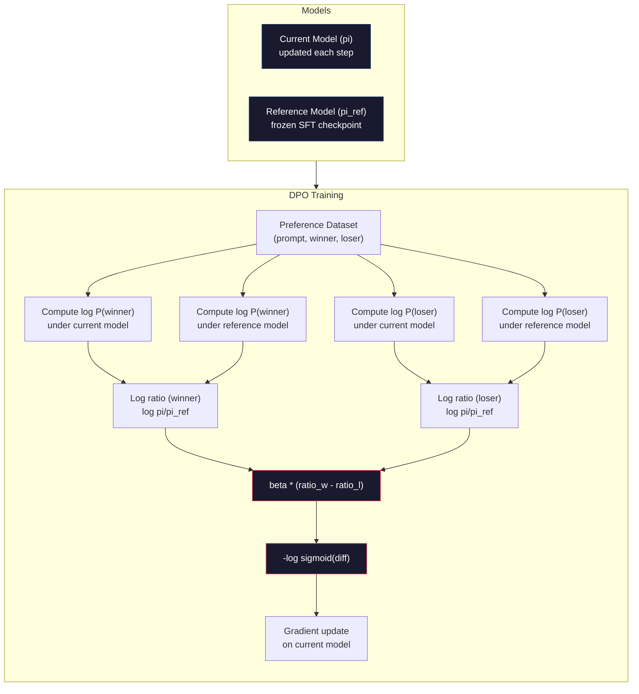

# Otimizar preferências diretas.

> O RLHF funciona. Também requer treinamento de três modelos (SFT, modelo de recompensa, política), gerenciamento da instabilidade do PPO e sintonização de uma penalidade KL. O DPO pergunta: e se você pudesse ignorar tudo isso?

> **【中文解读】**RLHF 需要训练三个模型(SFT、奖励模型、策略), também para lidar com a instabilidade do PPO──DPO 直接在偏好对上优化语言模型不需要奖励模型,不需要 PPO,一个训练循环,效果相当──

> **【拓展：DPO→简化对齐】**O DPO é um programa de substituição RLHF proposto por Stanford em 2023, que se tornou o primeiro método de seleção para muitos modelos de código aberto, como Zephyr、Tulu.

> - Não .**【前置】**學本節前 請先掌握:Fase 10·07(RLHF) 理解RLHF 流程和它的问题(3 个模型 + PPO 不稳定);PyTorch 监督学习基础──DPO é um "RLHF sem RL" matemático, compreender por que é eficaz.

**Type:** Build
**Languages:** Python (with numpy)
**Prerequisites:** Phase 10, Lesson 07 (RLHF)
**Time:** ~90 minutes

> - Não .**【类比】**DPO vs RLHF = 直接教育 vs 訓練動物。RLHF:先训一个"老师" (RM) dar aos alunos um dividendo, reutilizar PPO 让学生讨老师欢心3 个模型 + 复杂训练。DPO:直接给学生看"好答案"和"坏答案"对照,让它自己学1 个模型 + 简单交叉── DPO matemático provou que " fazer divisões em dados preferidos " é igual ao "melhor ótimo de RLHF",省去了显式 RM──

> ️ **【易错点】**O DPO's 3 个坑:**偏好数据质量决定一切**DPO Não como RLHF tem RM ruído plano, marcação de erro preferência para diretamente;**β 系数设错**太大(> 0.5)模型不变,太小(< 0.05)模型偏离 SFT 太远; típico 0.1──(3) **没做 reference model**DPO perda 需要相对 SFT 模型的日志-prob 差分,忘记加载 ref model 会训练崩;用 `AutoModelForCausalLM.from_pretrained(sft_path)`Fazer referência.

## Objetivos de aprendizagem

- Implementar um treinamento para o DPO que otimize diretamente um modelo de linguagem em pares de preferências sem um modelo de recompensa separado
    implementar o treinamento de DPO, diretamente em preferência para o modelo de linguagem de otimização, sem necessidade de um modelo de recompensa individual
- Derivar a função de perda de DPO e explicar como ele representa implícitamente um modelo de recompensa através das probabilidades de registro da apólice
  推导 DPO 损失函数, explicar como ele é através de estratégias de probabilidade de contra-número ocultos expressão de recompensa modelo
- Comparar DPO vs RLHF em termos de estabilidade de treinamento, custo de computação e número de modelos necessários
  Em termos de estabilidade de treinamento, custos de cálculo e número de modelos necessários, comparação entre DPO e RLHF
- Aponta o parâmetro beta para controlar a diferença entre a política de formação e o modelo de referência
  调节 beta 参数, controlar estratégias de treinamento de desvio do modelo de referência

> **【中文解读】**O principal conceito do DPO é que a função de recompensa mais positiva pode ser derivada do próprio modelo de linguagem, portanto não é necessário um modelo de recompensa individual.

## O problema é o problema da introdução

Você construiu um pipeline RLHF na lição 07. Três etapas. Três modelos. O modelo SFT, o modelo de recompensa e o modelo de política otimizado com PPO. O modelo de recompensa sozinho exigia milhares de pares de preferências humanas e um ciclo de treinamento separado.

> Você construiu RLHF 管线在第七课中. Em três fases. Em três modelos.

Na prática, o treinamento PPO é notoriamente instável. Pequenas mudanças de hiperparâmetros fazem com que o treinamento diverja. O modelo de recompensa é um proxy imperfeito para as preferências humanas, e a política encontra maneiras de explorar suas fraquezas. A penalidade KL ajuda, mas requer sua própria sintonia - muito baixa e você recebe hacking de recompensa, muito alta e o modelo mal aprende.

> Na prática, o treinamento do PPO é chamado de "inestabilidade". Minúsculas mudanças de superparâmetros podem levar ao desenvolvimento do treinamento. O modelo de recompensa é um agente imperfeito das preferências humanas.

Esta complexidade é a razão pela qual a maioria dos modelos de código aberto lutou com o RLHF por anos após a publicação do InstructGPT. O pipeline de três etapas é frágil. Cada etapa tem seus próprios modos de falha e erros compostos.

> Esta complexidade é a razão pela qual a maioria dos modelos de código aberto, após a publicação do InstructGPT, têm sido difíceis de usar RLHF por muitos anos.

Em maio de 2023, Rafael Rafailov, Archit Sharma e colegas de Stanford publicaram "Optimização de Preferências Diretas: Seu Modelo de Língua é Secretamente um Modelo de Recompensa". A função de recompensa ideal é determinada matematicamente pelas probabilidades simbólicas do próprio modelo de linguagem. Você pode ignorar o modelo de recompensa inteiramente e otimizar o modelo de linguagem diretamente em pares de preferências.

> Em maio de 2023, Rafael Rafailov, Archit Sharma e colegas de Stanford publicaram "Optimização de Preferências Direitas: Seu Modelo de Língua é Secretamente um Modelo de Recompensa"―.

O DPO reduz o RLHF a um único passo de aprendizagem supervisionada. Um modelo. Uma função de perda. Um loop de treinamento. Não há aprendizagem de reforço. Zephyr-7B, um dos primeiros modelos a usar o DPO em escala, combinou ou venceu modelos treinados com RLHF completo em vários benchmarks. Meta usou o DPO como parte do pipeline de alinhamento do Llama 3.

> O DPO simplificará o RLHF em um único monitoramento de aprendizagem. Um modelo. Uma função de perda. Um ciclo de treinamento. Não há necessidade de forte química. Zephyr-7B é um dos primeiros modelos de DPO em grande escala, em vários níveis de base, que se adaptaram ou superaram ao uso completo do RLHF.

> **【中文解读】**DPO resolveu os três grandes pontos de dor do RLHF: 1) Não precisa de um modelo de recompensa de treinamento individual; 2) Não precisa de lidar com a instabilidade e o superparâmetro de PPO; 3) A simplificação da linha de três modelos para um único ciclo de treinamento.

> **【拓展：DPO 在开源社区的普及】**O DPO has se tornado o primeiro método de seleção para o modelo de código aberto. O DPO has usado o modelo de código aberto para substituir o PPO, Zephyr, Tulu, OpenHermes, etc. Em comparação com o RLHF, o custo de treinamento do DPO é de cerca de 1/3 do modelo de recompensa, e o treinamento é mais estável.

## O conceito central.

### O principal conhecimento

A RLHF optimiza este objectivo:

> RLHF 优化这个目标:

O valor de um valor de referência é o valor de uma taxa de referência de uma taxa de referência de uma taxa de referência de uma taxa de referência de uma taxa de referência de uma taxa de referência de uma taxa de referência de uma taxa de referência de uma taxa de referência de uma taxa de referência de uma taxa de referência de uma taxa de referência de uma taxa de referência de uma taxa de referência de uma taxa de referência de uma taxa de referência de uma taxa de referência de uma taxa de referência de uma taxa de referência de uma taxa de referência de uma taxa de referência de uma taxa de referência de uma taxa de referência de uma taxa de referência de uma taxa de referência de uma taxa de referência de uma taxa de referência de uma taxa de referência de uma taxa de referência de uma taxa de referência de uma taxa de referência de uma taxa de referência de uma taxa de referência de uma taxa de referência de referência de uma taxa de referência de uma taxa de referência de referência de uma taxa de referência de uma taxa de referência de referência de uma taxa de referência de uma taxa de referência de uma taxa de referência de uma taxa de referência de uma taxa de referência de uma taxa de referência de uma taxa de referência de uma taxa de referência de uma taxa de referência de uma taxa de referência de uma taxa de uma taxa de referência de uma taxa de uma taxa de referência de uma taxa de uma taxa de um valor de uma taxa de uma taxa de referência de uma taxa de uma taxa de um valor de uma taxa de uma taxa de uma taxa de uma taxa de um valor de uma taxa de uma taxa de uma taxa de um valor de uma taxa de uma taxa de um valor de uma taxa de uma taxa de uma taxa de uma taxa de uma taxa de de de uma taxa de uma taxa de de de uma taxa de uma taxa de de de de de de uma taxa de uma taxa de de de de uma taxa de uma taxa de uma taxa de uma taxa de uma taxa de uma taxa de uma taxa de uma taxa de uma taxa de uma taxa de uma taxa de uma taxa de uma taxa de uma taxa de uma taxa de uma taxa de uma taxa de uma taxa de uma taxa de uma taxa de uma taxa de uma de uma taxa de uma de uma taxa de uma de uma taxa de uma taxa de uma de uma taxa de uma de uma de uma taxa de uma de uma de uma taxa de uma taxa de uma de uma de uma de uma de uma taxa de uma de uma de uma de uma taxa de uma de uma de uma taxa de

> Entre eles R é o modelo de recompensa, pi é estratégia, pi_ref é modelo de referência, beta é o KL.

O documento do DPO mostrou que este objetivo tem uma solução ótima em forma fechada.

> O artigo do DPO mostra que este objetivo tem a melhor solução de forma fechada. Para qualquer função de recompensa R, a melhor estratégia é:

onde Z(x) é uma constante de normalização.

> Entre eles, Z(x) é a redução de números comuns.

Esta é a descoberta. A recompensa é expressa inteiramente em termos de probabilidades do modelo de política e probabilidades do modelo de referência. Você não precisa treinar um modelo de recompensa separado. A recompensa é *implicita* na relação de probabilidade.

> É o que se passa. A recompensa é totalmente representada pela probabilidade do modelo estratégico e da probabilidade do modelo de referência. Não é necessário treinar um modelo de recompensa individual. A recompensa é a quantidade de probabilidade em relação à probabilidade.

Substituindo isto no modelo de preferência Bradley-Terry:

> Para substituir o modelo preferido de Bradley-Terry:

Os termos Z(x) se cancelam porque ambas as respostas condicionam no mesmo prompt x. O que resta é uma função das probabilidades de log do modelo de política e das probabilidades de log do modelo de referência nas respostas preferidas e rejeitadas.

> Z(x) 项消去了, porque dois repetidores são do mesmo prompt x como condição.

### A perda do DPO

```
L_DPO = -log(sigmoid(beta * (log pi(y_w|x)/pi_ref(y_w|x) - log pi(y_l|x)/pi_ref(y_l|x))))
```

Vamos desembalar cada peça:

> Deixem-nos resolver cada parte:

- **y_w**= resposta preferida (ganadora)
- **y_l**= resposta rejeitada (perdida)
- **x**= rápido
- **pi**= modelo atual (em formação)
- **pi_ref**= modelo de referência (ponto de controlo de FFT congelado)
- **beta**= parâmetro de temperatura que controla o desvio da referência (normalmente 0,1 a 0,5)

> **【中文解读】**O núcleo da função DPO 损失函数 é "对数概率比对数概率比":beta * (log pi(y_w) /pi_ref(y_w) - log pi(y_l) /pi_ref(y_l))。

> **【拓展：DPO 的数学直觉】**A descoberta do DPO consiste em expressar a função de recompensa "ocultum" no RLHF como modelo de estratégia e probabilidade de modelo de referência: R(x,y) = beta * log (pi) = pi_ref) = = = = = = = = = = = = = = = = = = = = = = = = = = = = = = = = = = = = = = = = = = = = = = = = = = = = = = = = = = = = = = = = = = = = = = = = = = = = = = = = = = = = = = = = = = = = = = = = = = = = = = = = = = = = = = = = = = = = = = = = = = = = = = = = = = = = = = = = = = = = = = = = = = = = = = = = = = = = = = = = = = = = = = = = = = = = = = = = = = = = = = = = = = = = = = = = = = = = = = = = = = = = = = = = = = = = = = = = = = = = = = = = = = = = = = = = = = = = = = = = = = = = = = = = = = = = = = = = = = = = = = = = = = = = = = = = = = = = = = = = = = = = = = = = = = = = = = = = = = = = = = = = = = = = = = = = = = = = = = = = = = = = = = = = = = = = = = = = = = = = = = = = = = = = = = = = = = = = = = = = = = = = = = = = = = = = = = = = = = = = = = = = = = = = = = = = = = = = = = = = = = = = = = = = = = = = = = = = = = = = = = = = = = = = = = = = = = = = = = = = = = = = = = = = = = = = =

A relação `log pi(y|x) / pi_ref(y|x)`Quando esta relação é positiva, o modelo atual atribui uma probabilidade maior à resposta y do que a referência faz. Quando negativo, o modelo atual atribui uma probabilidade menor.

> %`log pi(y|x) / pi_ref(y|x)`É proporcional à probabilidade numérica. Quando esta proporção é correta, o modelo atual dá resposta e divide a probabilidade mais alta do que a referência.

A perda de DPO empurra o modelo para aumentar a relação de probabilidade de registro para respostas preferidas e diminuí-lo para respostas rejeitadas. O parâmetro beta controla o quão agressivamente o modelo pode desviar da referência - pequena beta significa grandes desvios são permitidos, grande beta mantém o modelo perto da referência.

> DPO perda impulsionar o modelo aumentar a probabilidade de reapresentação inicial de números, reduzir a probabilidade de reapresentação negativa de números, beta parâmetros de controle do modelo de desvio de referência grau de agitação  pequeno beta permitir grande desvio, grande beta  manter o modelo próximo de referência 



### Por que o DPO é mais simples

| Aspect | RLHF (PPO) | DPO |
|--------|-----------|-----|
| Models to train | 3 (SFT + reward + policy) | 1 (policy only) |
| Training loops | 3 (SFT, RM training, PPO) | 2 (SFT, DPO) |
| Hyperparameters | lr, KL coeff, clip ratio, RM lr, epochs x3 | lr, beta, epochs |
| Reward model | Required (separate training) | Implicit in model probabilities |
| RL algorithm | PPO (complex, unstable) | Supervised learning (stable) |
| GPU memory | 3-4 models in memory during PPO | 2 models (current + reference) |
| Training stability | Sensitive to hyperparameters | Robust, similar to SFT |

O DPO precisa de dois modelos na memória durante o treinamento - o modelo atual e a referência congelada. O RLHF precisa de três ou quatro: a política, a referência, o modelo de recompensa e opcionalmente uma linha de base da função de valor. Para um modelo 70B, cada cópia leva 140 GB em FP16.

> O treinamento do DPO requer dois modelos em memória. O modelo de referência do RLHF requer três ou quatro: estratégia, referência, modelo de recompensa, bem como função de valor base de linha. Para o modelo 70B, cada cópia ocupa 140 GB em FP16.

### Quando o DPO vence o RLHF

**Small datasets.**Com 5.000-20.000 pares de preferências, o DPO muitas vezes corresponde ou excede o RLHF. O modelo de recompensa no RLHF precisa de dados suficientes para generalizar - com dados limitados, ele excede e produz sinais de recompensa pouco confiáveis.

> **小型数据集。**Há 5.000-20.000 preferências para o tempo, o modelo de recompensa de DPO normalmente correspondente ou superior a RLHF.

**Limited compute.**O DPO requer aproximadamente um terço do cálculo do RLHF completo (um ciclo de treinamento em vez de três). Para equipes sem grandes aglomerados de GPU, esta é a escolha prática.

> **有限算力。**DPO 大约只需要完整的RLHF 三分之一的计算量(um training loop而不是三个) ⋅ Para equipes sem grandes GPU 集群, é a escolha prática。

**Rapid iteration.**Quer experimentar 10 conjuntos de dados de preferências diferentes para ver qual produz o melhor modelo? DPO permite executar cada experimento em horas. RLHF requer reestruturação do modelo de recompensa para cada conjunto de dados.

> **快速迭代。**想尝试 10 diferentes preferências do conjunto de dados ver qual produz o melhor modelo?DPO 让你在几小时内运行每个实验――RLHF 需要为每个数据集重新训练奖励模型――

### Quando a RLHF vence o DPO

**Large-scale training.**Na escala do GPT-4 ou Claude, o modelo de recompensa separado da RLHF pode capturar sinais de preferência mais matizados.

> **大规模训练。**Na escala do GPT-4 ou do Claude, o modelo de recompensa independente do RLHF pode capturar sinais de preferência mais detalhados.

**Complex reward signals.**Quando "melhor" envolve múltiplas dimensões (utilidade, inofensividade, honestidade), um modelo de recompensa pode aprender essa troca multi-objetiva. O DPO trata cada par de preferências como um sinal binário - um é melhor, outro é pior - sem modelar por quê.

> **复杂奖励信号。**Quando "melhor" envolve várias dimensões (utilidade, inocuidade, sinceridade), o modelo de recompensa pode aprender essa medida de múltiplos objetivos.

**Iterative alignment.**As linhas de pipeline RLHF podem gerar novas respostas com a política atual, ter humanos a classificar e retratar o modelo de recompensa em um loop online. O DPO trabalha em um conjunto fixo de dados de pares de preferências. A IA constitucional (abordagem da Anthropic) usa esta propriedade iterativa do RLHF extensivamente.

> **迭代对齐。**O RLHF 管线 pode usar estratégias atuais para gerar novos retornos, fazer avaliações humanas e re-treinar o modelo de recompensa no ciclo online.

### Além do DPO: KTO, ORPO, SimPO

O DPO inspirou uma família de métodos de alinhamento simplificados.

> O DPO iniciou uma série de métodos simplificados de preparação.

**KTO (Kahneman-Tversky Optimization, 2024):**Nem sequer precisas de pares. A KTO trabalha com feedback não pareado - apenas etiquete cada resposta como "boa" ou "ruim" sem compará-la com uma alternativa. Isto simplifica drasticamente a coleta de dados. Em vez de mostrar aos anotadores duas respostas e perguntar "qual é melhor?", você mostra uma resposta e pergunta "é bom?" A função de perda aplica a aversão à perda da teoria das perspectivas: as respostas ruins são penalizadas mais do que as boas respostas são recompensadas.

> **KTO（Kahneman-Tversky 优化，2024）：**Você nem precisa de parâmetro. KTO utiliza não parâmetro. Contraste apenas deve marcar cada resposta como "bom" ou "mau", sem necessidade de comparação com alternativas. Isso simplifica a coleta de dados.

**ORPO (Odds Ratio Preference Optimization, 2024):**Combina SFT e alinhamento em um único passo de treinamento. Em vez de primeiro fazer SFT, em seguida, DPO, ORPO modifica a perda SFT para incluir um sinal de preferência. A perda tem dois termos: uma perda padrão de previsão de token seguinte em respostas preferidas, mais um termo de relação de odds que aumenta a diferença entre probabilidades de resposta preferidas e rejeitadas. Um ciclo de treinamento em vez de dois.

> **ORPO（赔率比偏好优化，2024）：**Em um único treino, combinação de SFT e de parâmetros. OORPO modifica a perda de SFT para incluir sinais de preferência, em vez de fazer SFT e fazer DPO. O perdão tem dois elementos: padrão de primeira escolha e repetição no próximo token.

**SimPO (Simple Preference Optimization, 2024):**Elimina o modelo de referência inteiramente. Em vez de calcular as proporções de probabilidade de registro contra uma referência congelada, o SimPO usa a probabilidade média de registro da resposta (normalizada por comprimento) como recompensa implícita. Isso economiza memória (não é necessário um modelo de referência) e simplifica o treinamento. A normalização de comprimento impede que o modelo favoreça respostas mais curtas.

> **SimPO（简单偏好优化，2024）：**完全消除参考模型──SimPO 使用回复的平均对数概率 (%) 根据长度归化) como recompensa oculta, em vez de 结结的参考计算对数概率比──这节省了内存 ().

| Method | Year | Models in Memory | Needs Pairs? | Needs Reference? | Training Loops |
|--------|------|-----------------|-------------|-----------------|----------------|
| RLHF | 2022 | 3-4 | Yes (for RM) | Yes | 3 |
| DPO | 2023 | 2 | Yes | Yes | 2 |
| KTO | 2024 | 2 | No (unpaired) | Yes | 2 |
| ORPO | 2024 | 1 | Yes | No | 1 |
| SimPO | 2024 | 1 | Yes | No | 1 |

A tendência é clara: cada método elimina mais uma peça de complexidade. A RLHF precisava de um modelo de recompensa e PPO. O DPO eliminou ambos. A KTO eliminou dados emparelhados. A ORPO eliminou a fase separada da SFT. A SimPO eliminou o modelo de referência. O imposto de alinhamento - o custo de computação e complexidade de passar de um modelo base para um modelo alinhado - continua a cair.

>  Tendências são claras: cada método elimina uma complexidade. RLHF  necessita de um modelo de recompensa e PPO  DPO  elimina dois. KTO  elimina um par de dados  ORPO  elimina um único estágio de SFT ⋅ SimPO  elimina um modelo de referência ⋅ para o preço ⋅ do modelo base para o modelo de cálculo e complexidade ⋅ continua a cair ⋅

### Deploições reais de DPO

**Zephyr-7B (HuggingFace, October 2023):**Mistral 7B base, SFT no UltraChat (200K exemplos), em seguida, DPO no UltraFeedback (60K pares de preferência). Scored 6.47 no MT-Bench - o modelo 7B mais alto na época. Para comparação, Llama 2 Chat 70B obteve 6.86, o que significa que Zephyr ficou dentro de 6% de um modelo 10x seu tamanho usando apenas alinhamento DPO.

> **Zephyr-7B（HuggingFace，2023 年 10 月）：**Mistral 7B  base modelo, em UltraChat(200K  sample) fazer SFT, em seguida, em UltraFeedback(60K  preferência contra) fazer DPO。MT-Bench obter 6.47 então o mais alto 7B  modelo。 Como comparação, Llama 2 Chat 70B obter 6.86, significa Zephyr  apenas com DPO para Zizia alcançou um nível de 94% do modelo maior de 10 vezes maior。

**Llama 3 (Meta, April 2024):**Usado DPO após as fases iniciais de RLHF. A combinação sugere que DPO e RLHF podem ser complementares - RLHF para alinhamento amplo, DPO para refino direcionado.

> **Llama 3（Meta，2024 年 4 月）：**Na fase inicial do RLHF , depois de usar DPO, essa combinação indica que DPO e RLHF podem ser complementados RLHF, usado para um amplo conjunto, DPO, usado para uma finalização de orientação.

**Neural Magic / nm-chat (2024):**Aplicou DPO a vários modelos de código aberto, mostrando consistentemente uma melhoria de 5-15% nos referências de alinhamento em relação às linhas de base exclusivas de SFT.

> **Neural Magic / nm-chat（2024）：**A DPO é aplicada a vários modelos de código aberto, mostrando um aumento de 5-15% em relação à linha de base de SFT pura.

## Construí-lo e realizei-o.
```figure
dpo-loss
```

## Construí-lo

### Passo 1: Set de dados preferenciais

O mesmo formato que o RLHF - (pronto, preferido, rejeitado) triples.

> 格式与 RLHF 相同(prompt, 首选, 被拒绝) 三元组──DPO 直接消费这些数据,无需中间的奖励模型──

```python
import numpy as np
import sys
import os
sys.path.insert(0, os.path.join(os.path.dirname(__file__), "..", "..", "04-pre-training-mini-gpt", "code"))
from main import MiniGPT, LayerNorm, Embedding, TransformerBlock

PREFERENCE_DATA = [
    {
        "prompt": "What is the capital of France?",
        "preferred": "The capital of France is Paris.",
        "rejected": "France is a country in Europe. It has many cities. The capital is Paris. Paris is known for the Eiffel Tower.",
    },
    {
        "prompt": "Explain gravity in one sentence.",
        "preferred": "Gravity is the force that attracts objects with mass toward each other.",
        "rejected": "Gravity is something that makes things fall down when you drop them.",
    },
    {
        "prompt": "What is 15 times 7?",
        "preferred": "15 times 7 is 105.",
        "rejected": "Let me think about this. 15 times 7. Well, 10 times 7 is 70, and 5 times 7 is 35, so the answer might be around 105.",
    },
    {
        "prompt": "Name three programming languages.",
        "preferred": "Python, Rust, and TypeScript.",
        "rejected": "There are many programming languages. Some popular ones include various languages like Python and others.",
    },
    {
        "prompt": "What year did World War II end?",
        "preferred": "World War II ended in 1945.",
        "rejected": "World War II was a major global conflict. It involved many countries. The war ended in the mid-1940s, specifically in 1945.",
    },
    {
        "prompt": "Define machine learning.",
        "preferred": "Machine learning is a field where algorithms learn patterns from data to make predictions without being explicitly programmed.",
        "rejected": "Machine learning is a type of AI. AI stands for artificial intelligence. Machine learning uses data to learn.",
    },
]
```

### Passo 2: Probabilidade de registro de sequência

A perda de DPO requer o cálculo da probabilidade total de registro de uma resposta dada a um prompt. Isso significa executar o modelo na sequência completa (prompt + resposta) e somar as probabilidades de registro de cada token de resposta.

> DPO 损失需要计算给定提示下回复的总对数概率── isto significa que em um modelo de execução completo, em seguida, em cada sequência de resposta, a probabilidade de contra-ataque de cada token é de proporção.

```python
def tokenize_sequence(text, vocab_size=256):
    return [min(t, vocab_size - 1) for t in list(text.encode("utf-8"))]


def compute_sequence_log_prob(model, prompt_tokens, response_tokens, max_seq_len=128):
    full_sequence = prompt_tokens + response_tokens
    if len(full_sequence) > max_seq_len:
        full_sequence = full_sequence[:max_seq_len]

    if len(full_sequence) < 2:
        return 0.0

    input_ids = np.array(full_sequence[:-1]).reshape(1, -1)
    target_ids = np.array(full_sequence[1:])

    logits = model.forward(input_ids)
    logits = logits[0]

    max_logits = logits.max(axis=-1, keepdims=True)
    log_probs = logits - max_logits - np.log(
        np.exp(logits - max_logits).sum(axis=-1, keepdims=True)
    )

    prompt_len = len(prompt_tokens)
    response_start = max(0, prompt_len - 1)
    response_end = len(target_ids)

    if response_start >= response_end:
        return 0.0

    response_log_probs = log_probs[response_start:response_end, :]
    response_targets = target_ids[response_start:response_end]

    total_log_prob = 0.0
    for i, target in enumerate(response_targets):
        total_log_prob += response_log_probs[i, target]

    return total_log_prob
```

Esta função é o cavalo de trabalho do DPO. Para cada par de preferências, ele é executado quatro vezes: modelo em resposta preferencial, modelo em resposta rejeitada, referência em resposta preferencial, referência em resposta rejeitada. Isso é 4 passes adiantadas por exemplo de treinamento versus geração de RLHF + pontuação de recompensa + estimativa de valor + atualização de PPO. Mais simples, mais rápido, mais estável.

> Esta função é a principal força do DPO. Para cada preferência, ela funciona quatro vezes: modelo em primeira escolha, modelo em primeira escolha, modelo em primeira escolha, referência em primeira escolha, referência em primeira escolha, referência em primeira escolha, referência em primeira escolha, referência em primeira escolha, referência em cada treinamento, 4 vezes, e RLHF precisa gerar + + + avaliações de recompensa + estimativa de valor + PPO 更新── mais simples, mais rápido, mais estável──

### Passo 3: A perda do DPO

O núcleo do papel em código, uma função, uma perda, sem modelo de recompensa.

> 论文核心的代码实现――一函数――一损失――无需奖励模型――

```python
def sigmoid(x):
    return np.where(
        x >= 0,
        1.0 / (1.0 + np.exp(-x)),
        np.exp(x) / (1.0 + np.exp(x))
    )


def dpo_loss(policy_logprob_preferred, policy_logprob_rejected,
             ref_logprob_preferred, ref_logprob_rejected, beta=0.1):
    preferred_ratio = policy_logprob_preferred - ref_logprob_preferred
    rejected_ratio = policy_logprob_rejected - ref_logprob_rejected

    logit = beta * (preferred_ratio - rejected_ratio)

    loss = -np.log(sigmoid(logit) + 1e-8)

    preferred_reward = beta * preferred_ratio
    rejected_reward = beta * rejected_ratio

    return loss, {
        "preferred_ratio": float(preferred_ratio),
        "rejected_ratio": float(rejected_ratio),
        "logit": float(logit),
        "implicit_preferred_reward": float(preferred_reward),
        "implicit_rejected_reward": float(rejected_reward),
        "reward_margin": float(preferred_reward - rejected_reward),
    }
```

O `preferred_ratio`E ...`rejected_ratio`Quando o modelo atual atribui uma maior probabilidade à resposta preferida (em relação à referência) e uma menor probabilidade à resposta rejeitada, a logit é positiva e a perda é baixa.

> `preferred_ratio`和 `rejected_ratio`É a probabilidade de proporção de números em DPO 推︎ quando o modelo atual dá uma probabilidade de distribuição de repetições mais alta (com relação ao modelo de referência) e quando é dado uma probabilidade de distribuição de repetições mais baixa, o logito é certo e o perdão é baixo.

O `implicit_preferred_reward`E ...`implicit_rejected_reward`Os resultados são os benefícios que a perda do DPO atribui implícitamente. Você pode extraí-los para verificar se o treinamento está a funcionar - a margem entre as recompensas preferidas e rejeitadas deve aumentar em relação ao treinamento.

> `implicit_preferred_reward`和 `implicit_rejected_reward`O DPO                                                                                                                                                                                                                                                                                                                                                                                                                                                                                                                           

### Passo 4: Loop de formação do DPO

Um ciclo de treinamento padrão supervisionado, sem PPO, sem modelo de recompensa, apenas passes avançadas e atualizações de gradiente.

> 標準的监督学习训练循环──无需PPO──无需奖励模型──只有前向传播和梯度更新──

```python
def copy_model_weights(source, target):
    target.embedding.token_embed = source.embedding.token_embed.copy()
    target.embedding.pos_embed = source.embedding.pos_embed.copy()
    target.ln_f.gamma = source.ln_f.gamma.copy()
    target.ln_f.beta = source.ln_f.beta.copy()
    for s_block, t_block in zip(source.blocks, target.blocks):
        t_block.attn.W_q = s_block.attn.W_q.copy()
        t_block.attn.W_k = s_block.attn.W_k.copy()
        t_block.attn.W_v = s_block.attn.W_v.copy()
        t_block.attn.W_out = s_block.attn.W_out.copy()
        t_block.ffn.W1 = s_block.ffn.W1.copy()
        t_block.ffn.W2 = s_block.ffn.W2.copy()
        t_block.ffn.b1 = s_block.ffn.b1.copy()
        t_block.ffn.b2 = s_block.ffn.b2.copy()
        t_block.ln1.gamma = s_block.ln1.gamma.copy()
        t_block.ln1.beta = s_block.ln1.beta.copy()
        t_block.ln2.gamma = s_block.ln2.gamma.copy()
        t_block.ln2.beta = s_block.ln2.beta.copy()


def dpo_train(policy_model, reference_model, preference_data,
              num_epochs=5, lr=5e-6, beta=0.1, max_seq_len=128):
    print(f"DPO Training: {len(preference_data)} pairs, {num_epochs} epochs, "
          f"lr={lr}, beta={beta}")
    print()

    losses = []
    margins = []

    for epoch in range(num_epochs):
        epoch_loss = 0.0
        epoch_margin = 0.0
        num_examples = 0

        indices = np.random.permutation(len(preference_data))

        for idx in indices:
            pair = preference_data[idx]

            prompt_tokens = tokenize_sequence(pair["prompt"])
            preferred_tokens = tokenize_sequence(pair["preferred"])
            rejected_tokens = tokenize_sequence(pair["rejected"])

            pi_logprob_w = compute_sequence_log_prob(
                policy_model, prompt_tokens, preferred_tokens, max_seq_len
            )
            pi_logprob_l = compute_sequence_log_prob(
                policy_model, prompt_tokens, rejected_tokens, max_seq_len
            )
            ref_logprob_w = compute_sequence_log_prob(
                reference_model, prompt_tokens, preferred_tokens, max_seq_len
            )
            ref_logprob_l = compute_sequence_log_prob(
                reference_model, prompt_tokens, rejected_tokens, max_seq_len
            )

            loss, metrics = dpo_loss(
                pi_logprob_w, pi_logprob_l,
                ref_logprob_w, ref_logprob_l, beta
            )

            update_direction = 1.0 if metrics["logit"] < 0 else -0.1
            for block in policy_model.blocks:
                block.ffn.W1 += lr * update_direction * np.random.randn(*block.ffn.W1.shape) * 0.01
                block.ffn.W2 += lr * update_direction * np.random.randn(*block.ffn.W2.shape) * 0.01

            epoch_loss += loss
            epoch_margin += metrics["reward_margin"]
            num_examples += 1
            losses.append(float(loss))
            margins.append(metrics["reward_margin"])

        avg_loss = epoch_loss / max(num_examples, 1)
        avg_margin = epoch_margin / max(num_examples, 1)

        print(f"  Epoch {epoch + 1}/{num_epochs} | Loss: {avg_loss:.4f} | "
              f"Avg Margin: {avg_margin:.4f}")

    return policy_model, losses, margins
```

O ciclo de treinamento é refrescantemente simples em comparação com o RLHF. Para cada par de preferências: calcular quatro probabilidades de registro (dois modelos, duas respostas), conectá-las à perda de DPO, calcular o gradiente, atualizar a política.

> Comparado com o RLHF, o ciclo de treinamento é simplesmente impressionante. Para cada preferência: calcular quatro probabilidades de probabilidade numérica.

### Passo 5: Comparar DPO vs RLHF

Medir as margens de recompensa implícitas e as mudanças na probabilidade de registro para comparar o DPO com o modelo RLHF da lição 07.

> ∆ a medida de uma diferença de recompensa e uma diferença de probabilidade de número, comparar o DPO com o modelo RLHF da sétima classe.

```python
def evaluate_preference_accuracy(model, reference_model, preference_data, beta=0.1, max_seq_len=128):
    correct = 0
    total = 0

    for pair in preference_data:
        prompt_tokens = tokenize_sequence(pair["prompt"])
        preferred_tokens = tokenize_sequence(pair["preferred"])
        rejected_tokens = tokenize_sequence(pair["rejected"])

        pi_w = compute_sequence_log_prob(model, prompt_tokens, preferred_tokens, max_seq_len)
        pi_l = compute_sequence_log_prob(model, prompt_tokens, rejected_tokens, max_seq_len)
        ref_w = compute_sequence_log_prob(reference_model, prompt_tokens, preferred_tokens, max_seq_len)
        ref_l = compute_sequence_log_prob(reference_model, prompt_tokens, rejected_tokens, max_seq_len)

        preferred_reward = beta * (pi_w - ref_w)
        rejected_reward = beta * (pi_l - ref_l)

        if preferred_reward > rejected_reward:
            correct += 1
        total += 1

    return correct / max(total, 1)


def analyze_implicit_rewards(model, reference_model, preference_data, beta=0.1, max_seq_len=128):
    print("Implicit Reward Analysis:")
    print("-" * 65)
    print(f"  {'Prompt':<30} {'Pref Reward':>12} {'Rej Reward':>12} {'Margin':>10}")
    print("  " + "-" * 60)

    for pair in preference_data:
        prompt_tokens = tokenize_sequence(pair["prompt"])
        preferred_tokens = tokenize_sequence(pair["preferred"])
        rejected_tokens = tokenize_sequence(pair["rejected"])

        pi_w = compute_sequence_log_prob(model, prompt_tokens, preferred_tokens, max_seq_len)
        pi_l = compute_sequence_log_prob(model, prompt_tokens, rejected_tokens, max_seq_len)
        ref_w = compute_sequence_log_prob(reference_model, prompt_tokens, preferred_tokens, max_seq_len)
        ref_l = compute_sequence_log_prob(reference_model, prompt_tokens, rejected_tokens, max_seq_len)

        pref_reward = beta * (pi_w - ref_w)
        rej_reward = beta * (pi_l - ref_l)
        margin = pref_reward - rej_reward

        truncated = pair["prompt"][:28] + ".." if len(pair["prompt"]) > 30 else pair["prompt"]
        print(f"  {truncated:<30} {pref_reward:>12.4f} {rej_reward:>12.4f} {margin:>10.4f}")

    print()
```

### Passo 6: Análise da sensibilidade beta

O parâmetro beta é o equivalente de DPO ao coeficiente KL em RLHF. Ele controla o quanto o modelo pode desviar da referência.

> O beta parâmetro é equivalente ao RLHF KL em DPO. O modelo de controle pode desviar-se da referência.

```python
def beta_sensitivity_analysis(sft_model, preference_data, betas, max_seq_len=128):
    print("Beta Sensitivity Analysis")
    print("-" * 60)
    print(f"  {'Beta':>8} {'Final Loss':>12} {'Final Margin':>14} {'Accuracy':>10}")
    print("  " + "-" * 55)

    results = []

    for beta in betas:
        policy = MiniGPT(
            vocab_size=256, embed_dim=128, num_heads=4,
            num_layers=4, max_seq_len=max_seq_len, ff_dim=512
        )
        reference = MiniGPT(
            vocab_size=256, embed_dim=128, num_heads=4,
            num_layers=4, max_seq_len=max_seq_len, ff_dim=512
        )
        copy_model_weights(sft_model, policy)
        copy_model_weights(sft_model, reference)

        policy, losses, margins_list = dpo_train(
            policy, reference, preference_data,
            num_epochs=3, lr=5e-6, beta=beta, max_seq_len=max_seq_len
        )

        accuracy = evaluate_preference_accuracy(
            policy, reference, preference_data, beta, max_seq_len
        )

        final_loss = losses[-1] if losses else 0
        final_margin = margins_list[-1] if margins_list else 0

        print(f"  {beta:>8.3f} {final_loss:>12.4f} {final_margin:>14.4f} {accuracy:>10.1%}")
        results.append({
            "beta": beta,
            "final_loss": final_loss,
            "final_margin": final_margin,
            "accuracy": accuracy,
        })

        print()

    return results
```

O pequeno beta (0.01) permite que o modelo desvie livremente da referência - aprendizado rápido, mas risco de soluções degeneradas. O grande beta (1.0) mantém o modelo perto da referência - aprendizado estável, mas lento. O ponto ideal para a maioria das aplicações é de 0,1 a 0,3.

> 小 beta(0.01) Deixe o modelo livre de desvio de referência 学得快但有退化解决方案风险──大 beta(1.0) Mantém o modelo próximo da referência稳定但学得慢── Melhor valor da maioria das aplicações é de 0,1 a 0,3──

## Use-o com o framework implementado.

### Demo completo do oleoduto DPO

```python
if __name__ == "__main__":
    np.random.seed(42)

    print("=" * 70)
    print("DPO: DIRECT PREFERENCE OPTIMIZATION")
    print("=" * 70)
    print()

    print("STEP 1: Initialize SFT Model (from Lesson 06)")
    print("-" * 50)
    sft_model = MiniGPT(
        vocab_size=256, embed_dim=128, num_heads=4,
        num_layers=4, max_seq_len=128, ff_dim=512
    )
    print(f"  Parameters: {sft_model.count_parameters():,}")
    print()

    print("STEP 2: DPO Training")
    print("-" * 50)

    policy_model = MiniGPT(
        vocab_size=256, embed_dim=128, num_heads=4,
        num_layers=4, max_seq_len=128, ff_dim=512
    )
    reference_model = MiniGPT(
        vocab_size=256, embed_dim=128, num_heads=4,
        num_layers=4, max_seq_len=128, ff_dim=512
    )
    copy_model_weights(sft_model, policy_model)
    copy_model_weights(sft_model, reference_model)

    policy_model, losses, margins = dpo_train(
        policy_model, reference_model, PREFERENCE_DATA,
        num_epochs=5, lr=5e-6, beta=0.1
    )
    print()

    print("=" * 70)
    print("STEP 3: Evaluate")
    print("=" * 70)
    print()

    pre_accuracy = evaluate_preference_accuracy(
        sft_model, reference_model, PREFERENCE_DATA, beta=0.1
    )
    post_accuracy = evaluate_preference_accuracy(
        policy_model, reference_model, PREFERENCE_DATA, beta=0.1
    )

    print(f"  Preference accuracy (pre-DPO):  {pre_accuracy:.1%}")
    print(f"  Preference accuracy (post-DPO): {post_accuracy:.1%}")
    print()

    analyze_implicit_rewards(policy_model, reference_model, PREFERENCE_DATA, beta=0.1)

    print("=" * 70)
    print("STEP 4: Training Dynamics")
    print("=" * 70)
    print()

    if losses:
        print("  Loss curve:")
        window = max(1, len(losses) // 5)
        for i in range(0, len(losses), window):
            chunk = losses[i:i + window]
            avg = sum(chunk) / len(chunk)
            print(f"    Steps {i:3d}-{i + len(chunk) - 1:3d}: loss = {avg:.4f}")
        print()

    if margins:
        print("  Reward margin curve:")
        window = max(1, len(margins) // 5)
        for i in range(0, len(margins), window):
            chunk = margins[i:i + window]
            avg = sum(chunk) / len(chunk)
            print(f"    Steps {i:3d}-{i + len(chunk) - 1:3d}: margin = {avg:.4f}")
        print()

    print("=" * 70)
    print("STEP 5: Beta Sensitivity")
    print("=" * 70)
    print()

    beta_results = beta_sensitivity_analysis(
        sft_model, PREFERENCE_DATA, betas=[0.01, 0.1, 0.3, 1.0]
    )

    print("=" * 70)
    print("DPO vs RLHF COMPARISON")
    print("=" * 70)
    print()
    print("  DPO advantages:")
    print("    - 1 training loop (vs 3 for RLHF)")
    print("    - 2 models in memory (vs 3-4 for RLHF)")
    print("    - Supervised learning (vs RL, more stable)")
    print("    - No reward model to train or maintain")
    print()
    print("  RLHF advantages:")
    print("    - Separate reward model captures complex preferences")
    print("    - Online learning: generate, rate, retrain")
    print("    - Better for multi-objective alignment")
    print("    - Proven at largest scales (GPT-4, Claude)")
    print()
    print("  Practical guidance:")
    print("    - Start with DPO. It's simpler and often sufficient.")
    print("    - Switch to RLHF if DPO plateaus on your eval metrics.")
    print("    - Many production systems use both: RLHF first, DPO to refine.")
```

## Envia-o . Produto .

Esta lição produz`outputs/prompt-alignment-method-selector.md`- um prompt que ajuda a escolher o método de alinhamento certo (SFT, RLHF, DPO, KTO, ORPO, SimPO) para o seu caso de utilização.

> 本课产 出 `outputs/prompt-alignment-method-selector.md` Um exemplo para ajudar você a escolher o método de preparação correta (SFT, RLHF, DPO, KTO, ORPO, SimPO) .

## Exercícios.

1. Implementar KTO (Optimização Kahneman-Tversky). KTO não precisa de pares - apenas etiquetar cada resposta como "boa" ou "ruim". A perda para uma boa resposta é `-log(sigmoid(beta * log_ratio))`E uma má resposta é `-log(1 - sigmoid(beta * log_ratio))`com um multiplicador de aversião de perda (normalmente 1,5x) sobre a perda de resposta ruim. Treinar com os mesmos dados (tratar preferencialmente como "bom" e rejeitado como "mau" de forma independente) e comparar a precisão com DPO.
   O KTO não precisa de um só tipo de perdas, mas apenas de um só tipo de perdas.`-log(sigmoid(beta * log_ratio))`, mal recuperado perdas são `-log(1 - sigmoid(beta * log_ratio))`,并对坏回复损失应用损失厌恶乘数 (normalmente 1,5 vezes) ⋅ Training on the same data (em inglês) ⋅will be considered "good", being rejected as "bad"),并与 DPO比较准确率──

2. Implementar DPO normalizado de comprimento. Em vez de probabilidades de registro crus, dividir pelo número de tokens de resposta: `normalized_logprob = total_logprob / num_tokens`• Esta situação impede que o modelo favoreça respostas mais curtas (que têm um log-prob total mais elevado).
   Não utiliza probabilidade de números em relação ao original, mas sim num token de números:`normalized_logprob = total_logprob / num_tokens` Isto impede que o modelo se inclina para retorno mais curto

3. Construir uma perda combinada de estilo ORPO. Adicionar uma perda padrão de previsão de token seguinte na resposta preferida à perda de DPO: `L = L_sft(preferred) + alpha * L_dpo`.Tente os valores alfa de 0,1, 0,5 e 1.0. A perda combinada deve produzir um modelo que siga instruções (do termo SFT) e prefira melhores respostas (do termo DPO), eliminando a necessidade de uma fase separada de SFT.
   Tradução do inglês para inglês: construire ORPO 风格的组合损失──在 DPO 损失上添加首选回复的标准 下一个标记 预测损失:`L = L_sft(preferred) + alpha * L_dpo` tentar o modelo de alfa  valor 0.1、0.5 和 1.0── 组合损失应产生既能遵循指令 () 来自 SFT 项) 再偏好更好回复 () 来自 DPO 项) 模型, eliminar as necessidades de um único SFT 阶段──

4. Implemente DPO iterativo. Execute DPO por 3 épocas, em seguida, gerar novas respostas do modelo treinado, combiná-las com as respostas preferidas originais como novos pares de preferências e executar novamente DPO. Duas rodadas deste processo "auto-jogo". Compare a precisão das preferências após a rodada 1 e a rodada 2 para ver se o refinamento iterativo ajuda.
   Tradução do inglês: implementar a geração DPO, executar a DPO 3 épocas, então, a partir do modelo de treinamento posterior gerar um novo feedback, irá fazê-los com o original inicial de seleção de feedback parecido como um novo preferência para, novamente executar a DPO, dois ciclos "auto contra" processo, comparar a 1a rodada e a 2a rodada de preferência de precisione, ver se o refinamento da geração anterior é útil.

5. Compare o DPO com diferentes modelos de referência. Em vez de usar o ponto de verificação SFT como referência, tente: (a) o modelo base (antes do SFT), (b) um ponto de verificação da primeira época do DPO, (c) uma média móvel exponencial do modelo de política.
   Tradução do inglês para tradução do inglês: comparar usando diferentes modelos de referência DPO── não usar SFT 检查点作为参考,尝试:(a) 基础模型(SFT 前),(b) DPO 第 1 个时代的检查点,(c) 策略模型的指数移动平均──报告哪个参考产生最高偏好准确率和最稳定的训练曲线──

## Termos-chave .

| Term | What people say | What it actually means | 中文释义 |
|------|----------------|----------------------|---------|
| DPO | "RLHF without RL" | Direct Preference Optimization: a supervised learning algorithm that optimizes the language model directly on preference pairs, bypassing the reward model and PPO | 直接偏好优化，无需奖励模型和 PPO 的对齐方法 |
| Implicit reward | "The reward is in the model" | The reward function is determined by the log-probability ratio between the policy and reference models -- no separate reward model needed | 隐式奖励，由策略与参考模型的概率比决定 |
| Beta (DPO) | "The temperature" | Controls how far the policy can deviate from the reference model -- small beta allows large deviations, large beta keeps the model close | Beta 参数，控制策略偏离参考模型的程度 |
| Log-probability ratio | "How much the model changed" | log pi(y\|x) - log pi_ref(y\|x) -- positive means the current model assigns higher probability than the reference | 对数概率比，衡量策略相对参考模型的概率变化 |
| Reference model | "The frozen checkpoint" | A copy of the SFT model whose weights never change -- serves as the anchor for computing probability ratios | 参考模型，冻结的 SFT 检查点 |
| KTO | "DPO without pairs" | Kahneman-Tversky Optimization: works with unpaired "good" or "bad" labels instead of requiring preference pairs | 无需偏好对的优化方法，只需"好/坏"标签 |
| ORPO | "One-step alignment" | Odds Ratio Preference Optimization: combines SFT and alignment into a single training loop by adding a preference term to the SFT loss | 一步对齐，将 SFT 和对齐合并为单一训练循环 |
| SimPO | "No reference needed" | Simple Preference Optimization: eliminates the reference model by using length-normalized average log-probability as the implicit reward | 无需参考模型，用长度归一化概率作隐式奖励 |
| Alignment tax | "The cost of making models safe" | The additional compute, data, and complexity required to go from a base model to an aligned model -- DPO reduces this significantly | 对齐税，从基础模型到对齐模型的额外成本 |

## Mais leitura 延伸阅读

- [Rafailov et al., 2023 -- "Direct Preference Optimization: Your Language Model is Secretly a Reward Model"](https://arxiv.org/abs/2305.18290)-- o documento do DPO que simplificou o alinhamento da RLHF para a aprendizagem supervisionada
- [Tunstall et al., 2023 -- "Zephyr: Direct Distillation of LM Alignment"](https://arxiv.org/abs/2310.16944)-- Zephyr-7B, mostrando DPO em UltraFeedback coincide com RLHF em referências
- [Ethayarajh et al., 2024 -- "KTO: Model Alignment as Prospect Theoretic Optimization"](https://arxiv.org/abs/2402.01306)-- eliminar a necessidade de preferências em pares
- [Hong et al., 2024 -- "ORPO: Monolithic Preference Optimization without Reference Model"](https://arxiv.org/abs/2403.07691)-- combinando FFT e alinhamento num único passo
- [Meng et al., 2024 -- "SimPO: Simple Preference Optimization with a Reference-Free Reward"](https://arxiv.org/abs/2405.14734)-- eliminação total do modelo de referência
- [Llama 3 Technical Report](https://arxiv.org/abs/2407.21783)-- O canal de alinhamento da Meta que combina RLHF e DPO
