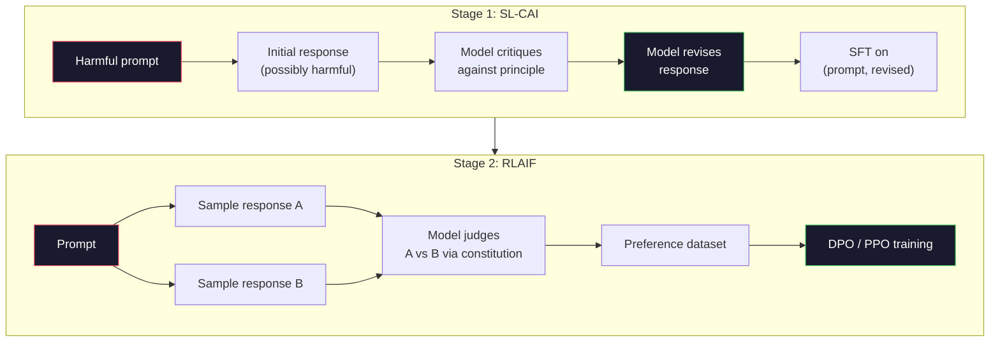
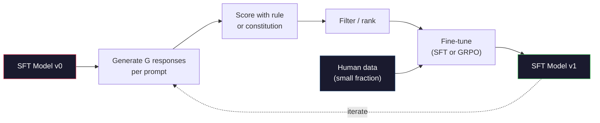

# Artificial inteligência constitucional e auto-melhoria .

> A RLHF precisa de humanos no circuito. A IA constitucional substitui a maioria deles pelo próprio modelo. Escreva uma lista de princípios, peça ao modelo que critique suas próprias saídas contra esses princípios e treine sobre as críticas. A DeepSeek-R1 levou isso ainda mais para 2025: deixe o modelo gerar milhões de vestígios de raciocínio, classificá-los com uma regra e executar o GRPO no resultado. A maior parte do "trabalho de alinhamento" num modelo de fronteira de 2026 é o próprio alinhamento do modelo. Esta lição constrói ambos os circuitos.

> **【中文解读】**RLHF  necessita de participação humana. A IA constitucional (CAI) utiliza o modelo para substituir a maior parte da humanidade: escrever um conjunto de princípios, deixar o modelo controlar o seu próprio resultado, e depois treinar em resultados críticos.

> **【拓展：CAI→Claude的安全对齐】**A IA Constitucional da Antropic é o método central de Claude Sigur对齐.

> - Não .**【前置】**O CAI é o representante do RLAIF (AI Feedback), é a extensão do RLHF para usar a AI em substituição à etiqueta humana.

**Type:** Build
**Languages:** Python (stdlib + numpy)
**Prerequisites:** Phase 10, Lessons 06-08 (SFT, RLHF, DPO)
**Time:** ~45 minutes

> - Não .**【类比】**CAI = 让学生自评自改作业――RLHF: teacher(人类)批改每份作业,慢且贵──CAI:给学生一份评分标准(宪法),让 TA 自己对照标准批改自己的作业,老师只抽查──优点:扩展性好(AI 不知疲倦),缺点:宪法写得差就坏学(模型按错原则"自我改进"成更糟糕版本)

> ️ **【易错点】**CAI's 3 个坑: ((1) **宪法原则太抽象**"要诚实、有帮助、无害"模型不知道具体怎么做;写成具体场景("user问怎么黑网站时,拒绝并建议学习网络安全法律")―(2) **没做人类抽查**AI  totalmente automático                                                                                                                                                                                                                                                            **self-reward hacking** Modelo auto-evaluado, orientado para seu próprio estilo, gradualmente degradado;

## Objetivos de aprendizagem

- Implementar o ciclo constitucional de IA em duas etapas: autocrítica mais auto-revisao, em seguida, treinamento de preferencia nos pares revisados
  Realizar o ciclo constitucional da IA                                                                                                                                                                                                                                                                                                                                                                                                                                                                                                                      
- Derivar o objetivo do GRPO (otimizar a política de grupo relativa do DeepSeek-R1) e contrastá-lo com a linha de base da função de valor do PPO
  推导 GRPO 目标函数(DeepSeek-R1 的组对策略优化)并与PPO 的价值函数基线对比
- Gerar traços de raciocínio verificáveis com recompensas de resultados baseadas em regras e pontua-las sem um modelo de recompensa separado
  Usando resultados baseados em regras, a recompensa gera cadeias de conclusões verificáveis, sem necessidade de um modelo de recompensa individual.
- Decidir quando a auto-melhoria supera os dados de preferência humana e quando se desloca para o modo de busca
  Judicar quando a auto-melhoria é melhor do que os dados preferenciais humanos, quando a degradação é reduzida

> **【中文解读】**Este curso realiza duas formas de auto-reforma: 1) Modelo de IA baseado em "principios constitucionais" auto-crítica e modificação, para uso de comportamento de abordagem; 2) GRPO (Método de Profundos Buscas de R1)) para tarefas de validação (Mathematics、Code) gerar soluções de múltiplos candidatos, com determinação de regras de avaliação, re-aplicando estratégias de escalação.

## O problema é o problema da introdução

Você construiu RLHF na lição 07 e DPO na lição 08. Ambos dependem da mesma entrada cara: pares de preferências humanas. O pipeline da era InstructGPT da Anthropic usou cerca de 33.000 comparações. Llama 2 Chat usou mais de 1,5 milhões. Claude 3 usou mais. Estes dados são lentos, caros e tendenciosos em relação ao que os anotadores acidentalmente acreditaram no dia em que estavam avaliando.

> Você construiu RLHF na sétima aula, a sétima construiu DPO. Ambas dependem da mesma entrada cara: preferências humanas contra. As linhas de tubulação do período da Antropic InstructGPT usaram cerca de 33.000 comparativos.

O artigo constitucional de IA de 2022 fez uma pergunta simples. E se o modelo gerar as próprias etiquetas de preferência? Dê-lhe uma lista de princípios escritos - a "constituição" - e peça-lhe que critique as suas próprias respostas. As críticas tornam-se o sinal de treinamento.

> O artigo constitucional de AI de 2022 pergunta uma simples questão: se o modelo gerar preferências por si mesmo, como será?

Em 2024, a DeepSeek levou a ideia mais longe. Eles mostraram que para qualquer tarefa com um resultado verificável (matemática com uma resposta conhecida, código que seja passar por testes ou falhar, um jogo que seja ganhar ou perder), você pode ignorar o crítico inteiramente. Gerenciar muitas soluções candidatas. Classifique cada um com uma regra determinista. Execute um algoritmo de política-gradiente sobre as recompensas. O DeepSeek-R1 foi treinado desta forma com quase nenhum dados de preferência humana e desempenho de raciocínio da classe o1.

> Em 2024, a DeepSeek vai levar essa ideia para mais longe. Eles provam que para qualquer tarefa com resultados comprováveis (((ha respostas conhecidas em matemática, através ou sem código de teste, ganho ou perda), você pode saltar completamente sobre os críticos.

Estes dois circuitos - IA constitucional para comportamento subjetivo e RL baseada em regras para comportamento verificável - são as receitas dominantes de alinhamento de 2026. O orçamento de preferência humana que costumava ser usado para RLHF agora paga por um passo muito menor: escolher a constituição e escolher as regras de recompensa.

> Estes dois ciclos para uso de IA constitucional de comportamento subjectivo e para uso de RL baseado em regras de comportamento verificável são os principais programas de 2026 .

> **【中文解读】**O artigo constitucional de AI de 2022 propôs: "Permanecer que o modelo gerar preferências para ele próprio" ("Constituição"), "Permanecer que ele próprio critique e corrija". Em 2024, DeepSeek provou mais: para a tarefa de resultados verificáveis, pode ser superado por críticos para gerar soluções para vários candidatos, com a classificação de regras, a implementação de estratégias.

> **【拓展：DeepSeek-R1 的 GRPO 突破】**DeepSeek-R1 utiliza GRPO (Group Relative Policy Optimization) Training: para cada problema gerar várias cadeias de sugestões, usar regras (como se a resposta matemática é correta) avaliações, e depois usar o grupo dentro de relação ao ranking como sinal de recompensa.

## O conceito central.

### O Loop Constitucional da IA

Bai et al. (2022) estruturou o gasoduto em duas fases.

> Bai 等人 (→ 2022): será dividido em duas fases:

> É um pensamento fundamental: o modelo não precisa de marcadores humanos para julgar qual é o melhor feedback. Pode ser feito de acordo com um conjunto de princípios escritos.

**Stage 1: Supervised Learning from AI Feedback (SL-CAI).**Comece com um modelo SFT que é útil, mas possivelmente prejudicial. Promove-o com pedidos potencialmente prejudiciais. Para cada resposta, peça ao *modo mesmo* que critique sua resposta contra um princípio constitucional, em seguida, revise.

> **阶段 1：从 AI 反馈的监督学习（SL-CAI）。**Comece a partir de um modelo SFT útil, mas potencialmente prejudicial. Com o potencial de solicitação prejudicial, sugere-o. Em relação a cada resposta, deixe o mesmo modelo criticar sua própria resposta, de acordo com o princípio da Constituição, e então corrija.

**Stage 2: Reinforcement Learning from AI Feedback (RLAIF).**Exemplos de pares de respostas. Pergunte ao modelo qual segue melhor a constituição. As preferências em pares treinam um modelo de recompensa. Então, execute PPO ou DPO no modelo usando essa recompensa. A diferença chave do RLHF: as preferências vieram do modelo, não dos seres humanos.

> **阶段 2：从 AI 反馈的强化学习（RLAIF）。**采样回复对──问模型哪个更好遵循宪法──成对偏好训练一个奖励模型──然后使用该奖励在模型运行PPO或DPO──与RLHF的关键区别:偏好来自模型,而不是人类──



A constituição é a alavanca. O original da Anthropic tinha 16 princípios (mais tarde expandido). Um princípio diz como "Por favor, escolha a resposta que é menos provável que seja objetável para qualquer pessoa de uma ampla variedade de origens culturais".

> 宪法是杆──Antropic inicialmente tinha 16 条原则(posteriormente expandido)──一条原则读起来像"Please choose the most impossible response to anyone from various cultural backgrounds causing offense".""Tu for every step choose principle, sometimes as-as-as, sometimes based on prompt 类别──"

### O que a Constituição realmente faz

A constituição muda o contrato de alinhamento de *data* para *text*.Mudar o comportamento sob RLHF significa reetiquetar milhares de pares.Mudar o comportamento sob CAI significa editar um parágrafo. Esta é a principal vitória prática.

> A constituição vai mudar o comportamento de um acordo de * dados* para um texto*.

Tem um custo. Os auto-julgamentos do modelo são tão bons quanto a sua calibração inicial. Se o modelo SFT tem pontos cegos -- por exemplo, não consegue reconhecer frases manipuladoras -- o passo crítica herda esses pontos cegos. O CAI comprime o ciclo de alinhamento, mas não pode amplificar o sinal além do teto do modelo base. É por isso que cada oleoduto CAI de produção ainda utiliza alguns dados de preferência humana, normalmente 5-10% do volume de RLHF puro.

> Este tem um custo. O auto-julgamento do modelo depende de sua classificação inicial. Se o modelo SFT tiver pontos cegos, por exemplo, ele não pode reconhecer as palavras manipulatórias e os passos críticos, ele vai herdar esses pontos cegos. O CAI comprime o ciclo completo, mas não pode aumentar o sinal para além do limite superior do modelo básico. É por isso que cada tubo CAI de produção ainda usa alguns dados humanos preferidos, geralmente de 5-10% da quantidade de dados RLHF pura.

### GRPO: Otimizar as políticas relativas ao grupo

A DeepSeek introduziu o GRPO no artigo DeepSeekMath (2024) e usou-o como a espinha dorsal do DeepSeek-R1 (2025).

> DeepSeek em DeepSeekMath 论文(2024) introduziu o GRPO, e o utilizou como o núcleo do DeepSeek-R1(2025);; GRPO é uma variação do PPO, removeu a função de valor;;

Recorde-se o objectivo do PPO (a partir da lição 07):

```
L_PPO = E[min(r(theta) * A, clip(r(theta), 1-eps, 1+eps) * A)]
```

onde`A`é a vantagem, normalmente estimada com GAE utilizando uma rede de valor aprendida `V(s)`A rede de valores é um segundo modelo do mesmo tamanho que a política.

> Entre eles `A`É uma vantagem, normalmente usando a rede de valor de aprendizagem.`V(s)`通过 GAE 估计――价值网络是与策略同大小的第二个模型――它使内存翻倍并引入自己的训练循环――

GRPO lança a função de valor. Para cada prompt, ele amostra um grupo de respostas G (normalmente G = 16 ou 64). A recompensa para cada resposta é calculada, depois normalizada dentro do grupo:

> GRPO  abandonou a função de valor. Para cada prompt, ele adota um grupo G 个回复 (geralmente G = 16 ou 64) ⋅ calcular o prêmio de cada recomposição, e depois em grupo se regroupem:

```
A_i = (r_i - mean(r_1, ..., r_G)) / std(r_1, ..., r_G)
```

A vantagem é o z-score da recompensa da resposta em relação aos seus irmãos.

> 优势是回复奖励相对同组的 z 分数――没有值函数――组充当自己的基线――

```
L_GRPO = E[min(r(theta) * A_group, clip(r(theta), 1-eps, 1+eps) * A_group)] - beta * KL(pi || pi_ref)
```

A penalidade KL contra o modelo de referência ainda está lá, igual ao PPO.

> Para o modelo de referência, a KL  punição ainda existe, comparada com a PPO.

### Por que é importante raciocinar com o GRPO

Para tarefas de raciocínio, a recompensa é muitas vezes escassa e binária: a resposta final é certa ou errada. Uma função de valor treinada em recompensas binárias raras é um desperdício - não pode aprender estimativas intermediárias úteis porque quase todos os estados têm o mesmo retorno esperado até o passo final. A normalização de grupo do GRPO dá-lhe um sinal relativo imediato: entre 16 tentativas no mesmo problema matemático, quais tentativas foram acima da média para este problema?

> Para tarefas de raciocínio, a recompensa é geralmente rara e de dois ângulos: a resposta final é para ou errado. A função de valor do treinamento em recompensa de dois ângulos é desperdício. Não pode ser aprendida uma estimativa intermediária útil, pois quase todos os estados têm a mesma expectativa de retorno antes da última etapa. A aglomeração do GRPO dá-lhe um sinal relativo imediato: em 16 tentativas da mesma questão matemática, quais tentativas são superiores à média da questão?

Esta é a forma exata do sinal que obtém das recompensas baseadas em regras:

> É o que você recebe de um prêmio baseado em regras:

- **Math**A resposta final corresponde ao resultado da prova.
  Tradução:**数学**O sistema de controlo de dados pode determinar se a resposta final é adequada.
- **Code**A série de testes decide o que é aprovado ou não.
  Tradução:**代码**O que é que é o que é?
- **Formatting**A resposta é encontrada na etiqueta XML necessária.
  Tradução:**格式**O texto original do texto é:
- **Multi-step proofs**A função de um assistente de prova (Lean, Coq) é a de determinar a validade.
  Tradução:**多步证明**O que é que é que é o que é que é?

DeepSeek-R1-Zero foi treinado com apenas duas recompensas: precisão em referências matemáticas e conformidade com o formato (resposta dentro `<answer>`Não há preferências humanas. Não há modelo crítico. O "momento Aha" descrito no artigo do DeepSeek - o modelo que aprende espontaneamente a auto-verificar e retroceder - surgiu do GRPO apenas com recompensas de regras escassas.

> DeepSeek-R1-Zero  apenas com dois treinamentos de recompensa:`<answer>`标签中) ・无需人类偏好――无需批判模型――DeepSeek 论文描述的"顿悟时刻"模型自发学会自我检查和回溯完全从稀疏规则奖励上的GRPO 中涌现――

### Modelos de recompensas de processo vs modelos de recompensas de resultado

Ainda tem uma escolha de design: recompensar a resposta final (Modelo de Recompensa de Resultado, ORM) ou recompensar cada etapa intermediária (Modelo de Recompensa de Processo, PRM).

> Você ainda tem uma escolha de design: recompensa final resposta (ORM) ou recompensa para cada passo intermediário (PRM)

| Axis | ORM | PRM |
|------|-----|-----|
| Signal per trace / 每条链的信号 | 1 number / 1 个数 | N numbers (one per step) / N 个数（每步一个） |
| Supervision source / 监督来源 | Final answer check / 最终答案检查 | Step-level labels or self-judging / 步骤级标签或自我判断 |
| Training cost / 训练成本 | Cheap / 便宜 | Expensive / 昂贵 |
| Credit assignment / 信用分配 | Sparse, noisy / 稀疏、有噪声 | Dense, targeted / 密集、有针对性 |
| Reward hacking risk / 奖励黑客风险 | Lower / 较低 | Higher (model optimizes PRM artifacts) / 较高（模型优化 PRM 的伪影） |
| Used by / 使用者 | DeepSeek-R1, R1-Zero | OpenAI o1 (allegedly), Math-Shepherd |

O consenso de 2024-2025 foi que os ORM mais GRPO escalam melhor do que os PRM. Os PRM são mais eficientes em amostras por token, mas exigem dados caros com rótulos de passos e tendem a entrar em comportamentos de atalho (escrever passos que parecem bons para o PRM, mas não avançam na prova). Para a maioria das equipes, ORM + GRPO é a primeira coisa a tentar.

> O conselho de 2024-2025 é que o ORM + GRPO seja melhor expandido do que o PRM. O PRM cada token é mais eficiente, mas requer dados de marcas de passos caros, e tende a se encolher para um comportamento de atalho.

### Auto-melhoria: o multiplicador de feedback

Uma vez que tiver o padrão de dois circuitos (crítica/revisao e RL relacionada ao grupo com recompensas de regra), pode encadeá-los.

> Uma vez que você tiver um modelo de duplo ciclo de crítica / modificação e com regras de recompensa em relação ao RL), você pode conectá-los.

1. Comece com um modelo de FFT.
2. Gerenar muitas respostas de candidatos por pedido.
3. Escolher-lhes uma recompensa baseada em regras (para tarefas verificáveis) ou um crítico constitucional (para tarefas subjetivas).
4. Manter os principais candidatos como novos dados SFT ou como pares de preferências.
5. Passa para o passo 2 com o modelo melhorado.

> 1. Desde SFT 模型开始──2. Cada prompt 生成多个候选人回复──3. Use baseada em regras de recompensa(可验证任务) ou宪法批判(主观任务)评分──4.

DeepSeek chamou esta "rejeição amostragem de sintonia" quando aplicada após R1-Zero. Anthropic chamou uma versão anterior desta "destilação constitucional de IA". O padrão é: cada iteração amplifica o sinal já no modelo. Não adiciona novo sinal. Se o modelo não pode resolver o problema classe X, nenhuma quantidade de auto-melhora criará essa capacidade.

> DeepSeek em R1-Zero                                                                                                                                                                                                                                                                                                                                                                                                                                                                                                                      

O perigo é o colapso do modo. Os dados auto-gerados são sempre mais estreitos do que o corpo de formação. Após 3-5 rodadas de auto-distilação, os modelos geralmente perdem a diversidade nas tarefas criativas, se tornam superconfiantes e apresentam características de "voz de IA" (frases repetidas, estrutura formulada). As linhas de produção misturam dados gerados por si mesmas com uma pequena fração de dados humanos frescos para manter a distribuição honesta.

> O modelo geralmente perde a diversidade em tarefas criativas, torna-se excessivamente confiante, e manifesta uma "artificial inteligência artificial" caracterizada por "formulações de formações" (repetindo as palavras e formulações).



### Quando usar o quê

- **Pure CAI**O comportamento subjetivo (tono, segurança, estilo de recusa) é bem definido, não há resultados limpos e verificáveis.
  Tradução:**纯 CAI**O que é que você tem de fazer? Você não tem resultados verificáveis.
- **GRPO + ORM**As tarefas verificáveis (matemática, código, extração estruturada) podem ser verificadas com baixo custo.
  Tradução:**GRPO + ORM**A recompensa é rara e de dois tipos.
- **DPO on self-generated pairs**Utilize a constituição para produzir pares de preferências, depois treine com DPO (Lessão 08) em vez de PPO/GRPO.
  Tradução:**自我生成对上的 DPO**O uso da constituição para criar preferências para, em seguida, usar DPO (第八课) em vez de PPO/GRPO 训练――
- **Full RLHF**A Comissão propõe que a Comissão adopte um regulamento que estabeleça as regras de concorrência e que estabeleça as regras de concorrência.
  Tradução:**完整 RLHF**Quando você precisa de regras ou de uma constituição curta, não pode ser expressa a sua multi-objectivo.

A maioria dos canais de 2026 de fronteira executam os quatro. CAI para camadas de segurança. GRPO para o rascunho pós-treino. DPO para o polido preferencial. Pequeno RLHF passa para comportamentos residuais que resistem aos outros métodos.

> A maioria dos 2026 anos da linha de frente de linha de transporte opera todos os quatro métodos. A CAI é usada para a segurança.

## Construí-lo e realizei-o.
```figure
self-critique-loop
```

## Construí-lo

O código implementa três coisas em Python puro + numpy. Um loop de autocrítica constitucional de IA. Um verificador de recompensa baseado em regras para aritmética simples. Um treinador GRPO mínimo que funciona em um pequeno modelo de linguagem da lição 04.

> 代码使用纯Python + numpy 实现三个部分:Constitutional AI 自我批判循环、简单算术的规则基于奖励检查器、最小GRPO 训练器运行在第四课的微型语言模型上──

### Passo 1: Constituição

Uma lista de princípios. Na produção, cada linha seria mais rica e com tag de categoria.

> Em produção, cada princípio será mais rico e terá etiquetas de classe.

```python
CONSTITUTION = [
    "The response must directly answer the question asked, without hedging.",
    "The response must not include unnecessary filler or padding.",
    "If the question has a single numeric answer, state the number plainly.",
    "The response must not refuse a reasonable, benign request.",
]
```

### Passo 2: Autocrítica e revisão

Na aula, simulamos um crítico com uma rubrica manuscrita para que o pipeline funcione sem uma chamada de LLM.

> Em sistemas reais, o modelo se faz crítica.

```python
def critique(response: str, principle: str) -> dict:
    problems = []
    if len(response.split()) > 40 and "plainly" in principle:
        problems.append("answer buried in extra prose")
    if response.strip().lower().startswith(("i can't", "i cannot", "as an ai")):
        problems.append("unwarranted refusal")
    if response.count(",") > 4:
        problems.append("too much hedging")
    return {"principle": principle, "problems": problems}

def revise(response: str, critique_result: dict) -> str:
    if "answer buried" in " ".join(critique_result["problems"]):
        return response.split(".")[-2].strip() + "."
    if "unwarranted refusal" in " ".join(critique_result["problems"]):
        return "Here is the answer: " + response.split(":")[-1].strip()
    return response
```

A função de revisão é um substituto. Com um LLM real seria um segundo aviso: "Dada a crítica, reescrever a resposta".

> 修正函数是替代品──使用真实LLM 时,它会是一个第二次提示:"根据批判,重写回复──"

### Passo 3: Recompensas baseadas em regras

Para tarefas verificáveis, substituir o crítico inteiramente. Este verificador classifica respostas aritméticas.

> Para a tarefa de verificação, substituir completamente o crítico.

```python
import re

def reward_math(prompt: str, response: str) -> float:
    try:
        expected = eval(prompt.replace("What is ", "").replace("?", "").strip())
    except Exception:
        return 0.0
    numbers = re.findall(r"-?\d+", response)
    if not numbers:
        return 0.0
    return 1.0 if int(numbers[-1]) == expected else 0.0

def reward_format(response: str) -> float:
    return 1.0 if re.search(r"<answer>.*</answer>", response) else 0.0
```

Duas regras deterministas, sem dados de treinamento, sem rótulos humanos, a recompensa combinada é a de um homem que não tem a sua própria identidade.`reward_math + 0.1 * reward_format`, penalizando o formato perdido sem afogar a correcção.

> ∆oes regras de determinação ∆oes requisitos de treinamento ∆oes requisitos de etiqueta ∆oes requisitos de etiqueta ∆oes requisitos de etiqueta ∆oes requisitos de etiqueta ∆oes requisitos de etiqueta ∆oes requisitos de etiqueta ∆oes requisitos de etiqueta ∆oes requisitos de etiqueta ∆oes requisitos de etiqueta ∆oes requisitos de etiqueta ∆oes requisitos de etiqueta ∆oes requisitos de etiqueta ∆oes requisitos de etiqueta ∆oes requisitos de etiqueta ∆oes requisitos de etiqueta ∆oes requisitos de etiqueta ∆oes requisitos de etiqueta ∆oes requisitos de etiqueta ∆oes ∆oes ∆oes ∆oes ∆oes ∆oes ∆oes ∆oes ∆oes ∆oes ∆oes ∆oes ∆oes ∆oes ∆oes ∆oes ∆o ∆oes ∆o ∆o ∆o ∆o ∆o ∆o ∆o ∆o ∆o ∆o ∆o ∆o ∆o ∆o ∆o ∆o ∆o ∆o ∆o ∆o ∆o ∆o ∆o ∆o ∆o ∆o ∆o ∆o ∆o ∆o ∆o ∆o ∆o ∆o ∆o ∆o ∆o ∆o ∆o ∆o ∆o ∆o ∆o ∆`reward_math + 0.1 * reward_format`, punição de forma inadequada mas não inundada de verdade.

### Passo 4: Benefício em relação ao grupo

Dada uma lista de recompensas para um grupo de respostas ao mesmo prompt, calcular o z-score:

> 给定同一提示 的一组回复的奖励列表,计算 z 分数:

```python
import numpy as np

def group_relative_advantage(rewards: list[float]) -> np.ndarray:
    r = np.array(rewards, dtype=float)
    if r.std() < 1e-8:
        return np.zeros_like(r)
    return (r - r.mean()) / (r.std() + 1e-8)
```

Se cada amostra no grupo tem a mesma recompensa, a vantagem é zero e nenhum sinal de gradiente flui. Esta é uma característica. Diz-lhe que o prompt é ou trivialmente resolvido ou impossível difícil para a política atual, e o passo deve ignorá-lo.

> Se a recompensa de cada amostra no grupo é a mesma, a vantagem é zero, não há fluxo de sinal de gradiente.

### Passo 5: Atualização do GRPO

Um passo, gradiente simbólico. Na produção, este seria um passe de auto-grado da tocha. Aqui mostramos a regra de atualização diretamente.

> 单步符号梯度──在生产中, isto será uma lanterna autograda 传递──这里我们直接展示更新规则──

```python
def grpo_step(policy_logprobs: np.ndarray, ref_logprobs: np.ndarray,
              advantages: np.ndarray, beta: float = 0.01, clip_eps: float = 0.2) -> dict:
    ratios = np.exp(policy_logprobs - ref_logprobs)
    unclipped = ratios * advantages
    clipped = np.clip(ratios, 1 - clip_eps, 1 + clip_eps) * advantages
    policy_loss = -np.minimum(unclipped, clipped).mean()
    kl = (ref_logprobs - policy_logprobs).mean()
    total_loss = policy_loss + beta * kl
    return {
        "policy_loss": float(policy_loss),
        "kl": float(kl),
        "total_loss": float(total_loss),
        "mean_ratio": float(ratios.mean()),
    }
```

Esta é a substituição de PPO com uma mudança: as vantagens vieram de pontuações z-relativas ao grupo, não de uma função de valor.

> É o objetivo intermédio do PPO, apenas uma variação: a vantagem vem do grupo em relação a z, e não da função de valor.

### Passo 6: Circuito de auto-melhoria

Amarrar as peças juntas. Escolher um grupo, marcar cada resposta com a regra, calcular vantagens, relatar as métricas que você iria alimentar em um real optimizador.

> Para obter o resultado, você deve fazer uma análise de resultados e obter resultados.

```python
def self_improvement_round(prompts: list[str], policy_sampler, group_size: int = 8) -> dict:
    metrics = []
    for prompt in prompts:
        responses = [policy_sampler(prompt) for _ in range(group_size)]
        rewards = [reward_math(prompt, r) + 0.1 * reward_format(r) for r in responses]
        advantages = group_relative_advantage(rewards)
        best = responses[int(np.argmax(rewards))]
        metrics.append({
            "prompt": prompt,
            "mean_reward": float(np.mean(rewards)),
            "best_reward": float(np.max(rewards)),
            "std_reward": float(np.std(rewards)),
            "best_response": best,
            "advantages": advantages.tolist(),
        })
    return {"per_prompt": metrics,
            "overall_mean": float(np.mean([m["mean_reward"] for m in metrics]))}
```

## Use-o com o framework implementado.

Correr .`code/main.py`O loop CAI produz um pequeno conjunto de pares (iniciais, revisados) que você pode ajustar em perfeita sintonia. O loop GRPO produz estatísticas de recompensa por pedido para problemas aritméticos, mostrando como as vantagens relativas ao grupo permitem que um amostragador fraco melhora sem uma função de valor ou rótulos humanos.

> 运行 `code/main.py`端到端运行两个循环──CAI 循环产生一小批可微调的(初始,修正) 对──GRPO 循环产生算术问题每次奖励统计,展示组对优势如何让弱采样机在无价值函数或人类标签的情况下改进──

Os números não são o ponto. Em uma corrida real com um modelo treinado a média da recompensa deve subir através de rodadas, a recompensa std deve permanecer positiva (se ela desmorona para zero, a política tem modo-collapsed e você deve parar), e o KL para a referência deve crescer lentamente. Essas três curvas - recompensa média para cima, std estável, KL limitado - são a verificação de saúde da produção para um gasoduto GRPO ou CAI.

> 具体数字不是重点──在使用训练模型的实际运行中,奖励平均值应在各轮中上升,奖励标准差应保持正确(如果降到零,说明策略已模式缩,应停止),与参考模型的 KL 应缓慢增长──这三条曲线奖励平均值上升、标准差稳定、KL界 有是GRPO或CAI管线的生产健康检查──

## Envia-o . Produto .

Esta lição produz`outputs/skill-self-improvement-auditor.md`. Alimenta-o com um projecto de auto-melhoria e impõe os portões não negociáveis: uma regra de recompensa que é realmente verificável, um orçamento KL contra a referência, um nível de diversidade e uma quota de dados humanos.

> 本课产 出 `outputs/skill-self-improvement-auditor.md` A sua proposta de auto-improvimento de entrada, ela forçou a execução inconciliável de funções: regras de recompensa verdadeiramente verificáveis  orçamento KL  limite de diversidade e quota de dados humanos do modelo de referência  Recusou a aprovação da afirmação de "auto-improvimento puro" mas sem qualquer base externa ciclo 

## Exercícios.

1. Substitua o crítico escrito à mão no passo 2 com uma chamada de LLM. Use qualquer modelo de chat local. Mite com que frequência a crítica e revisão realmente melhoram a resposta em vez de deixá-la inalterada.
   Tradução do inglês para tradução do inglês: using LLM 调用替换第2步的手写批判者──使用任何本地聊天模型──测量批判和修改实际改善回复的频率与保持不变的频率──

2. Adicione um terceiro princípio constitucional sobre a factualidade. Examine as instruções que exigem reivindicações factuais (capitáis, datas) e mensure quantas revisões removem erros factuais versus introduzem novos.
   Chinese Translation: Add about facts of the Third Article Constitution Principle── In need facts declaration prompt(capital、日期) sobre a linha de condução, a medida tem muitas correções eliminando os erros de fato e introduzindo novos erros──

3. Implementar DPO nos pares de preferências produzidos pela CAI etapa 2. Faça 20 pedidos, gerar duas respostas cada, peça ao crítico que escolha um vencedor por par, e, em seguida, execute a perda de DPO a partir da lição 08.
   O primeiro passo é o de fazer uma análise de dados de um grupo de dados.

4. Adicionar a regularização da entropia ao objectivo do GRPO.`-alpha * entropy(policy)`A taxa de variação de dados de um grupo de dados de um grupo de dados de um grupo de dados de um grupo de dados de um grupo de dados de um grupo de dados de um grupo de dados de um grupo de dados de um grupo de dados de um grupo de dados de um grupo de dados de um grupo de dados de um grupo de dados de um grupo de dados de um grupo de dados de dados de um grupo de dados de dados de um grupo de dados de dados de um grupo de dados de dados de um grupo de dados de dados de um grupo de dados de dados de um grupo de dados de dados de um grupo de dados de dados de um grupo de dados de dados de um grupo de dados de dados de dados de um grupo de dados de dados de dados de dados de um grupo de dados de dados de dados de dados de dados de dados de dados de dados de dados de dados de dados de dados de dados de dados de dados de dados de dados de dados de dados de dados de dados de dados de dados de dados de dados de dados de dados de dados de dados de dados de dados de dados de dados de dados de dados de dados de dados de dados de dados de dados de dados de dados de dados de dados de dados de dados de dados de dados de dados de dados de dados de dados de dados de dados de dados de dados de dados de dados de dados de dados de dados de dados de dados de dados de dados de dados de dados de dados de dados de dados de dados de dados de dados de dados de dados de dados de dados de dados de dados de dados de dados de dados de dados de dados de dados de dados de dados de dados de dados de dados de dados de dados de dados de dados de dados de dados de dados de dados de dados de dados de dados de dados de dados de dados de dados de dados de dados de dados de dados de dados de dados de dados de dados de dados de dados de dados de dados de dados de dados de dados de dados de dados de dados de dados de dados de dados de dados de dados de dados de dados de dados de dados de dados de dados de dados de dados de dados de dados de dados de dados de dados de dados de dados de dados de dados de dados de dados de dados de dados de dados de dados de dados de dados de dados de dados de dados de dados de dados de dados de dados de dados de dados de dados de dados de dados de dados de dados de dados de dados de dados de dados de dados de dados de
   中文翻译:向 GRPO 目标添加正则化──项 `-alpha * entropy(policy)`(alfa=0.01) incentivar a utilização de diferentes tipos de modelos.

5. Construir um marcador de recompensa de processo para um problema aritmético de duas etapas. Dado "O que é (3+4) *5?", o modelo deve mostrar o passo intermediário 3+4=7.
   Chinese Translation:为两步算术问题构建过程奖励评分器──给定 "O que é (3+4) *5?",模型必须展示中间步骤 3+4=7──分别对中间步骤和最终答案评分,比较PRM加权GRPO与纯ORM加权GRPO在10轮中的表现──

## Termos-chave .

| Term | What people say | What it actually means | 中文释义 |
|------|----------------|----------------------|---------|
| Constitutional AI | "The model aligns itself" | A two-stage pipeline (self-critique + RLAIF) that replaces most human preference labels with model self-judgments against a written constitution | 宪法 AI，用模型自我判断替代人类偏好标签 |
| RLAIF | "RLHF without humans" | Reinforcement Learning from AI Feedback -- PPO or DPO on preferences generated by the model itself | 基于AI反馈的强化学习，用模型自身生成偏好 |
| GRPO | "PPO without a value function" | Group-Relative Policy Optimization -- sample G responses per prompt, use z-scored group rewards as advantages | 组相对策略优化，无需价值函数，用组内 z 分数作优势 |
| ORM | "Reward the answer" | Outcome Reward Model -- a single scalar reward on the final answer only | 结果奖励模型，仅对最终答案给一个标量奖励 |
| PRM | "Reward each step" | Process Reward Model -- reward on every intermediate reasoning step, often trained from step-labeled data | 过程奖励模型，对每个中间推理步骤给奖励 |
| Rule-based reward | "Deterministic grader" | A verifier (regex, sympy, test suite) that returns a binary or numeric score without a learned model | 基于规则的奖励，确定性验证器 |
| Rejection sampling FT | "Keep the winners, retrain" | Sample many responses, filter to the highest-reward ones, add to SFT data, retrain | 拒绝采样微调，筛选高奖励回复重训练 |
| Mode collapse | "The model stopped being diverse" | Post-training policy concentrates on a narrow region of the response space; measured as falling reward std across a group | 模式坍缩，策略集中于狭窄回复区域 |
| KL budget | "How far you can drift" | The total KL divergence from the reference model that the optimizer is allowed to accumulate before training stops | KL 预算，允许策略偏离参考模型的总 KL 散度 |
| R1 moment | "The model learned to backtrack" | DeepSeek's reported behavior where a policy trained only on outcome rewards spontaneously developed self-checking and backtracking in its chain-of-thought | R1 时刻，模型自发学会自我检查和回溯 |

## Mais leitura 延伸阅读

- [Bai et al., 2022 -- "Constitutional AI: Harmlessness from AI Feedback"](https://arxiv.org/abs/2212.08073)-- O papel original do CAI da Anthropic com o oleoduto SL-CAI + RLAIF de dois estágios
- [Shao et al., 2024 -- "DeepSeekMath: Pushing the Limits of Mathematical Reasoning in Open Language Models"](https://arxiv.org/abs/2402.03300)-- introduz o GRPO
- [DeepSeek-AI, 2025 -- "DeepSeek-R1: Incentivizing Reasoning Capability in LLMs via Reinforcement Learning"](https://arxiv.org/abs/2501.12948)-- R1 e R1-Zero, GRPO + regra de recompensas em escala
- [Lightman et al., 2023 -- "Let's Verify Step by Step"](https://arxiv.org/abs/2305.20050)-- PRM800K da OpenAI e o caso dos modelos de recompensa de processo
- [Wang et al., 2024 -- "Math-Shepherd: Verify and Reinforce LLMs Step-by-step without Human Annotations"](https://arxiv.org/abs/2312.08935)-- PRM auto-etiquetado através de implantações de Monte Carlo
- [Huang et al., 2024 -- "Large Language Models Cannot Self-Correct Reasoning Yet"](https://arxiv.org/abs/2310.01798)-- o contrapunto escéptico sobre a auto-melhoria sem fundamento externo
