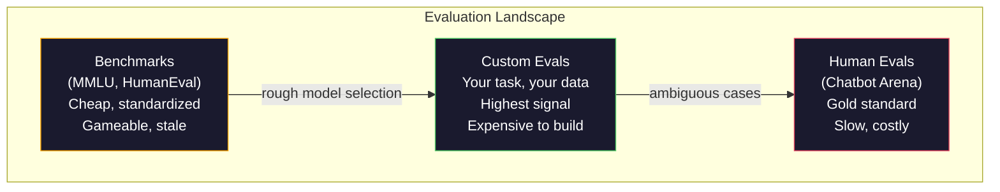
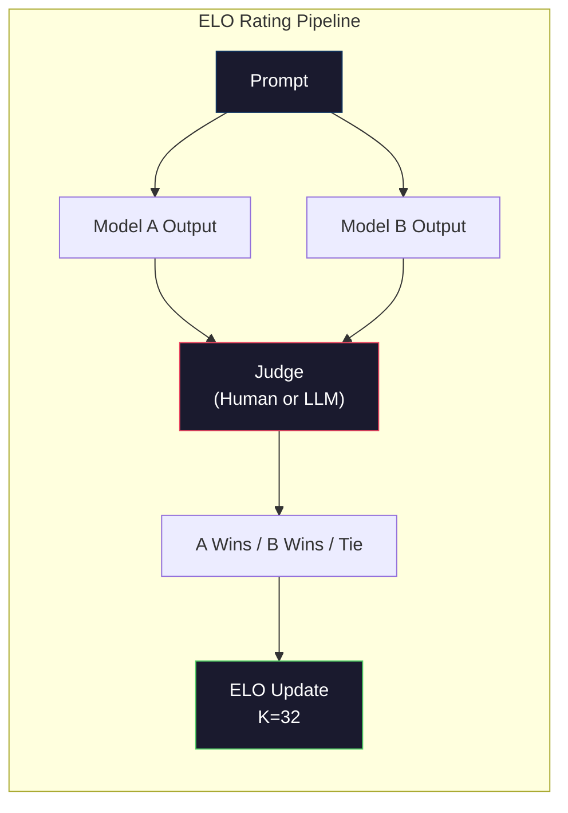

# Avaliação: Benchmarks, Evals, LM Harness.

> Lei de Goodhart: quando uma medida se torna um alvo, deixa de ser uma boa medida. Todos os jogos de laboratório fronteiriços são de referência. As pontuações da MMLU aumentam enquanto os modelos ainda não conseguem contar com confiança o número de Rs em "frango". A única avaliação que importa é a Vossa avaliação - em Vossa tarefa, com os Vossos dados.

> **【中文解读】**Quando um indicador se torna um objetivo, já não é um bom indicador.

> **【拓展：LLM评测→实际应用】**LLM 评测体系包括:MMLU (MMLU) 知识 (HumanEval) 代码 (MATH) 数学 (Math)  Arena (Math)  Adesão humana (MATH)  Mas a principal aplicação é a avaliação de você mesmo em suas próprias tarefas e dados.

> - Não .**【前置】**學本节前 請先掌握:Fase 10·01-05 LLM 基礎);Fase 11·10 評估) 生产 LLM 应用的评估──本节聚焦模型本身的评估──

> - Não .**【类比】**Referência geral = Referência geral: Referência geral: Referência geral: Referência geral: Referência geral: Referência geral: Referência geral: Referência geral: Referência geral: Referência geral: Referência geral: Referência geral: Referência geral: Referência geral: Referência geral: Referência geral: Referência geral: Referência geral: Referência geral: Referência geral: Referência geral: Referência geral: Referência geral: Referência geral: Referência geral: Referência geral: Referência geral: Referência geral: Referência geral: Referência geral: Referência geral: Referência geral: Referência geral: Referência geral: Referência geral: Referência geral: Referência geral: Referência geral: Referência geral: Referência geral: Referência geral: Referência geral: Referência geral: Referência geral: Referência geral: Referência geral: Referência geral: Referência geral: Referência geral: Referência geral: Referência geral: Referência geral: Referência geral: Referência geral: Referência geral: Referência geral: Referência geral: Referência geral: Referência geral: Referência geral: Referência geral: Referência geral: Referência geral: Referência geral: Referência geral: Referência geral: Referência geral: Referência geral: Referência geral: Referência geral: Referência geral: Referência geral: Referência geral: Referência geral: Referência geral: Referência geral: Referência geral: Referência geral: Referência geral: Referência geral: Reference to Reference to Reference to Reference to Reference to Reference to Reference to Reference to Reference to Reference to Reference to Reference to Reference to Reference to Reference to Reference to Reference to Reference to Reference to Reference to Reference to Reference to Reference to Reference to Reference to Reference to Reference to Reference to Reference to Reference to Reference to Reference to Reference to Reference to Reference to Reference to Reference to Reference to Reference to Reference to Reference to Reference to Reference to Reference to Reference to Reference to Reference to Reference to Reference to Reference to Reference to Reference to Reference to Reference to Reference to Reference to Reference to Reference to Reference to Reference to Reference to Reference to

**Type:** Build
**Languages:** Python
**Prerequisites:** Phase 10, Lessons 01-05 (LLMs from Scratch)
**Time:** ~90 minutes

## Objetivos de aprendizagem

- Construir um arame de avaliação personalizado que execute referências de escolha múltipla e de limite aberto contra um modelo de linguagem
  Construir ferramentas de avaliação de auto-definição, para o modelo de linguagem operação de múltiplos temas e um teste de base aberto
- Explicar por que os valores-relatores padrão (MMLU, HumanEval) saturam e não diferenciam os modelos de fronteira
  解释为什么标准基准(MMLU、HumanEval) 会和且无法区分前沿模型
- Implementar avaliações específicas de tarefas com métricas adequadas: correspondência exacta, F1, BLEU e pontuação de LLM-as-judge
  实现带正确指标的任务特定评测:精确匹配、F1、BLEU 和 LLM-as-judge 评分
- Desenhar uma suíte de avaliação personalizada voltada para o seu caso de uso específico em vez de confiar apenas em quadros de classificação públicos
  Designado para um conjunto de avaliações de auto-definição de casos específicos, e não apenas dependendo da classificação pública

> **【中文解读】**O MMA  avaliação de engenharia prática.

## O problema é o problema da introdução

O MMLU foi publicado em 2020 com 15.908 perguntas em 57 assuntos. Em três anos, os modelos de fronteira saturaram-no. GPT-4 obteve 86,4%. Claude 3 Opus obteve 86,8%. Llama 3 405B obteve 88,6%.

> MMLU  foi lançado em 2020, contendo 15.908 questões de 57 disciplinas. Em três anos, o modelo da frente foi lançado em 86,4%, o GPT-4 ganhou 86,4%, o Claude 3 Opus ganhou 86,8%, o Llama 3 405B ganhou 88,6%.

Enquanto isso, esses mesmos modelos falham em tarefas que uma criança de 10 anos lida sem pensar. Claude 3.5 Sonnet, com uma pontuação de 88,7% na MMLU, inicialmente não podia contar as letras em "frango" -- uma tarefa que requer zero conhecimento do mundo e zero raciocínio, apenas iteração de nível de personagens. O HumanEval testa a geração de código com 164 problemas. Os modelos têm 90% mais, enquanto ainda produzem código que cai em casos de borda que qualquer desenvolvedor mais novo apanha.

> Ao mesmo tempo, esses modelos falharam na tarefa que os filhos de 10 anos não pensavam que podiam completar. Claude 3.5 Sonnet MMLU obteve 88.7% de pontuação, mas inicialmente não conseguia contar "frutas-frutas" em algumas r Esta tarefa não precisava de qualquer conhecimento ou raciocínio mundial, apenas de nível de caracteres. HumanEval usou 164 problemas para testar código gerado.

A diferença entre o desempenho dos índices de referência e a confiabilidade do mundo real é o problema central da avaliação do MLL. Os índices de referência dizem como um modelo funciona no índice de referência. Eles não dizem quase nada sobre como esse modelo irá executar em sua tarefa específica, com os seus dados específicos, sob os seus modos de falha específicos. Se você está a construir um bot de suporte ao cliente, o MMLU é irrelevante. Se estiver a construir um assistente de código, o HumanEval só abrange a geração de nível de função - não diz nada sobre depurar, refactorar ou explicar código em arquivos.

> A relação entre o desempenho de base e a confiabilidade do mundo real é o problema central da avaliação do LLM. O modelo de base diz-te o desempenho do modelo em base. Eles quase não dizem nada sobre como o modelo se manifestará em suas tarefas específicas, dados específicos, e informações sobre como o modelo irá se manifestar em um modelo de fracasso específico. Se você estiver construindo um cliente de suporte para o mundo, o MMLU não é importante. Se estiver construindo um assistente de código, o HumanEval só cobre a geração de funções de nível para a configuração, reconstrução ou trans-código de arquivo.

Precisamos de avaliações personalizadas. Não porque os benchmarks sejam inúteis - são úteis para a seleção aproximada de modelos - mas porque a avaliação final deve corresponder exatamente às condições de implantação.

> Você precisa se auto-avaliação. Não porque o base não seja útil para escolher um modelo grosseiro, mas porque a avaliação final deve se adequar completamente às condições de sua implantação.

> **【中文解读】**基准分数与真世界可靠性之间的沟是 LLM 评估的核心问题──GPT-4 MMLU 86.4%、Claude 3 Opus 86.8%、Llama 3 405B 88.6%3 分差距是统计噪音──但这些模型在"Number strawberry 里有几个 r"这样的简单任务中仍然失败──基准告诉你模型在基准上的表现,几乎没有说什么关于它在你的具体任务上表现的信息──

> **【拓展：Arena 评测与 Elo 评分】**Chatbot Arena(LMSYS) usando a culta Elo 评分人类用户与两个匿名模型对话并投票选择更好的回复──这是目前公认的最可靠模型排名方式──GPT-4o、Claude 3.5 Sonnet、Gemini 1.5 Pro 在 Arena 上的 Elo 分数差距更真实地反映实际使用体验──

## O conceito central.

### A paisagem de Eval

Existem três categorias de avaliação, cada uma com um custo e uma qualidade de sinal diferentes.

> Há três tipos de avaliação, cada um com diferentes custos e qualidade de sinal.

**Benchmarks**Os modelos de teste são padronizados. MMLU, HumanEval, SWE-bench, MATH, ARC, HellaSwag. Você executa um modelo contra o índice de referência e obtém uma pontuação. A vantagem: todos usam o mesmo teste, para que você possa comparar os modelos. A desvantagem: modelos e dados de treinamento contaminam cada vez mais esses índices de referência. Os laboratórios treinam em dados que incluem perguntas de referência. As pontuações aumentam. A capacidade pode não.

> **基准**É um conjunto de testes padronizados. MMLU, HumanEval, SWE-bench, MATH, ARC, HellaSwag, você tem um modelo de base de dados e ganha uma quantidade de dados.

**Custom evals**Os dados de teste são os que você constrói para seu caso de uso específico. Você define as entradas, as saídas esperadas e a função de pontuação. Um resumo de documento legal é avaliado em documentos legais. Um gerador de SQL é avaliado em seu esquema de banco de dados. Estes são caros de criar, mas são a única avaliação que prevê o desempenho da produção.

> **自定义评估**É o que você define como um conjunto de testes construídos para um caso específico. Você define a entrada, a expectativa de saída e a função de avaliação.

**Human evals**O Chatbot Arena tem coletado mais de 2 milhões de votos de preferência humana em mais de 100 modelos.$0.10-$- 2,00 por acórdão) e velocidade (horas a dias).

> **人工评估**Utilize pay fee marker baseada na utilidade, corretão, fluidez e segurança, etc. É o padrão de ouro de uma missão de avaliação automática que não é bem sucedida. Chatbot Arena reuniu mais de 200 milhões de votos de preferência de classe pessoal, abrangendo mais de 100 modelos.$0.10-$2.00) e velocidade (((várias horas a várias semanas)



### Por que os índices de referência se quebram

Três mecanismos fazem com que as pontuações de referência deixem de refletir a capacidade real.

> Três mecanismos levam a que o número de bases não reflita a capacidade real.

**Data contamination.**Os corpos de treinamento raspam a internet. As perguntas de referência estão em directo na internet. Os modelos veem as respostas durante o treinamento. Isto não é fazer trampa no sentido tradicional - os laboratórios não incluem intencionalmente dados de referência. Mas a raspação em escala web torna quase impossível excluir.

> **数据污染。**                                                                                                                                                                                                                                                              

**Teaching to the test.**Os laboratórios otimizam as misturas de treinamento para o desempenho de referência. Se 5% da mistura de treinamento é uma escolha múltipla de estilo MMLU, o modelo aprende o formato e a distribuição da resposta. MMLU é uma escolha múltipla de quatro vias. Os modelos aprendem que a distribuição da resposta é aproximadamente uniforme em A / B / C / D, o que ajuda mesmo quando o modelo não conhece a resposta.

> **应试训练。**实验室为基准性能优化训练混合――如果5%的训练混合是MMLU风格的多选题,模型就学会了形式和答案分布――MMLU é quatro选一――模型学到答案分布大致均分布在A/B/C/D,这甚至有助于模型不知道答案时猜――

**Saturation.**Quando cada modelo de fronteira obtém uma pontuação de 85-90% em um índice de referência, o índice de referência deixa de discriminar. Os restantes 10-15% das perguntas podem ser ambíguas, erroneamente rotuladas ou exigir conhecimento obscuro do domínio. Melhorar de 87% para 89% no MMLU pode significar que o modelo memorizou duas perguntas mais obscuras, não que se tornou mais inteligente.

> **饱和。**Quando o modelo da linha de frente tem uma pontuação de 85-90% no seu ponto de partida, o ponto de partida deixa de ser diferenciado. Os problemas do restante 10-15% podem ser diferenciados, marcar erros ou necessitar de conhecimento no campo do frio.

### Perplexidade: um rápido exame de saúde

A perplexidade mede o quão surpreendente um modelo é por uma sequência de tokens.

> O modelo de medida de confusão é um índice de média negativa para número semelhante:

```
PPL = exp(-1/N * sum(log P(token_i | context)))
```

Uma perplexidade de 10 significa que o modelo é, em média, tão incerto quanto escolher uniformemente entre 10 opções em cada posição de token. Baixo é melhor. GPT-2 obtém uma perplexidade de ~30 no WikiText-103. GPT-3 obtém ~20. Llama 3 8B obtém ~7.

> 困惑度 10 significa modelo em média em cada token 位置的不确定性相当于在 10 个选项中均选择──越低越好──GPT-2 在 WikiText-103 上困惑度约30──GPT-3 约20──Llama 3 8B 约7──

A perplexidade é útil para comparar modelos no mesmo conjunto de testes, mas tem pontos cegos. Um modelo pode ter baixa perplexidade por ser bom em prever padrões comuns, enquanto ser terrível em padrões raros, mas importantes. Também não diz nada sobre a instrução seguindo, raciocínio ou precisão factual.

> A confusão é útil quando comparada com um modelo no mesmo conjunto de testes, mas tem pontos cegos. O modelo pode obter baixa confusão por meio de um bom modelo de previsão comum, mas pode ser muito ruim em um modelo raro, mas importante. Também não pode explicar a instrução de seguir, raciocínio ou precisão de fato.

### Mestrado em Direito

Use um modelo forte para avaliar a produção de um modelo mais fraco. A ideia é simples: peça ao GPT-4o ou Claude Sonnet para avaliar uma resposta em uma escala de 1-5 para corretura, utilidade e segurança. Isso custa cerca de $0,01 por julgamento com o GPT-4o-mini e correlaciona-se surpreendentemente bem com os julgamentos humanos - cerca de 80% de acordo na maioria das tarefas.

> Usar um modelo forte para avaliar a saída de um modelo fraco. A ideia é muito simples: fazer o GPT-4o ou Claude Sonnet em 1-5% de avaliação sobre a corretura, utilidade e segurança. Usar o GPT-4o-mini por julgamento de cerca de US$ 0,01 por hora, a correlação com o julgamento humano é bem estranha.

O prompt de pontuação importa mais do que o modelo. Um prompt vaga ("Rate this response") produz pontuações barulhentas. Um prompt estruturado com uma rubrica ("Score 5 se a resposta é factualmente correta e cita uma fonte, 4 se correta, mas não citada, 3 se parcialmente correta...") produz pontuações consistentes e reprodutíveis.

> 评分快点比模型更重要──模糊的快点("dá este回复打分") produz杂的分数──带有评分标准的结构化快点("Se o fato da resposta for certo e citado por 5 分, correct, mas não por 4 分,部分正确打 3 分...") produz杂的分数──可复现的分数──

Modos de falha: os modelos de juiz mostram preconceito de posição (preferem a primeira resposta em comparações em pares), preconceito de verbosidade (preferem respostas mais longas) e auto-preferência (GPT-4 avalia GPT-4 de saída superior a Claude equivalentes).

> 失败模式: avaliação modelo exhibits position bias (→ "preferências em comparação") 冗长偏见 (→ "preferências em comparação") 冗长偏见 (→ "preferências em comparação") 冗长偏见 (→ "preferências em comparação") 冗长偏见 (→ "preferências em comparação") 冗长偏见 (→ "preferências em comparação") 冗长偏见 (→ "preferências em comparação") 冗长偏见 (→ "preferências em comparação") 冗长偏见 (→ "preferências em comparação") 冗长偏见 (→ "preferências em comparação") 冗长偏见 (→ "preferências em comparação") 冗长偏见 (→ "preferências em comparação") 冗长偏见 (→ "preferências em comparação") 冗长偏见 (→ "preferências em comparação") 冗长偏见") 冗长偏见 (→ "preferências em comparação") 冗长偏见) 冗长偏见 (→ "preferências em comparação) 冗长偏见) 冗长偏见) 冗长偏见 (→ "g) △ GPT-4) △ GPT-4: "GPT: "GPT: "GPT: "GPT: "GPT: "GPT: "GPT: "GPT: "GPT: "GPT: "GPT: "GPT: "GPT: "GPT: "GPT: "GPT: "GPT: "GPT: "GPT: "GPT: "GPT: "GPT: "GPT: "GPT: "GPT: "GPT: "GPT: "GPT: "GPT: "GPT: "GPT: "GPT: "GPT: "GPT: "GPT: "GPT: "GPT: "GPT: "GPT: "GPT: "GPT: "GPT: "GPT: "GPT: "GPT: "GPT: "GPT: "GPT: "GPT: "GPT: "GPT: "GPT: "GPT: "GPT: "

### Classificações ELO de comparações de pares

A abordagem do Chatbot Arena. Mostre duas respostas ao mesmo pedido de diferentes modelos. Um humano (ou juiz de LLM) escolhe o melhor. De milhares dessas comparações, calcula uma classificação ELO para cada modelo - o mesmo sistema usado em xadrez.

> Método de Chatbot Arena. O show vem de diferentes modelos para duas repetições do mesmo prompt.

Vantagens do ELO: o ranking relativo é mais confiável do que a pontuação absoluta, lida com ligações graciosamente e converge com menos comparações do que marcar cada saída de forma independente.

> ELO  vantagem: em comparação com o ranking é mais confiável do que o absolute rating, o sistema operacional é mais fácil de lidar com, recebe menos vezes do que o independent rating.



### Estruturas equivalentes

**lm-evaluation-harness**(EleutherAI): o framework de avaliação de código aberto padrão. Suporta 200+ benchmarks. Execute qualquer modelo de Hugging Face contra MMLU, HellaSwag, ARC, etc. com um comando. usado pelo Open LLM Leaderboard.

> **lm-evaluation-harness**(EleutherAI): standar open source评测框架──支持 200+ 基准──一条命令对任何 Hugging Face 模型运行 MMLU、HellaSwag、ARC等──Open LLM Leaderboard 使用──

**RAGAS**A avaliação da qualidade de informação e de informação é uma das principais medidas de avaliação da qualidade de informação e da informação.

> **RAGAS**A resposta é corretamente correlacionada com o problema?

**promptfoo**A avaliação é feita com base em configuração para engenharia de prompt. Defina casos de teste em YAML, corre contra vários modelos, obtenha um relatório de passagem/falha. Útil para instruções de teste de regressão - certifique-se de que uma alteração de prompt não quebra casos de teste existentes.

> **promptfoo**O método de avaliação de um modelo é utilizado para determinar o tipo de teste que deve ser executado.

### Construir Evals à Custom

A única avaliação que importa para a produção.

> O único importante em produção:

1. **Define the task.**O que exatamente deve fazer o modelo? Seja preciso. "Responda às perguntas" é muito vaga. "Dado um e-mail de reclamação do cliente, extrair o nome do produto, categoria do problema e sentimento" é uma tarefa que você pode avaliar.
   Tradução do português:**定义任务。**模型到底应该做什么?要精确――" responder a questão"太模糊――"给定客户投诉邮件,提取产品名称、问题类别和情感" é uma tarefa avaliável――

2. **Create test cases.**Minimo 50 para um prototipo de avaliação, 200+ para produção. Cada caso de teste é um par (input, expected_output). Incluir casos de borda: entradas vazias, entradas adversárias, entradas ambíguas, entradas em outras línguas.
   Tradução do português:**创建测试用例。**O primeiro tipo de avaliação é de 50 avaliações, produzindo 200+. Cada teste é usado em casos de (entrada, espera, saída) para:

3. **Define scoring.**A combinação exacta para as saídas estruturadas. BLEU/ROUGE para a semelhança de texto. LLM-as-judge para a qualidade aberta. F1 para tarefas de extracção. Combine múltiplas métricas com pesos.
   Tradução do português:**定义评分。**结构化输出用精确匹配──文本相似度用 BLEU/ROUGE──开放式质量用 LLM-as-judge──抽取任务用 F1──组合多个指标并加权──

4. **Automate.**Cada avaliação é executada com um comando, sem passos manuais, armazenando resultados em um formato que permite comparação ao longo do tempo.
   Tradução do português:**自动化。**Cada avaliação é executada em um formato de armazenamento de dados.

5. **Track over time.**Uma pontuação de avaliação não tem sentido em isolamento. Você precisa da linha de tendência. A pontuação melhorou após a última mudança de aviso? Regressou após a mudança de modelos? Versionar sua avaliação ao lado de suas instruções.
   Tradução do português:**追踪趋势。**评测分数 isolação看无意义──你需要趋势线── 上次提示更改后分数是否升升? 换模后退步了吗?

| Eval Type | Cost per judgment | Agreement with humans | Best for |
|-----------|------------------|----------------------|----------|
| Exact match / 精确匹配 | ~$0 | 100% (when applicable) / 100%（适用时） | Structured output, classification / 结构化输出、分类 |
| BLEU/ROUGE | ~$0 | ~60% | Translation, summarization / 翻译、摘要 |
| LLM-as-judge / LLM 评审 | ~$0.01 | ~80% | Open-ended generation / 开放式生成 |
| Human eval / 人工评估 | $0.10-$2.00 | N/A (is the ground truth) / N/A（即真实标准） | Ambiguous, high-stakes tasks / 有歧义、高风险任务 |

## Construí-lo e realizei-o.
```figure
perplexity-loss
```

## Construí-lo

### Passo 1: Um quadro mínimo de igualdade

Defina as abstrações principais. Um caso de eval tem uma entrada, uma saída esperada e um ditado opcional de metadados. Um marcador toma uma previsão e uma referência e retorna uma pontuação entre 0 e 1.

> 定義核心抽象──評測例有输入、期望输出和可选的元数据字典──評分器接受预测和参考并返回 0 到 1 之间的分数──

```python
import json
from collections import Counter

class EvalCase:
    def __init__(self, input_text, expected, metadata=None):
        self.input_text = input_text
        self.expected = expected
        self.metadata = metadata or {}

class EvalSuite:
    def __init__(self, name, cases, scorers):
        self.name = name
        self.cases = cases
        self.scorers = scorers

    def run(self, model_fn):
        results = []
        for case in self.cases:
            prediction = model_fn(case.input_text)
            scores = {}
            for scorer_name, scorer_fn in self.scorers.items():
                scores[scorer_name] = scorer_fn(prediction, case.expected)
            results.append({
                "input": case.input_text,
                "expected": case.expected,
                "prediction": prediction,
                "scores": scores,
            })
        return results
```

### Passo 2: pontuação das funções

Construir uma correspondência exata, um token F1, e um marcador de LLM como juiz simulado.

> 构建精确匹配、代码 F1 和模拟的 LLM-as-judge 评分器──

```python
def exact_match(prediction, expected):
    return 1.0 if prediction.strip().lower() == expected.strip().lower() else 0.0

def token_f1(prediction, expected):
    pred_tokens = set(prediction.lower().split())
    exp_tokens = set(expected.lower().split())
    if not pred_tokens or not exp_tokens:
        return 0.0
    common = pred_tokens & exp_tokens
    precision = len(common) / len(pred_tokens)
    recall = len(common) / len(exp_tokens)
    if precision + recall == 0:
        return 0.0
    return 2 * (precision * recall) / (precision + recall)

def llm_judge_simulated(prediction, expected):
    pred_words = set(prediction.lower().split())
    exp_words = set(expected.lower().split())
    if not exp_words:
        return 0.0
    overlap = len(pred_words & exp_words) / len(exp_words)
    length_penalty = min(1.0, len(prediction) / max(len(expected), 1))
    return round(overlap * 0.7 + length_penalty * 0.3, 3)
```

### Passo 3: Sistema de classificação ELO

Implementar comparações em pares com atualizações ELO. Este é exatamente o sistema Chatbot Arena usa para classificar modelos.

> 实现带 ELO 更新成对比较──这是Chatbot Arena的系统来排名模型──

```python
class ELOTracker:
    def __init__(self, k=32, initial_rating=1500):
        self.ratings = {}
        self.k = k
        self.initial_rating = initial_rating
        self.history = []

    def _ensure_player(self, name):
        if name not in self.ratings:
            self.ratings[name] = self.initial_rating

    def expected_score(self, rating_a, rating_b):
        return 1 / (1 + 10 ** ((rating_b - rating_a) / 400))

    def record_match(self, player_a, player_b, outcome):
        self._ensure_player(player_a)
        self._ensure_player(player_b)

        ea = self.expected_score(self.ratings[player_a], self.ratings[player_b])
        eb = 1 - ea

        if outcome == "a":
            sa, sb = 1.0, 0.0
        elif outcome == "b":
            sa, sb = 0.0, 1.0
        else:
            sa, sb = 0.5, 0.5

        self.ratings[player_a] += self.k * (sa - ea)
        self.ratings[player_b] += self.k * (sb - eb)

        self.history.append({
            "a": player_a, "b": player_b,
            "outcome": outcome,
            "rating_a": round(self.ratings[player_a], 1),
            "rating_b": round(self.ratings[player_b], 1),
        })

    def leaderboard(self):
        return sorted(self.ratings.items(), key=lambda x: -x[1])
```

### Passo 4: Calculação de perplexidade

Compute perplexidade usando probabilidades de token. na prática você obtém estes dos logits do modelo. Aqui simulamos com uma distribuição de probabilidade.

> Utilize token 概率计算困惑度──实践中你从模型的逻辑中获取这些值──这里我们使用概率分布模拟──

```python
import numpy as np

def perplexity(log_probs):
    if not log_probs:
        return float("inf")
    avg_neg_log_prob = -np.mean(log_probs)
    return float(np.exp(avg_neg_log_prob))

def token_log_probs_simulated(text, model_quality=0.8):
    np.random.seed(hash(text) % 2**31)
    tokens = text.split()
    log_probs = []
    for i, token in enumerate(tokens):
        base_prob = model_quality
        if len(token) > 8:
            base_prob *= 0.6
        if i == 0:
            base_prob *= 0.7
        prob = np.clip(base_prob + np.random.normal(0, 0.1), 0.01, 0.99)
        log_probs.append(float(np.log(prob)))
    return log_probs
```

### Passo 5: Resultados agregados

Compute estatísticas de resumo em uma execução de avaliação: média, média, taxa de aprovação em um limiar e desagregações por métrica.

> 計算評测运行的汇總计: 平均值、中位数、值通过率和每指标细分──

```python
def summarize_results(results, threshold=0.8):
    all_scores = {}
    for r in results:
        for metric, score in r["scores"].items():
            all_scores.setdefault(metric, []).append(score)

    summary = {}
    for metric, scores in all_scores.items():
        arr = np.array(scores)
        summary[metric] = {
            "mean": round(float(np.mean(arr)), 3),
            "median": round(float(np.median(arr)), 3),
            "std": round(float(np.std(arr)), 3),
            "min": round(float(np.min(arr)), 3),
            "max": round(float(np.max(arr)), 3),
            "pass_rate": round(float(np.mean(arr >= threshold)), 3),
            "n": len(scores),
        }
    return summary

def print_summary(summary, suite_name="Eval"):
    print(f"\n{'=' * 60}")
    print(f"  {suite_name} Summary")
    print(f"{'=' * 60}")
    for metric, stats in summary.items():
        print(f"\n  {metric}:")
        print(f"    Mean:      {stats['mean']:.3f}")
        print(f"    Median:    {stats['median']:.3f}")
        print(f"    Std:       {stats['std']:.3f}")
        print(f"    Range:     [{stats['min']:.3f}, {stats['max']:.3f}]")
        print(f"    Pass rate: {stats['pass_rate']:.1%} (threshold >= 0.8)")
        print(f"    N:         {stats['n']}")
```

### Passo 6: Caminhe o oleoduto completo

Defina uma tarefa, crie casos de teste, simule dois modelos, execute avaliações, compute o ELO a partir de comparações em pares e imprima o ranking.

> Para definir tarefas, criar testes e exemplos, modelar dois modelos, executar avaliações, fazer comparações com ELO e imprimir uma lista de resultados.

```python
def demo_model_good(prompt):
    responses = {
        "What is the capital of France?": "Paris",
        "What is 2 + 2?": "4",
        "Who wrote Hamlet?": "William Shakespeare",
        "What language is PyTorch written in?": "Python and C++",
        "What is the boiling point of water?": "100 degrees Celsius",
    }
    return responses.get(prompt, "I don't know")

def demo_model_bad(prompt):
    responses = {
        "What is the capital of France?": "Paris is the capital city of France",
        "What is 2 + 2?": "The answer is four",
        "Who wrote Hamlet?": "Shakespeare",
        "What language is PyTorch written in?": "Python",
        "What is the boiling point of water?": "212 Fahrenheit",
    }
    return responses.get(prompt, "Unknown")

cases = [
    EvalCase("What is the capital of France?", "Paris"),
    EvalCase("What is 2 + 2?", "4"),
    EvalCase("Who wrote Hamlet?", "William Shakespeare"),
    EvalCase("What language is PyTorch written in?", "Python and C++"),
    EvalCase("What is the boiling point of water?", "100 degrees Celsius"),
]

suite = EvalSuite(
    name="General Knowledge",
    cases=cases,
    scorers={
        "exact_match": exact_match,
        "token_f1": token_f1,
        "llm_judge": llm_judge_simulated,
    },
)

results_good = suite.run(demo_model_good)
results_bad = suite.run(demo_model_bad)

print_summary(summarize_results(results_good), "Model A (concise)")
print_summary(summarize_results(results_bad), "Model B (verbose)")
```

O modelo "bom" dá respostas exatas. O modelo "mau" dá parafrases verbais. A correspondência exata puniu severamente o modelo verbais. O token F1 e o LLM como juiz são mais perdoadores. Isso ilustra por que a escolha métrica importa: o mesmo modelo parece ótimo ou terrível dependendo de como você o pontua.

> O modelo "bom" dá uma resposta precisa. O modelo "mau" dá uma resposta precisa. O modelo "crude" dá uma resposta precisa. O modelo "crude" dá uma resposta precisa.

### Passo 7: Torneio ELO

Faça comparações em pares entre modelos em várias rodadas.

> Comparar entre modelos de operações em volumes.

```python
elo = ELOTracker(k=32)

for case in cases:
    pred_a = demo_model_good(case.input_text)
    pred_b = demo_model_bad(case.input_text)

    score_a = token_f1(pred_a, case.expected)
    score_b = token_f1(pred_b, case.expected)

    if score_a > score_b:
        outcome = "a"
    elif score_b > score_a:
        outcome = "b"
    else:
        outcome = "tie"

    elo.record_match("model_a_concise", "model_b_verbose", outcome)

print("\nELO Leaderboard:")
for name, rating in elo.leaderboard():
    print(f"  {name}: {rating:.0f}")
```

### Passo 8: Perplexidade Comparativa

Compare a perplexidade entre "modelos" de diferentes níveis de qualidade.

> Confusão do "modelo" em relação a diferentes níveis de qualidade:

```python
test_text = "The quick brown fox jumps over the lazy dog in the garden"

for quality, label in [(0.9, "Strong model"), (0.7, "Medium model"), (0.4, "Weak model")]:
    log_probs = token_log_probs_simulated(test_text, model_quality=quality)
    ppl = perplexity(log_probs)
    print(f"  {label} (quality={quality}): perplexity = {ppl:.2f}")
```

## Use-o com o framework implementado.

### - Valorização de uso (EleutherAI)

A ferramenta padrão para executar valores de referência em qualquer modelo.

> Em qualquer modelo, executar ferramentas padrão de base.

```python
# pip install lm-eval
# Command line:
# lm_eval --model hf --model_args pretrained=meta-llama/Llama-3.1-8B --tasks mmlu --batch_size 8

# Python API:
# import lm_eval
# results = lm_eval.simple_evaluate(
#     model="hf",
#     model_args="pretrained=meta-llama/Llama-3.1-8B",
#     tasks=["mmlu", "hellaswag", "arc_easy"],
#     batch_size=8,
# )
# print(results["results"])
```

### promptfoo

Defina testes em YAML e execute contra vários provedores.

> 配置驱动的提示 工程评测── define test并对多供应商运行在YAML 中.

```yaml
# promptfoo.yaml
providers:
  - openai:gpt-4o-mini
  - anthropic:claude-3-haiku

prompts:
  - "Answer in one word: {{question}}"

tests:
  - vars:
      question: "What is the capital of France?"
    assert:
      - type: contains
        value: "Paris"
  - vars:
      question: "What is 2 + 2?"
    assert:
      - type: equals
        value: "4"
```

### RAGAS para avaliação de RAG

```python
# pip install ragas
# from ragas import evaluate
# from ragas.metrics import faithfulness, answer_relevancy, context_precision
#
# result = evaluate(
#     dataset,
#     metrics=[faithfulness, answer_relevancy, context_precision],
# )
# print(result)
```

O RAGAS mede o que os avaliadores genéricos não têm: se a resposta do modelo está fundamentada no contexto recuperado, não apenas se a resposta é "correcta" no abstracto.

> RAGAS Messagem geral  avaliação geral  遗漏的东西: a resposta do modelo se baseia na pesquisa no texto abaixo, e não apenas se a resposta é "correcta" em sentido abstrato.

## Envia-o . Produto .

Esta lição produz`outputs/prompt-eval-designer.md`-- um prompt reutilizável que desenha conjuntos de avaliação personalizados para qualquer tarefa. Dê-lhe uma descrição da tarefa e ele gera casos de teste, funções de pontuação e uma recomendação de limiar de passagem / falha.

> 本课产 出 `outputs/prompt-eval-designer.md` Um prompt de repetição, para qualquer tarefa desenhada, define-se como um conjunto de avaliações.

Também produz `outputs/skill-llm-evaluation.md`-- um quadro de decisão para escolher a estratégia de avaliação certa com base no tipo de tarefa, orçamento e requisitos de latência.

> Outro produto`outputs/skill-llm-evaluation.md` Seleção de um quadro de decisão para a estratégia de avaliação correta com base no tipo de tarefa, orçamento e demanda de atraso.

## Exercícios.

1. Adicione um marcador de "consistência" que corre a mesma entrada através do modelo 5 vezes e mede a frequência com que as saídas coincidem.
   Chinese Translation: Add" concordância "evadador, vai fazer a mesma entrada através do modelo de operação 5 vezes并测输出匹配的频率──确定性输入上的不一致答案揭露脆弱的快点或高温度设置──

2. Expanda o rastreador ELO para suportar múltiplas funções de juiz (paralelas exatas, F1, LLM-as-judge) e pesem-nas. Compare como o ranking muda quando você pesa paralelas exatas em relação a F1.
   O sistema de avaliação de dados é um sistema de avaliação de dados de dados de dados de dados de dados de dados de dados de dados de dados de dados de dados de dados de dados de dados de dados de dados de dados de dados de dados de dados de dados de dados de dados de dados de dados de dados de dados de dados de dados de dados de dados de dados de dados de dados de dados de dados de dados de dados de dados de dados de dados de dados de dados de dados de dados de dados de dados de dados de dados de dados de dados de dados de dados de dados de dados de dados de dados de dados de dados de dados de dados de dados de dados de dados de dados de dados de dados de dados de dados de dados de dados de dados de dados de dados de dados de dados de dados de dados de dados de dados de dados de dados de dados de dados de dados de dados de dados de dados de dados de dados de dados de dados de dados de dados de dados de dados de dados de dados de dados de dados de dados de dados de dados de dados de dados de dados de dados de dados de dados de dados de dados de dados de dados de dados de dados de dados de dados de dados de dados de dados de dados de dados de dados de dados de dados de dados de dados de dados de dados de dados de dados de dados de dados de dados de dados de dados de dados de dados de dados de dados de dados de dados de dados de dados de dados de dados de dados de dados de dados de dados de dados de dados de dados de dados de dados de dados de dados de dados de dados de dados de dados de dados de dados de dados de dados de dados de dados de dados de dados de dados de dados de dados de dados de dados de dados de dados de dados de dados de dados de dados de dados de dados de dados de dados de dados de dados de dados de dados de dados de dados de dados de dados de dados de dados de dados de dados de dados de dados de dados de dados de dados de dados de dados de dados de dados de dados de dados de dados de dados de dados de dados de dados de dados de dados de dados de dados de dados de dados de dados de dados de dados de dados de dados de dados de dados de dados de dados de dados de dados de dados de dados de dados de dados de dados de dados de dados de dados de dados de dados de dados de dados de dados de dados de dados de dados de dados de dados de dados de dados de

3. Crie um conjunto de avaliações para uma tarefa específica: classificação de e-mails em 5 categorias. Crie 100 casos de teste com exemplos diversos, incluindo casos de borda (e-mails que podem pertencer a várias categorias, e-mails vazios, e-mails em outras línguas). Messa como diferentes "modelos" (baseado em regras, correspondência de palavras-chave, LLM simulado) funcionam.
   Para uma tarefa específica, você pode criar 100 casos de teste, incluindo vários exemplos e circunstâncias de margem.

4. Implementar a detecção de contaminação: tendo em conta um conjunto de perguntas de avaliação e um corpo de formação, verifique a percentagem de perguntas de avaliação (ou parafrases próximas) que aparecem nos dados de formação.
   Tradução em chinês: implementar o teste de contaminação: given determined one group of assessment problems and training语料, check how many percent of evaluation problems (ou quase quase-liquidação) aparecem no treinamento dos dados.

5. Construir uma ferramenta de "modelo diferencial". Dados os resultados de avaliação de duas versões de modelo, salientar quais casos de teste específicos melhoraram, que regressaram e que permaneceram iguais. Este é o equivalente de avaliação de um código diferencial - essencial para entender se uma mudança ajudou ou prejudicou.
   Tradução do inglês para tradução do inglês: construir "model diff" tool── dados dois modelos de versão de avaliação, alta luz quais testes utilizam casos melhorados, quais retrocederam, quais permanecem inalterados── é o código da versão de avaliação para entender o que é mudar, ajuda ou dano.

## Termos-chave .

| Term | What people say | What it actually means | 中文释义 |
|------|----------------|----------------------|---------|
| MMLU | "The benchmark" | Massive Multitask Language Understanding -- 15,908 multiple choice questions across 57 subjects, saturated above 88% by 2025 | 大规模多任务语言理解，57 科目 15908 题选择题 |
| HumanEval | "Code eval" | 164 Python function-completion problems from OpenAI, tests only isolated function generation | 代码评估，164 个 Python 函数补全题 |
| SWE-bench | "Real coding eval" | 2,294 GitHub issues from 12 Python repos, measures end-to-end bug fixing including test generation | 真实编码评估，2294 个 GitHub issue 端到端修复 |
| Perplexity | "How confused the model is" | exp(-avg(log P(token_i given context))) -- lower means the model assigns higher probability to the actual tokens | 困惑度，越低表示模型预测越准确 |
| ELO rating | "Chess ranking for models" | A relative skill rating computed from pairwise win/loss records, used by Chatbot Arena to rank 100+ models | Elo 等级分，来自成对比较的相对技能评分 |
| LLM-as-judge | "Using AI to grade AI" | A strong model scores a weaker model's outputs against a rubric, ~80% agreement with human judges at ~$0.01/judgment | LLM 评审，用强模型给弱模型打分，约 $0.01/次 |
| Data contamination | "The model saw the test" | Training data includes benchmark questions, inflating scores without improving real capability | 数据污染，训练数据包含基准题目 |
| Eval suite | "A bunch of tests" | A versioned collection of (input, expected_output, scorer) triples that measure a specific capability | 评测套件，版本化的测试集合 |
| Pass rate | "What percentage it gets right" | Fraction of eval cases scoring above a threshold -- more actionable than mean score because it measures reliability | 通过率，得分超过阈值的用例比例 |
| Chatbot Arena | "Model ranking website" | LMSYS platform with 2M+ human preference votes, producing the most trusted LLM leaderboard via ELO ratings | Chatbot Arena，200 万+人类偏好投票的模型排名平台 |

## Mais leitura 延伸阅读

- [Hendrycks et al., 2021 -- "Measuring Massive Multitask Language Understanding"](https://arxiv.org/abs/2009.03300)- o artigo da MMLU, que continua a ser o ponto de referência mais citado para o LLM, apesar da sua saturação
- [Chen et al., 2021 -- "Evaluating Large Language Models Trained on Code"](https://arxiv.org/abs/2107.03374)-- o artigo HumanEval da OpenAI, estabeleceu uma metodologia de avaliação da geração de código
- [Zheng et al., 2023 -- "Judging LLM-as-a-Judge"](https://arxiv.org/abs/2306.05685)-- análise sistemática da utilização de LLM para avaliar LLM, incluindo as conclusões de viés de posição e viés de verbosidade
- [LMSYS Chatbot Arena](https://chat.lmsys.org/)-- plataforma de comparação de modelos com crowdsourced com 2M+ votos, o ranking mais confiável do mundo real LLM
