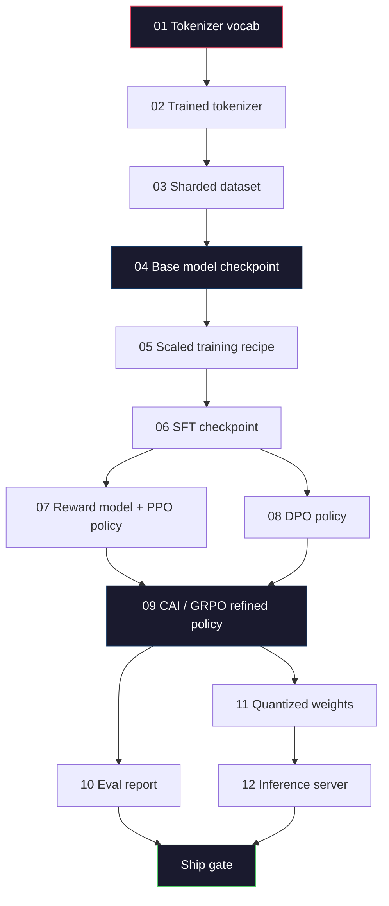
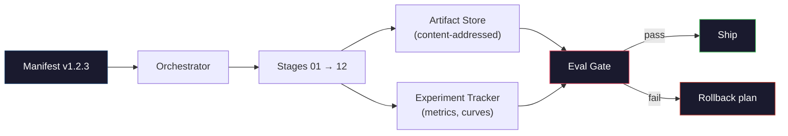

# Construir um oleoduto completo de LLM Construir um grande modelo de tubo completo

> Tudo, das lições 01 a 12, é uma fase de um pipeline. Esta lição é o andaime que transforma esses estágios em uma única corrida de ponta a ponta: tokenize, pre-trein, escala, SFT, alinhar, avaliar, quantizar, servir. Não treinarás um modelo 70B num laptop. Você vai produzir a camada de orquestração, o manifesto, o portal de avaliação e o plano de regresso que uma equipe de fronteira 2026 usa para decidir o que será enviado. Esta é a pedra angular.

> **【中文解读】**第 01-12 课一条管线的各个阶段──本课将它们串联为端到端运行:分词→预训→扩展→SFT→对齐→评估→量化→部署──你不会在笔记本上训练70B 模型,但你会出 2026年前沿团队用来决定发布什么编排层──

> **【拓展：端到端管线→生产实践】**O verdadeiro grande modelo produção de tubos também contém: dados versão gestão, experiência acompanhamento (W&B) modelo registro, A/B teste, re-rol plano.

> - Não .**【前置】**É a pedra angular da fase 10, requer que você complete a fase 10.01-12.

> - Não .**【类比】**完整LLM 管线 = 造车流水线. 前面 12 课学了每个工位. 发动机,装底盘,喷漆),本节是工厂设计师把这些工位按顺序串起来,加上"质检门" (质检门) "返工通道" (rollback) "生产计划表" (manifest) 你不会亲手制造70B 模型,但你会写出让团队批量生产70B 模型的"造车手册" (construção de "máquinas"), em que o projeto de produção será realizado em conformidade com o projeto de produção de 70B 模型.

**Type:** Build
**Languages:** Python (stdlib)
**Prerequisites:** All Phase 10 lessons 01-12
**Time:** ~120 minutes

## Objetivos de aprendizagem

- Compõem as onze lições anteriores (tokenizer, dados, pré-formação, escalação, SFT, RLHF, DPO, CAI, eval, quantização, inferência) em uma única especificação de pipeline reprodutível
  O que é o que se passa com o sistema de regulação de dados?
- Defina o contrato de artefatos entre fases: o que cada etapa consome, o que produz e como a próxima fase verifica a entrada
  定義阶段之间的产品契约: cada fase consume o que, produz o que, seguinte fase como verificar a entrada
- Construir um orquestrador que acompanhe experimentos, hashes artefatos, e portas de embarque decisões em limiares de avaliação
  Construir um organizador, acompanhar experiências e fazer decisões de avaliação e controle de valor
- Desenhar o plano de reestruturação: quais artefatos são baratos de reestruturar, quais caros e quanto custa um posto de controlo corrupto
  designbackrollplan: quais produtos são baratos, caros, danificados

## O problema é o problema da introdução

As lições anteriores funcionam cada vez. Tokenizer treinado. Mini GPT pré- treinado. SFT conjunto de dados montado. Modelo de recompensa treinado. DPO executado. Evals medidos. Pesos quantizados exportados. servidor de inferência espalhado. Cada um é um notebook. Cada um tem suas próprias convenções, seus próprios caminhos de saída, sua própria semente.

>  Previous classes respectivamente estão todos em funcionamento 分词器 trained 迷你 GPT 预训练  SFT 数据集组装 奖励模型 trained DPO 运行 评估测量 量权重导出 推理服务器启动 推理服务器启动 推理服务器启动 推理服务器启动 推理服务器启动 推理服务器启动 推理服务器启动 推理服务器启动 推理服务器启动 推理服务器启动 推理服务器启动 推理服务器启动 推理服务器启动 推理服务器启动 推理服务器启动 推理服务器启动 推理服务器启动 推理服务器启动 推理服务器启动 推理服务器启动 推理服务器启动 推理服务器启动 推理服务器启动 推理服务器启动 推理服务器启动 推理服务器启动 推理服务器启动 推理服务服务服务服务服务服务服务服务服务服务服务服务服务服务服务服务服务服务服务服务服务服务服务服务服务服务服务服务服务服务服务服务服务服务服务服务服务服务服务服务服务服务服务服务服务服务服务服务服务服务服务服务服务服务服务服务服务服务服务服务服务服务服务服务服务服务服务服务服务服务服务服务服务服务服务服务服务服务服务服务服务服务服务服务服务服务服务服务服务服务服务服务服务服务服务服务服务服务服务服务服务服务服务服务服务服务服务服务服务服务服务服务服务服务服务服务服务服务服务服务服务服务服务服务服务服务服务服务服务服务服务服务服务服务服务服务服务服务服务服务服务服务服务服务服务服务服务服务服务服务服务服务服务服务服务服务服务服务服务服务服务服务服务服务服务服务服务服务服务服务服务服务服务服务服务服务服务服务服务服务服务服务服务服务服务服务服务服务服务服务服务服务服务服务服务服务服务服务服务服务服务服务服务服务服务服务服务服务服务服务服务服务服务服务服务服务服务服务服务服务服务服务服务服务服务服务服务服务服务服务服务服务

Uma corrida de treinamento de fronteira não é um caderno. Llama 3 405B levou 30 milhões de horas H100 em aproximadamente 54 dias. O DeepSeek-V3 usou cerca de 2,8 milhões de horas H800. Durante esse tempo, um ponto de controlo corrupto, uma contaminação de dados, uma regressão de avaliação podem custar uma semana de relógio de parede e um mês de orçamento de GPU. A forma como as equipes sobrevivem é através da higiene do pipeline: cada etapa tem uma entrada determinista, uma saída determinista, um manifesto, um hash e um portal.

> A operação de treinamento da linha não foi um notebook. A Llama 3 405B usou cerca de 3.000 milhões de H100 horas, cerca de 54 dias. A DeepSeek-V3 usou cerca de 2.80 milhões de H800 horas. Durante esse período, um ponto de verificação de deterioração, uma contaminação de dados, uma avaliação de regresso, pode fazer com que a equipe perca uma semana de tempo de pendência e um mês de orçamento de GPU.

Esta é a pedra final. Você não vai executar o pipeline de ponta a ponta em um laptop. Você vai escrever o orquestrador que coordena os estágios, o manifesto que descreve a execução, o verificador que gate navios decisões, e o plano de repetição que permite a um terceiro re-executar o seu trabalho a partir de um único arquivo. O código é pequeno; a disciplina é grande.

> É um curso de ponta. Não vai trabalhar no seu notebook, de ponta a ponta. Você vai escrever um coordinador de cada fase, descrevendo o processo de execução, um verificador de decisão, bem como um plano de reestruturação de seu trabalho, de um único documento.

A escala do padrão varia de 100M a 1T, sem alterações. Os mesmos quatro componentes - manifesto, orquestrador, portal de avaliação, loja de artefatos - executam Llama 3 e também executam o seu hobby GPT. A diferença é o tamanho dos números dentro da configuração de cada estágio, não a forma do pipeline.

## O conceito central.

> **【中文解读】**Este curso irá integrar todos os componentes para um completo LLM  treinamento                                                                                                                                                                                                                                                                                                                                                                                                                                                                                                              

> **【拓展：完整管线的成本估算】** Treinar um modelo Llama 3 de classe 70B  custo de linha de tubo completo: pre-treinamento cerca de 200-500 milhões USD (GPU 时间), SFT cerca de 1-50.000 USD (Data tag), RLHF/DPO cerca de 5-10 milhões USD (Preference Data tag)                                                                                                                                                                                                                            


### As Doze Etapas

Cada lição da Fase 10 é uma fase.



As etapas 07 e 08 podem funcionar em paralelo. Tudo o resto é uma dependência dura. Uma mudança na etapa 02 (tokenizer) invalida todos os artefatos a jusante. Uma mudança na etapa 10 (eval) invalida apenas a decisão do navio.

> 阶段 07 和 08 可以并行运行──其他都是硬依赖──阶段 02(分词器) de mudanças faz todos os produtos abaixo não funcionar──阶段 10(评估) de mudanças só faz publicar decisões não funcionar──

### O Manifesto

Um manifesto é um único arquivo que descreve uma execução completamente o suficiente para repeti-la. Nada que o pipeline produz deve depender do estado que não está no manifesto. Os campos são chatos e obrigatórios.

```
pipeline_version: 1.2.3
seed: 42
git_commit: a1b2c3d4
stages:
  01_tokenizer:
    recipe: bpe_32k
    input_hash: sha256:...
    output_hash: sha256:...
    wall_clock_sec: 3600
    cost_usd: 12
```

O hash de saída do estágio N é o hash de entrada do estágio N + 1. Qualquer desvio e o pipeline para. É assim que você detecta a corrupção de dados cedo. É também como um colega de equipe em um continente diferente verifica que sua repetição produziu o mesmo artefato que o seu.

Na prática, as equipes usam um pequeno esquema YAML mais um verificador de manifesto que difere da execução anterior com sucesso. Qualquer delta fora dos campos esperados (custo, relógio de parede) é uma bandeira vermelha.

### Tipografia de artefatos

A saída de cada estágio é um artefato tipado, não um bloco de diretório, nem um picil, mas um tipo com nome com um esquema conhecido.

| Stage | Artifact Type | Key Fields |
|-------|--------------|-----------|
| 01-02 | Tokenizer | vocab.json, merges.txt, config.json, hash |
| 03 | Dataset | shards[], row count, token count, dedup stats |
| 04-05 | Checkpoint | weights.safetensors, config.json, optimizer state, step count |
| 06 | SFT Model | checkpoint + SFT recipe + data mix |
| 07 | Reward Model | RM checkpoint + preference data hash |
| 08-09 | Policy | checkpoint + reference hash + beta + KL budget consumed |
| 10 | Eval Report | benchmark scores + regression diffs + eval data hash |
| 11 | Quantized Model | quantized weights + calibration data + accuracy delta vs FP16 |
| 12 | Server Spec | endpoint + model hash + config + observability hooks |

A digitação impede o modo de falha mais comum: usar uma saída de estágio 08 como entrada de estágio 06, enviar um modelo treinado por DPO através do caminho SFT. Artefatos digitalizados e assinaturas digitalizadas fazem com que esses erros sejam falhas de compilação, não falhas de cinco dias.

### A Porta de Eval

O transporte não é "treinamento terminado". O transporte é "treinamento terminado e o portal de avaliação passado". O portal é definido antes do início da corrida.

```
gates:
  mmlu:      >= baseline + 0.5   # no regression
  humaneval: >= baseline + 1.0
  truthfulqa: >= baseline         # no drop
  safety_refusal_rate: <= 0.05
  kl_from_reference: <= 25.0
  cost_total_usd: <= 50000
```

Cada porta é um limite numérico. Não há portas "parecem boas". Não há assinaturas subjetivas. Se cada porta passa, o artefato é marcado como enviável. Se qualquer porta falhar, a corrida é realizada pendente de uma revisa explícita por um revisor nomeado, que é registrado no manifesto.

O sistema de regulação da produção de produtos de base é um sistema de regulação de preços que permite a utilização de um sistema de regulação de preços.

### O Orquestrador

Um pequeno pedaço de código que lê o manifesto, despacha etapas, rastreia artefatos e detém qualquer violação de contrato.

O trabalho do orquestrador é estreito:

1. Resolva o dia da data do manifesto.
2. Para cada etapa, verifique se a saída esperada já existe no hash correto (salte se sim).
3. Caminhar o palco, capturar o estdout/stderr, medir o relógio da parede e o custo.
4. Verifique o hash de saída contra o hash de entrada esperado da fase descendente.
5. Em caso de falha, escreva um manifesto parcial com o estágio exato de falha e saia não zero.

São 200 linhas de Python.`code/main.py`Sob o capô, o oleoduto real usa`torchrun`ou `ray`Para executar etapas individuais em aglomerados, mas o próprio orquestrador funciona em uma única caixa.

### Perseguimento de Experimentos e Armazenamento de Artefactos

Dois sistemas externos ancoram o gasoduto.

**Experiment tracker (wandb, neptune, mlflow).**Registros de curvas de perda, métricas de avaliação, telemetria do sistema por etapa. O rastreador é onde você vai quando você precisa comparar corrida A contra corrida B três semanas depois. As equipes quase sempre usam um rastreador hospedado para isso - escrever seu próprio perde tempo que deve ir para o treinamento.

**Artifact store (S3, R2, GCS).**Armazenamento imutável de objetos para pontos de verificação, conjuntos de dados, tokenizers, relatórios de avaliação.`latest.pt`é uma arma de pé;`ckpt-7b-step-20000-sha256:abc123.safetensors`É um contrato.

O orquestrador escreve para ambos, o rastreador é para humanos a olhar para mapas, a loja de artefatos é para o próximo estágio a procurar entradas.

### Custo

Uma corrida de fronteira tem um número de dólar ligado.

**Pre-run estimate.**Do manifesto, calcula os FLOPs esperados (para pré-treino: 6 x parâmetros x tokens), as horas de GPU esperadas (FLOPs / pico de produção / utilização) e o custo em dólares na taxa de aluguel atual.

**In-run tracking.**O relógio de parede estágio por estágio e o custo são registrados no manifesto. Após cada estágio, o orçamento restante é verificado. Se um estágio for ultrapassado, o portão da próxima etapa é avaliado com o novo orçamento restante. Você não descobre que está sem dinheiro quando o VC liga.

O custo relatado da Llama 3 foi $61M. DeepSeek-V3 reported $5,6 milhões para a corrida principal de pré-treino. A relação é principalmente eficiência de hardware mais mistura de especialistas -- mas o custo específico é visível porque ambas as equipes rastrearam por etapa, não por corrida.

### Reprodução vs Determinismo

Estes não são os mesmos. *Reproducible* significa o mesmo manifesto mais o mesmo código mais a mesma infraestrutura produz um ponto de controlo com métricas equivalentes a jusante. *Deterministic* significa saída bit-identical.

A formação moderna de Mestrado em Direito Jurídico é reprodutiva, mas não determinista. O redução de ordem do treinamento distribuído, o não-determinismo do kernel da GPU (cuBLAS, flash-attn) e o arredondamento de precisão mista se combinam para produzir flutuantes que diferem no nível 1e-5 entre corridas. Isto é bom para as métricas finais, que não se movem. É fatal se estiver a tentar depurar com diferenças de nível de bits. A cura é registar o hash de entrada, hash de saída e métricas de cabeçalho de cada etapa -- se coincidirem, a corrida é "reproduzida" mesmo que os pesos não sejam bit-identicos.



### Plano de retorno

Antes de começar a corrida, escreva o que acontece em cada falha de cada etapa.

- **Cheap to re-run**Tokenizer, eval, quantização, servidor de inferência.
- **Medium**(días): SFT, DPO, CAI. Mantém o modelo base; reexamine apenas as etapas de alinhamento.
- **Expensive**O plano de retrocesso aqui não é "re-exercício". É "utilizar o último bom ponto de controlo e re-exercer as etapas mais baratas do fluxo de dados revistos".

Como as dependências de estágio são digitadas e hashadas, o orquestador pode calcular o conjunto de rollback automaticamente: invalidar o estágio falhado mais todos os descendentes. Uma falha no estágio 06 (SFT) invalidar 06, 07, 08, 09, 10, 11, 12.

### Recetas de produção observadas em 2026

A maioria das equipes de fronteira convergiu no mesmo esqueleto.

- Tokenizer: 128k BPE com fallback de byte.
- Pre-treinamento: 10-20T tokens, principalmente web plus código mais sintético. Muon ou AdamW optimizador. FSDP2 ou DeepSpeed ZeRO-3.
- SFT: pares de instruções 500k-2M, misturados com humanos e sintéticos, com depuração rigorosa contra o conjunto de eval.
- Alineamento: DPO ou CAI + GRPO. RLHF apenas quando o sinal de preferência é demasiado multidimensional para o DPO.
- Eval: MMLU-Pro, MATH, HumanEval+, GPQA, SWE-Bench Verified, LiveBench, mais um set privado que o público nunca vê.
- Quantização: GPTQ ou AWQ de 4 bits para servir, 8 bits para avaliações de segurança, onde a precisão é importante.
- Servir: vLLM, TensorRT-LLM, ou interno. Batch contínuo. Descodagem especulativa.

Os números mudam a cada seis meses.

```figure
beam-search
```

## Construí-lo

> **【拓展：训练管线的工程挑战】** Completo LLM  treinamento de linha de desafios de engenharia incluem: checkpoint management (((por cada N 步保存模型状态, training中断后可恢复) 日志和监控(WandB 追踪损失曲线、学习率、吞吐量) 超参数搜索、故障恢复──


## Construí-lo e realizei-o.

O código da lição é um orquestrador e um verificador de manifesto, não doze guiões de treinamento. Cada etapa é simulada com um reservatório de lugar que produz um artefato de saída com a forma correta e hash.

> Este código de aula é um editor e um verificador de listagem, não 12 guiões de treinamento. Cada fase usa um modelo de um marcador de posição, produzindo uma forma correta e um produto de saída de hash.

O gasoduto em `main.py`O sistema de teste de teste de teste de teste de teste de teste de teste de teste de teste de teste de teste de teste de teste de teste de teste de teste de teste de teste de teste de teste de teste de teste de teste de teste de teste de teste de teste de teste de teste de teste de teste de teste de teste de teste de teste de teste de teste de teste de teste de teste de teste de teste de teste de teste de teste de teste de teste de teste de teste de teste de teste de teste de teste de teste de teste de teste de teste de teste de teste de teste de teste de teste de teste de teste de teste de teste de teste de teste de teste de teste de teste de teste de teste de teste de teste de teste de teste de teste de teste de teste de teste de teste de teste de teste de teste de teste de teste de teste de teste de teste de teste de teste de teste de teste de teste de teste de teste de teste de teste de teste de teste de teste de teste de teste de teste de teste de teste de teste de teste de teste de teste de teste de teste de teste de teste de teste de teste de teste de teste de teste de teste de teste de teste de teste de teste de teste de teste de teste de teste de teste de teste de teste de teste de teste de teste de teste de teste de teste de teste de teste de teste de teste de teste de teste de teste de teste de teste de teste de teste de teste de teste de teste de teste de teste de teste de teste de teste de teste de teste de teste de teste de teste de teste de teste de teste de teste de teste de teste de teste de teste de teste de teste de teste de teste de teste de teste de teste de teste de teste de teste de teste de teste de teste de teste de teste de teste de teste de teste de teste de teste de teste de teste de teste de teste de teste de teste de teste de teste de teste de teste de teste de teste de teste de teste de teste de teste de teste de teste de teste de teste de teste de teste de teste de teste de teste de teste de teste de teste de teste de teste de teste de teste de teste de teste de teste de teste de teste de teste de teste de teste de teste de teste de teste de teste de teste de teste de teste de teste de teste de teste de teste de teste de teste de teste de teste de teste de teste de teste de teste de teste de teste de teste de teste de teste

> `main.py`O sistema de condução central opera em 12 fases de ocupação, produz uma lista, e teste um teste de avaliação falhado para mostrar o que é o sistema de condução pendente.

## Use-o com o framework implementado.

O fluxo de trabalho canônico tem três comandos.

> O trabalho está em três ordens.

Corra .`plan`A maioria dos bugs de pipeline aparecem no tempo planeado - limiares de entrada faltantes, hashes obsoletos, ultrapassamentos de orçamento.`plan`É livre, correndo.`run`Poupar dinheiro capturando percevejos no lado barato.

> Cada vez que eu faço o que eu faço .`plan`                                                                                                                                                                                                                                                              `plan`免费──运行 `run`Preço muito.

A produção de `gate`É um dos dois .`SHIP`ou `HOLD: <reason>`Uma corrida realizada não é um fracasso; é um ponto de decisão. Um revisor nomeado ou revita (e a revitalização é registrada), ou aprova o revitalização.

> `gate`De saída é`SHIP`Ou `HOLD: <reason>`O processo de execução não é um fracasso; é um ponto de decisão.

## Envia-o . Produto .

Esta lição produz`outputs/skill-llm-pipeline-reviewer.md`. fornecer um manifesto de pipeline proposto e verificar todos os contratos: fase de digitação, cadeia de hash, portas, plano de retrocesso, estimativa de custos. recusa-se a aprovar um manifesto com um portal de avaliação faltante, um orçamento KL ilimitado ou uma execução que mistura dados de avaliação e treinamento.

> 本课产 出 `outputs/skill-llm-pipeline-reviewer.md` A lista de tubos de sua proposta de entrada, que verifica todos os acordos: tipo de fase                                                                                                                                                                                                                                                    

## Exercícios.

1. Extenda o orquestrador para apoiar a execução paralela das etapas 07 e 08.`concurrent.futures`Confirme que o manifesto final registra as saídas de ambas as etapas e que o hash de entrada do estágio 09 é uma combinação determinista de ambas.
   Tradução do inglês para tradução do inglês: extended编排器支持阶段 07 和 08 的并行执行──使用标准库 `concurrent.futures`模块── confirmar o registro final de duas fases de saída, e a entrada do estágio 09 哈希是两者的确定性组合──

2. Adicione um gate de "controle de contaminação". Tendo em conta o hash do conjunto de dados eval e os fragmentos do conjunto de dados de treinamento, calcule a sobreposição (combinação exata de cadeia ou correspondência de 13 gramas). O gate falha se a sobreposição exceder 0,1%.
   Chinese Translation: Add "controle de contaminação"门控──给定评估数据集哈希和训练数据集分片,计算重叠(精确字符串匹配或13gram 匹配)──重叠超过0.1% 则门控失败──进入被污染的训练集并确认门控挂起运行──

3. Implementar uma estimadora de custos a partir de primeiros princípios. Para a fase 04 (pre-treino), estimar FLOPs como 6 x parâmetros x tokens, assumir 40% MFU (utilização de FLOPs modelo) no H100 em 989 TFLOPs BF16, a $ 2,50/GPU-hora. Relatar a estimativa para um modelo 7B treinado em tokens 2T. Compare com números Llama 2 publicados.
   Tradução do inglês para tradução livre: from第一性原理实现成本估算器──对阶段 04(预训), estimativa FLOPs 为 6 x 参数 x token,假设 H100 上 40% MFU(模型算力利用率),989 TFLOPS BF16, $2.50/GPU-小时──报告 7B 模型在 2T token 上训练的估算──与已发表的Llama 2 数据比较──

4. Construir um rollback parcial. Simula uma falha no estágio 09 (CAI), em seguida, re-executar os estágios 09 a 12 deixando 01-08 em cache. O orquestrador deve detectar os artefatos em cache por hash e ignorá-los. Medir o relógio de parede guardado versus re-exercício completo.
   O sistema de classificação deve ser feito através de um sistema de classificação de dados e de dados.

5. Adicione observabilidade. Emite extensões OpenTelemetry para cada etapa, com atributos para parâmetros, tokens vistos, perda e custo.
   Chinese Translation: Add可观测性── para cada fase emitir OpenTelemetry span,带参数、已见代币、损失和成本属性── vai span 管道到本地收集器──重点不是仪表盘;重点是每个阶段的健康可从单个追踪ID 追踪──

## Termos-chave .

| Term | What people say | What it actually means | 中文释义 |
|------|----------------|----------------------|---------|
| Manifest | "The recipe file" | YAML or JSON describing pipeline version, seed, per-stage config, and gate thresholds — sufficient to replay a run | 清单文件，描述管线版本、种子和每阶段配置 |
| Content-addressed | "By hash not name" | Artifacts stored by SHA-256 of their contents, so you can never confuse version A with version B | 内容寻址，按 SHA-256 哈希存储产物 |
| Eval gate | "The ship criteria" | Numeric thresholds on benchmark metrics and safety scores that must pass before an artifact is marked shippable | 评估门控，基准和安全分数必须达标才能发布 |
| KL budget | "How far alignment drifted" | A cap on cumulative KL(policy || reference) across alignment stages, enforced as a gate | KL 预算，对齐阶段累计 KL 散度的上限 |
| MFU | "How much of the GPU you used" | Model FLOPs Utilization — achieved FLOPs divided by theoretical peak. 40% is typical at 70B scale, 55% at 7B | 模型算力利用率，实际 FLOPs / 理论峰值 |
| Rollback plan | "What we do when it breaks" | Pre-written set of actions per stage on failure: re-run, fall back, retrain with revised inputs | 回滚计划，每个阶段失败时的预设行动方案 |
| Orchestrator | "The conductor" | The process that reads the manifest, dispatches stages, verifies hashes, halts on any contract violation | 编排器，读取清单、调度阶段、验证哈希 |
| Artifact store | "Versioned S3 for weights" | Immutable content-addressed object store — single source of truth for checkpoints, datasets, eval reports | 产物存储，不可变的内容寻址对象存储 |
| Reproducible | "Same metrics on replay" | Different bit-level weights but equivalent downstream metrics — the realistic target for distributed LLM training | 可复现，重跑时指标等价（权重可能不同） |
| Cost gate | "You cannot exceed X" | Pre-run cost estimate plus in-run tracker — the pipeline refuses to start if the estimate exceeds budget | 成本门控，预估超预算则拒绝启动 |

## Mais leitura 延伸阅读

- [Dubey et al., 2024 -- "The Llama 3 Herd of Models"](https://arxiv.org/abs/2407.21783)- a descrição pública mais detalhada de um pipeline de fronteira, incluindo dados, formação, alinhamento, avaliação
- [DeepSeek-AI, 2024 -- "DeepSeek-V3 Technical Report"](https://arxiv.org/abs/2412.19437)-- primeiro de eficiência, em cerca de 1/10 do custo do treinamento de classe Llama 3
- [Kaplan et al., 2020 -- "Scaling Laws for Neural Language Models"](https://arxiv.org/abs/2001.08361)-- a relação de escalação original computação-parâmetros de dados
- [Hoffmann et al., 2022 -- "Training Compute-Optimal Large Language Models (Chinchilla)"](https://arxiv.org/abs/2203.15556)-- a correcção para Kaplan que recalibrou os orçamentos modernos de dados
- [PyTorch FSDP2 documentation](https://pytorch.org/docs/stable/fsdp.html)-- o primitivo de formação distribuído que substitui o FSDP1 no PyTorch 2.4+
- [Weights & Biases LLM Reports](https://wandb.ai/site/llms)-- Manifestos reais e experimentos de rastreamento de saída para cursos de LLM de código aberto, úteis como modelos plagiáveis
