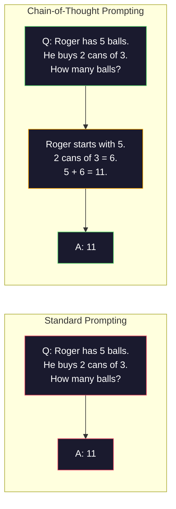
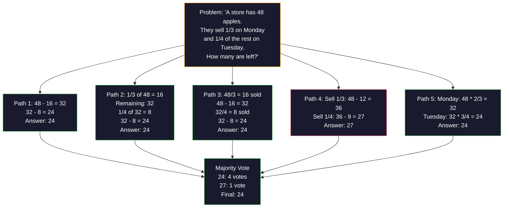
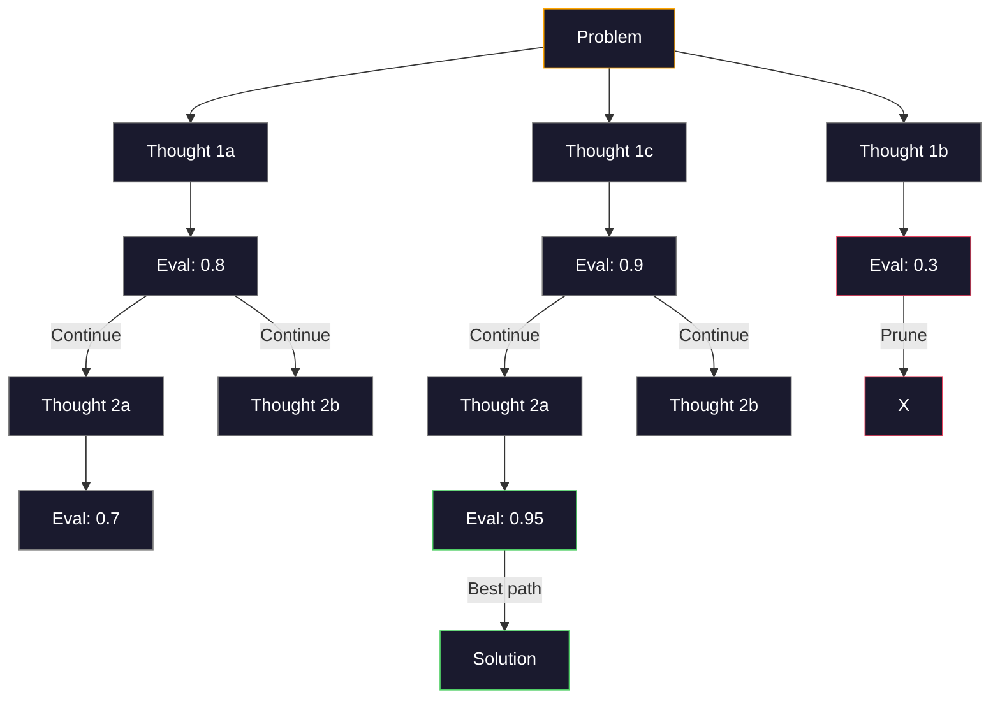

# Pouco-choque, cadeia de pensamento, árvore de pensamento.

> Dizer a um modelo o que fazer é incentivar. Mostrar-lhe como pensar é engenharia. A diferença entre 78% e 91% de precisão no mesmo modelo, na mesma tarefa, nos mesmos dados não é um melhor modelo. É uma melhor estratégia de raciocínio.

> **【中文解读】**告诉模型"做什么" é um suporte, mostrar "como pensar" é apenas um projeto. A elevação da taxa de precisão de 78% para 91% não é baseada em um modelo melhor, mas em estratégias de raciocínio melhor.

> **【拓展：推理策略→AI Agent】**O CoT/ToT/ReAct é a base da teoria do Agente de IA moderno. O ciclo de pensamento-ação-observação do ReAct é o modelo central do quadro de Agente LangChain, CrewAI e outros.

> - Não .**【前置】**O programa de aprendizagem de um sistema de aprendizagem de aprendizagem de aprendizagem de aprendizagem de aprendizagem de aprendizagem de aprendizagem de aprendizagem de aprendizagem de aprendizagem de aprendizagem de aprendizagem de aprendizagem de aprendizagem de aprendizagem de aprendizagem de aprendizagem de aprendizagem de aprendizagem de aprendizagem de aprendizagem de aprendizagem de aprendizagem de aprendizagem de aprendizagem de aprendizagem de aprendizagem de aprendizagem de aprendizagem de aprendizagem de aprendizagem de aprendizagem de aprendizagem de aprendizagem de aprendizagem de aprendizagem de aprendizagem de aprendizagem de aprendizagem de aprendizagem de aprendizagem de aprendizagem de aprendizagem de aprendizagem de aprendizagem de aprendizagem de aprendizagem de aprendizagem de aprendizagem de aprendizagem de aprendizagem de aprendizagem de aprendizagem de aprendizagem de aprendizagem de aprendizagem de aprendizagem de aprendizagem de aprendizagem de aprendizagem de aprendizagem de aprendizagem de aprendizagem de aprendizagem de aprendizagem de aprendizagem de aprendizagem de aprendizagem de aprendizagem de aprendizagem de aprendizagem de aprendizagem de aprendizagem de aprendizagem de aprendizagem de aprendizagem de aprendizagem de aprendizagem de aprendizagem de aprendizagem de aprendizagem de aprendizagem de aprendizagem de aprendizagem de aprendizagem de aprendizagem de aprendizagem de aprendizagem de aprendizagem de aprendizagem de aprendizagem de aprendizagem de aprendizagem de aprendizagem de aprendizagem de aprendizagem de aprendizagem de aprendizagem de aprendizagem de aprendizagem de aprendizagem de aprendizagem de aprendizagem de aprendizagem de aprendizagem de aprendizagem de aprendizagem de aprendizagem de aprendizagem de aprendizagem de aprendizagem de aprendizagem de aprendizagem de aprendizagem de aprendizagem de aprendizagem de aprendizagem de aprendizagem de aprendizagem de aprendizagem de aprendizagem de aprendizagem de aprendizagem de aprendizagem de aprendizagem de

**Type:** Build | **类型:** 构建
**Languages:** Python | **语言:** Python
**Prerequisites:** Lesson 11.01 (Prompt Engineering) | **前置知识:** Phase 11 · 01 (提示工程)
**Time:** ~45 minutes | **时间:** ~45 分钟

## Objetivos de aprendizagem

- Implementar a solicitação de poucas fotos selecionando e formateando demonstrações de exemplo que maximizem a precisão da tarefa
                                                                                                                                                                                                                                                                                                                                                                                                                                                                                                                               
- Aplicar o raciocínio de cadeia de pensamento (CoT) para melhorar a precisão em problemas de várias etapas, como problemas de palavras matemáticas
  应用链式思维 (C) 推理 (CoT) 推理 (CoT) 推理 (CoT) 推理 (CoT) 推理 (CoT) 推理 (CoT) 推理 (CoT) 推理 (CoT) 推理 (CoT) 推理 (CoT) 推理 (CoT) 推理 (CoT) 推理 (CoT) 推理 (CoT) 推理 (CoT) 推理 (CoT) 推理 (CoT) 推理 (CoT) 推理 (CoT) 推理 (CoT) 推理 (CoT) 推理 (CoT) 推理 (CoT) 推理) 推理 (CoT) 推理 (CoT) 推理) 推理 (CoT) 推理 (CoT) 推理) 推理 (CoT) 推理) 推理 (CoT) 推理) 推理 (CoT) 推理) 推理 (CoT) 推理) 推理) 推理 (CoT) 推理) 推理 (CoT) 推理) 推理) 推理 (CoT) 推理) 推理 (CoT) 推理) 推理 (CoT) 推理) 推理) 推理 (CoT) 推理) 推理 (CoT) 推理) 推理 (CoT) 推理) 推理 (CoT) 推理 (CoT) 推理) 推理 (CoT) 推理) 推理 (CoT)
- Construir um ponto de referência que explore vários caminhos de raciocínio e selecione o melhor
  构建思维树提示,探索多条推理路径并选择最佳路径
- Medir a melhoria da precisão de zero-shot vs few-shot vs CoT em um benchmark padrão
  Aumento da precisão das medidas em base padrão de zero amostras vs pequenas amostras vs CoT

> **【中文解读】**O objetivo do curso é: dominar um pouco de tempo em um instante e um exemplo de um modelo de pensamento em uma cadeia de pensamento.


## O problema é o problema da introdução

Você cria um aplicativo de ensino de matemática. Seu pedido diz: "Solução deste problema de palavra". GPT-5 faz o certo 94% do tempo no GSM8K, o padrão de referência de matemática da escola primária. Você acha que já atingiu o pico. Você não  cadeia de pensamento ainda adiciona 3-4 pontos.

> Você construiu uma aplicação matemática de orientação. Sua dica é:" resolver este problema de aplicação. "GPT-5 em GSM8K (standard小学数学基准) é de 94%. Você acha que já chegou ao topo.

Adicione cinco palavras - "Vamos pensar passo a passo" - e a precisão salta para 91%. Adicione alguns exemplos trabalhados e ele chega a 95%. O mesmo modelo. A mesma temperatura. O mesmo custo da API. A única diferença é que você deu o modelo papel de arranque.

> Adicionalmente, a taxa de precisão de dados é de 91% e, adicionalmente, alguns exemplos já resolvidos são de 95%.

Isto não é um hack. É como o raciocínio funciona. Os seres humanos não resolvem problemas em vários passos em um salto mental. Nem os transformadores. Quando você força um modelo a gerar tokens intermediários, esses tokens se tornam parte do contexto para o próximo token. Cada passo de raciocínio alimenta o próximo. O modelo calcula literalmente seu caminho para a resposta.

> Não é uma estratégia. É uma forma de trabalhar de raciocínio. O ser humano não vai completar várias etapas de uma vez. O transformador também não vai. Quando você força um modelo a gerar um token intermediário, esses tokens se tornam parte da descrição do próximo token.

> - Não .**【类比】**Não usar CoT 像让人"心算 17 × 24" A maioria das pessoas calcula errores ou cartões de crédito. Usar CoT 像给一张草稿纸:"17 × 24 = 17 × 20 + 17 × 4 = 340 + 68 = 408"一步步写下来就不会错过. LLM

> ️ **【易错点】**Pouco-choque / CoT de 3 个坑:(1) **示例数量错误**0-shot CoT加 "Vamos pensar passo a passo" 就足, 再加 3-5 个少拍示例能再 2-5 点;超過 8 个示例性价比下降(pronto 太长、成本 上) 2) **示例顺序敏感** Com os 3 exemplos de A,B,C e C,B,A, a taxa de precisão diferem entre 5 e 10%;**CoT 不适用于简单任务**"Hoje几号?"加 CoT 反而让模型出错;CoT apenas para vários passos de raciocínio ((mathematics、逻辑、规划)有效。

Mas "pensar passo a passo" é o começo, não o fim. E se você samples cinco caminhos de raciocínio e tomar uma maioria de votos? E se você deixar o modelo explorar uma árvore de possibilidades, avaliar e podar ramos? E se você intercalar o raciocínio com o uso de ferramentas?

> Mas "pensar a cada passo" é apenas o começo, não o fim. Se você adotar cinco rotas de pensamento e depois fazer a maioria das votações, como será? Se você deixar um modelo explorar uma árvore de possibilidades, como será a avaliação e a remoção? Se você usar ferramentas para trocar o pensamento?

## O conceito central.

> **【中文解读】**少样本学习 (少样本学习) (Few-shot) 和思维链 (Chain-of-Thought, CoT) é uma das duas principais técnicas de engenharia rápida.

> **【拓展：CoT 的推理提升效果】**O Google 2022 demonstra que, em tarefas de raciocínio matemático, o CoT vai aumentar a taxa de precisão do PaLM 540B de 17% para 56%.

> 🤔 **【困惑】**P: 2026 ano original modelo de raciocínio ;;Claude Extended Thinking、o3) tudo se autocompulsionou CoT ?, eu também preciso de mão para escrever "pensar passo a passo" ? A: Não preciso, mas há pressupostos:(1) Usando para apoiar o modelo de raciocínio original Claude 4.5+、GPT-5、o3、DeepSeek-R1 etc;(2) 任务确实需要推理简单分类任务原生思考反而拖慢;;对老模型 GPT-4、Claude 3) 或开源模型Llama 3) 仍然需要手写 CoT;;判断: If the model has a`reasoning_effort`Ou `thinking`参数, usá-lo;否则用 prompt。


### Zero-Shot vs Few-Shot: Quando os exemplos vencem as instruções

A resposta zero-shot dá ao modelo uma tarefa e nada mais.

> 零样本提示只给模型一个任务,不加其他内容――少样本提示则先给模型一个任务,不加其他内容――

Wei et al. (2022) mediram isso em 8 benchmarks. Para tarefas simples como classificação de sentimento, zero-shot e few-shot realizadas dentro de 2% um do outro. Para tarefas complexas como aritmética em vários passos e raciocínio simbólico, few-shot melhorou a precisão em 10-25%.

> Wei 等人 (WEB 2022) avaliou este ponto em 8 critérios. Para tarefas simples como emoção, diferença de desempenho de zero-sampula e pequena amostra é de 2% e dentro. Para tarefas complexas como aritmética e raciocínio de símbolos, a taxa de precisão de pequena amostra aumentou 10-25%.

A intuição: exemplos são instruções comprimidas. Em vez de descrever o formato de saída, você mostra. Em vez de explicar o processo de raciocínio, você demonstra. O modelo de padrão coincide com os exemplos de forma mais confiável do que interpreta instruções abstratas.

> 直觉: exemplo é instrução de compressão. Com sua descrição de formato de saída, não se mostra diretamente. Com seu processo de interpretação, não se demonstra diretamente.


**When few-shot wins:**tarefas sensíveis ao formato, classificação, extração estruturada, jargão específico de domínio, qualquer tarefa em que o modelo precise corresponder a um padrão específico.

> **少样本胜出的场景**:formação de tarefas sensíveis, categorias, estratégias estruturadas, termos específicos de áreas, qualquer modelo que precise de se adequar a um determinado modelo de tarefas.

**When zero-shot wins:**As questões factuais simples, tarefas criativas onde os exemplos limitam a criatividade, tarefas onde encontrar bons exemplos é mais difícil do que escrever boas instruções.

> **零样本胜出的场景**A criação de um trabalho de criação é um processo de criação de um trabalho de criação.

### Seleção de exemplo: Batidas semelhantes aleatórias

Não todos os exemplos são iguais. Escolher exemplos semelhantes à entrada-alvo supera a seleção aleatória em 5-15% nas tarefas de classificação (Liu et al., 2022). Três princípios:

> Não todos os exemplos são bons. Os exemplos semelhantes à seleção de objetivos são 5-15% mais altos em tarefas de classe do que os de seleção de casal.

1. **Semantic similarity**: escolher exemplos mais próximos da entrada no espaço de inserção
   **语义相似性**: escolher o exemplo mais próximo da entrada no espaço embuxado
2. **Label diversity**: cobrir todas as categorias de saída em seus exemplos
   **标签多样性**: em exemplo, cobre todas as categorias de saída
3. **Difficulty matching**: correspondem ao nível de complexidade do problema-alvo
   **难度匹配**: Classe de complexidade do problema de correspondência

O número ideal de exemplos para a maioria das tarefas é de 3-5. abaixo de 3, o modelo não tem sinal suficiente para extrair o padrão. acima de 5, você atinge retornos decrescentes e desperdiça tokens de janela de contexto. Para classificação com muitos rótulos, use um exemplo por rótulo.

> O número de exemplos de maioria das tarefas é de 3-5 ⋅ menos de 3, o modelo não tem sinais suficientes para obter um modelo, mais de 5, o lucro marginal diminui e o desperdício em tokens da janela abaixo, para várias categorias de tags, cada tag usa um exemplo.

### Cadeia de Pensamento: Dar modelos

A ideia é simples: em vez de pedir ao modelo apenas a resposta, peça-lhe que mostre primeiro seus passos de raciocínio.

> 链式思维(CoT)提示由Google Brain 的 Wei 等人(2022) introduzção──idea é muito simples: não só exige que o modelo dê uma resposta, mas exige que ele primeiro mostre os passos do pensamento──



O modelo deve comprimir todo o raciocínio para o estado oculto de uma única passagem avançada. Com o CoT, o modelo externaliza os cálculos intermediários como tokens. Cada token de raciocínio estende a profundidade de computação eficaz.

> Por que isso é válido no mecanismo? Transformador gerado cada token são transformados em um token seguinte. Sem CoT, o modelo deve comprimir todas as teorias para um estado oculto de propagação única.

**GSM8K benchmarks (grade-school math, 8.5K problems):**

| Model | Zero-Shot | Zero-Shot CoT | Few-Shot CoT |
|-------|-----------|---------------|--------------|
| GPT-4o | 78% | 91% | 95% |
| GPT-5 | 94% | 97% | 98% |
| o4-mini (reasoning) | 97% | — | — |
| Claude Opus 4.7 | 93% | 97% | 98% |
| Gemini 3 Pro | 92% | 96% | 98% |
| Llama 4 70B | 80% | 89% | 94% |
| DeepSeek-V3.1 | 89% | 94% | 96% |

**Note on reasoning models.**Modelos como o-série (o3, o4-mini) da OpenAI e DeepSeek-R1 executam cadeia de pensamento internamente antes de emitir sua resposta. Adicionar "Vamos pensar passo a passo" a um modelo de raciocínio é redundante e às vezes contraproducente.

> **关于推理模型的说明。**Como o OpenAI o 系列 ((o3、o4-mini) e o DeepSeek-R1 este tipo de modelo em saída antes de resposta vai ser internamente executado em cadeia de pensamentos.

Dois sabores de CoT:

> As duas formas de CoT:

**Zero-shot CoT**O texto é um texto que é um exemplo de um bom trabalho de pesquisa e de um bom trabalho de pesquisa.

> **零样本 CoT**Em um artigo publicado em 2022 (em inglês), o artigo "Pensamos passo a passo" (em inglês) foi publicado em 2022 (em inglês).

**Few-shot CoT**O modelo vê o formato exato de raciocínio que você espera.

> **少样本 CoT**O modelo é mais eficaz do que o modelo zero, pois o modelo vê o formato de cálculo preciso que você espera.

**When CoT hurts**A CoT acrescenta 50-200 tokens de custo geral de raciocínio por consulta. Para tarefas de alta produtividade e baixa complexidade, esse é um desperdício de custos.

> **CoT 何时有害**A velocidade é mais importante do que a precisão. A cada consulta, o COT aumenta 50-200 tokens de cálculo e venda. Para tarefas de alta capacidade, é um desperdício de custos.

### Auto-consistência: Escolha muitos, vota uma vez

Wang et al. (2023) introduziram a autoconsistência. A visão: um único caminho de CoT pode conter erros de raciocínio. Mas se você amostrar N caminhos de raciocínio independentes (usando temperatura > 0) e tomar a maioria dos votos na resposta final, os erros são cancelados.

> Wang 等人(2023) introduziu a autoconsinência。洞察:单条 CoT 路径可能包含推理错误──但如果你采样 N 条独立的推理路径(使用温度 > 0)并对最终答案进行多数投票,错误就会相互抵消──



A autoconsistência melhorou a precisão do GSM8K de 56,5% (Cot único) para 74,4% com N=40 nos experimentos originais PaLM 540B. No caso do GPT-5, a melhoria é pequena (97% a 98%) porque a precisão base já está saturada. A técnica brilha mais nos modelos com 60-85% de precisão de base de CoT -- o ponto ideal onde os erros de caminho único são frequentes, mas não sistemáticos. Para os modelos de raciocínio (série o, R1) a autoconsistência é subsumida pela amostragem interna incorporada.

> Desde a sua conformidade com o PaLM 540B original, a GSM8K aumentou a taxa de precisão de 56,5% (N=40) para 74,4% (N=40) (em GPT-5), o que foi muito melhorado (de 97% a 98%), já que a taxa de precisão de base já foi atingida.

O tradeoff: N amostras significa Nx o custo da API e a latência. Na prática, N=5 capta a maior parte dos benefícios. N=3 é o mínimo para uma votação significativa. N > 10 tem retornos decrescentes para a maioria das tarefas.

> 权衡:N 个样本意味着N 倍的API 成本和延迟――在实践中,N=5 捕获了大部分收益――N=3 é o requisito mínimo de voto significativo――N > 10 para a maioria das tarefas de recorrência marginal 收益递减――

### Árvore de Pensamento: Exploração de ramificações

Yao et al. (2023) introduziram a Árvore de Pensamento (ToT). Onde a CoT segue um caminho de raciocínio linear, a ToT explora vários ramos e avalia os mais promissores antes de continuar.

> Yao 等人(2023) introduziu o pensamento de um árvore (思维树) ;;CoT 沿一条线性推理路径前进, enquanto ToT 探索多分支, e continuar a avaliar quais são as melhores perspectivas;;



O TOT tem três componentes:

> A TT tem três componentes:

1. **Thought generation**: produzir vários candidatos passos seguintes
   **思维生成**: produzir vários candidatos
2. **State evaluation**: pontuação de cada candidato (pode utilizar o próprio MLL como avaliador)
   **状态评估**Para cada candidato, pode usar o LLM como avaliador.
3. **Search algorithm**: BFS ou DFS através da árvore, poda de ramos de baixa pontuação
   **搜索算法**Por meio de BFS ou DFS, cortar-se-á o

No jogo de 24 tarefas (combinar 4 números usando aritmética para fazer 24), GPT-4 com a solicitação padrão resolve 7,3% dos problemas. com CoT, 4,0% (CoT realmente dói aqui porque o espaço de pesquisa é amplo). com ToT, 74%.

> Em jogo de 24 任务 ([[{{lang-en_{{lang-en}}}}}}}}}} , GPT-4 utilizao 标准提示解决 7.3% 的问题── utilizando CoT 时为 4.0% [[CoT 实际上在这里有害,因为搜索空间很宽]]── utilizando ToT 时为 74%──

O ToT é caro. Cada nó na árvore requer uma chamada de LLM. Uma árvore com fator de ramificação 3 e profundidade 3 requer até 39 chamadas de LLM. Use-o apenas para problemas onde o espaço de pesquisa é grande, mas avaliável - planejamento, resolução de quebra-cabeças, resolução criativa de problemas com restrições.

> Para cada um dos pontos da árvore, é necessário uma única fase de Mestrado em Mestrado em Matemática.

### Reacção: Pensamento + Ação

Yao et al. (2022) combinaram traços de raciocínio com ações. O modelo alternou entre pensar (generar raciocínio) e agir (chamando ferramentas, pesquisa, computação).

> Yao 等人(2022) vai pensar em trilharia e ação结合――模型在思考(生成推理) 和行动(调用工具、搜索、计算) 之间交换──

```mermaid
graph LR
    Q["Question:\nWhat is the\npopulation of the\ncountry where\nthe Eiffel Tower\nis located?"]
    T1["Thought: I need to\nfind which country\nhas the Eiffel Tower"]
    A1["Action: search\n'Eiffel Tower location'"]
    O1["Observation:\nParis, France"]
    T2["Thought: Now I need\nFrance's population"]
    A2["Action: search\n'France population 2024'"]
    O2["Observation:\n68.4 million"]
    T3["Thought: I have\nthe answer"]
    F["Answer:\n68.4 million"]

    Q --> T1 --> A1 --> O1 --> T2 --> A2 --> O2 --> T3 --> F

    style Q fill:#1a1a2e,stroke:#ffa500,color:#fff
    style T1 fill:#1a1a2e,stroke:#51cf66,color:#fff
    style A1 fill:#1a1a2e,stroke:#e94560,color:#fff
    style O1 fill:#1a1a2e,stroke:#808080,color:#fff
    style T2 fill:#1a1a2e,stroke:#51cf66,color:#fff
    style A2 fill:#1a1a2e,stroke:#e94560,color:#fff
    style O2 fill:#1a1a2e,stroke:#808080,color:#fff
    style T3 fill:#1a1a2e,stroke:#51cf66,color:#fff
    style F fill:#1a1a2e,stroke:#51cf66,color:#fff
```



O ReAct supera o CoT puro em tarefas intensivas em conhecimento porque pode basear seu raciocínio em dados reais. No HotpotQA (resposta a perguntas de múltipla espera), o ReAct com GPT-4 atinge uma correspondência exata de 35,1% versus 29,4% apenas para o CoT. O poder real é que os erros de raciocínio são corrigidos por observações - o modelo pode atualizar seu plano em meados da execução.

> ReAct em tarefas de tipo intenso de conhecimento é superior ao CoT puro, pois ele pode raciocinar com base em dados reais. Em HotpotQA, ReAct com GPT-4 alcançou uma correspondência precisa de 35,1%, enquanto o CoT puro é de 29,4%. A verdadeira força está em raciocinar erros que podem ser corrigidos através de observações.

ReAct é a base dos agentes modernos de IA. Cada estrutura de agentes (LangChain, CrewAI, AutoGen) implementa alguma variante do ciclo de Pensamento-Ação-Observação. Você vai construir agentes completos na Fase 14. Esta lição abrange o padrão de solicitação.

> ReAct é a base do Agente de IA moderno. Cada Agente  estrutura (LangChain, CrewAI, AutoGen) realizou uma variante do ciclo de Pensamento-Ação-Observação.

### Prompting estruturado: tags XML, delimitadores, cabeçalhos

À medida que as instruções se tornam complexas, a estrutura impede que o modelo confunda seções.

> Com a introdução de um modelo, a estrutura pode ser impedida de se misturar com diferentes partes.

**XML tags**(Faz melhor com Claude, sólido em todos os lugares):
```
<context>
You are reviewing a pull request.
The codebase uses TypeScript and React.
</context>

<task>
Review the following diff for bugs, security issues, and style violations.
</task>

<diff>
{diff_content}
</diff>

<output_format>
List each issue with: file, line, severity (critical/warning/info), description.
</output_format>
```

**Markdown headers**(universal):
```
## Role
Senior security engineer at a fintech company.

## Task
Analyze this API endpoint for vulnerabilities.

## Input
{api_code}

## Rules
- Focus on OWASP Top 10
- Rate each finding: critical, high, medium, low
- Include remediation steps
```

**Delimiters**(minimal mas eficaz):
```
---INPUT---
{user_text}
---END INPUT---

---INSTRUCTIONS---
Summarize the above in 3 bullet points.
---END INSTRUCTIONS---
```

### Encaixamento rápido: decomposição sequencial

Algumas tarefas são muito complexas para um único prompt. A cadeia de prompt as divide em etapas, onde a saída de um prompt se torna a entrada do próximo.

> Algumas tarefas são muito complexas, impossíveis de serem concluídas com uma única dica.


A corrida de cadeia é simples por três razões:

> O processo de integração é feito por três razões:

1. **Each step is simpler**O modelo lida com uma tarefa focada em vez de fazer malabarismo com tudo
   **每个步骤更简单**Modelo: processar uma tarefa focada, em vez de lidar com todas as coisas ao mesmo tempo
2. **Intermediate outputs are inspectable**: pode validar e corrigir entre as etapas
   **中间输出可检查**Você pode verificar e corrigir entre os passos
3. **Different steps can use different models**: usar um modelo barato para extração, um caro para raciocínio
   **不同步骤可以使用不同模型**Com modelos baratos, com modelos caros, com modelos de preços elevados.

### Comparação de desempenho

| Technique | Best For | GSM8K Accuracy (GPT-5) | API Calls | Token Overhead | Complexity |
|-----------|----------|------------------------|-----------|----------------|------------|
| Zero-Shot | Simple tasks | 94% | 1 | None | Trivial |
| Few-Shot | Format matching | 96% | 1 | 200-500 tokens | Low |
| Zero-Shot CoT | Quick reasoning boost | 97% | 1 | 50-200 tokens | Trivial |
| Few-Shot CoT | Maximum single-call accuracy | 98% | 1 | 300-600 tokens | Low |
| Self-Consistency (N=5) | High-stakes reasoning | 98.5% | 5 | 5x token cost | Medium |
| Reasoning model (o4-mini) | Drop-in CoT replacement | 97% | 1 | hidden (2-10x internal) | Trivial |
| Tree-of-Thought | Search/planning problems | N/A (74% on Game of 24) | 10-40+ | 10-40x token cost | High |
| ReAct | Knowledge-grounded reasoning | N/A (35.1% on HotpotQA) | 3-10+ | Variable | High |
| Prompt Chaining | Complex multi-step tasks | 96% (pipeline) | 2-5 | 2-5x token cost | Medium |

A técnica correta depende de três fatores: exigência de precisão, orçamento de latência e tolerância ao custo.

> A técnica exacta depende de três fatores: precisão de taxas de demanda, orçamento atrasado e tolerância ao custo.

## Construí-lo e realizei-o.
```figure
few-shot-curve
```

## Construí-lo

Vamos construir um solucionador de problemas matemáticos que combina a solicitação de poucas tentativas, o raciocínio de cadeia de pensamentos e a votação de autoconsistência em um único pipeline.

> Vamos construir um problema matemático, vamos construir um pequeno modelo de sugestões, pensamentos de cadeia e de autoconsensão, vamos fazer um processo de votação, então vamos adicionar um arvore de pensamentos para o problema.

A execução completa está em`code/advanced_prompting.py`Aqui estão os componentes-chave.

>                                                                                                                                                                                                                                                                                                                                                                                                                                                                                                                              `code/advanced_prompting.py`O seguinte é o componente chave.

### Passo 1: Loja de exemplos de poucas fotos

O primeiro componente gerencia alguns exemplos e seleciona os mais relevantes para um determinado problema.

> Primeiro, um exemplo de um pequeno conjunto de componentes, e o mais relevante é escolhido para um determinado problema.

```python
GSM8K_EXAMPLES = [
    {
        "question": "Janet's ducks lay 16 eggs per day. She eats three for breakfast every morning and bakes muffins for her friends every day with four. She sells every egg at the farmers' market for $2. How much does she make every day at the farmers' market?",
        "reasoning": "Janet's ducks lay 16 eggs per day. She eats 3 and bakes 4, using 3 + 4 = 7 eggs. So she has 16 - 7 = 9 eggs left. She sells each for $2, so she makes 9 * 2 = $18 per day.",
        "answer": "18"
    },
    ...
]
```

Cada exemplo tem três partes: a pergunta, a cadeia de raciocínio e a resposta final. A cadeia de raciocínio é o que transforma um exemplo regular de poucas tiras em um exemplo de poucas tiras de CoT.

> Cada exemplo tem três partes: problema, cadeia de conclusões e resposta final. A cadeia de conclusões é a chave para transformar um exemplo de menor escala em um exemplo de menor escala.

### Passo 2: Construtor de Imedios de Cadeia de Pensamento

O criador de prompt reúne uma mensagem do sistema, alguns exemplos com cadeias de raciocínio e a pergunta alvo em um único prompt.

> 提示Constructor把系统消息、带推理链的少样例例和目标问题组装成单个提示──

```python
def build_cot_prompt(question, examples, num_examples=3):
    system = (
        "You are a math problem solver. "
        "For each problem, show your step-by-step reasoning, "
        "then give the final numerical answer on the last line "
        "in the format: 'The answer is [number]'."
    )

    example_text = ""
    for ex in examples[:num_examples]:
        example_text += f"Q: {ex['question']}\n"
        example_text += f"A: {ex['reasoning']} The answer is {ex['answer']}.\n\n"

    user = f"{example_text}Q: {question}\nA:"
    return system, user
```

A restrição de formato ("A resposta é [número]") é crítica. Sem ela, a autoconsistência não pode extrair e comparar respostas em amostras.

> 格式约束 (("A resposta é [número]") 至关重要──没有它,自一致性无法在不同样本之间提取和比较答案──

### Passo 3: Votação de autoconsistência

Escolha N caminhos de raciocínio e tome a resposta da maioria.

> 采样 N 条推理路径,取多数答案──

```python
def self_consistency_solve(question, examples, client, model, n_samples=5):
    system, user = build_cot_prompt(question, examples)

    answers = []
    reasonings = []
    for _ in range(n_samples):
        response = client.chat.completions.create(
            model=model,
            messages=[
                {"role": "system", "content": system},
                {"role": "user", "content": user}
            ],
            temperature=0.7
        )
        text = response.choices[0].message.content
        reasonings.append(text)
        answer = extract_answer(text)
        if answer is not None:
            answers.append(answer)

    vote_counts = Counter(answers)
    best_answer = vote_counts.most_common(1)[0][0] if vote_counts else None
    confidence = vote_counts[best_answer] / len(answers) if best_answer else 0

    return best_answer, confidence, reasonings, vote_counts
```

A temperatura 0,7 é importante. A temperatura 0,0, todas as amostras N seriam idênticas, derrotando o propósito.

> A temperatura 0,7  é muito importante. Em temperatura 0,0  下, todas as N 个样本都会相同, perderá significado. Você precisa de suficiente aleatoriedade para produzir vários caminhos de raciocínio, mas não pode ser muito para que o modelo produzir desordem.

### Passo 4: Resolver a Árvore do Pensamento

Para problemas em que o raciocínio linear falha, a ToT explora múltiplas abordagens e avalia qual é a direção mais promissora.

> Para a questão do fracasso da raciocínio linear, explorar várias formas de avaliar quais são as melhores perspectivas.

```python
def tree_of_thought_solve(question, client, model, breadth=3, depth=3):
    thoughts = generate_initial_thoughts(question, client, model, breadth)
    scored = [(t, evaluate_thought(t, question, client, model)) for t in thoughts]
    scored.sort(key=lambda x: x[1], reverse=True)

    for current_depth in range(1, depth):
        next_thoughts = []
        for thought, score in scored[:2]:
            extensions = extend_thought(thought, question, client, model, breadth)
            for ext in extensions:
                ext_score = evaluate_thought(ext, question, client, model)
                next_thoughts.append((ext, ext_score))
        scored = sorted(next_thoughts, key=lambda x: x[1], reverse=True)

    best_thought = scored[0][0] if scored else ""
    return extract_answer(best_thought), best_thought
```

O avaliador é um LLM. Você pergunta ao modelo: "Em uma escala de 0,0 a 1,0, quão promissor é este caminho de raciocínio para resolver o problema?" Esta é a principal ideia da ToT - o modelo avalia as suas próprias soluções parciais.

> 评估器本身就是一个LLM调用――你问模型:" Em 0.0 até 1.0 do alcance, como é que esta metodologia de avaliação resolve o problema?" é a chave para o TOT.

### Passo 5: Pipeline completa

O gasoduto combina todas as técnicas com uma estratégia de escalada.

> 流水线结合所有技术与升级策略──

```python
def solve_with_escalation(question, examples, client, model):
    system, user = build_cot_prompt(question, examples)
    single_response = call_llm(client, model, system, user, temperature=0.0)
    single_answer = extract_answer(single_response)

    sc_answer, confidence, _, _ = self_consistency_solve(
        question, examples, client, model, n_samples=5
    )

    if confidence >= 0.8:
        return sc_answer, "self_consistency", confidence

    tot_answer, _ = tree_of_thought_solve(question, client, model)
    return tot_answer, "tree_of_thought", None
```

A lógica da escalada: tentar barato (Cot único) primeiro. Se a confiança em autoconsistência for abaixo de 0,8 (menos de 4 de 5 amostras concordam), escala para ToT. Isso equilibra custo e precisão - a maioria dos problemas são resolvidos barato, os problemas difíceis obtêm mais computação.

> 升级逻辑:先尝试廉价的(单次 CoT) ―― Se a autoconsentividade de confiança for inferior a 0,8(5 amostras, menos de 4), então elevar para ToT── isso equilibra custos e taxas de precisão A maioria dos problemas são resolvidos com baixo custo, dificuldade em obter mais recursos de cálculo──

## Use-o com o framework implementado.

### Pronto-Driven Prompts de Poucos Tiros

A LangChain fornece suporte incorporado para modelos rápidos e análise de saída que simplificam padrões de poucas fotos e CoT:

> LangChain para simplificar menos padrões e CoT Modelo de fornecimento de padrões de suporte e de saída para resolução embutido:

```python
from langchain_core.prompts import FewShotPromptTemplate, PromptTemplate
from langchain_openai import ChatOpenAI

example_prompt = PromptTemplate(
    input_variables=["question", "reasoning", "answer"],
    template="Q: {question}\nA: {reasoning} The answer is {answer}."
)

few_shot_prompt = FewShotPromptTemplate(
    examples=examples,
    example_prompt=example_prompt,
    suffix="Q: {input}\nA: Let's think step by step.",
    input_variables=["input"]
)

llm = ChatOpenAI(model="gpt-4o", temperature=0.7)
chain = few_shot_prompt | llm
result = chain.invoke({"input": "If a train travels 120 km in 2 hours..."})
```

A LangChain também tem `ExampleSelector`Classificação de semântica de semelhança:

> LangChain também existe`ExampleSelector`类用于语义相似性选择:

```python
from langchain_core.example_selectors import SemanticSimilarityExampleSelector
from langchain_openai import OpenAIEmbeddings

selector = SemanticSimilarityExampleSelector.from_examples(
    examples,
    OpenAIEmbeddings(),
    k=3
)
```

### Compilação de pedidos

O DSPy trata as estratégias de prompt como módulos otimizáveis. Em vez de criar pedidos de CoT, você define uma assinatura e deixa o DSPy otimizar o prompt:

> DSPy vai mostrar estratégias como um módulo de otimização.

```python
import dspy

dspy.configure(lm=dspy.LM("openai/gpt-4o", temperature=0.7))

class MathSolver(dspy.Module):
    def __init__(self):
        self.solve = dspy.ChainOfThought("question -> answer")

    def forward(self, question):
        return self.solve(question=question)

solver = MathSolver()
result = solver(question="Janet's ducks lay 16 eggs per day...")
```

DSPy `ChainOfThought`Adiciona automaticamente traços de raciocínio.`dspy.majority`Implementa a autoconsistência:

> DSPy `ChainOfThought`Automaticamente adicionado ao seu caminho.`dspy.majority`实现自一致性:

```python
result = dspy.majority(
    [solver(question=q) for _ in range(5)],
    field="answer"
)
```

### Comparação: From-Scratch vs Frameworks

| Feature | From-Scratch (this lesson) | LangChain | DSPy |
|---------|--------------------------|-----------|------|
| Control over prompt format | Full | Template-based | Automatic |
| Self-consistency | Manual voting | Manual | Built-in (`dspy.majority`) |
| Example selection | Custom logic | `ExampleSelector` | `dspy.BootstrapFewShot` |
| Tree-of-Thought | Custom tree search | Community chains | Not built-in |
| Prompt optimization | Manual iteration | Manual | Automatic compilation |
| Best for | Learning, custom pipelines | Standard workflows | Research, optimization |

## Envia-o . Produto .

Esta lição produz dois artefatos.

> O curso produz duas produções:

**1. Reasoning Chain Prompt**(`outputs/prompt-reasoning-chain.md`): um modelo de resposta rápida para CoT de poucas tiras com autoconsistência.

> **1. 推理链提示**(`outputs/prompt-reasoning-chain.md`): um pequeno modelo de produção já está disponível em um campo de trabalho.

**2. CoT Pattern Selection Skill**(`outputs/skill-cot-patterns.md`): um quadro de decisão para a escolha da técnica de raciocínio correta com base no tipo de tarefa, nos requisitos de precisão e nas restrições de custos.

> **2. CoT 模式选择技能**(`outputs/skill-cot-patterns.md`): Selecionar o quadro de decisão da técnica de avaliação correta, de acordo com o tipo de tarefa, a precisão de taxas de demanda e os custos.

## Exercícios.

1. **Measure the gap**Tome 10 problemas GSM8K. Resolva cada um com zero-shot, poucos-shot, zero-shot CoT e poucos-shot CoT. Regista precisão para cada um. Qual técnica dá o maior aumento no seu modelo?
   **测量差距**O que é que você tem de fazer com que o seu modelo seja melhorado?

2. **Example selection experiment**Para os mesmos 10 problemas, compare a seleção aleatória de exemplos versus exemplos similares selecionados à mão.
   **示例选择实验**Para os mesmos 10 temas, comparar exemplos de seleção e seleção manual de exemplos semelhantes.

3. **Self-consistency cost curve**A linha de rotação é a seguinte: executar auto-consistência com N = 1, 3, 5, 7, 10 em 20 problemas GSM8K. Precisionidade de trama vs custo (tokens totais). Onde está o joelho da curva para o seu modelo?
   **自一致性成本曲线**Em 20 vias GSM8K 题目上使用N=1、3、5、7、10 运行自一致性──绘制准确率 vs 成本(总代币)图──你的模型的拐点在哪里?

4. **Build a ReAct loop**Quando o modelo gera uma expressão matemática, execute-a com Python `eval()`Medir se o raciocínio baseado em ferramentas supera a pura CoT.
   **构建 ReAct 循环**Quando um modelo gera expressões matemáticas, usa Python.`eval()`(在沙箱中) executar e obter resultados contr──────────────────────────────────────────────────────────────────────────────────────────────────────────────────────────────────────────────────────────────────────────────────────────────────────────────────────────────────────────────────────────────────────────────────────────────────────────────────────────────────────────────────────────────────────────────────────────────────────────────────────────────────────────────────────────────────────────────────────────────────────────────────────────────────────────────────────────────────────────────────────────────────────────────────────────────────────────────────────────────────────────────────────────────────────────────────────────────────────────────────────────────────────────────────────────────────────────────────────────────────────────────────────────────────────────────────────────────────────────────────────────────────────────────────────────────────────────────────────────────────────────────────────────────────

5. **ToT for creative tasks**Adapte o solvente de árvore de pensamento para uma tarefa de escrita criativa: "Escreva uma história de 6 palavras que seja engraçada e triste". Use o LLM como avaliador.
   **ToT 用于创意任务**O Mestrado em Educação e Desenvolvimento (LLM) é um instrumento de avaliação que permite a criação de uma melhor produção de ideias do que uma única geração.

## Termos-chave .

| Term | What people say | What it actually means | 中文释义 |
|------|----------------|----------------------|---------|
| Few-shot prompting | "Give it some examples" / "给些示例" | Including input-output demonstrations in the prompt to anchor the model's output format and behavior | 少样本提示：在提示中包含输入/输出演示，锚定模型的输出格式和行为 |
| Chain-of-Thought | "Make it think step by step" / "让它一步步想" | Eliciting intermediate reasoning tokens that extend the model's effective computation before producing a final answer | 链式思维：引出中间推理 token，在产生最终答案之前扩展模型的有效计算 |
| Self-Consistency | "Run it multiple times" / "多跑几次" | Sampling N diverse reasoning paths at temperature > 0 and selecting the most common final answer by majority vote | 自一致性：在 temperature > 0 下采样 N 条多样推理路径，通过多数投票选择最常见的最终答案 |
| Tree-of-Thought | "Let it explore options" / "让它探索选项" | Structured search over reasoning branches where each partial solution is evaluated and only promising paths are expanded | 思维树：对推理分支进行结构化搜索，评估每个部分解，只扩展有前景的路径 |
| ReAct | "Thinking + tool use" / "思考+工具使用" | Interleaving reasoning traces with external actions (search, compute, API calls) in a Thought-Action-Observation loop | ReAct：在 Thought-Action-Observation 循环中交替推理轨迹与外部行动 |
| Prompt chaining | "Break it into steps" / "分成几步" | Decomposing a complex task into sequential prompts where each output feeds the next input | 提示链：将复杂任务分解为顺序提示，每个输出作为下一个输入 |
| Zero-shot CoT | "Just add 'think step by step'" / "加一句'一步步想'" | Appending a reasoning trigger phrase to a prompt without any examples, relying on the model's latent reasoning capability | 零样本 CoT：在提示末尾添加推理触发短语，不使用任何示例，依赖模型的潜在推理能力 |

## Mais leitura 延伸阅读

- [Chain-of-Thought Prompting Elicits Reasoning in Large Language Models](https://arxiv.org/abs/2201.11903)O artigo original do Google Brain. Leia as secções 2-3 para os resultados principais.
  Wei 等人 2022── Google Brain original CoT 论文──阅读第 2-3 节获取核心结果──
- [Self-Consistency Improves Chain of Thought Reasoning in Language Models](https://arxiv.org/abs/2203.11171)O artigo de autoconsistência. A tabela 1 tem todos os números que você precisa.
  Wang 等人 2023──自一致性论文──表 1 包含你需要的所有数据──
- [Tree of Thoughts: Deliberate Problem Solving with Large Language Models](https://arxiv.org/abs/2305.10601)O jogo de 24 resultados na seção 4 são o destaque.
  Yao 等人 2023──思维树论文──第 4 节的 24 游戏的结果是亮点──
- [ReAct: Synergizing Reasoning and Acting in Language Models](https://arxiv.org/abs/2210.03629)A base dos agentes modernos da IA. A secção 3 explica o ciclo Pensamento-Ação-Observação.
  Yao 等人 2022──现代 AI Agent 的基础──第 3 节解释了思维-行动-观察循环──
- [Large Language Models are Zero-Shot Reasoners](https://arxiv.org/abs/2205.11916)O artigo "Vamos pensar passo a passo". Surpreendentemente eficaz para o quão simples é.
  Kojima 等人 2022── "Vamos pensar passo a passo" 论文──如此简单却出奇地有效──
- [DSPy: Compiling Declarative Language Model Calls into Self-Improving Pipelines](https://arxiv.org/abs/2310.03714)Khattab et al. 2023. Tratam o prompt como um problema de compilação.
  Khattab 等人 2023──将提示视为编译问题── se você pensar em superar o manual, vale a pena ler
- [OpenAI — Reasoning models guide](https://platform.openai.com/docs/guides/reasoning)-- orientação do fornecedor sobre quando a cadeia de pensamento se torna um modo interno de "razão" por token, em comparação com um truque de nível de prompt.
  OpenAI  sobre a orientação do modelo de sugestão: pensamento em cadeia quando se tornar um modelo de "sugestão" de "concursos" de "concursos" de "concursos" de "concursos" de "concursos" e não de "concursos" de "concursos" de "concursos" de "concursos" de "concursos" de "concursos" de "concursos" de "concursos" de "concursos" de "concursos" de "concursos" de "concursos" de "concursos" de "concursos" de "concursos" de "concursos" de "concursos" de "concursos"
- [Lightman et al., "Let's Verify Step by Step" (2023)](https://arxiv.org/abs/2305.20050)-- modelos de recompensa de processo (PRM) que classificam cada passo de uma cadeia; o sinal de supervisão de raciocínio que consegue recompensas apenas de resultado.
  过程奖励模型 (PRM), avaliações de cada passo da cadeia; ultrapassa apenas os resultados do incentivo.
- [Snell et al., "Scaling LLM Test-Time Compute Optimally" (2024)](https://arxiv.org/abs/2408.03314)-- estudo sistemático do comprimento do CoT, amostragem de autoconsistência e MCTS; onde "pensar passo a passo" acontece quando a precisão importa mais do que a latência.
  Para o estudo do sistema de CoT 长度,自一致性采样和 MCTS; quando a precisión rate é mais importante do que o atraso, a direcção do desenvolvimento do "pensamento gradual"
