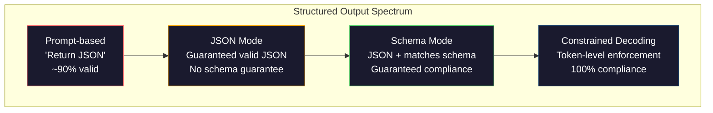
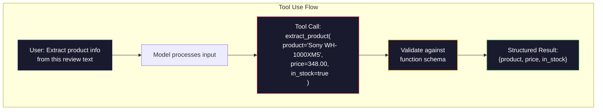

# Output estruturado: JSON, validação de esquema, decodificação restrita.

> O LLM retorna uma cadeia. O seu aplicativo precisa de JSON. Essa lacuna caiu mais sistemas de produção do que qualquer alucinação de modelo. A saída estruturada é a ponte entre linguagem natural e dados digitalizados. Faça o certo e o seu LLM se torna uma API confiável. Faça o errado e você está analisando texto livre com regex às 3 da manhã.

> **【中文解读】**LLM  retornar a ficha, mas a aplicação requer JSON. O output estruturado é um ponte entre linguagem natural e dados de tipo, é o LLM de "chatting machine" evolução para "API confiável"

> **【拓展：结构化输出→AI应用开发】**结构化输出是函数调用、RAG管道、数据提取等 AI 应用的基础──OpenAI 的`response_format`、Uso de ferramentas antropicas 、Instructor 库 são ferramentas centrais deste campo ‖

> - Não .**【前置】**学本节前请先掌握:(1) Fase 10·01-05(LLM 基础) 理解代号 生成;(2) JSON Schema 基础(`type`- Não.`properties`- Não.`required`);(3) Python `pydantic`- Não .`dataclasses`本节使用Pydantic做验证──如果不懂JSON Schema,先看 jsonschema.org 的 5 分钟教程──

**Type:** Build | **类型:** 构建
**Languages:** Python | **语言:** Python
**Prerequisites:** Phase 10, Lessons 01-05 (LLMs from Scratch) | **前置知识:** Phase 10 · 01-05 (从零构建 LLM)
**Time:** ~90 minutes | **时间:** ~90 分钟
**Related:**A fase 5 · 20 (Output estruturado e decodificação restrita) abrange a teoria de nível de decodificador (processadores de logit FSM/CFG, Outlines, XGrammar).`response_format`, Utilização de ferramentas antropológicas, Instructor)  ler a Fase 5 · 20 primeiro se quiser entender o que está acontecendo abaixo da API. **相关:**Fase 5 · 20 (struktur化输出与约束解码) 讲解码器级理论(FSM/CFG logit 处理器、Outlines、XGrammar)`response_format`、Uso de ferramentas antropológicas 、Instructor) 想了解API 底下发生什么先读阶段 5 · 20──

## Objetivos de aprendizagem

- Implementar saídas de modo JSON e de esquema restritos usando os parâmetros OpenAI e API Antropic
  Utilize OpenAI e API Antropic 参数 realçar JSON 模式和方案 约束输出
- Construir uma camada de validação Pydantic que rejeite saídas de LLM mal formadas e retestes com feedback de erro
  Construir Pydantic 验证层, rejeitar format error of LLM 输出并通过错误反重试
- Explique como a decodificação restrita força a JSON válida no nível do token sem pós-processamento
  解释约束解码 como em token 级强制生成有效JSON,无需后处理
- Projetar robustas instruções de extração que convertam de forma confiável texto não estruturado em estruturas de dados digitalizadas
  设计鲁棒的提取提示, fiable will be nonstructured text transformed into categorized data structure

> **【中文解读】**Este curso tem como objetivo: fazer o LLM 输出结构化数据(JSON、XML、表格)                                                                                                                                                                                                                                                                                            


## O problema é o problema da introdução

Você pergunta a um LLM: "Extrair o nome do produto, preço e disponibilidade deste texto".

> Você pergunta LLM:"De este parágrafo, "Não é necessário que você tenha um preço de venda ou um preço de venda ou um preço de venda ou um preço de venda ou um preço de venda ou um preço de venda ou um preço de venda ou um preço de venda ou um preço de venda ou um preço de venda ou um preço de venda ou um preço de venda ou um preço de venda ou um preço de venda ou um preço de venda ou um preço de venda ou um preço de venda ou um preço de venda ou um preço de venda ou um preço de venda ou um preço de venda ou um preço de venda ou um preço de venda ou um preço de venda ou um preço de venda ou um preço de venda ou um preço de venda ou um preço de venda ou um preço de um preço de um preço de um preço de um preço de um preço de um preço de um preço de um preço de um preço de um preço de um preço de um preço de um preço de um preço de um preço de um preço de um preço de um preço de um preço de um preço de um preço de um preço de um preço de um preço de um preço de um preço de um preço de um preço de um preço de um preço de um preço de um preço de um preço de um preço de um preço de um preço de um preço de um preço de um preço de um preço de um preço de um preço de um preço de um preço de um preço de um preço de um preço de um preço de um preço de um preço de um preço de um preço de um preço de um preço de um preço de um preço de um preço de um preço de um preço de um preço de um preço de um preço de um preço de um preço de um preço de um preço de um preço de um preço de um preço de um preço de um preço de um preço de um preço de um preço de um preço de um preço de um preço de um preço de um preço de um preço de um preço de um preço de um preço de um preço de um preço de um preço de um preço de um preço de um preço de uma.

É uma resposta perfeitamente correta. Também é completamente inútil para a sua aplicação.`{"product": "Sony WH-1000XM5", "price": 348.00, "in_stock": true}`Você precisa de um objeto JSON com chaves específicas, tipos específicos e restrições de valor específicas.

> É uma resposta totalmente correta. Mas também não é útil para a sua aplicação.`{"product": "Sony WH-1000XM5", "price": 348.00, "in_stock": true}`◊ Você precisa de um objeto JSON com um tipo específico de chave e um valor específico.

A solução ingênua: adicionar "Responder em JSON" ao seu pedido. Isto funciona 90% das vezes. O outro 10% do modelo envolve o JSON em cercas de código de marcação, ou adiciona um preâmbulo como "Aqui está o JSON:", ou produz JSON sintagmaticamente inválido porque fechou um braço cedo. O teu parsementa JSON falha. O teu gasoduto está a quebrar. Adicionamos tentativa/exceto e um ciclo de retest. A retestagem às vezes produz dados diferentes. Agora, tens um problema de consistência em cima de um problema de análise.

> Solução simples: adicionar "com JSON 回复" à sua dica. Isso é válido em 90% dos casos. O restante 10% é válido. Quando o modelo coloca o JSON em blocos de código de marcação, ou adicionar "é como JSON:" ou "é como JSON:" ou porque o JSON não funciona. Seu JSON 解析器 desmoronou. Seu fluxo de água foi interrompido. Você adicionou o ciclo de tentativa e re-teste.

Este não é um problema de engenharia imediata. É um problema de decodificação. O modelo gera tokens de esquerda para direita. Em cada posição, ele escolhe o próximo token mais provável de um vocabulário de 100K + opções. A maioria dessas opções produziria JSON inválido em qualquer posição dada. Se o modelo apenas emitido `{"price":`, o próximo símbolo deve ser um dígito, uma citação (para uma cadeia), `null`- Não .`true`- Não .`false`O modelo pode escolher uma palavra inglesa perfeitamente razoável que seja catastróficamente errada sintaticamente.

> Não é um problema de engenharia de sugestões. É um problema de decodificação. O modelo gera um token de esquerda para direita. Em cada posição, ele seleciona o próximo token mais possível de uma lista de 100.000 opções. A maioria das opções em qualquer posição é inefetiva.`{"price":`, Next token 必須是数字、引号 ((para usar em字符串) 、`null`- Não.`true`- Não.`false`Ou negativo número. Tudo o resto produzirá JSON inefficiente. Sem restrições, o modelo pode escolher uma palavra inglesa completamente razoável, mas na gramática é um erro catastrófico.

> - Não .**【类比】**Não tenho a certeza de que o meu programa de ensino está em curso. Não posso fazer isso. Não posso fazer isso. Não posso fazer isso. Não posso fazer isso.

> ️ **【易错点】**结构化输出 3 个坑: ((1) **Schema 字段过多** Mais de 20 个字段模型记不住,会漏字段或填错;修复: demolição em嵌套对象, cada camada não mais de 5 个字段──(2) **要求 LLM 输出"创造性"字段但又强 Schema**por exemplo, "Propriar um título criativo"`title: str`, modelo foi Schema 约束后变得保守;修复:用 `temperature=0.9`+ Schema 中加 `min_length: 10`留余地──(3) **没用 Pydantic 验证** direta `json.loads()`"348") é transformado em str e não flutuante; com Pydantic automático tipo de transformação forçada.

## O conceito central.

> **【中文解读】**结构化输出是让LLM 生成 JSON、XML等格式的可控输出──关键技术:函数调用(Função Chamando)让模型输出预定义的 JSON schema, JSON mode 强制模型生成合法 JSON,约束解码(constrained decoding) 在代币级别保证输出格式──

> 🤔 **【困惑】**P: OpenAI `response_format={"type": "json_object"}`和 `response_format={"type": "json_schema", ...}`Há alguma diferença? A: O primeiro é o "modo JSON" que garante a saída legal de JSON, mas não garante o segmento. O segundo é o "produtos estruturados" que você dá ao JSON Schema, modelo garante a saída de acordo com o esquema. O primeiro é barato, mas não rigoroso, o segundo é caro por vezes, mas 100% de acordo com as regras.`json_schema`- Não.

> **【拓展：结构化输出的工程实践】**O modelo de produção de JSON está em conformidade com o esquema de JSON, com uma confiabilidade de cerca de 90% para 100%.


### Espectro estruturado de produção

Existem quatro níveis de controlo estruturado de saída, cada um mais confiável do que o anterior.

> O controlo estruturado de saída tem quatro classes, cada uma mais confiável do que a anterior.



**Prompt-based**("Responde em JSON válido"): sem execução. O modelo geralmente cumpre, mas às vezes não. Confiabilidade: ~ 90%. Modo de falha: cercas de marcação, texto de preâmbulo, saída truncada, estrutura errada.

> **基于提示**("Use有效的 JSON 回复"): não há execução obrigatória. O modelo normalmente será observado, mas às vezes não será.

**JSON mode**A API garante que a saída seja válida JSON.`response_format: { type: "json_object" }`O resultado irá analisar sem erros, mas pode não corresponder ao esquema esperado - chaves extras, tipos errados, campos faltantes.

> **JSON 模式**A API garante que o output é válido JSON.`response_format: { type: "json_object" }` Enable this function── Output can be without error analysis── mas pode não corresponder ao esquema de excesso de tecidos, tipo de erro, segmento de falta

**Schema mode**A API assume um esquema JSON e garante que a saída corresponda a ele.`response_format: { type: "json_schema", json_schema: {...} }`(também como `tool_choice="required"`), o uso de ferramentas da Anthropic com `input_schema`, e os Gémeos.`response_schema`+ `response_mime_type: "application/json"`A saída tem as chaves, tipos e restrições exatas que você especificou.

> **Schema 模式**API  aceitar JSON Schema 并保证输出匹配──2026 `response_format: { type: "json_schema" }`、Antropic 带`input_schema`O uso de ferramentas ≈ Gemini `response_schema`◊ Output possui o tipo e o tipo de chave definido.

**Constrained decoding**A partir daí, o modelo pode ser usado para produzir tokens que levem a uma saída válida.

> **约束解码**A posição de cada token no processo de geração, o descifrador impede que todos produzam um token sem efeito. Se o esquema exigir que o modelo digital em breve produz letras, a probabilidade do token é definida como zero. O modelo só pode produzir um token com saída válida.

### JSON Schema: A linguagem do contrato

JSON Schema é como você diz ao modelo (ou camada de validação) qual a forma que a saída deve ter.

> JSON Schema é o modo como você diz ao modelo (ou nível de verificação) que o output deve ter alguma forma.

```json
{
  "type": "object",
  "properties": {
    "product": { "type": "string" },
    "price": { "type": "number", "minimum": 0 },
    "in_stock": { "type": "boolean" },
    "categories": {
      "type": "array",
      "items": { "type": "string" }
    }
  },
  "required": ["product", "price", "in_stock"]
}
```

Este esquema diz: a saída deve ser um objeto com uma cadeia `product`, um número não negativo `price`, um booleano `in_stock`, e uma matriz opcional de cordas `categories`Qualquer saída que não coincida é rejeitada.

> Este esquema explicativo: saída deve ser um objeto, contendo letras `product`Não-número negativo`price`Valores`in_stock`和可选的字符串数组 `categories`Qualquer saída que não coincida será rejeitada.

Os esquemas tratam os casos difíceis: objetos aninhados, matrizes com elementos digitalizados, enums (constrir uma cadeia a valores específicos), correspondência de padrões (regex em cadeias) e combinadores (oneOf, anyOf, allOf para saídas polimórficas).

> Schema  Processamento de situação complexa:嵌套对象、带类型项的数组、枚举(将字符串约束为特定值) 模式匹配(字符串上的正则表达式) 和组合器(oneOf、anyOf、allOf 用于多态输出) ⋅

### O padrão pidantico

Em Python, você não escreve JSON Schema à mão. Você define um modelo Pydantic e ele gera o esquema para você.

> Em Python, você não precisa escrever JSON Schema. Você define um modelo Pydantic, ele irá gerar um esquema para você.

```python
from pydantic import BaseModel

class Product(BaseModel):
    product: str
    price: float
    in_stock: bool
    categories: list[str] = []
```

O Instructor (e o SDK do OpenAI) aceita modelos Pydantic diretamente: passar a classe de modelo, obter de volta uma instância validada.

> Este gerará o mesmo esquema JSON acima. Instructor 库(和 OpenAI 的 SDK) directamente aceitar Pydantic 模型:传入模型类,返回验证过的实例――

### Função de chamada / Utilização de ferramentas

Uma interface alternativa para o mesmo problema. Em vez de pedir ao modelo para produzir JSON diretamente, você define "ferramentas" (funções) com parâmetros digitalizados. O modelo expande uma chamada de função com argumentos estruturados. O OpenAI chama isso de "chamadas de funções".

>  resolver o mesmo problema ∞ não exige que o modelo produz diretamente JSON, mas define o modelo de saída com "herramienta" de tipo de parâmetro (função) ∞.



O uso de ferramentas é preferido quando o modelo precisa escolher qual função chamar, não apenas preencher parâmetros. Se você tem 10 esquemas de extração diferentes e o modelo deve escolher o certo com base na entrada, o uso de ferramentas lhe dá a seleção de esquema e a saída estruturada.

> Quando o modelo precisa escolher qual função é utilizada e não apenas para preencher os parâmetros, o primeiro é usar a ferramenta de seleção. Se você tiver 10 esquemas diferentes de extração e o modelo deve ser usado de acordo com a entrada escolhida correta, a ferramenta também fornece esquema de seleção e saída estruturada.

### Modos comuns de falhas

Mesmo com a aplicação do esquema, as saídas estruturadas podem falhar de maneiras sutis.

> Mesmo que haja esquema de execução forçada, as saídas estruturadas também podem falhar de forma delicada.

**Hallucinated values**O modelo produz `{"price": 299.99}`Quando o texto diz $348. A validação do esquema não consegue captar isto -- o tipo é correto, o valor é errado.

> **幻觉值**Output matching schema, mas contém dados falsos.`{"price": 299.99}` Esquema verificação não consegue capturar este problema  tipo de correcto, valor erróneo 

**Enum confusion**: você restringir um campo para `["in_stock", "out_of_stock", "preorder"]`- As saídas do modelo .`"available"`- semânticamente correto, mas não no conjunto permitido. A boa decodificação restrita impede isso.

> **枚举混淆**Você vai ficar com ele.`["in_stock", "out_of_stock", "preorder"]` Modelo de saída`"available"`语义上正确,但不允许的集合中. 语义上正确,但不允许的集合中. 语义上正确,但不允许的集合中. 语义上正确,但不允许的集合中. 语义上正确,但不允许的集合中. 语义上正确,但不允许的集合中. 语义上正确,但不允许的集合中. 语义上正确,但不允许的集合中. 好的约束解码可以防止这种情况.

**Nested object depth**A maioria dos sistemas de sistema de sistema de sistema de sistema de sistema de sistema de sistema de sistema de sistema de sistema de sistema de sistema de sistema de sistema de sistema de sistema de sistema de sistema de sistema de sistema de sistema de sistema de sistema de sistema de sistema de sistema de sistema de sistema de sistema de sistema de sistema de sistema de sistema de sistema de sistema de sistema de sistema de sistema de sistema de sistema de sistema de sistema de sistema de sistema de sistema de sistema de sistema de sistema de sistema de sistema de sistema de sistema de sistema de sistema de sistema de sistema de sistema de sistema de sistema de sistema de sistema de sistema de sistema de sistema de sistema de sistema de sistema de sistema de sistema de sistema de sistema de sistema de sistema de sistema de sistema de sistema de sistema de sistema de sistema de sistema de sistema de sistema de sistema de sistema de sistema de sistema de sistema de sistema de sistema de sistema de sistema de sistema de sistema de sistema de sistema de sistema de sistema de sistema de sistema de sistema de sistema de sistema de sistema de sistema de sistema de sistema de sistema de sistema de sistema de sistema de sistema de sistema de sistema de sistema de sistema de sistema de sistema de sistema de sistema de sistema de sistema de sistema de sistema de sistema de sistema de sistema de sistema de sistema de sistema de sistema de sistema de sistema de sistema de sistema de sistema de sistema de sistema de sistema de sistema de sistema de sistema de sistema de sistema de sistema de sistema de sistema de sistema de sistema de sistema de sistema de sistema de sistema de sistema de sistema de sistema de sistema de sistema de sistema de sistema de sistema de sistema de sistema de sistema de sistema de sistema de sistema de sistema de sistema de sistema de sistema de sistema de sistema de sistema de sistema de sistema de sistema de sistema de sistema de sistema de sistema de sistema de sistema de sistema de sistema de sistema de sistema de sistema de sistema de sistema de sistema de sistema de sistema de sistema de sistema de sistema de sistema de sistema de sistema de sistema de sistema de sistema de sistema de sistema de sistema de sistema de sistema de sistema de sistema de sistema de sistema de sistema de sistema de sistema de sistema de sistema de sistema de sistema de sistema de sistema de sistema de sistema de sistema de sistema de sistema de sistema de sistema de sistema de sistema de sistema de sistema de sistema de sistema de sistema de sistema de sistema de sistema de sistema de sistema de sistema de sistema de sistema de sistema de sistema de sistema de sistema de sistema de sistema de sistema de sistema de sistema de sistema de sistema de sistema

> **嵌套对象深度**A estrutura de cada um dos layers é um modelo que pode ser perdido em outro lugar.

**Array length**O modelo pode produzir demasiados ou poucos elementos numa matriz.`minItems`E ...`maxItems`Mas nem todos os provedores aplicam-nos no nível de decodificação.

> **数组长度**Modelo pode produzir muito ou muito pouco de elementos no conjunto.`minItems`和 `maxItems`Mas nem todos os fornecedores estão obrigados a executar o código de código.

**Optional field omission**O modelo omite campos que são tecnicamente opcionais, mas semânticamente importantes para o seu caso de uso.`null`- Explicitamente.

> **可选字段遗漏**O modelo é tecnicamente opcional, mas em sentido linguístico é muito importante para o seu caso de uso. Mesmo que os dados tenham a falta de tempo, também no esquema, eles serão definidos como necessários para a produção de modelos forçados.`null`- Não.

## Construí-lo e realizei-o.
```figure
mx-schema-funnel
```

## Construí-lo

### Passo 1: Validador de esquema JSON

Construir um validador a partir do zero que verifique se um objeto Python corresponde a um esquema JSON.

> A partir do zero construção de verificadores, verifique se o Python é um objeto que corresponde ao JSON Schema.

```python
import json

def validate_schema(data, schema):
    errors = []
    _validate(data, schema, "", errors)
    return errors

def _validate(data, schema, path, errors):
    schema_type = schema.get("type")

    if schema_type == "object":
        if not isinstance(data, dict):
            errors.append(f"{path}: expected object, got {type(data).__name__}")
            return
        for key in schema.get("required", []):
            if key not in data:
                errors.append(f"{path}.{key}: required field missing")
        properties = schema.get("properties", {})
        for key, value in data.items():
            if key in properties:
                _validate(value, properties[key], f"{path}.{key}", errors)

    elif schema_type == "array":
        if not isinstance(data, list):
            errors.append(f"{path}: expected array, got {type(data).__name__}")
            return
        min_items = schema.get("minItems", 0)
        max_items = schema.get("maxItems", float("inf"))
        if len(data) < min_items:
            errors.append(f"{path}: array has {len(data)} items, minimum is {min_items}")
        if len(data) > max_items:
            errors.append(f"{path}: array has {len(data)} items, maximum is {max_items}")
        items_schema = schema.get("items", {})
        for i, item in enumerate(data):
            _validate(item, items_schema, f"{path}[{i}]", errors)

    elif schema_type == "string":
        if not isinstance(data, str):
            errors.append(f"{path}: expected string, got {type(data).__name__}")
            return
        enum_values = schema.get("enum")
        if enum_values and data not in enum_values:
            errors.append(f"{path}: '{data}' not in allowed values {enum_values}")

    elif schema_type == "number":
        if not isinstance(data, (int, float)):
            errors.append(f"{path}: expected number, got {type(data).__name__}")
            return
        minimum = schema.get("minimum")
        maximum = schema.get("maximum")
        if minimum is not None and data < minimum:
            errors.append(f"{path}: {data} is less than minimum {minimum}")
        if maximum is not None and data > maximum:
            errors.append(f"{path}: {data} is greater than maximum {maximum}")

    elif schema_type == "boolean":
        if not isinstance(data, bool):
            errors.append(f"{path}: expected boolean, got {type(data).__name__}")

    elif schema_type == "integer":
        if not isinstance(data, int) or isinstance(data, bool):
            errors.append(f"{path}: expected integer, got {type(data).__name__}")
```

### Passo 2: Modelo de estilo Pydantic para esquema

Construa um conversor de classe para esquema mínimo. Defina uma classe Python e gerar seu esquema JSON automaticamente.

> 构建最小类到 schema 转换器──定义 Python 类, automaticamente gerar seu JSON Schema──

```python
class SchemaField:
    def __init__(self, field_type, required=True, default=None, enum=None, minimum=None, maximum=None):
        self.field_type = field_type
        self.required = required
        self.default = default
        self.enum = enum
        self.minimum = minimum
        self.maximum = maximum

def python_type_to_schema(field):
    type_map = {
        str: "string",
        int: "integer",
        float: "number",
        bool: "boolean",
    }

    schema = {}

    if field.field_type in type_map:
        schema["type"] = type_map[field.field_type]
    elif field.field_type == list:
        schema["type"] = "array"
        schema["items"] = {"type": "string"}
    elif isinstance(field.field_type, dict):
        schema = field.field_type

    if field.enum:
        schema["enum"] = field.enum
    if field.minimum is not None:
        schema["minimum"] = field.minimum
    if field.maximum is not None:
        schema["maximum"] = field.maximum

    return schema

def model_to_schema(name, fields):
    properties = {}
    required = []

    for field_name, field in fields.items():
        properties[field_name] = python_type_to_schema(field)
        if field.required:
            required.append(field_name)

    return {
        "type": "object",
        "properties": properties,
        "required": required,
    }
```

### Passo 3: Filtro de Tokens Com Restrições

Simula a decodificação restrita. Dada uma cadeia JSON parcial e um esquema, determine quais categorias de tokens são válidas na posição atual.

> 模拟约束解码──给定部分 JSON 字符串和方案, determinar quais tokens estão em posição atual 类别有效──

```python
def next_valid_tokens(partial_json, schema):
    stripped = partial_json.strip()

    if not stripped:
        return ["{"]

    try:
        json.loads(stripped)
        return ["<EOS>"]
    except json.JSONDecodeError:
        pass

    last_char = stripped[-1] if stripped else ""

    if last_char == "{":
        return ['"', "}"]
    elif last_char == '"':
        if stripped.endswith('":'):
            return ['"', "0-9", "true", "false", "null", "[", "{"]
        return ["a-z", '"']
    elif last_char == ":":
        return [" ", '"', "0-9", "true", "false", "null", "[", "{"]
    elif last_char == ",":
        return [" ", '"', "{", "["]
    elif last_char in "0123456789":
        return ["0-9", ".", ",", "}", "]"]
    elif last_char == "}":
        return [",", "}", "]", "<EOS>"]
    elif last_char == "]":
        return [",", "}", "<EOS>"]
    elif last_char == "[":
        return ['"', "0-9", "true", "false", "null", "{", "[", "]"]
    else:
        return ["any"]

def demonstrate_constrained_decoding():
    partial_states = [
        '',
        '{',
        '{"product"',
        '{"product":',
        '{"product": "Sony"',
        '{"product": "Sony",',
        '{"product": "Sony", "price":',
        '{"product": "Sony", "price": 348',
        '{"product": "Sony", "price": 348}',
    ]

    print(f"{'Partial JSON':<45} {'Valid Next Tokens'}")
    print("-" * 80)
    for state in partial_states:
        valid = next_valid_tokens(state, {})
        display = state if state else "(empty)"
        print(f"{display:<45} {valid}")
```

### Passo 4: Pipeline de extracção

Combine tudo em um pipeline de extracção: defina um esquema, simule um LLM produzindo saída estruturada, valida a saída e maneja retries.

> Colocar tudo em conjunto: definir esquema, simulação de Mestrado em Mestrado em Mestrado em Mestrado em Mestrado em Mestrado em Mestrado em Mestrado em Mestrado em Mestrado em Mestrado em Mestrado em Mestrado em Mestrado em Mestrado em Mestrado em Mestrado em Mestrado em Mestrado em Mestrado em Mestrado em Mestrado em Mestrado em Mestrado em Mestrado em Mestrado em Mestrado em Mestrado em Mestrado em Mestrado em Mestrado em Mestrado em Mestrado em Mestrado em Mestrado em Mestrado em Mestrado em Mestrado em Mestrado em Mestrado em Mestrado em Mestrado em Mestrado em Mestrado em Mestrado em Mestrado em Mestrado em Mestrado em Mestrado em Mestrado em Mestrado em Mestrado em Mestrado em Mestrado em Mestrado em Mestrado em Mestrado em Mestrado em Mestrado em Mestrado em Mestrado em Mestrado em Mestrado em Mestrado em Mestrado em Mestrado em Mestrado em Mestrado em Mestrado em Mestrado em Mestrado em Mestrado em Mestrado em Mestrado em Mestrado em Mestrado em Mestrado em Mestrado em Mestrado em Mestrado em Mestrado em Mestrado em Mestrado em Mestrado em Mestrado em Mestrado em Mestrado em Mestrado em Mestrado em Mestrado em Mestrado em Mestrado em Mestrado em Mestrado em Mestrado em Mestrado em Mestrado em Mestrado em Mestrado em Mestrado em Mestrado em Mestrado em Mestrado em Mestrado em Mestrado em Mestrado em Mestrado em Mestrado em Mestrado em Mestrado em Mestrado em Mestrado em Mestrado em Mestrado em Mestrado em Mestrado em Mestrado em Mestrado em Mestrado em Mestrado em Mestrado em Mestrado em Mestrado em Mestrado em M

```python
def simulate_llm_extraction(text, schema, attempt=0):
    if "headphones" in text.lower() or "sony" in text.lower():
        if attempt == 0:
            return '{"product": "Sony WH-1000XM5", "price": 348.00, "in_stock": true, "categories": ["audio", "headphones"]}'
        return '{"product": "Sony WH-1000XM5", "price": 348.00, "in_stock": true}'

    if "laptop" in text.lower():
        return '{"product": "MacBook Pro 16", "price": 2499.00, "in_stock": false, "categories": ["computers"]}'

    return '{"product": "Unknown", "price": 0, "in_stock": false}'

def extract_with_retry(text, schema, max_retries=3):
    for attempt in range(max_retries):
        raw = simulate_llm_extraction(text, schema, attempt)

        try:
            data = json.loads(raw)
        except json.JSONDecodeError as e:
            print(f"  Attempt {attempt + 1}: JSON parse error -- {e}")
            continue

        errors = validate_schema(data, schema)
        if not errors:
            return data

        print(f"  Attempt {attempt + 1}: Schema validation errors -- {errors}")

    return None

product_schema = {
    "type": "object",
    "properties": {
        "product": {"type": "string"},
        "price": {"type": "number", "minimum": 0},
        "in_stock": {"type": "boolean"},
        "categories": {"type": "array", "items": {"type": "string"}},
    },
    "required": ["product", "price", "in_stock"],
}
```

### Passo 5: Caminhe o oleoduto completo

> 步骤 5:运行完整流水线──

```python
def run_demo():
    print("=" * 60)
    print("  Structured Output Pipeline Demo")
    print("=" * 60)

    print("\n--- Schema Definition ---")
    product_fields = {
        "product": SchemaField(str),
        "price": SchemaField(float, minimum=0),
        "in_stock": SchemaField(bool),
        "categories": SchemaField(list, required=False),
    }
    generated_schema = model_to_schema("Product", product_fields)
    print(json.dumps(generated_schema, indent=2))

    print("\n--- Schema Validation ---")
    test_cases = [
        ({"product": "Test", "price": 10.0, "in_stock": True}, "Valid object"),
        ({"product": "Test", "price": -5.0, "in_stock": True}, "Negative price"),
        ({"product": "Test", "in_stock": True}, "Missing price"),
        ({"product": "Test", "price": "ten", "in_stock": True}, "String as price"),
        ("not an object", "String instead of object"),
    ]

    for data, label in test_cases:
        errors = validate_schema(data, product_schema)
        status = "PASS" if not errors else f"FAIL: {errors}"
        print(f"  {label}: {status}")

    print("\n--- Constrained Decoding Simulation ---")
    demonstrate_constrained_decoding()

    print("\n--- Extraction Pipeline ---")
    texts = [
        "The Sony WH-1000XM5 headphones are priced at $348 and currently available.",
        "The new MacBook Pro 16-inch laptop costs $2499 but is sold out.",
        "This is a random sentence with no product info.",
    ]

    for text in texts:
        print(f"\n  Input: {text[:60]}...")
        result = extract_with_retry(text, product_schema)
        if result:
            print(f"  Output: {json.dumps(result)}")
        else:
            print(f"  Output: FAILED after retries")
```

## Use-o com o framework implementado.

### Outputes estruturadas da OpenAI

> OpenAI  estruturado 输出──

```python
# from openai import OpenAI
# from pydantic import BaseModel
#
# client = OpenAI()
#
# class Product(BaseModel):
#     product: str
#     price: float
#     in_stock: bool
#
# response = client.beta.chat.completions.parse(
#     model="gpt-5-mini",
#     messages=[
#         {"role": "system", "content": "Extract product information."},
#         {"role": "user", "content": "Sony WH-1000XM5, $348, in stock"},
#     ],
#     response_format=Product,
# )
#
# product = response.choices[0].message.parsed
# print(product.product, product.price, product.in_stock)
```

O modo de saída estruturada do OpenAI usa decodificação restrita internamente. Cada token gerado pelo modelo é garantido para produzir saída correspondente ao esquema Pydantic. Não são necessárias retries. Não é necessária validação. A restrição é incorporada ao processo de decodificação.

> O modelo de saída estruturada do OpenAI é usado internamente para criar um código de segurança. Cada token gerado pelo modelo garante a sua saída de um esquema Pydantic. Não é necessário tentar novamente. Não é necessário verificar.

### Utilização de Ferramentas Antropicas

> Antropic 工具使用──

```python
# import anthropic
#
# client = anthropic.Anthropic()
#
# response = client.messages.create(
#     model="claude-opus-4-7",
#     max_tokens=1024,
#     tools=[{
#         "name": "extract_product",
#         "description": "Extract product information from text",
#         "input_schema": {
#             "type": "object",
#             "properties": {
#                 "product": {"type": "string"},
#                 "price": {"type": "number"},
#                 "in_stock": {"type": "boolean"},
#             },
#             "required": ["product", "price", "in_stock"],
#         },
#     }],
#     messages=[{"role": "user", "content": "Extract: Sony WH-1000XM5, $348, in stock"}],
# )
```

O modelo emite uma chamada de ferramenta com argumentos estruturados que correspondem ao input_schema. O mesmo resultado, superfície de API diferente.

> Antropic  através do uso de ferramentas 实现结构化输出──模型发发出一个工具调用,其结构化参数匹配 input_schema──结果相同,API 接口不同──

### Biblioteca de instrutores

> Instructor 库。

```python
# pip install instructor
# import instructor
# from openai import OpenAI
# from pydantic import BaseModel
#
# client = instructor.from_openai(OpenAI())
#
# class Product(BaseModel):
#     product: str
#     price: float
#     in_stock: bool
#
# product = client.chat.completions.create(
#     model="gpt-5-mini",
#     response_model=Product,
#     messages=[{"role": "user", "content": "Sony WH-1000XM5, $348, in stock"}],
# )
```

O instrutor envolve qualquer cliente de LLM e adiciona retries automáticas com validação. Se a primeira tentativa falhar na validação, envia os erros de volta ao modelo como contexto e pede para corrigir a saída. Isso funciona com qualquer fornecedor, não apenas OpenAI.

> Instructor  embalar qualquer LLM  cliente                                                                                                                                                                                                                                                                                                                                                                                                                                                                                                                   

## Envia-o . Produto .

Esta lição produz`outputs/prompt-structured-extractor.md`-- um modelo de resposta reutilizável que extrai dados estruturados de qualquer texto dado uma definição de esquema.

> 本课产生 `outputs/prompt-structured-extractor.md` Um modelo de sugestão reutilizável, dado schema  definição, de qualquer texto em que se extrai dados estruturados.

Também produz `outputs/skill-structured-outputs.md`-- um quadro de decisão para escolher a estratégia de saída estruturada certa com base no seu provedor, requisitos de confiabilidade e complexidade do esquema.

> Também se produz.`outputs/skill-structured-outputs.md` um quadro de decisão, de acordo com as necessidades e esquemas de confiabilidade do seu fornecedor  complexidade de escolha de estratégias de saída estruturadas corretas

## Exercícios.

1. Extenda o validador de esquema para suportar `oneOf`(os dados devem corresponder exatamente a um de vários esquemas).`Product`ou um `Service`objetos de diferentes formas.
                                                                                                                                                                                                                                                                                                                                                                                                                                                                                                                                `oneOf`(data deve corresponder a um de vários esquemas) `Product`Ou `Service`Objeto:

2. Construa uma ferramenta de "diferência de esquema" que compara dois esquemas e identifica as alterações quebrantes (campoes necessários removidos, tipos alterados) versus as alterações não quebrantes (campoes opcionais adicionados, restrições relaxadas).
   Construir um "esquema diferente" ferramenta, comparar dois esquemas e identificar alterações destrutivas (incluindo:

3. Implementar um simulador de decodificação restrita mais realista. Dado um esquema JSON e um vocabulário de 100 tokens (letras, dígitos, pontuação, palavras-chave), passe pela geração passo a passo, mascando tokens inválidos em cada posição. Meter qual porcentagem do vocabulário é válida em cada passo.
   实现 um um mais real de um modelo de código. ⋅ dados JSON Schema 和 100 tokens de palavras, gerado gradualmente, em cada posição, bloqueio sem efeito. ⋅ medir cada passo de palavras.

4. Crie uma suite de avaliação de extração. Crie 50 descrições de produtos com saídas JSON rotuladas à mão. Execute o pipeline de extração em todos os 50 e mensure a correspondência exata, a precisão de nível de campo e a conformidade de tipo. Identifique quais campos são mais difíceis de extrair corretamente.
   Construir um conjunto de avaliação de extração. Crie 50 descrições de produtos e marcas de JSON 输出.

5. Adicione "escores de confiança" ao seu pipeline de extração. Para cada campo extraído, estimar o quão confiante o modelo é (com base nas probabilidades de token, ou executando a extração 3 vezes e medindo a consistência).
   Para a avaliação da probabilidade de cada uma das fases, o modelo de avaliação da probabilidade de cada uma das fases é baseado em um token ou em uma correspondência de três vezes de avaliação da probabilidade de execução.

## Termos-chave .

| Term | What people say | What it actually means | 中文释义 |
|------|----------------|----------------------|---------|
| JSON mode | "Returns JSON" / "返回 JSON" | API flag that guarantees syntactically valid JSON output, but does not enforce any particular schema | JSON 模式：API 标志，保证语法有效的 JSON 输出，但不强制执行特定 schema |
| Structured output | "Typed JSON" / "类型化 JSON" | Output that matches a specific JSON Schema with correct keys, types, and constraints | 结构化输出：匹配特定 JSON Schema 的输出，具有正确的键、类型和约束 |
| Constrained decoding | "Guided generation" / "引导生成" | At each token position, mask out tokens that would produce invalid output -- guarantees 100% schema compliance | 约束解码：在每个 token 位置屏蔽会产生无效输出的 token，保证 100% schema 合规 |
| JSON Schema | "A JSON template" / "JSON 模板" | A declarative language for describing the structure, types, and constraints of JSON data (used by OpenAPI, JSON Forms, etc.) | JSON Schema：描述 JSON 数据结构、类型和约束的声明式语言 |
| Pydantic | "Python dataclasses+" / "Python 数据类+" | Python library that defines data models with type validation, used by FastAPI and Instructor to generate JSON Schemas | Pydantic：定义带类型验证数据模型的 Python 库，用于生成 JSON Schema |
| Function calling | "Tool use" / "工具使用" | LLM outputs a structured function invocation (name + typed arguments) instead of free text -- OpenAI and Anthropic both support this | 函数调用：LLM 输出结构化的函数调用（名称+类型化参数），而非自由文本 |
| Instructor | "Pydantic for LLMs" / "LLM 的 Pydantic" | Python library that wraps LLM clients to return validated Pydantic instances, with automatic retry on validation failure | Instructor：包装 LLM 客户端返回验证过的 Pydantic 实例的 Python 库 |
| Token masking | "Filtering the vocabulary" / "过滤词表" | Setting specific token probabilities to zero during generation so the model cannot produce them | Token 屏蔽：在生成过程中将特定 token 概率设为零 |
| Schema compliance | "Matches the shape" / "匹配形状" | The output has every required field, correct types, values within constraints, and no extra disallowed fields | Schema 合规：输出具有每个必需字段、正确类型、约束内的值 |
| Retry loop | "Try again until it works" / "重试直到成功" | Send validation errors back to the model and ask it to fix the output -- Instructor does this automatically, up to a configurable max | 重试循环：将验证错误发回模型并要求修复输出 |

## Mais leitura 延伸阅读

- [OpenAI Structured Outputs Guide](https://platform.openai.com/docs/guides/structured-outputs)-- documentação oficial para a descodificação restrita baseada em JSON Schema na API OpenAI
  OpenAI API baseado em JSON Schema
- [Willard & Louf, 2023 -- "Efficient Guided Generation for Large Language Models"](https://arxiv.org/abs/2307.09702)-- o documento Outlines, descrevendo como compilar esquemas JSON em máquinas de estado finito para restrições de nível de token
  Descrição de um artigo, descrição de como fazer JSON Schema 编译为有限状态机以实现代币 级约束
- [Instructor documentation](https://python.useinstructor.com/)-- a biblioteca padrão para obter resultados estruturados de qualquer LLM com validação e retestes Pydantic
  De qualquer LLM  Obter 带 Pydantic 验证和重试的结构化输出标准库
- [Anthropic Tool Use Guide](https://docs.anthropic.com/en/docs/tool-use)-- como Claude implementa a saída estruturada através do uso de ferramentas com JSON Schema input_schema
  Claude  como usar a ferramenta  implementar estruturado de saída  através do JSON Schema input_schema
- [JSON Schema specification](https://json-schema.org/)-- a especificação completa para a linguagem de esquema usada por todos os principais sistemas de saída estruturados
  Esquema de uso de cada principal sistema estruturado de saída
- [Outlines library](https://github.com/outlines-dev/outlines)-- geração limitada de código aberto usando regex e JSON Schema compilado para máquinas de estado finito
  Utilize regras e JSON Schema 编译为有限状态机的开源约束生成库
- [Dong et al., "XGrammar: Flexible and Efficient Structured Generation Engine for Large Language Models" (MLSys 2025)](https://arxiv.org/abs/2411.15100)-- o atual motor de gramática de ponta; compilação automática que enmascara tokens em ~ 100 ns / token.
  Atualmente, o mais avançado linguagem de máquina; baixar automaticamente, com uma velocidade de cerca de 100 ns/token para proteger o token
- [Beurer-Kellner et al., "Prompting Is Programming: A Query Language for Large Language Models" (LMQL)](https://arxiv.org/abs/2212.06094)-- o enquadramento de papel LMQL restrito decodificação como uma linguagem de consulta com restrições de tipo e valor.
  O LMQL de um linguagem de consulta de um conjunto de tipos e valores
- [Microsoft Guidance (framework docs)](https://github.com/guidance-ai/guidance)-- geração limitada baseada em modelos; complemento agnóstico do fornecedor para Outlines e XGrammar.
  模板驱动的约束生成;Outlines 和 XGrammar 的供应商无关补充
