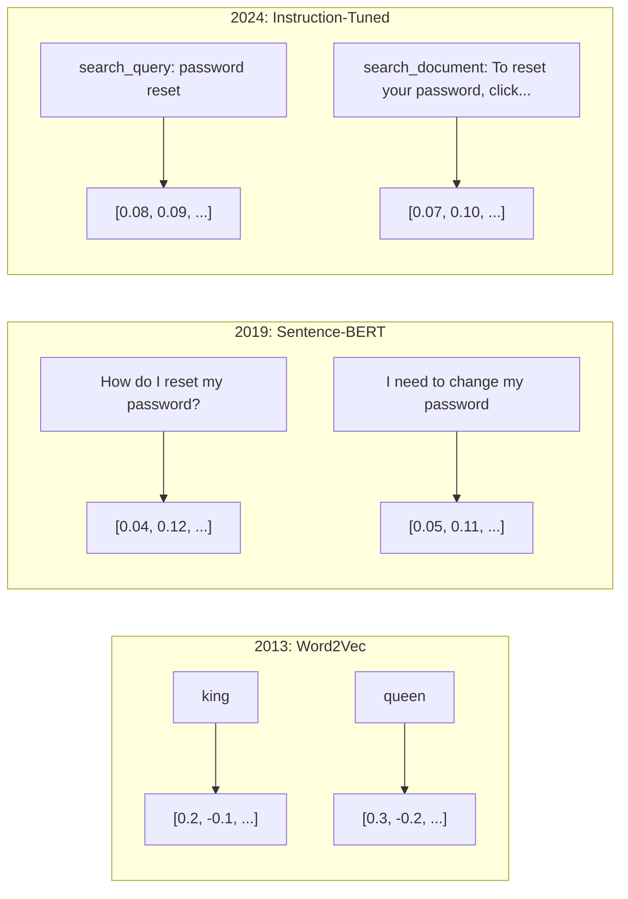
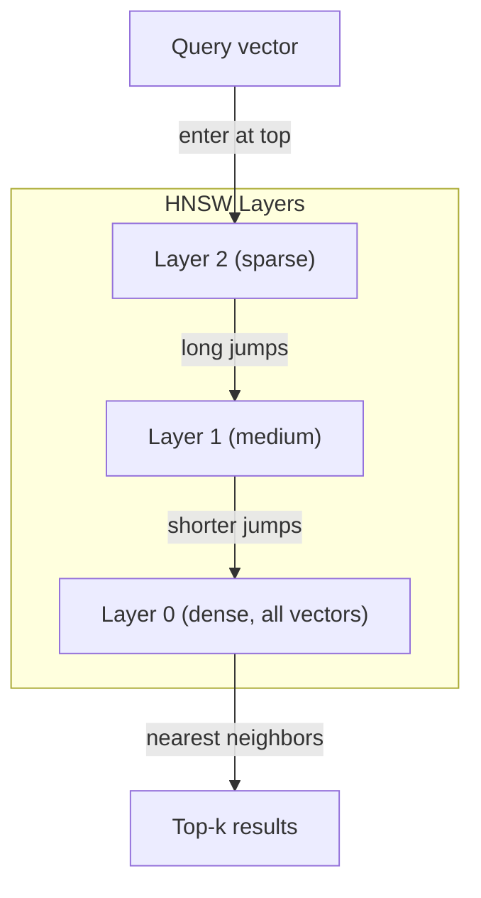

# Embedings & Vector Representations  Embedings e Vector Indicadores

> O texto é discreto. A matemática é contínua. Toda vez que você pede a um LLM para encontrar documentos "similares", comparar significados ou procurar além de palavras-chave, você está confiando em uma ponte entre esses dois mundos. Essa ponte é um embebimento. Se você não entende embebimentos, você não entende IA moderna. Você só o usa.

> **【中文解读】**O texto é dispersado, a matemática é continuada. Embutidos (embutidos) são os meios de comunicação entre os dois mundos. Não entendo embutidos, não entendo no moderno.

> **【拓展：嵌入→RAG与搜索】**嵌入是RAG (RPG) 检索增强生成) infraestrutura central do sistema. 文本转向量后存入向量数据库, através da similaridade de余弦, é uma técnica fundamental de todos os sistemas modernos de pesquisa e recomendação.

> - Não .**【前置】**O que você precisa saber sobre o Python é que você está usando o Python para fazer o Python para fazer o Python para fazer o Python para fazer o Python para você.`numpy`- Não.`scikit-learn`、可选 `chromadb`Ou `qdrant`- Não.

**Type:** Build | **类型:** 构建
**Languages:** Python | **语言:** Python
**Prerequisites:** Phase 11, Lesson 01 (Prompt Engineering) | **前置知识:** Phase 11 · 01 (提示工程)
**Time:** ~75 minutes | **时间:** ~75 分钟
**Related:**A fase 5 · 22 (Inmobertura profunda de modelos de incorporação) abrange densa vs esparsa vs multi-vector, truncamento de Matryoshka e seleção de modelo por eixo. Esta lição se concentra no pipeline de produção (vector DBs, HNSW, matemática de semelhança). Leia a fase 5 · 22 antes de escolher um modelo.**相关:**Fase 5 · 22 (嵌入模型深度解析) abrangue密/稀疏/多向量、Matryoshka 截断和分轴模型选择。本课聚焦生产管线(向量库、HNSW、相似度数学)。选模型前先读 Fase 5 · 22。

## Objetivos de aprendizagem

- Gerar embalagens de texto usando provedores de API e modelos de código aberto, e calcular similaridade cosínica entre eles
  Utilize API e modelo de código aberto para gerar texto embutidos e calcular a similaridade entre eles
- Explique por que as incorporações resolvem o problema de desajuste de vocabulário que a pesquisa de palavras-chave não pode lidar
   explica por que embutidos podem resolver problemas de palavras inadequadas
- Construir um índice de pesquisa semântica que retira documentos por significado em vez de correspondência exata de palavras-chave
  Construir um índice de pesquisa de idiomas, por significado e não especificar
- Avalie a qualidade da incorporação usando referências de recuperação (precision@k, recall) e escolha o modelo de incorporação certo para a sua tarefa
  Utilize检索基准(precision@k、recall) avaliar a qualidade de inserção,并为任务选择合适的嵌入模型

> **【中文解读】**Este curso tem como objetivo: entender os princípios e aplicações de inserção de texto.


## O problema é o problema da introdução

Você tem 10.000 ingressos de suporte. Um cliente escreve "meu pagamento não foi feito". Você precisa encontrar ingressos anteriores semelhantes. Pesquisa de palavras-chave encontra ingressos que contêm "pagamento" e "não foi feito".

> Você tem 10.000 张工单――客户写"我的付款没有成功"―― você precisa encontrar similares过往工单――关键词搜索找到了包含"pagamento"和"não passou"的工单, mas deixou de lado"transação falhou"、"carga foi recusada"和" facturação de erro"──

Este é o problema de desajuste de vocabulário. A linguagem humana tem dezenas de maneiras de dizer a mesma coisa. A pesquisa de palavras-chave trata cada palavra como um símbolo independente sem significado. Não pode saber que "recusado" e "não passou" se referem ao mesmo conceito.

> É um problema de palavras incompatíveis. As línguas humanas têm várias maneiras de expressar a mesma coisa.

> - Não .**【类比】**关键词搜索像用"按拼音查字典""水果"和"果"是两条目,相互找不到. 嵌入像"按含义分类""水果""果实""果"都被放进"可食用植物产品"这个语义盒里,能跨语言、跨表达方式匹配──这就是为什么ChatGPT 能理解你的提议即使你打错字或用罕见说法──

Precisamos de uma representação de texto onde o significado, não a ortografia, determina a semelhança. Precisamos de uma maneira de colocar "o meu pagamento não foi feito" e "a transação foi recusada" juntos em algum espaço matemático, enquanto empurramos "o meu pagamento chegou a tempo" longe, apesar de compartilharmos a palavra "pagamento".

> Você precisa de um método de expressão de texto, em que o significado e não a escrita decidem a semelhança. Você precisa de um método, que coloque "meus pagamentos não são bem sucedidos" e "transações são rejeitadas" em um espaço matemático próximo um do outro.

Essa representação é um incorporado.

> É assim que se diz.

## O conceito central.

> **【中文解读】**嵌入(Embeddings) irá transformar o texto em alta dimensão, tornando o texto semelhante a linguagem em espaço de dimensão mais próximo.

> **【拓展：嵌入模型的演进】**嵌入模型从 Word2Vec/GloVe(静态词嵌入) até BERT(上下文嵌入) até modelos de embeddação especializada(como BGE、E5、GTE)。 OpenAI de texto-embedding-3-large em MTEB 基准 alcança cerca de 64 分── embedda dimensão geralmente é de 768-3072, pode ser inserida através de Matryoshka 嵌入在推理时截断到更短维度以节省存储──


### O que é um implante?

Um embedding é um vector denso de números de pontos flutuantes que representa o significado do texto. A palavra "densa" importa - cada dimensão carrega informações, ao contrário de representações escassas (saco de palavras, TF-IDF) onde a maioria das dimensões é zero.

> 嵌入是表示文本含义的浮点数密向量──"密" é importante cada dimensão carrega informação,不像稀疏表示(词袋、TF-IDF)

"O gato sentou-se no tapete" torna-se algo como`[0.023, -0.041, 0.087, ..., 0.012]`- uma lista de números de 768 a 3072 dependendo do modelo. Estes números codificam o significado.

> "O gato está sentado no seu filho" torna-se assim.`[0.023, -0.041, 0.087, ..., 0.012]`O que é diferente de acordo com o modelo, é uma lista de números entre 768 e 3072... estes números codificam significados... você nunca os verifica diretamente, você os compara...

### O avanço da Word2Vec

Em 2013, Tomas Mikolov e colegas do Google publicaram o Word2Vec. A principal ideia: treinar uma rede neural para prever uma palavra de seus vizinhos (ou vizinhos de uma palavra), e os pesos das camadas ocultas se tornam representações vetoriais significativas.

> Em 2013, Thomas Mikolov e sua companhia do Google publicaram o Word2Vec──Centro de Insights: Train Neural Network from Neighbor Predicts a Word (ou vice-versa), o peso oculto da camada se transformará em um sinal de velocidade significativo.

O famoso resultado:

> 著名结果:

```
king - man + woman = queen
```

A aritmética vetorial em embutidos palavras capta relações semânticas. A direção de "homem" para "mulher" é aproximadamente a mesma que a direção de "rei" para "rainha". Este foi o momento em que o campo percebeu que a geometria poderia codificar significado.

> O "homem" para "mulher" é quase igual ao "rei" para "rainha" para "reina".

> - Não .**【类比】**O modelo descobre automaticamente essas direções durante o treino, sem que ninguém lhe diga o que é o "gênero", puramente a partir da coesão de dados.

O Word2Vec produziu vetores de 300 dimensões. Cada palavra recebeu um vetor independentemente do contexto. "Banco" em "banco do rio" e "conto bancário" tinham a mesma incorporação. Esta limitação impulsionou a próxima década de pesquisa.

> O Word2Vec  produz 300 维向量── cada palavra, independentemente do modo como se escreve, obtém um 向量── "River Bank" e "Bank Account" Bank Account)  possui o mesmo inserimento── esta limitação levou a uma década de estudos seguintes──

### De palavras a frases

As incorporações de palavras representam tokens únicos. Os sistemas de produção precisam incorporar frases inteiras, parágrafos ou documentos.

> 词嵌入表示单个代币――生产系统需要嵌入整个句子、段落或文档―― apareceu quatro métodos:

**Averaging**"Cão morde homem" e "homem morde cão" têm as mesmas incorporações.

> **平均法**O "dog bite" e o "man bite dog" são inseridos no mesmo texto.

**CLS token**O modelo de transformador (BERT, 2018) produz um embedding especial de token [CLS] que representa toda a entrada.

> **CLS token**O modelo de transformador (BERT, 2018) é um token de CLS embuído para representar a entrada inteira.

**Contrastive learning**A Sentence-BERT (Reimers & Gurevych, 2019) usou essa abordagem e se tornou a base para modelos modernos de incorporação. Dado "Como eu redefinir minha senha?" e "Eu preciso mudar minha senha", o modelo aprende que estes devem ter vetores quase idênticos.

> **对比学习**Reimers & Gurevych, 2019) adotaram esse método, tornando-se a base do modelo moderno de inserção.

**Instruction-tuned embeddings**O modelo de trabalho é o mais recente: o mais recente método. Modelos como E5 e GTE aceitam um prefixo de tarefa ("search_query:", "search_document:") que diz ao modelo que tipo de incorporação produzir.

> **指令微调嵌入**O modelo é capaz de realizar várias tarefas.



### Modelos modernos de incorporação

O mercado se estabeleceu em um punhado de opções de nível de produção (scores MTEB no início de 2026, MTEB v2):

> O mercado já está em baixa para uma pequena gama de produtos (MTEB, 2026).

| Model | Provider | Dimensions | MTEB | Context | Cost / 1M tokens |
|-------|----------|-----------|------|---------|------------------|
| Gemini Embedding 2 | Google | 3072 (Matryoshka) | 67.7 (retrieval) | 8192 | $0.15 |
| embed-v4 | Cohere | 1024 (Matryoshka) | 65.2 | 128K | $0.12 |
| voyage-4 | Voyage AI | 1024/2048 (Matryoshka) | 66.8 | 32K | $0.12 |
| text-embedding-3-large | OpenAI | 3072 (Matryoshka) | 64.6 | 8192 | $0.13 |
| text-embedding-3-small | OpenAI | 1536 (Matryoshka) | 62.3 | 8192 | $0.02 |
| BGE-M3 | BAAI | 1024 (dense+sparse+ColBERT) | 63.0 multilingual | 8192 | Open-weight |
| Qwen3-Embedding | Alibaba | 4096 (Matryoshka) | 66.9 | 32K | Open-weight |
| Nomic-embed-v2 | Nomic | 768 (Matryoshka) | 63.1 | 8192 | Open-weight |

MTEB (Massive Text Embedding Benchmark) v2 cobre mais de 100 tarefas em recuperação, classificação, agrupamento, re-ranqueamento e resumo. Mais alto é melhor. Até 2026, os modelos de peso aberto (Qwen3-Embedding, BGE-M3) correspondem ou superam os modelos fechados no maior número de eixos. Gemini Embedding 2 leva a recuperação pura; Voyage/Cohere leva domínios específicos (finance, direito, código). Sempre avaliar as suas próprias perguntas antes de se comprometer.

> MTEB(Massive Text Embedding Benchmark) v2  abrangendo a pesquisa, categorias, concentrações, categorias, categorias e resumos, entre outros 100+ 个任务──分数越高越好── até 2026 anos, open source权重模型(Qwen3-Embedding、BGE-M3) na maioria das dimensões, em conformidade ou acima da gama de fontes de gestão.

### Metricas de semelhança

Dados dois vetores de incorporação, três formas de medir o quão semelhantes são:

> Dado dois vectores de inserção, há três formas de medir a sua similaridade:

**Cosine similarity**O cosino do ângulo entre dois vetores varia de -1 (oposto) a 1 (direção idêntica). Ignora a magnitude - uma frase de 10 palavras e um documento de 500 palavras podem obter 1,0 se apontam na mesma direção. Esta é a padrão para 90% dos casos de uso.

> **余弦相似度**O valor de um campo de concentração é de 1,0%, o que significa que o campo de concentração é de 1,0%.

> 🤔 **【困惑】**P: Por que a maioria dos cenários usa a similaridade de restantes cordas em vez de a distância de Ø氏? A: Porque a "length" (magnitude) da quantidade de estruturas embutida geralmente não tem significado A mesma frase usa 10 palavras ou 100 palavras para dizer, significados como, mas a longitud da rotação pode diferir muito O restantes cordas só veem a "direção", não são sensíveis à longitude, por isso são mais adequados ao "direção de significados" O distância de Ø氏 faz com que o arquivo pareça muito longe Mas na verdade ele fala da mesma coisa

```
cosine_sim(a, b) = dot(a, b) / (||a|| * ||b||)
```

**Dot product**O produto interno bruto de dois vetores. Identico à semelhança cosínica quando os vetores são normalizados (longoura de unidade). Mais rápido para calcular. Os incorporados do OpenAI são normalizados, então o produto ponto e o cosínio dão a mesma classificação.

> **点积**O valor de um átomo é igual ao valor de um átomo de dois átomos.

```
dot(a, b) = sum(a_i * b_i)
```

**Euclidean (L2) distance**A distância é de linha reta no espaço vetorial. menor = mais semelhante. sensível às diferenças de magnitude.

> **欧氏（L2）距离**A posição absoluta no espaço não é apenas a direção.

```
L2(a, b) = sqrt(sum((a_i - b_i)^2))
```

Quando utilizar:

> Qual é o tipo de...

| Metric | Use when | Avoid when |
|--------|----------|------------|
| Cosine similarity / 余弦相似度 | Comparing texts of different lengths; most retrieval tasks / 比较不同长度文本；大多数检索任务 | Magnitude carries information / 幅度携带信息 |
| Dot product / 点积 | Embeddings are already normalized; maximum speed / 嵌入已归一化；最大化速度 | Vectors have varying magnitudes / 向量幅度不同 |
| Euclidean distance / 欧氏距离 | Clustering; spatial nearest-neighbor problems / 聚类；空间近邻问题 | Comparing documents of wildly different lengths / 比较长度悬殊的文档 |

### Base de dados de vetores e HNSW

Uma pesquisa de semelhança de força bruta compara a consulta com cada vetor armazenado. Em 1 milhão de vetores com 1536 dimensões, isso é 1,5 bilhão de operações de multiplicação adicionada por consulta.

> A pesquisa de semelhança violenta comparará as pesquisas com a quantidade de cada armazenamento.

As bases de dados vetoriais resolvem isso com algoritmos Approximate Nearest Neighbor (ANN). O algoritmo dominante é HNSW (Hierárquico Navegable Small World):

> Para quantidade de dados com algoritmos de solução de problema:

1. Construir um gráfico de vetores de várias camadas
   Detail diagram de construção
2. As camadas superiores são escassas - conexões de longo alcance entre aglomerados distantes
   Ligação de longo alcance entre as camadas raras
3. As camadas inferiores são densas - conexões de grãos finos entre vetores próximos
   Conexão de minúsculas entre os movimentos de baixo nível
4. A busca começa na camada superior, descendo gananciosamente para refinar
   Busca de cima para baixo para refinar
5. Retorna resultados aproximados de top-k em O(log n) tempo em vez de O(n)
   Em O (log n) 而非 O (n) 时间内回归近似 top-k 结果

O HNSW negocia uma pequena perda de precisão (normalmente 95-99% de recall) para ganhos de velocidade maciços. Em 10 milhões de vetores, a força bruta leva segundos.

> HNSW em menor quantidade de perda de precisão (normalmente 95-99% 召回率) em troca de uma enorme velocidade de aumento.

> - Não .**【类比】**HNSW 像地图搜索:"全国地图"只画大城市(顶层稀疏),"省地图"画到县城(中层),"街道地图"画到每个建筑物(底层密) ・・・找"北京大学"时,先在全国层跳到北京(一次大跳),再在省层跳到海区(中跳),最后在街道层找到具体位置(小跳) ・・・比一一楼挨个查查快几个数级级.



> ️ **【易错点】**HNSW's 3 个坑:(1) **召回率随参数变化**`ef_construction`太低(< 100) irá causar uma diferença de qualidade da estrutura, a taxa de recuperação cair para 70% abaixo; produção sugerida 200-500──(2) **删除代价高**HNSW é uma estrutura de desenho, eliminação de pontos de ligação, maioria realização é "soft de eliminação" (), precisa de reconstrução regular ().**过滤性能差**Primer fazer pesquisa de volume re vai obter resultados inconformáveis; solução: usando pesquisa filtrada de Qdrant ou híbrido de densidade escassa de Pinecone, primeiro re procurar

Opções de produção:

> Classe de produção:

| Database | Type | Best for | Max scale |
|----------|------|----------|-----------|
| Pinecone | Managed SaaS / 托管 SaaS | Zero-ops production / 零运维生产 | Billions / 十亿级 |
| Weaviate | Open source / 开源 | Self-hosted, hybrid search / 自托管、混合搜索 | 100M+ / 一亿+ |
| Qdrant | Open source / 开源 | High performance, filtering / 高性能、过滤 | 100M+ / 一亿+ |
| ChromaDB | Embedded / 嵌入式 | Prototyping, local dev / 原型、本地开发 | 1M / 百万 |
| pgvector | Postgres extension / Postgres 扩展 | Already using Postgres / 已在用 Postgres | 10M / 千万 |
| FAISS | Library / 库 | In-process, research / 进程内、研究 | 1B+ / 十亿+ |

### Estratégias de desmantelamento

Os documentos são longos demais para serem incorporados como vetores únicos. Um PDF de 50 páginas abrange dezenas de tópicos - a sua incorporação torna-se uma média de tudo, semelhante a nada específico. Dividimos os documentos em pedaços e incorporamos cada um.

> 文档太长,不能作为单向量嵌入──50页 PDF 涵盖几十主题其嵌入成所有内容的平均,与任何具体内容都不相似──你需要将文档分成块,分别嵌入每块──

**Fixed-size chunking**A divisão de todos os tokens N com tokens M-se sobrepõem. Simples e previsíveis. Funciona bem quando os documentos não têm estrutura clara. Um pedaço de 512 tokens com 50 tokens se sobrepõem: pedaço 1 é tokens 0-511, pedaço 2 é tokens 462-973.

> **固定大小分块**Cada N 个 token 拆分一次,带 M 个 token 重叠──简单可预测──文档无清晰结构时效果好──512 token 分块加50 token 重叠:块 1 是 token 0-511,块 2 是 token 462-973──

**Sentence-based chunking**A partir daí, o que é mais importante é que o que é preciso para fazer isso é dividir as frases em limites de frases, agrupar frases até atingir o limite simbólico. Cada peça é pelo menos uma frase completa.

> **基于句子的分块**Em cada um dos blocos, pelo menos uma frase completa é melhor que uma grandeza fixa, porque você não vai cortar o significado em duas partes.

**Recursive chunking**Se ainda for grande, tente os limites do parágrafo. Depois, os limites da frase. Então, os limites de caracteres.`RecursiveCharacterTextSplitter`E funciona bem para corpos de formato místico.

> **递归分块**Primeiro em maior limite, depois em limite, depois em limite, depois em limite.`RecursiveCharacterTextSplitter`, para o formato misturado de linguagem

**Semantic chunking**Quando a semelhança de inserção cai abaixo de um limiar, comece um novo pedaço.

> **语义分块**Quando a semelhança é menor do que o valor, começa um novo bloco. Precioso.

| Strategy | Complexity | Quality | Best for |
|----------|-----------|---------|----------|
| Fixed-size / 固定大小 | Low / 低 | Decent / 尚可 | Unstructured text, logs / 非结构化文本、日志 |
| Sentence-based / 基于句子 | Low / 低 | Good / 好 | Articles, emails / 文章、邮件 |
| Recursive / 递归 | Medium / 中 | Good / 好 | Markdown, HTML, mixed docs / Markdown、HTML、混合文档 |
| Semantic / 语义 | High / 高 | Best / 最佳 | Critical retrieval quality / 关键检索质量 |

O ponto ideal para a maioria dos sistemas: 256-512 trocos de tokens com 50 tokens sobrepostos.

> O melhor ponto do sistema: 256-512 tokens 块加 50 tokens 重叠──

> ️ **【易错点】**3 praças de guerra:**块太大**(> 1024 token)嵌入被稀释,每个块都"既像A 又像B",检索精度暴跌;-rule of thumb:不超过模型 max input 的 1/4──(2) **块太小**(< 64 token)上下文丢失, "它"指代的前文消失了,嵌入成无意义噪音──(3) **重叠设为 0**                                                                                                                                                                                                                                                              **删除**Esse documento pode ser cortado em dois blocos, pesquisar "eliminar o documento" não consegue encontrar a correspondência.

### Bi-Encoders vs Cross-Encoders

Um bi-encoder incorpora a consulta e os documentos de forma independente, depois compara vetores. Rapido - você inclui a consulta uma vez e compara com as incrustações pré-computadas de documentos. É o que você usa para a recuperação.

> O sistema de codificação é independente de inserir emquérito e arquivo, e depois comparar em volume.

Um cross-encoder leva a consulta e um documento como uma única entrada e sai uma pontuação de relevância. Lento - ele processa cada par de consulta-documento através do modelo completo. Mas muito mais preciso porque pode participar de todas as parâmetros de consulta e documento simultaneamente.

> O código de transferência irá fazer perguntas e documentos como uma única entrada, saída de correlação.

O padrão de produção: o bi-encoder retira os 100 candidatos mais importantes, o cross-encoder os re-ranca para o top-10.

> Módulo de produção: duplo código de pesquisa top-100 candidato, divisão de código de pesquisa top-10

> ️ **【易错点】**Performance Catastrophe: Direct Cross-Encoder fazer pesquisa. 100 milhões de documentos significa que cada pesquisa deve ser feita 100 milhões de vezes Transformer Pass para frente.**永远用 Bi-Encoder 召回 + Cross-Encoder 重排**◊ Cross-Encoder apenas para o top-100 候选运行 100次,毫秒级完成── Este conjunto é BGE、Cohere Rerank etc. Todas as práticas padrão de produção RAG 系统──


Modelos de Rencaminhamento: Cohere Rerank 3.5 ($ 2 por 1000 consultas), BGE-renanker-v2 (livre, código aberto), Jina Reranker v2 (livre, código aberto).

> C.O.R.R.R.E.R.E.R.E.R.E.R.E.R.E.R.E.R.E.R.E.R.E.R.E.R.E.R.E.R.E.R.E.R.E.R.E.R.E.R.E.R.E.R.E.R.E.R.E.R.E.R.E.R.E.R.R.E.R.E.R.E.R.E.R.E.R.E.R.E.R.E.R.E.R.E.R.E.R.E.R.E.R.E.R.E.R.E.R.E.R.E.R.E.R.E.R.E.R.E.R.E.R.E.R.E.R.E.R.E.R.E.R.R.E.R.R.E.R.R.E.R.R.E.R.R.R.E.R.R.R.E.R.R.R.E.R.R.R.R.E.R.R.R.R.R.E.R.R.R.R.R.R.R.E.R.R.R.R.R.R.E.R.R.R.R.R.R.E.R.R.R.R.R.R.R.R.R.E.R.R.R.R.R.R.R.R.R.R.R.R.R.R.R.R.R.R.R.R.R.R.R.R.R.R.R.R.R.R.R.R.R.R.R.R.R.R.R.R.R.R.R.R.R.R.R.R.R.R.R.R.R.R.R.R.R.R.R.R.R.R.R.R.R.R.R.R.R.R.R.R.R.R.R.

### Embedings de Matryoshka

Os embeddings tradicionais são tudo ou nada. Um vetor de 1536 dimensões usa 1536 flutuantes.

> 传统嵌入不此即彼的──1536 维向量使用 1536 个浮点数──不重训就无法截截至 256 维──

> 🤔 **【困惑】**P: Matryoshka 嵌入的"截断"是什么意思?为什么要做? A: 类比俄罗斯套娃 (Matryoshka doll) 大套娃里套小套娃,前 256 维是"最重要的含义" (máxima significação) 小套娃),加到768 维是"中等细节",加到1536 维是"完整精细含义" (máxima significação) 最大套娃 (máxima significação) 模型训练时被强制让前 N 维也能工作──**收益**O sistema RAG 系统常用 256 维存向量 + 1536 维重排,兼顾速度和精度──

O Matryoshka Representation Learning (Kusupati et al., 2022) corrige isso. O modelo é treinado para que as primeiras dimensões N capturem as informações mais importantes, como uma boneca de nidificação russa.

> Matryoshka expressou aprendizagem ((Kusupati 等人 2022) revistou este ponto.

O sistema de inserção de texto de OpenAI - 3 - pequeno e inserção de texto - 3 - grande - suporta a truncation de Matryoshka através do `dimensions`Para a análise da data, a data de data de lançamento do modelo de referência é de 1536 e de 256, mas não de 1536 dimensões.

> OpenAI's text-embedding-3-small 和 text-embedding-3-large 通过 `dimensions`参数支持 Matryoshka 截断―― request 256 维而不是 1536 维将储存减少6倍,在MTEB基准上损失约3-5% 精度――

### Quantização binária

Uma embuxação em 1536 dimensões armazenada como float32 usa 6.144 bytes. Multiplica por 10 milhões de documentos: 61 GB apenas para vetores.

> 1536 维嵌以 float32 存储用 6,144字节──乘以1000万文档:仅向量就需要61GB──

A quantização binária converte cada flutuante em um único bit: valores positivos se tornam 1, valores negativos se tornam 0.

> O valor quantificado irá transformar cada número de pontos de câmbio em um único bit: 0 0 ⋅ valor negativo ⋅ valor negativo ⋅ valor negativo ⋅ valor negativo ⋅ valor negativo ⋅ valor negativo ⋅ valor negativo ⋅ valor negativo ⋅ valor negativo ⋅ valor negativo ⋅ valor negativo ⋅ valor negativo ⋅ valor negativo ⋅ valor negativo ⋅ valor negativo ⋅ valor negativo ⋅ valor negativo ⋅ valor negativo ⋅ valor negativo ⋅ valor negativo ⋅ valor negativo ⋅ valor negativo ⋅ valor negativo ⋅ valor negativo ⋅ valor negativo ⋅ valor negativo ⋅ valor negativo ⋅ valor negativo ⋅ valor negativo ⋅ valor negativo ⋅ valor negativo ⋅ valor negativo ⋅ valor negativo ⋅ valor negativo ⋅ valor negativo ⋅ valor negativo ⋅ valor negativo ⋅ valor negativo ⋅ valor negativo ⋅ valor negativo ⋅ valor negativo ⋅ valor negativo ⋅ valor negativo ⋅ valor negativo ⋅ valor negativo ⋅ valor negativo ⋅ valor negativo ⋅ valor negativo ⋅ valor negativo ⋅ valor negativo ⋅ ⋅ ⋅ ⋅ ⋅ ⋅ ⋅ ⋅ ⋅ ⋅ ⋅ ⋅ ⋅ ⋅ ⋅ ⋅ ⋅ ⋅ ⋅ ⋅ ⋅ ⋅ ⋅ ⋅ ⋅ ⋅ ⋅ ⋅ ⋅ ⋅ ⋅ ⋅ ⋅ ⋅ ⋅ ⋅ ⋅ ⋅  ⋅ ⋅                                                                                                                                                                                                                

O hit de precisão é de cerca de 5-10% na recuperação de recall. O padrão comum: quantização binária para a primeira pesquisa de passagem por milhões de vetores, em seguida, rescore o top-1000 com vetores de precisão completa. Isso lhe dá 95% + de precisão completa com 32 vezes menos memória.

> 检索召回率精度损失约5-10%──常见模式: Use二值量化 para fazer uma pesquisa de um milhão de volumes, e então use total精度量量量量量量量量1000重排── para obter 95%+ de total precidade em 32 vezes menos memória──

## Construí-lo e realizei-o.
```figure
cosine-similarity
```

## Construí-lo

Construímos um motor de busca semântico do zero, sem base de dados vetorial, sem API externa de incorporação, Python puro com numpy para matemática.

> Nós começamos a construir um mecanismo de pesquisa de idiomas desde o zero. Não precisamos de uma base de dados de volume, não precisamos de um API externo embutidos.

### Passo 1: Desembaraçamento de textos

```python
def chunk_text(text, chunk_size=200, overlap=50):
    words = text.split()
    chunks = []
    start = 0
    while start < len(words):
        end = start + chunk_size
        chunk = " ".join(words[start:end])
        chunks.append(chunk)
        start += chunk_size - overlap
    return chunks


def chunk_by_sentences(text, max_chunk_tokens=200):
    sentences = text.replace("\n", " ").split(".")
    sentences = [s.strip() + "." for s in sentences if s.strip()]
    chunks = []
    current_chunk = []
    current_length = 0
    for sentence in sentences:
        sentence_length = len(sentence.split())
        if current_length + sentence_length > max_chunk_tokens and current_chunk:
            chunks.append(" ".join(current_chunk))
            current_chunk = []
            current_length = 0
        current_chunk.append(sentence)
        current_length += sentence_length
    if current_chunk:
        chunks.append(" ".join(current_chunk))
    return chunks
```

### Passo 2: Construir Embedments a partir do zero

Implementamos uma simples incorporação densa usando TF-IDF com normalização L2. Esta não é uma incorporação neural, mas segue o mesmo contrato: texto dentro, vector fora de tamanho fixo, textos semelhantes produzem vectores semelhantes.

> Usamos o L2 归化 TF-IDF 实现简单的密嵌入──这不是神经网络嵌入──但遵循相同的契约:文本进,固定大小向量出,相似文本产生相似向量──

```python
import math
import numpy as np
from collections import Counter

class SimpleEmbedder:
    def __init__(self):
        self.vocab = []
        self.idf = []
        self.word_to_idx = {}

    def fit(self, documents):
        vocab_set = set()
        for doc in documents:
            vocab_set.update(doc.lower().split())
        self.vocab = sorted(vocab_set)
        self.word_to_idx = {w: i for i, w in enumerate(self.vocab)}
        n = len(documents)
        self.idf = np.zeros(len(self.vocab))
        for i, word in enumerate(self.vocab):
            doc_count = sum(1 for doc in documents if word in doc.lower().split())
            self.idf[i] = math.log((n + 1) / (doc_count + 1)) + 1

    def embed(self, text):
        words = text.lower().split()
        count = Counter(words)
        total = len(words) if words else 1
        vec = np.zeros(len(self.vocab))
        for word, freq in count.items():
            if word in self.word_to_idx:
                tf = freq / total
                vec[self.word_to_idx[word]] = tf * self.idf[self.word_to_idx[word]]
        norm = np.linalg.norm(vec)
        if norm > 0:
            vec = vec / norm
        return vec
```

### Passo 3: Funções de semelhança

```python
def cosine_similarity(a, b):
    dot = np.dot(a, b)
    norm_a = np.linalg.norm(a)
    norm_b = np.linalg.norm(b)
    if norm_a == 0 or norm_b == 0:
        return 0.0
    return float(dot / (norm_a * norm_b))


def dot_product(a, b):
    return float(np.dot(a, b))


def euclidean_distance(a, b):
    return float(np.linalg.norm(a - b))
```

### Passo 4: Índice de vetores com pesquisa de força bruta

```python
class VectorIndex:
    def __init__(self):
        self.vectors = []
        self.texts = []
        self.metadata = []

    def add(self, vector, text, meta=None):
        self.vectors.append(vector)
        self.texts.append(text)
        self.metadata.append(meta or {})

    def search(self, query_vector, top_k=5, metric="cosine"):
        scores = []
        for i, vec in enumerate(self.vectors):
            if metric == "cosine":
                score = cosine_similarity(query_vector, vec)
            elif metric == "dot":
                score = dot_product(query_vector, vec)
            elif metric == "euclidean":
                score = -euclidean_distance(query_vector, vec)
            else:
                raise ValueError(f"Unknown metric: {metric}")
            scores.append((i, score))
        scores.sort(key=lambda x: x[1], reverse=True)
        results = []
        for idx, score in scores[:top_k]:
            results.append({
                "text": self.texts[idx],
                "score": score,
                "metadata": self.metadata[idx],
                "index": idx
            })
        return results

    def size(self):
        return len(self.vectors)
```

### Passo 5: O mecanismo de busca semântica

```python
class SemanticSearchEngine:
    def __init__(self, chunk_size=200, overlap=50):
        self.embedder = SimpleEmbedder()
        self.index = VectorIndex()
        self.chunk_size = chunk_size
        self.overlap = overlap

    def index_documents(self, documents, source_names=None):
        all_chunks = []
        all_sources = []
        for i, doc in enumerate(documents):
            chunks = chunk_text(doc, self.chunk_size, self.overlap)
            all_chunks.extend(chunks)
            name = source_names[i] if source_names else f"doc_{i}"
            all_sources.extend([name] * len(chunks))
        self.embedder.fit(all_chunks)
        for chunk, source in zip(all_chunks, all_sources):
            vec = self.embedder.embed(chunk)
            self.index.add(vec, chunk, {"source": source})
        return len(all_chunks)

    def search(self, query, top_k=5, metric="cosine"):
        query_vec = self.embedder.embed(query)
        return self.index.search(query_vec, top_k, metric)

    def search_with_scores(self, query, top_k=5):
        results = self.search(query, top_k)
        return [
            {
                "text": r["text"][:200],
                "source": r["metadata"].get("source", "unknown"),
                "score": round(r["score"], 4)
            }
            for r in results
        ]
```

### Passo 6: Comparar as métricas de semelhança

```python
def compare_metrics(engine, query, top_k=3):
    results = {}
    for metric in ["cosine", "dot", "euclidean"]:
        hits = engine.search(query, top_k=top_k, metric=metric)
        results[metric] = [
            {"score": round(h["score"], 4), "preview": h["text"][:80]}
            for h in hits
        ]
    return results
```

## Use-o com o framework implementado.

Com uma API de produção incorporada, a arquitetura permanece idêntica. Somente o incorporador muda:

> Utilizando a produção de nível de emplacamento API, a arquitetura é completamente a mesma.

```python
from openai import OpenAI

client = OpenAI()

def openai_embed(texts, model="text-embedding-3-small", dimensions=None):
    kwargs = {"model": model, "input": texts}
    if dimensions:
        kwargs["dimensions"] = dimensions
    response = client.embeddings.create(**kwargs)
    return [item.embedding for item in response.data]
```

Truncation Matryoshka com OpenAI - mesmo modelo, menos dimensões, armazenamento menor:

> Utilizando o OpenAI de Matryoshka 截断同一模型,更少维度,更低存储:

```python
full = openai_embed(["semantic search query"], dimensions=1536)
compact = openai_embed(["semantic search query"], dimensions=256)
```

O vector 256-d usa 6 vezes menos armazenamento. Para 10 milhões de documentos, isso é 10 GB vs 61 GB. A perda de precisão é de aproximadamente 3-5% em benchmarks padrão.

> 256 维向量使用6倍少存储――对1000万文档,就是10 GB vs 61 GB――在标准基准上精度损失约为3-5%――

Para o rebanho com o Cohere:

> Utilize Cohere 重排:

```python
import cohere

co = cohere.ClientV2()

results = co.rerank(
    model="rerank-v3.5",
    query="What is the refund policy?",
    documents=["Full refund within 30 days...", "No refunds after 90 days..."],
    top_n=3
)
```

Para as embalagens locais sem dependência da API:

> Embutidos em locais, sem API.

```python
from sentence_transformers import SentenceTransformer

model = SentenceTransformer("BAAI/bge-small-en-v1.5")
embeddings = model.encode(["semantic search query", "another document"])
```

A classe VectorIndex da nossa construção funciona com qualquer um destes.

> Nós construímos o VectorIndex 类可与上述任意方案配合──换嵌函数,保留搜索逻辑──

## Envia-o . Produto .

Esta lição produz:
- `outputs/prompt-embedding-advisor.md`-- um indicador para escolher modelos e estratégias de incorporação para casos de utilização específicos
  选择嵌入模型和策略 (seleção de modelos e estratégias para cenários específicos)
- `outputs/skill-embedding-patterns.md`-- uma habilidade que ensina os agentes a usar os incorporados de forma eficaz na produção
  Teach agent  como usar eficazmente as habilidades de inserção na produção

## Exercícios.

1. **Metric comparison**A análise de dados de dados e de dados de dados é feita através de uma análise de dados de dados de dados de dados de dados de dados de dados de dados de dados de dados de dados de dados de dados de dados de dados de dados de dados de dados de dados de dados de dados de dados de dados de dados de dados de dados de dados de dados de dados de dados de dados de dados de dados de dados de dados de dados de dados de dados de dados de dados de dados de dados de dados de dados de dados de dados de dados de dados de dados de dados de dados de dados de dados de dados de dados de dados de dados de dados de dados de dados de dados de dados de dados de dados de dados de dados de dados de dados de dados de dados de dados de dados de dados de dados de dados de dados de dados de dados de dados de dados de dados de dados de dados de dados de dados de dados de dados de dados de dados de dados de dados de dados de dados de dados de dados de dados de dados de dados de dados de dados de dados de dados de dados de dados de dados de dados de dados de dados de dados de dados de dados de dados de dados de dados de dados de dados de dados de dados de dados de dados de dados de dados de dados de dados de dados de dados de dados de dados de dados de dados de dados de dados de dados de dados de dados de dados de dados de dados de dados de dados de dados de dados de dados de dados de dados de dados de dados de dados de dados de dados de dados de dados de dados de dados de dados de dados de dados de dados de dados de dados de dados de dados de dados de dados de dados de dados de dados de dados de dados de dados de dados de dados de dados de dados de dados de dados de dados de dados de dados de dados de dados de dados de dados de dados de dados de dados de dados de dados de dados de dados de dados de dados de dados de dados de dados de dados de dados de dados de dados de dados de dados de dados de dados de dados de dados de dados de dados de dados de dados de dados de dados de dados de dados de dados de dados de dados de dados de dados de dados de dados de dados de dados de dados de dados de dados de dados de dados de dados de dados de dados de dados de dados de dados de dados de dados de dados de dados de dados de dados de dados de dados de dados de dados de dados de dados de dados de
   **指标比较**A partir de agora, o grupo de pesquisadores tem como objetivo avaliar a diferença entre os dois grupos de pesquisa e os outros grupos de pesquisa.

2. **Chunk size experiment**Para cada uma, executar 5 consultas e gravar a pontuação de semelhança superior-1. desenhar a relação entre o tamanho da peça e a qualidade da recuperação. Encontrar o ponto onde as peças maiores começam a sofrer.
   **分块大小实验**Com 50、100、200、500 palavras de blocos de grandeza de índice de amostras de arquivos.

3. **Matryoshka simulation**A partir daí, a máquina de retorno de dados pode ser usada para criar um simples embedder que produz vetores de 500 d. Truncate para 50, 100, 200, e 500 dimensões.
   **Matryoshka 模拟**A construção produz 500 dimensiones de um simples embedder.

4. **Binary quantization**A pesquisa de distância de Hamming: tomar os embeddings do motor de busca, convertê-los em binário (1 se positivo, 0 se negativo), e implementar a pesquisa de distância de Hamming. Compare os 10 primeiros resultados com a semelhança cosínica de precisão total. Meter a porcentagem de sobreposição.
   **二值量化**O resultado é o mesmo que o resultado do primeiro volume de pesquisa.

5. **Sentence-based chunking**: substituir o chunking de tamanho fixo por `chunk_by_sentences`- Faça as mesmas perguntas e compare os resultados de recuperação.
   **基于句子的分块**: vai fixar grande parte do bloco substituído por`chunk_by_sentences`◊ Operar a mesma consulta, comparar a mesma consulta.

## Termos-chave .

| Term | What people say | What it actually means | 中文释义 |
|------|----------------|----------------------|---------|
| Embedding | "Text to numbers" | A dense vector where geometric proximity encodes semantic similarity | 嵌入：稠密向量，几何邻近编码语义相似度 |
| Word2Vec | "The OG embedding" | 2013 model that learned word vectors by predicting context words; proved vector arithmetic encodes meaning | Word2Vec：2013 年模型，通过预测上下文词学习词向量；证明向量算术编码含义 |
| Cosine similarity | "How similar are two vectors" | Cosine of the angle between vectors; 1 = identical direction, 0 = orthogonal, -1 = opposite | 余弦相似度：向量夹角余弦；1=同向，0=正交，-1=反向 |
| HNSW | "Fast vector search" | Hierarchical Navigable Small World graph -- multi-layer structure enabling O(log n) approximate nearest neighbor search | HNSW：层次可导航小世界图——多层结构实现 O(log n) 近似最近邻搜索 |
| Bi-encoder | "Embed separately, compare fast" | Encodes query and document independently into vectors; enables pre-computation and fast retrieval | 双编码器：独立编码查询和文档为向量；允许预计算和快速检索 |
| Cross-encoder | "Slow but accurate reranker" | Processes query-document pair jointly through the full model; higher accuracy, no pre-computation | 交叉编码器：联合处理查询-文档对；更高精度，无法预计算 |
| Matryoshka embeddings | "Truncatable vectors" | Embeddings trained so the first N dimensions capture the most important information, enabling variable-size storage | Matryoshka 嵌入：训练使前 N 维捕获最重要信息，支持变维存储 |
| Binary quantization | "1-bit embeddings" | Converting float vectors to binary (sign bit only) for 32x storage reduction with Hamming distance search | 二值量化：将浮点向量转为二进制（仅符号位）实现 32 倍存储压缩配汉明距离搜索 |
| Chunking | "Split docs for embedding" | Breaking documents into 256-512 token segments so each can be independently embedded and retrieved | 分块：将文档拆分为 256-512 token 段以便独立嵌入和检索 |
| Vector database | "Search engine for embeddings" | Data store optimized for storing vectors and performing approximate nearest neighbor search at scale | 向量数据库：为存储向量和大规模近似最近邻搜索优化的数据存储 |
| Contrastive learning | "Train by comparison" | Training approach that pushes similar pair embeddings together and dissimilar pair embeddings apart | 对比学习：将相似对嵌入拉近、不相似对推远的训练方法 |
| MTEB | "The embedding benchmark" | Massive Text Embedding Benchmark -- 56 datasets across 8 tasks; standard for comparing embedding models | MTEB：大规模文本嵌入基准——8 任务 56 数据集；比较嵌入模型的标准 |

## Mais leitura 延伸阅读

- Mikolov et al., "Estimação eficiente de representações de palavras no espaço vetorial" (2013) -- o artigo Word2Vec que iniciou a revolução de incorporação com a analogia rei-rainha
  Mikolov 等, "Eficiente Estimação de Representações de Palavra no Espaço Vétorial" (WEB
- Reimers & Gurevych, "Sentence-BERT: Embeddings de sentenças usando redes BERT-Siamese" (2019) -- como treinar bi-encoders para semelhança de nível de sentença, a base de modelos modernos de incorporação
  Reimers & Gurevych, "Sentence-BERT" (em inglês)  como se exercitar em termos de similaridade em termos de expressão
- Kusupati et al., "Matryoshka Representation Learning" (2022) -- a técnica por trás de embebimentos de dimensões variáveis que a OpenAI adotou para embebimento de texto-3
  Kusupati 等, "Matryoshka Representation Learning" (Matryoshka Representation Learning) 变维嵌入后后的技术,OpenAI em embed-text-3 中采用
- Malkov & Yashunin, "Eficiente e robusto Próximo Próximo Próximo usando Hierárquicos Navegable Small World Graphs" (2018) -- o papel HNSW, o algoritmo por trás da maioria das pesquisas de vetores de produção
  Malkov & Yashunin, "HNSW"(2018) HNSW 论文, maioria produção
- Guia de incorporação da OpenAI (platform.openai.com/docs/guides/embeddings) -- referência prática para modelos de incorporação de texto-3, incluindo a redução de dimensões Matryoshka
  OpenAI 嵌入指南text-embedding-3 模型的实用参考, incluindo Matryoshka 降维
- MTEB Leaderboard (huggingface.co/spaces/mteb/leaderboard) - referência ao vivo que compara todos os modelos de incorporação entre tarefas e idiomas
  MTEB  ranking 跨任务和语言比较所有嵌入模型的实时基准
- [Muennighoff et al., "MTEB: Massive Text Embedding Benchmark" (EACL 2023)](https://arxiv.org/abs/2210.07316)-- o índice de referência que define 8 categorias de tarefas (classificação, agrupamento, classificação de pares, re-ranqueamento, recuperação, STS, resumo, mineração de bittex) que o ranking relata; leia antes de confiar em qualquer pontuação MTEB.
  Muennighoff 等, "MTEB"(EACL 2023)  define 8 个任务类别(分类、聚类、对分类、重排、检索、STS、摘要、双语文本挖掘) 基准;信任任何单一MTEB 分数前必读──
- [Sentence Transformers documentation](https://www.sbert.net/)-- referência canônica para bi-encoder vs cross-encoder, estratégias de pooling, e o ingest-split-embed-store RAG pipeline esta lição implementa.
  Sentença Transformers 文档双编码器 vs 交叉编码器、池化策略和本课实现的摄取-拆分-嵌入-存储RAG 管线的权威参考──
