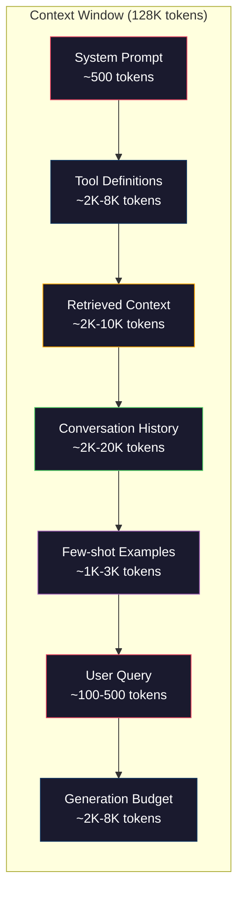
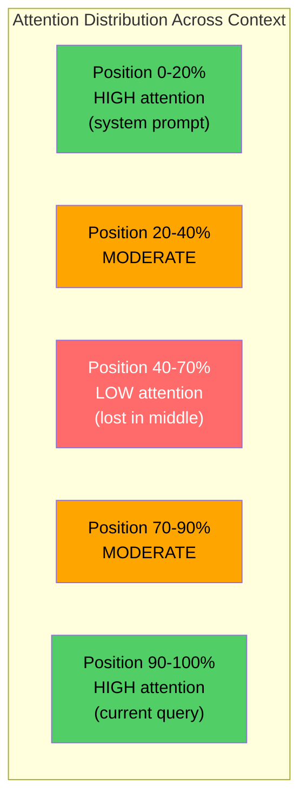
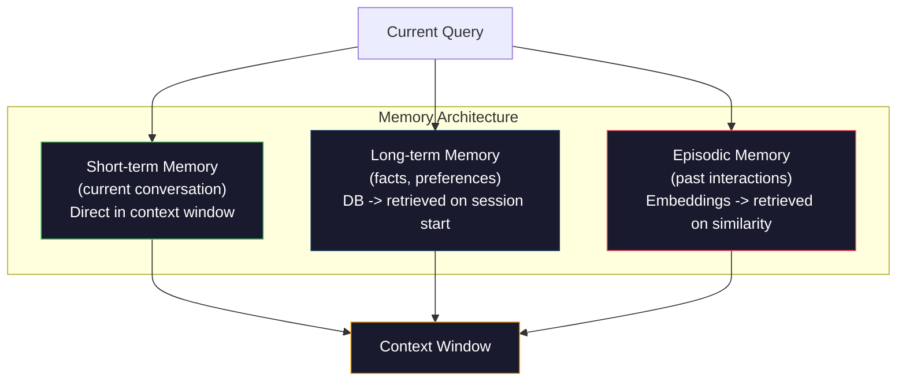

# Engenharia de contexto: Windows, Orçamentos, Memória e Recuperação.

> A engenharia de prompt é um subconjunto. A engenharia de contexto é todo o jogo. Um prompt é uma cadeia que você digita. O contexto é tudo o que entra na janela do modelo: instruções do sistema, documentos recuperados, definições de ferramentas, histórico de conversa, alguns exemplos de tiros e o próprio prompt. Os melhores engenheiros de IA em 2026 são engenheiros de contexto. Eles decidem o que entra, o que fica fora e em que ordem.

> **【中文解读】**提示工程只是上下文工程的子集──上下文工程管理模型窗口中的一切内容系统指令、检查文档、工具定义、对话历史等──2026 优秀 AI 工程师就是上下文工程师──

> **【拓展：上下文工程→Claude生态】**O protocolo MCP de Claude é, em essência, a implementação de padrões de engenharia em baixo através de um modelo de gestão de protocolo unificado.

> - Não .**【前置】**学本节前请先掌握:(1) Fase 11·01-02(Injustiça Prontamente  Few-shot CoT);(2) Fase 11·04(Embutidos) e Fase 11·06(RAG) 理解检索如何取文档;(3) token 概念本节重度讨论 token 预算──如果不知道"200K context window" 指什么,先看Fase 10──

**Type:** Build | **类型:** 构建
**Languages:** Python | **语言:** Python
**Prerequisites:** Phase 10 (LLMs from Scratch), Phase 11 Lesson 01-02 | **前置知识:** Phase 10（从零理解 LLM）、Phase 11 Lesson 01-02
**Time:** ~90 minutes | **时间:** ~90 分钟
**Related:**Fase 11 · 15 (Cachagem de imediato)  o layout amigável ao cache é uma extensão da engenharia de contexto. Fase 5 · 28 (Evaluation de longo contexto) para medir o perdido no meio com NIAH/RULER. **相关:**Fase 11 · 15(提示缓存) 缓存友好布局是上下文工程的延伸──Fase 5 · 28(长上下文评估)介绍如何使用NIAH/RULER 测量"中间丢失"──

## Objetivos de aprendizagem

- Calcular orçamentos de tokens em todos os componentes da janela de contexto (promete do sistema, ferramentas, histórico, documentos recuperados, espaço de geração)
  跨所有上下文窗口组件(系统提示、工具、历史、检索文档、生成余量) calcular token  orçamento
- Implementar estratégias de gerenciamento de janela de contexto: truncamento, resumo e janela deslizante para histórico de conversação
  实现上下文窗口管理策略:截断、摘要、滑动窗口管理对话历史
- Priorizar e ordenar os componentes do contexto para maximizar a atenção do modelo às informações mais relevantes
   em ordem de prioridade, em componentes de texto abaixo, maximizar o modelo de atenção para as informações mais relevantes
- Construir um conjunto de contexto que atribui dinâmicamente tokens com base no tipo de consulta e espaço disponível da janela
  Construir baseado em tipo de consulta e disponível janela espaço movimento distribuição token de

> **【中文解读】**O objetivo deste curso é: ultrapassar a Engenharia Prometida, sistematização de gerenciamento de informações sobre o modelo.


## O problema é o problema da introdução

Claude Opus 4.7 tem uma janela de tokens de 200K (1M em beta). GPT-5 tem 400K. Gemini 3 Pro tem 2M. Llama 4 afirma 10M. Estes números soam enormes até que você os preencha.

> Claude Opus 4.7 tem 200K tokens  Window(beta  edição 1M) ・・・GPT-5 tem 400K ・・・Gemini 3 Pro tem 2M ・・・ Estes números parecem muito grandes, até que você os preencha―

Aqui está uma divisão real para um assistente de codificação. Promete do sistema: 500 tokens. Definições de ferramentas para 50 ferramentas: 8.000 tokens. Documentação recuperada: 4.000 tokens. História de conversação (10 voltas): 6.000 tokens. Questão atual do usuário: 200 tokens. Orçamento de geração (máxima saída): 4.000 tokens. Total: 22.700 tokens. Isso é apenas 18% de uma janela de 128K.

> Este é um programação assistente de verdadeira análise. Sistema de dica: 500 tokens. 50 个工具定义: 8,000 tokens.

> - Não .**【类比】**上下文窗口像书桌面200K token 听起来很大,但放上"教科书(系统提示) "+"参考书(rescatados docs) "+"草稿纸(história) "+"计算器(tools) "就快满了──**Lost in the Middle**现象像寻找东西: quando a mesa de livros está cheia de coisas, o mais fácil de ser ignorado é o centro de um conjunto de coisas que você só vai prestar atenção à mesa de início e fim.

> ️ **【易错点】**上下文管理的 3 个坑: ((1) **历史无限增长** dialog越长 history 越大,最终撞窗口;修复:用总结(每 N 轮缩成摘要) 或滑窗(只保留近 K 轮 + 第一轮) 2) **工具定义重复发送** Cada vez que você estiver usando o sistema de 50 ferramentas, você vai usar o sistema de cache imediato.**检索文档全塞** convocar 50 个块 全塞 prompt 模型迷失;修复:top-5 高质量块 + cross-encoder 重排──

Mas a atenção não se escala linearmente com o comprimento do contexto. Um modelo com 128K tokens de contexto paga custo de atenção quadrática (O  n ^ 2) em transformadores de vainilha, embora a maioria dos modelos de produção use variantes de atenção eficientes). Mais importante, a precisão da recuperação diminui. O teste "Agulha em um Pacote de Hay" mostra que os modelos têm dificuldade em encontrar informações colocadas no meio de contextos longos. Pesquisa de Liu et al. (2023) mostrou que os MLLs recuperam informações no início e no final de contextos longos com precisão quase perfeita, mas a precisão cai de 10-20% para as informações colocadas no meio (posições 40-70% do contexto). Este efeito "perdido no meio" varia de modelo para modelo, mas afeta todas as arquiteturas atuais.

> Mas a atenção não vai aumentar com a extensão linear da longitude da linguagem em baixo. Mais importante, a taxa de precisão da pesquisa vai diminuir. O teste "Big Sea Cork" mostrou que o modelo é difícil de encontrar em posição média da linguagem em baixo.

A lição prática: ter 200K tokens disponíveis não significa que usar 200K tokens seja eficaz. Um contexto de token 10K cuidadosamente curado geralmente supera um contexto de token 100K descarregado. A engenharia de contexto é a disciplina de maximizar a relação sinal-ruído dentro da janela de contexto.

>  Lição prática: há 200K tokens; não significa usar 200K tokens; é válido.

Cada token que colocas na janela desplace um token que poderia conter informações mais relevantes. Cada definição de ferramenta irrelevante, cada turno de conversa obsoleta, cada pedaço de texto recuperado que não responde à pergunta - cada um torna o modelo um pouco pior na tarefa.

> Cada token que você coloca na janela ocupa um token que pode levar informações mais relevantes. Cada ferramenta não relacionada define cada conversão passada, cada intervalo de conversa, cada bloco de texto que não responde a uma pergunta.

## O conceito central.

> **【中文解读】**上下文工程(Context Engineering) é um conceito de engenharia de contato que ultrapassa o de escrever um prompt, mas que é sistematizado para gerenciar todas as informações que entram no modelo na janela de contato: resultados de pesquisa, história de diálogo, ferramentas de saída, instruções de sistema, etc.

> **【拓展：上下文窗口的有效利用】**GPT-4o tem 128K token 上下文窗口, mas estudos mostram que o modelo para informações de posição média" atenção baixa" ((Lost in the Middle 问题) ∞ 上下文工程策略包括:


### A Janela de Contexto é um recurso escasso

Pense na janela de contexto como RAM, não disco. É rápido e diretamente acessível, mas limitado. Você não pode caber em tudo. Você deve escolher.

> Colocar a janela em RAM, não em disco.



Cada componente compete por espaço. Adicionar mais definições de ferramentas significa menos espaço para o histórico de conversação. Adicionar mais contexto recuperado significa menos espaço para alguns exemplos de tiros. Engenharia de contexto é a arte de alocar esse orçamento para maximizar o desempenho da tarefa.

> Cada componente quer ganhar espaço. Mais ferramentas definidas significa menos espaço histórico de diálogo. Mais pesquisas significam menos espaço de exemplo.

### Perdido no meio

A descoberta empírica mais importante na engenharia de contexto. Os modelos atendem melhor às informações no início e no final do contexto.

> A maior evidência de que o modelo é mais importante no desenvolvimento de textos mais importantes é que o modelo tem melhor atenção para o início e fim dos textos mais baixos.

Liu et al. (2023) testaram isso sistematicamente. Eles colocaram um documento relevante entre 20 documentos irrelevantes em várias posições e mediram a precisão da resposta. Quando o documento relevante era o primeiro ou o último, a precisão era de 85-90%. Quando estava no meio (posição 10 de 20), a precisão caiu para 60-70%.

> Liu et al. (pp. 2023) sistematicamente testaram este fenômeno. Eles colocaram os documentos relacionados em diferentes posições entre os 20 documentos não relacionados, a taxa de precisão da resposta.

Isto tem implicações directas em engenharia:

> Isto tem significados técnicos diretos:

- Colocar as informações mais importantes em primeiro lugar (instruções de sistema, instruções críticas)
  A partir de agora, o sistema de informação será mais importante.
- Colocar a consulta atual e o contexto mais relevante em último lugar (precisão recente ajuda)
  A partir da data de publicação, o número de pessoas que tiveram acesso a um serviço de informação será de aproximadamente 20 mil pessoas.
- Tratar o meio do contexto como a zona de menor prioridade
  A região de baixa prioridade
- Se você deve incluir informações no meio, duplique o ponto chave no final
  Se tiver de colocar informação no meio, volte a fazer o seguinte:



### Componentes do contexto

**System prompt**Claude Code usa cerca de 6.000 tokens para seu sistema de instruções, incluindo definições de ferramentas e instruções de comportamento. Mantém-no apertado. Cada palavra no sistema de instruções é repetida em cada chamada de API.

> **系统提示**A definição de personalidade e comportamento é uma das principais regras de comportamento.

**Tool definitions**Cada ferramenta adiciona 50-200 tokens (nome, descrição, esquema de parâmetros). 50 ferramentas em 150 tokens cada é 7.500 tokens antes de qualquer conversa acontecer. A seleção dinâmica de ferramentas - apenas incluindo ferramentas relevantes para a consulta atual - pode reduzir isso em 60-80%.

> **工具定义**Cada ferramenta 50-200 tokens (nome, descrição, esquema de parâmetros) ◦ 50 个工具每150 tokens,就是7,500 tokens在对话开始前已经占用了──动态工具选择只包含与当前查询相关的工具可减少60-80%──

**Retrieved context**A qualidade da recuperação determina diretamente a qualidade da resposta. A recuperação ruim é pior do que nenhuma recuperação - enche a janela de ruído e engana ativamente o modelo.

> **检索上下文**O que é que você tem a ver com o seu perfil?

**Conversation history**Uma conversa de 50 voltas a 200 tokens por turno é 10.000 tokens de história. A maioria é irrelevante para a consulta atual.

> **对话历史**A maioria das perguntas atuais não estão relacionadas.

**Few-shot examples**Os exemplos bem escolhidos, muitas vezes, melhoram a qualidade da saída mais do que milhares de tokens de instruções.

> **少样本示例**Exemplos de 2-3 atitudes de entrada/saída de atitude de escolha cuidadosamente são geralmente mais capazes de aumentar a qualidade de saída do comando de milhares de tokens, mas eles consomem espaço.

**Generation budget**Se preencher a janela de capacidade, o modelo não tem espaço para responder. Reserve pelo menos 2.000-4.000 tokens para geração.

> **生成预算**Para o modelo responderão a um token reservado. Se a janela estiver cheia, o modelo não terá espaço para responder.

### Estratégias de compressão de contexto

**History summarization**Em vez de manter todas as voltas anteriores verbatim, resuma a conversa periodicamente. "Discutimos X, decidimos Y, e o usuário quer Z" em 100 tokens substitui 10 voltas que levaram 2.000 tokens.

> **历史摘要**Não se trata de um "título" que não se traduz em "título" ou "título" ou "título" ou "título" ou "título" ou "título" ou "título" ou "título" ou "título" ou "título" ou "título" ou "título" ou "título" ou "título" ou "título" ou "título" ou "título" ou "título" ou "título" ou "título" ou "título" ou "título" ou "título" ou "título" ou "título" ou "título" ou "título" ou "título" ou "título" ou "título" ou "título" ou "título" ou "título" ou "título" ou "título" ou "título" ou "título" ou "título" ou "título" ou "título" ou "título" ou "título" ou "título" ou "título" ou "título" ou "título ou "título" ou "título ou "títítulos".

**Relevance filtering**Se você tiver recuperado 10 pedaços, mas apenas 3 são relevantes, descartar os outros 7. É melhor ter 3 pedaços altamente relevantes do que 10 pedaços mediocres.

> **相关性过滤**A partir de agora, o número de blocos de pesquisa é de 10 blocos, mas apenas 3 estão relacionados, e os outros 7 são de 3 blocos mais altos do que os 10 blocos gerais.

**Tool pruning**A questão de código não precisa de ferramentas de calendário. Uma pergunta de programação não precisa de ferramentas de sistema de arquivos. Isso pode reduzir as definições de ferramentas de 8.000 tokens para 1.000.

> **工具裁剪**O código não precisa de ferramentas de calendário, o problema de planejamento não precisa de ferramentas de sistema de documentos, o que pode definir ferramentas de 8.000 tokens para 1.000.

**Recursive summarization**Para documentos muito longos, resuma em etapas. Primeiro resuma cada seção, depois resuma os resumos. Um documento de 50 páginas se torna um digestão de 500 tokens que capta os pontos-chave.

> **递归摘要**O primeiro é o primeiro, o segundo é o primeiro, o segundo é o segundo.

### Sistemas de memória

A engenharia de contexto abrange três horizontes de tempo.

> 上下文工程跨越三时间尺度──

**Short-term memory**A conversa atual. Armazenada na janela de contexto diretamente. Cresce a cada virada. Gerida por resumo e truncation.

> **短期记忆**O que é o "continuação" de um processo de "conversação" é um processo de "conversação" que se desenvolve através de um processo de "conversação".

**Long-term memory**"O usuário prefere o TypeScript". "O projeto usa PostgreSQL". Armazenado em um banco de dados, recuperado no início da sessão. Claude Code armazena isso em arquivos CLAUDE.md. ChatGPT armazena-lo em sua função de memória.

> **长期记忆**O código de código de Claude existe em CLAUDE.md 文件中──ChatGPT 存在其内存功能──

**Episodic memory**"Na terça-feira passada, resolvemos um problema similar no módulo auth". Armazenado como embutidos, recuperados quando a conversa atual coincide com um episódio anterior.

> **情景记忆**O que é que é o "conversão" de um diálogo em um contexto de conflito?



### Assembléia de contexto dinâmico

A principal ideia: diferentes consultas precisam de contextos diferentes. Um sistema estático de prompt + ferramentas estáticas + histórico estático é desperdiçoso. Os melhores sistemas montam dinamicamente contexto por consulta.

> 关键洞察: diferentes consultas necessitam diferentes sobre o seguinte.

1. Classificar a intenção da consulta
   Categoria de inquérito
2. Selecionar as ferramentas relevantes (não todas)
   选择相关工具(不是全部工具)
3. Retirar documentos relevantes (não um conjunto fixo)
   检索相关文档( não é um conjunto fixo)
4. Incluir as curvas de história relevantes (não todas)
   包含相关历史轮次(不是全部历史)
5. Adicionar alguns exemplos de tiros que correspondem ao tipo de tarefa
   Adicionar exemplos de pequenas amostras de correspondência com o tipo de tarefa
6. Ordenar tudo por importância: crítico primeiro, importante último, opcional no meio
   按重要性排序:关键在前、重要在后、可选在中间

É isso que separa uma boa aplicação de IA de uma grande. O modelo é o mesmo. O contexto é o diferenciador.

> É o que distingue entre a aplicação da IA e a aplicação da IA superior.

## Construí-lo e realizei-o.
```figure
lost-in-the-middle
```

## Construí-lo

### Passo 1: Contador de Tokens

Não pode orçar o que não pode medir. Construa um contador de tokens simples (aproximação usando divisão de espaço em branco, já que a contagem exata depende do tokenizer).

> Você não pode fazer orçamento para coisas imensas. Construir um simples contador de tokens.

```python
import json
import numpy as np
from collections import OrderedDict

def count_tokens(text):
    if not text:
        return 0
    return int(len(text.split()) * 1.3)

def count_tokens_json(obj):
    return count_tokens(json.dumps(obj))
```

### Passo 2: Gestor de orçamento de contexto

Um gerente de orçamento rastreia quantos tokens cada componente usa e impõe limites.

> 核心抽象──预算管理器追踪每个组件使用多少代币并强限制制──

```python
class ContextBudget:
    def __init__(self, max_tokens=128000, generation_reserve=4000):
        self.max_tokens = max_tokens
        self.generation_reserve = generation_reserve
        self.available = max_tokens - generation_reserve
        self.allocations = OrderedDict()

    def allocate(self, component, content, max_tokens=None):
        tokens = count_tokens(content)
        if max_tokens and tokens > max_tokens:
            words = content.split()
            target_words = int(max_tokens / 1.3)
            content = " ".join(words[:target_words])
            tokens = count_tokens(content)

        used = sum(self.allocations.values())
        if used + tokens > self.available:
            allowed = self.available - used
            if allowed <= 0:
                return None, 0
            words = content.split()
            target_words = int(allowed / 1.3)
            content = " ".join(words[:target_words])
            tokens = count_tokens(content)

        self.allocations[component] = tokens
        return content, tokens

    def remaining(self):
        used = sum(self.allocations.values())
        return self.available - used

    def utilization(self):
        used = sum(self.allocations.values())
        return used / self.max_tokens

    def report(self):
        total_used = sum(self.allocations.values())
        lines = []
        lines.append(f"Context Budget Report ({self.max_tokens:,} token window)")
        lines.append("-" * 50)
        for component, tokens in self.allocations.items():
            pct = tokens / self.max_tokens * 100
            bar = "#" * int(pct / 2)
            lines.append(f"  {component:<25} {tokens:>6} tokens ({pct:>5.1f}%) {bar}")
        lines.append("-" * 50)
        lines.append(f"  {'Used':<25} {total_used:>6} tokens ({total_used/self.max_tokens*100:.1f}%)")
        lines.append(f"  {'Generation reserve':<25} {self.generation_reserve:>6} tokens")
        lines.append(f"  {'Remaining':<25} {self.remaining():>6} tokens")
        return "\n".join(lines)
```

### Passo 3: Reordem perdida no meio

Implementar a estratégia de reordenação: os elementos mais importantes são os primeiros e últimos, os menos importantes estão no meio.

> 实现重排策略: mais importante em primeiro e último, mais pouco importante em meio.

```python
def reorder_lost_in_middle(items, scores):
    paired = sorted(zip(scores, items), reverse=True)
    sorted_items = [item for _, item in paired]

    if len(sorted_items) <= 2:
        return sorted_items

    first_half = sorted_items[::2]
    second_half = sorted_items[1::2]
    second_half.reverse()

    return first_half + second_half

def score_relevance(query, documents):
    query_words = set(query.lower().split())
    scores = []
    for doc in documents:
        doc_words = set(doc.lower().split())
        if not query_words:
            scores.append(0.0)
            continue
        overlap = len(query_words & doc_words) / len(query_words)
        scores.append(round(overlap, 3))
    return scores
```

### Passo 4: Compressor História da Conversação

Resumir uma conversa antiga volta para recuperar o orçamento de tokens.

> 总结旧对话轮次以收回标志 预算。

```python
class ConversationManager:
    def __init__(self, max_history_tokens=5000):
        self.turns = []
        self.summaries = []
        self.max_history_tokens = max_history_tokens

    def add_turn(self, role, content):
        self.turns.append({"role": role, "content": content})
        self._compress_if_needed()

    def _compress_if_needed(self):
        total = sum(count_tokens(t["content"]) for t in self.turns)
        if total <= self.max_history_tokens:
            return

        while total > self.max_history_tokens and len(self.turns) > 4:
            old_turns = self.turns[:2]
            summary = self._summarize_turns(old_turns)
            self.summaries.append(summary)
            self.turns = self.turns[2:]
            total = sum(count_tokens(t["content"]) for t in self.turns)

    def _summarize_turns(self, turns):
        parts = []
        for t in turns:
            content = t["content"]
            if len(content) > 100:
                content = content[:100] + "..."
            parts.append(f"{t['role']}: {content}")
        return "Previous: " + " | ".join(parts)

    def get_context(self):
        parts = []
        if self.summaries:
            parts.append("[Conversation Summary]")
            for s in self.summaries:
                parts.append(s)
        parts.append("[Recent Conversation]")
        for t in self.turns:
            parts.append(f"{t['role']}: {t['content']}")
        return "\n".join(parts)

    def token_count(self):
        return count_tokens(self.get_context())
```

### Passo 5: Selector de ferramentas dinâmicas

Incluir apenas ferramentas relevantes para a consulta atual. Classificar intenção, em seguida, filtrar.

> Apenas contém ferramentas relacionadas com as consultas em curso.

```python
TOOL_REGISTRY = {
    "read_file": {
        "description": "Read contents of a file",
        "tokens": 120,
        "categories": ["code", "files"],
    },
    "write_file": {
        "description": "Write content to a file",
        "tokens": 150,
        "categories": ["code", "files"],
    },
    "search_code": {
        "description": "Search for patterns in codebase",
        "tokens": 130,
        "categories": ["code"],
    },
    "run_command": {
        "description": "Execute a shell command",
        "tokens": 140,
        "categories": ["code", "system"],
    },
    "create_calendar_event": {
        "description": "Create a new calendar event",
        "tokens": 180,
        "categories": ["calendar"],
    },
    "list_emails": {
        "description": "List recent emails",
        "tokens": 160,
        "categories": ["email"],
    },
    "send_email": {
        "description": "Send an email message",
        "tokens": 200,
        "categories": ["email"],
    },
    "web_search": {
        "description": "Search the web for information",
        "tokens": 140,
        "categories": ["research"],
    },
    "query_database": {
        "description": "Run a SQL query on the database",
        "tokens": 170,
        "categories": ["code", "data"],
    },
    "generate_chart": {
        "description": "Generate a chart from data",
        "tokens": 190,
        "categories": ["data", "visualization"],
    },
}

def classify_intent(query):
    query_lower = query.lower()

    intent_keywords = {
        "code": ["code", "function", "bug", "error", "file", "implement", "refactor", "debug", "test"],
        "calendar": ["meeting", "schedule", "calendar", "appointment", "event"],
        "email": ["email", "mail", "send", "inbox", "message"],
        "research": ["search", "find", "what is", "how does", "explain", "look up"],
        "data": ["data", "query", "database", "chart", "graph", "analytics", "sql"],
    }

    scores = {}
    for intent, keywords in intent_keywords.items():
        score = sum(1 for kw in keywords if kw in query_lower)
        if score > 0:
            scores[intent] = score

    if not scores:
        return ["code"]

    max_score = max(scores.values())
    return [intent for intent, score in scores.items() if score >= max_score * 0.5]

def select_tools(query, token_budget=2000):
    intents = classify_intent(query)
    relevant = {}
    total_tokens = 0

    for name, tool in TOOL_REGISTRY.items():
        if any(cat in intents for cat in tool["categories"]):
            if total_tokens + tool["tokens"] <= token_budget:
                relevant[name] = tool
                total_tokens += tool["tokens"]

    return relevant, total_tokens
```

### Passo 6: Projeto de montagem de contexto completo

Enviar tudo em conjunto, e, em função de uma consulta, montar dinamicamente o contexto ideal.

> "Põe tudo em ordem"...

```python
class ContextEngine:
    def __init__(self, max_tokens=128000, generation_reserve=4000):
        self.budget = ContextBudget(max_tokens, generation_reserve)
        self.conversation = ConversationManager(max_history_tokens=5000)
        self.system_prompt = (
            "You are a helpful AI assistant. You have access to tools for "
            "code editing, file management, web search, and data analysis. "
            "Use the appropriate tools for each task. Be concise and accurate."
        )
        self.knowledge_base = [
            "Python 3.12 introduced type parameter syntax for generic classes using bracket notation.",
            "The project uses PostgreSQL 16 with pgvector for embedding storage.",
            "Authentication is handled by Supabase Auth with JWT tokens.",
            "The frontend is built with Next.js 15 using the App Router.",
            "API rate limits are set to 100 requests per minute per user.",
            "The deployment pipeline uses GitHub Actions with Docker multi-stage builds.",
            "Test coverage must be above 80% for all new modules.",
            "The codebase follows the repository pattern for data access.",
        ]

    def assemble(self, query):
        self.budget = ContextBudget(self.budget.max_tokens, self.budget.generation_reserve)

        system_content, _ = self.budget.allocate("system_prompt", self.system_prompt, max_tokens=1000)

        tools, tool_tokens = select_tools(query, token_budget=2000)
        tool_text = json.dumps(list(tools.keys()))
        tool_content, _ = self.budget.allocate("tools", tool_text, max_tokens=2000)

        relevance = score_relevance(query, self.knowledge_base)
        threshold = 0.1
        relevant_docs = [
            doc for doc, score in zip(self.knowledge_base, relevance)
            if score >= threshold
        ]

        if relevant_docs:
            doc_scores = [s for s in relevance if s >= threshold]
            reordered = reorder_lost_in_middle(relevant_docs, doc_scores)
            doc_text = "\n".join(reordered)
            doc_content, _ = self.budget.allocate("retrieved_context", doc_text, max_tokens=3000)

        history_text = self.conversation.get_context()
        if history_text.strip():
            history_content, _ = self.budget.allocate("conversation_history", history_text, max_tokens=5000)

        query_content, _ = self.budget.allocate("user_query", query, max_tokens=500)

        return self.budget

    def chat(self, query):
        self.conversation.add_turn("user", query)
        budget = self.assemble(query)
        response = f"[Response to: {query[:50]}...]"
        self.conversation.add_turn("assistant", response)
        return budget


def run_demo():
    print("=" * 60)
    print("  Context Engineering Pipeline Demo")
    print("=" * 60)

    engine = ContextEngine(max_tokens=128000, generation_reserve=4000)

    print("\n--- Query 1: Code task ---")
    budget = engine.chat("Fix the bug in the authentication module where JWT tokens expire too early")
    print(budget.report())

    print("\n--- Query 2: Research task ---")
    budget = engine.chat("What is the best approach for implementing vector search in PostgreSQL?")
    print(budget.report())

    print("\n--- Query 3: After conversation history builds up ---")
    for i in range(8):
        engine.conversation.add_turn("user", f"Follow-up question number {i+1} about the implementation details of the system")
        engine.conversation.add_turn("assistant", f"Here is the response to follow-up {i+1} with technical details about the architecture")

    budget = engine.chat("Now implement the changes we discussed")
    print(budget.report())

    print("\n--- Tool Selection Examples ---")
    test_queries = [
        "Fix the bug in auth.py",
        "Schedule a meeting with the team for Tuesday",
        "Show me the database query performance stats",
        "Search for best practices on error handling",
    ]

    for q in test_queries:
        tools, tokens = select_tools(q)
        intents = classify_intent(q)
        print(f"\n  Query: {q}")
        print(f"  Intents: {intents}")
        print(f"  Tools: {list(tools.keys())} ({tokens} tokens)")

    print("\n--- Lost-in-the-Middle Reordering ---")
    docs = ["Doc A (most relevant)", "Doc B (somewhat relevant)", "Doc C (least relevant)",
            "Doc D (relevant)", "Doc E (moderately relevant)"]
    scores = [0.95, 0.60, 0.20, 0.80, 0.50]
    reordered = reorder_lost_in_middle(docs, scores)
    print(f"  Original order: {docs}")
    print(f"  Scores:         {scores}")
    print(f"  Reordered:      {reordered}")
    print(f"  (Most relevant at start and end, least relevant in middle)")
```

## Use-o com o framework implementado.

### Contexto gerenciado por arneses

Claude Code gerencia o contexto com uma abordagem em camadas. O prompt do sistema inclui regras de comportamento e definições de ferramentas (~ 6K tokens). Quando você abre um arquivo, seu conteúdo é injetado como contexto. Quando você pesquisa, os resultados são adicionados. As conversas antigas são resumidas. CLAUDE.md fornece memória de longo prazo que persiste em todas as sessões.

> Claude Code Utilizando diferentes métodos de gestão sobre o seguinte. Sistema de sugestões contém regras de comportamento e ferramentas definições.

A decisão de engenharia chave: o Claude Code não descarta toda a sua base de código no contexto.

> 关键工程决策:Claude Code não põe toda a biblioteca de códigos em baixo.

### Carregamento de contexto dinâmico do cursor
### Carregamento de contexto dinâmico

Cursor indexa toda a sua base de código em embutidos. Quando você escreve uma consulta, ele recupera os arquivos e blocos de código mais relevantes usando semelhança vetorial. Somente essas peças entram na janela de contexto. Uma base de código de 500K-linha é comprimida para os 5-10 blocos de código mais relevantes.

> Cursor irá inserir todo o índice de código em uma consulta de entrada, usando o veículo de semelhança de pesquisa dos blocos de código mais relevantes. Apenas esses fragmentos entrarão na janela abaixo. 500K de páginas da biblioteca de código comprimidos para 5-10 blocos de código mais relevantes.

Este é o padrão: incorporar tudo, recuperar à demanda, incluir apenas o que importa.

> É assim que tudo é inserido, por exigência, só contém o que é importante.

### Memória ChatGPT
### Assistente de Memória de Longo Prazo

O ChatGPT armazena as preferências e fatos do usuário como memória de longo prazo. Em cada início de conversa, as memórias relevantes são retiradas e incluídas no prompt do sistema. "O usuário prefere Python" custa 5 tokens, mas salva centenas de tokens de instruções repetidas em todas as conversas.

> O ChatGPT armazenará as preferências e fatos dos usuários para a memória de longo prazo. Quando cada conversa começa, as memórias relacionadas são pesquisadas e incluídas em um sistema de instruções.

### RAG como Engenharia de Contexto

A geração recuperada-agendada é a engenharia de contexto formal. Em vez de encher o conhecimento nos pesos do modelo (formação) ou no sistema de instrução (contexto estático), você retira documentos relevantes no momento da consulta e os injeta na janela de contexto. O conjunto do RAG -- fragmentação, inserção, recuperação, re-ranqueamento -- existe para resolver um problema: colocar a informação certa na janela de contexto.

> 检索增强生成是上下文工程的形式化──不把知识塞进模型权重 (重量) 训练) 或系统提示 (系统提示) 静态上下文),而在查询时检索相关文档并注入上下文窗口── toda a RAG 管线分块、嵌入、检索、重排存在就是为了解决一个问题:把正确信息放入上下文窗口──

## Envia-o . Produto .

Esta lição produz`outputs/prompt-context-optimizer.md`-- um prompt reutilizável que verifica uma estratégia de montagem de contexto e recomenda otimizações. Alimenta-o com o seu prompt do sistema, contagem de ferramentas, comprimento médio do histórico e estratégia de recuperação, e identifica desperdício de tokens e sugere melhorias.

> 本课产 出 `outputs/prompt-context-optimizer.md` auditoria sobre estratégia de montagem e recomendação de melhoramento de sugestões reutilizáveis.

Também produz `outputs/skill-context-engineering.md`-- um quadro de decisão para a concepção de canais de montagem de contexto com base no tipo de tarefa, no tamanho da janela de contexto e no orçamento de latência.

> Simultaneamente`outputs/skill-context-engineering.md` Baseado no tipo de tarefa  no quadro de decisão da janela de grandeza e atraso orçamental design  no quadro de decisão da linha de montagem de componentes 

## Exercícios.

1. Adicionar um "detetor de resíduos de tokens" à classe ContextBudget. Ele deve marcar componentes que utilizam mais de 30% do orçamento e sugerir estratégias de compressão específicas para cada tipo de componente (resumir o histórico, ferramentas de poda, re-ranquear documentos).
   给 ContextBudget 添加"token 浪费检测器"──应标记使用超过30% 预算组件,并建议针对每个组件类型的压缩策略(摘要历史"",剪刀工具"",重排文档")

2. Implementar deduplicação semântica para contexto recuperado. Se dois documentos recuperados são mais de 80% semelhantes (por sobreposição de palavras ou semelhança cosina de suas incorporações), mantenha apenas o mais alto.
   实现检索上下文的语义去重──若两个检索文档超过80%相似度 (também em termos de similaridade de sobreposição ou embutidação de restantes cordas), apenas retém o número de porções mais elevado.

3. Construir uma ferramenta de "replay contextual". Dado uma transcrição de conversa, replay através do ContextEngine e visualizar como a alocação de orçamento muda de vez em quando. Plot o uso de tokens por componente ao longo do tempo. Identificar a vez em que o contexto começa a ser comprimido.
   构建"上下文回放"工具──给定对话转录,通过 ContextEngine 回放并可视化预算分配如何轮次变化──绘制每个组件随时间的符号──使用──识别上下文开始被压缩的轮次──

4. Implementar um selector de ferramentas baseado em prioridades. Em vez de incluir/excluir binário, atribuir a cada ferramenta uma pontuação de relevância para a consulta atual. Inclua ferramentas em ordem decrescente de relevância até que o orçamento da ferramenta seja esgotado. Compare o desempenho da tarefa com as ferramentas 5, 10, 20 e 50 incluídas.
   • implementar selecionadores de ferramentas baseados em prioridades. Não em dois componentes: incluir/excluir, mas em cada ferramenta, a sua relevância para as consultas atuais.

5. Construir um compressor de contexto multi-estratégico. Implementar três estratégias de compressão (truncation, summarization, extraction of key sentences) e compará-las em um conjunto de 20 documentos. Medir a compensação entre a relação de compressão e a retenção de informações (a versão comprimida ainda contém a resposta à consulta?).
   构建多策略上下文压缩机. 实现三种压缩策略. 实现三种压缩策略. 实现三种压缩策略. 实现三种压缩策略. 实现三种压缩策略. 实现三种压缩策略. 实现三种压缩策略. 实现三种压缩策略. 实现三种压缩策略. 实现三种压缩策略. 实现三种压缩策略. 实现三种压缩策略. 实现三种压缩策略. 实现三种压缩策略. 实现三种压缩策略. 实现三种压缩策略. 实现三种压缩策略. 实现三种压缩策略. 实现三种压缩策略. 实现三种压缩策略. 实现三种压缩策略. 实现三种压缩策略. 实现三种压缩策略. 实现三种压缩策略. 实现三种压缩策略. 实现三种压缩策略. 实现三种压缩策略. 实现三种压缩策略.

## Termos-chave .

| Term | What people say | What it actually means | 中文释义 |
|------|----------------|----------------------|---------|
| Context window | "How much the model can read" | The maximum number of tokens (input + output) the model processes in a single forward pass -- 400K for GPT-5, 200K (1M beta) for Claude Opus 4.7, 2M for Gemini 3 Pro | 上下文窗口：模型单次前向传播处理的最大 token 数（输入+输出）|
| Context engineering | "Advanced prompt engineering" | The discipline of deciding what goes into the context window, in what order, and at what priority -- encompasses retrieval, compression, tool selection, and memory management | 上下文工程：决定什么进入上下文窗口、什么顺序、什么优先级的学科——包含检索、压缩、工具选择、记忆管理 |
| Lost-in-the-middle | "Models forget stuff in the middle" | Empirical finding that LLMs attend better to the beginning and end of context, with 10-20% accuracy drop for information placed in the middle | 中间丢失：LLM 对上下文开头和结尾注意力更好的实证发现；中间位置准确率下降 10-20% |
| Token budget | "How many tokens you have left" | An explicit allocation of context window capacity across components (system prompt, tools, history, retrieval, generation) with per-component limits | token 预算：跨组件的上下文窗口容量显式分配（系统提示、工具、历史、检索、生成）带每组件限制 |
| Dynamic context | "Loading stuff on the fly" | Assembling the context window differently for each query based on intent classification, relevant tool selection, and retrieval results | 动态上下文：基于意图分类、相关工具选择和检索结果，为每个查询不同地组装上下文窗口 |
| History summarization | "Compressing the conversation" | Replacing verbatim old conversation turns with a concise summary, reducing token cost while preserving key information | 历史摘要：用简洁摘要替代逐字旧对话轮次，减少 token 成本同时保留关键信息 |
| Tool pruning | "Only including relevant tools" | Classifying query intent and only including tool definitions that match, reducing tool token cost by 60-80% | 工具裁剪：分类查询意图只包含匹配的工具定义，减少工具 token 成本 60-80% |
| Long-term memory | "Remembering across sessions" | Facts and preferences stored in a database and retrieved at session start -- CLAUDE.md, ChatGPT Memory, and similar systems | 长期记忆：跨会话存储在数据库并在会话开始时检索的事实和偏好——CLAUDE.md、ChatGPT Memory 等 |
| Episodic memory | "Remembering specific past events" | Past interactions stored as embeddings and retrieved when the current query is similar to a past conversation | 情景记忆：作为嵌入存储的过去交互，当前查询相似时检索 |
| Generation budget | "Room for the answer" | Tokens reserved for the model's output -- if the context fills the window completely, the model has no room to respond | 生成预算：为模型输出保留的 token——若上下文填满窗口，模型没有空间响应 |

## Mais leitura 延伸阅读

- [Liu et al., 2023 -- "Lost in the Middle: How Language Models Use Long Contexts"](https://arxiv.org/abs/2307.03172)-- o estudo definitivo sobre a atenção dependente da posição, mostrando que os modelos lutam com a informação no meio de contextos longos
  Liu 等, "Lost in the Middle" (Perdido no meio)  posição Related attention authority study, mostrando que o modelo é difícil de lidar com o longo
- [Anthropic's Contextual Retrieval blog post](https://www.anthropic.com/news/contextual-retrieval)-- como a Anthropic aborda a recuperação de peças conscientes do contexto, reduzindo a falha da recuperação em 49%
  Antropic 上下文检索博客Antropic 如何处理上下文感知分块检索,将检索失败减少49%
- [Simon Willison's "Context Engineering"](https://simonwillison.net/2025/Jun/27/context-engineering/)- o post no blog que nomeou a disciplina e a distinguiu da engenharia rápida
  "Engenharia de contexto" de Simon Willison, que nomeou a área de estudo, não distinguiu-a da área de engenharia de sugestões.
- [LangChain documentation on RAG](https://python.langchain.com/docs/tutorials/rag/)-- implementação prática da geração aumentada de recuperação como padrão de engenharia contextual
  LangChain RAG 文档将检索增强生成作为上下文工程模式的实用实现
- [Greg Kamradt's Needle in a Haystack test](https://github.com/gkamradt/LLMTest_NeedleInAHaystack)-- o índice de referência que revelou falhas de recuperação dependentes da posição em todos os principais modelos
  Greg Kamradt's Big Sea Claw Test revelar todas as principais posições do modelo Related Reviews Fail
- [Pope et al., "Efficiently Scaling Transformer Inference" (2022)](https://arxiv.org/abs/2211.05102)-- por que o comprimento do contexto leva à memória e à latência, e como o cache KV, MQA e GQA alteram o cálculo do orçamento.
  Pope等, "Eficientemente Escalado Transformer Inference" (en) 为何上下文长度驱动内存和延迟, bem como KV cache、MQA、GQA 如何改变预算计算──
- [Agrawal et al., "SARATHI: Efficient LLM Inference by Piggybacking Decodes with Chunked Prefills" (2023)](https://arxiv.org/abs/2308.16369)-- as duas fases de inferência que fazem as longas indicações caras na TTFT mas baratas na TPOT; a verdade fundamental por trás de compromissos de conteúdo.
  Agrawal 等, "SARATHI" (em 2023) 推理两阶段使长提示在 TTFT 上昂贵但 TPOT 上便宜;上下文打包权衡背后的真相──
- [Ainslie et al., "GQA: Training Generalized Multi-Query Transformer Models from Multi-Head Checkpoints" (EMNLP 2023)](https://arxiv.org/abs/2305.13245)-- o papel de atenção de consulta agrupada que corta a memória KV 8x nos decodificadores de produção sem perda de qualidade.
  Ainslie 等, "GQA" ((EMNLP 2023) 分组查询注意力论文, em produção de decodificadores KV interno de armazenamento reduzido 8 vezes e sem perda de qualidade:
