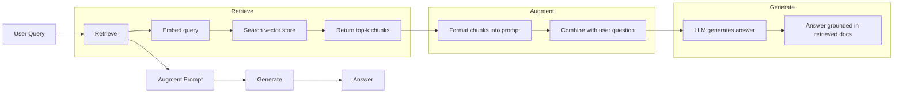
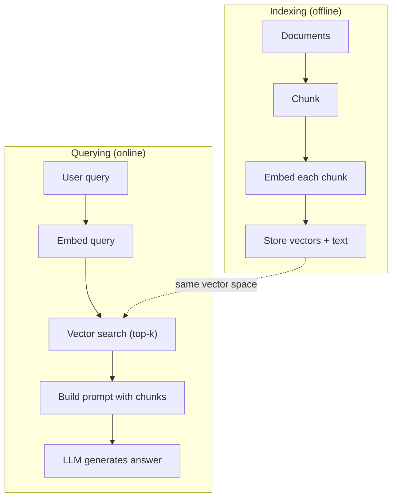

# RAG (Geração Aumentada de Recuperação) 检索增强生成

> O seu Mestrado em Direito sabe tudo até o seu período de treinamento. Ele não sabe nada sobre os documentos da sua empresa, sua base de código ou as notas de reunião da semana passada. RAG resolve isso recuperando documentos relevantes e colocando-os no prompt. É o padrão mais implantado na IA de produção. Se você construir uma coisa a partir deste curso, construir um oleoduto RAG.

> **【中文解读】**O LLM só sabe o que é treinamento. O RAG faz a pesquisa de documentos relacionados e infunde dicas para compensar a falta de conhecimento.

> **【拓展：RAG→企业AI应用】**RAG é o principal programa de seleção de AI em empreendimentos: conhecimento de base de perguntas, contratos, revisão de contratos, assistente de documentos técnicos, análise de pesquisas financeiras, etc.

> - Não .**【前置】**學本节前请先掌握:(1) Fase 11·04(Embutidos) 理解向量空间、相似度、HNSW;(2) Fase 05·23(Chunking Strategies) 理解文档切分;(3) Fase 10(LLM do zero) 理解快速 如何影响生成──本节会用到 `chromadb`Ou `faiss`- Não.`langchain`Ou `llamaindex`- Não.

**Type:** Build | **类型:** 构建
**Languages:** Python | **语言:** Python
**Prerequisites:** Phase 10 (LLMs from Scratch), Phase 11 Lessons 01-05 | **前置知识:** Phase 10（从零理解 LLM）、Phase 11 Lesson 01-05
**Time:** ~90 minutes | **时间:** ~90 分钟
**Related:**Fase 5 · 23 (Estratégias de Chunking para RAG) para os seis algoritmos de chunking e quando cada um ganha. Fase 5 · 22 (Dip Deep Dive em Embedding Models) para escolher o incorporador. Fase 11 · 07 (Advanced RAG) para pesquisa híbrida, re-ranqueamento e transformação de consulta.**相关:**Fase 5 · 23(RAG 分块策略) Introdução de seis tipos de algoritmos de blocos e seus respectivos casos de aplicação.

## Objetivos de aprendizagem

- Construir um conjunto completo de RAG: carregamento de documentos, fragmentação, incorporação, armazenamento de vetores, recuperação e geração
  Construir um RAG completo 管线:文档加载、分块、嵌入、向量存储、检索、生成
- Implementar a pesquisa semântica usando um banco de dados vetorial (ChromaDB, FAISS ou Pinecone) com indexação adequada
  Utilize 量数据库(ChromaDB、FAISS ou Pinecone) realizando语义搜索并正确索引
- Explicar por que a RAG é preferida ao ajuste fino para aplicações baseadas no conhecimento (custo, frescura, atribuição)
  解释为什么知识接地应用更好RAG而非微调(cost、新鲜度、归因)
- Avaliação da qualidade do RAG utilizando métricas de recuperação (precisão, retirada) e métricas de geração (filidade, relevância)
  Utilizando o método de análise de dados, a análise de dados e a análise de dados e a análise de dados.

> **【中文解读】**O objetivo desta aula é: realizar um RAG completo (requisitos de aumento de gerência) (tube line 文档切分、嵌入生成、向量检索、上下文注入、答案生成;;RAG é resolver o problema do conhecimento e da ilusão do LLM.


## O problema é o problema da introdução

Você constrói um chatbot para sua empresa. Um cliente pergunta: "Qual é a política de reembolso para planos empresariais?" O LLM responde com uma resposta genérica sobre políticas típicas de reembolso SaaS. A política real, enterrada em uma wiki interna de 200 páginas, diz que os clientes empresariais recebem uma janela de 60 dias com reembolsos pro-rated. O LLM nunca viu este documento. Não pode saber sobre o que não foi treinado.

> Você construiu um chatbot para a empresa. O cliente pergunta: "O que é a política de reembolso da versão empresarial?" LLM deu uma resposta geral sobre a política de reembolso SaaS típico. A política real está em 200 páginas de wiki interno, dizendo que o cliente empresarial tem 60 dias de período de tempo e reembolso proporcional. LLM nunca viu este arquivo.

O processo de ajuste é uma solução. Tome o LLM, treine-o em seus documentos internos e implante o modelo atualizado. Isso funciona, mas tem sérios problemas. O ajuste fino custa milhares de dólares em cálculo. O modelo fica obsoleto no momento em que um documento muda. Você não tem forma de saber de que fonte o modelo foi extraído. E se a empresa adquire outra linha de produtos no próximo mês, você ajuste novamente.

> A micro-modução é uma solução. Mas a micro-modução requer milhares de dólares em custos de cálculo. O modelo de mudança de arquivo já está ultrapassado.

O RAG é a outra solução. Deixe o modelo intacto. Quando uma pergunta for recebida, procure em seu arquivo de documentos passagens relevantes, coje-as no prompt antes da pergunta e deixe o modelo responder usando essas passagens como contexto. A loja de documentos pode ser atualizada em minutos. Pode ver exatamente quais documentos foram recuperados. O modelo em si nunca muda. É por isso que o RAG é o padrão dominante na produção: é mais barato, mais fresco, mais auditable e funciona com qualquer LLM.

> RAG é outra solução. Mantém o modelo inalterado. Quando o problema entra, pesquise o arquivo de seus arquivos para encontrar passagens relevantes, aplique-as na frente do problema, deixe o modelo usar esses passagens como passagens para responder.

> - Não .**【类比】**RAG 像開卷考試:学生(LLM) não precisa de colocar todos os livros de aula atrás de baixo, mas sim com um bloco de notas (Lessons) para entrar em campo.

## O conceito central.

> **【中文解读】**RAG(Retrieval-Augmented Generation,检索增强生成) irá combinar a base de conhecimento externa com a LLM: usuário pergunta até de arquivos relacionados à pesquisa de base de dados de veículos até a injeção de resultados de pesquisa imediatamente até a LLM baseada em resultados de pesquisa.

> **【拓展：RAG 的生产实践】**典型RAG管线:文档切分(chunking) to embed generate to向量存储(Pinecone/Weaviate/Chroma) to相似度检索到重排序(reranking) to inject prompt。LlamaIndex 和 LangChain é o mais popular RAG framework。Meta estudos mostram que o RAG em tarefas de tipo de conhecimento intenso aumentará a taxa de precisão de 30-50%。


### O padrão RAG

O padrão inteiro se encaixa em quatro etapas:

> Todo o modo é quatro etapas:



Query -> Retrieve -> Augment prompt -> Generate. Cada sistema RAG segue este padrão. As diferenças entre os sistemas RAG de produção estão nos detalhes de cada etapa: como você se divide, como você incorpora, como você busca e como você constrói o prompt.

> 查询 -> 检索 -> 增强提示 -> 生成──每个RAG 系统都遵循这个模式──生产RAG 系统的差异在每个步骤的细节:如何分块──如何嵌入──如何搜索──如何构建提示──

> 🤔 **【困惑】**P: Por que não colocar o arquivo inteiro em contato imediato? Agora Claude tem 200K na janela de baixo, pode ser?**精度下降** estudos mostram que, como Lost in the Middle, Liu et al. 2023, a capacidade de LM em longo prazo para recuperar o conteúdo do meio significativamente diminuiu, superando 32K 后准确率掉20%+;**成本爆炸**200K tokens 输入约 $3/查询，而 RAG 检索 top-5 块只占 2K tokens（$0,03);(3) **响应慢**长 prompt 推理延迟数倍于短 prompt。RAG 用精准检索换全量加载。

### Por que o RAG é melhor do que o ajuste fino

| Concern | Fine-tuning | RAG |
|---------|------------|-----|
| Cost / 成本 | $1,000-$100,000+ per training run / 每训练 1K-100K+ 美元 | $0.01-$0.10 per query (embedding + LLM) / 每查询 0.01-0.10 美元 |
| Freshness / 新鲜度 | Stale until retrained / 重训前都过时 | Updated in minutes by re-indexing docs / 重新索引文档即可在几分钟内更新 |
| Auditability / 可审计性 | Cannot trace answer to source / 无法追溯答案来源 | Can show exact retrieved passages / 可显示精确检索段落 |
| Hallucination / 幻觉 | Still hallucinates freely / 仍自由幻觉 | Grounded in retrieved documents / 基于检索文档接地 |
| Data privacy / 数据隐私 | Training data baked into weights / 训练数据固化在权重中 | Documents stay in your vector store / 文档留在你的向量存储中 |

O ajuste fino altera os pesos do modelo permanentemente. RAG altera o contexto do modelo temporariamente. Para a maioria das aplicações, o contexto temporário é o que você quer.

> 微调永久改变模型权重──RAG 临时改变模型上下文── para a maioria das aplicações,临时上下文就是你要的──

O único caso em que o ajuste fino ganha: quando você precisa que o modelo adotem um estilo, tom ou padrão de raciocínio específico que não pode ser alcançado apenas através de solicitação.

> 微调胜出的唯一情况: quando você precisa de um modelo que adotem um estilo específico, um idioma ou um modelo de raciocínio, enquanto isso é apenas impossível de ser alcançado por meio de sugestões.

> ️ **【易错点】**RAG 落地 3 个常见坑: ((1) **切分粒度错误**块太大(> 1024 token) embutidos被稀释召回不到,块太小(< 64 token)丢失上下文;起点:256-512 token + 50 重叠──(2) **没做 query 改写** usuário pergunta "como é que é que é que é que é que é que é que é que é que é que é que é que é que é que é que é que é que é que é que é que é que é que é que é que é que é que é que é que é que é que é que é que é que é que é que é que é que é que é que é que é que é que é que é que é que é que é que é que é que é que é que é que é que é que é que é que é que é que é que é que é que é que é que é que é que é que é que é que é que é que é que é que é que é que é que é que é que é que é que é que é que é que é que é que é que é que é que é que é que é que é que é que é que é que é que é que é que é que é que é que é que é que é que é que é que é que é que é que é que é que é que é que é que é que é que é que é que é que é que é que é que é que é que é que é que é que é que é que é que é que é que é que é que é que é que é que é que é que é que é que é que é que é que é que é que é que é que é que é que é que é que é que é que é que é que é que é que é que é que é que é que é que é que é que é que é que é que é que é que é que é que é que é que é que é que é que é que é que é que é que é que é que é que é que é que é que é que é que é que é que é que é que é que é que é que é que é que é que é que é que é que é que é que é que é que é que é que é que é que é que é que é que é que é que é que é que é que é que é que é que é que é que é que é que é que é que é que é que é que é que é que é que é que é que é que é que é que é que é que é que é que é que é que é que é que é que é que é que é que é que é que é**只看召回率不看准确率**top-10 召回 90% 只是3 条相关,模型被噪音干扰幻觉;加跨编码重排到 top-3 高质量块──

### Introdução de modelos

Um modelo de incorporação converte texto em um vetor denso. textos semelhantes produzem vetores que estão próximos uns dos outros neste espaço de alta dimensão. "Como eu redefinir minha senha?" e "Eu preciso mudar minha senha" produzem vetores quase idênticos apesar de compartilhar poucas palavras. "O gato sentado no tapete" produz um vetor muito diferente.

> O modelo embuxado irá transformar o texto em um eixo muito próximo. O texto semelhante produz um eixo muito próximo neste espaço muito alto.

Modelos comuns de incorporação (linha de 2026  ver Fase 5 · 22 para análise completa):

> 常见嵌入模型(2026年阵容完整分析见 Fase 5 · 22):

| Model | Dimensions | Provider | Notes |
|-------|-----------|----------|-------|
| text-embedding-3-small | 1536 (Matryoshka) | OpenAI | Best price/performance for most use cases / 大多数场景最佳性价比 |
| text-embedding-3-large | 3072 (Matryoshka) | OpenAI | Higher accuracy, truncatable to 256/512/1024 / 更高精度，可截断到 256/512/1024 |
| Gemini Embedding 2 | 3072 (Matryoshka) | Google | Top MTEB retrieval; 8K context / 顶级 MTEB 检索；8K 上下文 |
| voyage-4 | 1024/2048 (Matryoshka) | Voyage AI | Domain variants (code, finance, law) / 领域变体（代码、金融、法律）|
| Cohere embed-v4 | 1024 (Matryoshka) | Cohere | Strong multilingual, 128K context / 强多语言，128K 上下文 |
| BGE-M3 | 1024 (dense + sparse + ColBERT) | BAAI (open-weight) | Three views from one model / 一个模型三种视图 |
| Qwen3-Embedding | 4096 (Matryoshka) | Alibaba (open-weight) | Top open-weight retrieval score / 顶级开源权重检索分数 |
| all-MiniLM-L6-v2 | 384 | Open-weight (Sentence Transformers) | Prototyping baseline / 原型基线 |

Para esta lição, construímos nossa própria incorporação simples usando o TF-IDF. Não porque o TF-IDF seja o que os sistemas de produção usam, mas porque torna o conceito concreto: o texto entra, um vetor sai, textos semelhantes produzem vetores semelhantes.

> Neste curso, usamos o TF-IDF para construir nossas próprias simples inserções. Não porque o TF-IDF seja usado para sistemas de produção, mas porque faz com que o conceito seja concretizado: texto entre, volume sai, texto semelhante produz um volume semelhante.

### Semelhança de vetores

Dadas duas vetores, como você mede a semelhança?

> ∆a determinação de dois vectores, como medir a similaridade?

**Cosine similarity**O cosino do ângulo entre dois vetores varia de -1 (oposto) a 1 (identico).

> **余弦相似度**O que é um dos principais aspectos da RAG é a sua preferência.

```
cosine_sim(a, b) = dot(a, b) / (||a|| * ||b||)
```

**Dot product**Os vectores maiores obtêm pontuações mais altas. Úteis quando a magnitude transporta informações (documentos mais longos podem ser mais relevantes).

> **点积**A amplitude é útil quando transportar informações (para a maior parte dos dados).

```
dot(a, b) = sum(a_i * b_i)
```

**L2 (Euclidean) distance**A distância é igual a: distância de linha reta no espaço vetorial. Distância menor = mais semelhante.

> **L2（欧氏）距离**A distância entre os dois espaços é muito pequena.

```
L2(a, b) = sqrt(sum((a_i - b_i)^2))
```

A semelhança cosínica é o padrão. trata documentos de diferentes comprimentos graciosamente porque normaliza em magnitude. Quando alguém diz "busca vetorial", quase sempre se refere à semelhança cosínica.

> O método de comparação de fios é um padrão. É muito bom para lidar com diferentes documentos de tamanho, pois é um processo de integração de tamanho. Quando alguém diz "pesquisa de volume", quase sempre se refere ao método de comparação de fios.

### Estratégias de desmantelamento

Os documentos são longos demais para serem incorporados como vetores individuais. Um PDF de 50 páginas pode produzir uma incorporação terrível porque contém dezenas de tópicos. Em vez disso, você divide os documentos em pedaços e inserir cada pedaço separadamente.

> 文档太长,不能作为单向量嵌入──50页 PDF可能产生糟糕的嵌入,因为它包含几十主题──相反,你将文档分成块,分别嵌入每块──

**Fixed-size chunking**Uma peça de 512 tokens com 50 tokens sobrepondo significa que o pedaço 1 é tokens 0-511, o pedaço 2 é tokens 462-973, e assim por diante. A sobreposição garante que você não divide uma frase em um limite azaroso.

> **固定大小分块**Cada token N 拆分一次──简单可预测──512 token 块加50 token 重叠 significa bloco 1 é token 0-511, block 2 é token 462-973, depending on this type of recommendation──重叠 ensure you won't be in the boundaries of unhappy运 分句──

**Semantic chunking**A definição de um elemento é: um elemento que é um elemento de uma unidade de significado coerente, mais complexo de implementar, mas que produz uma melhor recuperação.

> **语义分块**O que é um bloco de uma unidade de significado constante?

**Recursive chunking**Se uma seção ainda é muito grande, divide-a nos limites de parágrafos. Se um parágrafo ainda é muito grande, divide-o nos limites de frases. Esta é a abordagem de LangChain RecursiveCharacterTextSplitter e funciona bem na prática.

> **递归分块**O primeiro passo é o de separar o texto. O primeiro passo é separar o texto.

O tamanho das peças importa mais do que as pessoas pensam:

> O bloco é mais importante do que as pessoas pensam:

- Muito pequenos (64-128 tokens): cada peça carece de contexto. "Aumentou 15% no último trimestre" não significa nada sem saber o que "ele" se refere.
  太小(64-128 token): Cada bloco falta sobre o seguinte.
- Muito grande (2048+ tokens): cada peça cobre vários tópicos, diluindo a relevância. Quando você procura dados de receita, você obtém uma peça que é 10% sobre receita e 90% sobre número de funcionários.
  太大(2048+ token): cada bloco cobre vários tópicos, rar释相关性── busque dados de receita quando obtenha 10%  sobre receita 90%  sobre blocos de cabeças de pessoas──
- Sweet spot (256-512 tokens): contexto suficiente para ser autocontenido, focado o suficiente para ser relevante.
  O melhor ponto é que o token é suficiente para se concentrar em relação a ele.

A maioria dos sistemas RAG de produção usa 256-512 trocos de tokens com 50 tokens sobrepostos.

> A maioria produz RAG 系统 com 256-512 tokens 块加 50 tokens 重叠──Antropic's RAG 指南推这个范围──

### Base de dados de vetores

Uma vez que você tem incorporados, você precisa de algum lugar para armazená-los e pesquisar.

> Uma vez que você tem um embutidos, você precisa de algum lugar de armazenamento e pesquisa.

| Database | Type | Best for |
|----------|------|----------|
| FAISS | Library (in-process) / 库（进程内）| Prototyping, small to medium datasets / 原型、中小数据集 |
| Chroma | Lightweight DB / 轻量 DB | Local development, small deployments / 本地开发、小型部署 |
| Pinecone | Managed service / 托管服务 | Production without ops overhead / 无运维开销的生产 |
| Weaviate | Open source DB / 开源 DB | Self-hosted production / 自托管生产 |
| pgvector | Postgres extension / Postgres 扩展 | Already using Postgres / 已在用 Postgres |
| Qdrant | Open source DB / 开源 DB | High-performance self-hosted / 高性能自托管 |

Para esta lição, construímos um simples armazenamento de vetores na memória. Ele armazena vetores em uma lista e faz pesquisa de semelhança cosínica de força bruta. Isso é equivalente a FAISS com um índice plano. Escala até talvez 100.000 vetores antes de ficar lento. Sistemas de produção usam algoritmos vizinhos mais próximos (ANN) aproximados como HNSW para pesquisar milhões de vetores em milissegundos.

> Neste curso construímos um simples armazenamento de velocidades de memória. Ele vai armazenar velocidades na lista e fazer uma pesquisa de similaridade de corda violenta. Isto é igual a FAISS de um índice plano. Ele se expandiu para cerca de 100.000 velocidades e começou a ficar lento.

### O oleoduto completo



A fase de indexação é executada uma vez por documento (ou quando os documentos são atualizados). A fase de consulta é executada em cada solicitação do usuário.

> 索引阶段每个文档运行一次 (或文档更新时) ◊ 查询阶段每个用户请求运行一次 (或文档更新时) ◊ 索引阶段每个用户请求运行一次 (或文档更新时) ◊ 索引阶段每个用户请求运行一次 (或文档更新时) ◊ 索引阶段每个用户请求一次 (或文档更新时) ◊ 索引阶段每个用户请求运行一次 (或文档更新时) ◊ 索引阶段每个用户请求一次 (或文档更新时) ◊ 索引阶段每个用户请求一次 (或文档更新时) ◊ 索引阶段每个用户请求运行一次 (或用户请求一次) ◊ 索引可能在数小时处理百万文档, 索引可能在数小时处理百万文档, 索引必须在1秒内响应.

### Números reais

A maioria dos sistemas RAG de produção utiliza estes parâmetros:

> A maioria produz RAG  sistemas usando estes parâmetros:

- **k = 5 to 10**fragmentos recuperados por consulta
  Cada consulta 5 a 10 blocos
- **Chunk size = 256 to 512 tokens**com 50 tokens sobrepostos
  块大小 256-512 token adição 50 token 重叠
- **Context budget**: 2.500-5.000 tokens de conteúdo recuperado por consulta
  上下文 orçamento: por consulta 2.500-5.000 tokens 检索内容
- **Total prompt**: ~ 8.000-16.000 tokens (promulgação do sistema + pedaços recuperados + histórico de conversa + consulta do usuário)
  总提示: cerca de 8.000-16.000 tokens(系统提示 + 检索块 + 对话历史 + 用户查询)
- **Embedding dimension**: 384-3072 dependendo do modelo
  嵌入维度:384-3072  depende do modelo
- **Indexing throughput**: 100 a 1000 documentos por segundo com incorporações de API
  索引吞吐量: usar API 嵌入 per segundo 100-1,000 文档
- **Query latency**: 50-200ms para recuperação, 500-3000ms para geração
  查询延迟:检索 50-200ms, geração 500-3000ms

## Construí-lo e realizei-o.
```figure
rag-chunking
```

## Construí-lo

### Passo 1: Cumpração de documentos

```python
def chunk_text(text, chunk_size=200, overlap=50):
    words = text.split()
    chunks = []
    start = 0
    while start < len(words):
        end = start + chunk_size
        chunk = " ".join(words[start:end])
        chunks.append(chunk)
        start += chunk_size - overlap
    return chunks
```

### Passo 2: Embedings TF-IDF

Construímos uma função de incorporação simples. TF-IDF (Term Frequency-Inverse Document Frequency) não é uma incorporação neural, mas converte texto em vetores de uma forma que capta a importância das palavras. As palavras frequentes em um documento ganham TF mais alto. As palavras raras em todo o corpo ganham IDF mais alto. O produto dá um vetor onde palavras importantes e distintas têm valores elevados.

> Nós construímos uma simples função de inserção. TF-IDF (Word frequently-reversed document frequency) não é uma inserção neurológica, mas ele, de forma a capturar a importância das palavras, transforma o texto em um volume.

> 🤔 **【困惑】**P: Por que o ensino usa TF-IDF em vez de um verdadeiro neuro-incrustado?**零依赖**本节用纯Python 标准库教学,不要求你注册 API或下模型;(2) **可读**TF-IDF matemática simples para ser escrito em blackboard, ver em seu interior é uma caixa negra;(3) **教学聚焦**本节核心是 RAG 流程(chunk→embed→retrieve→prompt→generate),嵌入器换掉流程不变──**生产环境务必换神经嵌入**TF-IDF não entende a significação, "Payment Failed" e "扣款不成功" em TF-IDF 下完全不匹配, mas os neurais embutidos podem reconhecer os mesmos significados.

```python
import math
from collections import Counter

def build_vocabulary(documents):
    vocab = set()
    for doc in documents:
        vocab.update(doc.lower().split())
    return sorted(vocab)

def compute_tf(text, vocab):
    words = text.lower().split()
    count = Counter(words)
    total = len(words)
    return [count.get(word, 0) / total for word in vocab]

def compute_idf(documents, vocab):
    n = len(documents)
    idf = []
    for word in vocab:
        doc_count = sum(1 for doc in documents if word in doc.lower().split())
        idf.append(math.log((n + 1) / (doc_count + 1)) + 1)
    return idf

def tfidf_embed(text, vocab, idf):
    tf = compute_tf(text, vocab)
    return [t * i for t, i in zip(tf, idf)]
```

### Passo 3: Pesquisa de semelhança cosínica

```python
def cosine_similarity(a, b):
    dot = sum(x * y for x, y in zip(a, b))
    norm_a = math.sqrt(sum(x * x for x in a))
    norm_b = math.sqrt(sum(x * x for x in b))
    if norm_a == 0 or norm_b == 0:
        return 0.0
    return dot / (norm_a * norm_b)

def search(query_embedding, stored_embeddings, top_k=5):
    scores = []
    for i, emb in enumerate(stored_embeddings):
        sim = cosine_similarity(query_embedding, emb)
        scores.append((i, sim))
    scores.sort(key=lambda x: x[1], reverse=True)
    return scores[:top_k]
```

### Passo 4: Construção rápida

É aqui que acontece o "aumentado" no RAG. Pegue os pedaços recuperados, formatá-los em um prompt e peça ao LLM para responder com base no contexto fornecido.

> É o lugar onde ocorre o "enhancement" no RAG.

> ️ **【易错点】**Prompt 模板的 3 个坑:(1) **没说"基于上下文回答"**模型会调用自己的参数知识回答(产生幻觉),把 "Resposta baseada somente no seguinte contexto" 加到 prompt 最前;(2) **没给"不知道就说不知道"的退路**模型宁可盲编也不承认无能为力,必须显式写 "Se o contexto não contém resposta, diga 'Eu não tenho informações suficientes'";(3) **没要求引用来源** Resposta não retrocedivel, auditoria falha;修复:要求模型在答案末尾加 `[Source N]`标记,让用户能点开看原文.

```python
def build_rag_prompt(query, retrieved_chunks):
    context = "\n\n---\n\n".join(
        f"[Source {i+1}]\n{chunk}"
        for i, chunk in enumerate(retrieved_chunks)
    )
    return f"""Answer the question based ONLY on the following context.
If the context doesn't contain enough information, say "I don't have enough information to answer that."

Context:
{context}

Question: {query}

Answer:"""
```

### Passo 5: O oleoduto RAG completo

```python
class RAGPipeline:
    def __init__(self):
        self.chunks = []
        self.embeddings = []
        self.vocab = []
        self.idf = []

    def index(self, documents):
        all_chunks = []
        for doc in documents:
            all_chunks.extend(chunk_text(doc))
        self.chunks = all_chunks
        self.vocab = build_vocabulary(all_chunks)
        self.idf = compute_idf(all_chunks, self.vocab)
        self.embeddings = [
            tfidf_embed(chunk, self.vocab, self.idf)
            for chunk in all_chunks
        ]

    def query(self, question, top_k=5):
        query_emb = tfidf_embed(question, self.vocab, self.idf)
        results = search(query_emb, self.embeddings, top_k)
        retrieved = [(self.chunks[i], score) for i, score in results]
        prompt = build_rag_prompt(
            question, [chunk for chunk, _ in retrieved]
        )
        return prompt, retrieved
```

### Passo 6: Geração (simulada)

Na produção, é aqui que chamamos a API LLM. Para esta aula, simulamos a geração extraindo a frase mais relevante do contexto recuperado.

> Produção é o local onde você utiliza a API LLM.

```python
def simple_generate(prompt, retrieved_chunks):
    query_words = set(prompt.lower().split("question:")[-1].split())
    best_sentence = ""
    best_score = 0
    for chunk in retrieved_chunks:
        for sentence in chunk.split("."):
            sentence = sentence.strip()
            if not sentence:
                continue
            words = set(sentence.lower().split())
            overlap = len(query_words & words)
            if overlap > best_score:
                best_score = overlap
                best_sentence = sentence
    return best_sentence if best_sentence else "I don't have enough information."
```

## Use-o com o framework implementado.

Com um modelo de incorporação real e LLM, o código dificilmente muda:

> Usar o modelo real de implantação e LLM, código quase inalterável:

```python
from openai import OpenAI

client = OpenAI()

def embed(text):
    response = client.embeddings.create(
        model="text-embedding-3-small",
        input=text
    )
    return response.data[0].embedding

def generate(prompt):
    response = client.chat.completions.create(
        model="gpt-4o-mini",
        messages=[{"role": "user", "content": prompt}],
        temperature=0
    )
    return response.choices[0].message.content
```

Ou com o Anthropic:

> Ou com Anthropic:

```python
import anthropic

client = anthropic.Anthropic()

def generate(prompt):
    response = client.messages.create(
        model="claude-sonnet-5",
        max_tokens=1024,
        messages=[{"role": "user", "content": prompt}]
    )
    return response.content[0].text
```

O pipeline é o mesmo. Troca a função de incorporação. Troca a função de geração. A lógica de recuperação, o cluster, a construção rápida - tudo idêntico, independentemente do modelo que você usar.

> 管线相同. 管线相同. 管线相同. 管线相同. 管线相同. 管线相同. 管线相同. 管线相同. 管线相同. 管线相同. 管线相同. 管线相同. 管线相同. 管线相同. 管线相同. 管线相同. 管线相同. 管线相同. 管线相同. 管线相同. 管线相同. 管线相同. 管线相同. 管线相同. 管线相同. 管线相同. 管线相同. 管线相同. 管线相同. 管线相同. 管线. 管线. 管线. 管线. 管线. 管线. 管线. 管线. 管线. 管线. 管线. 管线. 管线. 管 line. 管 line. 管 line. 管 line. 管 line. 管 line. 管 line. 管 line. 管 line. 管 line. 管 line. 管 line. 管 line. 管 line. 管 line. 管 line. 管 line. 管 line. 管 line. 管 line. 管 line. 管

Para armazenamento de vetores em escala, substituir a busca de força bruta por um banco de dados de vetores adequado:

> Para armazenamento de massa em grande escala, substituir pesquisas violentas com uma base de dados de massa adequada:

```python
import chromadb

client = chromadb.Client()
collection = client.create_collection("my_docs")

collection.add(
    documents=chunks,
    ids=[f"chunk_{i}" for i in range(len(chunks))]
)

results = collection.query(
    query_texts=["What is the refund policy?"],
    n_results=5
)
```

O Chroma lida com a incorporação internamente (usando all-MiniLM-L6-v2 por padrão) e armazena os vetores em um banco de dados local.

> Chroma 内部处理嵌入式 (默认使用全MiniLM-L6-v2)并将向量存在本地数据库──相同模式,不同管道──

## Envia-o . Produto .

Esta lição produz:
- `outputs/prompt-rag-architect.md`-- um aviso para a concepção de sistemas RAG para casos de utilização específicos
  Para uso específico, o RAG 系统的提示
- `outputs/skill-rag-pipeline.md`- Uma habilidade que ensina os agentes a construir e depurar os gasodutos RAG
  Teach agente  como construir e modificar habilidades de RAG 管线

## Exercícios.

1. Substitua as incorporações do TF-IDF por uma abordagem simples de sacos de palavras (binário: 1 se a palavra estiver presente, 0 se não estiver). Compare a qualidade de recuperação dos documentos de amostra.
   Use simples palavras-chave método(二值:词出现为 1,否则为 0) substituir TF-IDF 嵌入──在样本文档上比较检索质量──TF-IDF 应胜出,因为它给稀有词更高权重──

2. Experimente com tamanhos de peças: tente 50, 100, 200 e 500 palavras no mesmo conjunto de documentos. Para cada tamanho, execute as mesmas 5 consultas e conte quantas retornam um peço relevante no topo-3.
   实验块大小: em um mesmo arquivo, tente 50、100、200、500 词── cada grande operação também faz 5 consultas, estadística top-3 entre as quais retornar o número de blocos relacionados── encontrar o melhor ponto do pico de qualidade do pesquisa──

3. Adicionar metadados a cada peça (nome do documento fonte, posição da peça). Modificar o modelo de solicitação para incluir atribuição de fonte para que o LLM cite suas fontes.
   给每块添加元数据(源文档名、块位置) ⋅ Modificar提示模板包含源归因,让LLM 引用其来源──

4. Implementar uma avaliação simples: dado 10 pares de perguntas e respostas, executar cada pergunta através do RAG pipeline, e medir qual porcentagem de pedaços recuperados contêm a resposta.
   实现简单评估:给定 10 问答对,将每个问题通过RAG管线运行,测量检索块中包含答案的百分比――这是检索 recall@k。

5. Construir um pipeline RAG consciente de conversação: manter um histórico das últimas 3 trocas e incluí-las no prompt ao lado dos pedaços recuperados. Teste com perguntas de acompanhamento como "E sobre empresa?" depois de perguntar sobre preços.
   构建对话感知 RAG 管线:维护近期 3次交换历史,与检索块一起包含在提示中──用跟进问题如"企业版吗?"(询问定价后)测试──

## Termos-chave .

| Term | What people say | What it actually means | 中文释义 |
|------|----------------|----------------------|---------|
| RAG | "AI that reads your docs" | Retrieve relevant documents, paste them into the prompt, and generate an answer grounded in those documents | RAG：检索相关文档、粘贴进提示、基于这些文档生成接地答案 |
| Embedding | "Convert text to numbers" | A dense vector representation of text where similar meanings produce similar vectors | 嵌入：文本的稠密向量表示，相似含义产生相似向量 |
| Vector database | "Search engine for AI" | A data store optimized for storing vectors and finding the nearest neighbors by similarity | 向量数据库：为存储向量和按相似度找近邻优化的数据存储 |
| Chunking | "Split docs into pieces" | Breaking documents into smaller segments (typically 256-512 tokens) so each can be embedded and retrieved independently | 分块：将文档拆为更小段（通常 256-512 token）以便独立嵌入和检索 |
| Cosine similarity | "How similar are two vectors" | The cosine of the angle between two vectors; 1 = identical direction, 0 = orthogonal, -1 = opposite | 余弦相似度：两向量夹角余弦；1=同向，0=正交，-1=反向 |
| Top-k retrieval | "Get the k best matches" | Return the k most similar chunks to the query from the vector store | Top-k 检索：从向量存储返回与查询最相似的 k 个块 |
| Context window | "How much text the LLM can see" | The maximum number of tokens the LLM can process in a single request; retrieved chunks must fit within this | 上下文窗口：LLM 单次请求能处理的最大 token 数；检索块必须放得下 |
| Augmented generation | "Answer using given context" | Generating a response using retrieved documents as context rather than relying solely on trained knowledge | 增强生成：用检索文档作为上下文生成响应，而非仅依赖训练知识 |
| TF-IDF | "Word importance scoring" | Term Frequency times Inverse Document Frequency; weights words by how distinctive they are within a corpus | TF-IDF：词频乘逆文档频率；按词在语料库中的独特性加权 |
| Indexing | "Preparing docs for search" | The offline process of chunking, embedding, and storing documents so they can be searched at query time | 索引：分块、嵌入、存储文档的离线过程，以便查询时搜索 |

## Mais leitura 延伸阅读

- Lewis et al., "Generação de recuperação aumentada para tarefas de PNL intensivas em conhecimento" (2020) - o artigo original do RAG da Pesquisa de IA do Facebook que formalizou o padrão de recuperação e geração
  Lewis etc, "Retrovar-Generação Aumentada para tarefas de PNL Intensiva de Conhecimento" (WEB
- Documentação RAG da Anthropic (docs.anthropic.com) - diretrizes práticas para tamanhos de peças, construção rápida e avaliação
  Antropic RAG 文档块大小、提示构建和评估的实用指南
- Centro de Aprendizagem Pinecone, "O que é RAG?" - Explicações visuais claras do gasoduto RAG com considerações de produção
  Pinecone Learning Center RAG 管线的清晰可视化解释,含生产考量
- Sentença-BERT: Reimers & Gurevych (2019) -- o artigo por trás dos modelos de incorporação MiniLM, mostrando como treinar bi-encodadores para semântica semelhança
  Sentença-BERT: Reimers & Gurevych(2019)all-MiniLM 嵌入模型背后的论文, demonstrar como fazer treinamento para a linguagem
- [Karpukhin et al., "Dense Passage Retrieval for Open-Domain Question Answering" (EMNLP 2020)](https://arxiv.org/abs/2004.04906)- O documento DPR que provou a recuperação de bi-encoder denso supera o BM25 em área aberta de análise e define o padrão para os modernos retreadores RAG.
  Karpukhin 等, "DPR"(EMNLP 2020)  prova密双编码器检索在开放域 QA 上胜过 BM25 的DPR论文,设定了现代RAG 检索器的模式──
- [LlamaIndex High-Level Concepts](https://docs.llamaindex.ai/en/stable/getting_started/concepts.html)-- os principais conceitos a conhecer ao construir pipelines RAG: carregadores de dados, parseres de nós, índices, retrievers, sintetizadores de resposta.
  LlamaIndex Conceptos de alto nível  Construir RAG 管线需知 主要概念: dadoscarregador、节点解析器、索引、检索器、响应合成器──
- [LangChain RAG tutorial](https://python.langchain.com/docs/tutorials/rag/)- o orquestrador de sabor oposto; visão de cadeia de executáveis do mesmo padrão de recuperação e geração.
  LangChain RAG 教程不同风味的编排器;同一前检索后生成模式的可运行链视图──
