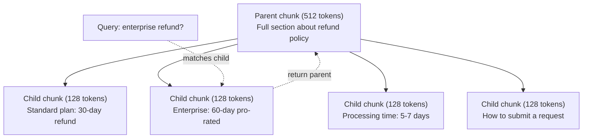
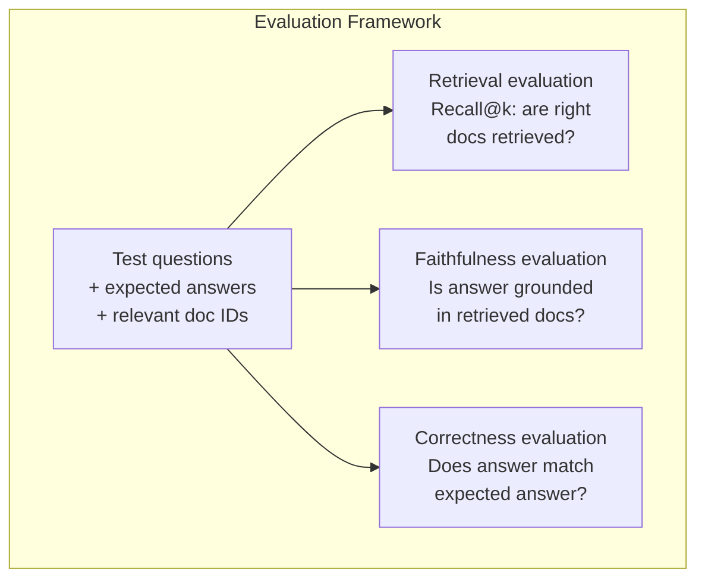

# RAG avançado (Combinação, Rango, Busca híbrida) 

> RAG básico recupera os pedaços mais semelhantes. Isso funciona para perguntas simples. Desmorona para raciocínio multi-hop, consultas ambíguas e grandes corporações. RAG avançado é a diferença entre uma demonstração que funciona em 10 documentos e um sistema que funciona em 10 milhões.

> **【中文解读】**Base RAG 检索 top-k 相似块, aplicável a questões simples, mas em muitos saltos de conclusão, perguntas diferentes e em grande escala de linguagem não funcionam.

> **【拓展：高级RAG→金融场景】**金融研报分析需要多跳推理 (跨文档关联数据),混合搜索 (混合搜索) 关键词+语义) ⇒

> - Não .**【前置】**學本節前 請先掌握:Phase 11·06 ((RAG) 理解基础 RAG 流程──本节是其进阶,假设你已经能写出 chunk→embed→retrieve→prompt→generate 的最小可用RAG──会用 `chromadb`- Não.`rank_bm25`- Não.`sentence-transformers`Ou `cohere`Rencontre a API.

**Type:** Build | **类型:** 构建
**Languages:** Python | **语言:** Python
**Prerequisites:** Phase 11, Lesson 06 (RAG) | **前置知识:** Phase 11 · 06 (RAG)
**Time:** ~90 minutes | **时间:** ~90 分钟
**Related:**A fase 5 · 23 (Estratégias de Chunking para RAG) abrange todos os seis algoritmos de chunking  recorrente, semântico, frase, documento-mãe, chunking tardia, recuperação contextual  com referências Vectara/antrópicas. Esta lição se baseia em cima: busca híbrida, re-ranqueamento, transformação de consulta.**相关:**Fase 5 · 23(RAG 分块策略) cobre todas as seis espécies de algoritmos de segmentos 递归、语义、句子、父文档、晚分块、上下文检索含 矢量/人类基准──本课在其上构建:混合搜索、重排、查询转换──

## Objetivos de aprendizagem

- Implementar estratégias avançadas de fragmentação (semântica, recursiva, pai/filho) que preservem a estrutura e o contexto do documento
  实现保留文档结构和上下文的高级分块策略 (→ "Reserver")
- Construir um pipeline de pesquisa híbrida combinando a combinação de palavras-chave BM25 com pesquisa semântica vetorial e um re-ranqueador de codificação cruzada
  Construir combinação BM25 关键词匹配、语义向量搜索和交叉编码器重排器的混合搜索管线
- Aplicar técnicas de transformação de consultas (HyDE, multi-query, step-back) para melhorar a recuperação em questões ambíguas ou complexas
  应用查询转换技术(HyDE、多查询、step-back) melhoria de problemas confusos ou complexos
- Diagnóstico e correção de falhas comuns do RAG: fragmento errado recuperado, resposta não contextual, desvio de raciocínio multi-hop
   diagnóstico e reparação  RAG  fracaso: checkso err err err err errão bloco   resposta não está no

> **【中文解读】**Objectivo do curso: Aprender a técnica de RAG  Questionar reescrever, misturar, reorganizar, adaptar-se a uma pesquisa, fazer uma análise mais ampla e mais ampla.

> - Não .**【类比】**基础 RAG 像新手图书管理员你说"营收",他按字面找带"营收"的书──高级 RAG 像资深管理员:(1) **Query 改写** Você diz "营收", ele traduzido para "上一季度财报中的收入数字"再找;**混合搜索**既翻主题目录 (语义) 再翻关键词索引 (BM25),两边结果合并;(3) **重排** convocar 100 livros,仔细看每本摘要排序挑出最相关的 5 本(cross-encoder) 

> ️ **【易错点】**3 个坑: ((1) **HyDE 用错场景**HyDE( deixe o LLM primeiro gerar hipóteses de resposta reutilizar resposta de procura) em fact inquiries e vice versa errada procura; apenas para o problema de abertura é válido―(2) **重排模型选错** Usando bi-encoder quando re-ranqueador de cross-encoder (((como BGE-M3 自己重排自己), não conseguiu uma real precisão de cross-encoder; usando especial BGE-renqueador-v2、Cohere Rerank──(3) **混合搜索没归一化**BM25 分数 0-30,向量相似度 0-1, directa相加向量永远被淹没; com fusão de rango recíproco (RRF) ou min-max 归一化──

> 🤔 **【困惑】**P: Do jump suggesting deve fazer ou fazer pesquisa? A: 检索做. 让模型在 prompt 里推理,每跳检索一次,把上一跳结果作为下一跳查询的输入.


## O problema é o problema da introdução

Construíste um sistema básico de RAG na lição 06. Funciona para perguntas simples num pequeno corpo.

> Você construiu uma base RAG 流水线在第 06 课时. É eficaz para o problema direto em pequenas bibliotecas de linguagem.

**Ambiguous query**A pesquisa semântica retorna pedaços sobre a estratégia de receita, as projeções de receita e os pensamentos do CFO sobre o crescimento da receita. Tudo semânticamente semelhante à palavra "receita". Nenhum contém o número real. A peça correta diz "$47.2M in Q3 2025" but uses the word "earnings" instead of "revenue." The embedding model thinks "revenue strategy" is closer to the query than "Q3 earnings were $47,2 M".

> **模糊查询**:"Qual é a receita do último trimestre?" Busca de significado retorna sobre estratégia de receita, previsão de receita e CFO sobre o crescimento de receita.

**Multi-hop question**A resposta é: "Qual equipe teve a maior melhoria na pontuação de satisfação do cliente?" Isso requer encontrar as pontuações de satisfação de cada equipe, compará-las e identificar o máximo. Nenhuma peça única contém a resposta.

> **多跳问题**:"Qual é o grupo de clientes que mais satisfazem a sua avaliação?" Isso requer encontrar a avaliação de satisfação de cada grupo, compará-los, e identificar o valor máximo.

**Large corpus problem**Você tem 2 milhões de blocos. A resposta correta é no bloco # 1,847,293. Sua busca no top 5 tira blocos # 14, # 89,201, # 1,200,000, # 44, e # 901,333. Fechado em espaço de inserção, mas nenhum contendo a resposta. Nesta escala, a pesquisa próxima aproximada introduz erro suficiente para que os resultados relevantes sejam empurrados para fora do top-k.

> **大型语料库问题**O seu top 5 saiu de outras partes. Nesta escala, a pesquisa de proximidade recente introduzia erros suficientes.

O RAG básico falha porque a semelhança vectorial não é o mesmo que a relevância. Um pedaço pode ser semânticamente semelhante a uma consulta sem ser útil para responder a ela. O RAG avançado aborda isso com quatro técnicas: pesquisa híbrida (aditar a correspondência de palavras-chave), re-ranqueamento (pontuar os candidatos com mais cuidado), transformação de consulta (fixar a consulta antes de pesquisar) e melhor fragmentação (recuperar na granularidade certa).

> Base RAG  fracassado é porque a similaridade de massa não é igual à correlação. Advanced RAG utilizou quatro técnicas de solução: mixed search (adding keywords match) ✓ re-organização (revisão) ✓ melhor análise de graus (revisão) ✓ melhor segmentação (revisão) ✓ melhor segmentação (revisão) ✓ melhor segmentação (revisão) ✓ melhor segmentação (revisão) ✓ melhor segmentação (revisão) ✓ melhor segmentação (revisão) ✓ melhorção (revisão) ✓ melhorção (revisão) ✓ melhorção (revisão) ✓ melhorção (revisão) ✓ melhorção (revisão) ✓ melhorção (revisão) ✓ melhorção (revisão) ✓ ✓ ✓ ✓ ✓ ✓ ✓ ✓ ✓ ✓ ✓ ✓ ✓ ✓ ✓ ✓ ✓ ✓ ✓ ✓ ✓ ✓ ✓ ✓ ✓ ✓ ✓ ✓ ✓ ✓ ✓ ✓ ✓ ✓ ✓ ✓ ✓ ✓ ✓ ✓ ✓ ✓ ✓ ✓ ✓ ✓ ✓ ✓ ✓ ✓ ✓ ✓ ✓ ✓ ✓ ✓ ✓ ✓ ✓ ✓ ✓ ✓ ✓ ✓ ✓ ✓ ✓ ✓ ✓ ✓ ✓ ✓ ✓ ✓ ✓ ✓ ✓ ✓ ✓ ✓ ✓ ✓ ✓ ✓ ✓ ✓ ✓ ✓ ✓ ✓ ✓ ✓ ✓ ✓ ✓ ✓ ✓ ✓ ✓ ✓ ✓ ✓ ✓ ✓ ✓ ✓ ✓ ✓ ✓ ✓ ✓ ✓ ✓ ✓    ✓ ✓ ✓ ✓   ✓ ✓                                                                      

## O conceito central.

> **【中文解读】**Alta classificação RAG 技术解决基础 RAG 局限性:查询重写将模糊问题转为精确查询) 混合检索(向量 + 关键词) 重排序(使用跨编码器 精排) 自适应检索(判断是否需要检索) 多跳推理(分解复杂问题为多次检索) △

> **【拓展：高级 RAG 的工业应用】**O sistema RAG geralmente inclui: inquérito intento分类到查询扩展/重写到混合检索(BM25 + 向量) até Cross-encoder 重排序到上下文缩写到答案生成 + 引用标注。Noção AI、Perplexity 等等产品都使用高级RAG 技术──Self-RAG 让模型自己决定何时检索──


### Pesquisa híbrida: Semântica + Palavra-chave

A pesquisa semântica (semelhança vectorial) é boa para entender o significado. "Como cancelar minha assinatura?" coincide com "Pasos para rescindir seu plano", embora eles não compartilhem palavras. Mas não tem correspondências exatas. "Code de erro E-4021" pode não corresponder a um pedaço contendo "E-4021" se o modelo de incorporação o tratar como ruído.

> 语义搜索(向量相似度)擅长理解含义──"como cancelar a suscrição?"匹配"终止计划的步骤"尽管不共享单词──但它错过精确匹配──"错误码 E-4021"可能不匹配包含"E-4021"的块,如果嵌入模型将视为噪音──

Busca de palavras-chave (BM25) é o oposto. Excelente em correspondências exatas. "E-4021" combina perfeitamente. Mas "cancelar minha assinatura" retorna resultados zero se o documento diz "terminar o seu plano".

> 关键词搜索(BM25)相反──它擅长精确匹配──"E-4021"完美匹配──"但是"取消我的订阅"如果文档说"终止你的计划"则返回零结果──

A busca híbrida executa ambas as coisas, e depois mistura os resultados.

> 混合搜索同时运行两者,然后合并结果──

**BM25**(Best Matching 25) é o algoritmo padrão de pesquisa de palavras-chave.

> **BM25**(Best Matching 25) é o padrão de palavras-chave do algoritmo de busca.

```
BM25(q, d) = sum over terms t in q:
    IDF(t) * (tf(t,d) * (k1 + 1)) / (tf(t,d) + k1 * (1 - b + b * |d| / avgdl))
```

Onde tf(t,d) é a frequência termânea de t no documento d, IDF(t) é a frequência documental inversa, \ \ \ \ \ \ \ \ \ \ \ \ \ \ \ \ \ \ \ \ \ \ \ \ \ \ \ \ \ \ \ \ \ \ \ \ \ \ \ \ \ \ \ \ \ \ \ \ \ \ \ \ \ \ \ \ \ \ \ \ \ \ \ \ \ \ \ \ \ \ \ \ \ \ \ \ \ \ \ \ \ \ \ \ \ \ \ \ \ \ \ \ \ \ \ \ \ \ \ \ \ \ \ \ \ \ \ \ \ \ \ \ \ \ \ \ \ \ \ \ \ \ \ \ \ \ \ \ \ \ \ \ \ \ \ \ \ \ \ \ \ \ \ \ \ \ \ \ \ \ \ \ \ \ \ \ \ \ \ \ \ \ \ \ \ \ \ \ \ \ \ \ \ \ \ \ \ \ \ \ \ \ \ \ \ \ \ \ \ \ \ \ \ \ \ \ \ \ \ \ \ \ \ \ \ \ \ \ \ \ \ \ \ \ \ \ \ \ \ \ \ \ \ \ \ \ \ \ \ \ \ \ \ \ \ \ \ \ \ \ \ \ \ \ \ \ \ \ \ \ \ \ \ \ \ \ \ \ \ \ \ \ \ \ \ \ \ \ \ \ \ \ \ \ \ \ \ \ \ \ \ \ \ \ \ \ \ \ \ \ \ \ \ \ \ \ \ \ \ \ \ \ \ \ \ \ \ \ \ \ \ \ \ \ \ \ \ \ \ \ \ \ \ \ \ \ \ \ \ \ \ \ \ \ \ \ \ \ \ \ \ \ \ \ \ \ \ \ \ \ \ \ \ \ \ \ \ \ \ \ \ \ \ \ \ \ \ \ \ \ \ \ \ \ \ \ \ \ \ \ \ \ \ \ \ \ \ \ \ \ \ \ \ \ \ \ \ \ \ \ \ \ \ \ \ \ \ \ \ \ \ \ \ \ \ \ \ \ \ \ \ \ \ \ \ \ \ \ \ \ \ \ \ \ \ \ \ \ \ \ \ \ \ \ \ \ \ \ \ \ \ \ \ \ \ \ \ \ \ \ \ \ \ \ \ \ \ \ \ \ \ \ \ \ \ \

> Entre eles, tf(t,d) é t, d) é inversamente a frequência do arquivo, d) é a frequência do arquivo, d) é a frequência do arquivo, d) é a frequência do arquivo, d) é a frequência do arquivo, d) é a frequência do arquivo, d) é a frequência do arquivo, d) é a frequência do arquivo, d) é a frequência do arquivo, d) é a frequência do arquivo, d) é a frequência do arquivo, d) é a frequência do arquivo, d) é a frequência do arquivo, d) é a frequência do arquivo, d) é a frequência do arquivo, d) é a frequência do arquivo, d) é a frequência do arquivo, d) é a frequência do arquivo, d) é a frequência do arquivo, d) é a frequência do arquivo, d) é a frequência do arquivo, d) é a frequência do arquivo, d) é a frequência do arquivo, d) é a frequência do arquivo, d) é a frequência do arquivo, d) é a frequência do arquivo, e d) é a frequência do arquivo, e o arquivo, e o arquivo, e o arquivo, e o arquivo do arquivo, e o arquivo, e o arquivo, e o arquivo, e o arquivo, e o arquivo, e o arquivo, e o arquivo, e o arquivo, e o arquivo, e o arquivo, e o arquivo, e o arquivo, e o arquivo, e o arquivo, e o arquivo, e o arquivo, e o arquivo, que é o arquivo, que é o arquivo, que é o arquivo, que é o arquivo.

Em termos simples: o BM25 classifica documentos mais altos quando contêm termos de consulta (especialmente os raros), mas com retornos diminuindo para termos repetidos.

> 简而言之:BM25 给含询词 (especialmente rar有词) 的文档更高分,但重复词有递减收益――含"revenue"50次的文档不仅含一次的50倍相关――

### Fusão de grau recíproco (RRF)

Você tem duas listas classificadas: uma da pesquisa vetorial, uma do BM25. Como você as combina?

> Você tem duas categorias de pesquisas: uma de pesquisa de massa, outra de BM25... como combiná-las?

```
RRF_score(d) = sum over rankings R:
    1 / (k + rank_R(d))
```

Onde k é uma constante (tipicamente 60) que impede que o resultado de topo seja dominado.

> Entre eles, k é o número habitual (normalmente 60), evitando o resultado de classificação em primeiro lugar.

Um documento classificado como #1 na pesquisa vetorial e #5 na BM25 obtém: 1/(60+1) + 1/(60+5) = 0.0164 + 0.0154 = 0.0318

Um documento classificado #3 na pesquisa vetorial e #2 na BM25 obtém: 1/(60+3) + 1/(60+2) = 0.0159 + 0.0161 = 0.0320

> Em um volume de pesquisa em primeira posição, BM25 排名第五的文档得:1/(60+1) + 1/(60+5) = 0,0164 + 0,0154 = 0,0318。 em um volume de pesquisa em terceiro lugar, BM25 排名第二的文档得:1/(60+3) + 1/(60+2) = 0,0159 + 0,0161 = 0,0320。

O RRF balanceia naturalmente os dois sinais. Um documento que ocupa um lugar alto em ambas as listas obtém a melhor pontuação. Um documento que ocupa o lugar 1 em uma lista, mas está ausente da outra, obtém uma pontuação moderada.

> RRF balancear naturalmente dois sinais. Todos os documentos de alta classificação entre as duas listas têm o maior número de pontos.

### Renclassificação

A recuperação (seja vector, palavra-chave ou híbrido) é rápida, mas imprecisa. Utiliza bi-encoders: a consulta e cada documento são incorporados de forma independente, depois comparados. Os incorporados são calculados uma vez e armazenados em cache.

> 检索(无论向量、关键词还是混合)快但不精确──它使用双编码器:查询和每个文档独立嵌入,然后比较──嵌入计算一次并缓存──这可扩展到百万文档──

O Ranking usa encodadores cruzados: a consulta e um documento candidato são alimentados juntos em um modelo que produz uma pontuação de relevância. O modelo vê ambos os textos simultaneamente e pode capturar interações de graus finos entre eles. Um encodador cruzado pode entender que "Q3 ganhos foram?" é altamente relevante para um pedaço contendo "$47.2M no Q3" mesmo que um bi-encodador não tenha a conexão.

> Gravadeira com o encoderador de cessar: entregue um modelo de porcentagem de correlação de saída e de candidato ao arquivo. O modelo pode ver duas partes de texto ao mesmo tempo, captando a detalhe entre elas. O encoder pode entender "Q3                                                                                                                                                                                                                                                                                                                                                                                                                                                              

O compromisso: os cross-encoders são 100-1000 vezes mais lentos que os bi-encoders porque processam o par de consulta-documento em conjunto. Você não pode calcular pré-scores de cross-encoder para um milhão de documentos. A solução: recuperar um conjunto de candidatos maior (top-50 da pesquisa híbrida), em seguida, re-ranquear com um cross-encoder para obter o top-5 final.

> 权衡:交叉编码器比双编码器慢100-1000倍,因为它联合处理查询-文档对──你无法为百万文档预计算交叉编码器分数──解决方案:检索更大候选集(混合搜索 top-50),然后使用交叉编码器重排得到最终 top-5──


Modelos comuns de re-ranqueamento (2026 lineup):

> 常见重排模型(2026 年阵容):

- Rerank de coesão 3.5: API gerenciada, multilíngue, melhor ganho de recall em corpora mistas
  托管 API、多语言、混合语料 最大召回增益
- Rencontre de viagem-2.5: API gerenciada, menor latência das opções hospedadas
  托管 API、托管选项最小延迟
- Jina-Reranker-v2 Multilíngue: peso aberto, mais de 100 línguas
  开源权重、100+ 语言
- bge-re-ranquerer-v2-m3: peso aberto, linha de base forte
  开源权重、强基线
- cross-encoder/ms-marco-MiniLM-L-6-v2: peso aberto, executado em CPU para prototipagem
  Open Source Power ∞ Pode funcionar no CPU
- ColBERTv2 / Jina-ColBERT-v2: retrasos interação re-ranqueadores multi-vector  Tokens (não O(docs) no tempo de pontuação
  后期交互多向量重排器评分时 O(tokens) e não O(docs)

### Transformação de consulta

Às vezes, o problema não é a recuperação, mas a consulta em si. "O que foi essa coisa sobre a nova mudança de política?" é uma consulta de pesquisa terrível. Não contém termos específicos. A incorporação é vaga. Nenhum sistema de recuperação pode encontrar os documentos certos a partir disso.

> Às vezes, a questão não é pesquisa, mas em pesquisa em si mesma. "O que é essa mudança de política nova?" é uma pesquisa ruim.

**Query rewriting**O Mestrado em Direito pode fazer isto:

> **查询重写**O que fazer:

```
User: "What was that thing about the new policy change?"
Rewritten: "Recent policy changes and updates"
```

**HyDE (Hypothetical Document Embeddings)**Ao invés de procurar com a consulta, gerar uma resposta hipotética, incorporar isso e procurar documentos reais semelhantes.

> **HyDE（假设文档嵌入）**Não é preciso pesquisar, mas gerar hipóteses, embutidos nele, pesquisar documentos reais semelhantes.

```
Query: "What is the refund policy for enterprise?"
Hypothetical answer: "Enterprise customers are eligible for a full refund
within 60 days of purchase. Refunds are pro-rated based on the remaining
subscription period and processed within 5-7 business days."
```

Embed a resposta hipotética e procurar documentos reais semelhantes a ela. A intuição: a resposta hipotética vive mais perto do espaço de inserção da resposta real do que a pergunta original. Perguntas e respostas têm estruturas linguísticas diferentes. Ao gerar uma resposta hipotética, você preenche a lacuna entre "espaço de pergunta" e "espaço de resposta" no inserimento.

> Emplacar respostas de hipóteses e procurar documentos reais semelhantes a eles. Intuition: as hipóteses de resposta estão mais próximas da resposta real do que as questões originais no espaço de inserção.

HyDE adiciona uma chamada LLM antes da recuperação. Isso aumenta a latência em 500-2000ms. Vale a pena quando a qualidade da recuperação é ruim em consultas brutas.

> HyDE em exames pré-agregação de uma vez LLM 调用── isso aumenta 500-2000ms 延迟── original inquérito exames qualidade diferença时值──

### Parentes e filhos

O cimentamento padrão obriga a uma compensação: pedaços pequenos para a recuperação precisa, pedaços grandes para o contexto suficiente.

> 标准分块强制权衡:小块精确检索,大块足够上下文──父子分块消除这个权衡──

Indice pequenos pedaços (128 tokens) para recuperação. Quando um pedaço pequeno é recuperado, devolva seu pedaço-mãe (512 tokens) para o prompt. O pedaço-mãe corresponde à consulta com precisão. O pedaço-mãe fornece contexto suficiente para o LLM gerar uma boa resposta.

> 索引小块(128 token) para fazer a pesquisa.



A consulta "reembolso da empresa?" corresponde à peça C2 da criança com precisão. Mas o prompt recebe a peça P da mãe completa, que inclui o contexto circundante sobre o tempo de processamento e o processo de submissão.

>  Inquérito "reembolso da empresa?"  Exact match for bloco C2, mas  recebe o bloco P completo, contendo sobre o tempo de tratamento e a ordem de negociação 

### Filtragem de metadados

Antes de executar uma pesquisa vetorial, filtrar o corpus por metadados: data, fonte, categoria, autor, língua. Isso reduz o espaço de pesquisa e evita resultados irrelevantes.

> Em run run run run search volume, depending on the data 语料库:日期、来源、类别、作者、语言── This shortened search space并 prevent unrelated results──

"O que mudou na política de segurança no mês passado?" só deve procurar documentos dos últimos 30 dias na categoria de segurança. Sem filtrar metadados, você busca todo o corpus e pode recuperar um documento de segurança de 2 anos que acontece ser semânticamente semelhante.

> "O que mudou na estratégia de segurança do último mês?" deve ser pesquisado apenas nos últimos 30 dias de segurança. Não há dados sobre o que você pesquisou, você pesquisou toda a biblioteca de linguagem, pode pesquisar até um acaso semelhante a linguagem.

Os sistemas RAG de produção armazenam metadados ao lado de cada peça: documento fonte, data de criação, categoria, autor, versão.

> Produção RAG  sistemas em cada bloco ao lado armazenamento de dados: fonte documentário                                                                                                                                                                                                                                                                                                                                                                                                                                                                                                         

### Avaliação

Construíste um sistema RAG, como sabe se funciona?

> Você construiu um sistema RAG... como é que sabe que funciona?

**Retrieval relevance (Recall@k)**Para um conjunto de perguntas de teste com documentos relevantes conhecidos, qual percentagem de documentos relevantes aparece nos resultados do topo?

> **检索相关性（Recall@k）**A resposta a uma pergunta no 47o bloco, o 47o bloco, aparece no top-5?

**Faithfulness**Se os fragmentos recuperados disserem "flor de reembolso de 60 dias" e o modelo disser "flor de reembolso de 90 dias", isso é um fracasso de fidelidade. O modelo alucinou apesar de ter o contexto correto.

> **忠实度**Se o bloco de verificação diz "60 dias de devolução" e o modelo diz "90 dias de devolução", então a fidelidade é falhada.

**Answer correctness**A resposta gerada corresponde à resposta esperada? é a métrica de ponta a ponta.

> **答案正确性**A resposta gerada corresponde à resposta esperada? É um indicador de extremo a extremo.

Uma simples verificação de fidelidade: tomar cada alegação na resposta gerada e verificar que ela aparece (em substância) nas partes recuperadas.

> 简单忠实检查:取生成答案中的每个声明,验证它 (), verificando-o (), verificando-o (), verificando-o (), verificando-o (), verificando-o (), verificando-o (), verificando-o (), verificando-o (), verificando-o (), verificando-o (), verificando-o (), verificando-o (), verificando-o (), verificando-o (), verificando-o (), verificando-o (), verificando-o (), verificando-o (), verificando-o (), verificando-o (), verificando-o (), verificando-o (), verificando-o (), verificando-o (), verificando-o (), verificando-o (), verificando-o (), verificando-o (), verificando-o (), verificando-o (), verificando-o ().



## Construí-lo e realizei-o.
```figure
agentic-rag-loop
```

## Construí-lo

### Passo 1: Implementação do BM25

```python
import math
from collections import Counter

class BM25:
    def __init__(self, k1=1.2, b=0.75):
        self.k1 = k1
        self.b = b
        self.docs = []
        self.doc_lengths = []
        self.avg_dl = 0
        self.doc_freqs = {}
        self.n_docs = 0

    def index(self, documents):
        self.docs = documents
        self.n_docs = len(documents)
        self.doc_lengths = []
        self.doc_freqs = {}

        for doc in documents:
            words = doc.lower().split()
            self.doc_lengths.append(len(words))
            unique_words = set(words)
            for word in unique_words:
                self.doc_freqs[word] = self.doc_freqs.get(word, 0) + 1

        self.avg_dl = sum(self.doc_lengths) / self.n_docs if self.n_docs else 1

    def score(self, query, doc_idx):
        query_words = query.lower().split()
        doc_words = self.docs[doc_idx].lower().split()
        doc_len = self.doc_lengths[doc_idx]
        word_counts = Counter(doc_words)
        score = 0.0

        for term in query_words:
            if term not in word_counts:
                continue
            tf = word_counts[term]
            df = self.doc_freqs.get(term, 0)
            idf = math.log((self.n_docs - df + 0.5) / (df + 0.5) + 1)
            numerator = tf * (self.k1 + 1)
            denominator = tf + self.k1 * (1 - self.b + self.b * doc_len / self.avg_dl)
            score += idf * numerator / denominator

        return score

    def search(self, query, top_k=10):
        scores = [(i, self.score(query, i)) for i in range(self.n_docs)]
        scores.sort(key=lambda x: x[1], reverse=True)
        return scores[:top_k]
```

### Passo 2: Fusão de Câncreas Reciprocas

```python
def reciprocal_rank_fusion(ranked_lists, k=60):
    scores = {}
    for ranked_list in ranked_lists:
        for rank, (doc_id, _) in enumerate(ranked_list):
            if doc_id not in scores:
                scores[doc_id] = 0.0
            scores[doc_id] += 1.0 / (k + rank + 1)
    fused = sorted(scores.items(), key=lambda x: x[1], reverse=True)
    return fused
```

### Passo 3: Pipeline de Busca Híbrida

```python
def hybrid_search(query, chunks, vector_embeddings, vocab, idf, bm25_index, top_k=5, fusion_k=60):
    query_emb = tfidf_embed(query, vocab, idf)
    vector_results = search(query_emb, vector_embeddings, top_k=top_k * 3)
    bm25_results = bm25_index.search(query, top_k=top_k * 3)
    fused = reciprocal_rank_fusion([vector_results, bm25_results], k=fusion_k)
    return fused[:top_k]
```

### Passo 4: Reranker simples

Na produção, você usaria um modelo de codificação cruzada. Aqui construímos um re-ranqueador que marca a relevância do documento de consulta usando sobreposição de palavras, importância de termos e correspondência de frases.

> Produção em você vai usar um modelo de codificador de cross-seção. Aqui construímos um sistema de classificação de pesquisas relacionadas com documentos.

```python
def rerank(query, candidates, chunks):
    query_words = set(query.lower().split())
    stop_words = {"the", "a", "an", "is", "are", "was", "were", "what", "how",
                  "why", "when", "where", "do", "does", "for", "of", "in", "to",
                  "and", "or", "on", "at", "by", "it", "its", "this", "that",
                  "with", "from", "be", "has", "have", "had", "not", "but"}
    query_terms = query_words - stop_words

    scored = []
    for doc_id, initial_score in candidates:
        chunk = chunks[doc_id].lower()
        chunk_words = set(chunk.split())

        term_overlap = len(query_terms & chunk_words)

        query_bigrams = set()
        q_list = [w for w in query.lower().split() if w not in stop_words]
        for i in range(len(q_list) - 1):
            query_bigrams.add(q_list[i] + " " + q_list[i + 1])
        bigram_matches = sum(1 for bg in query_bigrams if bg in chunk)

        position_boost = 0
        for term in query_terms:
            pos = chunk.find(term)
            if pos != -1 and pos < len(chunk) // 3:
                position_boost += 0.5

        rerank_score = (
            term_overlap * 1.0
            + bigram_matches * 2.0
            + position_boost
            + initial_score * 5.0
        )
        scored.append((doc_id, rerank_score))

    scored.sort(key=lambda x: x[1], reverse=True)
    return scored
```

### Passo 5: HyDE (Inmoblagem de Documentos Hipotéticos)

```python
def hyde_generate_hypothesis(query):
    templates = {
        "what": "The answer to '{query}' is as follows: Based on our documentation, {topic} involves specific policies and procedures that define how the process works.",
        "how": "To address '{query}': The process involves several steps. First, you need to initiate the request. Then, the system processes it according to the defined rules.",
        "default": "Regarding '{query}': Our records indicate specific details and policies related to this topic that provide a comprehensive answer."
    }
    query_lower = query.lower()
    if query_lower.startswith("what"):
        template = templates["what"]
    elif query_lower.startswith("how"):
        template = templates["how"]
    else:
        template = templates["default"]

    topic_words = [w for w in query.lower().split()
                   if w not in {"what", "is", "the", "how", "do", "does", "a", "an",
                                "for", "of", "to", "in", "on", "at", "by", "and", "or"}]
    topic = " ".join(topic_words) if topic_words else "this topic"

    return template.format(query=query, topic=topic)


def hyde_search(query, chunks, vector_embeddings, vocab, idf, top_k=5):
    hypothesis = hyde_generate_hypothesis(query)
    hypothesis_emb = tfidf_embed(hypothesis, vocab, idf)
    results = search(hypothesis_emb, vector_embeddings, top_k)
    return results, hypothesis
```

### Passo 6: Parentes e filhos

```python
def create_parent_child_chunks(text, parent_size=200, child_size=50):
    words = text.split()
    parents = []
    children = []
    child_to_parent = {}

    parent_idx = 0
    start = 0
    while start < len(words):
        parent_end = min(start + parent_size, len(words))
        parent_text = " ".join(words[start:parent_end])
        parents.append(parent_text)

        child_start = start
        while child_start < parent_end:
            child_end = min(child_start + child_size, parent_end)
            child_text = " ".join(words[child_start:child_end])
            child_idx = len(children)
            children.append(child_text)
            child_to_parent[child_idx] = parent_idx
            child_start += child_size

        parent_idx += 1
        start += parent_size

    return parents, children, child_to_parent
```

### Passo 7: Avaliação da fidelidade

```python
def evaluate_faithfulness(answer, retrieved_chunks):
    answer_sentences = [s.strip() for s in answer.split(".") if len(s.strip()) > 10]
    if not answer_sentences:
        return 1.0, []

    grounded = 0
    ungrounded = []
    context = " ".join(retrieved_chunks).lower()

    for sentence in answer_sentences:
        words = set(sentence.lower().split())
        stop_words = {"the", "a", "an", "is", "are", "was", "were", "and", "or",
                      "to", "of", "in", "for", "on", "at", "by", "it", "this", "that"}
        content_words = words - stop_words
        if not content_words:
            grounded += 1
            continue

        matched = sum(1 for w in content_words if w in context)
        ratio = matched / len(content_words) if content_words else 0

        if ratio >= 0.5:
            grounded += 1
        else:
            ungrounded.append(sentence)

    score = grounded / len(answer_sentences) if answer_sentences else 1.0
    return score, ungrounded


def evaluate_retrieval_recall(queries_with_relevant, retrieval_fn, k=5):
    total_recall = 0.0
    results = []

    for query, relevant_indices in queries_with_relevant:
        retrieved = retrieval_fn(query, k)
        retrieved_indices = set(idx for idx, _ in retrieved)
        relevant_set = set(relevant_indices)
        hits = len(retrieved_indices & relevant_set)
        recall = hits / len(relevant_set) if relevant_set else 1.0
        total_recall += recall
        results.append({
            "query": query,
            "recall": recall,
            "hits": hits,
            "total_relevant": len(relevant_set)
        })

    avg_recall = total_recall / len(queries_with_relevant) if queries_with_relevant else 0
    return avg_recall, results
```

## Use-o com o framework implementado.

Com um verdadeiro cross-encoder para re-ranking:

> Usar um código de código real:

```python
from sentence_transformers import CrossEncoder

reranker = CrossEncoder("cross-encoder/ms-marco-MiniLM-L-6-v2")

def rerank_with_cross_encoder(query, candidates, chunks, top_k=5):
    pairs = [(query, chunks[doc_id]) for doc_id, _ in candidates]
    scores = reranker.predict(pairs)
    scored = list(zip([doc_id for doc_id, _ in candidates], scores))
    scored.sort(key=lambda x: x[1], reverse=True)
    return scored[:top_k]
```

Com o re-ranqueador gerenciado por Cohere:

> Utilizando o sistema de controlo:

```python
import cohere

co = cohere.Client()

def rerank_with_cohere(query, candidates, chunks, top_k=5):
    docs = [chunks[doc_id] for doc_id, _ in candidates]
    response = co.rerank(
        model="rerank-english-v3.0",
        query=query,
        documents=docs,
        top_n=top_k
    )
    return [(candidates[r.index][0], r.relevance_score) for r in response.results]
```

Para a HyDE com um verdadeiro LLM:

> Use o LLM real fazer HyDE:

```python
import anthropic

client = anthropic.Anthropic()

def hyde_with_llm(query):
    response = client.messages.create(
        model="claude-sonnet-5",
        max_tokens=256,
        messages=[{
            "role": "user",
            "content": f"Write a short paragraph that would be a good answer to this question. Do not say you don't know. Just write what the answer would look like.\n\nQuestion: {query}"
        }]
    )
    return response.content[0].text
```

Para a pesquisa híbrida de produção com a Weaviate:

> Usar Weaviate fazer produção misturada

```python
import weaviate

client = weaviate.connect_to_local()

collection = client.collections.get("Documents")
response = collection.query.hybrid(
    query="enterprise refund policy",
    alpha=0.5,
    limit=10
)
```

O parâmetro alfa controla o equilíbrio: 0,0 = palavra-chave pura (BM25), 1,0 = vetor puro, 0,5 = peso igual.

> Alfa 参数控制平衡:0.0=纯关键词(BM25),1.0=纯向量,0.5=等权重── a maioria dos sistemas de produção usa alfa entre 0.3 a 0.7 ∼──

## Envia-o . Produto .

Esta lição produz:
- `outputs/prompt-advanced-rag-debugger.md`-- um aviso para o diagnóstico e a correcção de problemas de qualidade de RAG
   diagnóstico e reparação RAG  qualidade de questões
- `outputs/skill-advanced-rag.md`-- uma habilidade para construir RAG de nível de produção com busca híbrida e re-ranqueamento
  Construção de habilidades de RAG de nível de produção de pesquisa e pesquisa misturada

## Exercícios.

1. Compare BM25 vs busca vetorial vs busca híbrida nos documentos de amostra. Para cada uma das 5 consultas de teste, registro qual abordagem retorna a peça mais relevante na posição #1.
   Em um ensaio de arquivo, compare BM25 vs 向量搜索 vs 混合搜索. Em 5 pesquisas de teste, note which method in position #1  return the most relevant block.

2. Implementar um filtro de metadados. Adicionar um campo "categoria" a cada documento (segurança, faturamento, API, produto). Antes de executar uma pesquisa vetorial, filtrar os blocos para apenas a categoria relevante. Teste com "Que criptografia é usada?" e verifique que só pesquisa blocos de categoria de segurança.
   实现元数据过器──给每个文档加"category"字段(segurança、billing、api、product)──运行向量搜索前,过块到相关类别──用"使用什么加密?"测试,验证它只搜索安全 类别块──

3. Construa um pipeline completo de HyDE usando a função generar simples da lição 06. Compare a qualidade de recuperação (relevança no topo 3) entre a pesquisa de consulta direta e a pesquisa de HyDE em todas as 5 consultas de teste.
   Use a simples função de geração da lição 06 para construir um HyDE completo. Comparar pesquisa direta e pesquisa HyDE. Pesquisa em 5 pesquisas de teste.

4. Implemente a estratégia de parente-filho de fragmentação nos documentos de amostra. Use child_size=30 e parent_size=100. Procure com pedaços de criança, mas retorne pedaços de pai no prompt. Compare as respostas geradas para o chunking padrão com chunk_size=50.
   Em um arquivo de exemplo, implementar a estratégia de parentesco. Comparar a resposta gerada com o parentesco.

5. Crie um conjunto de dados de avaliação: 10 perguntas com fragmentos de respostas conhecidos. Mese Recall@3, Recall@5, e Recall@10 para (a) apenas pesquisa vetorial, (b) apenas BM25, (c) pesquisa híbrida, (d) híbrida + re-ranking. Planeje os resultados e identifique onde o re-ranking ajuda mais.
   创建评估数据集:10 个带已知答案块问题──为 (a) 仅向量搜索、((b) 仅 BM25、((c) 混合搜索、((d) 混合 + 重排测量 Recall@3、Recall@5、Recall@10──绘制结果并识别重排在哪里帮助最大──

## Termos-chave .

| Term | What people say | What it actually means | 中文释义 |
|------|----------------|----------------------|---------|
| BM25 | "Keyword search" | A probabilistic ranking algorithm that scores documents by term frequency, inverse document frequency, and document length normalization | BM25：按词频、逆文档频率和文档长度归一化给文档评分的概率排序算法 |
| Hybrid search | "Best of both worlds" | Running semantic (vector) and keyword (BM25) search in parallel, then merging results with rank fusion | 混合搜索：并行运行语义（向量）和关键词（BM25）搜索，然后用排名融合合并结果 |
| Reciprocal Rank Fusion | "Merge ranked lists" | Combining multiple ranked lists by summing 1/(k + rank) for each document across all lists | 倒数排名融合：通过对每个文档在所有列表中求和 1/(k + rank) 合并多个排序列表 |
| Reranking | "Second pass scoring" | Using a more expensive cross-encoder model to re-score a candidate set from initial retrieval | 重排：用更昂贵的交叉编码器模型对初始检索的候选集重新评分 |
| Cross-encoder | "Joint query-document model" | A model that takes a query and document as a single input, producing a relevance score; more accurate than bi-encoders but too slow for full corpus search | 交叉编码器：将查询和文档作为单一输入的模型，输出相关性分数；比双编码器精确但太慢无法全语料搜索 |
| Bi-encoder | "Independent embedding model" | A model that embeds queries and documents independently; fast because embeddings are precomputed, but less accurate than cross-encoders | 双编码器：独立嵌入查询和文档的模型；快因为嵌入预计算，但比交叉编码器精度低 |
| HyDE | "Search with a fake answer" | Generate a hypothetical answer to the query, embed it, and search for real documents similar to it | HyDE：生成查询的假设答案，嵌入它，搜索相似真实文档 |
| Parent-child chunking | "Small search, big context" | Index small chunks for precise retrieval but return the larger parent chunk to provide sufficient context | 父子分块：索引小块精确检索但返回较大父块提供足够上下文 |
| Metadata filtering | "Narrow before searching" | Filtering documents by attributes (date, source, category) before running vector search to reduce the search space | 元数据过滤：运行向量搜索前按属性（日期、来源、类别）过滤文档以缩小搜索空间 |
| Faithfulness | "Did it stay grounded" | Whether the generated answer is supported by the retrieved documents, as opposed to hallucinated from the model's training data | 忠实度：生成的答案是否被检索文档支持，而非从模型训练数据幻觉 |

## Mais leitura 延伸阅读

- Robertson & Zaragoza, "The Probabilistic Relevance Framework: BM25 and Beyond" (2009) - a referência definitiva para BM25, explicando as bases probabilísticas por trás da fórmula
  Robertson & Zaragoza, "O quadro de relevância probabilística: BM25 e além" (WEB
- Cormack et al., "Fusão de Rango Reciproco supera os métodos de aprendizagem de Condorcet e de Rango Individual" (2009) -- o artigo original do RRF mostrando que supera os métodos de fusão mais complexos
  Cormack etc, "Fusão de Rango Reciproco..." (2009) RRF 原始文,展示它击败更复杂的融合方法
- Gao et al., "Precisos Retrieval de Cero-Shot Dense sem Etiquetas de Relevança" (2022) -- o documento HyDE demonstrando que as incorporações hipotéticas de documentos melhoram a recuperação sem quaisquer dados de treinamento
  Gao 等, "Precisão Zero-Shot Dense Retrieval... "(2022) HyDE 论文, demonstrar假设文档嵌入无需训练数据即可改进检索
- Nogueira & Cho, "Passage Re-ranking with BERT" (2019) -- mostrou que o re-ranking de encodeador cruzado em cima do BM25 melhora significativamente a qualidade de recuperação
  Nogueira & Cho, "Passage Re-ranking with BERT" (em 2019)  exibição em BM25 之上的交叉编码器重排显著改善检索质量
- [Khattab et al., "DSPy: Compiling Declarative Language Model Calls into Self-Improving Pipelines" (2023)](https://arxiv.org/abs/2310.03714)-- trata a construção rápida e a seleção de peso como um problema de otimização sobre os canais de recuperação; leia isto para "programas LLM" em vez de "LLM rápidos".
  Khattab 等, "DSPy" (do ano de 2023)                                                                                                                                                                                                                                                        
- [Edge et al., "From Local to Global: A Graph RAG Approach to Query-Focused Summarization" (Microsoft Research 2024)](https://arxiv.org/abs/2404.16130)-- Papel GraphRAG: extracção de relações entre entidades + detecção da comunidade de Leiden para resumo focado em consulta; a distinção entre recuperação global e local.
  Edge 等, "De Local para Global: Uma abordagem RAG gráfica..."(Microsoft Research 2024) GraphRAG 论文:实体关系抽取 + Leiden 社区检测用于查询聚焦摘摘要;全局 vs 局部检索的区别──
- [Asai et al., "Self-RAG: Learning to Retrieve, Generate, and Critique through Self-Reflection" (ICLR 2024)](https://arxiv.org/abs/2310.11511)-- auto-avaliação RAG com tokens de reflexão; a fronteira agencial passado estático de recuperação-então-geração.
  Asai 等, "Self-RAG" ((ICLR 2024) 带反思代币 的自评RAG;静态先检索后生成之外的智能体前沿──
- [LangChain Query Construction blog](https://blog.langchain.dev/query-construction/)-- como traduzir consultas de linguagem natural em consultas de banco de dados estruturadas (Text-to-SQL, Cypher) como uma etapa de recuperação prévia.
  LangChain 查询构建博客如何将自然语言查询翻译为结构化数据库查询(Text-to-SQL、Cypher) como pre-check索步骤──
