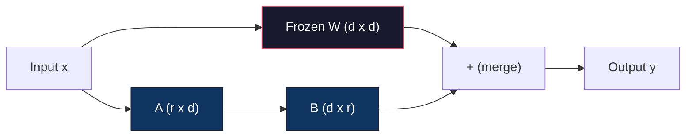
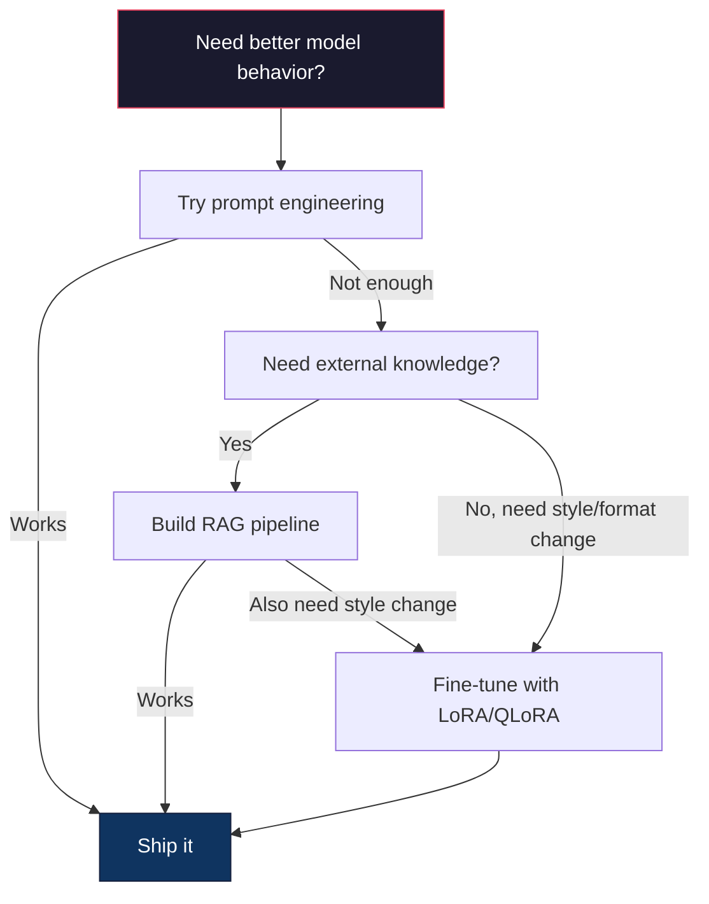

# A sintonia perfeita com LoRA e QLoRA .

> O ajuste fino completo de um modelo 7B requer 56 GB de VRAM. Você não tem isso. Nem a maioria das empresas. LoRA permite ajustar o mesmo modelo em 6 GB treinando menos de 1% dos parâmetros. Isto não é um compromisso - ele corresponde à qualidade de ajuste fino completo na maioria das tarefas. Todo o ecossistema de ajuste fino de código aberto funciona com este truque.

> **【中文解读】**O modelo 7B requer 56GB de armazenamento de micro-modular. LoRA apenas treina menos de 1% de parâmetros.

> **【拓展：LoRA微调→定制大模型】**LoRA é a técnica central do grande modelo de empresa: com uma pequena quantidade de áreas de dados, obter capacidade especializada (como análise financeira, teoria legal, geração de códigos, etc.)

> - Não .**【前置】**学本节前请先掌握:(1) Fase 10·06(Instrução de sintonização SFT) 理解监督微调的基本流程;(2) 线性代数基础矩阵乘法、秩、SVD 分解(看 Fase 01·11 SVD);(3) PyTorch 基础`nn.Linear`- Não.`backward()`- Não.`optimizer.step()`4) Abraçando o rosto .`transformers`O uso básico da biblioteca.`peft`和 `trl`- Não.

**Type:** Build | **类型:** 构建
**Languages:** Python | **语言:** Python
**Prerequisites:** Phase 10, Lesson 06 (Instruction Tuning / SFT) | **前置知识:** Phase 10 · 06（指令微调/SFT）
**Time:** ~75 minutes | **时间:** ~75 分钟
**Related:**A fase 10 abrange os ciclos SFT/DPO desde o zero. Esta lição conecta-os aos kits de ferramentas PEFT 2026 (PEFT, TRL, Unsloth, Axolotl, LLaMA-Factory).**相关:**Fase 10 da zero-pregação do ciclo SFT/DPO.

## Objetivos de aprendizagem

- Implementar o LoRA, injetando matrizes de adaptadores de baixo nível (A e B) nas camadas de atenção de um modelo pré-treinado
  通过向预训模型的注意力层注入低秩适配矩阵(A 和 B) Realizar LoRA
- Calcular a economia de parâmetros do LoRA vs. perfeito ajuste: classificar r com dimensões d_modelo trens parâmetros 2*r*d em vez de d^2
  计算 LoRA vs 全量微调的参数节省:秩 r 配 d_model 维度训练 2*r*d 参数而不是 d^2
- Ajuste perfeitamente um modelo usando QLoRA (4 bits base quantizada + adaptadores LoRA) para caber na memória de GPU do consumidor
  Use QLoRA(4-bit 量化基础模型 + LoRA 适配器) Micro调模型以适应消费级 GPU 内存
- Reunir os pesos do LoRA para o modelo base para implantação e comparar a velocidade de inferência com e sem adaptadores
  Para a implementação do modelo base de LoRA 权重合并回, comparar com/sem adaptador

> **【中文解读】**O objetivo do curso é: utilizar o LoRA/QLoRA para executar os parâmetros de alta eficiência e redução.


## O problema é o problema da introdução

Você tem um modelo base. Llama 3 8B. Você quer que ele responda aos bilhetes de suporte ao cliente na voz da sua empresa. SFT é a resposta. Mas SFT tem um problema de custo.

> Você tem um modelo básico. Llama 3 8B. Você quer que ele use o idioma da sua empresa para responder ao cliente.

O Llama 3 8B tem 8 bilhões de parâmetros. Em fp16, cada parâmetro leva 2 bytes. Isso é 16 GB apenas para carregar os pesos. Durante o treinamento, você também precisa de gradientes (16 GB), estados de otimização para Adam (32 GB para impulso + variância) e ativações. Total: aproximadamente 56 GB de VRAM para um único modelo 8B.

> Todos os parâmetros do modelo são modificados em forma de modelagem. Todos os parâmetros do modelo são modificados em forma de modelagem.

Um A100 de 80 GB mal pode caber nisto.$3-4/hour on cloud providers. Training for 3 epochs on 50,000 examples takes 6-10 hours. That's $30-40 por experiência, executar 10 experiências para obter os hiperparametros corretos e gastar 400 dólares antes de implementar qualquer coisa.

> Uma A100 80GB 勉强能装下──两张 A100 在云上每小时 $3-4。在 50,000 个样本上训练 3 个 epoch 需要 6-10 小时。每次实验 $30-40:

Há um problema mais profundo também. A ajuste fina completa modifica cada peso do modelo. Se ajustarmos os dados do suporte ao cliente, podemos degradar as capacidades gerais do modelo. É chamado esquecimento catastrófico. O modelo fica melhor em sua tarefa e pior em tudo o resto.

> Há também uma questão mais profunda. Todos os parâmetros de modificação de cada peso do modelo. Se você se afastar dos dados do cliente, pode reduzir a capacidade geral do modelo.

Precisamos de um método que treine menos parâmetros, use menos memória e não destrua o conhecimento existente do modelo.

> Você precisa de um método de treinamento com menos parâmetros, usando menos memória e não destruindo o modelo de conhecimento existente.

> - Não .**【类比】**Toda quantidade de pequenas modificações "tire todo o livro de texto de novo" " cada letra ((parámento) tudo mudou, grande volume de trabalho também fácil de alterar o conteúdo original errôneo ((catastrophe) esquecimento) "). LoRA 像"在教科书的页边贴贴贴贴"原文 ((W) 结不动,你只在边边贴小纸条 ((A×B矩阵) 写新注释;;最终输出 = 原文 + 便利贴――换任务时,撕旧便利贴贴新即可,原文保留──

## O conceito central.

> **【中文解读】**LoRA(Low-Rank Adaptation) é o método central do parametro de alta eficiência (PEFT):结原始权重,仅训低秩分解矩阵 (A*B), será capaz de treinar o parametro de bilhões de baixos para milhões de milhões.

> **【拓展：LoRA 的工程实践】**LoRA's rankings (ranking) são normalmente definidos como 8-64, aplicados em Q/V 投影矩阵效果最好──QLoRA(4-bit 基础模型 + LoRA) 让你在单张 RTX 4090 上微调 Llama-3-8B──HuggingFace PEFT库让 LoRA 微调几行代码即可实现──LoRA's costos são de aproximadamente 1/10, sendo o efeito próximo──

> 🤔 **【困惑】**Q: QLoRA é o que? e LoRA 区别? A: QLoRA = Quantized LoRA。 base modelo com 4-bit 量化(NF4) armazenamento, LoRA 适配器 com bf16 训练。 assim 16GB 权重压缩到4GB do Llama-3-8B,加加 LoRA 训练开销(约100MB),总共 6GB 显存就能微调单张 RTX 4090 / 3090 即可──代价:训练速度比纯 LoRA 慢约30%(因为要边反量化边向),但成本可控──


### LoRA: Adaptação de baixo grau

Edward Hu e colegas da Microsoft publicaram o LoRA em junho de 2021. A visão do artigo: as atualizações de peso durante o ajuste fino têm baixa classificação intrínseca. Você não precisa atualizar todos os 16,7 milhões de parâmetros em uma matriz de peso 4096x4096.

> Edward Hu e Microsoft co-publicaram em 6 de junho de 2021 LoRA──论文洞察:微调期间权重更新具有低内在排序──你不需要更新 4096x4096 权重矩阵中全部1670万参数──更新中的有用信息可被排序 16或32 的矩阵捕获──

> 🤔 **【困惑】**P: Por que o modelo de arranjo baixo consegue capturar informações de ajustes? A: Observação empírica Aghajanyan etc. (em 2020) descobriu que o peso do modelo de treinamento prévio é muito baixo, geralmente apenas algumas centenas ou milhares de vezes, para aprender a fazer uma nova tarefa.

Aqui está a matemática. Uma camada linear padrão calcula:

> Matemática como abaixo:

```
y = Wx
```

Onde W é uma matriz d_out x d_in. Para uma projeção de atenção de 4096x4096, isso é 16.777.216 parâmetros.

> Entre eles, W é o d_out x d_in 矩阵. Para 4096x4096

LoRA congela W e adiciona uma decomposição de baixo grau:

> LoRA 结 W 并添加低序分解:

> ️ **【易错点】**LoRA 微调的 3 个坑:(1) **秩 r 设太大**r=64 起步就太大,参数接近全量微调,省显存优势消失;起点 r=8 或 r=16,效果不够再加倍──(2) r=64 起步就太大,参数接近全量微调,省显存优势消失;起点 r=8 或 r=16,效果不够再加倍──(2) r=64 起步就太大,参数接近全量微调,省显存优势消失;起点 r=8 或 r=16,效果不够再加倍──(2) r=64 起步就太大,参数接近全量微调,省显存优势消失;起点 r=8 或 r=16,效果不够再加倍──(((2) r=64 r=64 r=64 r=64 r=64 r=64 r=64 r=64 r=64**target_modules 选错**Só para o`q_proj`Além disso, a aplicação de um sistema de regulação de dados é muito mais eficaz.`["q_proj", "v_proj", "k_proj", "o_proj"]`Além disso, mais atividade pode ser adicionada a MLP `gate_proj`- Não .`up_proj`- Não .`down_proj`△(3) **学习率没调高**LoRA 参数 é novo iniciativo, precisa de maior peso do que o prepraining; típico lr=1e-4 até 3e-4 ((比全量微调的2e-5 高 5-10 倍) 

```
y = Wx + BAx
```

Onde B é (d_out x r) e A é (r x d_in). A classificação r é muito menor que d - normalmente 8, 16 ou 32.

> Entre eles B é (d_out x r), A é (r x d_in) ⇒ R R R R 比 d 小得多通常 8、16 或 32。

Para r=16 numa camada de 4096x4096:
- Parâmetros originais: 4096 x 4096 = 16.777.216
- Parâmetros de LoRA: (4096 x 16) + (16 x 4096) = 65,536 + 65,536 = 131,072
- Reduzir: 131.072 / 16.777.216 = 0,78%

>  Para 4096x4096 层上的 r=16:
> - Parâmetros primitivos: 4996 x 4096 = 16.777.216
> - LoRA 参数:(4096 x 16) + (16 x 4096) = 65,536 + 65,536 = 131,072
> - 減少:131,072 / 16,777,216 = 0,78%

Estás a treinar 0,78% dos parâmetros e a obter 95-100% da qualidade.

> Você treina 0,78% de parametros, obtém 95-100% de qualidade.



A é iniciada com um gaussiano aleatório. B é iniciada com zero. Isso significa que a contribuição do LoRA começa em zero - o modelo começa a treinar a partir de seu comportamento original e gradualmente aprende a adaptação.

> A 用随机高斯初始化──B初始化为零── isto significa LoRA 贡献从零开始模型从原始行为开始训练,逐渐学习适应──

### O Fator de Escalada: Alfa

LoRA introduz um fator de escalação alfa que controla o quanto a atualização de baixo nível afeta a saída:

> LoRA  introduzir o factor alfa de redução, controlar o nível de actualização sobre o grau de impacto da saída:

```
y = Wx + (alpha / r) * BAx
```

Quando alfa = r, a escala é 1x. Quando alfa = 2r (a padrão comum), a escala é 2x. Este hiperparâmetro controla a taxa de aprendizagem do caminho LoRA independentemente da taxa de aprendizagem básica.

> Quando alfa = r, reduzido para 1x。 quando alfa = 2r(contudo), reduzido para 2x。 esse superparâmetro é independente da taxa de aprendizagem básica controlar LoRA 路径的学习率。

Orientações práticas:
- alpha = 2 * rank é uma convenção comum da comunidade (o papel original usado alfa = rank na maioria das experiências)
  alfa = 2 * rank é habitual comunidade约定(原论文 maioria das experiências us alfa = rank)
- alfa = rank dá 1x escala, conservador mas estável
  Alfa = classificação 给 1x 缩放, conservado mas estável
- Alfa superior significa atualizações maiores por etapa, que podem acelerar a convergência ou causar instabilidade
  Alta alfa significa cada passo maior atualização, possivelmente acelerar a recepção ou causar instabilidade

### Onde aplicar LoRA

Um transformador tem muitas camadas lineares, não é preciso adicionar LoRA a todas.

> Transformador tem muitas camadas lineares. Não é preciso dar tudo mais.

| Target Layers | Trainable Params (7B) | Quality |
|--------------|----------------------|---------|
| q_proj only / 仅 q_proj | 4.7M | Good / 好 |
| q_proj + v_proj | 9.4M | Better / 更好 |
| q_proj + k_proj + v_proj + o_proj | 18.9M | Best for attention / 注意力最佳 |
| All linear (attention + MLP) / 所有线性层 | 37.7M | Marginal gain, 2x params / 边际收益、2 倍参数 |

O ponto ideal para a maioria das tarefas: q_proj + v_proj. Isso visa a consulta e as projeções de valor em auto-atenção, que controlam o que o modelo atende e que informações extrai. Adicionar camadas de MLP ajuda para tarefas complexas como geração de código, mas duplica a contagem de parâmetros para retornos decrescentes em tarefas mais simples.

> O melhor ponto da maioria das tarefas é: q_proj + v_proj. Isto é para a procura e projeção de valor da auto-atenção, controlar o modelo de atenção, o que é que é que é que é que é que é que é que é que é que é que é que é que é que é que é que é que é que é que é que é que é que é que é que é que é que é que é que é que é que é que é que é que é que é que é que é que é que é que é que é que é que é que é que é que é que é que é que é que é que é que é que é que é que é que é que é que é que é que é que é que é que é que é que é que é que é que é que é que é que é que é que é que é que é que é que é que é que é que é que é que é que é que é que é que é que é que é que é que é que é que é que é que é que é que é que é que é que é que é que é que é que é que é que é que é que é que é que é que é que é que é que é que é que é que é que é que é que é que é que é que é que é que é que é que é que é que é que é que é que é que é que é que é que é que é que é que é que é que é que é que é que é que é que é que é que é que é que é que é que é que é que é que é que é que é que é que é que é que é que é que é que é que é que é que é que é que é que é que é que é que é que é que é que é que é que é que é que é que é que é que é que é que é que é que é que é que é que é que é que é que é que é que é que é que é que é que é que é que é que é que é que é que é que é que é que é que é que é que é que é que é que é que é que é que é que é que é que é que é que é que é que é que é que é que é que é que é que é que é que é que é que é que é que é que

### Seleção de classificação

A classificação r controla a expressividade da adaptação:

> 秩 r 控制适应的表现能力:

| Rank | Trainable Params (per layer) | Best For |
|------|---------------------------|----------|
| 4 | 32,768 | Simple classification, sentiment / 简单分类、情感 |
| 8 | 65,536 | Single-domain Q&A, summarization / 单领域问答、摘要 |
| 16 | 131,072 | Multi-domain tasks, instruction following / 多领域任务、指令遵循 |
| 32 | 262,144 | Complex reasoning, code generation / 复杂推理、代码生成 |
| 64 | 524,288 | Diminishing returns for most tasks / 大多数任务回报递减 |
| 128 | 1,048,576 | Rarely justified / 很少合理 |

Hu et al. mostraram que r=4 já capta a maior parte da adaptação para tarefas simples. r=8 e r=16 são as escolhas mais comuns na prática.

> Hu 等人 mostrou que r=4  já capturou a maior parte das tarefas simples.

### QLoRA: Quantização de 4 bits + LoRA

Tim Dettmers e colegas da Universidade de Washington publicaram o QLoRA em maio de 2023. A ideia: quantizar o modelo base congelado para precisão de 4 bits, em seguida, anexar adaptadores LoRA em fp16 no topo.

> Tim Dettmers e colegas da Universidade de Washington publicaram QLoRA em maio de 2023.[12] Ideia:将结的基础模型量化到4-bit 精度,然后在上面以fp16 附加 LoRA 适配器──

Isso muda a equação de memória drasticamente:

> Isso mudou muito a fórmula da memória:

| Method | Weight Memory (7B) | Training Memory (7B) | GPU Required |
|--------|-------------------|---------------------|-------------|
| Full fine-tune (fp16) | 14GB | ~56GB | 1x A100 80GB |
| LoRA (fp16 base) | 14GB | ~18GB | 1x A100 40GB |
| QLoRA (4-bit base) | 3.5GB | ~6GB | 1x RTX 3090 24GB |

A QLoRA faz três contribuições técnicas:

> QLoRA fez três contribuições técnicas:

**NF4 (Normal Float 4-bit)**O NF4 coloca seus 16 níveis de quantização nos quantiles de uma distribuição normal padrão. Isto é idealmente óptimo para dados normalmente distribuídos. Perde menos informações do que a quantização uniforme de 4 bits (INT4) ou Float4.

> **NF4（Normal Float 4-bit）**O poder da rede neuronal é um dos principais tipos de dados desenvolvidos para a distribuição normal. O poder da rede neuronal é um dos principais tipos de dados desenvolvidos para a distribuição normal. O NF4 coloca 16 níveis de quantificação em um número de divisões de distribuição normal.

**Double quantization**A quantização de constantes em si toma memória. Cada bloco de 64 pesos precisa de um fp32 fator de escala (4 bytes). Para um modelo 7B, que é um extra 0,4 GB.

> **双重量化**O volume de carga de cada bloco de carga de cada 64 unidades de carga de cada 64 unidades de carga de cada 64 unidades de carga de cada 64 unidades de carga de cada 64 unidades de carga de cada 64 unidades de carga de cada 64 unidades de carga de cada 64 unidades de carga de cada 64 unidades de carga de cada 64 unidades de carga de cada 64 unidades de carga de cada 64 unidades de carga de cada 64 unidades de carga de cada 64 unidades de carga de cada 64 unidades de carga de cada 64 unidades de carga de cada 64 unidades de carga de cada 64 unidades de carga de cada 64 unidades de carga de cada 64 unidades de carga de cada 64 unidades de carga de cada 64 unidades de carga de cada 64 unidades de carga de cada 64 unidades de carga de cada 64 unidades de carga de cada 64 unidades de carga de cada 64 unidades de carga de cada 64 unidades de carga de cada 64 unidades de carga de cada 64 unidades de carga de cada 64 unidades de carga de cada 64 unidades de carga de cada 64 unidades de carga de cada 64 unidades de carga de cada 64 unidades de carga de cada 64 unidades de carga de cada 64 unidades de carga de carga de cada 64 unidades de carga de carga de cada 64 unidades de carga de carga de cada 64 unidades de carga de carga de cada 64 unidades de carga de carga de carga de cada 64 unidades de carga de carga de carga de carga de cada 64 unidades de carga de carga de carga de carga de carga de cada 64 unidades de carga de carga de carga de carga de carga de carga de carga de carga de cada 64 unidades de carga de carga de carga de carga de carga de carga de carga de carga de carga de carga de cada 64 unidades de carga de carga de carga de carga de carga de carga de carga de carga de carga de carga de carga de carga de carga de carga de carga de carga de carga de cada 64 unidades de carga de carga de carga de carga de carga de carga de carga de carga de carga de carga de carga de carga de carga de carga de carga de carga de carga de carga de carga de carga de carga de carga de carga de carga de carga de carga de carga de carga de carga de carga de carga de carga de carga de carga de carga de carga de carga de carga de carga de carga de carga de carga de carga de carga de carga de carga de carga de carga de carga de carga de carga de carga de carga de carga de carga de carga de carga de carga de carga de carga de carga de carga de carga de carga de carga

**Paged optimizers**Durante o treinamento, os estados do optimizador (momento e variância de Adam) podem exceder a memória da GPU em sequências longas. Os optimizadores de páginas usam a memória unificada da NVIDIA para automaticamente pagar os estados do optimizador para a RAM da CPU quando a memória da GPU estiver esgotada, e pagá-los de volta quando necessário. Isso evita que OOM caia ao custo de alguma capacidade.

> **分页优化器**Durante o treinamento, o estado dotimizador em longa sequência pode ultrapassar o GPU.

### A questão da qualidade

A redução de parâmetros ou a quantização da base prejudicam a qualidade?

>                                                                                                                                                                                                                                                                                                                                                                                                                                                                                                                              

| Method | MMLU (5-shot) | MT-Bench | HumanEval |
|--------|--------------|----------|-----------|
| Full fine-tune (Llama 2 7B) / 全量微调 | 48.3 | 6.72 | 14.6 |
| LoRA r=16 | 47.9 | 6.68 | 14.0 |
| QLoRA r=16 (NF4) | 47.5 | 6.61 | 13.4 |
| QLoRA r=64 (NF4) | 48.1 | 6.70 | 14.2 |

O LoRA em r=16 está dentro de 1% do ajuste fino completo na maioria dos valores de referência. O QLoRA em r=16 perde outra fração de uma porcentagem.

> O R=16 de LoRA em maioria dos níveis de base com a diferença total de 1% em R=16 de LoRA em R=16 de LoRA em R=16 de LoRA em R=16 de LoRA em R=16 de LoRA em R=16 de Loira em R=16 de Loira em R=16 de Loira em R=16 de Loira em R=16 de Loira em R=16 de Loira em R=16 de Loira em R=16 de Loira em R=16 de Loira em R=16 de Loira em R=16 de Loira em R=16 de Loira em R=16 de Loira em R=16 de Loira em R=16 de Loira em R=16 de Loira em R=16 de Loira em R=16 de Loira em R=16 de Loira em R=16 de Loira em R=14 de Loira em R=14 de Loira em R=14 de Loira em R=14 de Loira em R=14 de Loira em R=14 de Loira em R=14 de Loira em R=0

### Custos reais

Llama 3 8B de ajuste fino em 50.000 exemplares (3 épocas):

> Em 50.000 demonstrações sobre a pequena mudança Llama 3 8B ((3 个时代):

| Method | GPU | Time | Cost |
|--------|-----|------|------|
| Full fine-tune / 全量微调 | 2x A100 80GB | 8 hours | ~$32 |
| LoRA r=16 | 1x A100 40GB | 4 hours | ~$8 |
| QLoRA r=16 | 1x RTX 4090 24GB | 6 hours | ~$5 |
| QLoRA r=16 (Unsloth) | 1x RTX 4090 24GB | 2.5 hours | ~$2 |
| QLoRA r=16 | 1x T4 16GB | 12 hours | ~$4 |

QLoRA em uma GPU de consumo único custa menos do que um almoço. É por isso que a comunidade de ajuste fino de peso aberto explodiu em 2023 e por isso que cada quadro de treinamento abaixo enviará QLoRA por padrão em 2026.

> O QLoRA de GPU de nível de consumo único não foi produzido até um almoço. Foi por isso que a comunidade de micro-modulares de código aberto começou a explodir em 2023, e também por isso que todos os quadros de treinamento de 2026 incluem o QLoRA como standard.

### A pilha de PEFT 2026

| Framework | What it is | Pick when |
|-----------|-----------|-----------|
| **Hugging Face PEFT** | The canonical LoRA/QLoRA/DoRA/IA3 library / 标准 LoRA/QLoRA/DoRA/IA3 库 | You want raw control and your training loop is already on `transformers.Trainer` / 想要原始控制且训练循环已在 `transformers.Trainer` 上 |
| **TRL** | HF's reinforcement-from-feedback trainers (SFT, DPO, GRPO, PPO, ORPO) / HF 反馈强化学习训练器 | You need DPO/GRPO after SFT; built on top of PEFT / SFT 后需要 DPO/GRPO；构建于 PEFT 之上 |
| **Unsloth** | Triton-kernel rewrite of the forward/backward pass / 前向/反向传播的 Triton 内核重写 | You want 2-5x speedup + half the VRAM with no accuracy loss; Llama/Mistral/Qwen family / 想要 2-5 倍加速 + 一半 VRAM 无精度损失；Llama/Mistral/Qwen 家族 |
| **Axolotl** | YAML-config wrapper over PEFT + TRL + DeepSpeed + Unsloth / PEFT + TRL + DeepSpeed + Unsloth 的 YAML 配置封装 | You want reproducible, version-controlled training runs / 想要可重现、版本控制的训练运行 |
| **LLaMA-Factory** | GUI/CLI/API over PEFT + TRL / PEFT + TRL 的 GUI/CLI/API | You want zero-code fine-tuning; 100+ model families supported / 想要零代码微调；支持 100+ 模型家族 |
| **torchtune** | Native PyTorch recipes, no `transformers` dep / 原生 PyTorch 配方，无 `transformers` 依赖 | You want minimal deps and your org already standardizes on PyTorch / 想要最小依赖且组织已标准化于 PyTorch |

Regra geral: uso de pesquisa ou experimento único → PEFT. Pipeline de produção repetível → Axolotl com núcleos Unsloth habilitados.

> 经验法则:研究或一次性实验 → PEFT──可重复生产管线 → 启用 Unsloth 内核的 Axolotl──抛弃式原型 → LLaMA-Factory──

### Adaptadores de fusão

Após o treino, você tem duas coisas: o modelo base congelado e um pequeno adaptador LoRA (normalmente 10-100 MB).

> Depois do treino, você tem duas coisas: um modelo base e um pequeno LoRA adaptador.

1. **Keep them separate**A partir de agora, o modelo base é carregado, o adaptador é carregado no topo.

   **保持分离**Por outro lado, o modelo base é um modelo base, que é um modelo base, que é um modelo base, que é um modelo base.

2. **Merge them permanently**Computa W' = W + (alfa/r) * BA e salve o resultado como um novo modelo completo. O modelo fundido é do mesmo tamanho que o original.

   **永久合并**:计算 W' = W + (alpha/r) * BA 并将结果保存为新完整模型──合并后模型与原始相同大小──无推理开销──无适配器需管理──

Para executar várias tarefas (adaptor de suporte ao cliente, adaptador de código, adaptador de tradução), mantenha-as separadas.

> 服务多个任务(客服适配器、代码适配器、翻译适配器) manter separado。部署单一专用模型则合并。

Técnicas de fusão avançadas para a combinação de vários adaptadores:

> 组合多个适配器的高级合并技术:

- **TIES-Merging**(Yadav et al. 2023): Trimparametros de pequena magnitude, resolve conflitos de sinais, então se funde. Reduz a interferência entre os adaptadores.
  修剪小幅度参数, resolver符号冲突, então合并──减少适配器间干扰──
- **DARE**(Yu et al. 2023): Desliga aleatoriamente os parâmetros do adaptador antes de fundir e reescala o resto. Surpreendentemente eficaz na combinação de capacidades.
  合并前随机丢弃适配器参数并重新缩放其余参数──组合能力效果惊人──
- **Task arithmetic**A adição de um adaptador "código" e um adaptador "matemática" geralmente produz um modelo bom em ambos.
  简单加或减适配器权重. 加"代码"适配器和"数学"适配器通常产生两者都擅长的模型.

### Quando não se deve ajustar

A ajuste é a terceira opção, não a primeira.

> A micro-reforma é a terceira opção, não a primeira.

**First: prompt engineering.**Escreva um sistema melhor de instrução, adicione alguns exemplos de tiros, use cadeia de pensamento, isso não custa nada e leva minutos, se o instrução lhe dá 80% do caminho, provavelmente não precisa de ajustar.

> **第一：提示工程。**写更好的系统提示――加少样本示例――用思维链――这零成本――几分钟――如果提示能完成80%,你可能不需要微调――

**Second: RAG.**Se o modelo precisar saber os seus dados específicos (documentos, base de conhecimentos, catálogo de produtos), a recuperação é mais barata e mais mantida do que a elaboração de pesos.

> **第二：RAG。**Se o modelo precisa saber seus dados específicos, o processo de pesquisa é mais fácil de fazer.

**Third: fine-tuning.**Use isso quando você precisa do modelo para adotar um estilo, formato ou padrão de raciocínio específico que não pode ser alcançado através de solicitação. Quando você precisa de saída estruturada consistente. Quando você precisa destilar um modelo maior em um menor. Quando a latência importa e você não pode pagar os tokens extras de algumas fotos de solicitação.

> **第三：微调。**Quando você precisa de um modelo que adotem um estilo específico, formato ou modelo de sugestão (conhecido como "conhecimento") não pode ser alcançado, quando você precisa de um resultado estruturado coerente, quando você precisa de um modelo grande para transformar em um modelo pequeno, quando é importante adiar e você não pode suportar um pouco de um token extra de sugestão.



## Construí-lo e realizei-o.
```figure
lora-params
```

## Construí-lo

Implementamos o LoRA do zero em PyTorch puro, sem bibliotecas, sem magia, construímos a camada LoRA, injetamos-a num modelo, treinamos-a e reintegramos os pesos.

> Nós usamos PyTorch puro desde zero para realizar LoRA──无库──无魔法── você vai construir LoRA 层、 injectar modelo、 treiná-lo、合并权重回去──

### Passo 1: A camada de LoRA

```python
import torch
import torch.nn as nn
import math

class LoRALayer(nn.Module):
    def __init__(self, in_features, out_features, rank=8, alpha=16):
        super().__init__()
        self.rank = rank
        self.alpha = alpha
        self.scaling = alpha / rank

        self.A = nn.Parameter(torch.randn(in_features, rank) * (1 / math.sqrt(rank)))
        self.B = nn.Parameter(torch.zeros(rank, out_features))

    def forward(self, x):
        return (x @ self.A @ self.B) * self.scaling
```

A é iniciada com valores aleatórios escalados. B é iniciada com zero. O produto BA começa em zero, então o modelo começa com seu comportamento original.

> A 用缩放随机值初始化──B 初始化为零──乘积 BA 从零开始,所以模型以其原始行为开始──

### Passo 2: Layer linear embutida em LoRA

```python
class LinearWithLoRA(nn.Module):
    def __init__(self, linear, rank=8, alpha=16):
        super().__init__()
        self.linear = linear
        self.lora = LoRALayer(
            linear.in_features, linear.out_features, rank, alpha
        )

        for param in self.linear.parameters():
            param.requires_grad = False

    def forward(self, x):
        return self.linear(x) + self.lora(x)
```

A camada linear original está congelada. Somente os parâmetros LoRA (A e B) são treináveis.

> O nível inicial é definido. Apenas o nível de formação é definido.

### Passo 3: Injectar LoRA num modelo

```python
def inject_lora(model, target_modules, rank=8, alpha=16):
    for param in model.parameters():
        param.requires_grad = False

    lora_layers = {}
    for name, module in model.named_modules():
        if isinstance(module, nn.Linear):
            if any(t in name for t in target_modules):
                parent_name = ".".join(name.split(".")[:-1])
                child_name = name.split(".")[-1]
                parent = dict(model.named_modules())[parent_name]
                lora_linear = LinearWithLoRA(module, rank, alpha)
                setattr(parent, child_name, lora_linear)
                lora_layers[name] = lora_linear
    return lora_layers
```

Primeiro, congelar todos os parâmetros do modelo. Depois, caminhe pela árvore do modelo, encontre camadas lineares que correspondam aos seus nomes de destino e substitua-as por versões embaladas em LoRA. As matrizes LoRA A e B são os únicos parâmetros treinaveis em todo o modelo.

> Primeiro,结模型中的所有参数──然后遍历模型树,找到匹配目标名称的线性层,用LoRA 包装版本替换它们──LoRA A 和 B矩阵是整个模型中唯一可训练的参数──

### Passo 4: Conte os parâmetros

```python
def count_parameters(model):
    total = sum(p.numel() for p in model.parameters())
    trainable = sum(p.numel() for p in model.parameters() if p.requires_grad)
    frozen = total - trainable
    return {
        "total": total,
        "trainable": trainable,
        "frozen": frozen,
        "trainable_pct": 100 * trainable / total if total > 0 else 0
    }
```

### Passo 5: Reunir os pesos

```python
def merge_lora_weights(model):
    for name, module in model.named_modules():
        if isinstance(module, LinearWithLoRA):
            with torch.no_grad():
                merged = (
                    module.lora.A @ module.lora.B
                ) * module.lora.scaling
                module.linear.weight.data += merged.T
            parent_name = ".".join(name.split(".")[:-1])
            child_name = name.split(".")[-1]
            if parent_name:
                parent = dict(model.named_modules())[parent_name]
            else:
                parent = model
            setattr(parent, child_name, module.linear)
```

Depois da fusão, as camadas LoRA desaparecem. O modelo é do mesmo tamanho que o original com a adaptação cozida nos pesos.

> 合并后 LoRA 层消失──模型与原始大小相同,适应烤进权重──无推理开销──

### Passo 6: Quantização QLoRA simulada

```python
def quantize_to_nf4(tensor, block_size=64):
    blocks = tensor.reshape(-1, block_size)
    scales = blocks.abs().max(dim=1, keepdim=True).values / 7.0
    scales = torch.clamp(scales, min=1e-8)
    quantized = torch.round(blocks / scales).clamp(-8, 7).to(torch.int8)
    return quantized, scales

def dequantize_from_nf4(quantized, scales, original_shape):
    dequantized = quantized.float() * scales
    return dequantized.reshape(original_shape)
```

Isso simula a quantização de 4 bits, mapeando pesos em 16 níveis discretos dentro de blocos de 64.

> Isto vai permitir que o peso seja mapeado para 64 blocos de 16 classes separadas em formato de 4 bits  quantização ⋅ produção de QLoRA usando bitsandbytes ⋅ base em GPU para fazer real NF4 ⋅

### Passo 7: Loop de treinamento

```python
def train_lora(model, data, epochs=5, lr=1e-3, batch_size=4):
    optimizer = torch.optim.AdamW(
        [p for p in model.parameters() if p.requires_grad], lr=lr
    )
    criterion = nn.MSELoss()

    losses = []
    for epoch in range(epochs):
        epoch_loss = 0.0
        n_batches = 0
        indices = torch.randperm(len(data["inputs"]))

        for i in range(0, len(indices), batch_size):
            batch_idx = indices[i:i + batch_size]
            x = data["inputs"][batch_idx]
            y = data["targets"][batch_idx]

            output = model(x)
            loss = criterion(output, y)

            optimizer.zero_grad()
            loss.backward()
            optimizer.step()

            epoch_loss += loss.item()
            n_batches += 1

        avg_loss = epoch_loss / n_batches
        losses.append(avg_loss)

    return losses
```

### Passo 8: Demo completa

```python
def demo():
    torch.manual_seed(42)
    d_model = 256
    n_classes = 10

    model = nn.Sequential(
        nn.Linear(d_model, 512),
        nn.ReLU(),
        nn.Linear(512, 512),
        nn.ReLU(),
        nn.Linear(512, n_classes),
    )

    n_samples = 500
    x = torch.randn(n_samples, d_model)
    y = torch.randint(0, n_classes, (n_samples,))
    y_onehot = torch.zeros(n_samples, n_classes).scatter_(1, y.unsqueeze(1), 1.0)

    data = {"inputs": x, "targets": y_onehot}

    params_before = count_parameters(model)

    lora_layers = inject_lora(
        model, target_modules=["0", "2"], rank=8, alpha=16
    )

    params_after = count_parameters(model)

    losses = train_lora(model, data, epochs=20, lr=1e-3)

    merge_lora_weights(model)
    params_merged = count_parameters(model)

    return {
        "params_before": params_before,
        "params_after": params_after,
        "params_merged": params_merged,
        "losses": losses,
    }
```

A demonstração cria um modelo pequeno, injeta o LoRA em duas camadas, treina-o e reintegra os pesos.

> 演示 criar um pequeno modelo ∞ injectar o LoRA até dois níveis ∞ treinar o mesmo ∞ ∞ ∞ ∞ ∞ ∞ ∞ ∞ ∞ ∞ ∞ ∞ ∞ ∞ ∞ ∞ ∞ ∞ ∞ ∞ ∞ ∞ ∞ ∞ ∞ ∞ ∞ ∞ ∞ ∞ ∞ ∞ ∞ ∞ ∞ ∞ ∞ ∞ ∞ ∞ ∞ ∞ ∞ ∞ ∞ ∞ ∞ ∞ ∞ ∞ ∞ ∞ ∞ ∞ ∞ ∞ ∞ ∞ ∞ ∞ ∞ ∞ ∞ ∞ ∞ ∞ ∞ ∞ ∞ ∞ ∞ ∞ ∞ ∞ ∞ ∞ ∞ ∞ ∞ ∞ ∞ ∞ ∞ ∞ ∞ ∞ ∞ ∞ ∞ ∞ ∞ ∞ ∞ ∞ ∞ ∞ ∞ ∞ ∞ ∞ ∞ ∞ ∞ ∞ ∞ ∞ ∞ ∞ ∞ ∞ ∞ ∞ ∞ ∞ ∞ ∞ ∞ ∞ ∞ ∞ ∞ ∞ ∞ ∞ ∞ ∞ ∞ ∞ ∞ ∞ ∞ ∞ ∞ ∞ ∞ ∞ ∞ ∞ ∞ ∞ ∞ ∞ ∞ ∞ ∞ ∞ ∞ ∞ ∞ ∞ ∞ ∞ ∞ ∞ ∞ ∞ ∞ ∞ ∞ ∞ ∞ ∞ ∞ ∞ ∞ ∞ ∞ ∞ ∞ ∞ ∞ ∞ ∞ ∞ ∞ ∞ ∞ ∞ ∞ ∞ ∞ ∞ ∞ ∞ ∞ ∞ ∞ ∞ ∞ ∞ ∞ ∞ ∞ ∞ ∞ ∞ ∞ ∞ ∞ ∞ ∞ ∞ ∞ ∞ ∞ ∞ ∞ ∞ ∞ ∞ ∞ ∞ ∞ ∞ ∞ ∞ ∞ ∞ ∞ ∞ ∞ ∞ ∞ ∞ ∞ ∞ ∞ ∞ ∞ ∞ ∞ ∞ ∞ ∞ ∞ ∞ ∞ ∞ ∞ ∞ ∞ ∞ 

## Use-o com o framework implementado.

Com o ecossistema de Rosto Abraçado, o LoRA num modelo real leva cerca de 20 linhas:

> Em um abraço para a cara, apenas 20 passos.

```python
from transformers import AutoModelForCausalLM, AutoTokenizer
from peft import LoraConfig, get_peft_model, TaskType

model = AutoModelForCausalLM.from_pretrained("meta-llama/Llama-3.1-8B")
tokenizer = AutoTokenizer.from_pretrained("meta-llama/Llama-3.1-8B")

lora_config = LoraConfig(
    task_type=TaskType.CAUSAL_LM,
    r=16,
    lora_alpha=32,
    lora_dropout=0.05,
    target_modules=["q_proj", "v_proj"],
)

model = get_peft_model(model, lora_config)
model.print_trainable_parameters()
```

Para QLoRA, adicionar quantização de bits e bytes:

> Para QLoRA, adicionar bits ebytes 量化:

```python
from transformers import BitsAndBytesConfig

bnb_config = BitsAndBytesConfig(
    load_in_4bit=True,
    bnb_4bit_quant_type="nf4",
    bnb_4bit_compute_dtype=torch.bfloat16,
    bnb_4bit_use_double_quant=True,
)

model = AutoModelForCausalLM.from_pretrained(
    "meta-llama/Llama-3.1-8B",
    quantization_config=bnb_config,
    device_map="auto",
)

model = get_peft_model(model, lora_config)
```

O modelo base vive agora em 4 bits, os adaptadores LoRA treinam em fp16, e tudo cabe em 6 GB.

Para o treino com o " Hugging Face Trainer ":

```python
from transformers import TrainingArguments, Trainer
from datasets import load_dataset

dataset = load_dataset("tatsu-lab/alpaca", split="train[:5000]")

training_args = TrainingArguments(
    output_dir="./lora-llama",
    num_train_epochs=3,
    per_device_train_batch_size=4,
    gradient_accumulation_steps=4,
    learning_rate=2e-4,
    fp16=True,
    logging_steps=10,
    save_strategy="epoch",
    optim="paged_adamw_8bit",
)

trainer = Trainer(
    model=model,
    args=training_args,
    train_dataset=dataset,
)

trainer.train()

model.save_pretrained("./lora-adapter")
```

O adaptador guardado é de 10 a 100 MB. O modelo base permanece intocado. Você pode compartilhar adaptadores no Hugging Face Hub sem redistribuir o modelo completo.

## Envia-o . Produto .

Esta lição produz:
- `outputs/prompt-lora-advisor.md`-- um prompt que ajuda a decidir a classificação do LoRA, módulos alvos e hiperparâmetros para a sua tarefa específica
- `outputs/skill-fine-tuning-guide.md`- Uma habilidade que ensina os agentes a árvore de decisão para quando e como ajustar

## Exercícios.

1. **Rank ablation study.**Execute a demonstração com as linhas 2, 4, 8, 16, 32 e 64. Plot final perda vs. rank. Encontre o ponto de retornos diminuindo onde dobrar a classificação não mais metade da perda. Para uma tarefa de classificação simples em 256-dim características, isso deve ser em torno de r = 8-16.

2. **Target module comparison.**Modifique inject_lora para atingir apenas a camada "0", apenas a camada "2", apenas a camada "4", e todas as três. Treine cada variante por 20 épocas. Compare a velocidade de convergência e a perda final. Isso reflete a decisão real de atingir q_proj vs v_proj vs todas as camadas lineares.

3. **Quantization error analysis.**Tome as matrizes de peso do modelo treinado antes e depois quantize_to_nf4 / dequantize_from_nf4. Calcule o erro médio quadrado, o erro máximo absoluto e a correlação entre pesos originais e reconstruídos. Experimente com valores de block_size de 32, 64, 128 e 256.

4. **Multi-adapter serving.**Treinar dois adaptadores LoRA em subconjuntos diferentes dos dados (mesmo índices versus índices ímpares). Salvar ambos os adaptadores. carregar o modelo base uma vez, em seguida, trocar adaptadores e verificar que cada produz saídas diferentes na mesma entrada. É assim que os sistemas de produção servem vários modelos de sintonia fina de uma base.

5. **Merge vs. unmerged inference.**Compare a saída do modelo LoRA antes e depois de merge_lora_weights nas mesmas 100 entradas. Verifique que as saídas são idênticas (dentro da tolerância de ponto flutuante de 1e-5).

## Termos-chave .

| Term | What people say | What it actually means | 中文释义 |
|------|----------------|----------------------|---------|
| LoRA | "Efficient fine-tuning" | Low-Rank Adaptation: freeze base weights, train two small matrices A and B whose product approximates the full weight update | |
| QLoRA | "Fine-tune on a laptop" | Quantized LoRA: load the base model in 4-bit NF4, train LoRA adapters in fp16 on top, enabling 7B fine-tuning in 6GB VRAM | |
| Rank (r) | "How much the model can learn" | The inner dimension of the A and B matrices; controls expressiveness vs. parameter count | |
| Alpha | "LoRA learning rate" | Scaling factor applied to the LoRA output; alpha/r scales the adaptation's contribution to the final output | |
| NF4 | "4-bit quantization" | Normal Float 4: a 4-bit data type with quantization levels at normal distribution quantiles, optimal for neural network weights | |
| Adapter | "The small trained part" | The LoRA A and B matrices saved as a separate file (10-100MB), loadable on top of any copy of the base model | |
| Target modules | "Which layers to LoRA" | The specific linear layers (q_proj, v_proj, etc.) where LoRA adapters are injected | |
| Merging | "Bake it in" | Computing W + (alpha/r) * BA and replacing the original weight, eliminating the adapter overhead at inference | |
| Paged optimizers | "Don't OOM during training" | Offloading optimizer states (Adam momentum, variance) to CPU when GPU memory is exhausted | |
| Catastrophic forgetting | "Fine-tuning broke everything else" | When updating all weights causes the model to lose previously learned capabilities | |

## Mais leitura 延伸阅读

- Hu et al., "LoRA: Adaptação de baixo nível de grandes modelos de linguagem" (2021) -- o artigo original que introduz o método de decomposição de baixo nível, testado no GPT-3 175B com um nível tão baixo quanto 4
- Dettmers et al., "QLoRA: Eficiente Fine-Tuning de Modelos de Língua Quantizada" (2023) -- introduz NF4, dupla quantização e optimizadores de páginas, permitindo 65B fine-tuning em uma única GPU de 48GB
- Documentação da biblioteca PEFT (huggingface.co/docs/peft) - a biblioteca padrão para LoRA, QLoRA e outros métodos eficientes em parâmetros no ecossistema Hugging Face
- Yadav et al., "TIES-Merging: Resolving Interference When Merging Models" (2023) -- técnicas para combinar vários adaptadores LoRA sem degradação de qualidade
- [Rafailov et al., "Direct Preference Optimization: Your Language Model is Secretly a Reward Model" (NeurIPS 2023)](https://arxiv.org/abs/2305.18290)-- Derivação DPO; a fase de ajuste de preferências que vem após a FFT, sem modelo de recompensa necessário.
- [TRL documentation](https://huggingface.co/docs/trl/)-- referência oficial para `SFTTrainer`- Não .`DPOTrainer`- Não .`KTOTrainer`, e a superfície de integração com PEFT/bitsandbytes/Unsloth.
- [Unsloth documentation](https://docs.unsloth.ai/)-- núcleos fundidos que duplicam o rendimento de ajuste fino e reduzem a metade a memória; a camada de desempenho sob o TRL.
- [Axolotl documentation](https://axolotl-ai-cloud.github.io/axolotl/)-- Treinador multi-GPU SFT/DPO/QLoRA configurado com YAML; alternativa de configuração como código a scripts manuscritos.
