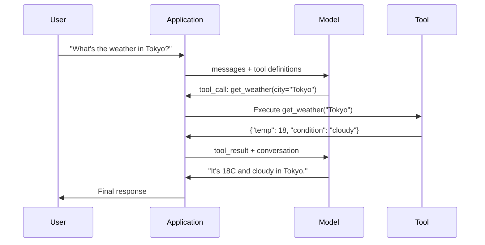

# Função Chamando e ferramenta Usar

> Os LLM não podem fazer nada. Eles geram texto. É toda a capacidade. Não conseguem verificar o tempo, consultar uma base de dados, enviar um e-mail, executar um código ou ler um arquivo. Cada "agente de IA" que já viste é um LLM que gera JSON que diz a função a ligar e o seu código chama-a. O modelo é o cérebro. As ferramentas são as mãos. A chamada de função é o sistema nervoso que as liga.

> **【中文解读】**LLM apenas pode gerar texto. Função de roteiro permite que o modelo saia estruturado JSON.

> **【拓展：Function Calling→MCP与Agent】**Função Calling é o mecanismo central do Agente de IA, o protocolo MCP estándarizou a descrição de ferramentas e o processo de adoção, é o protocolo básico do Claude 生态.

> - Não .**【前置】**O programa é um programa de ensino de base para os estudantes de ensino médio e secundário.

**Type:** Build | **类型:** 构建
**Languages:** Python | **语言:** Python
**Prerequisites:** Phase 11 Lesson 03 (Structured Outputs) | **前置知识:** Phase 11 · 03 (结构化输出)
**Time:** ~75 minutes | **时间:** ~75 分钟
**Related:**Fase 11 · 14 (Modelo Context Protocol)  quando uma ferramenta é compartilhada entre hosts, se graduar da ligação de funções inline para um servidor MCP. Esta lição abrange o caso inline; MCP abrange o caso de protocolo.**相关:**Fase 11 · 14 (模型上下文协议)  Quando os instrumentos precisam ser compartilhados através do sistema de comunicação, a função interna é utilizada para a melhoria de um MCP 服务器──本课讲内联场景;MCP 讲协议场景──

## Objetivos de aprendizagem

- Implementar um loop de chamada de função: definir esquemas de ferramentas, analisar o JSON de chamada de ferramentas do modelo, executar funções e retornar resultados
  实现 função调用循环: define ferramenta schema、解析模型的工具调用 JSON、 executar função并返回结果
- Esquemas de ferramentas de projeto com descrições claras e parâmetros tipografados que o modelo possa invocar de forma confiável
  design com descrição clara e esquema de ferramentas de parâmetros de tipificação, para que o modelo possa ser configurado com confiança
- Construir um loop de agente multi-turn que encadeia várias chamadas de função para responder a consultas complexas
  Construir um agente de rotação  ciclo, cadeia  convocar várias funções para responder a perguntas complexas
- Função de manuseio chamando casos de borda: chamadas paralelas de ferramentas, propagação de erros e prevenção de loops de ferramentas infinitas
  处理函数调用边缘情况:并行工具调用、错误传播和防止无限工具循环

> **【中文解读】**O objetivo do curso é: aprender a utilizar funções (Function Calling) para que o LLM use ferramentas externas.


## O problema é o problema da introdução

Você constrói um chatbot. Um usuário pergunta: "Como está o tempo em Tóquio agora?"

> Você construiu um chatbot.

O modelo responde: "Não tenho acesso a dados meteorológicos em tempo real, mas com base na estação, Tóquio provavelmente está em torno de 15 graus Celsius"...

> O modelo respondeu a uma pergunta sem responsabilidade.

É uma alucinação vestida de um aviso de responsabilidade. O modelo não sabe o tempo. Nunca o vai fazer. O tempo muda a cada hora. Os dados de treinamento do modelo são de meses.

> É um fantasma de imprudência. O modelo não sabe o tempo, nem saberá nunca. O tempo está a mudar a cada hora.

A resposta correta requer ligar para a API OpenWeatherMap, obter a temperatura atual e retornar o número real. O modelo não pode chamar para API. Seu código pode. A peça que falta: um protocolo estruturado que permite que o modelo diga "Eu preciso chamar para a API do tempo com esses argumentos" e permite que seu código execute e reproduzir o resultado.

> O modelo não pode usar a API, seu código pode.

Este é o chamado de função. O modelo produz JSON estruturado descrevendo qual função invocar com quais argumentos. Sua aplicação executa a função. O resultado volta à conversa. O modelo usa o resultado para produzir sua resposta final.

> É o que você quer fazer com o JSON.

Sem o chamado de função, os LLM são enciclopédias.

> Não há função, não há código, não há código, não há código, não há código, não há código, não há código, não há código, não há código, não há código, não há código, não há código, não há código, não há código, não há código, não há código, não há código, não há código, não há código, não há código, não há código, não há código, não há código, não há código, não há código, não há código, não há código, não há código, não há código, não há código, não há código, não há código, não há código, não há código, não há código, não há código, não há código, não há código, não há código, não há código, não há código, não há código, não há código, não há código, não há código, não há código, não há código, não há código, não há código, não há código, não há código.

> - Não .**【类比】**LLM 像一位"嘴强王者"能讲清楚任何概念,但不能动手──函调用就是给这位嘴强王者配一个"小弟"系统:它说"小弟,去查东京天气"→小弟照做→回来报告"18度阴天"→它转述给用户──模型从不离开王座(生成代币),但通过发号施令(JSON) 和接收战报(工具_结果),它可以调用整个外部世界──

## O conceito central.

> **【中文解读】**Função chamada) para que o LLM seja gerado como um recurso de consulta estruturado, em vez de um texto puro e repetido.

> **【拓展：函数调用与 Agent 系统】**Função de OpenAI é utilizada em 2023 lançado, já está apoiado e usado e usado de forma obrigatória.


### A função que chama o ciclo

Cada interação entre ferramentas e uso segue o mesmo ciclo de 5 passos.

> Cada vez que as ferramentas usam a comunicação, seguem o mesmo ciclo de cinco passos.



Passo 1: o utilizador envia uma mensagem. Passo 2: o modelo recebe a mensagem juntamente com as definições da ferramenta (Esquema JSON descrevendo as funções disponíveis). Passo 3: Em vez de responder com texto, o modelo expande uma chamada de ferramenta - um objeto JSON estruturado com o nome da função e os argumentos. Passo 4: o seu código executa a função e capta o resultado. Passo 5: o resultado retorna ao modelo, que agora tem dados reais para produzir a sua resposta final.

> 步骤 1: usuário envia mensagem;. 步骤 2: modelo recebe mensagem e define ferramentas. 步骤 3: modelo não retorna ao texto, mas utiliza ferramentas de saída para um objeto JSON estruturado que contém nomes de funções e parâmetros. 步骤 4: seu código executa a função e capta o resultado. 步骤 5: o resultado retorna ao modelo, o modelo agora tem dados reais para gerar a resposta final.

O modelo nunca executa nada, só decide o que chamar e com que argumentos.

> O modelo nunca executa nada. Ele só decide o que é usado.

> 🤔 **【困惑】**P: Por que o modelo não executa diretamente o código?**隔离** Modelo em caixa fora de execução tem risco de segurança (((delete database、发恶意邮件);分两步让你能在执行前校验──(2) **可观测** executar em seu processo, 能加日志、限流、审计;**可移植**The same model can drive different languages (Python/JS/Go) The same model can drive different languages (Python/JS/Go) The same model can drive different languages (Python/JS/Go) The same model can drive different languages (Python/JS/Go) The same model can drive different languages (Python/JS/Go) The same model can drive different languages (Python/JS/Go) The same model can drive different languages (Python/JS/Go) The same model itself is not tied to the operation) 

### Definições de ferramentas: O contrato de esquema JSON

Cada ferramenta é definida por um esquema JSON que diz ao modelo o que a função faz, quais argumentos requer e quais tipos esses argumentos devem ser.

> Cada ferramenta é definida por JSON Schema, dizendo ao modelo o que esta função faz, aceita o que os parâmetros devem ser tipo.

```json
{
  "type": "function",
  "function": {
    "name": "get_weather",
    "description": "Get current weather for a city. Returns temperature in Celsius and conditions.",
    "parameters": {
      "type": "object",
      "properties": {
        "city": {
          "type": "string",
          "description": "City name, e.g. 'Tokyo' or 'San Francisco'"
        },
        "units": {
          "type": "string",
          "enum": ["celsius", "fahrenheit"],
          "description": "Temperature units"
        }
      },
      "required": ["city"]
    }
  }
}
```

O `description`O modelo lê-os para decidir quando e como usar a ferramenta. Uma descrição vaga como "obtenha tempo" produz uma seleção de ferramentas pior do que "Obter o tempo atual para uma cidade. Retorna a temperatura em Celsius e condições".

> `description`字段至关重要──模型读这些描述来决定何时以及如何使用工具──模糊描述如" obter o clima "produziu um resultado diferente do que "obtenir o clima actual da cidade, retornar a temperatura e a condição climática"──描述本身就是工具选择的提示──

> ️ **【易错点】**工具描述的 3 个坑:(1) **描述太短** "obter dados" Descrição, modelo分不清该用 `get_weather`E também .`get_stock_price`,会乱选;修复: cada descrição pelo menos 30 字,写清"做什么 + 输入 + 输出"――(2) **描述互相重叠**两个工具都写"获取信息",模型选哪个全凭运气;修复:每个描述强调独特场景("获取实时天气" vs "获取历史天气")**隐藏前置条件**比如 `delete_file(path)`需要先 `confirm()`, mas a descrição não diz, o modelo vai ser eliminado diretamente;

### Comparação entre os fornecedores

Todos os principais provedores suportam chamadas de função, mas a superfície da API é diferente.

> Todos os fornecedores principais apoiam a função de rede, mas as interfaces de API são diferentes.

| Provider | API Parameter | Tool Call Format | Parallel Calls | Forced Calling |
|----------|--------------|-----------------|---------------|----------------|
| OpenAI (GPT-5, o4) | `tools` | `tool_calls[].function` | Yes (multiple per turn) | `tool_choice="required"` |
| Anthropic (Claude 4.6/4.7) | `tools` | `content[].type="tool_use"` | Yes (multiple blocks) | `tool_choice={"type":"any"}` |
| Google (Gemini 3) | `function_declarations` | `functionCall` | Yes | `function_calling_config` |
| Open-weight (Llama 4, Qwen3, DeepSeek-V3) | Native `tools` on Llama 4; Hermes or ChatML on others | Mixed | Model-dependent | Prompt-based or `tool_choice` if supported |

Em 2026, os três provedores fechados convergem em formatos baseados em JSON-Schema quase idênticos.`tools`campo que corresponde à forma do OpenAI. As tonalidades de peso aberto ainda variam  o formato Hermes (NousResearch) é o mais comum para tonalidades de terceiros. Para ferramentas compartilhadas entre hosts, prefira MCP (Fase 11 · 14) em vez de chamadas de funções inline  o servidor é o mesmo para todos eles.

> Até 2026, três provedores de fontes fechadas já tendem a ter quase o mesmo formato baseado em JSON Schema.`tools`字段匹配 OpenAI's structure──开源权重微调模型仍然各异Hermes 格式──NousResearch) é o mais comum entre os outros.

### Opção de ferramentas: automática, necessária, específica

Você controla quando o modelo usa ferramentas.

> Você pode controlar o modelo quando usar a ferramenta.

**Auto**(default): o modelo decide se chamar uma ferramenta ou responder diretamente. "O que é 2 + 2?" - responde diretamente. "O que é o tempo?" - chama a ferramenta.
**自动（默认）**O modelo decide se é um instrumento de regulação ou um instrumento de regulação direta.

**Required**O modelo deve chamar pelo menos uma ferramenta. Use esta quando você sabe que a intenção do usuário requer uma ferramenta. Impede o modelo de adivinhar em vez de procurar dados reais.
**必需**O modelo deve pelo menos usar um instrumento. Quando você sabe claramente que o usuário quer usar o instrumento, evite que o modelo não tenha previsão e não busque dados reais.

**Specific function**: forçar o modelo a chamar uma função específica. `tool_choice={"type":"function", "function": {"name": "get_weather"}}`O que é que é necessário para fazer uma rotação?
**特定函数**O modelo de força é o modelo de força.`tool_choice={"type":"function", "function": {"name": "get_weather"}}`A segurança meteorológica é utilizada, independentemente do que seja a consulta.

### Chamadas para funções paralelas

O GPT-4o e o Claude podem chamar várias funções em uma única vez. Um usuário pergunta: "Qual é o tempo em Tóquio e Nova York?" O modelo emitirá duas chamadas de ferramenta simultaneamente:

> GPT-4o 和 Claude pode ser utilizado em várias funções em uma única rodada.

```json
[
  {"name": "get_weather", "arguments": {"city": "Tokyo"}},
  {"name": "get_weather", "arguments": {"city": "New York"}}
]
```

O seu código executa ambos (idealmente simultaneamente), retorna ambos os resultados e o modelo sintetiza uma única resposta. Isso reduz as viagens de ida e volta de 2 para 1. Para agentes com 5-10 chamadas de ferramentas por consulta, chamadas paralelas reduzem a latência em 60-80%.

> Seu código executa duas coisas (o ideal é executar), retorna dois resultados, o modelo é combinado para uma única coisa.

> ️ **【易错点】**Não tenho 2 crateras:**顺序依赖未声明** usuário pergunta "previamente olhe A empresa preço de ações, novamente olhe B empresa", modelo可能并行调用两个 `get_price`Mas não podes garantir que o primeiro regresso .`get_price`工具的描述 写明"用于独立查询",需要顺序时使用 `compare_stocks(A, B)`单工具封装──(2) **共享状态竞争**并行调用 `increment_counter()`两次,结果只增加 1;修复:工具实现里加锁,或让模型串行调用副作用工具──

### Outputes estruturados vs. Função chamada

A lição 03 abrangeu as saídas estruturadas.

> Lição 03 讲了结构化输出―― funções que usam o mesmo mecanismo de JSON Schema, mas com diferentes objetivos―

**Structured outputs**O resultado é o produto final. Exemplo: extrair informações do produto do texto como `{name, price, in_stock}`- Não .
**结构化输出**O modelo de produção é o produto final.`{name, price, in_stock}`- Não.

**Function calling**O modelo declara a intenção de executar uma ação.`get_weather(city="Tokyo")`- o modelo está a pedir uma ação, não a produzir a resposta final.
**函数调用**Modelo declaração executar um movimento intito.`get_weather(city="Tokyo")` modelo em requisito, não produzir resposta final.

Use saídas estruturadas quando quiser extração de dados. Use chamadas de função quando quiser que o modelo interaja com sistemas externos.
Fazer extração de dados com saída estruturada.

### Segurança: Regras não negociaveis

Função chamada é a capacidade mais perigosa que você pode dar a um LLM. O modelo escolhe o que executar. Se o seu conjunto de ferramentas inclui consultas de banco de dados, o modelo constrói as consultas. Se inclui comandos shell, o modelo as escreve.

> Função调用是你赋予LLM 最危险的能力――模型决定执行什么―― Se seu conjunto de ferramentas contém uma consulta de base de dados, o modelo irá construir uma consulta语句―― Se contém um shell 命令, o modelo vai escrever uma ordem――

**Rule 1: Never pass model-generated SQL directly to a database.**O modelo pode e gerará DROP TABLE, injeções UNION ou consultas que retornam cada linha. Sempre parametrize. sempre valida. sempre use uma lista de operações.
**规则 1：永远不要把模型生成的 SQL 直接传给数据库。**模型会(也会) generar DROP TABLE、UNION 注入或返回所有者的查询──始终参数化──始终校验──始终使用操作白名单──

**Rule 2: Allowlist functions.**O modelo só pode chamar funções que você define explicitamente. Nunca construa uma ferramenta genérica "executar qualquer função por nome". Se você tem 50 funções internas, expor apenas as 5 necessárias para o usuário.
**规则 2：函数白名单。**模型只能调用你明确义的函数―― nunca faça uso comum de "按名执行任意函数" ferramenta―― Se houver 50 funções internas, apenas expõe 5 das necessidades do usuário―

**Rule 3: Validate arguments.**O modelo pode passar por um nome de cidade de`"; DROP TABLE users; --"`. Validar todos os argumentos contra os tipos, intervalos e formatos esperados antes da execução.
**规则 3：校验参数。**模型可能传入 `"; DROP TABLE users; --"`作为城市名──执行前对照期望的类型、范围和形式校验每个参数──

**Rule 4: Sanitize tool results.**Se uma ferramenta retorna dados sensíveis (chaves API, PII, erros internos), filtrá-los antes de enviá-los de volta ao modelo.
**规则 4：净化工具结果。**Se o instrumento retornar dados sensíveis (API 密钥、PII、内部错误), o modelo será enviado para o outro lado.

**Rule 5: Rate limit tool calls.**Um modelo em um loop pode chamar ferramentas centenas de vezes. Defina um máximo (10-20 chamadas por conversa é razoável).
**规则 5：限流工具调用。**O modelo no ciclo pode ser usado várias vezes.

> ️ **【易错点】**循环失控的实战案例: modelo调 `get_weather("Tokyo")`→东京返回 "chuva"→模型"觉得不对"→再调一次→还是雨→继续调... 5 分钟烧了200次调用──修复:(1) 全局 `max_tool_calls=20`计计器,超越即终止;(2) Continuous调用 of the same parameter tools,3 次后强制跳出;(3) Used Phase 15·13 监控 token 消耗,超值杀开;;

### Manutenção de erros

As ferramentas falham, as APIs ficam sem tempo, os bancos de dados caem, os arquivos não existem, o modelo precisa saber quando uma ferramenta falha e porquê.

> 工具会失败──API 会超时──数据库会机──文件不存在──模型需要知道工具何时失败以及为什么失败──

Retorno de erros como resultados de ferramentas estruturadas, não exceções:

> Returnar erros como resultado de ferramentas estruturadas, não deixe as coisas estranhas:

```json
{
  "error": true,
  "message": "City 'Toky' not found. Did you mean 'Tokyo'?",
  "code": "CITY_NOT_FOUND"
}
```

O modelo lê isso, ajusta seus argumentos e retrata. Os modelos são bons em auto-corrigir mensagens de erro estruturadas.

> 模型读这个,调整参数重试―― modelo é bom em auto-corrigir em informações erradas estruturadas―― mas não é bom em recuperar em erros de "out error" de空响应或泛化――

> 🤔 **【困惑】**P: Por que não colocar as coisas em ordem para que as pessoas tentem ou não tratem? A: Porque colocar as coisas em ordem para que o agente se encontre em um erro, o modelo nunca vai ver o erro, ele não sabe se o instrumento falhou, vai pensar que o resultado será o resultado final da análise.`"error": true`E decidiu o próximo passo: mudar o parâmetro, tentar novamente, mudar as ferramentas, ou realmente dizer ao usuário "Eu não faço isso".

### MCP: Modelo de protocolo de contexto

MCP é o padrão aberto da Anthropic para a interoperabilidade de ferramentas. Em vez de cada aplicação definir suas próprias ferramentas, MCP fornece um protocolo universal: as ferramentas são servidas por servidores MCP, consumidas por clientes MCP (como Claude Code, Cursor ou seu aplicativo).

> MCP é um padrão aberto da Antropic, usado para ferramentas de interação. MCP fornece um protocolo geral: ferramentas fornecidas pelo servidor MCP, por clientes do MCP (como o Claude Code, o Cursor ou a sua aplicação) consome, e não por cada aplicação define suas próprias ferramentas.

Um servidor MCP pode expor ferramentas a qualquer cliente compatível. Um servidor Postgres MCP dá acesso a qualquer banco de dados de agentes compatíveis com MCP. Um servidor GitHub MCP dá acesso ao repositório de qualquer agente. As ferramentas são definidas uma vez, usadas em todos os lugares.

> Um MCP  servidor pode ser usado para qualquer um dos clientes de exposição de ferramentas.

O MCP é para ligar o que HTTP é para rede.

> MCP 之于函数调用, assim como HTTP 之于网络── é padronização da camada de transmissão, fazendo com que os instrumentos se tornem portáveis──

> - Não .**【前置】**Qual é a razão pela qual o sistema de controle de dados é um sistema de controle de dados de dados de dados de dados de dados de dados de dados de dados de dados de dados de dados de dados de dados de dados de dados de dados de dados de dados de dados de dados de dados de dados de dados de dados de dados de dados de dados de dados de dados de dados de dados de dados de dados de dados de dados de dados de dados de dados de dados de dados de dados de dados de dados de dados de dados de dados de dados de dados de dados de dados de dados de dados de dados de dados de dados de dados de dados de dados de dados de dados de dados de dados de dados de dados de dados de dados de dados de dados de dados de dados de dados de dados de dados de dados de dados de dados de dados de dados de dados de dados de dados de dados de dados de dados de dados de dados de dados de dados de dados de dados de dados de dados de dados de dados de dados de dados de dados de dados de dados de dados de dados de dados de dados de dados de dados de dados de dados de dados de dados de dados de dados de dados de dados de dados de dados de dados de dados de dados de dados de dados de dados de dados de dados de dados de dados de dados de dados de dados de dados de dados de dados de dados de dados de dados de dados de dados de dados de dados de dados de dados de dados de dados de dados de dados de dados de dados de dados de dados de dados de dados de dados de dados de dados de dados de dados de dados de dados de dados de dados de dados de dados de dados de dados de dados de dados de dados de dados de dados de dados de dados de dados de dados de dados de dados de dados de dados de dados de dados de dados de dados de dados de dados de dados de dados de dados de dados de dados de dados de dados de dados de dados de dados de dados de dados de dados de dados de dados de dados de dados de dados de dados de dados de dados de dados de dados de dados de dados de dados de dados de dados de dados de dados de dados de dados de dados de dados de dados de dados de dados de dados de dados de dados de dados de dados de dados de dados de dados de dados de dados de dados de dados de dados de dados de dados de dados de dados de dados de dados de dados de dados de dados de dados de dados de dados de dados de dados de

## Construí-lo e realizei-o.
```figure
mx-tool-call-loop
```

## Construí-lo

### Passo 1: Definir o Registro de Ferramentas

Construir um registo que armazene as definições de ferramentas e suas implementações. Cada ferramenta tem uma definição de JSON Schema (o que o modelo vê) e uma função Python (o que seu código executa).

> 构建注册表存储工具定义和实现──每个工具有一个JSON Schema定义(模型看的) 和一个Python 函数(你的代码执行的)──

```python
import json
import math
import time
import hashlib


TOOL_REGISTRY = {}


def register_tool(name, description, parameters, function):
    TOOL_REGISTRY[name] = {
        "definition": {
            "type": "function",
            "function": {
                "name": name,
                "description": description,
                "parameters": parameters,
            },
        },
        "function": function,
    }
```

### Passo 2: Implementar 5 Ferramentas

Construa uma calculadora, pesquisa do tempo, simulador de pesquisa na web, leitor de arquivos e executor de código.

> Construir calculador, pesquisa de clima, busca de rede, analista de documentos e operador de códigos.

```python
def calculator(expression, precision=2):
    allowed = set("0123456789+-*/.() ")
    if not all(c in allowed for c in expression):
        return {"error": True, "message": f"Invalid characters in expression: {expression}"}
    try:
        result = eval(expression, {"__builtins__": {}}, {"math": math})
        return {"result": round(float(result), precision), "expression": expression}
    except Exception as e:
        return {"error": True, "message": str(e)}


WEATHER_DB = {
    "tokyo": {"temp_c": 18, "condition": "cloudy", "humidity": 72, "wind_kph": 14},
    "new york": {"temp_c": 22, "condition": "sunny", "humidity": 45, "wind_kph": 8},
    "london": {"temp_c": 12, "condition": "rainy", "humidity": 88, "wind_kph": 22},
    "san francisco": {"temp_c": 16, "condition": "foggy", "humidity": 80, "wind_kph": 18},
    "sydney": {"temp_c": 25, "condition": "sunny", "humidity": 55, "wind_kph": 10},
}


def get_weather(city, units="celsius"):
    key = city.lower().strip()
    if key not in WEATHER_DB:
        suggestions = [c for c in WEATHER_DB if c.startswith(key[:3])]
        return {
            "error": True,
            "message": f"City '{city}' not found.",
            "suggestions": suggestions,
            "code": "CITY_NOT_FOUND",
        }
    data = WEATHER_DB[key].copy()
    if units == "fahrenheit":
        data["temp_f"] = round(data["temp_c"] * 9 / 5 + 32, 1)
        del data["temp_c"]
    data["city"] = city
    return data


SEARCH_DB = {
    "python function calling": [
        {"title": "OpenAI Function Calling Guide", "url": "https://platform.openai.com/docs/guides/function-calling", "snippet": "Learn how to connect LLMs to external tools."},
        {"title": "Anthropic Tool Use", "url": "https://docs.anthropic.com/en/docs/tool-use", "snippet": "Claude can interact with external tools and APIs."},
    ],
    "MCP protocol": [
        {"title": "Model Context Protocol", "url": "https://modelcontextprotocol.io", "snippet": "An open standard for connecting AI models to data sources."},
    ],
    "weather API": [
        {"title": "OpenWeatherMap API", "url": "https://openweathermap.org/api", "snippet": "Free weather API with current, forecast, and historical data."},
    ],
}


def web_search(query, max_results=3):
    key = query.lower().strip()
    for db_key, results in SEARCH_DB.items():
        if db_key in key or key in db_key:
            return {"query": query, "results": results[:max_results], "total": len(results)}
    return {"query": query, "results": [], "total": 0}


FILE_SYSTEM = {
    "data/config.json": '{"model": "gpt-4o", "temperature": 0.7, "max_tokens": 4096}',
    "data/users.csv": "name,email,role\nAlice,alice@example.com,admin\nBob,bob@example.com,user",
    "README.md": "# My Project\nA tool-use agent built from scratch.",
}


def read_file(path):
    if ".." in path or path.startswith("/"):
        return {"error": True, "message": "Path traversal not allowed.", "code": "FORBIDDEN"}
    if path not in FILE_SYSTEM:
        available = list(FILE_SYSTEM.keys())
        return {"error": True, "message": f"File '{path}' not found.", "available_files": available, "code": "NOT_FOUND"}
    content = FILE_SYSTEM[path]
    return {"path": path, "content": content, "size_bytes": len(content), "lines": content.count("\n") + 1}


def run_code(code, language="python"):
    if language != "python":
        return {"error": True, "message": f"Language '{language}' not supported. Only 'python' is available."}
    forbidden = ["import os", "import sys", "import subprocess", "exec(", "eval(", "__import__", "open("]
    for pattern in forbidden:
        if pattern in code:
            return {"error": True, "message": f"Forbidden operation: {pattern}", "code": "SECURITY_VIOLATION"}
    try:
        local_vars = {}
        exec(code, {"__builtins__": {"print": print, "range": range, "len": len, "str": str, "int": int, "float": float, "list": list, "dict": dict, "sum": sum, "min": min, "max": max, "abs": abs, "round": round, "sorted": sorted, "enumerate": enumerate, "zip": zip, "map": map, "filter": filter, "math": math}}, local_vars)
        result = local_vars.get("result", None)
        return {"success": True, "result": result, "variables": {k: str(v) for k, v in local_vars.items() if not k.startswith("_")}}
    except Exception as e:
        return {"error": True, "message": f"{type(e).__name__}: {e}"}
```

### Passo 3: Registre todas as ferramentas

> Registrar todas as ferramentas.

```python
def register_all_tools():
    register_tool(
        "calculator", "Evaluate a mathematical expression. Supports +, -, *, /, parentheses, and decimals. Returns the numeric result.",
        {"type": "object", "properties": {"expression": {"type": "string", "description": "Math expression, e.g. '(10 + 5) * 3'"}, "precision": {"type": "integer", "description": "Decimal places in result", "default": 2}}, "required": ["expression"]},
        calculator,
    )
    register_tool(
        "get_weather", "Get current weather for a city. Returns temperature, condition, humidity, and wind speed.",
        {"type": "object", "properties": {"city": {"type": "string", "description": "City name, e.g. 'Tokyo' or 'San Francisco'"}, "units": {"type": "string", "enum": ["celsius", "fahrenheit"], "description": "Temperature units, defaults to celsius"}}, "required": ["city"]},
        get_weather,
    )
    register_tool(
        "web_search", "Search the web for information. Returns a list of results with title, URL, and snippet.",
        {"type": "object", "properties": {"query": {"type": "string", "description": "Search query"}, "max_results": {"type": "integer", "description": "Maximum results to return", "default": 3}}, "required": ["query"]},
        web_search,
    )
    register_tool(
        "read_file", "Read the contents of a file. Returns the file content, size, and line count.",
        {"type": "object", "properties": {"path": {"type": "string", "description": "Relative file path, e.g. 'data/config.json'"}}, "required": ["path"]},
        read_file,
    )
    register_tool(
        "run_code", "Execute Python code in a sandboxed environment. Set a 'result' variable to return output.",
        {"type": "object", "properties": {"code": {"type": "string", "description": "Python code to execute"}, "language": {"type": "string", "enum": ["python"], "description": "Programming language"}}, "required": ["code"]},
        run_code,
    )
```

### Passo 4: Construa a função chamada Loop

Este é o motor central. Simula o modelo, decide qual ferramenta chamar, executa a ferramenta e reencaminha os resultados.

> É o motor central. É o modelo que decide qual ferramenta usar.

```python
def simulate_model_decision(user_message, tools, conversation_history):
    msg = user_message.lower()

    if any(word in msg for word in ["weather", "temperature", "forecast"]):
        cities = []
        for city in WEATHER_DB:
            if city in msg:
                cities.append(city)
        if not cities:
            for word in msg.split():
                if word.capitalize() in [c.title() for c in WEATHER_DB]:
                    cities.append(word)
        if not cities:
            cities = ["tokyo"]
        calls = []
        for city in cities:
            calls.append({"name": "get_weather", "arguments": {"city": city.title()}})
        return calls

    if any(word in msg for word in ["calculate", "compute", "math", "what is", "how much"]):
        for token in msg.split():
            if any(c in token for c in "+-*/"):
                return [{"name": "calculator", "arguments": {"expression": token}}]
        if "+" in msg or "-" in msg or "*" in msg or "/" in msg:
            expr = "".join(c for c in msg if c in "0123456789+-*/.() ")
            if expr.strip():
                return [{"name": "calculator", "arguments": {"expression": expr.strip()}}]
        return [{"name": "calculator", "arguments": {"expression": "0"}}]

    if any(word in msg for word in ["search", "find", "look up", "google"]):
        query = msg.replace("search for", "").replace("look up", "").replace("find", "").strip()
        return [{"name": "web_search", "arguments": {"query": query}}]

    if any(word in msg for word in ["read", "file", "open", "cat", "show"]):
        for path in FILE_SYSTEM:
            if path.split("/")[-1].split(".")[0] in msg:
                return [{"name": "read_file", "arguments": {"path": path}}]
        return [{"name": "read_file", "arguments": {"path": "README.md"}}]

    if any(word in msg for word in ["run", "execute", "code", "python"]):
        return [{"name": "run_code", "arguments": {"code": "result = 'Hello from the sandbox!'", "language": "python"}}]

    return []


def execute_tool_call(tool_call):
    name = tool_call["name"]
    args = tool_call["arguments"]

    if name not in TOOL_REGISTRY:
        return {"error": True, "message": f"Unknown tool: {name}", "code": "UNKNOWN_TOOL"}

    tool = TOOL_REGISTRY[name]
    func = tool["function"]
    start = time.time()

    try:
        result = func(**args)
    except TypeError as e:
        result = {"error": True, "message": f"Invalid arguments: {e}"}

    elapsed_ms = round((time.time() - start) * 1000, 2)
    return {"tool": name, "result": result, "execution_time_ms": elapsed_ms}


def run_function_calling_loop(user_message, max_iterations=5):
    conversation = [{"role": "user", "content": user_message}]
    tool_definitions = [t["definition"] for t in TOOL_REGISTRY.values()]
    all_tool_results = []

    for iteration in range(max_iterations):
        tool_calls = simulate_model_decision(user_message, tool_definitions, conversation)

        if not tool_calls:
            break

        results = []
        for call in tool_calls:
            result = execute_tool_call(call)
            results.append(result)

        conversation.append({"role": "assistant", "content": None, "tool_calls": tool_calls})

        for result in results:
            conversation.append({"role": "tool", "content": json.dumps(result["result"]), "tool_name": result["tool"]})

        all_tool_results.extend(results)
        break

    return {"conversation": conversation, "tool_results": all_tool_results, "iterations": iteration + 1 if tool_calls else 0}
```

### Passo 5: Validação do argumento

Construir um validador que verifica argumentos de chamada de ferramenta contra o JSON Schema antes da execução.

> Construir um testador de dados, em execução, em execução, em execução, em execução, em execução, em execução, em execução, em execução, em execução, em execução, em execução, em execução, em execução, em execução, em execução, em execução, em execução, em execução, em execução, em execução, em execução, em execução, em execução, em execução, em execução, em execução, em execução, em execução, em execução, em execução, em execução, em execução, em execução, em execução, em execução, em execução, em execução, em execução, em execução, em execução, em execução, em execução, em execução, em execução, em execução, em execução, em execução, em execução, em execução, em execução, em execução, em execução, em execução, em execução, em execução, em execução, em execução, em execução, em execução, em execução, em execução, em execução, em execução, em execução, em execução, em execução, em execução, em execução, em execução, em execução, em execução, em execução, em execução, em execução, em conformidade com o executado, em conformidade com o executado, em conformidade com o JSON Schema, em conformidade com o JSON, em conformidade com o JSON, em conformidade com o JSON, em conformidade com o JSON, em conformidade com o JSON, em conformidade com o JSON, em conformidade com o JSON, em conformidade com o JSON, em conformidade com o JSON, em conformidade com o JSON, em conformidade com o JSON, em conformidade com o JSON, em conformidade com o JSON, em conformidade com o JSON, em conformidade com o JSON, em conformidade com o JSON, em conformidade com o JSON, em conformidade com o JSON, em conformidade com o JSON, em conformidade com o JSON, em conformidade com o JSON, é.

```python
def validate_tool_arguments(tool_name, arguments):
    if tool_name not in TOOL_REGISTRY:
        return [f"Unknown tool: {tool_name}"]

    schema = TOOL_REGISTRY[tool_name]["definition"]["function"]["parameters"]
    errors = []

    if not isinstance(arguments, dict):
        return [f"Arguments must be an object, got {type(arguments).__name__}"]

    for required_field in schema.get("required", []):
        if required_field not in arguments:
            errors.append(f"Missing required argument: {required_field}")

    properties = schema.get("properties", {})
    for arg_name, arg_value in arguments.items():
        if arg_name not in properties:
            errors.append(f"Unknown argument: {arg_name}")
            continue

        prop_schema = properties[arg_name]
        expected_type = prop_schema.get("type")

        type_checks = {"string": str, "integer": int, "number": (int, float), "boolean": bool, "array": list, "object": dict}
        if expected_type in type_checks:
            if not isinstance(arg_value, type_checks[expected_type]):
                errors.append(f"Argument '{arg_name}': expected {expected_type}, got {type(arg_value).__name__}")

        if "enum" in prop_schema and arg_value not in prop_schema["enum"]:
            errors.append(f"Argument '{arg_name}': '{arg_value}' not in {prop_schema['enum']}")

    return errors
```

### Passo 6: Execute a demonstração

> - Não, não.

```python
def run_demo():
    register_all_tools()

    print("=" * 60)
    print("  Function Calling & Tool Use Demo")
    print("=" * 60)

    print("\n--- Registered Tools ---")
    for name, tool in TOOL_REGISTRY.items():
        desc = tool["definition"]["function"]["description"][:60]
        params = list(tool["definition"]["function"]["parameters"].get("properties", {}).keys())
        print(f"  {name}: {desc}...")
        print(f"    params: {params}")

    print(f"\n--- Argument Validation ---")
    validation_tests = [
        ("get_weather", {"city": "Tokyo"}, "Valid call"),
        ("get_weather", {}, "Missing required arg"),
        ("get_weather", {"city": "Tokyo", "units": "kelvin"}, "Invalid enum value"),
        ("calculator", {"expression": 123}, "Wrong type (int for string)"),
        ("unknown_tool", {"x": 1}, "Unknown tool"),
    ]
    for tool_name, args, label in validation_tests:
        errors = validate_tool_arguments(tool_name, args)
        status = "VALID" if not errors else f"ERRORS: {errors}"
        print(f"  {label}: {status}")

    print(f"\n--- Tool Execution ---")
    direct_tests = [
        {"name": "calculator", "arguments": {"expression": "(10 + 5) * 3 / 2"}},
        {"name": "get_weather", "arguments": {"city": "Tokyo"}},
        {"name": "get_weather", "arguments": {"city": "Mars"}},
        {"name": "web_search", "arguments": {"query": "python function calling"}},
        {"name": "read_file", "arguments": {"path": "data/config.json"}},
        {"name": "read_file", "arguments": {"path": "../etc/passwd"}},
        {"name": "run_code", "arguments": {"code": "result = sum(range(1, 101))"}},
        {"name": "run_code", "arguments": {"code": "import os; os.system('rm -rf /')"}},
    ]
    for call in direct_tests:
        result = execute_tool_call(call)
        print(f"\n  {call['name']}({json.dumps(call['arguments'])})")
        print(f"    -> {json.dumps(result['result'], indent=None)[:100]}")
        print(f"    time: {result['execution_time_ms']}ms")

    print(f"\n--- Full Function Calling Loop ---")
    test_queries = [
        "What's the weather in Tokyo?",
        "Calculate (100 + 250) * 0.15",
        "Search for MCP protocol",
        "Read the config file",
        "Run some Python code",
        "Tell me a joke",
    ]
    for query in test_queries:
        print(f"\n  User: {query}")
        result = run_function_calling_loop(query)
        if result["tool_results"]:
            for tr in result["tool_results"]:
                print(f"    Tool: {tr['tool']} ({tr['execution_time_ms']}ms)")
                print(f"    Result: {json.dumps(tr['result'], indent=None)[:90]}")
        else:
            print(f"    [No tool called -- direct response]")
        print(f"    Iterations: {result['iterations']}")

    print(f"\n--- Parallel Tool Calls ---")
    multi_city_query = "What's the weather in tokyo and london?"
    print(f"  User: {multi_city_query}")
    result = run_function_calling_loop(multi_city_query)
    print(f"  Tool calls made: {len(result['tool_results'])}")
    for tr in result["tool_results"]:
        city = tr["result"].get("city", "unknown")
        temp = tr["result"].get("temp_c", "N/A")
        print(f"    {city}: {temp}C, {tr['result'].get('condition', 'N/A')}")

    print(f"\n--- Security Checks ---")
    security_tests = [
        ("read_file", {"path": "../../etc/passwd"}),
        ("run_code", {"code": "import subprocess; subprocess.run(['ls'])"}),
        ("calculator", {"expression": "__import__('os').system('ls')"}),
    ]
    for tool_name, args in security_tests:
        result = execute_tool_call({"name": tool_name, "arguments": args})
        blocked = result["result"].get("error", False)
        print(f"  {tool_name}({list(args.values())[0][:40]}): {'BLOCKED' if blocked else 'ALLOWED'}")
```

## Use-o com o framework implementado.

### Chamadas de função OpenAI

> OpenAI 函数调用──

```python
# from openai import OpenAI
#
# client = OpenAI()
#
# tools = [{
#     "type": "function",
#     "function": {
#         "name": "get_weather",
#         "description": "Get current weather for a city",
#         "parameters": {
#             "type": "object",
#             "properties": {
#                 "city": {"type": "string"},
#                 "units": {"type": "string", "enum": ["celsius", "fahrenheit"]}
#             },
#             "required": ["city"]
#         }
#     }
# }]
#
# response = client.chat.completions.create(
#     model="gpt-4o",
#     messages=[{"role": "user", "content": "Weather in Tokyo?"}],
#     tools=tools,
#     tool_choice="auto",
# )
#
# tool_call = response.choices[0].message.tool_calls[0]
# args = json.loads(tool_call.function.arguments)
# result = get_weather(**args)
#
# final = client.chat.completions.create(
#     model="gpt-4o",
#     messages=[
#         {"role": "user", "content": "Weather in Tokyo?"},
#         response.choices[0].message,
#         {"role": "tool", "tool_call_id": tool_call.id, "content": json.dumps(result)},
#     ],
# )
# print(final.choices[0].message.content)
```

O OpenAI retorna as chamadas de ferramenta como `response.choices[0].message.tool_calls`Cada chamada tem um número .`id`O modelo usa este ID para combinar os resultados com chamadas. GPT-4o pode retornar várias chamadas de ferramenta em uma única resposta - iterar e executar todas elas.

> OpenAI Colocar ferramentas como`response.choices[0].message.tool_calls`返回── cada um está a usar `id`, retornar o resultado quando deve incluir. Modelo usar este ID Colocar o resultado em conformidade com o uso. GPT-4o pode ser usado em várias ferramentas em uma única resposta para o uso.

### Utilização de Ferramentas Antropicas

> Antropic 工具使用──

```python
# import anthropic
#
# client = anthropic.Anthropic()
#
# response = client.messages.create(
#     model="claude-sonnet-5",
#     max_tokens=1024,
#     tools=[{
#         "name": "get_weather",
#         "description": "Get current weather for a city",
#         "input_schema": {
#             "type": "object",
#             "properties": {
#                 "city": {"type": "string"},
#                 "units": {"type": "string", "enum": ["celsius", "fahrenheit"]}
#             },
#             "required": ["city"]
#         }
#     }],
#     messages=[{"role": "user", "content": "Weather in Tokyo?"}],
# )
#
# tool_block = next(b for b in response.content if b.type == "tool_use")
# result = get_weather(**tool_block.input)
#
# final = client.messages.create(
#     model="claude-sonnet-5",
#     max_tokens=1024,
#     tools=[...],
#     messages=[
#         {"role": "user", "content": "Weather in Tokyo?"},
#         {"role": "assistant", "content": response.content},
#         {"role": "user", "content": [{"type": "tool_result", "tool_use_id": tool_block.id, "content": json.dumps(result)}]},
#     ],
# )
```

Antropic retorna as chamadas de ferramenta como blocos de conteúdo com `type: "tool_use"`. O resultado da ferramenta vai em uma mensagem do usuário com `type: "tool_result"`Observe a diferença fundamental: usos antropológicos `input_schema`para definições de parâmetros de ferramentas, enquanto o OpenAI usa `parameters`- Não .

> Antropic 把工具调用作为 `type: "tool_use"`O conteúdo do bloco de retorno.`type: "tool_result"`█████████████████████████████████████████████████████████████████████████████████████████████████████████████████████████████████████████████████████████████████████████████████████████████████████████████████████████████████████████████████████████████████████████████████████████████████████████████████████████████████████████████████████████████████████████████████████████████████████████████████████████████████████████████████████████████████████████████████████████████████████████████████████████████`input_schema`定义工具参数,OpenAI 用 `parameters`- Não.

### Integração dos MCP

> MCP 集成──

```python
# MCP servers expose tools over a standardized protocol.
# Any MCP-compatible client can discover and call these tools.
#
# Example: connecting to a Postgres MCP server
#
# from mcp import ClientSession, StdioServerParameters
# from mcp.client.stdio import stdio_client
#
# server_params = StdioServerParameters(
#     command="npx",
#     args=["-y", "@modelcontextprotocol/server-postgres", "postgresql://localhost/mydb"],
# )
#
# async with stdio_client(server_params) as (read, write):
#     async with ClientSession(read, write) as session:
#         await session.initialize()
#         tools = await session.list_tools()
#         result = await session.call_tool("query", {"sql": "SELECT count(*) FROM users"})
```

O MCP descopla a implementação de ferramentas do consumo de ferramentas. O servidor Postgres conhece SQL. O servidor GitHub conhece a API. Seu agente apenas descobre e chama as ferramentas - não precisa de código específico do provedor para cada integração.

> MCP 解了工具实现和工具消费──Postgres 服务器懂 SQL──GitHub 服务器懂 API── Seu agente só precisa encontrar e utilizar ferramentas不需要为每个集成写提供商特定代码──

## Envia-o . Produto .

Esta lição produz`outputs/prompt-tool-designer.md`-- um modelo de prompt reutilizável para projetar definições de ferramentas. Dê-lhe uma descrição do que você quer que uma ferramenta faça, e ele produz a definição completa do JSON Schema com descrições, tipos e restrições.

> 本课产 出 `outputs/prompt-tool-designer.md` design tool defined de replicable tip模板── dá-lhe uma descrição do que o instrumento faz, ele produz um esquema JSON completo 定义(含描述、类型和约束)──

Também produz `outputs/skill-function-calling-patterns.md`- um quadro de decisão para a implementação de funções de chamada na produção, abrangendo o design de ferramentas, o tratamento de erros, a segurança e os padrões específicos do fornecedor.

> Outro produto`outputs/skill-function-calling-patterns.md` estrutura de decisão de implementação de funções de ambiente de produção, abrangendo o design de ferramentas, o tratamento de erros, a segurança e o modo específico do fornecedor.

## Exercícios.

1. **Add a 6th tool: database query.**Implementar uma ferramenta SQL simulada com uma tabela em memória. A ferramenta aceita um nome de tabela e condições de filtro (não SQL bruto). Validar que o nome da tabela está em uma lista de permisos e que os operadores de filtro são restritos a `=`- Não .`>`- Não .`<`- Não .`>=`- Não .`<=`Retorna as linhas correspondentes como JSON.
   **添加第 6 个工具：数据库查询。**Utilize内存表实现模拟 SQL 工具──工具接受表名和过条件( não é o SQL original)──校验表名在白名单中、过操作符限定为`=`- Não.`>`- Não.`<`- Não.`>=`- Não.`<=`                                                                                                                                                                                                                                                              

2. **Implement retry with error feedback.**Quando uma chamada de ferramenta falhar (por exemplo, cidade não encontrada), envie a mensagem de erro de volta para a função de decisão do modelo e deixe que ele corrija seus argumentos.
   **实现带错误反馈的重试。**Quando o instrumento é usado para falhar (como não encontrar) quando o erro é usado para fazer o erro, o erro é feito para corrigir o problema.

3. **Build a multi-step agent.**Algumas consultas exigem chamadas de ferramentas de cadeia: "Leia o arquivo de configuração e diga-me qual o modelo é configurado, e depois procure na web para o preço desse modelo". Implemente um ciclo que corre até que o modelo decida que não são necessários mais ferramentas, passando os resultados acumulados em cada etapa de decisão. Limite a 10 iterações para evitar loops infinitos.
   **构建多步 agent。**Algumas consultas precisam de ferramentas de configuração em cadeia: "leia o documento de configuração me diga qual modelo foi configurado, e depois busque o preço do modelo na rede". Realize o ciclo, execute até que o modelo decide não precisar de ferramentas, transfira os resultados acumulados para cada decisão.

4. **Measure tool selection accuracy.**Crie 30 consultas de teste com nomes de ferramentas esperados. Execute a função de decisão em todas as 30 e mensure qual porcentagem do tempo ela seleciona a ferramenta correta. Identifique quais consultas causam mais confusão entre as ferramentas.
   **测量工具选择准确率。**                                                                                                                                                                                                                                                                                                                                                                                                                                                                                                                             

5. **Implement tool call caching.**Se a mesma ferramenta for chamada com argumentos idênticos dentro de 60 segundos, retorne o resultado em cache em vez de re-executar. Use um dicionário com tecla de `(tool_name, frozenset(args.items()))`Meter as taxas de cache em uma conversa com 20 consultas.
   **实现工具调用缓存。**60 segundos em que se o mesmo instrumento for usado com o mesmo parâmetro, retorne o resultado do cache em vez de re-executar.`(tool_name, frozenset(args.items()))`Por exemplo, a taxa de mortalidade de um homem é de 20%.

## Termos-chave .

| Term | What people say | What it actually means | 中文释义 |
|------|----------------|----------------------|---------|
| Function calling | "Tool use" | The model outputs structured JSON describing a function to invoke with specific arguments -- your code executes it, not the model | 函数调用：模型输出结构化 JSON 描述要调用的函数及参数——你的代码执行，而非模型 |
| Tool definition | "Function schema" | A JSON Schema object describing a tool's name, purpose, parameters, and types -- the model reads this to decide when and how to use the tool | 工具定义：JSON Schema 描述工具名、用途、参数和类型——模型读它决定何时如何使用 |
| Tool choice | "Calling mode" | Controls whether the model must call a tool (required), may call a tool (auto), or must call a specific tool (named) | 工具选择：控制模型必须调用（required）、可以调用（auto）或必须调用特定工具（named） |
| Parallel calling | "Multi-tool" | The model outputs multiple tool calls in a single turn, reducing round trips -- GPT-4o and Claude both support this | 并行调用：模型单轮内输出多个工具调用，减少往返——GPT-4o 和 Claude 都支持 |
| Tool result | "Function output" | The return value from executing a tool, sent back to the model as a message so it can use real data in its response | 工具结果：执行工具的返回值，作为消息送回模型，让其在回复中使用真实数据 |
| Argument validation | "Input checking" | Verifying that model-generated arguments match the expected types, ranges, and constraints before executing the tool | 参数校验：执行前验证模型生成的参数是否匹配期望的类型、范围和约束 |
| MCP | "Tool protocol" | Model Context Protocol -- Anthropic's open standard for exposing tools via servers that any compatible client can discover and call | MCP：模型上下文协议——Anthropic 开放标准，通过服务器暴露工具，任何兼容客户端可发现和调用 |
| Agent loop | "ReAct loop" | The iterative cycle of model-decides-tool, code-executes-tool, result-feeds-back until the model has enough information to respond | Agent 循环：模型决定-代码执行-结果反馈的迭代循环，直到模型有足够信息回复 |
| Tool poisoning | "Prompt injection via tools" | An attack where tool results contain instructions that manipulate the model's behavior -- sanitize all tool outputs | 工具投毒：工具结果含操纵模型行为的指令的攻击——净化所有工具输出 |
| Rate limiting | "Call budget" | Setting a maximum number of tool calls per conversation to prevent infinite loops and runaway API costs | 限流：设每次对话工具调用上限，防无限循环和失控 API 成本 |

## Mais leitura 延伸阅读

- [OpenAI Function Calling Guide](https://platform.openai.com/docs/guides/function-calling)-- a referência definitiva para o uso de ferramentas com o GPT-4o, incluindo chamadas paralelas, chamadas forçadas e argumentos estruturados
  OpenAI  função de regulação   ferramenta  ferramenta  autoridade de utilização Referência, incluindo
- [Anthropic Tool Use Guide](https://docs.anthropic.com/en/docs/tool-use)-- A ferramenta de Claude usa implementação com input_schema, respostas multi-tool e configuração de tool_choice
  Antropic 工具使用指南Claude 工具使用实现,含 input_schema、多工具响应和 tool_choice 配置
- [Model Context Protocol Specification](https://modelcontextprotocol.io)-- o padrão aberto para a interoperabilidade das ferramentas em aplicações de IA, com arquitetura servidor/cliente
  模型上下文协议规范AI 应用间工具互操作的开放标准, adoção de uma estrutura de servidor/client
- [Schick et al., 2023 -- "Toolformer: Language Models Can Teach Themselves to Use Tools"](https://arxiv.org/abs/2302.04761)- o documento de base sobre a formação dos MLL para decidir quando e como chamar instrumentos externos
  Schick 等 2023 "Toolformer" Training LLM decide HOW HOW to mobilize ferramentas externas
- [Patil et al., 2023 -- "Gorilla: Large Language Model Connected with Massive APIs"](https://arxiv.org/abs/2305.15334)-- sintonização de LLM para chamadas precisas de API em 1.645 API com redução de alucinações
  Patil 等 2023 "Gorilla"微调 LLM em 1645  API 上准调并减少幻觉
- [Berkeley Function Calling Leaderboard](https://gorilla.cs.berkeley.edu/leaderboard.html)-- benchmark em tempo real comparando função chamando precisão em GPT-4o, Claude, Gemini e modelos abertos
  伯克利 função调用排行榜比较 GPT-4o、Claude、Gemini 和开源模型函数调用准确率的实时基准
- [Yao et al., "ReAct: Synergizing Reasoning and Acting in Language Models" (ICLR 2023)](https://arxiv.org/abs/2210.03629)-- o ciclo Pensamento-Ação-Observação que é o ciclo de agente externo em torno de cada chamada de ferramenta; onde esta lição termina, a Fase 14 começa.
  Yao 等 "ReAct" ((ICLR 2023) 思考-行动-observer cycle, é cada instrumento que utiliza um agente de nível externo 循环; 本课结束处,Phase 14 接力。
- [Anthropic — Building effective agents (Dec 2024)](https://www.anthropic.com/research/building-effective-agents)-- cinco padrões compostos (cadeia de urgência, roteamento, paralelação, orquestrador-trabalhador, avaliador-optimizador) construídos a partir da primitiva de uso de ferramentas únicas.
  Antropic构建有效代理(2024年 12月) baseado em um único instrumento usando o protocolo original de cinco tipos de combinação ([[提示链、路由、并行化、编排者-工人、评估者-优化者]])
