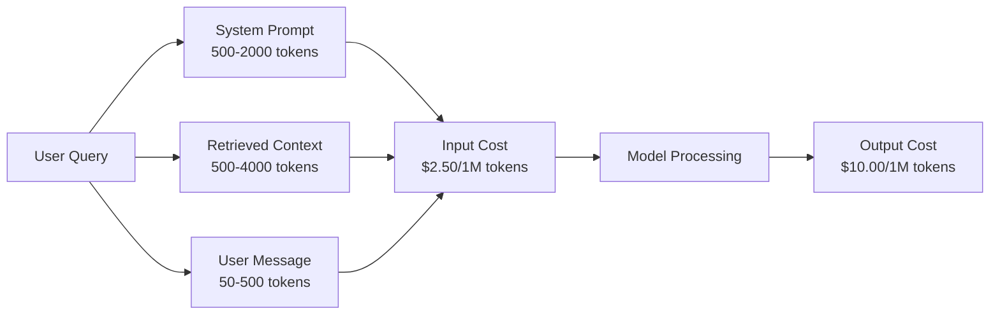
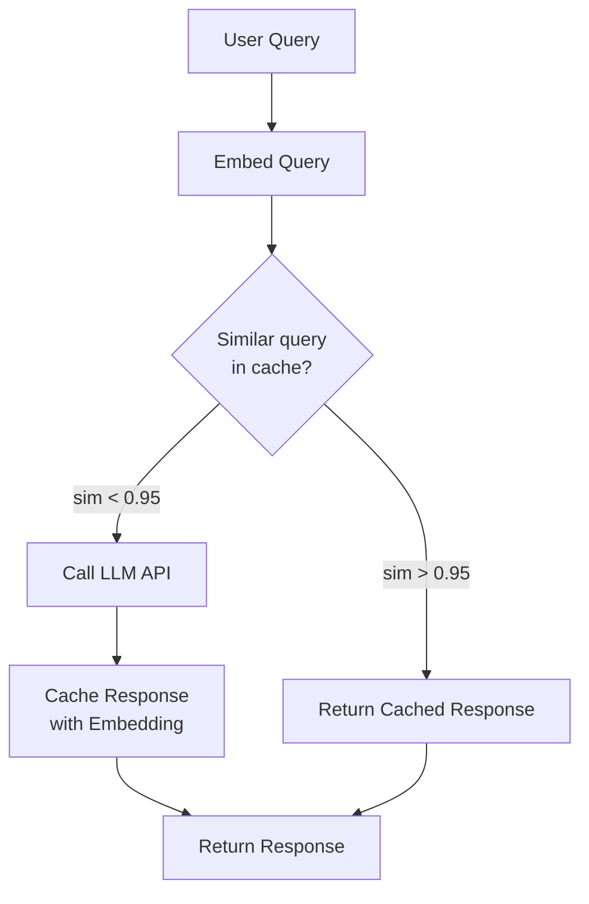
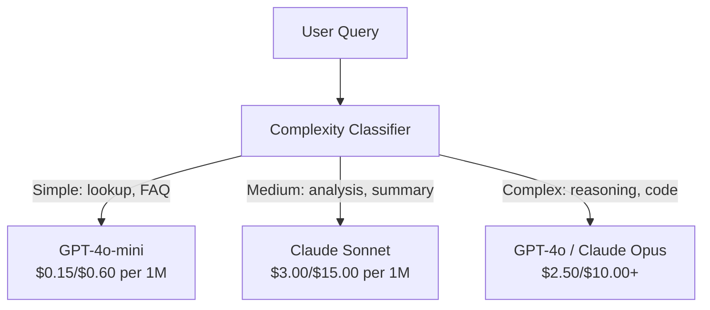

# Caching, Limitamento de Taxas & Optimização de Custos

> A maioria das startups de IA não morrem de maus modelos. Morrem de má economia de unidade. Uma única chamada GPT-4o custa frações de um centavo. Dez mil usuários que fazem dez chamadas por dia custam 250 dólares em tokens de entrada sozinhos - antes de cobrar um único dólar. As empresas que sobrevivem são aquelas que tratam cada chamada de API como uma transação financeira, não uma chamada de função.

> **【中文解读】**Empresas de criação de AI morrem em grande parte em um modelo econômico unitário ruim, e não em um modelo ruim. 10 mil usuários são usados 10 vezes por dia, e os tokens de entrada de luz custam US$ 250/dia. Empresas vivas usam cada API como uma forma de gerir transações financeiras.

> **【拓展：成本优化→AI商业化】**提示缓存(Prompt Caching) pode reduzir 50-90% do custo de sugestão,语义缓存(Semantic Cache) pode ser similar a consulta de重调用合并, é a chave para a realização de lucros em produtos de IA ──

> - Não .**【前置】**学本节前请先掌握:(1) Fase 11·09(Função chamada);(2) Fase 11·04(Embutidos)语义缓存依赖嵌入;(3) Redis ou Memcached 基础──本节会用 `redis`- Não.`fastapi-cache`Ou `gptcache`- Não.

**Type:** Build | **类型:** 构建
**Languages:** Python | **语言:** Python
**Prerequisites:** Phase 11 Lesson 09 (Function Calling) | **前置知识:** Phase 11 · 09 (函数调用)
**Time:** ~45 minutes | **时间:** ~45 分钟
**Related:**A lição 15 abrange a armazenagem em cache de camada de aplicação (cache semântica, cache hash exato, roteamento de modelo). A lição 15 abrange a armazenagem em cache de camada de fornecedor (Anthropic cache_control, OpenAI automático, Gemini CachedContent). Combine ambos para uma redução de custos de 50-95%.**相关:**Fase 11 · 15 (提示缓存) 本课讲应用层缓存(语义缓存、精确哈希缓存、模型路由)  Lição 15 讲提供商层提示缓存(Antropic cache_control、OpenAI 自动、Gemini CachedContent) 结合两者可降低50-95% 成本。

## Objetivos de aprendizagem

- Implementar cache semântico que serve repetidas ou consultas semelhantes do cache em vez de fazer uma nova chamada de API
  实现语义缓存, de缓存服务重复或相似查询, e não de cada nova construção API 调用
- Calcular os custos por pedido entre os prestadores e implementar alertas de taxa de limite e orçamento de token-consciente
  跨供应商计算每请求成本,实现感知代币的流量限制和预算告警
- Construir uma camada de otimização de custos com compressão rápida, roteamento de modelos (caros versus baratos) e armazenamento em cache de resposta
  Construção de custos optimização de camadas, contendo pressão de propostas, modelos de viagens (preço versus custo) e resposta de reservas
- Desenhar uma estratégia de caching em camadas usando a correspondência exata, semantic similarity e prefixo caching para diferentes tipos de consulta
  design estratégias de cache de camadas, para diferentes tipos de consulta com precisão de correspondência, semelhança de linguagem e cache anterior

> **【中文解读】**O objetivo deste curso é: obter a estratégia de optimização dos custos da aplicação do LLM Prompt Caching、语义缓存、模型路由、批处理──LLM API 成本是生产部署的主要支出──

> - Não .**【类比】**Não tem armazenamento de LLM  aplicativos como restaurante por cada cliente em re-seixar o alimento lento e caro.**精确哈希缓存**冰箱里现成菜(同问题直接返回,毫秒);(2) **语义缓存** gelado de gelado similaridade  embutida similaridade > 0,95 视为同问题,5-20ms);**prompt caching** fornecedores preceitam bons preparados  sistema rápido                                                                                                                                                                                                                                                                                                                                                                                                                                                                                                               

> ️ **【易错点】**缓存的 3 个坑: ((1) **缓存中毒** usuário pergunta "qual é o saldo da minha conta?" 语义缓存命中"上次别人问的余额",返回错的数字;修复:带用户身份 hash 进缓存键,PII/个性化查询不缓存――(2) **相似度阈值过高**0.95 太严,命中率 < 5%;降至0.85 +加 LLM 二次验证("Estes dois problemas são equivalentes?")―(3) **TTL 太长**News类查询缓存 24h,模型答案过时;区分查询类型,事实查询 TTL=1h,聊天 TTL=24h──


## O problema é o problema da introdução

Construímos um chatbot RAG, funciona muito bem, os usuários adoram.

Depois chega a fatura.

> Você construiu um RAG Chatting Machine. Funciona muito bem.

Custos do GPT-5 $5 per million input tokens and $15 por milhão de produção.$15 input / $75 de saída.$1.25 input / $5 de saída. GPT-5-mini é $0.25/$Os preços abaixo são ilustrativos; verifique sempre a página de preços atual do fornecedor.

> GPT-5 por milhão de tokens de entrada$5，每百万输出 $15―Claude Opus 4.7 $15/$75―Gemini 3 Pro $1.25/$5 

Aqui está a matemática que mata startups:

> É a matemática para fazer uma startup fechar.

- 10.000 utilizadores ativos diários
  10.000 日利用户
- 10 consultas por utilizador por dia
  Cada usuário 10 vezes por dia
- 1000 tokens de entrada por consulta (promulgação do sistema + contexto + mensagem do usuário)
  Cada consulta 1.000 Tokens de entrada
- 500 tokens de saída por resposta
  500 tokens de saída por resposta

**Monthly total:** **$22,500/month**

Adicione embutidos, hospedagem de banco de dados vetorial, infraestrutura.

> É apenas o custo do LLM. Adicionalmente, a instalação, o gerenciamento de dados, a infraestrutura, um chatbot, $30.000 por mês.

A parte brutal: 40-60% dessas consultas são quase duplicadas. Os usuários fazem as mesmas perguntas em palavras ligeiramente diferentes. O seu sistema de solicitações - idêntico em todas as solicitações - é cobrado a cada vez. Documentos de contexto recuperados pela RAG repetem-se em todos os usuários que perguntam sobre o mesmo assunto.

> O que é mais difícil: 40%-60% das consultas são repetidas.

Está a pagar o preço total por um cálculo redundante.

> Estás a pagar o preço total por sobra.

## O conceito central.

> **【中文解读】**Otimizar os custos da API LLM é um dos principais considerativos da produção.

> **【拓展：LLM 成本的实际数据】**GPT-4o 定价 $5/$15 por M de tokens ((input/output),Claude 3.5 Sonnet $3/$15── um dia vivo 100.000 aplicativos de usuários, por interação cerca de 2K de entrada + 500 tokens de saída, mês custo cerca de US$ 15.000-45.000── através de Caching Prompt pode ser reduzido em cerca de 50%, usando GPT-4o-mini 替代简单查询可再降低30%──


### A Anatomia do Custo de uma chamada de LLM

Cada chamada de API tem cinco componentes de custo.

> Cada API 调用 有五个成本组件──



Uma chamada de sistema de 1.500 tokens enviada com cada pedido.$3.75 per million requests just for that prefix. At 100K requests per day, that is $375 dias - 11.250 dólares por mês - por texto que nunca muda.

> Sistema de instruções é um assassino silencioso. 1.500 tokens de instruções por pedido são enviados, cada milhão de pedidos são feitos apenas por um único token.$3.75。每天 10 万请求就是 $375/天$11,250/月为从不改变的文本──

### Caching dos fornecedores: Desconto integrado

Os três principais provedores oferecem caché rápido do lado do fornecedor em 2026, mas as mecânicas diferem.

> Os três grandes fornecedores em 2026 estão a fornecer os dados dos fornecedores, mas o mecanismo é diferente.

| Provider | Mechanism | Discount | Minimum | Cache Duration |
|----------|-----------|----------|---------|----------------|
| Anthropic | Explicit cache_control markers | 90% on cache hits (pay 25% extra on write) | 1,024 tokens (Sonnet/Opus), 2,048 (Haiku) | 5 min default; 1h extended (2x write premium) |
| OpenAI | Automatic prefix matching | 50% on cache hits | 1,024 tokens | Best-effort up to 1 hour |
| Google Gemini | Explicit CachedContent API | ~75% reduction (plus storage) | 4,096 (Flash) / 32,768 (Pro) | User-configurable TTL |

**Anthropic's approach**Marca secções do seu aviso com `cache_control: {"type": "ephemeral"}`O primeiro pedido paga um prémio de escrita de 25%. os pedidos subsequentes com o mesmo prefixo recebem um desconto de 90%.$0.005 normally costs $Mais de 100 mil solicitações, que economizam 437,50 dólares por dia.

> **Anthropic 方式**É evidente.`cache_control: {"type": "ephemeral"}`标记提示段──首次请求付 25% 写入溢价──后续同前请求获得90% 折扣──2,000 tokens 系统提示正常 系统提示$0.005，缓存命中 $0,000625―100.000 pedidos Província $437.50/dia―

**OpenAI's approach**O prefixo de pedido que corresponde a um pedido anterior recebe um desconto de 50%. Não é necessário marcadores. O compromisso: menos desconto, menos controle, mas zero esforço de implementação.

> **OpenAI 方式**É automático. Qualquer correspondência com a proposta anterior recebeu 50% de desconto.

### Cachagem semântica: sua camada personalizada

O caching de fornecedor só funciona para prefixos idênticos.

> 供应商缓存只对相同的前生效──语义缓存处理更难的情况: diferentes consultas, mas o mesmo significado──

"Qual é a política de devolução?" e "Como eu devolvo um item?" são cadeias diferentes, mas a intenção é idêntica. Um cache semântico incorpora ambas as consultas, calcula a semelhança cosínica e retorna a resposta em cache se a semelhança exceder um limiar (normalmente 0,92-0,95).

> "退货政策是什么?"和"我怎么退货?"是不同字符串但意图相同──语义缓存把两个查询都嵌入,计算余弦相似度,若相似度超值(通常 0.92-0.95) 回复缓存响应──



Os custos de incorporação são insignificantes. O texto de incorporação de OpenAI 3-small custa $ 0,02 por milhão de tokens.

> 嵌入成本可忽略──OpenAI text-embedding-3-small 每百万代币 $0.02──检查缓存相比完整 LLM 调用几乎零成本──

### Cachagem exacta: hash e correspondência

Para chamadas deterministas (temperatura = 0, mesmo modelo, mesmo prompt), o cache exato é mais simples e mais rápido.

> Para a determinação de que o seu tempo de funcionamento é de 0,00 °C, o seu tempo de funcionamento é de 0,00 °C, o seu tempo de funcionamento é de 0,00 °C, o seu tempo de funcionamento é de 0,00 °C, o seu tempo de funcionamento é de 0,00 °C, o seu tempo de funcionamento é de 0,00 °C, o seu tempo de funcionamento é de 0,00 °C, o seu tempo de funcionamento é de 0,00 °C, o seu tempo de funcionamento é de 0,00 °C, o seu tempo de funcionamento é de 0,00 °C, o seu tempo de funcionamento é de 0,00 °C, o seu tempo de funcionamento é de 0,00 °C, o seu tempo de funcionamento é de 0,00 °C, o seu tempo de funcionamento é de 0,00 °C, o seu tempo de funcionamento é de 0,00 °C, o seu tempo de funcionamento é de 0,00 °C, o seu tempo de funcionamento é de 0,00 °C, o seu tempo de funcionamento é de 0,00 °C, o seu tempo de tempo de tempo é de 0,00 °C, o tempo de tempo de tempo de tempo de tempo de tempo de tempo de tempo de tempo de tempo de tempo de tempo de tempo de tempo de tempo de tempo de tempo de tempo de tempo de tempo de tempo de tempo de tempo de tempo de tempo de tempo de tempo de tempo de tempo de tempo de tempo de tempo de tempo de tempo de tempo de tempo de tempo de tempo de tempo de tempo de tempo de tempo de tempo de tempo de tempo de tempo de tempo de tempo de tempo de tempo de tempo de tempo de tempo de tempo de tempo de tempo de tempo de tempo de tempo de tempo de tempo de tempo de tempo de tempo de tempo de tempo de tempo de tempo de tempo de tempo de tempo de tempo de tempo de tempo de tempo de tempo de tempo de tempo de tempo de tempo de tempo de tempo de tempo de tempo de tempo de tempo de tempo de tempo de tempo de tempo de tempo de tempo de tempo de tempo de tempo de tempo de tempo de tempo de tempo de tempo de tempo de tempo de tempo de tempo de tempo de tempo de tempo de tempo de tempo de tempo de tempo de tempo de tempo de tempo de tempo de tempo de tempo de tempo de tempo de tempo de tempo de tempo de tempo de tempo de tempo de tempo de tempo de tempo de tempo de tempo de tempo de tempo de tempo de tempo de tempo de tempo de tempo

Isto funciona perfeitamente para:

> Esta é a melhor das hipóteses:

- Impressão do sistema + contexto fixo + consultas idênticas do usuário
  系统提示 + 固定上下文 + 相同用户查询
- Chamadas de função com definições idênticas de ferramentas
  O que é o "FUNCTION DEFINITURE"
- Processamento em lote, onde o mesmo documento é processado várias vezes
  O processo de produção de produtos de produção de produtos de produção de produtos de produção de produtos de produção de produtos de produção de produtos de produção de produtos de produção de produtos de produção de produtos de produção de produtos de produção de produtos de produção de produtos de produção de produtos de produção de produtos de produção de produtos de produção de produtos de produção de produtos de produção de produtos de produção de produtos de produção de produtos de produção de produtos de produção de produtos de produção de produtos de produção de produtos de produção de produtos de produção de produtos de produção de produtos de produção de produtos de produção de produtos de produção de produtos de produção de produtos de produção de produtos de produção de produção de produtos de produção de produtos de base

### Limitação de taxas: Proteger o seu orçamento

A limitação de taxas não é apenas sobre a justiça, é sobre a sobrevivência.

> O limite não é apenas uma questão de justiça, é uma questão de sobrevivência.

**Token bucket algorithm:**Cada usuário recebe um balde de N tokens que se reabastece a taxa R por segundo. Uma solicitação consome tokens do balde. Se o balde estiver vazio, o pedido é rejeitado. Isso permite explosões (utilizar o balde completo de uma vez) enquanto se impõe uma taxa média.
**令牌桶算法**Cada usuário tem um token N em cada barril, conforme R/s/s/s.

**Per-user quotas:**Estabelecer limites diários/mensuais de tokens por nível de utilizador.
**每用户配额**: por nível de usuário设日/月 token 上限。

| Tier | Daily Token Limit | Max Requests/min | Model Access |
|------|------------------|------------------|-------------|
| Free | 50,000 | 10 | GPT-4o-mini only |
| Pro | 500,000 | 60 | GPT-4o, Claude Sonnet |
| Enterprise | 5,000,000 | 300 | All models |

### Roteamento Modelo: Modelo correto para o trabalho correto

Nem todas as consultas precisam de GPT-4o.

> Não é que todas as consultas precisem de GPT-4o.

"A que horas fecha a loja?" não requer um $10/M-output model. GPT-4o-mini at $Uma classificação simples encaminha consultas baratas para modelos baratos e consultas complexas para modelos caros.

> "Guarda, não precisas de ir".$10/M 输出模型。$0,60/M 输出 GPT-4o-mini 完全胜任。$1,25/M 输出 Claude Haiku 也可以──简单分类器把便宜查询路由到便宜模型,复杂查询路由到贵模型──



Um roteador bem sintonizado economiza 40-70% nos custos do modelo sozinho.

> O bom router unit é de 40 a 70% do custo do modelo.

### Seguimento de custos: saber para onde vai o dinheiro

Não pode otimizar o que não mede.

> Não consegue optimizar a quantidade de coisas.

- Marca de tempo
  时间
- Nome do modelo
  模型名
- Tokens de entrada
  输入 token
- Tokens de saída
  输出 token
- Latência (ms)
  延迟(毫秒)
- Custo calculado ($)
  计算成本($)
- Identificação de utilizador
  ID do usuário
- Caches de acidente/falta
  缓存命中/未中
- Categoria de pedido
  Pelicula classe

Estes dados revelam quais são os recursos mais caros, quais são os consumidores mais pesados e onde o caching tem o maior impacto.

> Os dados revelam quais são as funções que os usuários consomem mais, e quais são as que mais afetam a existência.

### Batchings: descontos em massa

A API de Batch da OpenAI processa as solicitações de forma assíncrona com um desconto de 50%.

> OpenAI Batch API 异步处理请求,50%折――提交最大50.000请求批次,24小时内回复结果――

Usar batches para:

>  batch processing são utilizados:

- Processamento noturno de documentos
  Noite entre arquivos
- Classificação em massa
   Batalha
- Cursos de avaliação
  评估运行
- Linhas de enriquecimento de dados
  Número de fontes de água

Não para: consultas em tempo real dirigidas ao utilizador (questões de atraso).
Não é utilizado:实时面向用户查询 (contentão)

### Alertas de Orçamento e interrupções de circuito

Se você não tiver um limite, um interruptor de circuito deixa de gastar, e um erro ou abuso pode queimar o seu orçamento mensal em horas.

> O interruptor está a chegar ao limite máximo, para parar de gastar.

Estabelecer três limiares:

> 设三个值:

1. **Warning**(70% do orçamento): enviar um alerta
   **警告**(Budget 70%):
2. **Throttle**(85% do orçamento): transição para modelos mais baratos
   **降速**(Budget 85%): apenas trocado para modelo mais barato
3. **Stop**(95% do orçamento): rejeitar novos pedidos, devolver apenas respostas armazenadas em cache
   **停止**(Budget 95%): rejeitar novas solicitações, apenas retornar à caixa de resposta

### A pilha de otimização

Aplique estas técnicas em ordem, cada camada compõe-se com as anteriores.

> 按顺序应用这些技术──每层叠加在前一层之上──

| Layer | Technique | Typical Savings | Implementation Effort |
|-------|-----------|----------------|----------------------|
| 1 | Provider prompt caching | 30-50% | Low (add cache markers) |
| 2 | Exact caching | 10-20% | Low (hash + dict) |
| 3 | Semantic caching | 15-30% | Medium (embeddings + similarity) |
| 4 | Model routing | 40-70% | Medium (classifier) |
| 5 | Rate limiting | Budget protection | Low (token bucket) |
| 6 | Prompt compression | 10-30% | Medium (rewrite prompts) |
| 7 | Batching | 50% on eligible | Low (batch API) |

Um aplicativo RAG que aplica camadas 1-5 normalmente reduz os custos de $22,500/month to $É a diferença entre queimar uma pista e construir um negócio.

>  aplicação de 1-5 níveis de RAG  aplicação geralmente leva o custo mensal de $22,500 降到 $4000-6000... é a diferença entre fazer negócios e queimar dinheiro.

### Economias reais: antes e depois

Aqui está uma falha real para um chatbot RAG que serve 10.000 DAU.

> É a verdadeira desintegração de um RAG de 10.000 DAU.

| Metric | Before Optimization | After Optimization | Savings |
|--------|--------------------|--------------------|---------|
| Monthly LLM cost | $22,500 | $5,200 | 77% |
| Avg cost per query | $0.0075 | $0.0017 | 77% |
| Cache hit rate | 0% | 52% | -- |
| Queries routed to mini | 0% | 65% | -- |
| P95 latency | 2,800ms | 900ms (cache hits: 50ms) | 68% |
| Monthly embedding cost | $0 | $180 | (new cost) |
| Total monthly cost | $22,500 | $5,380 | 76% |

O custo de incorporação para o cache semântico (US $ 180 / mês) paga por si mesmo dentro da primeira hora de visitas ao cache.

> 语义缓存的嵌入成本 ($180/月)

## Construí-lo e realizei-o.
```figure
semantic-cache
```

## Construí-lo

### Passo 1: Calculadora de custos

Construir uma calculadora de custos de tokens que conheça os preços atuais para os principais modelos.

> 构建代币 成本计算器,知道主要模型当前定价──

```python
import hashlib
import time
import json
import math
from dataclasses import dataclass, field


MODEL_PRICING = {
    "gpt-4o": {"input": 2.50, "output": 10.00, "cached_input": 1.25},
    "gpt-4o-mini": {"input": 0.15, "output": 0.60, "cached_input": 0.075},
    "gpt-4.1": {"input": 2.00, "output": 8.00, "cached_input": 0.50},
    "gpt-4.1-mini": {"input": 0.40, "output": 1.60, "cached_input": 0.10},
    "gpt-4.1-nano": {"input": 0.10, "output": 0.40, "cached_input": 0.025},
    "o3": {"input": 2.00, "output": 8.00, "cached_input": 0.50},
    "o3-mini": {"input": 1.10, "output": 4.40, "cached_input": 0.55},
    "o4-mini": {"input": 1.10, "output": 4.40, "cached_input": 0.275},
    "claude-opus-4": {"input": 15.00, "output": 75.00, "cached_input": 1.50},
    "claude-sonnet-4": {"input": 3.00, "output": 15.00, "cached_input": 0.30},
    "claude-haiku-3.5": {"input": 0.80, "output": 4.00, "cached_input": 0.08},
    "gemini-2.5-pro": {"input": 1.25, "output": 10.00, "cached_input": 0.3125},
    "gemini-2.5-flash": {"input": 0.15, "output": 0.60, "cached_input": 0.0375},
}


def calculate_cost(model, input_tokens, output_tokens, cached_input_tokens=0):
    if model not in MODEL_PRICING:
        return {"error": f"Unknown model: {model}"}
    pricing = MODEL_PRICING[model]
    non_cached = input_tokens - cached_input_tokens
    input_cost = (non_cached / 1_000_000) * pricing["input"]
    cached_cost = (cached_input_tokens / 1_000_000) * pricing["cached_input"]
    output_cost = (output_tokens / 1_000_000) * pricing["output"]
    total = input_cost + cached_cost + output_cost
    return {
        "model": model,
        "input_tokens": input_tokens,
        "output_tokens": output_tokens,
        "cached_input_tokens": cached_input_tokens,
        "input_cost": round(input_cost, 6),
        "cached_input_cost": round(cached_cost, 6),
        "output_cost": round(output_cost, 6),
        "total_cost": round(total, 6),
    }
```

### Passo 2: Cache exato

Hash o prompt completo e retornar respostas armazenadas em cache para pedidos idênticos.

> 哈希完整提示, para o mesmo pedido de retorno缓存响应.

```python
class ExactCache:
    def __init__(self, max_size=1000, ttl_seconds=3600):
        self.cache = {}
        self.max_size = max_size
        self.ttl = ttl_seconds
        self.hits = 0
        self.misses = 0

    def _hash(self, model, messages, temperature):
        key_data = json.dumps({"model": model, "messages": messages, "temperature": temperature}, sort_keys=True)
        return hashlib.sha256(key_data.encode()).hexdigest()

    def get(self, model, messages, temperature=0.0):
        if temperature > 0:
            self.misses += 1
            return None
        key = self._hash(model, messages, temperature)
        if key in self.cache:
            entry = self.cache[key]
            if time.time() - entry["timestamp"] < self.ttl:
                self.hits += 1
                entry["access_count"] += 1
                return entry["response"]
            del self.cache[key]
        self.misses += 1
        return None

    def put(self, model, messages, temperature, response):
        if temperature > 0:
            return
        if len(self.cache) >= self.max_size:
            oldest_key = min(self.cache, key=lambda k: self.cache[k]["timestamp"])
            del self.cache[oldest_key]
        key = self._hash(model, messages, temperature)
        self.cache[key] = {
            "response": response,
            "timestamp": time.time(),
            "access_count": 1,
        }

    def stats(self):
        total = self.hits + self.misses
        return {
            "hits": self.hits,
            "misses": self.misses,
            "hit_rate": round(self.hits / total, 4) if total > 0 else 0,
            "cache_size": len(self.cache),
        }
```

### Passo 3: Cache semântico

Embed query e retornar respostas armazenadas em cache quando a semelhança exceder um limiar.

> 嵌入查询,相似度超值时返回缓存响应──

```python
def simple_embed(text):
    words = text.lower().split()
    vocab = {}
    for w in words:
        vocab[w] = vocab.get(w, 0) + 1
    norm = math.sqrt(sum(v * v for v in vocab.values()))
    if norm == 0:
        return {}
    return {k: v / norm for k, v in vocab.items()}


def cosine_similarity(a, b):
    if not a or not b:
        return 0.0
    all_keys = set(a) | set(b)
    dot = sum(a.get(k, 0) * b.get(k, 0) for k in all_keys)
    return dot


class SemanticCache:
    def __init__(self, similarity_threshold=0.85, max_size=500, ttl_seconds=3600):
        self.entries = []
        self.threshold = similarity_threshold
        self.max_size = max_size
        self.ttl = ttl_seconds
        self.hits = 0
        self.misses = 0

    def get(self, query):
        query_embedding = simple_embed(query)
        now = time.time()
        best_match = None
        best_sim = 0.0
        for entry in self.entries:
            if now - entry["timestamp"] > self.ttl:
                continue
            sim = cosine_similarity(query_embedding, entry["embedding"])
            if sim > best_sim:
                best_sim = sim
                best_match = entry
        if best_match and best_sim >= self.threshold:
            self.hits += 1
            best_match["access_count"] += 1
            return {"response": best_match["response"], "similarity": round(best_sim, 4), "original_query": best_match["query"]}
        self.misses += 1
        return None

    def put(self, query, response):
        if len(self.entries) >= self.max_size:
            self.entries.sort(key=lambda e: e["timestamp"])
            self.entries.pop(0)
        self.entries.append({
            "query": query,
            "embedding": simple_embed(query),
            "response": response,
            "timestamp": time.time(),
            "access_count": 1,
        })

    def stats(self):
        total = self.hits + self.misses
        return {
            "hits": self.hits,
            "misses": self.misses,
            "hit_rate": round(self.hits / total, 4) if total > 0 else 0,
            "cache_size": len(self.entries),
        }
```

### Passo 4: Limite de taxa

Limiteiro de taxa de tokens com quotas por usuário.

> "Mem牌桶限流器, contendo quota de cada usuário"".

```python
class TokenBucketRateLimiter:
    def __init__(self):
        self.buckets = {}
        self.tiers = {
            "free": {"capacity": 50_000, "refill_rate": 500, "max_requests_per_min": 10},
            "pro": {"capacity": 500_000, "refill_rate": 5_000, "max_requests_per_min": 60},
            "enterprise": {"capacity": 5_000_000, "refill_rate": 50_000, "max_requests_per_min": 300},
        }

    def _get_bucket(self, user_id, tier="free"):
        if user_id not in self.buckets:
            tier_config = self.tiers.get(tier, self.tiers["free"])
            self.buckets[user_id] = {
                "tokens": tier_config["capacity"],
                "capacity": tier_config["capacity"],
                "refill_rate": tier_config["refill_rate"],
                "last_refill": time.time(),
                "request_timestamps": [],
                "max_rpm": tier_config["max_requests_per_min"],
                "tier": tier,
                "total_tokens_used": 0,
            }
        return self.buckets[user_id]

    def _refill(self, bucket):
        now = time.time()
        elapsed = now - bucket["last_refill"]
        refill = int(elapsed * bucket["refill_rate"])
        if refill > 0:
            bucket["tokens"] = min(bucket["capacity"], bucket["tokens"] + refill)
            bucket["last_refill"] = now

    def check(self, user_id, tokens_needed, tier="free"):
        bucket = self._get_bucket(user_id, tier)
        self._refill(bucket)
        now = time.time()
        bucket["request_timestamps"] = [t for t in bucket["request_timestamps"] if now - t < 60]
        if len(bucket["request_timestamps"]) >= bucket["max_rpm"]:
            return {"allowed": False, "reason": "rate_limit", "retry_after_seconds": 60 - (now - bucket["request_timestamps"][0])}
        if bucket["tokens"] < tokens_needed:
            deficit = tokens_needed - bucket["tokens"]
            wait = deficit / bucket["refill_rate"]
            return {"allowed": False, "reason": "token_limit", "tokens_available": bucket["tokens"], "retry_after_seconds": round(wait, 1)}
        return {"allowed": True, "tokens_available": bucket["tokens"]}

    def consume(self, user_id, tokens_used, tier="free"):
        bucket = self._get_bucket(user_id, tier)
        bucket["tokens"] -= tokens_used
        bucket["request_timestamps"].append(time.time())
        bucket["total_tokens_used"] += tokens_used

    def get_usage(self, user_id):
        if user_id not in self.buckets:
            return {"error": "User not found"}
        b = self.buckets[user_id]
        return {
            "user_id": user_id,
            "tier": b["tier"],
            "tokens_remaining": b["tokens"],
            "capacity": b["capacity"],
            "total_tokens_used": b["total_tokens_used"],
            "utilization": round(b["total_tokens_used"] / b["capacity"], 4) if b["capacity"] else 0,
        }
```

### Passo 5: Tracking de custos

Registrar todas as chamadas e calcular os totais de execução.

> 记录 per调用并计算累计总额──

```python
class CostTracker:
    def __init__(self, monthly_budget=1000.0):
        self.logs = []
        self.monthly_budget = monthly_budget
        self.alerts = []

    def log_call(self, model, input_tokens, output_tokens, cached_input_tokens=0, latency_ms=0, user_id="anonymous", cache_status="miss"):
        cost = calculate_cost(model, input_tokens, output_tokens, cached_input_tokens)
        entry = {
            "timestamp": time.time(),
            "model": model,
            "input_tokens": input_tokens,
            "output_tokens": output_tokens,
            "cached_input_tokens": cached_input_tokens,
            "latency_ms": latency_ms,
            "cost": cost["total_cost"],
            "user_id": user_id,
            "cache_status": cache_status,
        }
        self.logs.append(entry)
        self._check_budget()
        return entry

    def _check_budget(self):
        total = self.total_cost()
        pct = total / self.monthly_budget if self.monthly_budget > 0 else 0
        if pct >= 0.95 and not any(a["level"] == "stop" for a in self.alerts):
            self.alerts.append({"level": "stop", "message": f"Budget 95% consumed: ${total:.2f}/${self.monthly_budget:.2f}", "timestamp": time.time()})
        elif pct >= 0.85 and not any(a["level"] == "throttle" for a in self.alerts):
            self.alerts.append({"level": "throttle", "message": f"Budget 85% consumed: ${total:.2f}/${self.monthly_budget:.2f}", "timestamp": time.time()})
        elif pct >= 0.70 and not any(a["level"] == "warning" for a in self.alerts):
            self.alerts.append({"level": "warning", "message": f"Budget 70% consumed: ${total:.2f}/${self.monthly_budget:.2f}", "timestamp": time.time()})

    def total_cost(self):
        return round(sum(e["cost"] for e in self.logs), 6)

    def cost_by_model(self):
        by_model = {}
        for e in self.logs:
            m = e["model"]
            if m not in by_model:
                by_model[m] = {"calls": 0, "cost": 0, "input_tokens": 0, "output_tokens": 0}
            by_model[m]["calls"] += 1
            by_model[m]["cost"] = round(by_model[m]["cost"] + e["cost"], 6)
            by_model[m]["input_tokens"] += e["input_tokens"]
            by_model[m]["output_tokens"] += e["output_tokens"]
        return by_model

    def cache_savings(self):
        cache_hits = [e for e in self.logs if e["cache_status"] == "hit"]
        if not cache_hits:
            return {"saved": 0, "cache_hits": 0}
        saved = 0
        for e in cache_hits:
            full_cost = calculate_cost(e["model"], e["input_tokens"], e["output_tokens"])
            saved += full_cost["total_cost"]
        return {"saved": round(saved, 4), "cache_hits": len(cache_hits)}

    def summary(self):
        if not self.logs:
            return {"total_calls": 0, "total_cost": 0}
        total_latency = sum(e["latency_ms"] for e in self.logs)
        cache_hits = sum(1 for e in self.logs if e["cache_status"] == "hit")
        return {
            "total_calls": len(self.logs),
            "total_cost": self.total_cost(),
            "avg_cost_per_call": round(self.total_cost() / len(self.logs), 6),
            "avg_latency_ms": round(total_latency / len(self.logs), 1),
            "cache_hit_rate": round(cache_hits / len(self.logs), 4),
            "cost_by_model": self.cost_by_model(),
            "cache_savings": self.cache_savings(),
            "budget_remaining": round(self.monthly_budget - self.total_cost(), 2),
            "budget_utilization": round(self.total_cost() / self.monthly_budget, 4) if self.monthly_budget > 0 else 0,
            "alerts": self.alerts,
        }
```

### Passo 6: Roteador modelo

Envio de pedidos para o modelo mais barato que os possa lidar.

> "Põe as perguntas em um caminho que permita tratar os modelos mais baratos".

```python
SIMPLE_KEYWORDS = ["what time", "hours", "address", "phone", "price", "return policy", "hello", "hi", "thanks", "yes", "no"]
COMPLEX_KEYWORDS = ["analyze", "compare", "explain why", "write code", "debug", "architect", "design", "trade-off", "evaluate"]


def classify_complexity(query):
    q = query.lower()
    if len(q.split()) <= 5 or any(kw in q for kw in SIMPLE_KEYWORDS):
        return "simple"
    if any(kw in q for kw in COMPLEX_KEYWORDS):
        return "complex"
    return "medium"


def route_model(query, tier="pro"):
    complexity = classify_complexity(query)
    routing_table = {
        "simple": {"free": "gpt-4.1-nano", "pro": "gpt-4o-mini", "enterprise": "gpt-4o-mini"},
        "medium": {"free": "gpt-4o-mini", "pro": "claude-sonnet-4", "enterprise": "claude-sonnet-4"},
        "complex": {"free": "gpt-4o-mini", "pro": "gpt-4o", "enterprise": "claude-opus-4"},
    }
    model = routing_table[complexity].get(tier, "gpt-4o-mini")
    return {"query": query, "complexity": complexity, "model": model, "tier": tier}
```

### Passo 7: Execute a demonstração

> - Não, não.

```python
def simulate_llm_call(model, query):
    input_tokens = len(query.split()) * 4 + 500
    output_tokens = 150 + (len(query.split()) * 2)
    latency = 200 + (output_tokens * 2)
    return {
        "model": model,
        "response": f"[Simulated {model} response to: {query[:50]}...]",
        "input_tokens": input_tokens,
        "output_tokens": output_tokens,
        "latency_ms": latency,
    }


def run_demo():
    print("=" * 60)
    print("  Caching, Rate Limiting & Cost Optimization Demo")
    print("=" * 60)

    print("\n--- Model Pricing ---")
    for model, pricing in list(MODEL_PRICING.items())[:6]:
        cost_1k = calculate_cost(model, 1000, 500)
        print(f"  {model}: ${cost_1k['total_cost']:.6f} per 1K in + 500 out")

    print("\n--- Cost Comparison: 100K Requests ---")
    for model in ["gpt-4o", "gpt-4o-mini", "claude-sonnet-4", "claude-haiku-3.5"]:
        cost = calculate_cost(model, 1000 * 100_000, 500 * 100_000)
        print(f"  {model}: ${cost['total_cost']:.2f}")

    print("\n--- Anthropic Cache Savings ---")
    no_cache = calculate_cost("claude-sonnet-4", 2000, 500, 0)
    with_cache = calculate_cost("claude-sonnet-4", 2000, 500, 1500)
    saving = no_cache["total_cost"] - with_cache["total_cost"]
    print(f"  Without cache: ${no_cache['total_cost']:.6f}")
    print(f"  With 1500 cached tokens: ${with_cache['total_cost']:.6f}")
    print(f"  Savings per call: ${saving:.6f} ({saving/no_cache['total_cost']*100:.1f}%)")

    exact_cache = ExactCache(max_size=100, ttl_seconds=300)
    semantic_cache = SemanticCache(similarity_threshold=0.75, max_size=100)
    rate_limiter = TokenBucketRateLimiter()
    tracker = CostTracker(monthly_budget=100.0)

    print("\n--- Exact Cache ---")
    messages_1 = [{"role": "user", "content": "What is the return policy?"}]
    result = exact_cache.get("gpt-4o-mini", messages_1, 0.0)
    print(f"  First lookup: {'HIT' if result else 'MISS'}")
    exact_cache.put("gpt-4o-mini", messages_1, 0.0, "You can return items within 30 days.")
    result = exact_cache.get("gpt-4o-mini", messages_1, 0.0)
    print(f"  Second lookup: {'HIT' if result else 'MISS'} -> {result}")
    result = exact_cache.get("gpt-4o-mini", messages_1, 0.7)
    print(f"  With temp=0.7: {'HIT' if result else 'MISS (non-deterministic, skip cache)'}")
    print(f"  Stats: {exact_cache.stats()}")

    print("\n--- Semantic Cache ---")
    test_queries = [
        ("What is the return policy?", "Items can be returned within 30 days with receipt."),
        ("How do I return an item?", None),
        ("What are your store hours?", "We are open 9am-9pm Monday through Saturday."),
        ("When does the store open?", None),
        ("Tell me about quantum computing", "Quantum computers use qubits..."),
        ("Explain quantum mechanics", None),
    ]
    for query, response in test_queries:
        cached = semantic_cache.get(query)
        if cached:
            print(f"  '{query[:40]}' -> CACHE HIT (sim={cached['similarity']}, original='{cached['original_query'][:40]}')")
        elif response:
            semantic_cache.put(query, response)
            print(f"  '{query[:40]}' -> MISS (stored)")
        else:
            print(f"  '{query[:40]}' -> MISS (no match)")
    print(f"  Stats: {semantic_cache.stats()}")

    print("\n--- Rate Limiting ---")
    for i in range(12):
        check = rate_limiter.check("user_1", 1000, "free")
        if check["allowed"]:
            rate_limiter.consume("user_1", 1000, "free")
        status = "OK" if check["allowed"] else f"BLOCKED ({check['reason']})"
        if i < 5 or not check["allowed"]:
            print(f"  Request {i+1}: {status}")
    print(f"  Usage: {rate_limiter.get_usage('user_1')}")

    print("\n--- Model Routing ---")
    routing_queries = [
        "What time do you close?",
        "Summarize this quarterly earnings report",
        "Analyze the trade-offs between microservices and monoliths",
        "Hello",
        "Write code for a binary search tree with deletion",
    ]
    for q in routing_queries:
        route = route_model(q, "pro")
        print(f"  '{q[:50]}' -> {route['model']} ({route['complexity']})")

    print("\n--- Full Pipeline: Before vs After Optimization ---")
    queries = [
        "What is the return policy?",
        "How do I return something?",
        "What are your hours?",
        "When do you open?",
        "Explain the difference between TCP and UDP",
        "Compare TCP vs UDP protocols",
        "Hello",
        "What is your phone number?",
        "Write a Python function to sort a list",
        "Analyze the pros and cons of serverless architecture",
    ]

    print("\n  [Before: no caching, single model (gpt-4o)]")
    tracker_before = CostTracker(monthly_budget=1000.0)
    for q in queries:
        result = simulate_llm_call("gpt-4o", q)
        tracker_before.log_call("gpt-4o", result["input_tokens"], result["output_tokens"], latency_ms=result["latency_ms"], cache_status="miss")
    before = tracker_before.summary()
    print(f"  Total cost: ${before['total_cost']:.6f}")
    print(f"  Avg cost/call: ${before['avg_cost_per_call']:.6f}")
    print(f"  Avg latency: {before['avg_latency_ms']}ms")

    print("\n  [After: caching + routing + rate limiting]")
    exact_c = ExactCache()
    semantic_c = SemanticCache(similarity_threshold=0.75)
    tracker_after = CostTracker(monthly_budget=1000.0)

    for q in queries:
        messages = [{"role": "user", "content": q}]
        cached = exact_c.get("gpt-4o", messages, 0.0)
        if cached:
            tracker_after.log_call("gpt-4o-mini", 0, 0, latency_ms=5, cache_status="hit")
            continue
        sem_cached = semantic_c.get(q)
        if sem_cached:
            tracker_after.log_call("gpt-4o-mini", 0, 0, latency_ms=15, cache_status="hit")
            continue
        route = route_model(q)
        result = simulate_llm_call(route["model"], q)
        tracker_after.log_call(route["model"], result["input_tokens"], result["output_tokens"], latency_ms=result["latency_ms"], cache_status="miss")
        exact_c.put(route["model"], messages, 0.0, result["response"])
        semantic_c.put(q, result["response"])

    after = tracker_after.summary()
    print(f"  Total cost: ${after['total_cost']:.6f}")
    print(f"  Avg cost/call: ${after['avg_cost_per_call']:.6f}")
    print(f"  Avg latency: {after['avg_latency_ms']}ms")
    print(f"  Cache hit rate: {after['cache_hit_rate']:.0%}")

    if before["total_cost"] > 0:
        savings_pct = (1 - after["total_cost"] / before["total_cost"]) * 100
        print(f"\n  SAVINGS: {savings_pct:.1f}% cost reduction")
        print(f"  Latency improvement: {(1 - after['avg_latency_ms'] / before['avg_latency_ms']) * 100:.1f}% faster")

    print("\n--- Budget Alerts Demo ---")
    alert_tracker = CostTracker(monthly_budget=0.01)
    for i in range(5):
        alert_tracker.log_call("gpt-4o", 5000, 2000, latency_ms=500)
    print(f"  Total spent: ${alert_tracker.total_cost():.6f} / ${alert_tracker.monthly_budget}")
    for alert in alert_tracker.alerts:
        print(f"  ALERT [{alert['level'].upper()}]: {alert['message']}")

    print("\n--- Cost Breakdown by Model ---")
    multi_tracker = CostTracker(monthly_budget=500.0)
    for _ in range(50):
        multi_tracker.log_call("gpt-4o-mini", 800, 200, latency_ms=150)
    for _ in range(30):
        multi_tracker.log_call("claude-sonnet-4", 1500, 500, latency_ms=400)
    for _ in range(10):
        multi_tracker.log_call("gpt-4o", 2000, 800, latency_ms=600)
    for _ in range(10):
        multi_tracker.log_call("claude-opus-4", 3000, 1000, latency_ms=1200)
    breakdown = multi_tracker.cost_by_model()
    for model, data in sorted(breakdown.items(), key=lambda x: x[1]["cost"], reverse=True):
        print(f"  {model}: {data['calls']} calls, ${data['cost']:.6f}, {data['input_tokens']:,} in / {data['output_tokens']:,} out")
    print(f"  Total: ${multi_tracker.total_cost():.6f}")

    print("\n" + "=" * 60)
    print("  Demo complete.")
    print("=" * 60)


if __name__ == "__main__":
    run_demo()
```

## Use-o com o framework implementado.

### Cachagem de Imedios Antropicos

> Antropic 提示缓存──

```python
# import anthropic
#
# client = anthropic.Anthropic()
#
# response = client.messages.create(
#     model="claude-sonnet-5",
#     max_tokens=1024,
#     system=[
#         {
#             "type": "text",
#             "text": "You are a helpful customer support agent for Acme Corp...",
#             "cache_control": {"type": "ephemeral"},
#         }
#     ],
#     messages=[{"role": "user", "content": "What is the return policy?"}],
# )
#
# print(f"Input tokens: {response.usage.input_tokens}")
# print(f"Cache creation tokens: {response.usage.cache_creation_input_tokens}")
# print(f"Cache read tokens: {response.usage.cache_read_input_tokens}")
```

A primeira chamada é escrita no cache (25% premium). Cada chamada subsequente com o mesmo prefixo de pedido do sistema é lida do cache (desconto de 90%). O cache dura 5 minutos e redefine o temporizador em cada golpe.

> 首次调用写缓存(25% 溢价) ;;后续同系统提示前的调用读缓存(90% 折扣) ;;缓存 5 分钟,每次命中重置计时器──

### OpenAI Caching Automático

> OpenAI Automatic Cachemão

```python
# from openai import OpenAI
#
# client = OpenAI()
#
# response = client.chat.completions.create(
#     model="gpt-4o",
#     messages=[
#         {"role": "system", "content": "You are a helpful customer support agent..."},
#         {"role": "user", "content": "What is the return policy?"},
#     ],
# )
#
# print(f"Prompt tokens: {response.usage.prompt_tokens}")
# print(f"Cached tokens: {response.usage.prompt_tokens_details.cached_tokens}")
# print(f"Completion tokens: {response.usage.completion_tokens}")
```

OpenAI cache automaticamente. Qualquer prefixo de 1.024+ tokens que corresponda a uma solicitação recente recebe um desconto de 50%. Não é necessário alterar o código - basta verificar`prompt_tokens_details.cached_tokens`- A resposta para verificar se funciona.

> OpenAI Automatic Cache  Qualquer 1,024 + token 匹配近期请求的提示前得50%折──无需改码检查响应中的 `prompt_tokens_details.cached_tokens`A prova é possível.

### API de lotes OpenAI

> OpenAI Batch API。

```python
# import json
# from openai import OpenAI
#
# client = OpenAI()
#
# requests = []
# for i, query in enumerate(queries):
#     requests.append({
#         "custom_id": f"request-{i}",
#         "method": "POST",
#         "url": "/v1/chat/completions",
#         "body": {
#             "model": "gpt-4o-mini",
#             "messages": [{"role": "user", "content": query}],
#         },
#     })
#
# with open("batch_input.jsonl", "w") as f:
#     for r in requests:
#         f.write(json.dumps(r) + "\n")
#
# batch_file = client.files.create(file=open("batch_input.jsonl", "rb"), purpose="batch")
# batch = client.batches.create(input_file_id=batch_file.id, endpoint="/v1/chat/completions", completion_window="24h")
# print(f"Batch ID: {batch.id}, Status: {batch.status}")
```

A API de lote oferece um desconto de 50% em todos os tokens. Os resultados chegam dentro de 24 horas. Perfeito para cargas de trabalho não em tempo real: avaliações, rotulagem de dados, resumo em massa.

> API de lote para todos os tokens 统一 50% 折扣──output 24 小时内返回──适合非实时工作负载:评估、数据标注、批量摘要──

### Produção Cache semântica com Redis

> 生产语义缓存配 Redis¬¬¬¬¬¬¬¬¬¬¬¬¬¬¬¬

```python
# import redis
# import numpy as np
# from openai import OpenAI
#
# r = redis.Redis()
# client = OpenAI()
#
# def get_embedding(text):
#     response = client.embeddings.create(model="text-embedding-3-small", input=text)
#     return response.data[0].embedding
#
# def semantic_cache_lookup(query, threshold=0.95):
#     query_emb = np.array(get_embedding(query))
#     keys = r.keys("cache:emb:*")
#     best_sim, best_key = 0, None
#     for key in keys:
#         stored_emb = np.frombuffer(r.get(key), dtype=np.float32)
#         sim = np.dot(query_emb, stored_emb) / (np.linalg.norm(query_emb) * np.linalg.norm(stored_emb))
#         if sim > best_sim:
#             best_sim, best_key = sim, key
#     if best_sim >= threshold and best_key:
#         response_key = best_key.decode().replace("cache:emb:", "cache:resp:")
#         return r.get(response_key).decode()
#     return None
```

Em produção, substituir o scan linear com um índice vetorial (Redis Vector Search, Pinecone, ou pgvector).

> O que é um sistema de pesquisa de dados que pode ser usado para fazer uma pesquisa de dados?

## Envia-o . Produto .

Esta lição produz`outputs/prompt-cost-optimizer.md`-- um prompt reutilizável que analisa a sua aplicação de LLM e recomenda otimização específica de custos com economias projetadas.

> 本课产 出 `outputs/prompt-cost-optimizer.md` análise de LLM  aplicação 并推 具体成本优化 (incluindo previsão de economia)

Também produz `outputs/skill-cost-patterns.md`-- um quadro de decisão para escolher a estratégia de cache certa, configuração de limitação de taxa e regras de roteamento modelo para o seu caso de uso.

> Outro produto`outputs/skill-cost-patterns.md` Baseado em exemplos de escolha de estratégias de armazenamento adequadas, estruturas de decisão de configuração de fluxo limitado e regras de rotação do modelo.

## Exercícios.

1. **Implement LRU eviction for the semantic cache.**Substitua a primeira expulsão mais antiga pela menos usada. Segue a última hora de acesso para cada entrada e expira a entrada com a mais antiga hora de acesso quando o cache estiver cheio. Compare as taxas de acidente entre as duas estratégias em mais de 100 consultas.
   **为语义缓存实现 LRU 淘汰。**Usou o mais longo não usado substituir o mais cedo prioridade seleção.

2. **Build a cost projection tool.**Considerando um registro de chamadas de API (o CostTracker logs), projetar o custo mensal com base na média de 7 dias atrás.
   **构建成本预测工具。**给定 API 调用日志(CostTracker 日志),按 7 天移动平均预测月成本──考虑工作日/周末模式──若预测月成本超预算 20% 触发告警──

3. **Implement tiered semantic caching.**Use dois limiares de semelhança: 0,98 para os hits de alta confiança (retorno imediato) e 0,90 para os hits de confiança média (retorno com uma exclusão de responsabilidade: "Com base em uma pergunta anterior semelhante...").
   **实现分层语义缓存。**Usando dois valores de similaridade: 0.98 高置信命中 (em inglês) e 0.90 中置信命中 (em inglês) ("basado em questões similares ao passado"...)

4. **Build a model routing classifier.**Substitua o classificador baseado em palavras-chave por um baseado em embutidos. Embed 50 consultas rotuladas (simples/médias/complexas), em seguida, classifique novas consultas encontrando o exemplo rotulado mais próximo. Messa a precisão da classificação contra um conjunto de teste de 20 consultas.
   **构建模型路由分类器。**Usar classificadores baseados em embutidos para substituir classificadores baseados em palavras-chave. Embutidos 50 pesquisas de marcas (简单/中等/复杂), através de encontrar as mais recentes marcas.

5. **Implement a circuit breaker with degradation levels.**Com 70% de orçamento, registre um aviso. Com 85%, passe automaticamente todo o roteamento para o modelo mais barato (gpt-4o-mini). Com 95%, apenas serve respostas armazenadas em cache e rejeite novas consultas. Teste simulaindo 1.000 solicitações contra um orçamento de $ 1.00 e verifique cada limiar que desencadeia corretamente.
   **实现带降级层级的断路器。**70% 预算时记日志告警─85% 自动把所有路由切换到最便宜模型(gpt-4o-mini)─95% 只服务缓存响应并拒绝新查询──使用1000 请求模拟 $1.00 预算测试,验证各值正确触发──

## Termos-chave .

| Term | What people say | What it actually means | 中文释义 |
|------|----------------|----------------------|---------|
| Prompt caching | "Cache the system prompt" | Provider-level caching where repeated prompt prefixes get a discount (90% Anthropic, 50% OpenAI) -- no code changes for OpenAI, explicit markers for Anthropic | 提示缓存：提供商级缓存，重复提示前缀得折扣（Anthropic 90%，OpenAI 50%）——OpenAI 无需改代码，Anthropic 需显式标记 |
| Semantic caching | "Smart caching" | Embedding the query, computing similarity to past queries, and returning the cached response if similarity exceeds a threshold -- catches paraphrases that exact matching misses | 语义缓存：嵌入查询，与过往查询算相似度，超阈值返回缓存响应——抓住精确匹配漏掉的改写 |
| Exact caching | "Hash caching" | Hashing the full prompt (model + messages + temperature) and returning the cached response for identical inputs -- only works for temperature=0 deterministic calls | 精确缓存：哈希完整提示（模型 + 消息 + 温度），相同输入返回缓存响应——仅 temperature=0 确定性调用可用 |
| Token bucket | "Rate limiter" | An algorithm where each user has a bucket of N tokens that refills at rate R per second -- allows bursts up to N while enforcing an average rate of R | 令牌桶：每用户 N token 桶按 R/秒补充——允许最大 N 突发同时强制平均速率 R |
| Model routing | "Cheapskate routing" | Using a classifier to send simple queries to cheap models (GPT-4o-mini, Haiku) and complex queries to expensive models (GPT-4o, Opus) -- saves 40-70% on model costs | 模型路由：用分类器把简单查询送便宜模型、复杂查询送贵模型——节省 40-70% 模型成本 |
| Cost tracking | "Metering" | Logging every API call with model, tokens, latency, cost, and user ID so you know exactly where money goes and which features are expensive | 成本追踪：每次 API 调用记录模型、token、延迟、成本和用户 ID，精确知道钱花在哪里 |
| Circuit breaker | "Kill switch" | Automatically degrading service (cheaper models, cached-only) or stopping requests entirely when spending approaches the budget limit | 断路器：支出接近预算上限时自动降级（便宜模型、仅缓存）或完全停止请求 |
| Batch API | "Bulk discount" | OpenAI's asynchronous processing at 50% discount -- submit up to 50,000 requests, get results within 24 hours | Batch API：OpenAI 异步处理 50% 折扣——提交最多 5 万请求，24 小时内得结果 |
| Prompt compression | "Token diet" | Rewriting system prompts and context to use fewer tokens while preserving meaning -- shorter prompts cost less and often perform better | 提示压缩：重写系统提示和上下文用更少 token 保含义——更短提示更便宜且常更优 |
| Cache hit rate | "Cache efficiency" | The percentage of requests served from cache instead of calling the LLM -- 40-60% is typical for production chatbots, saves proportionally on cost | 缓存命中率：从缓存而非调用 LLM 服务的请求百分比——生产聊天机器人典型 40-60%，按比例省钱 |

## Mais leitura 延伸阅读

- [Anthropic Prompt Caching Guide](https://docs.anthropic.com/en/docs/build-with-claude/prompt-caching)-- os documentos oficiais para os marcadores de controle de cache explícito da Anthropic, preços e comportamento de vida útil do cache
  Antropic 提示缓存指南Antropic 显式 cache_control 标记、定价和缓存生命周期行为的官方文档
- [OpenAI Prompt Caching](https://platform.openai.com/docs/guides/prompt-caching)-- O caching automático do OpenAI, como verificar os hits do cache através de campos de uso, e comprimentos mínimos de prefixos
  OpenAI 提示缓存OpenAI 自动缓存、如何通过使用 字段验证缓存命中、最小前长度
- [OpenAI Batch API](https://platform.openai.com/docs/guides/batch)-- 50% de desconto para processamento assíncrono, formato JSONL, janela de conclusão de 24 horas e limites de pedidos de 50K
  OpenAI Batch API 异步处理 50% desconto  JSONL 格式、24小时完成窗口和50,000请求限制
- [GPTCache](https://github.com/zilliztech/GPTCache)-- biblioteca de cache semântica de código aberto que suporta múltiplos backends de incorporação, lojas vetoriais e políticas de despejo
  GPTCache open source linguística cache, apoiar várias estratégias de inserção e eliminação
- [Martian Model Router](https://docs.withmartian.com)-- roteamento de modelos de produção que seleciona automaticamente o modelo mais barato capaz de lidar com cada consulta
  Martian 模型路由器 produção de modelos de classe, automaticamente escolher e processar os modelos mais baratos de cada consulta
- [Not Diamond](https://www.notdiamond.ai)-- Roteador modelo baseado em ML que aprende dos seus padrões de tráfego para otimizar os compromissos de custo/qualidade entre os provedores
  Não Diamond baseado em modelos de ML, de modo a aprender a fluir de modo a optimizar o custo/qualidade dos fornecedores
- [Helicone](https://www.helicone.ai)-- Plataforma de observabilidade de LLM com rastreamento de custos, armazenamento em cache, limitação de taxas e alertas orçamentais como uma camada proxy
  HeliconeLLM plataforma de observação, incluindo custos de rastreamento, armazenamento, limitação de fluxo e orçamento, como nível de agência
- [Dean & Barroso, "The Tail at Scale" (CACM 2013)](https://research.google/pubs/the-tail-at-scale/)-- latência, capacidade de produção, percentil TTFT/TPOT e solicitações cobertas; o modelo de custo por trás "escolha o modelo mais barato que ainda atenda ao P95. "
  Dean & Barroso "The Tail at Scale" (CACM 2013) 延迟、吞吐、TTFT/TPOT 百分位和对冲请求;"选满足 P95 的最便宜模型"背后的成本模型──
- [Kwon et al., "Efficient Memory Management for Large Language Model Serving with PagedAttention" (SOSP 2023)](https://arxiv.org/abs/2309.06180)- o artigo vLLM; por que o KV-cache + batch contínuo de paged bate servidores ingênuos 24x em throughput, a camada infra sob "caching e custo".
  Kwon 等 "vLLM PagedAttention"(SOSP 2023) vLLM 论文;为何分页 KV 缓存 + 连续批处理吞吐量超朴素服务器 24 倍,"缓存与成本"下的基础设施层──
- [Dao et al., "FlashAttention-2: Faster Attention with Better Parallelism and Work Partitioning" (ICLR 2024)](https://arxiv.org/abs/2307.08691)-- redução de custos a nível do núcleo ortogonal para a memória em cache; ler ao lado da descodificação especulativa e GQA para a imagem completa da curva de custos.
  Da mesma forma, "FlashAttention-2" (ICLR 2024) reduziu os custos do nível interno, com a proposta de armazenamento de dados;
