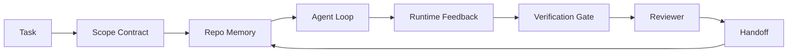

# Agente de Engenharia de Bancos de Trabalho: Por que os modelos capazes ainda falham ?

> Um modelo capaz não é suficiente. Agentes confiáveis precisam de um banco de trabalho: instruções, estado, alcance, feedback, verificação, revisão e entrega.

**Type:** Learn + Build | **类型:** 构建
**Languages:** Python (stdlib) | **语言:** Python (标准库)
**Prerequisites:** Phase 14 · 01 (Agent Loop), Phase 14 · 26 (Failure Modes) | **前置知识:** 见原文
**Time:** ~45 minutes | **时间:** 见原文

> - Não .**【前置】**學本節前 請先掌握:Fase 14·01(Agent Loop) 、Fase 14·26(Falha Modos) 。本節是后续 Fase 14·32-42(Workbench 系列 7 節) 进入门,讲为为什么"光有好模型不够"──

> - Não .**【类比】**O trabalho de um bom cozinheiro também é muito bom, mas não é suficiente, também é preciso ter um bom e bom preparador.

## Objetivos de aprendizagem

- Capacidade de modelo separada da confiabilidade da execução.
- Nomear as sete superfícies de trabalho que decidem se um agente desembarca.
- Compare uma corrida de apenas um momento com uma corrida guiada por banco de trabalho em uma pequena tarefa de repo.
- Produza um relatório de modo de falha que mapeie cada superfície perdida para o sintoma que causou.

## O problema é o problema da introdução

Você deixa um modelo de fronteira em um repo real e pede para adicionar validação de entrada. Ele abre quatro arquivos, escreve código plausível, declara sucesso e para. Você executa os testes. Dois falham. Um terceiro arquivo é tocado que não tinha nada a ver com a validação. Não há registro do que o agente assumiu, o que tentou primeiro, ou o que resta para fazer.

> Você coloca um modelo de vanguarda em um armazém de código real, deixe-o adicionar o certificado de entrada. Ele abre quatro arquivos, escreve código que pareça razoável, declara sucesso, então para. Você executa um teste.

O modelo não estava errado no Python, estava errado no trabalho, não tinha ideia do que contava como feito, onde era permitido escrever, quais testes eram autorizados, ou como a próxima sessão deveria começar.

> O modelo no Python não tem erros. Ele está no trabalho. Ele não sabe o que é planejado para ser feito. Permitir onde escrever. Que testes são de autoridade.


> **【中文解读】**O agente em real armazém análise das causas de falha: 1) instrução para seguir o falha  ignorar a conexão ou a capacidade de criar não existir; 2) expiração de todo o tempo da janela acima da janela para levar à perda de informações importantes; 3) erro acumulado  pequeno erro em várias etapas de execução em que o deslizamento aumentou; 4) falta de memória do projeto  desconhecimento da conexão e estrutura da janela abaixo da janela.

Não é um erro de modelo, é um erro de banco de trabalho, a superfície ao redor do agente está faltando as peças que transformam uma geração de um tiro em engenharia confiável e reutilizável.

> Não é um bug do modelo. É um bug do trabalho. A falta de superfície do agente em torno de si transformará uma geração única em uma parte de um projeto confiável e recuperável.

> O modelo de falha principal inclui: instruções para seguir o falha, ferramentas para usar erros, perdas de texto e raciocínio de cadeia.

## O conceito central.

Um banco de trabalho é o ambiente de operação que envolve o modelo durante uma tarefa.

> O modelo de falha principal inclui: instruções para seguir o falha, ferramentas para usar erros, perdas de texto e raciocínio de cadeia.

| Surface | What it carries | Failure when missing |
|---------|-----------------|----------------------|
| Instructions | Startup rules, forbidden actions, definition of done | Agent guesses what shipping means |
| State | Current task, touched files, blockers, next action | Each session restarts from zero |
| Scope | Allowed files, forbidden files, acceptance criteria | Edits leak into unrelated code |
| Feedback | Real command output captured into the loop | Agent declares success on a 400 |
| Verification | Tests, lint, smoke run, scope check | "Looks good" reaches main |
| Review | A second pass with a different role | Builder marks own homework |
| Handoff | What changed, why, what is left | Next session re-discovers everything |


> **【中文解读】**O agente em real armazém análise das causas de falha: 1) instrução para seguir o falha  ignorar a conexão ou a capacidade de criar não existir; 2) expiração de todo o tempo da janela acima da janela para levar à perda de informações importantes; 3) erro acumulado  pequeno erro em várias etapas de execução em que o deslizamento aumentou; 4) falta de memória do projeto  desconhecimento da conexão e estrutura da janela abaixo da janela.

O banco de trabalho é independente do modelo. Você pode trocar o modelo e manter as superfícies.

> 工作台独立于模型── você pode substituir o modelo e manter a superfície── você não pode substituir a superfície e manter a confiabilidade──

> O modelo de falha principal inclui: instruções para seguir o falha, ferramentas para usar erros, perdas de texto e raciocínio de cadeia.



O ciclo fecha-se no arquivo do estado, não no histórico do chat. O chat é volátil. O repo é o sistema de registro.

> O ciclo está fechado em arquivos de estado, em vez de em histórias de chat.

> O modelo de falha principal inclui: instruções para seguir o falha, ferramentas para usar erros, perdas de texto e raciocínio de cadeia.

### Bancos de trabalho versus engenharia rápida

A prompting diz ao modelo o que você quer nesta rodada. Um banco de trabalho diz ao modelo como fazer o trabalho entre rodadas e entre sessões. A maioria das histórias de falhas de agentes são falhas no banco de trabalho usando roupas de engenharia de prompt.

> 提示告诉模型这个轮你想要什么――工作台告诉模型如何跨轮次和跨会话做工作―― A maioria dos casos de falha do agente é de um tipo de falha.

> O modelo de falha principal inclui: instruções para seguir o falha, ferramentas para usar erros, perdas de texto e raciocínio de cadeia.

### Banco de trabalho versus quadro

Um framework dá-lhe um tempo de execução (LangGraph, AutoGen, Agents SDK). Um banco de trabalho dá ao agente um lugar para trabalhar dentro desse tempo de execução. Você precisa de ambos. Esta mini-track é sobre o segundo.

> 框架 gives you a running time (LangGraph, AutoGen, Agents SDK) ⋅工作台 give Agent a work place (Place de trabalho) ⋅ ambos necessários ⋅ esse pequeno tópico é sobre o segundo ⋅

> O modelo de falha principal inclui: instruções para seguir o falha, ferramentas para usar erros, perdas de texto e raciocínio de cadeia.

### Raciocínio a partir de primitivos, não a partir de taxonomias de fornecedores

Há muito a escrever sobre "engenharia de arneses" neste momento. Addy Osmani, OpenAI, Anthropic, LangChain, Martin Fowler, MongoDB, HumanLayer, Augment Code, Thoughtworks, a lista impressionante dos walkinglabs, e um ritmo constante de peças de Medium e Hacker News estão todos a carregar. Eles discordam sobre os limites do que é um arame, o que é de alcance e qual vocabulário usar. Não precisamos escolher um lado. As sete superfícies são uma camada de UX; sob cada banco de trabalho está o mesmo conjunto de sistemas distribuídos primitivos que seguram qualquer backend confiável.

> O modelo de falha principal inclui: instruções para seguir o falha, ferramentas para usar erros, perdas de texto e raciocínio de cadeia.

Desligue o rótulo do agente por um momento. Uma execução do agente é um cálculo que cruza tempo, processos e máquinas. Para tornar isso confiável você precisa dos mesmos primitivos que qualquer sistema de produção precisa.

> 暂时删除 标签 代理 标签 标签 标签 标签 标签 标签 标签 标签 标签 标签 标签 标签 标签 标签 标签 标签 标签 标签 标签 标签 标签 标签 标签 标签 标签 标签 标签 标签 标签 标签 标签 标签 标签 标签 标签 标签 标签 标签 标签 标签 标签 标签 标签 标签 标签 标签 标签 标签 标签 标签 标签 标签 标签 标签 标签 标签 标签 标签 标签 标签 标签 标签 标签 标签 标签 标签 标签 标签 标签 标签 标签 标签 标签 标签 标签 标签 标签 标签 标签 标签 标签 标签 标签 标签 标签 标 标 标 标 标 标 标 标 标 标 标 标 标 标 标 标 标 标 标 标 标 标 标 标 标 标 标 标 标 标 标 标 标 标 标 标 标 标 标 标 标 标 标 标 标 标 标 标 标 标 标 标 标 标 标 标 标 标 标 标 标 标 标 标 标 标 标 标 标 标 标 标 标 标 标 标 标 标 标 标 标 标 标 标 标 标 标 标 标 标 标 标 标 标 标 标 标 标 标 标 标 标 标 标 标 标 标 标 标 标 标 标 标 标 标 标 标 标 标 标 标 标 

> O modelo de falha principal inclui: instruções para seguir o falha, ferramentas para usar erros, perdas de texto e raciocínio de cadeia.

| Primitive | What it is | What it carries for an agent |
|-----------|------------|------------------------------|
| Function | Typed handler. Pure where possible. Owns its inputs and outputs. | A tool call, a rule check, a verification step, a model invocation |
| Worker | Long-lived process that owns one or more functions and a lifecycle | The builder, the reviewer, the verifier, an MCP server |
| Trigger | Event source that invokes a function | Agent loop tick, HTTP request, queue message, cron, file change, hook |
| Runtime | The boundary that decides what runs where, with what timeouts and resources | Claude Code's process, LangGraph's runtime, a worker container |
| HTTP / RPC | The wire between caller and worker | Tool-call protocol, MCP request, model API |
| Queue | Durable buffer between trigger and worker; back-pressure, retry, idempotency | The task board, the feedback log, the review inbox |
| Session persistence | State that survives crashes, restarts, model swaps | `agent_state.json`, checkpoints, KV stores, the repo itself |
| Authorization policy | Who can call what function with which scope | Allowed/forbidden files, approval boundaries, MCP capability lists |

Agora mapeem as sete superfícies de banco de trabalho para aqueles primitivos.

> O modelo de falha principal inclui: instruções para seguir o falha, ferramentas para usar erros, perdas de texto e raciocínio de cadeia.

- **Instructions** política + metadados funcionais.`AGENTS.md`) é a política associada ao início da fase de execução.
- **State** persistência de sessão. Um armazém com tecla lê o tempo de execução em cada passo. Arquivo, KV ou DB; a semântica de persistência importa, o backend de armazenamento não.
- **Scope** Política de autorização por tarefa. Globos permitidos/proibidos são um ACL. As aprovações necessárias são uma rede de permissões.
- **Feedback**Cada chamada de shell é um registro, durável, reprodutível.
- **Verification**Função determinista sobre entradas. Trigado em tarefa fechada. Falha fechada.
- **Review** um trabalhador separado com autorização de leitura apenas sobre os artefatos de construção e autorização de escrita apenas sobre os relatórios de revisão.
- **Handoff** um registro duradouro emitido por um gatilho de final de sessão.

O próprio loop do agente é um trabalhador que consome eventos (mensaje do usuário, resultado da ferramenta, marcação do temporizador), chama funções (o modelo, depois as ferramentas que o modelo escolhe), escreve registros (estado, feedback) e emite gatilhos (verificação, revisão, transferência).

> O modelo de falha principal inclui: instruções para seguir o falha, ferramentas para usar erros, perdas de texto e raciocínio de cadeia.

### Padrões em circulação, traduzidos para primitivos

Cada padrão popular de arnes reduz-se aos oito primitivos.

> O modelo de falha principal inclui: instruções para seguir o falha, ferramentas para usar erros, perdas de texto e raciocínio de cadeia.

| Vendor or community pattern | What it actually is |
|------------------------------|--------------------|
| Ralph Loop (Claude Code, Codex, agentic_harness book) — re-inject original intent into a fresh context window when the agent tries to stop early | A trigger that re-enqueues a task with a clean context; session persistence carries the goal forward |
| Plan / Execute / Verify (PEV) | Three workers, one per role, communicating via state and a queue between phases |
| Harness-compute separation (OpenAI Agents SDK, April 2026) — split control plane from execution plane | Restating control-plane / data-plane. Predates the agent label by decades |
| Open Agent Passport (OAP, March 2026) — sign and audit every tool call against a declarative policy before execution | An authorization policy enforced by a pre-action worker, with a signed audit queue |
| Guides and Sensors (Birgitta Böckeler / Thoughtworks) — feedforward rules + feedback observability | Authorization policy + verification functions + observability traces |
| Progressive compaction, 5-stage (Claude Code reverse engineering, April 2026) | A state-management worker that runs cron-like over session persistence to keep it within a budget |
| Hooks / middleware (LangChain, Claude Code) — intercept model and tool calls | Triggers + functions wrapped around the runtime's invocation path |
| Skills as Markdown with progressive disclosure (Anthropic, Flue) | A function registry where the function metadata is loaded into context just-in-time |
| Sandbox agents (Codex, Sandcastle, Vercel Sandbox) | The compute plane: a runtime with isolated filesystem, network, and lifecycle |
| MCP servers | Workers exposing functions over a stable RPC, with capability lists as authorization |

Cada entrada nessa tabela é a comunidade de agentes chegando a um primitivo que já tinha um nome em sistemas distribuídos e dando-lhe um novo.

> O modelo de falha principal inclui: instruções para seguir o falha, ferramentas para usar erros, perdas de texto e raciocínio de cadeia.

### O que dizem os recibos

A alegação de arneses sobre modelos tem números por trás agora. Vale a pena saber, porque eles são também o único argumento honesto contra "só espere por um modelo mais inteligente".

> O modelo de falha principal inclui: instruções para seguir o falha, ferramentas para usar erros, perdas de texto e raciocínio de cadeia.

- Terminal Bench 2.0  o mesmo modelo, mudança de arnes moveu um agente de codificação de fora do top 30 para o quinto lugar (LangChain, *Anatomy of an Agent Harness*).
- A Vercel  apagou 80% das ferramentas do seu agente; a taxa de sucesso passou de 80% para 100% (MongoDB).
- Harvey  agentes legais mais do que dobraram a precisão através da otimização de arneses sozinho (MongoDB).
- 88% dos projetos de agentes de IA em empresas não conseguem chegar à produção. Os falhas se agrupam em torno do tempo de execução, não em razão (preprints.org, *Harness Engineering for Language Agents*, março 2026).
- Um estudo de referência de 2025 em três frameworks de código aberto populares relatou ~50% de conclusão de tarefas; o WebAgent de longo contexto desmoronou de 40-50% para menos de 10% em condições de longo contexto, principalmente por loops infinitos e perda de metas (coberto amplamente no início de 2026 writeups).

O que se pode dizer é que os modelos absorvem os truques de arremesso ao longo do tempo. O que se pode dizer é que hoje em dia, a engenharia de carga é em torno do modelo, não dentro dele, e os primitivos que carregam essa carga são os que cada sistema de produção sempre precisa.

> 结论不是"harness 永远赢"──模型确实会随时间吸收 harness 技巧──结论是今天,承载工程重量是模型周围的部分,而不是模型内部的,承载这个重量的原语是每个生产系统一直需要的──

> O modelo de falha principal inclui: instruções para seguir o falha, ferramentas para usar erros, perdas de texto e raciocínio de cadeia.

### Onde as inscrições dos vendedores não são suficientes

É a parte em que não precisas de ser educado.

> O modelo de falha principal inclui: instruções para seguir o falha, ferramentas para usar erros, perdas de texto e raciocínio de cadeia.

- A anatomia de um agente de uso da LangChain enumera onze componentes: - pedidos, ferramentas, ganchos, caixas de areia, orquestração, memória, habilidades, subagentes e um "bucle estúpido" de execução.
- A Engenharia de Arneses de Addy Osmani faz a enquadramento.`Agent = Model + Harness`E o padrão de ratchet, mas não diz do que é feito um arame.
- O Antropic e o OpenAI vão mais fundo nas superfícies, mas permanecem dentro de seus próprios tempos de execução. O anúncio de "separação de arneses-computação" no Agents SDK de abril de 2026 é a primeira peça do fornecedor que endossa explícitamente a divisão controle-plano / plano de dados. Essa é uma ideia primitiva, não uma nova.
- O livro agentic_harness trata o arnes como um objeto de configuração (Jaymin West *Agentic Engineering*, capítulo 6) e a linha mais forte nele é "o arnes é o limite de segurança primário em um sistema agente". Isso é apenas política de autorização, reafirmado.
- Os fios de notícias de hackers continuam chegando no mesmo lugar. O fio de abril de 2026 *O arnes de agente pertence ao exterior da caixa de areia* argumenta que o arnes deve ficar "mais como um hipervisor que fica fora de tudo e autoriza o acesso com base no contexto e no usuário".

Não é preciso discordar de nenhuma destas peças para notar a lacuna. Eles estão escrevendo descrições UX de um sistema que já existe. Estamos escrevendo o sistema. Quando o sistema é construído corretamente, as sete superfícies caem dos primitivos. Quando é construído errado, nenhuma quantidade de`AGENTS.md`Polish corrige a fila que falta.

> O modelo de falha principal inclui: instruções para seguir o falha, ferramentas para usar erros, perdas de texto e raciocínio de cadeia.

Então, quando ouvirem "engenharia de arneses" noutros lugares, traduzam para primitivos. As instruções e as regras são políticas e funções. A plataforma é a hora de correr. Os guardrails são autorização + verificação. Os ganchos são gatilhos. A memória é a persistência da sessão. O Ralph Loop está em espera. Os subagentes são trabalhadores. As caixas de areia são aviões de computação. O vocabulário muda; a engenharia não. O banco de trabalho é a UX de frente para o agente; o arame, no sentido que sobrevive ao próximo requadro do fornecedor, é funções, trabalhadores, gatilhos, tempos de execução, filas, persistência e política conectados corretamente.

> O modelo de falha principal inclui: instruções para seguir o falha, ferramentas para usar erros, perdas de texto e raciocínio de cadeia.

## Construí-lo e realizei-o.
```figure
wb-seven-surfaces
```

## Construí-lo

`code/main.py`O script conta quais superfícies estavam faltando na execução falhada e imprime um relatório de modo de falha.

> O modelo de falha principal inclui: instruções para seguir o falha, ferramentas para usar erros, perdas de texto e raciocínio de cadeia.

A tarefa de repo é pequena a propósito: adicionar validação de entrada a um processador de estilo FastAPI de um arquivo e escrever um teste de aprovação.

> O modelo de falha principal inclui: instruções para seguir o falha, ferramentas para usar erros, perdas de texto e raciocínio de cadeia.

- É o que é ?

```
python3 code/main.py
```

Output: um registro lado a lado das duas corridas, a `failure_modes.json`Resumindo a corrida de ponta e um veredicto de uma linha para a corrida de trabalho.

> O modelo de falha principal inclui: instruções para seguir o falha, ferramentas para usar erros, perdas de texto e raciocínio de cadeia.

O agente é um pequeno pedaço baseado em regras; o ponto é as superfícies, não o modelo.

> O modelo de falha principal inclui: instruções para seguir o falha, ferramentas para usar erros, perdas de texto e raciocínio de cadeia.

## Use-o com o framework implementado.

Três lugares de trabalho já existem na natureza, mesmo que ninguém os chame assim:

> O modelo de falha principal inclui: instruções para seguir o falha, ferramentas para usar erros, perdas de texto e raciocínio de cadeia.

- **Claude Code, Codex, Cursor.** `AGENTS.md`E ...`CLAUDE.md`Os comandos de Slash são de alcance, os ganchos são de verificação.
- **LangGraph, OpenAI Agents SDK.**Os pontos de controlo e as lojas de sessões são a superfície do estado.
- **CI on a real repo.**Os testes, o feixe e a verificação de tipo são verificações. O modelo de relações públicas é entregue.

A engenharia de banco de trabalho é a disciplina de tornar essas superfícies explícitas e reutilizáveis, em vez de deixar cada equipe para redescobri-las.

> O modelo de falha principal inclui: instruções para seguir o falha, ferramentas para usar erros, perdas de texto e raciocínio de cadeia.

## Envia-o . Produto .

`outputs/skill-workbench-audit.md`É uma habilidade portátil que verifica um repo existente para as sete superfícies de banco de trabalho e relatórios que estão faltando, que são parciais e que são saudáveis.

> `outputs/skill-workbench-audit.md`É uma habilidade transplantable, auditando as sete áreas de trabalho existentes no armazém, relatando quais são as deficiências, quais são as partes existentes, quais são as condições de saúde. Coloca qualquer agente ao lado da configuração; ele vai dizer-te o que você deve corrigir primeiro.

> O modelo de falha principal inclui: instruções para seguir o falha, ferramentas para usar erros, perdas de texto e raciocínio de cadeia.

## Exercícios.

1. Escolha um repo onde já está executando um agente. Ponha as sete superfícies de 0 (falta) para 2 (saudável). Qual é a sua superfície mais fraca?
  Tradução do inglês para tradução do inglês:
2. Extensão`main.py`A verificação da porta de verificação teria pegado.
  Tradução do inglês para tradução do inglês:
3. Adicione uma oitava superfície para o seu próprio produto e justifique por que ele não desmorona em uma das sete existentes.
  Tradução do inglês para tradução do inglês:
4. Reexamine o roteiro com um agente de estúdio diferente que alucina uma escrita extra de arquivo.
  Tradução do inglês para tradução do inglês:
5. Mapa dos cinco modos de falha recorrentes da indústria da fase 14 · 26 nas sete superfícies.
  Tradução do inglês para tradução do inglês:

## Termos-chave .

| Term | What people say | What it actually means |
|------|----------------|------------------------|---|
| Workbench | "The setup" | Engineered surfaces around the model that make work reliable |  |
| Surface | "A doc" or "a script" | A named, machine-readable input the agent reads or writes every turn |  |
| System of record | "The notes" | The file the agent treats as truth when chat history is gone |  |
| Definition of done | "Acceptance" | An objective, file-backed checklist the agent cannot fake |  |
| Workbench audit | "Repo readiness check" | A pass over the seven surfaces that flags missing pieces before work begins |  |

## Mais leitura 延伸阅读

Leia estes como pontos de dados, não como autoridades. Cada um é uma taxonomia parcial. Traduza cada conceito de volta para um primitivo (função, trabalhador, gatilho, tempo de execução, HTTP / RPC, fila, persistência, política) antes de decidir se a adotar.

> O modelo de falha principal inclui: instruções para seguir o falha, ferramentas para usar erros, perdas de texto e raciocínio de cadeia.

Enquadros do fornecedor:

- [Addy Osmani, Agent Harness Engineering](https://addyosmani.com/blog/agent-harness-engineering/)- Não .`Agent = Model + Harness`e o padrão de ratchet; fino na infraestrutura
  Tradução do português:
- [LangChain, The Anatomy of an Agent Harness](https://blog.langchain.com/the-anatomy-of-an-agent-harness/) onze componentes: pedidos, ferramentas, ganchos, orquestração, caixas de areia, memória, habilidades, sub-gêneros, tempo de execução; omite filas, implantação, authz
  Tradução do português:
- [OpenAI, Harness engineering: leveraging Codex in an agent-first world](https://openai.com/index/harness-engineering/) A visão da equipe do Codex das superfícies em torno de seu tempo de execução
  Tradução do português:
- [OpenAI, Unrolling the Codex agent loop](https://openai.com/index/unrolling-the-codex-agent-loop/) o ciclo do agente reduzido a `while`sobre chamadas de função
  Tradução do português:
- [Anthropic, Effective harnesses for long-running agents](https://www.anthropic.com/engineering/effective-harnesses-for-long-running-agents) superfícies de longo horizonte dentro de um tempo de execução específico
  Tradução do português:
- [Anthropic, Harness design for long-running application development](https://www.anthropic.com/engineering/harness-design-long-running-apps) Notas de projeto aplicadas
  Tradução do português:
- [LangChain Deep Agents harness capabilities](https://docs.langchain.com/oss/python/deepagents/harness) Superfície de configuração de tempo de execução
  Tradução do português:

Peças de praticantes com detalhes utilizáveis:

- [Martin Fowler / Birgitta Böckeler, Harness engineering for coding agent users](https://martinfowler.com/articles/harness-engineering.html) guias (feedforward) + sensores (feedback); o enquadramento mais limpo da teoria do controlo
  Tradução do português:
- [HumanLayer, Skill Issue: Harness Engineering for Coding Agents](https://www.humanlayer.dev/blog/skill-issue-harness-engineering-for-coding-agents)"Não é um problema de modelo, é um problema de configuração"
  Tradução do português:
- [MongoDB, The Agent Harness: Why the LLM Is the Smallest Part of Your Agent System](https://www.mongodb.com/company/blog/technical/agent-harness-why-llm-is-smallest-part-of-your-agent-system) Receitas: Vercel 80% a 100%, Harvey 2x precisão, Terminal Bench Top 30 a Top 5
  Tradução do português:
- [Augment Code, Harness Engineering for AI Coding Agents](https://www.augmentcode.com/guides/harness-engineering-ai-coding-agents) restrição-primeira passagem
  Tradução do português:
- [Sequoia podcast, Harrison Chase on Context Engineering Long-Horizon Agents](https://sequoiacap.com/podcast/context-engineering-our-way-to-long-horizon-agents-langchains-harrison-chase/) Preocupando-se com o tempo de execução em relação às preocupações com o modelo
  Tradução do português:

Livros, artigos e implementações de referência:

- [Jaymin West, Agentic Engineering — Chapter 6: Harnesses](https://www.jayminwest.com/agentic-engineering-book/6-harnesses) Tratamento de comprimento de livro, trata o arame como o limite de segurança primário
  Tradução do português:
- [preprints.org, Harness Engineering for Language Agents (March 2026)](https://www.preprints.org/manuscript/202603.1756) enquadramento acadêmico como controlo / agência / tempo de execução
  Tradução do português:
- [walkinglabs/awesome-harness-engineering](https://github.com/walkinglabs/awesome-harness-engineering) Lista de leitura curada em todo o contexto, avaliação, observabilidade, orquestração
  Tradução do português:
- [ai-boost/awesome-harness-engineering](https://github.com/ai-boost/awesome-harness-engineering) lista de seleção alternativa (ferramentas, avaliações, memória, MCP, permissões)
  Tradução do português:
- [andrewgarst/agentic_harness](https://github.com/andrewgarst/agentic_harness) implementação de referência pronta para produção com suíte de memória e avaliação com apoio da Redis
  Tradução do português:
- [HKUDS/OpenHarness](https://github.com/HKUDS/OpenHarness) Arnes de agente aberto com agente pessoal incorporado
  Tradução do português:

Os fios de Hacker News vale a pena ler para os desentendimentos, não para o consenso:

> O modelo de falha principal inclui: instruções para seguir o falha, ferramentas para usar erros, perdas de texto e raciocínio de cadeia.

- [HN: Effective harnesses for long-running agents](https://news.ycombinator.com/item?id=46081704)
  Tradução do português:
- [HN: Improving 15 LLMs at Coding in One Afternoon. Only the Harness Changed](https://news.ycombinator.com/item?id=46988596)
  Tradução do português:
- [HN: The agent harness belongs outside the sandbox](https://news.ycombinator.com/item?id=47990675) argumenta para a autorização como plano separado
  Tradução do português:

Referências cruzadas dentro deste currículo:

- Fase 14 · 23  Convenções OpenTelemetry GenAI: a camada de observabilidade que a literatura dos sensores aponta para
- Fase 14 · 26  Catálogo de modos de falha as sete superfícies são projetadas para absorver
- Fase 14 · 27  Defensas de injecção rápida que se encontram na base da política de autorização
- Fase 14 · 29  Tempos de execução de produção (fila, evento, cron): onde os primitivos desta lição vivem em implantação
