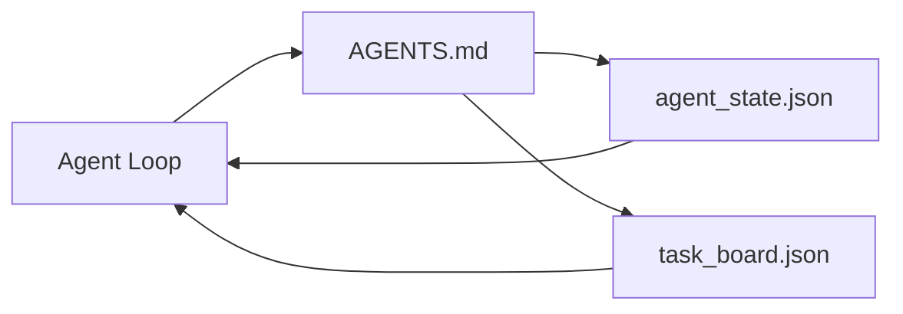

# O Minimal Agent Workbench.

> O banco de trabalho mais pequeno e útil é de três arquivos: um roteador de instruções raiz, um arquivo de estado e um painel de tarefas. Tudo o resto é layered no topo. Se um repo não pode levar estes três, nenhum modelo vai salvá-lo.

**Type:** Build | **类型:** 构建
**Languages:** Python (stdlib) | **语言:** Python (标准库)
**Prerequisites:** Phase 14 · 31 (Why Capable Models Still Fail) | **前置知识:** 见原文
**Time:** ~45 minutes | **时间:** 见原文

> - Não .**【前置】**學本节前 請先掌握:Fase 14·31(Workbench 为什么需要)  本节实现最小可用工作台:3 个文件(root router、state、taskboard) 

> - Não .**【类比】**O roteador raiz, diga ao cozinheiro o que fazer hoje) ✓ ✓ ✓ ✓ ✓ ✓ ✓ ✓ ✓ ✓ ✓ ✓ ✓ ✓ ✓ ✓ ✓ ✓ ✓ ✓ ✓ ✓ ✓ ✓ ✓ ✓ ✓ ✓ ✓ ✓ ✓ ✓ ✓ ✓ ✓ ✓ ✓ ✓ ✓ ✓ ✓ ✓ ✓ ✓ ✓ ✓ ✓ ✓ ✓ ✓ ✓ ✓ ✓ ✓ ✓ ✓ ✓ ✓ ✓ ✓ ✓ ✓ ✓ ✓ ✓ ✓ ✓ ✓ ✓ ✓ ✓ ✓ ✓ ✓ ✓ ✓ ✓ ✓ ✓ ✓ ✓ ✓ ✓ ✓ ✓ ✓ ✓ ✓ ✓ ✓ ✓ ✓ ✓ ✓ ✓ ✓ ✓ ✓ ✓ ✓ ✓ ✓ ✓ ✓ ✓ ✓ ✓ ✓ ✓ ✓ ✓ ✓ ✓ ✓ ✓ ✓ ✓ ✓ ✓ ✓ ✓ ✓ ✓ ✓ ✓ ✓ ✓ ✓ ✓ ✓ ✓ ✓ ✓ ✓ ✓ ✓ ✓ ✓ ✓ ✓ ✓ ✓ ✓ ✓ ✓ ✓ ✓ ✓ ✓ ✓ ✓ ✓ ✓ ✓ ✓ ✓ ✓ ✓ ✓ ✓ ✓ ✓ ✓ ✓ ✓ ✓ ✓ ✓ ✓ ✓ ✓ ✓ ✓ ✓ ✓ ✓ ✓ ✓ ✓ ✓ ✓ ✓ ✓ ✓ ✓ ✓ ✓ ✓ ✓ ✓ ✓ ✓ ✓ ✓ ✓ ✓ ✓ ✓ ✓ ✓ ✓ ✓ ✓ ✓ ✓ ✓ ✓ ✓ ✓ ✓ ✓ ✓ ✓ ✓ ✓ ✓ ✓ ✓ ✓ ✓ ✓ ✓ ✓ ✓ ✓ ✓ ✓ ✓ ✓ ✓ ✓   ✓ ✓ ✓ ✓ ✓ ✓  ✓ ✓ ✓     ✓ ✓ ✓`CLAUDE.md`É o roteador,`memory/`É estado,`tasks/`É o quadro de tarefas.

## Objetivos de aprendizagem

- Defina os três arquivos que formam o banco de trabalho mínimo viável.
- Explique por que um roteador de raiz curto vence um monolitico longo `AGENTS.md`- Não .
- Construir um arquivo de estado que o agente possa ler em cada turno e escrever no final.
- Construir um painel de tarefas que sobreviva ao trabalho de várias sessões sem histórico de bate-papo.

## O problema é o problema da introdução

A maioria das equipes atinge um banco de trabalho escrevendo uma linha de 3000 .`AGENTS.md`O modelo carrega-o, ignora as partes que não consegue resumir e ainda falha nas mesmas superfícies em que sempre falhou.

> A maioria das equipes passaram a escrever um 3000 de`AGENTS.md`Não se chama para concluir a busca de trabalho. O modelo carrega-o, ignora a parte que não pode ser resumida, ainda falha na mesma superfície.

O que é preciso é o contrário. Um pequeno arquivo raiz que encaminha o agente para arquivos mais profundos apenas quando relevante. Estado duradouro o agente lê antes de agir e escreve depois. Um quadro de tarefas que diz o que está em voo, o que é bloqueado e o que é o que vem a seguir.

> Você precisa de uma prática oposta. Um pequeno documento raiz, apenas em relação ao Agente, irá ser encaminhado para um documento mais profundo. Agente em estado permanente de entrada de uma ação antes de ler, depois de escrever.


> **【中文解读】**O objetivo é que os alunos compreendam o papel e a interação de cada componente.

Três arquivos, cada um com um trabalho, cada um com capacidade de leitura automática suficiente para evoluir para um sistema real mais tarde.

> Três documentos. Cada um tem suas próprias responsabilidades. Cada um é suficiente para ser lido por máquinas para que posteriormente se desenvolva para um sistema real.

> O Minimum Agent Workbench é um ambiente de menor quantidade de comportamento de agentes para experimentação e regulação. Ele fornece um espaço de execução isolado e ferramentas de análise de trajetória detalhadas.

## O conceito central.




> **【中文解读】**O objetivo é que os alunos compreendam o papel e a interação de cada componente.

### AGENTS.md é um roteador, não um manual

Um bom .`AGENTS.md`É curto, aponta o agente para:

> O Minimum Agent Workbench é um ambiente de menor quantidade de comportamento de agentes para experimentação e regulação. Ele fornece um espaço de execução isolado e ferramentas de análise de trajetória detalhadas.

- O arquivo do estado (onde você está).
- O quadro de tarefas (o que resta).
- As regras mais profundas (em`docs/agent-rules.md`)).
- O comando de verificação (como saber se funciona).

Qualquer coisa mais longa vai para documentos mais profundos, carregados apenas quando necessário, manuais longos são ignorados, roteadores curtos são seguidos.

> O conteúdo mais longo é colocado em arquivos mais profundos, apenas no momento de necessidade.

> O Minimum Agent Workbench é um ambiente de menor quantidade de comportamento de agentes para experimentação e regulação. Ele fornece um espaço de execução isolado e ferramentas de análise de trajetória detalhadas.

### agent_state.json é o sistema de registro

O estado carrega: o ID da tarefa ativa, os arquivos tocados, as suposições feitas, os bloqueadores e a ação seguinte. O agente lê-o em cada turno. A próxima sessão lê-o em vez de reproduzir o bate-papo.

> O Minimum Agent Workbench é um ambiente de menor quantidade de comportamento de agentes para experimentação e regulação. Ele fornece um espaço de execução isolado e ferramentas de análise de trajetória detalhadas.

O estado vive num ficheiro porque o histórico de bate-papo é improvável, as sessões morrem, as conversas são cortadas, o ficheiro não.

> O estado está presente nos documentos, pois o histórico do chat é improvável.

> O Minimum Agent Workbench é um ambiente de menor quantidade de comportamento de agentes para experimentação e regulação. Ele fornece um espaço de execução isolado e ferramentas de análise de trajetória detalhadas.

### task_board.json é a fila

O quadro de tarefas realiza todas as tarefas com status `todo | in_progress | done | blocked`É a fila que o agente tira quando o estado está vazio, e a fila que você lê quando quer saber se o agente está no caminho certo.

> O Minimum Agent Workbench é um ambiente de menor quantidade de comportamento de agentes para experimentação e regulação. Ele fornece um espaço de execução isolado e ferramentas de análise de trajetória detalhadas.

Uma tarefa no quadro tem uma identificação, um objetivo, um proprietário (`builder`- Não .`reviewer`, ou `human`O quadro é pequeno de propósito: quando cresce além de uma tela, há um problema de planeamento, não um problema de quadro.

> O Minimum Agent Workbench é um ambiente de menor quantidade de comportamento de agentes para experimentação e regulação. Ele fornece um espaço de execução isolado e ferramentas de análise de trajetória detalhadas.

### Três arquivos é o chão, não o teto.

As aulas posteriores adicionam contratos de alcance, corredores de feedback, portas de verificação, listas de revisores e pacotes de entrega.

> O curso seguinte irá adicionar o âmbito de acordo, controlador, controle de certificação, revisor, checklist e pacotes de ligação.

> O Minimum Agent Workbench é um ambiente de menor quantidade de comportamento de agentes para experimentação e regulação. Ele fornece um espaço de execução isolado e ferramentas de análise de trajetória detalhadas.

## Construí-lo e realizei-o.
```figure
wb-three-files
```

## Construí-lo

`code/main.py`escreve o banco de trabalho mínimo em um repo vazio e demonstra que um único agente transforma que:

> O Minimum Agent Workbench é um ambiente de menor quantidade de comportamento de agentes para experimentação e regulação. Ele fornece um espaço de execução isolado e ferramentas de análise de trajetória detalhadas.

1. - Está a ler .`agent_state.json`- Não .
2. Retira a próxima tarefa de `task_board.json`Se o estado estiver vazio.
3. Toca num único arquivo dentro do escopo.
4. Está a escrever o estado atualizado.

- É o que é ?

```
python3 code/main.py
```

O roteiro cria`workdir/`Depois, coloca os três arquivos ao lado de si, faz uma volta e imprime a diferença.

> O Minimum Agent Workbench é um ambiente de menor quantidade de comportamento de agentes para experimentação e regulação. Ele fornece um espaço de execução isolado e ferramentas de análise de trajetória detalhadas.

## Use-o com o framework implementado.

Dentro dos produtos de agentes de produção, os mesmos três arquivos aparecem sob nomes diferentes:

> O Minimum Agent Workbench é um ambiente de menor quantidade de comportamento de agentes para experimentação e regulação. Ele fornece um espaço de execução isolado e ferramentas de análise de trajetória detalhadas.

- **Claude Code:** `AGENTS.md`ou `CLAUDE.md`para o roteador, `.claude/state.json`- Lojas de estilo para o Estado, ganchos para o conselho.
- **Codex / Cursor:**regras de espaço de trabalho para o roteador, memória de sessão para estado, tarefas em fila na barra lateral do chat para o painel.
- **Custom Python agent:**Os mesmos ficheiros que acabaste de escrever.

Os nomes mudam, mas a forma não.

## Padrões de produção em silêncio

O banco de trabalho mínimo sobrevive ao contato com monorepos reais quando três padrões são superimposados sobre ele.

> O Minimum Agent Workbench é um ambiente de menor quantidade de comportamento de agentes para experimentação e regulação. Ele fornece um espaço de execução isolado e ferramentas de análise de trajetória detalhadas.

**Nested `AGENTS.md` with nearest-wins precedence.**Naves OpenAI 88 `AGENTS.md`Todos os arquivos do repo principal, um por subcomponente.`AGENTS.md`Os ficheiros do subdirectório ampliam o ficheiro raiz.`AGENTS.override.md`O mecanismo de sobreposição é específico do Codex e é evitado para o trabalho transversal.`AGENTS.md`Os arquivos dão um salto de qualidade equivalente a atualizar de Haiku para Opus; os piores fazem a saída pior do que nenhum arquivo.

**Anti-patterns to refuse, even when they look like coverage.**Instruções conflitantes deixam silenciosamente cair o agente do modo interativo para o modo ganancioso (ICLR 2026 AMBIG-SWE: 48,8% → 28% taxa de resolução); número as prioridades em vez de empilhá-las em plano. Regras de estilo não verificáveis (" Siga o Guia de Estilo do Python do Google ") sem comando de execução deixe o agente inventar conformidade; emparejar cada regra de estilo com o comando de lint exato. Levar com estilo em vez de comandos enterra o caminho de verificação; comandos primeiro, estilo último. Escrever para humanos em vez de agentes desperdiça o orçamento contextual; a concisionidade é uma característica.

**Cross-tool symlinks.**Um único arquivo raiz com links simbólicos (`ln -s AGENTS.md CLAUDE.md`- Não .`ln -s AGENTS.md .github/copilot-instructions.md`- Não .`ln -s AGENTS.md .cursorrules`O sistema de codificação mantém todos os agentes da mesma fonte de verdade.`nx ai-setup`automatiza isso em Claude Code, Cursor, Copilot, Gemini, Codex e OpenCode a partir de uma única configuração.

## Envia-o . Produto .

`outputs/skill-minimal-workbench.md`gera o banco de trabalho de três arquivos para qualquer novo repo: um `AGENTS.md`O roteador é ajustado ao projeto, um `agent_state.json`com as chaves certas, e um `task_board.json`A produção de produtos de base de base de base de base de base de base de base de base de base de base de base de base de base de base de base de base de base de base de base de base de base de base de base de base de base de base de base de base de base de base de base de base de base de base de base de base de base de base de base de base de base de base de base de base de base de base de base de base de base de base de base de base de base de base de base de base de base de base de base de base de base de base de base de base de base de base de base de base de base de base de base de base de base de base de base de base de base de base de base de base de base de base de base de base de base de base de base de base de base de base de base de base de base de base de base de base de base de base de base de base de base de base de base de base de base de base de base de base de base de base de base de base de base de base de base de base de base de base de base de base de base de base de base de base de base de base de base de base de base de base de base de base de base de base de base de base de base de base de base de base de base de base de base de base de base de base de base de base de base de base de base de base de base de base de base de base de base de base de base de base de base de base de base de base de base de base de base de base de base de base de base de base de base de base de base de base de base de base de base de base de base de base de base de base de base de base de base de base de base de base de base de base de base de base de base de base de base de base de base de base de base de base de base de base de base de base de base de base de base.

> O Minimum Agent Workbench é um ambiente de menor quantidade de comportamento de agentes para experimentação e regulação. Ele fornece um espaço de execução isolado e ferramentas de análise de trajetória detalhadas.

## Exercícios.

1. Adicionar um`last_run`marca de tempo para `agent_state.json`Recusar a execução se o ficheiro tiver mais de 24 horas, a menos que o operador o confirme.
  Tradução do inglês para tradução do inglês:
2. Adicionar um`priority`campo para o painel de tarefas e alterar o puller para sempre escolher a maior prioridade `todo`- Não .
  Tradução do inglês para tradução do inglês:
3. Migrem .`task_board.json`para linhas JSON para que cada tarefa seja uma linha e diferenças são limpas no controle de versão.
  Tradução do inglês para tradução do inglês:
4. Escreva um`lint_workbench.py`que falha se`AGENTS.md`É mais de 80 linhas ou refere-se a um arquivo que não existe.
  Tradução do inglês para tradução do inglês:
5. Decida qual dos três ficheiros mais prejudicaria perder.
  Tradução do inglês para tradução do inglês:

## Termos-chave .

| Term | What people say | What it actually means |
|------|----------------|------------------------|---|
| Router | `AGENTS.md` | Short root file that points the agent at deeper docs and files |  |
| State file | "The notes" | Machine-readable record of where the agent is, written every turn |  |
| Task board | "The backlog" | JSON queue of work with status, owner, acceptance |  |
| System of record | "Source of truth" | The file the workbench treats as authoritative when chat is gone |  |

## Mais leitura 延伸阅读

- [agents.md — the open spec](https://agents.md/) adoptado por Cursor, Codex, Claude Code, Copilot, Gemini, OpenCode
  Tradução do português:
- [Augment Code, A good AGENTS.md is a model upgrade. A bad one is worse than no docs at all](https://www.augmentcode.com/blog/how-to-write-good-agents-dot-md-files) salto de qualidade medido
  Tradução do português:
- [Blake Crosley, AGENTS.md Patterns: What Actually Changes Agent Behavior](https://blakecrosley.com/blog/agents-md-patterns) o que funciona empiricamente, o que não
  Tradução do português:
- [Datadog Frontend, Steering AI Agents in Monorepos with AGENTS.md](https://dev.to/datadog-frontend-dev/steering-ai-agents-in-monorepos-with-agentsmd-13g0) prioridade estabelecida na prática
  Tradução do português:
- [Nx Blog, Teach Your AI Agent How to Work in a Monorepo](https://nx.dev/blog/nx-ai-agent-skills) Geração de um único recurso em seis ferramentas
  Tradução do português:
- [The Prompt Shelf, AGENTS.md Best Practices: Structure, Scope, and Real Examples](https://thepromptshelf.dev/blog/agents-md-best-practices/) secção que ordena que sobrevive revisão
  Tradução do português:
- [Anthropic, Claude Code subagents and session store](https://docs.anthropic.com/en/docs/agents-and-tools/claude-code/sub-agents)
  Tradução do português:
- [Anthropic, Claude Code subagents](https://code.claude.com/docs/en/sub-agents)
- Fase 14 · 31  os modos de falha que este mínimo absorve
- Fase 14 · 34  o esquema de estado duradouro esta lição apresenta
