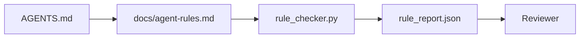

# Instruções do agente como restrições executáveis

> Instruções escritas como prosa são desejos. Instruções escritas como restrições são testes. O banco de trabalho transforma cada regra em algo que um agente pode verificar no tempo de execução e um revisor pode verificar depois do fato.

**Type:** Build | **类型:** 构建
**Languages:** Python (stdlib) | **语言:** Python (标准库)
**Prerequisites:** Phase 14 · 32 (Minimal Workbench) | **前置知识:** 见原文
**Time:** ~50 minutes | **时间:** 见原文

> - Não .**【前置】**O que é que se passa com o sistema de controle de dados?
> - Não .**【类比】**散文指示 vs 可执行约束 = "fazer bem o cozinho" vs "盐 não excede 5 克、油温 180 度、出前味味"──`CLAUDE.md`里写"测试通过才能提交"是散文,写"运行 pytest 必须返回 0 失败"是可执行约束──

## Objetivos de aprendizagem

- Separar a prosa de roteamento das regras operacionais.
- Regras de inicialização expressas, ações proibidas, definição de feito, manejo de incerteza e limites de aprovação como restrições verificáveis pela máquina.
- Implementar um verificador de regras que marque uma corrida contra o conjunto de regras.
- Torne a regra diferente para que a revisão possa ver o que mudou.

## O problema é o problema da introdução

Um típico .`AGENTS.md`Diz ao agente para "ser cuidadoso" e "testar minuciosamente" e "pergunte se não tem certeza". Três dias depois, o agente envia uma alteração sem testes, escreve para um diretório proibido e nunca pergunta porque nunca soube onde estava a linha.

> Um típico .`AGENTS.md`阅读起来像进入职档――它告诉代理要"小心""",彻底测试""",不确定就问"――三天后,Agenta 交付了没有测试的更改,写入了一个禁止目录,从不问因为它从不知道界限在哪里――

As instruções são poderosas quando são operacionais e fracas quando são aspiracionais.

> Instruções são fortes quando operacionais, fracas quando idealizadas.


> **【中文解读】**Para que as instruções sejam executáveis, não é apenas dizer ao Agente o que fazer, mas também codificar as restrições para regras de validação. Por exemplo, o uso de TypeScript rigoroso não é apenas um aviso, mas também deve ser feito através do TypeScript.

## O conceito central.

As regras pertencem a `docs/agent-rules.md`Cada regra tem um nome, uma categoria e um cheque.

> Regras de colocação`docs/agent-rules.md`Centro, distante de um pequeno caminho de raízes.

> A construção de um agente confiável é um modelo fundamental para a construção de um agente.




> **【中文解读】**Para que as instruções sejam executáveis, não é apenas dizer ao Agente o que fazer, mas também codificar as restrições para regras de validação. Por exemplo, o uso de TypeScript rigoroso não é apenas um aviso, mas também deve ser feito através do TypeScript.

### Cinco categorias que abrangem a maioria das regras

| Category | Question the rule answers | Example |
|----------|---------------------------|---------|
| Startup | What must be true before work begins? | "state file exists and is fresh" |
| Forbidden | What must never happen? | "do not edit `scripts/release.sh`" |
| Definition of done | What proves the task is complete? | "pytest exits 0 and acceptance line passes" |
| Uncertainty | What does the agent do when unsure? | "open a question note instead of guessing" |
| Approval | What requires human approval? | "any new dependency, any prod write" |

Uma regra que não se encaixa numa destas cinco geralmente quer ser duas regras.

> A construção de um agente confiável é um modelo fundamental para a construção de um agente.

### As regras são legíveis por máquina

Cada regra tem um artilheiro, uma categoria, uma descrição de uma linha e um`check`campo que nomeia uma função em `rule_checker.py`Adicionar uma regra significa adicionar um cheque; o checker cresce com o banco de trabalho.

> A construção de um agente confiável é um modelo fundamental para a construção de um agente.

### As regras são favoráveis a diferentes

As regras são vivas uma por cabeçalho em um único arquivo de marcação. Os renomes são visíveis em diferenças. As novas regras ficam no topo de sua categoria. As regras antigas são excluídas, não comentadas, porque o banco de trabalho é a fonte da verdade, não o registro de bate-papo de como a equipe se sentiu no último trimestre.

> A construção de um agente confiável é um modelo fundamental para a construção de um agente.

### Regras versus barris de quadro

Os barris de framework (OpenAI Agents SDK guardrails, LangGraph interrupts) aplicam regras no nível de tempo de execução. A regra estabelecida nesta lição é o contrato legível pelo ser humano, revisavel que esses barris de segurança implementam. Você precisa de ambos: o tempo de execução detecta violações durante uma volta, o conjunto de regras prova que o tempo de execução está fazendo a coisa certa.

> A construção de um agente confiável é um modelo fundamental para a construção de um agente.

## Construí-lo e realizei-o.
### Divulgação progressiva: um mapa, não uma enciclopédia

A razão .`AGENTS.md`O arquivo é de dois mil linhas, e o agente lê a primeira tela, fica sem orçamento de atenção e age em uma fração do que lhe foi dito. Um arquivo de instruções gigante falha pela mesma razão que um documento de embarque de quarenta páginas falha: o leitor o esmagia uma vez e nunca retorna à parte que importava.

O roteador raiz permanece pequeno o suficiente para ler cada sessão e não contém nada além de ponteiros. A profundidade vive nos arquivos de tópicos que o agente carrega apenas quando a tarefa os toca. Dê ao agente um mapa, não toda a enciclopédia, e deixe-o caminhar até a página que ele precisa.

```
AGENTS.md                  # router, < 50 lines: what this repo is, where to look, the 5 hard rules
docs/
  agent-rules.md           # the full rule set (this lesson)
  architecture.md          # loaded when the task touches module boundaries
  testing.md               # loaded when the task writes or runs tests
  deploy.md                # loaded only for release work, gated behind an approval rule
feature_list.json          # the backlog (Phase 14 · 36)
```

| Tier | Lives in | Read when | Size budget |
|------|----------|-----------|-------------|
| Router | `AGENTS.md` | Every session, always | Under ~50 lines |
| Rules | `docs/agent-rules.md` | Every session, on startup | One screen per category |
| Topic docs | `docs/<topic>.md` | Only when the task touches that topic | As deep as needed |

Dois testes mantêm a camada honesta. O teste de acessibilidade: um agente deve alcançar qualquer regra em no máximo dois saltos do roteador, de modo que o roteador deve vincular cada documento de tópico por caminho, não descrevê-lo em prosa. O teste de frescura: o roteador é curto o suficiente para que um revisor o leia novamente em cada PR, o que é a única coisa que impede que ele volte silenciosamente à enciclopédia que substituiu. Um ponteiro que não resolve mais é uma falha pior do que uma regra faltante, por isso um link quebrado no roteador é em si uma violação de verificação de inicialização.

```figure
wb-rule-checkoff
```

## Construí-lo

`code/main.py`Navios:

> `code/main.py`提供:

- `agent-rules.md`Parser que carrega regras em uma classe de dados.
- `rule_checker.py`funções de verificação de estilo, uma por `check`Referência.
- Um agente de demonstração que viola duas regras e um cheque que os apanha.

- É o que é ?

```
python3 code/main.py
```

Resultado: conjunto de regras analisadas, rastreamento de execução, pass/fail por regra, e um `rule_report.json`Salvou-se ao lado do roteiro.

> A construção de um agente confiável é um modelo fundamental para a construção de um agente.

## Padrões de produção em silêncio

Três padrões separam um conjunto de regras que dura um quarto de um que se decompõe em uma semana.

> A construção de um agente confiável é um modelo fundamental para a construção de um agente.

**Severity tagging at write time.**Todas as regras têm um significado .`severity`- Não .`block`- Não .`warn`, ou `info`O verificador informa os três; o tempo de execução só se recusa em`block`A maioria das equipes exagera a gravidade cedo e, em seguida, enfraquece-a silenciosamente sob pressão de prazo; etiquetar no momento de escrita força a calibração para a frente.`block`regra em um `overrides.jsonl`Registo de auditoria.

**Rule expiry as a forcing function.**Cada regra tem um .`expires_at`O verificador emite um aviso quando uma regra não expirada tiver tido violações zero durante 60 dias consecutivos; a próxima revisão trimestral justifica a sua manutenção, enfraquece-a para `info`Os dados da Cloudflare AI Code Review (abril de 2026, 131.246 revisões executadas em 5.169 repos em 30 dias) mostraram que os conjuntos de regras com expiração explícita permaneceram sob 30 regras por repo; conjuntos sem cresceram para 80 + com a maioria nunca disparando.

**Markdown-as-source, JSON-as-cache.** `agent-rules.md`é o arquivo de autor; `agent-rules.lock.json`O bloqueio é regenerado por um gancho pré-comit. as diferenças de marcação são revisaveis; a análise JSON permanece fora de cada virada. A mesma forma que`package.json`- Não .`package-lock.json`E ...`Cargo.toml`- Não .`Cargo.lock`- Não .

## Use-o com o framework implementado.

Em produção:

- Claude Code, Codex, Cursor lê as regras no início da sessão e cita-as quando recusa ações.
- Os barrancos do SDK OpenAI Agents registram as mesmas verificações que os barrancos de entrada e saída.
- O LangGraph interrompe o fogo quando um nó de voo viola uma regra.

O conjunto de regras é portátil em todos os três porque é apenas marcação mais nomes de funções.

> A construção de um agente confiável é um modelo fundamental para a construção de um agente.

## Envia-o . Produto .

`outputs/skill-rule-set-builder.md`Entrevista um proprietário de projecto, classifica as suas instruções de prosa existentes nas cinco categorias e emite uma versão `agent-rules.md`E um botão de verificação.

> `outputs/skill-rule-set-builder.md`Entrevista de proprietários de projetos, distribuir instruções de textos existentes, classificadas em cinco categorias, e traduzir em tradução.`agent-rules.md`E o meu sistema de controlo está presente.

> A construção de um agente confiável é um modelo fundamental para a construção de um agente.

## Exercícios.

1. Adicione uma sexta categoria se o seu produto realmente precisa dele.
  Tradução do inglês para tradução do inglês:
2. Extender o checker para que uma regra possa ter gravidade (`block`- Não .`warn`- Não .`info`) e os resultados do relatório são agregados em conformidade.
  Tradução do inglês para tradução do inglês:
3. Conectar o controlador para a CI: falhar na construção se uma regra de severidade de bloco falhar na última execução do agente.
  Tradução do inglês para tradução do inglês:
4. Adicione um campo "expirado" por regra. Após 90 dias sem falha de verificação, a regra é para revisão.
  Tradução do inglês para tradução do inglês:
5. Encontre um verdadeiro .`AGENTS.md`Quantas de suas linhas eram operacionais? Quantas eram aspiracionais?
  Tradução do inglês para tradução do inglês:

## Termos-chave .

| Term | What people say | What it actually means |
|------|----------------|------------------------|---|
| Operational rule | "A real instruction" | A rule the workbench can check at runtime |  |
| Aspirational rule | "Be careful" | A rule with no check; either delete or upgrade |  |
| Definition of done | "Acceptance" | An objective, file-backed proof the task is complete |  |
| Block severity | "Hard rule" | Violation halts the run; cannot be silenced without an operator |  |
| Rule expiry | "Stale rule sweep" | A rule with no fails in N days is up for retirement |  |

## Mais leitura 延伸阅读

- [OpenAI Agents SDK guardrails](https://platform.openai.com/docs/guides/agents-sdk/guardrails)
  Tradução do português:
- [OpenAI Agents SDK guardrails](https://openai.github.io/openai-agents-python/guardrails/)
- [LangGraph interrupts](https://langchain-ai.github.io/langgraph/how-tos/human_in_the_loop/breakpoints/)
  Tradução do português:
- [Anthropic, Building Effective Agents](https://www.anthropic.com/research/building-effective-agents)
  Tradução do português:
- [Rick Hightower, Agent RuleZ: A Deterministic Policy Engine](https://medium.com/@richardhightower/agent-rulez-a-deterministic-policy-engine-for-ai-coding-agents-9489e0561edf) bloqueio/alerta/informação severidade na produção
  Tradução do português:
- [Cloudflare, Orchestrating AI Code Review at Scale](https://blog.cloudflare.com/ai-code-review/) 131k revisões, aulas de composição de regras
  Tradução do português:
- [microservices.io, GenAI development platform — part 1: guardrails](https://microservices.io/post/architecture/2026/03/09/genai-development-platform-part-1-development-guardrails.html) Defesa profunda entre regras e CI
  Tradução do português:
- [Type-Checked Compliance: Deterministic Guardrails (arXiv 2604.01483)](https://arxiv.org/pdf/2604.01483) Lean 4 como limite superior da regra-como-check
  Tradução do português:
- [logi-cmd/agent-guardrails](https://github.com/logi-cmd/agent-guardrails) implementação do portão de fusão: âmbito de aplicação, teste de mutação, orçamentos de violação
  Tradução do português:
- Fase 14 · 32  o banco de trabalho mínimo este conjunto de regras cai em
- Fase 14 · 38  o portal de verificação que consome o relatório de regra
- Fase 14 · 39  o agente revisor que avalia a conformidade com as regras
