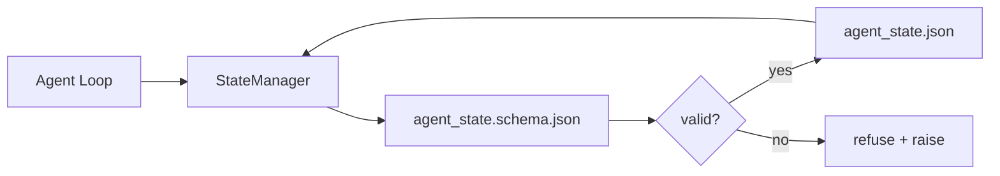

# Memória de reposição e estado duradouro  permanente  memória  estado  armazém

> O histórico de bate-papo é volátil, o repo é duradouro, o banco de trabalho armazena o estado do agente em arquivos versionados, para que a próxima sessão, o próximo agente e o próximo revisor todos leem a partir da mesma fonte de verdade.

**Type:** Build | **类型:** 构建
**Languages:** Python (stdlib + `jsonschema` optional) | **语言:** Python (标准库)
**Prerequisites:** Phase 14 · 32 (Minimal Workbench) | **前置知识:** 见原文
**Time:** ~60 minutes | **时间:** 见原文

> - Não .**【前置】**学本节前请先掌握:Fase 14·32(Minimal Workbench)。本节讲如何使用仓库本身(不是聊天历史)作为代理的"长期记忆"。
> - Não .**【类比】**História do chat = 短期記憶 (recepção de memória) 睡眠觉就忘),Repo memory = 笔记本 (recepção de memória) 写下来长期保留 (recepção de memória) 写下来长期保留 (recepção de memória) 写下来长期保留 (recepção de memória) 写下来长期保留 (recepção de memória) 写下来长期保留 (recepção de memória) 写下来长期保留 (recepção de memória) 写下文窗口会满,需要把关键信息写到 repo 里 (recepção de memória) 写下来长期保留 (recepção de memória) 写下记忆就忘), Repo memória = 笔记本 (recepção de memória) 写下来长期保留 (recepção de memória) 写下记本) 写下记本 (recepção de memória) 写下记本) 写下记本 (recepta de memória) 写下记本) 写下记本 (recepta) 写下记本) 写下记本 (recepta) 写下记) 写下记) 写下记) 写下记 (记) 写下记) 写下记) 写写下记 (记) 写写写写写写写) 写下写) 写下写下写下写下写下写) 写下写下写下回写下回写 (写) 写)`STATE.md`- Não.`DECISIONS.md`), a próxima vez que começar a ler estes documentos.

## Objetivos de aprendizagem

- Defina o que pertence à memória repo e o que pertence ao histórico de bate-papo.
- Autor JSON Schemas para `agent_state.json`E ...`task_board.json`- Não .
- Construir um gerente de estado que carregue, valida, muta e persista estado atomicamente.
- Use o esquema para recusar erros antes que eles corrompam a mesa de trabalho.

## O problema é o problema da introdução

O agente termina uma sessão. O chat fecha. A próxima sessão abre e pergunta onde começar. O modelo diz "deixe-me verificar os arquivos", lê notas obsoletas e refaz o trabalho que já estava concluído. Ou pior, reescreve um arquivo acabado porque ninguém lhe disse que o arquivo estava concluído.

> Agente 完成一会话──聊天关闭──下一个会话开开并问从哪里开始──模型说"让我检查文件",读取过时的笔记,重新做已经完成的工作──或更糟糕的是,它重写了已完成文件,因为没有人告诉它文件已完成──

A correção do banco de trabalho é a memória repo: o estado vive em arquivos JSON no repo, escrito sob um esquema, persistido de forma atômica, diferente na revisão de código.

> 工作台的修复是仓库记忆: o estado existe em JSON 文件在仓库中, em schema 下写入, atom化持久化, em código审查中友好 diff──聊天是瞬态流;仓库是记录的系统──


> **【中文解读】**仓库记忆与状态管理让代理维护对代码库的理解──两种记忆: 1) 结构性记忆文件树、依赖关系、API 接口; 2) 语义性记忆代码意图、设计决策、变更历史──状态管理确保代理在多轮交互中保持一致的代码库理解──

## O conceito central.




> **【中文解读】**仓库记忆与状态管理让代理维护对代码库的理解──两种记忆: 1) 结构性记忆文件树、依赖关系、API 接口; 2) 语义性记忆代码意图、设计决策、变更历史──状态管理确保代理在多轮交互中保持一致的代码库理解──

### O que pertence à memória repo

| Belongs | Does not belong |
|---------|-----------------|
| Active task id | Raw chat transcripts |
| Touched files this session | Token-level reasoning traces |
| Assumptions the agent made | "The user seemed frustrated" |
| Open blockers | Sampled completions |
| Next action | Vendor-specific model ids |

O teste é a durabilidade: será útil daqui a três meses numa reestruturação de CI?

> 仓库记忆和状态管理决策 代码仓库中上下文持久化问题──包括文件索引、变更追踪、依赖图维护等──

### Estado do primeiro esquema

O JSON Schema é o contrato. Sem ele, cada agente inventa novos campos, cada revisor aprende uma nova forma, e cada script de CI tem que ser especial caso versões passadas.

> 仓库记忆和状态管理决策 代码仓库中上下文持久化问题──包括文件索引、变更追踪、依赖图维护等──

O esquema abrange:

- - As chaves necessárias.
- Permitido .`status`- Os valores.
- Valores proibidos (por exemplo `null`para matrizes).
- Constrangimentos de padrão (identificadores de tarefas coincidem `T-\d{3,}`)).
- Campo de versão para migrações.

### Atomic escreve

O arquivo do estado é a fonte da verdade; um arquivo sem-escrito é pior do que nenhum arquivo.

> 仓库记忆和状态管理决策 代码仓库中上下文持久化问题──包括文件索引、变更追踪、依赖图维护等──

### Migrações

Quando o esquema mudar, enviar um script de migração ao lado do golpe do esquema.`schema_version`campo; o gerente recusa-se a carregar um arquivo a partir de uma versão que não pode migrar.

> 仓库记忆和状态管理决策 代码仓库中上下文持久化问题──包括文件索引、变更追踪、依赖图维护等──

## Construí-lo e realizei-o.
```figure
wb-state-persist
```

## Construí-lo

`code/main.py`Implementos:

- `agent_state.schema.json`E ...`task_board.schema.json`- Não .
- Um validador de apenas stdlib (subconjunto de JSON Schema: necessário, tipo, enum, padrão, itens).
- `StateManager.load`- Não .`StateManager.update`- Não .`StateManager.commit`com o tempo atômico e o renome.
- Uma demonstração que muda o estado, persiste, recarga e prova a viagem de ida e volta.

- É o que é ?

```
python3 code/main.py
```

O roteiro diz:`workdir/agent_state.json`E ...`workdir/task_board.json`, mutá-los em duas curvas e imprime o estado validado em cada passo.

> 仓库记忆和状态管理决策 代码仓库中上下文持久化问题──包括文件索引、变更追踪、依赖图维护等──

## Padrões de produção em silêncio

Quatro padrões transformam o mínimo da lição em algo que um monorepo multi-agente pode sobreviver.

> 仓库记忆和状态管理决策 代码仓库中上下文持久化问题──包括文件索引、变更追踪、依赖图维护等──

**Atomic temp-and-rename is not optional.**Um relatório de bugs do projeto Hive de março de 2026 documenta o modo de falha de forma limpa: `state.json`foi escrito através de `write_text()`O sistema de correção é sempre:`tempfile.mkstemp`No mesmo diretório do alvo, escrever:`fsync`- Não .`os.replace`Esta lição é uma lição de que o que eu quero dizer é que o que eu quero dizer é que eu quero que o meu pai me dê uma lição.`atomic_write`Faz exatamente isso.

**Idempotency keys on every non-idempotent tool call.**Se um agente falhar após ligar a uma ferramenta, mas antes de verificar o resultado, a recuperação retrata a chamada da ferramenta. Seguro para leituras; perigoso para e-mails, inserções de DB, uploads de arquivos. O padrão: registro de cada ID de chamada da ferramenta antes da execução em um `pending_calls.jsonl`. Em retest, verifique a identificação; se estiver presente, puxe a chamada e use o resultado armazenado em cache.

**Separate large artifacts from state.**Não armazenar CSVs, transcrições longas, ou arquivos gerados em `agent_state.json`. Salvar o artefato como um arquivo separado (ou fazer upload para armazenamento de objetos) e manter apenas o caminho em estado.

**Event sourcing for audit, snapshots for resume.**Aplicar a um registro de eventos (`state.events.jsonl`) em cada mutação; periodicamente , um instantâneo de `state.json`Resume lê o snapshot, e depois reproduz todos os eventos após o timestamp do snapshot. Isso custa mais disco, mas permite que você reproduzir as decisões do agente, literalmente, essencial quando se depura corridas de longo horizonte. A mesma forma que o Postgres usa internamente para WAL.

**Schema migrations or refuse to load.**O `schema_version`Quando o gerente carrega um arquivo em uma versão desconhecida, ele se recusa a ler. Envie um script de migração ao lado do schema bump; `tools/migrate_state.py`funciona de forma idempotente em todas as startups.

## Use-o com o framework implementado.

Em produção:

- **LangGraph checkpointers.**O ponto de verificação persiste no estado do gráfico para SQLite, Postgres ou um backend personalizado. O esquema que esta lição ensina é o que você alcança quando o ponto de verificação morre e você precisa ler o estado à mão.
- **Letta memory blocks.**Blocos persistentes com esquemas estruturados (Fase 14 · 08).
- **OpenAI Agents SDK session store.**Os backends plugáveis, conscientes de esquemas.

## Envia-o . Produto .

`outputs/skill-state-schema.md`gera um par de JSON Schema específico do projeto (estado + tabela), um Python `StateManager`- Sim. - Sim. - Sim. - Sim. - Sim. - Sim.

> 仓库记忆和状态管理决策 代码仓库中上下文持久化问题──包括文件索引、变更追踪、依赖图维护等──

## Exercícios.

1. Adicionar um`last_human_touch`Recusar qualquer agente a escrever dentro de cinco segundos de uma edição humana.
  Tradução do inglês para tradução do inglês:
2. Extender o validador para suportar `oneOf`Assim, uma tarefa pode ser uma tarefa de construção ou uma tarefa de revisão com diferentes campos necessários.
  Tradução do inglês para tradução do inglês:
3. Adicionar um`schema_version`campo e escrever a migração de v1 para v2 (renome `blockers`- Não .`risks`)).
  Tradução do inglês para tradução do inglês:
4. Mover o backend de armazenamento de um arquivo local para SQLite.`StateManager`A API é idêntica.
  Tradução do inglês para tradução do inglês:
5. E o que é que vai mal e como é que a renome atomizada te salva?
  Tradução do inglês para tradução do inglês:

## Termos-chave .

| Term | What people say | What it actually means |
|------|----------------|------------------------|---|
| Repo memory | "Notes file" | State stored in tracked files in the repo, under schema |  |
| Schema-first | "Validate inputs" | Define the contract before the writer, refuse drift |  |
| Atomic write | "Just rename" | Write to temp, fsync, rename, so partial failures cannot corrupt |  |
| Migration | "Schema bump" | A script that turns vN state into v(N+1) state |  |
| System of record | "Source of truth" | The artifact the workbench treats as authoritative |  |

## Mais leitura 延伸阅读

- [JSON Schema specification](https://json-schema.org/specification.html)
  Tradução do português:
- [LangGraph checkpointers](https://langchain-ai.github.io/langgraph/concepts/persistence/)
  Tradução do português:
- [Letta memory blocks](https://docs.letta.com/concepts/memory)
  Tradução do português:
- [Fast.io, AI Agent State Checkpointing: A Practical Guide](https://fast.io/resources/ai-agent-state-checkpointing/) Primeiro ponto de controlo com idempotencia
  Tradução do português:
- [Fast.io, AI Agent Workflow State Persistence: Best Practices 2026](https://fast.io/resources/ai-agent-workflow-state-persistence/) Controle de concurência, TTL, aquisição de eventos
  Tradução do português:
- [Hive Issue #6263 — non-atomic state.json writes silently ignored](https://github.com/aden-hive/hive/issues/6263) o modo de falha num projecto real
  Tradução do português:
- [eunomia, Checkpoint/Restore Systems: Evolution, Techniques, Applications](https://eunomia.dev/blog/2025/05/11/checkpointrestore-systems-evolution-techniques-and-applications-in-ai-agents/) Primíticas de CR do histórico do sistema operacional aplicadas a agentes
  Tradução do português:
- [Indium, 7 State Persistence Strategies for Long-Running AI Agents in 2026](https://www.indium.tech/blog/7-state-persistence-strategies-ai-agents-2026/)
  Tradução do português:
- [Microsoft Agent Framework, Compaction](https://learn.microsoft.com/en-us/agent-framework/agents/conversations/compaction) Gestor de pontos de controlo do fornecedor
  Tradução do português:
- Fase 14 · 08  Blocos de memória e cálculo do tempo de sono
- Fase 14 · 32  o mínimo de três arquivos esta lição esquematiza
- Fase 14 · 40  Pacotes de entrega leídos a partir do mesmo esquema
