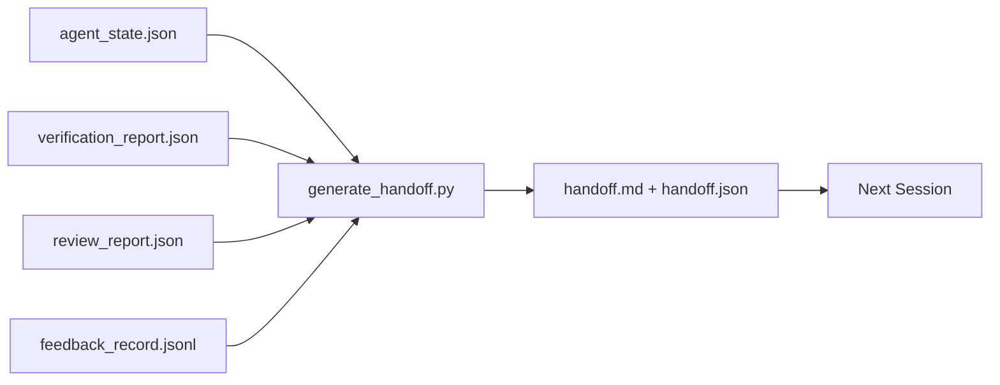

# Multi-Sessio de Entrega .

> O pacote de entrega é o artefato que transforma "o agente trabalhou por uma hora" em "a próxima sessão é produtiva no primeiro minuto".

**Type:** Build | **类型:** 构建
**Languages:** Python (stdlib) | **语言:** Python (标准库)
**Prerequisites:** Phase 14 · 34 (Repo Memory), Phase 14 · 38 (Verification), Phase 14 · 39 (Reviewer) | **前置知识:** 见原文
**Time:** ~50 minutes | **时间:** 见原文

> - Não .**【前置】**学本节前请先掌握:Fase 14·34(Repo Memória)、Fase 14·38(Verificação)、Fase 14·39(Revisor)。本节讲会话如何"交接班"──
> - Não .**【类比】**Pacote de entrega = 班次交接表──早班护士下班前写给晚班的"病病状摘要"不能靠晚班自己翻病历──Agente Uma reunião termina antes de uma reunião, deve gerar um conjunto de ligações estruturadas ((已完成、待办、决策、风险), 下次会议话或下次会议话 或 下次会议 1 分钟内进入状态──

## Objetivos de aprendizagem

- Identifique os sete campos que cada pacote de entrega precisa.
- Gerenciar uma transferência dos artefatos do banco de trabalho sem prosa manuscrita.
- Trimmar grandes registos de feedback em um resumo de tamanho de entrega.
- Torne a primeira ação da próxima sessão determinista.

## O problema é o problema da introdução

A sessão termina. O agente diz " ótimo, fizemos progressos. " A próxima sessão abre. O próximo agente pergunta "onde acabamos?" A resposta do primeiro agente desapareceu. O próximo agente redescobre, executa os mesmos comandos novamente, pergunta novamente ao humano as mesmas perguntas, e queima trinta minutos recuperando os últimos trinta segundos da sessão anterior.

> A primeira pergunta do primeiro agente foi desligada. O seguinte agente voltou a encontrar, re-executar a mesma ordem, reinterrogar o mesmo problema humano, passou 30 minutos a recuperar o conteúdo da última sessão.

O custo de uma má entrega é pago a cada sessão para a vida da tarefa. A correção é um pacote gerado automaticamente no final da sessão: o que mudou, porquê, o que foi tentado, o que falhou, o que resta, o que fazer primeiro na próxima vez.

> O preço da má comunicação é que cada reunião deve ser paga durante o ciclo de vida da missão. A revisão é um pacote gerado automaticamente no final da sessão: mudar o que, por que, tentar o que, falhar o que, deixar o que, fazer o que primeiro, na próxima vez.


> **【中文解读】**Quando uma reunião termina por um período de tempo excessivo, um token é limitado ou o usuário interrompe, um agente precisa passar o seguinte texto para a próxima reunião.

## O conceito central.




> **【中文解读】**Quando uma reunião termina por um período de tempo excessivo, um token é limitado ou o usuário interrompe, um agente precisa passar o seguinte texto para a próxima reunião.

### Sete campos em cada entrega.

| Field | Question it answers |
|-------|---------------------|
| `summary` | One paragraph of what was done |
| `changed_files` | The diff at a glance |
| `commands_run` | What was actually executed |
| `failed_attempts` | What was tried and why it did not work |
| `open_risks` | What could bite next session, with severity |
| `next_action` | The first concrete step next session takes |
| `verdict_pointer` | Path to the verification + review reports |

O `next_action`O campo é o que carrega, uma entrega com tudo menos...`next_action`É um relatório de estado, não uma transferência.

> Multidistribuição de informações entre os agentes de comunicação e de comunicação.

### As entregas são geradas, não escritas

Uma entrega escrita à mão é uma entrega que é ignorada em um dia difícil. O gerador lê os artefatos do banco de trabalho e emite o pacote. O trabalho do agente é deixar o banco de trabalho em um estado que o gerador pode resumir, não para escrever o resumo.

> Multidistribuição de informações entre os agentes de comunicação e de comunicação.

### Duas formas: legíveis para humanos e legíveis para máquinas

`handoff.md`É o que o ser humano lê.`handoff.json`O JSON ganha, e o JSON ganha, e o JSON ganha.

> Multidistribuição de informações entre os agentes de comunicação e de comunicação.

### Recorte de registro de feedback

O pleno`feedback_record.jsonl`A transferência carrega apenas o último K mais cada entrada com uma saída não zero. A próxima sessão carrega o registro completo se necessário, mas o pacote permanece pequeno.

> Multidistribuição de informações entre os agentes de comunicação e de comunicação.

## Construí-lo e realizei-o.
### Deixe um estado limpo

Uma entrega descreve o trabalho, um estado limpo torna o trabalho reiniciável.`handoff.md`O próximo agente passa os primeiros dez minutos limpando o último em vez de construir, e os custos compõem cada sessão para a vida da tarefa.

Assim, a sessão não termina quando o recurso funciona. Ela termina quando o banco de trabalho está em um estado que o gerador pode resumir e a próxima sessão pode confiar. A limpeza é sua própria fase, executada antes da entrega, e é um cheque, não um hábito, porque um hábito é a coisa que é saltada em um dia difícil.

| Check | Clean means | Dirty blocks because |
|-------|-------------|----------------------|
| Working tree | Every change committed or explicitly stashed with a note | A half-applied diff looks like intentional work to the next agent |
| Temp artifacts | No `*.tmp`, scratch dirs, debug prints, or commented-out blocks left behind | Stray files pollute the diff and the next agent's mental model |
| Tests | Green, or red with the failure named in `open_risks` | A silent red test is a trap the next session steps in |
| Feature board | `feature_list.json` status reflects reality (Phase 14 · 36) | A stale board sends the next session to work that is already done |
| Branch | On the expected branch, no detached HEAD, no orphan branches | Wrong branch means the next session's first commit lands in the wrong place |

A fase de limpeza emite um `clean_state.json`Uma lista vazia é a condição prévia que o gerador de entrega afirma antes de escrever um pacote. Uma entrega construída em uma árvore suja não é uma entrega, é uma confusão encaminhada. Os dois artefatos se partilham: limpeza prova que o banco de trabalho é seguro de sair, a entrega prova que a próxima sessão sabe onde começar.

```figure
wb-handoff-packet
```

## Construí-lo

`code/main.py`Implementos:

- Um carregador que reúne estado, veredicto, revisão e feedback em um único `WorkbenchSnapshot`- Não .
- A.`generate_handoff(snapshot) -> (markdown, payload)`função.
- Um filtro que seleciona as últimas entradas de feedback K mais todas as saídas não-zero.
- Uma demonstração que escreve`handoff.md`E ...`handoff.json`ao lado do roteiro.

- É o que é ?

```
python3 code/main.py
```

Saída: um corpo impresso, mais os dois ficheiros no disco.

> Multidistribuição de informações entre os agentes de comunicação e de comunicação.

## Padrões de produção em silêncio

Codex CLI, Claude Code e OpenCode enviam cada um uma história de compactação diferente; o pacote de entrega estruturado fica em cima de todos os três.

> Multidistribuição de informações entre os agentes de comunicação e de comunicação.

**Compaction strategies vary; the packet schema does not.**O POST /v1/responses/compact do Codex CLI é um blob AES opaco do lado do servidor (caminho rápido para os modelos OpenAI); o fallback é um "resumo de apoio" local anexado como um `_summary`O código Claude executa compactação progressiva de cinco etapas em 95% do contexto. O código OpenCode faz a ocultação de mensagens baseada em timestampes mais um resumo de LLM de 5 títulos. Três mecanismos diferentes, a mesma necessidade: serialize o que sobrevive à compressão em um artefato portátil. O pacote é esse artefato.

**Fresh-session handoff is not compaction.**A compactação prolonga uma sessão; a entrega fecha limpa uma e começa a próxima. A enquadramento da questão Hermes #20372 (abril 2026) é certa: quando a compressão no local começa a degradar, o agente deve escrever uma entrega compacta, terminar a sessão e retomar em um contexto novo. O pacote é o que faz essa transição barata. O erro é continuar a comprimir até que a qualidade desmorone; a solução é o orçamento para uma entrega rápida e limpa.

**One active handoff per branch and topic.**A coordenação multi-agente desintegra-se mais em entregas obsoletas do que em resultados de modelos ruins.`branch`- Não .`last_known_good_commit`, e um `status`de`active | superseded | archived`As entregas estáveis são arquivadas; apenas a ativa impulsiona a próxima sessão. Esta é a diferença entre as entregas como notas e as entregas como estado.

**Wrap up before 50-75% context, not at the wall.**O manual de desenhos manuscritos (CLAUDE.md + HANDOVER.md) relata melhores resultados quando a sessão termina com um orçamento de contexto de 50-75% em vez de 95%. O gerador de pacotes funciona limpo antes que artefatos de compressão poluam o estado de origem.

## Use-o com o framework implementado.

Padrões de produção:

- **Session-end hook.**O tempo de execução dispara o gerador quando o usuário fecha o chat.`outputs/handoff/<session_id>/`- Não .
- **PR template.**O marcador do gerador também é um órgão de relações públicas.
- **Cross-agent handoff.**Construir com um produto (Code Claude), continuar com outro (Codex).

O pacote é pequeno, regular e barato de produzir.

> Multidistribuição de informações entre os agentes de comunicação e de comunicação.

## Envia-o . Produto .

`outputs/skill-handoff-generator.md`produz um gerador sintonizado com os caminhos de artefatos de um projeto, um gancho de fim de sessão que o executa, e um `handoff.json`O próximo agente lê-se no arranque.

> Multidistribuição de informações entre os agentes de comunicação e de comunicação.

## Exercícios.

1. Adicionar um`assumptions_to_validate`campo que surge em todas as suposições que o construtor registrou mas o revisor não marcou acima de 1.
  Tradução do inglês para tradução do inglês:
2. Trim o resumo de feedback de forma diferente para corridas falhadas versus passagens. Defender a assimetria.
  Tradução do inglês para tradução do inglês:
3. Incluir uma lista de "perguntas para o ser humano".
  Tradução do inglês para tradução do inglês:
4. Torne o gerador idempotente: executá-lo duas vezes produz o mesmo pacote. O que precisa ser estável para que possa aguentar?
  Tradução do inglês para tradução do inglês:
5. Adicione uma seção "Preerecs de sessão seguinte" listando exatamente os artefatos que a próxima sessão deve carregar antes de agir.
  Tradução do inglês para tradução do inglês:

## Termos-chave .

| Term | What people say | What it actually means |
|------|----------------|------------------------|---|
| Handoff packet | "Session summary" | Generated artifact carrying the seven fields, both markdown and JSON |  |
| Next action | "What to do first" | The one concrete step that starts the next session |  |
| Feedback trim | "Log summary" | Last K records plus every non-zero exit |  |
| Status report | "What we did" | A document missing `next_action`; useful, but not a handoff |  |
| Verdict pointer | "Receipt" | Path to the verification + review reports for traceability |  |

## Mais leitura 延伸阅读

- [Anthropic, Effective harnesses for long-running agents](https://www.anthropic.com/engineering/effective-harnesses-for-long-running-agents)
  Tradução do português:
- [OpenAI Agents SDK handoffs](https://platform.openai.com/docs/guides/agents-sdk/handoffs)
  Tradução do português:
- [OpenAI Agents SDK handoffs](https://openai.github.io/openai-agents-python/handoffs/)
- [Codex Blog, Codex CLI Context Compaction: Architecture, Configuration, Managing Long Sessions](https://codex.danielvaughan.com/2026/03/31/codex-cli-context-compaction-architecture/) POST /v1/responsas/compacto e retrocesso local
  Tradução do português:
- [Justin3go, Shedding Heavy Memories: Context Compaction in Codex, Claude Code, OpenCode](https://justin3go.com/en/posts/2026/04/09-context-compaction-in-codex-claude-code-and-opencode) Comparar compactação entre três fornecedores
  Tradução do português:
- [JD Hodges, Claude Handoff Prompt: How to Keep Context Across Sessions (2026)](https://www.jdhodges.com/blog/ai-session-handoffs-keep-context-across-conversations/) CLAUDE.md + HANDOVER.md, 50-75% do orçamento contextual
  Tradução do português:
- [Mervin Praison, Managing Handoffs in Multi-Agent Coding Sessions: Fresh Context Without Losing Continuity](https://mer.vin/2026/04/managing-handoffs-in-multi-agent-coding-sessions-fresh-context-without-losing-continuity/) Estruturação de sistemas distribuídos
  Tradução do português:
- [Hermes Issue #20372 — automatic fresh-session handoff when compression becomes risky](https://github.com/NousResearch/hermes-agent/issues/20372)
  Tradução do português:
- [Hermes Issue #499 — Context Compaction Quality Overhaul](https://github.com/NousResearch/hermes-agent/issues/499) Pronúncias orientadas para a transferência no Codex CLI
  Tradução do português:
- [Microsoft Agent Framework, Compaction](https://learn.microsoft.com/en-us/agent-framework/agents/conversations/compaction)
  Tradução do português:
- [OpenCode, Context Management and Compaction](https://deepwiki.com/sst/opencode/2.4-context-management-and-compaction)
  Tradução do português:
- [LangChain, Context Engineering for Agents](https://www.langchain.com/blog/context-engineering-for-agents)
  Tradução do português:
- Fase 14 · 34  o arquivo de estado que o gerador lê
- Fase 14 · 38  o veredicto de verificação
- Fase 14 · 39  o relatório do revisor em conjunto com o pacote
