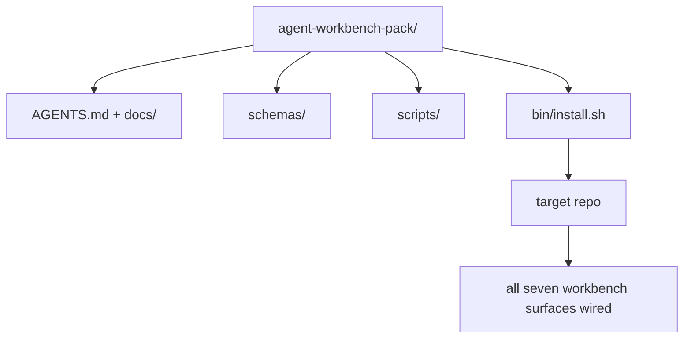

# Envie um agente reutilizável para o banco de trabalho .

> A mini-track termina com um pacote que você deixa em qualquer repo.`cp -r`A pedra angular é o artefato que este currículo trata.

**Type:** Build | **类型:** 构建
**Languages:** Python (stdlib) | **语言:** Python (标准库)
**Prerequisites:** Phases 14 · 31 to 14 · 41 | **前置知识:** 见原文
**Time:** ~75 minutes | **时间:** 见原文

> - Não .**【前置】**學本節前 請先掌握:Fase 14·31-41 全部 11 節 課程──本節是Fase 14的 Capstone (Capitstone) 顶点课),把所有工作桌 表面打包成可复用目录──
> - Não .**【类比】**O pacote de pedra-cabeça = 现成的厨房套件──前11节学到了"刀、板、、调料"分别怎么用,本节把它们装在一个盒子你拿到任何仓库`cp -r`É o que o Claude Code Cursor e outros instrumentos de "descrição de trabalho" pensam.

## Objetivos de aprendizagem

- Envolva as sete superfícies de banco de trabalho num único diretório.
- Enfiar os esquemas, scripts e modelos para que um novo repo obtenha uma linha de base conhecida.
- Adicionar um único script de instalação que coloque o pacote idempotentemente.
- Decida o que fica no rebanho e o que fica fora, defendendo o corte para cada um.

## O problema é o problema da introdução

Um banco de trabalho que vive em um Google Doc, um histórico de bate-papo e três scripts semi-lembrados é um banco de trabalho que é reconstruído a cada trimestre. A cura é um pacote de versões: um repo ou diretório com as superfícies, os esquemas, os scripts e um instalador de um comando.

> Uma plataforma de trabalho existente no Google 文档、聊天历史和三半记忆脚本, é uma plataforma de trabalho que deve ser reconstruída cada trimestre──修复 é uma embalagem de versões: uma que contém superfície、 esquema、脚本和一个命令安装器的仓库或目录──

Terás de terminar esta lição com:`outputs/agent-workbench-pack/`enviado em disco e um `bin/install.sh`que o coloca em qualquer repo alvo.

> Vais entregar no disco no fim da aula.`outputs/agent-workbench-pack/`E um .`bin/install.sh`Pode colocar-se em qualquer armazém de objetos.


> **【中文解读】**Agente Workbench 顶点项目:将将前面 11 课的所有概念整合到一个完整的编码 Agent 中──该 Agent 能够: 1) 了解项目结构和约定; 2) 执行范围受限的修改; 3) 运行验证门检查; 4) 通过审查员 Agent质检查; 5) 跨会话保持状态──这是最小可行生产 Agent的设计──

## O conceito central.




> **【中文解读】**Esta secção apresenta o conceito e o método de implementação do Agente de IA. O Agente é um sistema autónomo impulsionado pelo LLM, capaz de observar o ambiente, pensar decisões, executar a ação e ciclo de vida até a conclusão do objetivo.

### O layout do pacote

```
outputs/agent-workbench-pack/
├── AGENTS.md
├── docs/
│   ├── agent-rules.md
│   ├── reliability-policy.md
│   ├── handoff-protocol.md
│   └── reviewer-rubric.md
├── schemas/
│   ├── agent_state.schema.json
│   ├── task_board.schema.json
│   └── scope_contract.schema.json
├── scripts/
│   ├── init_agent.py
│   ├── run_with_feedback.py
│   ├── verify_agent.py
│   └── generate_handoff.py
├── bin/
│   └── install.sh
└── README.md
```

### O que fica dentro, o que fica fora

Em:

- Esquemas de superfície, são o contrato.
- Os quatro guiões acima são o tempo de execução.
- São as regras e a rubrica.

Fora:

- As tarefas pertencem ao banco de reservas do alvo, não ao pacote.
- O pacote é agnóstico.
- O grupo vive ao lado do grupo, não dentro dele.

### O instalador

Um breve .`bin/install.sh`(ou `bin/install.py`):

1. Recusar-se a instalar numa embalagem existente sem `--force`- Não .
2. Copia o pacote para o repo alvo.
3. - Cable para CI se um`.github/workflows/`- Não existe.
4. Imprima os próximos passos: preencha o quadro, define comandos de aceitação, execute o script init.

### Edição de versões

O pacote transporta um`VERSION`Os erros de esquema e alterações de script que exigem migrações aumentam o maior.`agent_state.json`Registros de que versão de pacote foi iniciado contra.

> Agente Workbench 毕业项目综合运用 阶段 14 所有知识, construção de um Agente de Classe de Produção em um armazém de código real.

## Construí-lo e realizei-o.
```figure
wb-pack-install
```

## Construí-lo

`code/main.py`reúne a embalagem em `outputs/agent-workbench-pack/`ao lado da lição, sementeado com os esquemas e roteiros das lições anteriores nesta mini-track e os documentos que já escreveu.

> Agente Workbench 毕业项目综合运用 阶段 14 所有知识, construção de um Agente de Classe de Produção em um armazém de código real.

- É o que é ?

```
python3 code/main.py
```

O script copia e pinha as superfícies, escreve o README, imprime a árvore de pacotes e sai do zero.

> Agente Workbench 毕业项目综合运用 阶段 14 所有知识, construção de um Agente de Classe de Produção em um armazém de código real.

## Padrões de produção em silêncio

Um pacote só é valioso se sobreviver a garfos, atualizações e um ambiente hostil.

> Agente Workbench 毕业项目综合运用 阶段 14 所有知识, construção de um Agente de Classe de Produção em um armazém de código real.

**`VERSION` is the contract, not the marketing.**Os problemas principais exigem uma migração de estado, os problemas menores exigem uma revisão, os problemas de parche são apenas de documentos.`.workbench-version`no repo-alvo em cada instalação; `lint_pack.py`recusa-se a enviar se a fechadura do alvo não estiver de acordo com a do pacote `VERSION`É assim que ...`npm`- Não .`Cargo`, e `pyproject.toml`sobrevivem a 10 anos de guerra, nada nos agentes muda as regras.

**Single source for cross-tool distribution.**Nx navios um `nx ai-setup`que descreve`AGENTS.md`- Não .`CLAUDE.md`- Não .`.cursor/rules/`- Não .`.github/copilot-instructions.md`O pacote deve fazer o mesmo; o instalador emite os links de sim (`ln -s AGENTS.md CLAUDE.md`A forma de forjar o pacote para apoiar uma ferramenta sobre outra é um modo de falha.

**`uninstall.sh` that refuses on non-trivial state.**Desinstalar o pacote não deve excluir os dados do utilizador `agent_state.json`- Não .`task_board.json`, ou `outputs/`O desinstalador remove os esquemas, scripts, documentos e...`AGENTS.md`(com `--keep-agents-md`O Estado pertence ao utilizador, o pacote não o possui.

**Skill-as-publishable. SkillKit-style distribution.**As embarcações de pacote como habilidade do SkillKit: `skillkit install agent-workbench-pack`O pacote repo é a fonte da verdade; o SkillKit é o canal de distribuição. O bloqueio do vendedor desmorona; as sete superfícies permanecem as mesmas.

## Use-o com o framework implementado.

Três lugares os navios de embalagem:

- **As a directory you drop into a repo.** `cp -r outputs/agent-workbench-pack /path/to/repo`- Não .
- **As a public template repo.**Forca e personalização, com `VERSION`Controlar a deriva.
- **As a SkillKit skill.**Conectado ao seu produto de agente para que um único comando o descreva.

O pacote é a receita, cada instalação é uma porção.

> Agente Workbench 毕业项目综合运用 阶段 14 所有知识, construção de um Agente de Classe de Produção em um armazém de código real.

## Envia-o . Produto .

`outputs/skill-workbench-pack.md`gera um pacote de projetos: regras aprimoradas para a história da equipa, globos de alcance combinados com o repo, dimensões rubricas estendidas com uma entrada específica de domínio.

> Agente Workbench 毕业项目综合运用 阶段 14 所有知识, construção de um Agente de Classe de Produção em um armazém de código real.

## Exercícios.

1. Decida qual o quinto documento opcional merece a promoção para o pacote canônico.
  Tradução do inglês para tradução do inglês:
2. Reescrever o instalador como Python com um `--dry-run`Compare a ergonomia com a bash.
  Tradução do inglês para tradução do inglês:
3. Adicionar um`bin/uninstall.sh`O que é considerado não trivial?
  Tradução do inglês para tradução do inglês:
4. Adicionar um`lint_pack.py`que falha quando o pacote se desloca de `VERSION`Entregue-o para a CI para o repo do grupo.
  Tradução do inglês para tradução do inglês:
5. Autor do manual de migração de um banco de trabalho rolado à mão para este pacote.
  Tradução do inglês para tradução do inglês:

## Termos-chave .

| Term | What people say | What it actually means |
|------|----------------|------------------------|---|
| Workbench pack | "The starter kit" | A versioned directory carrying all seven surfaces |  |
| Installer | "Setup script" | `bin/install.sh` that lays the pack down idempotently |  |
| Pack version | "VERSION" | Major bumps for schema/script changes, patch for doc-only |  |
| Drop-in pack | "cp -r and go" | Pack works without per-repo customization on day one |  |
| Forkable template | "GitHub template" | Public repo that GitHub's "Use this template" can clone from |  |

## Mais leitura 延伸阅读

- Fases 14 · 31 a 14 · 41  cada superfície que este pacote agrega
- [SkillKit](https://github.com/rohitg00/skillkit) instalar esta habilidade em 32 agentes de IA
  Tradução do português:
- [Nx Blog, Teach Your AI Agent How to Work in a Monorepo](https://nx.dev/blog/nx-ai-agent-skills) Gerador de fonte única em seis ferramentas
  Tradução do português:
- [agents.md — the open spec](https://agents.md/) o que o roteador da sua embalagem deve implementar
  Tradução do português:
- [HKUDS/OpenHarness](https://github.com/HKUDS/OpenHarness) Implementação de referência de um equivalente de embalagem
  Tradução do português:
- [andrewgarst/agentic_harness](https://github.com/andrewgarst/agentic_harness) Referência com back-up redis com suite eval
  Tradução do português:
- [Augment Code, A good AGENTS.md is a model upgrade](https://www.augmentcode.com/blog/how-to-write-good-agents-dot-md-files) embalagem de documentos bar de qualidade
  Tradução do português:
- [Anthropic, Effective harnesses for long-running agents](https://www.anthropic.com/engineering/effective-harnesses-for-long-running-agents)
  Tradução do português:
- [Anthropic, Harness design for long-running application development](https://www.anthropic.com/engineering/harness-design-long-running-apps)
  Tradução do português:
- Fase 14 · 30  Desenvolvimento de agente orientado para avaliação que consome o portal de verificação da embalagem
- Fase 14 · 41  o índice de referência antes/após esta embalagem melhora em
